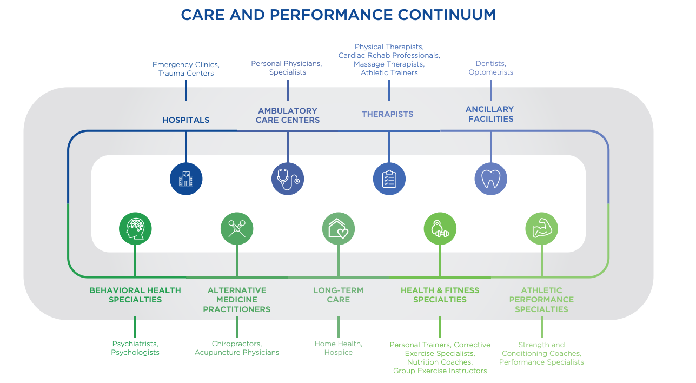

# Introduction

+ Corrective exercise: The systematic process of identifying a neuromusculoskeletal dysfunction, developing a plan of action, and implementing an integrated corrective strategy.
+ Primary objective: optimize movement quality
+ Benefits: enhances performance, results, injury resistance, movement efficiency, and recovery.
+ Approach: minimizing less-than-ideal motor recruitment strategies that result in observable postural distortion and movement impairment.
+ Corrective Exercise Continuum: 
  + identify problem: assessments: static, dynamic, transitional, mobility
  + solve problem: 
    + inhibit (myofasical techniques.) , reduce tension and overactive tissues
    + lengthen (static, neuromuscular, dynamic stretching), extensibility and ROM
    + activate (isolated strengthening), activate underactive tissues
    + integrate (integrated dynamic movement), rertrain synergistic functions
  + implement solution: techniques, movement prep sequences
+ Regional Interdependence (RI) model: site of a patient’s primary complaint or symptoms is affected by dysfunction in remote musculoskeletal regions.
+ Scope of practice
  + post-rehabilitative treatment to optimal performance
  + CE: no present injury or symptoms
  + CE and healthcare provider clearance: treatment completed, cleared to resume activity
  + healthcare provider only: current injury/ symptoms
+ Skills
  + assessment
  + program design

## Pain

+  biopsychosocial model of pain: Treatment paradigm for chronic musculoskeletal pain that accounts for the role of biological, psychological, and social factors in an individual’s experience of pain.
+ Corrective Exercise Specialists should not assume client pain originates in musculoskeletal dysfunction and should refer their client to the appropriate licensed healthcare provider when necessary.