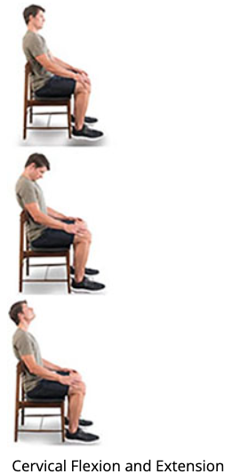
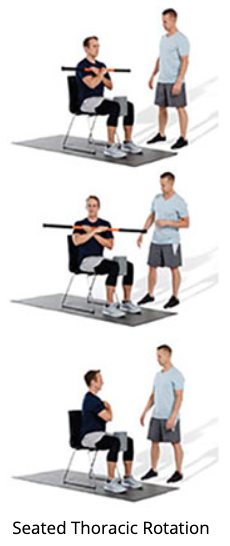
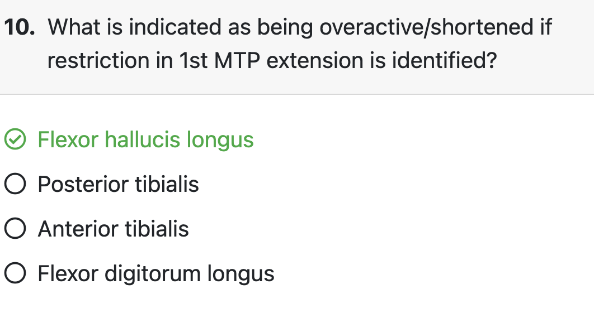

# Introduction

+ Mobility
  The entire available range of motion at a joint and the body’s neuromuscular control of that motion.
  + mobility depends on soft tissue extensibility entire available range of motion at a joint as well as the body’s neuromuscular control during motion (i.e., muscle length and state of neural activation). 
+ Flexibility
  The present state or ability of a joint to move through a range of motion.
+ Factors affecting normal mobility include posture, pattern overload movements (e.g., computer work and repetitive lifting), joint structure, age, pain, injury, gender, and psychosocial influences

## The Mobility Assessment

+  Answers questions: 
  + do overactive/shortened or underactive/lengthened muscles contribute more to the observed movement impairment?
  + Among the overactive/shortened muscles listed, are there specific ones that play a more prominent role in the movement impairment?
  + Is the corrective exercise program improving the mobility of the client or athlete over time?
+ examples
  + if a movement impairment is observed during static and movement assessment stages, but mobility assessments do not show a flexibility (ROM) limitation at the relevant kinetic chain checkpoint, then it is more likely that poor neuromuscular control and underactive/lengthened muscles are the potential culprit
+ **Ensuring Reliability**
  consistent with every client

## The Scientific Rationale for Mobility Testing

+ Flexibility deficits 

  + caused by shortened contractile tissue (i.e., skeletal muscle) and changes in noncontractile tissue (e.g., tendons, ligaments)
  + risk factors: metabolic factors, psychological factors (e.g., limbic system overactivity), preexisting injury, neuromuscular factors, and myofascial dysfunction (e.g., trigger points).

+ combination of **active** and **passive motions**

  Active motion

  The amount of motion obtained solely through voluntary contraction. 

  Passive motion

  The amount of motion observed without any assistance from an external force.

+ Full, pain-free motion is considered normal mobility. Restricted motion is considered a mobility issue, which may be caused by a flexibility deficit. Shortened (overactive) muscles and soft tissues are a common cause of decreased flexibility, which can affect mobility.

### UPPER BODY MOBILITY TESTING

+  Head
  + Shortened cervical extensors, flexors, and rotators 
+ shoulder girdle and glenohumeral joint
  + shortened pectoralis major and minor and latissimus dorsi often contribute to impairments during the overhead squat assessment (OHSA). The client may demonstrate an excessive anterior pelvic tilt and arms falling forward. 
  + A shortened pectoralis minor can often be found in Janda’s upper crossed syndrome and can be assessed with scapular retraction 
  + Decreased latissimus dorsi flexibility can be assessed with shoulder flexion (lat length test). 
  + Flexibility tests for the pectorals and latissimus dorsi have been shown to be reliable when conducted by one professional observing or using a tape measure or goniometer
  + Decreased glenohumeral internal and external rotation can also contribute to the arms falling forward during the OHSA or may limit upper extremity motions during basic functional activities (e.g., lifting a box above the head or throwing a ball). 

+ elbow, forearm, and wrist, 
  + Shortening of the elbow and wrist flexors and extensors

### LOWER BODY MOBILITY TESTING

+ LPHC, 
  + iliopsoas, rectus femoris, and tensor fascia latae (TFL)/IT band complex, flexibility can be tested with supine hip and knee extension (modified Thomas test). pass–fail criteria 
  + Hip adductor (adductor magnus, adductor brevis, adductor longus, gracilis, and pectineus) flexibility can be tested using hip abduction and external rotation (adductor flexibility test). 

+ knee joint,
  + quadriceps can be tested using prone knee flexion (Duncan-Ely test).  pass–fail criteria or using a goniometer to measure joint ROM 
  + Hamstring flexibility can also be tested using the active knee extension test (AKE)
+ ankle joint, 
  + gastrocnemius and soleus can be tested with weight- bearing ankle dorsiflexion (weight-bearing lunge test)

# Procedures

+ Summary
  + Foot and ankle
    + 1st MTP
    + Weight Bearing Lunge
  + Knee
    + Knee Flexion and Extension
  + LPHC
    + Modified Thomas Test
    + Hip Internal and External Rotation
    + Lumbar Flexion and Extension
    + Hip Abduction and External rotation
  + Shoulders and Thoracic Spine
    + Thoracic Extension
    + Thoracic Rotation
    + Shoulder Flexion and Extension
    + Shoulder Internal and External Rotation
    + Pectoralis Minor
  + Head and Cervical Spine
    + Cervical Flexion and Extension
    + Cervical Lateral Flexion
    + Cervical Rotation
  + If shoulder and T-spine restriction present, check for Elbow and Wrist
    + Elbow Flexion and Extension
    + Wrist Flexion and Extension

+ Mobility restriction

  The inability to move a joint through what should be its full range of motion.

  + overactive/shortened muscles and soft tissues on the side contralateral (opposite) to the observed restricted movement
  + Eg: knee valgus 
    + restriction in hip abduction -> overactive adductors
    + No restriction -> underactive hip abductors

+ Measurement

  + goniometry, which is a joint angle measurement technique
  + observable landmarks on the body.
  + binary determination of either normal or restricted

## Foot and Ankle Screening

+ feet turning out, excessive pronation, knee valgus, or excessive forward trunk lean during the OHSA 
+  begin by testing ankle dorsiflexion and then move to testing extension of the first metatarsophalangeal (MTP) joint.

### Ankle Dorsiflexion

**Client position**: Standing in a lunge position with shoes off, feet straight, and heels planted firmly on the ground and toes positioned approximately 2 inches away from the wall

**Type of motion**: Passive (forward test leg is relaxed)

**Target motions**: The client’s front leg (test leg) lunges toward the wall, using hands for support, until the ankle and foot reach their end-range. The back foot is positioned to support the overall posture.

**Veral instructions**: “Keep your front foot straight and heel planted firmly on the ground, then lunge forward until the first stretch sensation is felt in the back of your front leg. Avoid pushing with your back leg/foot.”

**Assessment**:

- **Normal mobility**: The client is able to touch the wall with the forward-bending knee without compensation.

- Restricted dorsiflexion

  : The client is unable to touch the wall or displays compensations such as heel lift, foot external rotation, arch collapse, or knee valgus.

  - **Overactive/shortened**: Gastrocnemius and soleus

### First MTP (Great Toe) Extension

+ important part of normal walking and running. During the running or walking gait cycle, individuals will push off through the toes to propel themselves forward. Normal first MTP extension during push off tightens the plantar fascia, creating a more rigid lever, which is called the windlass mechanism (Caravaggi et al., 2009). This mechanism helps the foot to generate greater force to propel the body forward. 
+ A lack of first MTP mobility can lead to compensations and possible injury through the lower kinetic chain and LPHC may lead to compensation during movements that require pivoting, lunging, or lower extremity rotation.

**Client position**: Standing or seated

**Type of motion**: Active Target motions: The client moves the right big toe upward (extension) as far as possible while keeping other toes and foot stable, and then performs the same movement with the left big toe.

**Verbal instructions**: “Move your right big toe upward as far as possible while keeping everything else still, then repeat on your left side.”

**Assessment:**

- **Normal mobility**: The client is able to extend the big toe above other toes without compensation.

- Restricted MTP extension

  : The client is unable to extend big toe above others or displays compensations such as movement through the other toes or accessory movement through the foot and/or tibia.

  - **Overactive/shortened**: Flexor hallucis longus

## Knee Screening

+ anterior pelvic tilt, excessive forward lean of the trunk, knee valgus, or a knee dominance posture
+ rectus femoris is classified as a two-joint muscle because it crosses both the hip and knee. a comprehensive strategy for knee impairment should also include hip mobility tests 

### Active Knee Flexion Test (Duncan-Ely Test*)

**Client position**: Lying prone on a table

**Type of motion**: Active

**Target motions**: The client actively flexes the right knee as far as tolerable, then performs with the left knee.

**Verbal instruction**: “Bend your right knee as far as you can and hold, then repeat on the left side.”

**Assessment**:

- **Normal mobility**: The client can bring the foot close to or touching their buttocks without compensation.

- Restricted knee flexion

  : The client is unable to reach the desired ROM target or displays compensations such as the test hip lifting off the table.

  - **Overactive/shortened**: Quadriceps complex

### Active Knee Extension Test

**Client Position**: Lying supine on a table

**Type of motion**: Active

**Target motion**: The client holds the test leg in 90 degrees of hip flexion and knee flexion. The pelvis should not posteriorly rotate or lumbar spine flatten. The client actively extends the knee while keeping the hip stable. The client’s other leg is straight and relaxed on the table.

**Verbal instructions**: “Lift your right thigh to 90 degrees and hold your leg with your hands behind your knee, then actively straighten your knee as far as you can. Repeat on your left side.”

**Assessment**:

- **Normal mobility**: The client can extend the knee nearly or completely straight without compensation.

- Restricted knee extension

  : The client is unable to extend their knee to the desired ROM or displays compensations such as the test thigh moving into extension (back toward the table) or movement in the opposite leg.

  - **Overactive/shortened**: Hamstrings complex

## Lumbo-Pelvic-Hip Complex Screening

+ excessive anterior or posterior pelvic tilt, asymmetric weight shift, knee valgus or varus, or excessive forward lean of the trunk
+ additional thoracic mobility assessments can be beneficial. begin with lumbar spine tests and then proceed down to the hip joint.

### Lumbar Flexion and Extension

**Client position**: Standing with knees straight and feet hip-width

**Type of motion**: Active

**Target motions**: The client forward bends (flexion) and attempts to touch their toes, then arches backward (extension) as far as possible while keeping their neck in a neutral position.

**Verbal instruction**: “Bend your trunk forward as far as you can, try to touch your toes, and then arch the back as far as you can while keeping the head and neck straight, knees straight and the feet in place.”

**Assessment**:

- Normal mobility:
  - Flexion: The client is able to touch the toes or floor without compensation.
  - Extension: The client arches the back enough where their shoulders pass their hip joints without compensation.
- Restricted flexion: The client is unable to reach their toes or floor or displays compensation such as accessory motion in the lower extremity (e.g., knee flexion).
  - Overactive/shortened: Erector spinae
- Restricted extension: The client is unable to reach the target ROM or displays compensations such as accessory motion in other segments of the spine such as cervical extension.
  - Overactive/shortened: Rectus abdominis, internal obliques, and external obliques

### HIP COMPLEX

+ modified Thomas test is particularly useful in determining which muscle is the primary limiter of hip extension in a client (i.e., which one(s) would be overactive/shortened). 
+ Some assessments, such as shoulder flexion, may be performed while standing. Other assessments, such as knee flexion/extension or passive internal rotation, can just as easily done on an exercise mat on the floor. For assessments like the modified Thomas test, try placing two plyometric boxes or benches together to create a level, raised surface.

#### Hip Extension, Hip Adduction, and Knee Flexion (Modified Thomas Test*)

**Client position**: Lying supine at end of a table with both knees bent over the edge of the table
**Type of motion**: Passive
**Target motion**: The client holds the nontesting knee to their chest, putting that hip in a maximally flexed position. The lumbar spine and pelvis are flat on the table. The test leg is relaxed on the table. The Corrective Exercise Specialist looks for three movements of the test leg and then repeats on the other side:

- Hip extension: Assesses psoas length
- Hip abduction angle: Assesses tensor fascia latae length
- Knee flexion: Assesses rectus femoris length

**Verbal instructions**: “Sit at the edge of the table, then lay back with both knees bent off the table. Grab your left leg at your knee and pull toward your chest and keep your right leg on the table completely relaxed. Repeat the sequence with the other leg.”

**Assessment**:

- Normal mobility:
  - Hip extension: The test side hip and thigh lay flat on the table in line with the torso without compensation.
  - Hip adduction: The femur rests in a straight line with the torso (not abducted) without compensation.
  - Knee flexion: The knee hangs naturally at 90 degrees off the table edge without compensation.
- Restricted hip extension: Test thigh lifts off the table.
  - Overactive/shortened: Psoas and rectus femoris
- Restricted hip adduction: Test thigh is abducted and not in line with the torso.
  - Overactive/shortened: Tensor fascia latae
- Restricted knee flexion: Test knee is slightly extended and not at 90 degrees.
  - Overactive/shortened: Rectus femoris

#### Hip Abduction and External Rotation (Adductor Test)

**Client position**: Lying supine on a table

**Type of motion**: Passive

**Target motions**: The client lies supine with the test hip and knee bent to 45 degrees with the foot placed on the medial portion of the opposite leg, between the thigh and shin as needed to achieve the correct angles. The nontesting leg is straight. The client passively relaxes the test leg to let it fall toward the table. This is repeated on the opposite side.

**Verbal instructions**: “Bend your right leg at the hip and knee to bring your foot against the opposite shin and then allow your leg to passively relax. Repeat on your other side.”

**Assessment**:

- **Normal mobility**: The hip and knee on the testing side lay flat on the table without compensation.

- Restricted abduction

  : The client is unable to lay the test leg flat on the table or displays compensations such accessory motion in the opposite side of the pelvis (e.g., lifts off table).

  - **Overactive/shortened**: Hip adductor complex

#### Passive Hip Internal Rotation

**Client position**: Lying prone on the table with legs together

**Type of motion**: Passive

**Target motions**: The client lies prone with both legs together, so knees are in line with the hips, and knees bent to 90 degrees of flexion. The client then passively allows the feet to spread apart (while maintaining bent knees), moving the hips into internal rotation.

**Verbal instructions**: “Please bend your knees to 90 degrees. Then, relax and allow your ankles to fall away from each other and lower toward the table.”

**Assessment:**

- **Normal mobility**: The client can internally rotate the hip until the tibia (shins) are at a 45-degree angle to the table without compensation.

- Restricted internal rotation

  : The client is unable to reach targeted mobility benchmark in either hip or displays compensations such as knee extension, or lifting or abduction of the hips.

  - **Overactive/shortened**: Piriformis, quadratus femoris, and gluteus maximus

#### Seated Hip Internal and External Rotation

**Client position**: Seated at the edge of table with both legs hanging over the side

**Type of motion**: Active

**Target motions**: The client is seated with an upright posture, hands on hips, and both legs hanging over the side of the table. The client internally rotates one leg as far as possible without compensation through the LPHC. Then, the client externally rotates the leg as far as possible (the other leg will need to internally rotate to accommodate the motion). This is repeated on the opposite side (internal rotation may be done bilaterally).

**Verbal instructions**: “Sit at edge of the table with an upright posture and hands on your hips. Internally rotate your right hip by moving your foot up and away from your opposite leg. Then, externally rotate your right hip by moving your foot up and toward your opposite leg. Try to keep your pelvis level and back straight. Repeat this on your left side.”

**Assessment:**

- **Normal mobility**: The client is able to actively rotate the leg at the hip until the tibia (shin) is roughly at a 45-degree angle to the bench or table without compensation for both internal and external rotation.

- Restricted internal rotation

  : The client is unable to reach targeted mobility benchmark in either hip or displays compensations such as increased lateral flexion at the spine, hip hiking, hip abduction, or spinal flexion or extension.

  - **Overactive/shortened**: Piriformis, gemellus superior, gemellus inferior, obturator internus, obturator externus, quadratus femoris, and gluteus maximus

- Restricted external rotation

  : The client is unable to reach targeted mobility benchmark in either hip or displays compensations such as increased lateral flexion at the spine, hip hiking, hip abduction, or spinal flexion or extension.

  - **Overactive/shortened**: Tensor fascia latae, gluteus minimus and medius (anterior fibers), and hip adductors

## Shoulder-Elbow-Wrist Screening

+ Health of the shoulder, elbow, and wrist are interrelated.
+ movement compensations at the shoulders and head/neck kinetic chain checkpoints. scapular elevation, scapular winging, or arms falling forward during the OHSA. 
+  begin with shoulder tests and then proceed down to the elbows and wrists if restriction is found at the shoulder.
+  If a client is unable to straighten their arms during any of the primary movement patterns, elbow and wrist mobility could be implicated and should be assessed

### SHOULDER COMPLEX

#### Shoulder Flexion (Lat Length Test)

**Client position**: Standing against the wall or lying supine on the floor or a table with hips and legs straight, or if they are more comfortable, with hips flexed, knees bent, and feet flat, palms facing each other

**Type of motion**: Passive (lying), active (standing)

**Target motions**: The client brings both arms above the head (flexion) as far as possible and then passively relaxes in that position.

**Verbal instructions**: “Raise both arms above your head as far as possible and relax while holding that position.”

**Assessment**:

- **Normal mobility**: Upper arms extend directly overhead in line with the lateral midline of the torso without compensation.

- Restricted shoulder flexion

  : The client is unable to reach their arms in line with their torso or displays compensations such as elbow flexion, lumbar spine extension, the rib cage flaring, or shoulder elevation (shrugging).

  - **Overactive/shortened**: Latissimus dorsi, teres major, and pectoralis major (lower fibers)

#### Shoulder Retraction (Pectoralis Minor Test)

**Client position**: Lying supine on a table with legs extended

**Type of motion**: Passive

**Target motions**: The client rests both arms at the side of the body with elbows extended and palms upward.

**Verbal instructions**: “Relax both arms at the side of your body with your elbows extended and palms up.”

**Assessment**:

- **Normal mobility**: The client can rest their shoulders flat on the table without compensation in other kinetic chain checkpoints.

- Restricted shoulder retraction

  : The client’s shoulders will rest at a level off the table or display a compensation such as lumbar spine extension, cervical extension, rib cage flaring, or accessory motion of the arms.

  - **Overactive/shortened**: Pectoralis minor on the same side as the elevated shoulder or compensation

#### Shoulder Extension

**Client position**: Standing or lying supine on a table

**Type of motion**: Passive (lying), active (standing)

**Target motions**: The client reaches the arm rearward as far as is comfortable while keeping the elbow and wrist straight.

**Verbal instructions**: “Reach your arm backward as far as you can then repeat with the other arm.”

**Assessment**:

- **Normal mobility**: The client is able to reach just beyond roughly 45 degrees of extension (halfway between the line of the horizon and wall) without compensation.

- Restricted shoulder extension

  : The client is unable to reach targeted mobility benchmark or displays compensations such as elbow flexion, shoulder elevation, or the scapula of the test shoulder tilting upward and protracting.

  - **Overactive/shortened**: Anterior deltoid, pectoralis major (upper fibers), coracobrachialis, biceps brachii

#### Shoulder Internal and External Rotation

**Client position**: Standing against a wall or lying supine on the floor or a table with hips and legs straight, or if they are more comfortable, with hips flexed, knees bent, and feet flat

**Type of motion**: Active

**Target motions**: With shoulders and elbows abducted and bent to 90 degrees, the client rotates the arms downward to the table or floor; rotation occurs only at the glenohumeral joint. Then, the client rotates their arms backward, attempting to touch the back of their hand to the plane of the table or to the floor.

**Verbal instructions**: “With your arms out to the side and elbows bent, rotate your arm and hands forward toward the table. Then, rotate your arms and hands backward toward the table.”

**Assessment**:

- Normal mobility:
  - Internal rotation: The client can rotate the forearm/hand forward to near the table (roughly halfway between 45 degrees and the table) without compensation.
  - External rotation: The client can rotate the forearm/hand backward to nearly touching or touching the plane of the table without compensation.
- Restricted internal rotation: The client is unable to reach the target mobility benchmark or displays compensations such as the test shoulder elevating and protracting off the table, a change in elbow flexion, or wrist flexion.
  - Overactive/shortened: Teres minor and infraspinatus
- Restricted external rotation: The client is unable to reach the target mobility benchmark or displays compensations such as a change in elbow flexion, shoulder elevation, rib cage flaring, or wrist extension.
  - Overactive/shortened: Subscapularis, teres major, latissimus dorsi, and pectoralis major

### ELBOW AND WRIST

#### Elbow Flexion and Extension

**Client position**: Seated or standing

**Type of motion**: Active

**Target motions**: Standing straight with the arms at the side, the client bends (flexes) and straightens (extends) the elbow while keeping the wrist neutral.

**Verbal instructions**: “With your elbow kept at your side and keeping the wrist straight, bend your elbow as far as you can, then straighten your elbow as far as you can.”

**Assessment**:

- Normal mobility:
  - Flexion: Hand almost touches front of shoulder without compensation.
  - Extension: Elbow completely straightens without compensation.
- Restricted elbow flexion: The client is unable to reach target mobility benchmark or displays compensations such as wrist flexion.
  - Overactive/shortened: Triceps group
- Restricted elbow extension: The client is unable to reach target mobility benchmark or displays compensations such as wrist extension.
  - Overactive/shortened: Biceps brachii, brachialis, brachioradialis, and pronator teres

#### Wrist Flexion and Extension

**Client position**: Seated or standing

**Type of motion**: Active

**Target motions**: With the elbow held against the body and bent to 90 degrees and palm facing up, the client bends the wrist down (extends) and up (flexes) and then repeats with the other arm.

**Verbal instructions**: “With your elbow bent, bend your wrist down and then up and repeat with the other arm.”

**Assessment**:

- Normal mobility:
  - Flexion: The wrist bends close to 90 degrees without compensation.
  - Extension: The wrist bends close to 90 degrees without compensation.
- Restricted flexion: The client is unable to reach target mobility benchmark or displays compensation such as accessory motion in the fingers and elbows.
  - Overactive/shortened: Wrist extensors (extensor carpi radialis longus, extensor carpi radialis brevis, and extensor carpi ulnaris)
- Restricted extension: The client is unable to reach target mobility benchmark or displays compensation such as accessory motion in the fingers and elbows.
  - Overactive/shortened: Wrist flexors (flexor carpi radialis, flexor carpi ulnaris, and palmaris longus)

## Cervicothoracic Mobility

-  forward head posture, scapular elevation, or arms falling forward during the OHSA
-  begin with cervical tests and then proceed down to the thoracic spine.
- HELPFUL HINT

- clearly provide instructions for the desired motion

### CERVICAL SPINE

#### Cervical Flexion and Extension

**Client position**: Standing or seated

**Type of motion**: Active

**Target motions**: The client is seated and bends their neck toward their chest (flexion) and up toward the ceiling (extension).

**Verbal instruction**: “Bring your chin down to your ster-num and then look up toward the ceiling as far as you can while keeping your mouth closed.”

**Assessment**:

- Normal mobility:
  - Flexion: The chin touches the sternum without compensation.
  - Extension: The face is roughly parallel to the horizon without compensation.
- Restricted flexion: The client is unable to reach the target mobility benchmark or displays compensations such as movement through the shoulders or cervical rotation.
  - Overactive/shortened: Erector spinae, deep cervical extensors, and upper trapezius
- Restricted extension: The client is unable to reach the target mobility benchmark or displays compensations such as movement through the shoulders or cervical rotation.
  - Overactive/shortened: Sternocleidomastoid and deep cervical flexors

#### Cervical Rotation

**Client position**: Standing or seated

**Type of motion**: Active

**Target motions**: The client is seated and turns their neck to look over their right and left shoulder.

**Verbal instruction**: “Look over your right then left shoulder as far as you comfortably can.”

**Assessment**:

- **Normal mobility**: The nose aligns anywhere from over the **clavicle to the tip of the shoulder** without compensation.

- Restricted rotation

  : The client is unable to reach the target mobility benchmark or displays compensations such as movement through the shoulders or cervical extension, flexion, or lateral flexion.

  - **Overactive/shortened**: Sternocleidomastoid and scalenes on the side opposite of the observed restriction

#### Cervical Side Bending (Lateral Flexion)

**Client position**: Standing or seated

**Type of motion**: Active

**Target motions**: The client is seated and side bends (lateral flexion) to the right and left as far as possible without compensation.

**Verbal instruction**: “Bring your ear toward your right shoulder then to the left as far as you comfortably can.”

**Assessment**:

- **Normal mobility**: The head can tilt to roughlya **45-degree angle** on each side without compensation.

- Restricted side bending

  : The client is unable to reach the target mobility benchmark or displays compensations such as cervical rotation.

  - **Overactive/shortened**: Sternocleidomastoid, scalenes, and erector spinae on the side opposite of the observed restriction

### THORACIC SPINE

#### Thoracic Extension

**Client position**: Seated on a standard low-backed chair with hands and arms crossed over the chest, and lumbar and cervical spines neutral throughout. The chair back should end just beneath the client’s shoulder blades.

**Type of motion**: Active

**Target motions**: The client arches their mid back over the chair as far as comfortably possible.

**Verbal instruction**: “Cross your arms over your chest. While keeping your ribs and low back in place and neck in line with the torso, lean your mid back over the chair as far as you can without tipping the chair.”

**Assessment:**

- **Normal mobility**: The upper back and head tilt backwards where the tops of the shoulders extend past the chair back (roughly **25 degrees of thoracic extension**), and the **sternum is nearly parallel to the horizon** without compensation.

- Restricted thoracic extension

  : The client is unable to reach target mobility benchmark or displays compensations such as cervical extension, ribs flaring, or lumbar extension.

  - **Overactive/shortened**: Rectus abdominis, internal oblique, and external oblique

#### Seated Thoracic Rotation

**Client position**: Seated with hands crossed in front of body or crossed with holding a stick or dowel rod. Place a medicine ball or foam roller between the knees to stabilize the lower body. Ensure the shoulder blades are retracted and depressed.

**Type of motion**: Active

**Target motions**: The client squeezes the ball or roller between the knees to lock the hips in place and the client maintains a neutral cervical spine. The client then rotates the upper body to each side as far as possible.

**Verbal instruction**: “Hold the stick to your chest under crossed arms. Squeeze the roller between the knees, look forward, and keep your nose in line with the sternum. Rotate your trunk to the right as far as you can. Then, rotate to the left.”

**Assessment**:

- **Normal mobility**: The sternum (or stick) **rotates roughly 45 degrees** from the starting position to each side without compensation.

- Restricted thoracic rotation

  : The client is unable to reach the target mobility benchmark or displays compensations such as lateral flexion of the spine, leaning forward or backward, and shoulder protraction.

  - **Overactive/shortened**: Rectus abdominis, internal oblique, external oblique, and erector spinae on the side opposite of the restriction.

# Quiz

