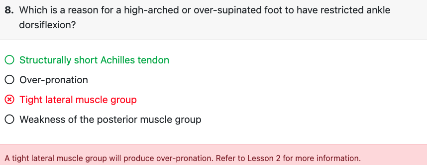

# Foot and ankle

## Anatomy

### Bones and Joints

#### talocrural (ankle) joint

+ tibia, fibula, and talus

+ Movements

  + open-chain movement, plantar flexion occurs when the bottom of the foot (plantar surface) moves closer to the posterior tibia.

  + Closed-chain dorsiflexion is necessary during the descent of a squat as the knee translates anteriorly

    +  It is with closed-chain movement where impairments are most apparent. Dorsiflexion is often limited due to muscle length and mobility deficits, which leads to compensations at the foot, ankle, knee, and LPHC when observing the overhead squat assessment (OHSA).

  + Abduction

    + As the lateral malleolus is positioned just posterior to the medial malleolus (i.e., the outside ankle bone is slightly to the rear of the inside ankle bone), dorsiflexion is also associated with  abduction

  + Adduction: associated with plantar flexion

  + Dorsiflexion + Abduction = Unlocked or loading position of the ankle

    Plantar flexion + Adduction = Locked or unloading position of the ankle

#### subtalar joint (STJ)

+ talus and calcaneus
+ frontal plane joint 
+ Movements
  + Inversion (Figure 11-6), or a locked STJ, can be associated with foot stability, or a position necessary to transfer energy at push off
  + eversion (Figure 11-7), or an unlocked STJ, can be associated with foot mobility, or a position necessary to absorb impact forces.

#### Relationship between ankle joint and STJ

+ Dorsiflexion at the ankle joint is associated with STJ eversion
+ tibial internal rotation is associated with ankle dorsiflexion and STJ eversion.
  + enhance the foot, ankle, and lower leg’s ability to effectively absorb impact forces.
  + Compensations often are observed here because individuals frequently lack control of the force absorption phase. (i.e., too much motion occurring too soon)
+ due to coupling of the ankle joint and STJ, the motion of the rearfoot is triplanar.
  + Dorsiflexion + Foot abduction + Eversion = Pronation = Unlocked rearfoot = Force absorption
  + Plantar flexion + Foot adduction + Inversion = Supination = Locked rearfoot = Force production
+  Pes planus is characterized by a flattened medial arch during weight bearing
+  pes cavus is characterized by a high medial arch during weight bearing
  

### Muscles

+ Intrinsic muscles: Refers to muscles located deep within a structure. Stabilizer
+ Extrinsic muscles: Foot muscles that originate in the lower leg and insert in the foot as tendons. mobilizer
  + Invertors: Subtalar inversion, Occurs when the bottom of the heel (inferior calcaneus) swings medially. supination of the foot. maintaining a stable and locked position from the rearfoot all the way up into the hip during force production (e.g., the concentric unloading phase of gait)
    + Anterior tibialis
    + Posterior tibialis
    + Soleus
  + Evertors: unlocking the foot and hip to allow for deceleration and the absorption of impact forces (e.g., the eccentric loading phase of gait).
    + Fibularis (peroneus) brevis
    + Fibularis (peroneus) longus
    + Gastrocnemius

### Altered Foot and Ankle Movement

+ The ankle is the most commonly injured joint in both sports and daily life. 
+  lumbo-pelvic-hip complex (LPHC) muscle weakness, particularly in the frontal and transverse planes, have been found to contribute to altered lower extremity alignment, leading to increased foot pronation
  + femur may adduct and internally rotate, whereas the tibia may externally rotate and the foot may go into excessive pronation.
  + lead to plantar fasciitis, patellofemoral pain, IT band tendonitis, and increased risk of anterior cruciate ligament (ACL) tears
  + 
+ Static malalignments
  + Pes planus: 
    + Cause: 
      + overactivity of the fibularis muscles (peroneals) and lateral gastrocnemius, 
      + underactivity of the anterior and posterior tibialis, 
      + and decreased joint motion of the first metatarsophalangeal (MTP) joint and talus (decreased posterior glide).
        + Posterior glide, a normal feature of ankle mobility, is the small rearward movement of the talus when the ankle dorsiflexes.
        + decreased posterior glide of the talus can decrease dorsiflexion at the ankle.
        + history of lateral ankle sprains. rapid restoration of dorsiflexion and normalization of gait in patients with ankle sprains who were treated with manual posterior glide of the talus
    + Symptom
      + slightly plantar flexed position at the ankle when standing.
+ Abnormal Muscle Activation Patterns
  + Subjects with unilateral chronic ankle sprains have been found to have weaker ipsilateral hip abduction strength and increased multiplanar postural sway
    + Postural sway
      A measure of postural stability and control, often while standing. Refers to the amount of reflexive movement made by an individual around their center of gravity to remain balanced.
  + fatigue in the knee and hip musculature (sagittal and frontal planes) creates even greater postural sway
  + weakness and decreased postural stability in the stabilizing muscles of the LPHC, such as the gluteus medius, may produce deviations in subtalar joint motion during gait. subtalar joint inversion may occur in response to medial foot placement errors secondary to overactivity of the hip adductors
    
+ Dynamic Malalignment
  + Effect of excessive pronation
    + altered alignment of the tibia, femur, and pelvic girdle
    +  internal rotation stresses at the lower extremity and pelvis
    + increased strain on soft tissues (Achilles tendon, plantar fascia, patellar tendon, IT-band, etc.)
    + compressive forces on the joints (subtalar joint, patellofemoral joint, tibiofemoral joint, iliofemoral joint, and sacroiliac joint) 
  + Excessive pronation of the feet induces an anterior pelvic tilt of the LPHC. The addition of 2 to 3 degrees of foot pronation led to a 20–30% increase in pelvic malalignment while standing and a 50–75% increase in anterior pelvic tilt during walking.

### RI Model

+ Overpronation
  + more wear and tear in medial side of the shoes
  + internal tibial rotation, femoral adduction, and a knee valgus alignment
  + Underactive:
    + foot invertors (anterior and posterior tibialis) 
    + hip external rotators (gluteus maximus and medius)
  + Overactive:
    + lateral gastrocnemius, fibularis complex (peroneals), and tensor fascia latae (TFL).
+ Oversupination
  + plantar flexion and inversion
  + rigid medial arch (i.e., the medial arch does not lower during the squat) or by a medial arch that rises during the squat (i.e., the individual shifts weight to the lateral portion of the foot).
  + often due to rigidity in the foot and ankle.

## Assessmenent result

### TABLE 11-2 Foot and Ankle Assessment Results

| **Assessment(s)**                                            | **Results**                                                  |
| ------------------------------------------------------------ | ------------------------------------------------------------ |
| **Static posture**                                           | Feet externally rotated, Lower leg posteriorly displaced (plantar flexed), Pes cavus, Pes planus, Pes planus distortion |
| **Transitional and loaded movement**                         | Excessive pronation, Feet turn out, Heel rise, Excessive forward trunk lean, Squat improves with heels elevated |
| **Dynamic movement**                                         | Excessive pronation, Feet turn out                           |
| **Mobility**Ankle dorsiflexion (weight-bearing lunge test), First MTP extension | Limited dorsiflexion ROM, Limited first MTP extensibility    |

+ Static
  + pes planus distortion syndrome, which is characterized by flat feet with knee valgus 
  + ankle plantar flexion, which is typically observed with knee hyperextension (i.e., the lower leg is posteriorly displaced).
  + overpronation, may benefit from an orthotic, or shoe insert, that is designed to cushion or realign the foot and ankle complex into a neutral position.
+ Transional movement
  + OHSA
    + 
    + HEELS-ELEVATED MODIFICATION: reduced plantar flexor and Achilles tendon length, heels-elevated modification can be used to pinpoint the source of the impairment to either the foot and ankle complex or other areas, such as the LPHC
      + If the heels-elevated modification improves movement impairments seen during the OHSA, then the root cause of the impairment is likely due to the lack of sagittal plane mobility in the ankle stemming from limited plantar flexor and Achilles tendon extensibility
      + if elevating the heels does not change OHSA performance, then the root cause is likely in another kinetic chain region. The musculature at the LPHC is likely to be involved in this scenario. Overactive abdominals and hip flexors, for example, may be the source of impairments such as excessive forward trunk lean.
  + Single leg squat
    + excessive pronation and heel rise
    + SPLIT SQUAT MODIFICATION: narrow stance with both feet on the ground provides more stability but still provides insight into unilateral impairments
  + Loaded movement
    + Movement impairments that surface during a loaded squat might be related to the underactivity of key foot and ankle muscles. activation of the intrinsic foot musculature can be prioritized in the client’s program. It is important to remember, however, that targeted mobility assessments should be used to confirm or rule out observations made during transitional assessments.
+ Dynamic Movement Assessment
  + The phase of gait where most impairments can be observed is during late midstance or when the foot is all the way behind and is about to push off and take a step.
    + the point in gait when maximum ankle mobility is required.
    + Impairment is more likely in those clients with limited ankle dorsiflexion. 
    + excessive foot pronation and external rotation.
  + depth jump assessment
    + high eccentric deceleration requirement
    + use for advanced clients with relatively impairment-free OHSA and SLSA performance.
    + performing dynamic movements lacking proper kinetic chain control can potentially be dangerous.
+ Mobility Assessments
  + Limited flexibility of the plantar flexor muscle group (limited dorsiflexion ROM) and limited extensibility of the first MTP (i.e., the big toe) can both have cascading impacts throughout the entire kinetic chain.

## Corrective strategy

### TABLE 11-3 Common Corrective Exercise Programming Selections for the Foot and Ankle

| **Phase**  | **Modality**                                  | **Muscle(s)/Exercise**                                       | **Acute Training Variables**                                 |
| ---------- | --------------------------------------------- | ------------------------------------------------------------ | ------------------------------------------------------------ |
| Inhibit    | Self-myofascial rolling                       | Biceps femoris (short head) Fibularis complex (peroneals) Gastrocnemius Quadriceps Soleus TFL | Hold areas of discomfort for 30 to 60 seconds Perform four to six repetitions of active joint movement |
| Lengthen   | Static stretching or neuromuscular stretching | Biceps femoris (short head) Gastrocnemius Quadriceps Soleus TFL | Static: 30-second hold Neuromuscular: 7- to 10-second isometric contraction, 30-second static hold |
| Activate   | Isolated strengthening                        | Anterior tibialis Gluteus medius Medial hamstrings Posterior tibialis Short foot (intrinsic muscles | 10 to 15 reps with 4-second eccentric contraction, 2-second isometric contraction at end-range, and 1-second concentric contraction |
| Integrate* | Integrated dynamic movement                   | Lunge to balance progressions Single-leg balance reach Single-leg squat Step-up to balance | 10 to 15 reps under control                                  |

### Inhibit: SMR

### Lengthen

### Activate

The short foot exercise is intended to activate and strengthen the intrinsic muscles of the foot by actively forming the longitudinal arch (Jung et al., 2011). Perform the short foot exercise by first placing the foot flat on the floor. Then, lift the arch of the foot while pulling the ball of the foot closer to the calcaneus. This movement should be performed with the toes relaxed. Exercise may be performed seated or standing in a partial-lunge/split-stance for increased difficulty

### Integrate

## Strategy for symptoms

### Feet turn out

improve ideal dorsiflexion and improve the body’s ability to control tibial rotation. 

+ Inhibit
  + soleus, lateral gastrocnemius, biceps femoris, and possibly the TFL
+ Lengthen
  + soleus and gastrocnemius and biceps femoris
+ Activate
  + calf raise to target the medial gastrocnemius
  + knee flexion with tibial internal rotation to target the medial hamstring.
+ Integrate
  + first include uniplanar exercises (sagittal plane) and then progress to multiplanar exercises (frontal and transverse). Exercises can begin as more transitional (moving with no change in the base of support such as a single-leg balance reach) to more dynamic exercises (movement with a change in the base of support such as a step-up to balance, to a lunge to balance, to a single-leg squat).

#### TABLE 11-4 Sample Corrective Exercise Program for the Foot and Ankle: Feet Turn Out

| **Phase**  | **Modality**                | **Muscle(s)/Exercise**                   | **Acute Training Variables**                                 |
| ---------- | --------------------------- | ---------------------------------------- | ------------------------------------------------------------ |
| Inhibit    | Myofascial rolling          | Biceps femorisGastrocnemius/soleus       | Hold areas of discomfort for 30 to 60 secondsPerform four to six repetitions of active joint movement90 to 120 seconds per muscle group |
| Lengthen   | Static stretching           | Biceps femoris (short head)Gastrocnemius | 30-second hold                                               |
| Activate   | Isolated strengthening      | Medial gastrocnemiusMedial hamstrings    | 10 to 15 reps with 4-second eccentric contraction, 2-second isometric contraction at end-range, and 1-second concentric contraction |
| Integrate* | Integrated dynamic movement | Sagittal lunge to balance                | 10 to 15 reps under contro                                   |
|            |                             |                                          |                                                              |

### Overpronation

TABLE 11-5 Sample Corrective Exercise Program for the Foot and Ankle: Overpronation

| **Phase**  | **Modality**                | **Muscle(s)/Exercise**                                       | **Acute Training Variables**                                 |
| ---------- | --------------------------- | ------------------------------------------------------------ | ------------------------------------------------------------ |
| Inhibit    | Myofascial rolling          | Fibularis complex (peroneals) Gastrocnemius/soleus TFL | Hold areas of discomfort for 30 to 60 seconds Perform four to six repetitions of active joint movement 90 to 120 seconds per muscle group |
| Lengthen   | Static stretching           | Gastrocnemius/soleus TFL                                     | 30-second hold                                               |
| Activate   | Isolated strengthening      | Anterior tibialisGluteus mediusShort foot                    | 10 to 15 reps with 4-second eccentric contraction, 2-second isometric contraction at end-range, and 1-second concentric contraction |
| Integrate* | Integrated dynamic movement | Step-up to balance                                           | 10 to 15 reps under control                                  |
|            |                             |                                                              |                                                              |

### Heel rise

TABLE 11-6 Sample Corrective Exercise Program for the Foot and Ankle: Heel Rise

| **Phase**  | **Modality**                | **Muscle(s)/Exercise**               | **Acute Training Variables**                                 |
| ---------- | --------------------------- | ------------------------------------ | ------------------------------------------------------------ |
| Inhibit    | Myofascial rolling          | Gastrocnemius/soleus Quadriceps | Hold areas of discomfort for 30 to 60 seconds Perform four to six repetitions of active joint movement 90 to 120 seconds per muscle group |
| Lengthen   | Static stretching           | Quadriceps Soleus               | 30-second hold                                               |
| Activate   | Isolated strengthening      | Anterior tibialis                    | 10 to 15 reps with 4-second eccentric contraction, 2-second isometric contraction at end-range, and 1-second concentric contraction |
| Integrate* | Integrated dynamic movement | Single-leg squat                     | 10 to 15 reps under control                                  |

## Common Issues

### Plantar Fasciitis

+ Symptoms: pain for the first step in the morning or after a period of rest (poststatic dyskinesia) or as pain in the plantar heel after periods of prolonged standing or ambulation
+ Risk factors: limited mobility in the plantar fascia and Achilles tendon (Hedrick, 1996), excessive impact forces (overuse), an everted foot type,  increased body mass index in a nonathletic population, and insufficient ankle mobility
  + Decreased plantar flexor and Achilles tendon length limit optimal ankle joint motion, resulting in excessive pronation compensations.
+ Contradictions
  + avoid any impact-related activities and/or exercises that place excessive stress to the plantar foot and ankle mobility.
+ Corrections
  +  instead focus on increasing foot and ankle mobility through myofascial release of the plantar foot and posterior muscle group

### Achilles Tendinopathy

+ Symptoms: pain either at the Achilles tendon insertion onto the calcaneus or as pain along the middle of the tendon
  + Achilles tendon pain that is more insertional (on the calcaneus) is associated with uncontrolled absorption of impact forces, 
  + mid-tendon pain is associated with insufficient elasticity during dynamic movement and a subsequent micro-tearing
+ Risk factors: limited ankle mobility or a tight Achilles tendon.
  + feet turn out (foot abduction), excessive pronation, or excessive forward trunk lean in the OHSA 
+ Contradictions:
  + avoid any impact-related activities and/or exercises that place excessive stress on the Achilles tendon and ankle mobility
+ Corrections
  + myofascial release of the plantar foot and posterior muscle group (soleus and gastrocnemius).
  + Eccentric training is also one of the most effective ways to reduce the symptoms and stress to the Achilles tendon.
    + negative heel raise https://youtu.be/d2GgSoHvIXo

### Medial Tibial Stress Syndrome (shin splints)

+ Symptoms
  + Pain in the front of the tibia caused by an overload to the tibia and the associated musculature.
  + pain and tenderness along the lower third of the medial tibia, especially during dynamic movement such as running and jumping
+ Risk factors: improper loading of impact forces and a more rigid foot type
  +  improper footwear, overpronation, rigid foot type (supinated), gluteal weakness, and delayed stabilization on impact.
+ Contradictions: avoid impact-related activities such as running and jumping.
+ Corrections
  + proper foot mobilization, 
  + building increased intrinsic foot strength and foot-to-core integration, which can enhance gluteal strength.
  +  Orthotics may be recommended in the client with an overpronated foot type

+ Stress fracture is the clinical term used to denote bone failure in fatigue. Stress fractures do not occur from a single traumatic event; rather, they are the product of repetitive submaximal loading. 100-fold increase in fatigue resistance after a 5-week loading regimen demonstrates the potential importance of adaptive bone formation with progressive physical training

### Ankle Sprains and Chronic Ankle Instability

+ Although ankle sprains can occur to both the medial and lateral aspect of the ankle joint, due to the increased inversion moment of the ankle, 73% of ankle sprains occur to the lateral aspect of the joint

+ at risk for developing chronic ankle instability, which is the result of a loss in mechanical stabilization (via ligaments) and/or a disruption in the proprioceptive feedback from the ankle.

+ Chronic ankle instability
  Repetitive episodes of giving way at the ankle, coupled with feelings of instability.
+ Risk factors
  + previous sprain (Morrison & Kaminski, 2007), increased arch height, or a supinated foot type, as well as footwear, intrinsic muscle weakness, and even gluteal weakness
+ Corrections
  + enhancing foot and ankle awareness through proprioceptive training, foot strengthening, and gluteal strengthening.
  + Single-leg balance
  + Barefoot stimulation and intrinsic foot muscle strengthening 

## Quiz

## Reference

> REFERENCES
>
> Bolgla, L. A., & Malone, T. R. (2004). *Plantar fasciitis and the windlass mechanism: A biomechanical link to clinical practice*. National Athletic Trainers’ Association, Inc.
>
> Cerny, K. (1984). Pathomechanics of stance. Clinical concepts for analysis. *Physical Therapy*, *64*, 1851–1859.
>
> Chimenti, R. L., Bucklin, M., Kelly, M., Ketz, J., Flemister, A. S., Richards, M. S., & Buckley, M. R. (2017). Insertional Achilles tendinopathy associated with altered transverse compressive and axial tensile strain during ankle dorsiflexion. *Journal of Orthopaedic Research, 35*(4), 910–915. https://doi.org/10.1002/jor.23338
>
> Chou, L. B. (2014). *Orthopaedic knowledge update: Foot and ankle* (5th ed.). American Academy of Orthopedic Surgeons.
>
> Chuter, V. H., & Janse de Jonge, X. A. (2012). Proximal and distal contributions to lower extremity injury: A review of the literature. *Gait & Posture, 36*(1), 7–15. https://doi.org/10.1016/j.gaitpost.2012.02.001
>
> Cook, J. L., & Purdam, C. R. (2009). Is tendon pathology a continuum? A pathology model to explain the clinical presentation of load induced tendinopathy. *British Journal of Sports Medicine, 43*(6), 409–416. https://doi.org/10.1136/bjsm.2008.051193
>
> Cornwall, M. W., & Murrell, P. (1991). Postural sway following inversion sprain of the ankle. *Journal of the American Podiatric Medical Association, 81*, 243–247.
>
> de Villiers, J. E., & Venter, R. E. (2014). Barefoot training improved ankle stability and agility in netball players. *International Journal of Sports Science & Coaching, 9*(3), 485–496. https://doi.org /10.1260/1747-9541.9.3.485
>
> DiStefano, L. J., Clark, M. A., & Padua, D. A. (2009). Evidence supporting balance training in healthy individuals: A systemic review. *Journal of Strength & Conditioning Research, 23*(9), 2718–2732. https://doi.org/10.1519/JSC.0b013e3181c1f7c5
>
> Emery, C. A., Rose, M. S., McAllister, J. R., & Meeuwisse, W. H. (2007). A prevention strategy to reduce the incidence of injury in high school basketball: A cluster randomized controlled trial. *Clinical Journal of Sport Medicine, 17*(1), 17–24.
>
> Fong, D. T., Hong, Y., Chan, L. K., Yung, P. S., & Chan, K. M. (2007). A systematic review on ankle injury and ankle sprain in sports. *Sports Medicine, 37*(1), 73–94.
>
> Friel, K., McLean, N., Myers, C., & Caceres, M. (2006). Ipsilateral hip abductor weakness after inversion ankle sprain. *Journal of Athletic Training, 41*(1), 74–78.
>
> Gribble, P. A., & Hertel, J. (2004a). Effect of hip and ankle muscle fatigue on unipedal postural control. *Journal of Electromyography & Kinesiology, 14*, 641–646.
>
> Gribble, P. A., & Hertel, J. (2004b). Effect of lower-extremity muscle fatigue on postural control. *Archiver of Physical Medicine and Rehabilitation, 85*, 589–592.
>
> Gross, M. T. (1995). Lower quarter screening for skeletal malalignment: Suggestions for orthotics and shoewear. *Journal of Orthopaedic and Sports Physical Therapy, 21*(6), 389–405.
>
> Hale, S. A., Hertel, J., & Olmtead-Kramer, L. C. (2007). The effect of a 4-week comprehensive rehabilitation program on postural control and lower extremity function in individuals with chronic ankle instability. *Journal of Orthopaedic & Sports Physical Therapy, 37*, 303–311.
>
> Hedrick, M. R. (1996). The plantar aponeurosis. *Foot & Ankle International, 17*(10), 646–649.
>
> Herzog, M. M., Kerr, Z. Y., Marshall, S. W., & Wikstrom, E. A. (2019). Epidemiology of ankle sprains and chronic ankle instability. J*ournal of Athletic Training, 54*(6), 603–610. https://doi.org/10.4085/1062-6050-447-17
>
> Hubbard, T. J., Carpenter, E. M., & Cordova, M. L. (2009). Contributing factors to medial tibial stress syndrome: A prospective investigation. *Medicine & Science in Sports & Exercise, 41*(3), 490–496. https://doi.org/10.1249/MSS.0b013e31818b98e6
>
> Hughes, J. M., Popp, K. L., Yanovich, R., Bouxsein, M. L., & Matheny, R. W., Jr. (2017). The role of adaptive bone formation in the etiology of stress fractures. *Experimental Biology and Medicine, 242*(9), 897–906. https://doi.org/10.1177/1535370216661646
>
> Irving, D. B., Cook, J. L., & Menz, H. B. (2006). Factors associated with chronic plantar heel pain: A systematic review. *Journal of Science in Medicine and Sport, 9*, 11–22.
>
> Jung, D. Y., Kim, M. H., Koh, E. K., Kwon, O. Y., Cynn, H. S., & Lee, W. H. (2011). A comparison in the muscle activity of the abductor hallucis and the medial longitudinal arch angle during toe curl and short foot exercises. *Physical Therapy in Sport, 12*(1), 30–35. https://doi.org/10.1016/j.ptsp.2010.08.001
>
> Kerr, C. M., Zavatsky, A. B., Theologis, T., & Stebbins, J. (2019). Kinematic differences between neutral and flat feet with and without symptoms as measured by the Oxford foot model. *Gait & Posture, 67*, 213–218. https://doi.org/10.1016/j.gaitpost.2018.10.015
>
> Khamis, S., & Yizhar, Z. (2007). Effect of feet hyperpronation on pelvic alignment in a standing position. *Gait & Posture, 25*(1), 127.
>
> Lentell, G., Baas, B., Lopez, D., McGuire, L., Sarrels, M., & Snyder, P. (1995). The contributions of proprioceptive deficits, muscle function, and anatomic laxity to functional instability of the ankle. *Journal of Orthopaedic & Sports Physical Therapy, 21*, 206–215.
>
> Lewit, K. (2010). *Manipulative therapy: Musculoskeletal medicine*. Churchill Livingstone.
>
> Macrum, E., Bell, D. R., Boling, M., Lewek, M., & Padua, D. (2012). Effect of limiting ankle-dorsiflexion range of motion on lower extremity kinematics and muscle-activation patterns during a squat. J*ournal of Sport Rehabilitation, 21*(2), 144–150. https://doi.org/10.1123/jsr.21.2.144
>
> McGuine, T. A., Greene, J. J., Best, T., & Leverson, G. (2000). Balance as a predictor of ankle injuries in high school basketball players. *Clinical Journal of Sports Medicine, 10*, 239–244.
>
> Michaud, T. C. (2011). *Human locomotion: The conservative management of gait-related disorders*. Newton Biomechanics.
>
> Moen, M. H., Tol, J. L., Weir, A., Steunebrink, M., & De Winter, T. C. (2009). Medial tibial stress syndrome: A critical review. *Sports Medicine, 39*(7), 523–546. https://doi.org/10.2165/00007256-200939070-00002
>
> Morrison, K. E., & Kaminski, T. W. (2007). Foot characteristics in association with inversion ankle injury. J*ournal of Athletic Training, 42*(1), 135–142.
>
> O’Neill, S., Watson, P. J., & Barry, S. (2015). Why are eccentric exercises effective for Achilles tendinopathy? *International Journal of Sports Physical Therapy, 10*(4), 552–562.
>
> Patel, A., & DiGiovanni, B. (2011, Jan.). Association between plantar fasciitis and isolated contracture of the gastrocnemius. *Foot & Ankle International, 32*(1), 5–8.
>
> Pekala, P. A., Henry, B. M., Ochała, A., Kopacz, P., Tatoń, G., Młyniec, A., Walocha, J. A., & Tomaszewski, K. A. (2017). The twisted structure of the Achilles tendon unraveled: A detailed quantitative and qualitative anatomical investigation. *Scandinavian Journal of Medicine & Science in Sports, 27*(12), 1705–1715. https://doi.org/10.1111/sms.12835
>
> Raghava Neelapala, Y. V., Bhat, V. S., Almeida, S. & Molly, K. (2016). Relationship between gluteal muscle strength and balance in individuals with chronic ankle instability. *Physiotherapy Practice and Research, 38*(1), 1–5. https://doi.org/10.3233/PPR-160083
>
> Rath, M. E., Stearne, D. J., Walker, C. R., & Cox, J. C. (2016). Effect of foot type on knee valgus, ground reaction force, and hip muscle activation in female soccer players. *Journal of Sports Medicine and Physical Fitness, 56*(5), 546–553.
>
> Riskowski, J. L., Dufour, A. B., Hagedorn, T. J., Hillstrom, H. J., Casey, V. A., & Hannan, M. T. (2013). Associations of foot posture and function to lower extremity pain: Results from a population based foot study. *Arthritis Care & Research, 65*(11), 1804–1812. https://doi.org/10.1002/acr.22049
>
> Sommer, H. M., & Vallentyne, S. W. (1995). Effect of foot posture on the incidence of medial tibial stress syndrome. *Medicine & Science in Sports & Exercise, 27*(6), 800–804.
>
> Tropp, H., Askling, C., & Gillquist, J. (1985). Prevention of ankle sprains. *American Journal of Sports Medicine, 13*, 259–262.
>
> Tsai, L. C., Ko, Y. A., Hammond, K. E., Xerogeanes, J. W., Warren, G. L., & Powers, C. M. (2017). Increasing hip and knee flexion during a drop-jump task reduces tibiofemoral shear and compressive forces: Implications for ACL injury prevention training. *Journal of Sports Sciences, 35*(24), 2405–2411. https://doi.org/10.1080/02640414.2016.1271138
>
> Zahran, S. S., Aly, S. M., & Zaky, L. A. (2017). Effects of bilateral flexible flatfoot on trunk and hip muscles’ torque. *International Journal of Therapy and Rehabilitation, 24*(1), 7–14. https://doi.org/10.12968/ijtr.2017.24.1.7