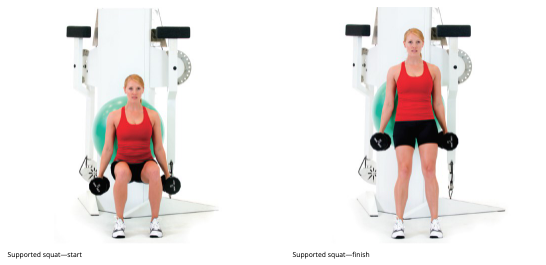

# Knee

## Introduction

+ Status
  + Injuries involving the lower extremity account for more than 66% of all injuries
  + knee is susceptible to injuries resulting from lower kinetic chain impairments
  + 5 to 24 years of age had the highest injury rate. Knee injuries were reported to account for 60% of high school sports–related surgeries, and female athletes were reported to be four to six times more likely to sustain a major knee injury.
+ Common injuries
  + anterior cruciate ligament (ACL). Over 70% of ACL ruptures occur during single-foot contact in physical activity secondary to uncontrolled lower extremity biomechanics 
  + Patellar tendinopathy
    Often associated with jumper’s knee; commonly an overuse injury affecting the patellar tendon, resulting in anterior knee pain.
  + Patellofemoral pain syndrome
    A musculoskeletal condition in which a client experiences pain behind and around the patella with running, squatting, jumping, or other physical activity.
  + Iliotibial (IT) band syndrome
    Often associated with runner’s knee; usually an overuse injury where the iliotibial band rubs on the femur, resulting in lateral knee pain.

### Functional Anatomy

#### Bones and Joints

+ tibiofemoral joint

  + Screw-home mechanism

    External tibial rotation on the femur in open-chain exercises and femoral internal rotation in closed-chain exercises, resulting in the knee “locking-out.”

  + opan chain: as the knee extends during the last 30 degrees, the tibia will externally rotate on the femur to lock the knee into extension, making the ligaments taut

  + Closed-chain: femur will internally rotate on the tibia (Kim et al., 2015), given that the foot is fixated on the ground.

+ patellofemoral joint + quadriceps muscle group

  + Extensor mechanism (aids knee extension)
    Composed of the patellofemoral articulation, patellar tendon, quadriceps tendon, and tibial tubercle working together to produce concentric, eccentric, and isometric actions at the knee.
  + As the quadricep muscles join superiorly, they pass over the patella, forming the patellar tendon, This region is highly susceptible to overuse injuries. As individuals squat, jump, land, run, and walk, the quadricep muscles eccentrically contract, increasing the amount pressure and pull on the patellofemoral articulation

+ fibula: attachment site of the biceps femoris, which crosses and affects the knee.

+ Primarily flexion and extension, 
  + possible: internal and external rotation; valgus and varus; and rolling, sliding, and spinning, when improperly stabilized these motions become more prominent and can lead to injury. 

#### Muscles

+ Key muscles
  + Adductor complex
  + Gastrocnemius/soleus
  + Gluteus maximus and medius
  + Medial and lateral hamstrings complexes
  + Quadriceps
  + Tensor fascia latae (TFL)/IT-band

+ weakness of the hip external ro-tators and gluteus medius and maximus could cause overactivation of the tensor fascia latae (TFL), adductor complex, vastus lateralis, and gastrocnemius muscles.
+ synergistically dominan TFL and adductors become, ultimately resulting in the femur internally rotating and the tibia externally rotating, creating a knee valgus compensation.
+ oevractive vastus lateralis, given its lateral orientation and attachment to the patella, will cause the patella to track laterally and delay the activation of the vastus medialis obliquus (VMO) a
+ overactive gastrocnemius, due to tibial external rotation

### Altered Knee Movement

+ Multidirectional forces
  + ACL sprains or tears
  + patellofemoral joint pain (PFP)
+ Most knee injuries occur during noncontact deceleration in the frontal and transverse planes.

| **Muscle Action** | **Knee**                                                     | **Hip**                                                      | **LPHC**                                                     |
| ----------------- | ------------------------------------------------------------ | ------------------------------------------------------------ | ------------------------------------------------------------ |
| Concentric        | **Flexion** Biceps femoris (short and long head) Semimembranosus Semitendinosus **Tibial internal rotation** Semimembranosus Semitendinosus **Tibial external rotation** Biceps femoris (short and long head) | **Extension** Biceps femoris (long head) Semimembranosus Semitendinosus |                                                              |
| Eccentric         | **Decelerates extension** Biceps femoris (short and long head) Semimembranosus Semitendinosus **Decelerates tibial internal rotation** Biceps femoris (short and long head) **Decelerates tibial external rotation** Semimembranosus Semitendinosus | **Decelerates flexion** Biceps femoris (long head)      |                                                              |
| Isometric         | **Stabilizes the knee** Biceps femoris (short and long head) Semimembranosus Semitendinosus |                                                              | **Stabilizes the LPHC** Biceps femoris (long head) Semimembranosus Semitendinosus |

+ Static Malalignments
  + pes planus distortion syndrome,  10-degree shift in Q-angle increased patellofemoral contact forces by 45% 
  + excessive anterior pelvic tilt; and decreased flexibility of the quadriceps, hamstrings complex, and iliotibial band

+ Abnormal Muscle Activation Patterns
  + individuals with decreased hip external rotation strength have increased vertical ground reaction forces during landing, which is a potential predictor of PFP and ACL injury 
  + increased adductor activity and decreased dorsiflexion in subjects demonstrating increased dynamic knee valgus and decreased neuromuscular control of core musculature
+ Dynamic Malalignment
  + during movement as a result of poor neuromuscular control and dynamic stability of the trunk and lower extremities
  + contralateral pelvic drop, femoral adduction and internal rotation, tibial external rotation, and excessive foot and ankle pronation.

## Assessment

### IR model

+ Superiorly, the hip joint, a ball-and-socket joint, requires a great amount of mobility and stability (Sueki et al., 2013). The hinged knee joint, located in the middle of two highly mobile joints, requires relatively less multiplanar mobility and stability
+ PFP syndrome has been associated with muscular weakness in the LPHC, specifically the hip abductors and lateral rotators
+ knee valgus: foot overpronates, the foot externally rotates and/or everts during movement, and tibial external rotation, femoral adduction, and hip internal rotation increase
+ knee varus if the foot oversupinates, this may lead to a tightness of the lateral gastrocnemius/soleus complex, creating tibial external rotation caused by tightness of the biceps femoris, weakness of the adductor musculature, and tightness of the piriformis

TABLE 12-3 Knee Assessment Results

| **Assessment**                                               | **Results**                                                  |
| ------------------------------------------------------------ | ------------------------------------------------------------ |
| **Static posture**                                           | Knee hyperextension Knee valgus Knee varus         |
| **Transitional and loaded movement**                         | Knee dominance Knee valgus Knee varus              |
| **Dynamic movement**                                         | Knee dominance Knee valgus Knee varus              |
| **Mobility**  Modified Thomas test,  active knee flexion test,  active knee extension test,  hip abduction and external rotation,  weight-bearing lunge test,  passive hip internal rotation,  seated hip internal and external rotation | Limited ankle dorsiflexion ROM Limited hip abduction ROM Limited hip adduction ROM Limited hip extension ROM Limited hip external rotation ROM Limited hip internal rotation ROM Limited knee extension  ROMLimited knee flexion ROM |

+ Transitional assessment
  + wearing dress shoes and spending long hours in seated positions—knee valgus will be the typical movement impairment seen at the knee.
  + elevated heels improve the alignment of the knee during the OHSA, then the root cause of the impairment is likely due to the lack of ankle dorsiflexion. , if elevating the heels does not improve the squat, then musculature at the hips may be involved in the impairments, such as overactive adductors and underactive gluteals
+ Dynamic movement 
  + Depth-jump: 
    + Anterior view to identify knee position on ground strike and throughout the eccentric phase of landing.
    + Most impairments will be observed during deceleration.
    + Knee valgus/ knee dominance
  + If client already has adequate transitional movement, Many times compensations seen during the depth jump may reflect underactivity in the muscles, such as the gluteus maximus, gluteus medius, and core stabilizers. 
  + Gait analysis
    + If an individual is not ready to perform the depth jump assessment, but still has goals related to dynamic activities (e.g., obstacle course race), a basic gait analysis 
    + anterior viewpoint to see if their knee tracks medially (valgus) or laterally (varus) in the frontal plane.
+ Mobility
  + Overactivity in the hip flexors (modified Thomas test), quadriceps (modified Thomas test, active knee flexion test), hamstrings (active knee extension test), adductors (hip abduction and external rotation test), and abductors (modified Thomas test) can be assessed.
  + overactivity in hip external rotators (passive hip internal rotation, seated hip internal rotation), hip internal rotators (seated hip external rotation), and gastrocnemius/soleus (weight-bearing lunge test) may be confirmed using mobility assessments.

## Corrective strategies

TABLE 12-4 Common Corrective Programming Selections for the Knee

| **Phase**  | **Modality**                             | **Muscle(s)/Exercise**                                       | **Acute Training Variables**                                 |
| ---------- | ---------------------------------------- | ------------------------------------------------------------ | ------------------------------------------------------------ |
| Inhibit    | Self-myofascial rolling                  | Adductor complex Biceps femoris Fibularis complex (peroneals) Gastrocnemius Piriformis Quadriceps Soleus TFL | Hold areas of discomfort for 30 to 60 seconds Perform four to six repetitions of active joint movement |
| Lengthen   | Static or neuromuscular stretching (NMS) | Adductor complex (for valgus) Biceps femoris Gastrocnemius Hip flexor complex Piriformis Quadriceps Soleus TFL | Static: 30-second hold  NMS: 7- to 10-second isometric contraction, 30-second static hold |
| Activate   | Isolated strengthening                   | Adductor complex (for varus) Anterior tibialis Core stabilizers Gluteus maximus Gluteus medius Medial hamstrings Posterior tibialis | 10 to 15 reps with 4-second eccentric contraction,  2-second isometric contraction at end-range,  and  1-second concentric contraction |
| Integrate* | Integrated dynamic movement              | Lateral tube walking Lunge to balance progressions Single-leg squat Squat with medicine ball between knees (for varus) Squat with mini-band around knees (for valgus) Step-up to balanceWall jump | 10 to 15 reps under control                                  |

### Knee Valgus

+ Inhibit: gastrocnemius/soleus, adductor complex, TFL, and lateral thigh (emphasizing the vastus lateralis and/or short head of the biceps femoris).
+ Lengthen: gastroc-nemius/soleus, adductor complex, TFL, and biceps femoris.
+ Activate:
  + LPHC: gluteus medius and gluteus maximus
  + Ankle: anterior and posterior tibialis
+ Integrate: 
  + no change in the base of support, as with a supported squat (e.g., ball squat with an elastic mini-band around the knees),
  +  and then progress to more dynamic exercises, such as movement with a change in the base of support (e.g., a lateral tube walk, to a step-up to balance, to a lunge to balance, to a single-leg squat). 
  + Further, integration exercises can be progressed to include increased rate of concentric force production and eccentric deceleration control with the inclusion of wall jumps, tuck jumps, 180-degree jumps, single-leg hops, and cutting maneuvers.
  + Supported squat with mini-band around knees
    Wall jump

### Knee Varus

+ Inhibit: adductor magnus, piriformis, TFL, and biceps femoris (long head).
+ Lengthen: adductor magnus, piriformis, TFL, and biceps femoris (long head).
+ Activate
  + LPHC: adductor complex, medial hamstrings, and gluteus maximus.abdominal core exercises 
  + While it is counterintuitive that a hip external rotator (gluteus maximus) requires activation with a varus impairment, it is more likely that the gluteus maximus is underactive with a synergistically dominant piriformis in this situation. 
+ Integrate: same with valgus
  + squeeze (i.e., activate the adductors) to hold the ball in position, thus improving overall knee alignment.
  + Supported squat with medicine ball between knees
    Wall jump

### Knee Dominance

+ Focus on the piriformis/adductor magnus versus quadriceps/soleus contribution will be determined by the corrective exercise assessment flow. 
  + accompanied by a heel rise, the corrective exercise program can focus on the quadriceps/soleus. 
  + LPHC impairment is present, the corrective exercise program for knee dominance can focus on the piriformis/adductor magnus combination.

+ Inhibit: quadriceps and soleus and/or piriformis and adductor magnus.
+ Lengthen: quadriceps, soleus, piriformis, and adductor magnus.
+ Activate: gluteus maximus and core stabilizers
+ Integrate: same as valgus
  + no need to emphasize abductors or adductors
  + encourage optimal alignment of the knee and coordinated movement with the hip and foot and ankle complex 
  + Squat pattern
    Wall jump

## Common issues

### Patellar Tendinopathy (Jumper’s Knee)

+ 

+ patellar tendon, originating on the base of the patella and inserting at the tibial tuberosity

+ provides the forces necessary to extend the knee in an open-chain position

+ Symptom

  + a common overuse injury and is characterized as pain at the base of the patella
  + In OHSA: Pain on or around the patellar tendon, need to modify or stop the assessment if knee pain is present
  + pes planus distortion syndrome 

+ individuals with underactive gluteals may develop overactive quadriceps in an attempt to compensate for a loss of extensor force production (Mills et al., 2015). The increased activity of the quadriceps may add to the already cumulative forces being distributed through the patellar tendon.

+ Risk factors:

  + Knee valgus and varus
  + An increased Q-angle
  + Poor quadriceps and hamstrings complex flexibility
  + Poor eccentric deceleration capabilities
  + Overtraining and playing on hard surfaces (Everhart et al., 2017; Malliaras et al., 2015)

  

### Patellofemoral Syndrome (PFS)

+ Cause: abnormal tracking of the patella within the femoral trochlea or patellar groove. attributable to static (i.e., increased Q-angle) or dynamic lower extremity malalignment (i.e., increased femoral internal rotation, adduction, and knee valgus), altered muscle activation of surrounding knee musculature, decreased strength of the hip musculature
  
+ Symptoms 
  + pes planus distortion syndrome
  + excessive pronation, or heel rise. 
  + The SLSA will result in knee valgus or varus.
  + Pain will be associated on the front aspect of the knee behind the patella. 

### Iliotibial Band (IT-Band) Syndrome (Runner’s Knee)

+ Cause
  + inflammation and irritation of the distal portion of the iliotibial tendon as it rubs against the lateral femoral condyle as well as compresses the fat pad underneath it, or less commonly, the greater trochanter of the hip, causing a greater trochanteric bursitis
  + lack of flexibility of the TFL, which can result in an increase in tension on the IT-band during the stance phase of running.
  + caused by overuse
  + Weakness in the hip abductor muscles, such as the gluteus medius, may result in synergistic dominance of the TFL (increasing frontal plane instability
  + may lead to increased tension of the IT-band, and thus increased friction on the tissue, with inflammation being the end result.
    
+ Symptoms
  + injury is most often reported in runners as a result of abnormal gait or running biomechanics,
  + knee valgus during the OHSA and SLSA or pes planus distortion syndrome may be more prone to IT-band irritability.

### Anterior Cruciate Ligament (ACL) Injury

+ Cause
  + Many ACL injuries occur from indirect contact (such as changing direction and cutting) due to altered lower extremity neuromusculoskeletal control and the action of anterior forces, lateral forces, rotational forces, or a combination of all three forces on the knee
  + Proximal neuromusculoskeletal control deficits at the hip and trunk during landing are also potential contributing mechanisms
  + can be reduced from 51% to 62% through the application of educational interventions and targeted neuromuscular training
    + should focus on improving movement impairment, such as excessive knee valgus, knee rotation, hip adduction, and hip rotation; improving single-leg neuromuscular balance; and improving muscle strength

### Prehabilitation & rehabilitation

+ Prehabilitation: pre-surgery
  + reduce swelling, increase range of motion, and maintain strength in the lower extremity.
  + targeted inhibitory, lengthening, activation, and integration exercises for the foot and ankle complex and the LPHC.
+ Post surgical
  + limited range of motion secondary to pain and swelling and a loss of muscular strength and tone, especially in the quadriceps muscle group of the involved leg

## Quiz

## References

>
> Aderem, J., & Louw, Q. A. (2015). Biomechanical risk factors associated with iliotibial band syndrome in runners: A systematic review. BMC Musculoskeletal Disorders, 16, 356. https://doi.org/10.1186/s12891-015-0808-7
>
> Almeida, G. P. L., Silva, A. P. M. C. C., França, F. J. R., Magalhães, M. O., Burke, T. N., & Marques, A. P. (2016). Q-angle in patellofemoral pain: Relationship with dynamic knee valgus, hip abductor torque, pain and function. Revista Brasileira de Ortopedia. English Edition, 51(2), 181–186.
>
> Baker, R. L., Souza, R. B., Rauh, M. J., Fredericson, M., & Rosenthal, M. D. (2018). Differences in knee and hip adduction and hip muscle activation in runners with and without iliotibial band syndrome. PM&R, 10(10), 1032–1039.
>
> Bloomer, B. A., & Durall, C. J. (2015). Does the addition of hip strength­ening to a knee-focused exercise program improve outcomes in patients with patellofemoral pain syndrome? Journal of Sport Reha­bilitation, 24(4), 428–433. https://doi.org/10.1123/jsr.2014-0184
>
> Bolgla, L., Malone, T., Umberger, B. R., & Uhl, T. L. (2008). Hip strength and hip and knee kinematics during stair descent in females with and without patellofemoral pain syndrome. Journal of Orthopaedic & Sports Physical Therapy, 38(1), 12–18. https://doi.org/10.2519/jospt.2008
>
> Brant, J. A., Johnson, B., Brou, L., Comstock, R. D., & Vu, T. (2019). Rates and patterns of lower extremity sports injuries in all gender-comparable US high school sports. Orthopaedic Journal of Sports Medicine, 7(10). https://doi.org/10.1177/2325967119873059
>
> Brown, S. R., Brughelli, M., & Hume, P. A. (2014). Knee mechanics during planned and unplanned sidestepping: A systematic review and meta-analysis. Sports Medicine, 44(11), 1573–1588. https://doi.org/10.1007/s40279-014-0225-3
>
> Buldt, A. K., Murley, G. S., Butterworth, P., Levinger, P., Menz, H. B., & Landorf, K. B. (2013). The relationship between foot posture and lower limb kinematics during walking: A systematic review. Gait & Posture, 38(3), 363–372. https://doi.org/10.1016/j.gaitpost.2013.01.010
>
> Carlson, V. R., Sheehan, F. T., & Boden, B. P. (2016). Video analysis of anterior cruciate ligament (ACL) injuries: A systematic review. JBJS Review, 4(11). https://doi.org/10.2106/jbjs.rvw.15.00116
>
> Cowan, S. M., Bennell, K. L., Crossley, K. M., Hodges, P. W., & McConnell, J. (2002). Physical therapy alters recruitment of the vasti in patellofemoral pain syndrome. Medicine & Science in Sports & Exercise, 34(12), 1879–1885. https://doi.org/10.1249/01.MSS.0000038893.30443.CE
>
> Dierks, T. A., Manal, K. T., Hamill, J., & Davis, I. S. (2008). Proximal and distal influences on hip and knee kinematics in runners with patellofemoral pain during a prolonged run. Journal of Orthopaedic & Sports Physical Therapy, 38(8), 448–456. https://doi.org/10.2519/jospt.2008.2490
>
> Donnell-Fink, L. A., Klara, K., Collins, J. E., Yang, H. Y., Goczalk, M. G., Katz, J. N., & Losina, E. (2015). Effectiveness of knee injury and anterior cruciate ligament tear prevention programs: A meta-analysis. PLoS One, 10(12), e0144063. https://doi.org/10.1371/journal.pone.0144063
>
> Everhart, J. S., Cole, D., Sojka, J. H., Higgins, J. D., Magnussen, R. A., Schmitt, L. C., & Flanigan, D. C. (2017). Treatment options for patellar tendinopathy: A systematic review. Arthroscopy, 33(4), 861–872. https://doi.org/10.1016/j.arthro.2016.11.007
>
> Fairclough, J., Hayashi, K., Toumi, H., Lyons, K., Bydder, G., Phillips, N., Best, T. M., & Benjamin, M. (2006). The functional anatomy of the iliotibial band during flexion and extension of the knee: Implications for understanding iliotibial band syndrome. Journal of Anatomy, 208(3), 309–316. https://doi.org/10.1111/j.1469-7580.2006.00531.x
>
> Fernandez, W. G., Yard, E. E., & Comstock, R. D. (2007). Epidemiology of lower extremity injuries among U.S. high school athletes. Academic Emergency Medicine : Official Journal of the Society for Academic Emergency Medicine, 14(7), 641–645.
>
> Figueroa, D., Figueroa, F., & Calvo, R. (2016). Patellar tendinopathy: Diagnosis and treatment. Journal of the American Academy of Orthopaedic Surgeons, 24(12), e184–e192. https://doi.org/10.5435/jaaos-d-15-00703
>
> Flandry, F., & Hommel, G. (2011). Normal anatomy and biomechanics of the knee. Sports Medicine and Arthroscopy Review, 19(2), 82–92. https://doi.org/10.1097/JSA.0b013e318210c0aa
>
> Flato, R., Passanante, G. J., Skalski, M. R., Patel, D. B., White, E. A., & Matcuk, G. R., Jr. (2017). The iliotibial tract: Imaging, anatomy, injuries, and other pathology. Skeletal Radiology, 46(5), 605–622. https://doi.org/10.1007/s00256-017-2604-y
>
> Floyd, R. T. (2017). Manual of structural kinesiology (20th ed.). McGraw-Hill Education.
>
> Ford, K. R., Myer, G. D., Smith, R. L., Vianello, R. M., Seiwert, S. L., & Hewett, T. E. (2006). A comparison of dynamic coronal plane excursion between matched male and female athletes when performing single leg landings. Clinical Biomechanics, 21(1), 33–40. https://doi.org/10.1016/j.clinbiomech.2005.08.010
>
> Fulkerson, J. P. (2002). Diagnosis and treatment of patients with patellofemoral pain. American Journal of Sports Medicine, 30(3), 447–456. https://doi.org/10.1177/03635465020300032501
>
> Gage, B. E., McIlvain, N. M., Collins, C. L., Fields, S. K., & Comstock, R. D. (2012). Epidemiology of 6.6 million knee injuries presenting to United States emergency departments from 1999 through 2008. Academic Emergency Medicine, 19(4), 378–385. https//doi.org/10.1111/j.1553-2712.2012.01315.x
>
> Gagnier, J. J., Morgenstern, H., & Chess, L. (2013). Interventions designed to prevent anterior cruciate ligament injuries in adolescents and adults: A systematic review and meta-analysis. American Journal of Sports Medicine, 41(8), 1952–1962. https//:doi.org/10.1177/0363546512458227
>
> Heinert, B. L., Kernozek, T. W., Greany, J. F., & Fater, D. C. (2008). Hip abductor weakness and lower extremity kinematics during running. Journal of Sport Rehabilitation, 17(3), 243–256.
>
> Hewett, T. E., Ford, K. R., Myer, G. D., Wanstrath, K., & Scheper, M. (2006). Gender differences in hip adduction motion and torque during a single-leg agility maneuver. Journal of Orthopaedic Research, 24(3), 416–421. https://doi.org/10.1002/jor.20056
>
> Hootman, J. M., Macera, C. A., Ainsworth, B. E., Addy, C. L., Martin, M., & Blair, S. N. (2002). Epidemiology of musculoskeletal injuries among sedentary and physically active adults. Medicine & Science in Sports & Exercise, 34(5), 838–844. https://doi .org/10.1097/00005768-200205000-00017
>
> Huberti, H. H., & Hayes, W. C. (1984). Patellofemoral contact pressures. The influence of q-angle and tendofemoral contact. Journal of Bone and Joint Surgery. American Volume, 66(5), 715–724.
>
> Huang, Y. L., Jung, J., Mulligan, C. M. S., Oh, J., & Norcross, M. F. (2019). A majority of anterior cruciate ligament injuries can be prevented by injury prevention programs: A systematic review of randomized controlled trials and cluster-randomized controlled trials with meta-analysis. American Journal of Sports Medicine, 363546519870175. https://doi.org/10.1177/0363546519870175
>
> Ireland, M. L., Willson, J. D., Ballantyne, B. T., & Davis, I. M. (2003). Hip strength in females with and without patellofemoral pain. Journal of Orthopaedic and Sports Physical Therapy, 33(11), 671–676. https://doi.org/10.2519/jospt.2003.33.11.671
>
> Ishida, T., Yamanaka, M., Takeda, N., & Aoki, Y. (2014). Knee rotation associated with dynamic knee valgus and toe direction. The Knee, 21(2), 563–566. https://doi.org/10.1016/j.knee.2012.12.002
>
> Kazemi, M., Dabiri, Y., & Li, L. P. (2013). Recent advances in computational mechanics of the human knee joint. Computational and Mathematical Methods in Medicine, 2013, 718423. https:// doi.org/10.1155/2013/718423
>
> Kenney, W. L., Wilmore, J. H., & Costill, D. L. (2019). Physiology of sport and exercise (7th ed.). Human Kinetics.
>
> Kim, H. Y., Kim, K. J., Yang, D. S., Jeung, S. W., Choi, H. G., & Choy, W. S. (2015). Screw-home movement of the tibiofemoral joint during normal gait: Three-dimensional analysis. Clinics in Orthopedic Surgery, 7(3), 303–309. https://doi.org/10.4055/cios.2015.7.3.303
>
> Komdeur, P., Pollo, F. E., & Jackson, R. W. (2002). Dynamic knee motion in anterior cruciate impairment: A report and case study. Proceedings (Baylor University Medical Center), 15(3), 257–259.
>
> Levine, D., Richards, J., & Whittle, M. W. (2012). Whittle’s gait analysis (5th ed.). Churchill Livingstone/Elsevier.
>
> Malliaras, P., Cook, J., Purdam, C., & Rio, E. (2015). Patellar tendinopathy: Clinical diagnosis, load management, and advice for challenging case presentations. Journal of Orthopaedic & Sports Physical Therapy, 45(11), 887–898. https://doi.org/10.2519 /jospt.2015.5987
>
> Mills, M., Frank, B., Goto, S., Blackburn, T., Cates, S., Clark, M., Aguilar, A., Fava, N., & Padua, D. (2015). Effect of restricted hip flexor muscle length on hip extensor muscle activity and lower extremity biomechanics in college-aged female soccer players. International Journal of Sports Physical Therapy, 10(7), 946–954.
>
> Molgaard, C., Rathleff, M. S., & Simonsen, O. (2011). Patellofemoral pain syndrome and its association with hip, ankle, and foot function in 16- to 18-year-old high school students: A single-blind case-control study. Journal of the American Podiatric Medical Association, 101(3), 215–222.
>
> Moore, K. L., Dalley, A. F., & Agur, A. M. R. (2014). Clinically oriented anatomy (7th ed.). Lippincott, Williams, & Wilkins.
>
> Mucha, M. D., Caldwell, W., Schlueter, E. L., Walters, C., & Hassen, A. (2017). Hip abductor strength and lower extremity running related injury in distance runners: A systematic review. Journal of Science and Medicine in Sport, 20(4), 349–355. https://doi.org /10.1016/j.jsams.2016.09.002
>
> Nakagawa, T. H., Moriya, É. T., Maciel, C. D., & Serrão, A. F. (2012). Frontal plane biomechanics in males and females with and without patellofemoral pain. Medicine & Science in Sports & Exercise, 44(9), 1747–1755. https://doi.org/10.1249/MSS.0b013e318256903a
>
> Nunes, G. S., Barton, C. J., & Viadanna Serrão, F. (2019). Females with patellofemoral pain have impaired impact absorption during a single-legged drop vertical jump. Gait & Posture, 68, 346–351. https://doi.org/10.1016/j.gaitpost.2018.12.013
>
> Page, P., Frank, C. C., & Lardner, R. (2010). Assessment and treatment of muscle imbalance: The Janda approach. Human Kinetics.
>
> Paterno, M. V., Schmitt, L. C., Ford, K. R., Rauh, M. J., Myer, G. D., Huang, B., & Hewett, T. E. (2010). Biomechanical measures during landing and postural stability predict second anterior cruciate ligament injury after anterior cruciate ligament reconstruction and return to sport. American Journal of Sports Medicine, 38(10), 1968–1978. https://doi .org/10.1177/0363546510376053
>
> Pollard, C. D., Sigward, S. M., & Powers, C. M. (2017). ACL injury prevention training results in modification of hip and knee mechanics during a drop-landing task. Orthopaedic Journal of Sports Medicine, 5(9), 2325967117726267. https://doi.org /10.1177/2325967117726267
>
> Powers, C. M., Witvrouw, E., Davis, I. S., & Crossley, K. M. (2017). Evidence-based framework for a pathomechanical model of patellofemoral pain: 2017 Patellofemoral Pain Consensus Statement from the 4th International Patellofemoral Pain Research Retreat, Manchester, UK: Part 3. British Journal of Sports Medicine, 51(24), 1713–1723. https://doi.org/10.1136 /bjsports-2017-098717
>
> Rothermich, M. A., Glaviano, N. R., Li, J., & Hart, J. M. (2015). Patellofemoral pain: Epidemiology, pathophysiology, and treatment options. Clinics in Sports Medicine, 34(2), 313–327. https://doi.org/10.1016/j.csm.2014.12.011
>
> Sahrmann, S. A. (2001). Diagnosis and treatment of movement impairment syndromes. Mosby.
>
> Santos, T. R., Oliveira, B. A., Ocarino, J. M., Holt, K. G., & Fonseca, S. T. (2015). Effectiveness of hip muscle strengthening in patellofemoral pain syndrome patients: A systematic review. Brazilian Journal of Physical Therapy, 19(3), 167–176. https:// doi.org/10.1590/bjpt-rbf.2014.0089
>
> Shin, C. S., Chaudhari, A. M., & Andriacchi, T. P. (2011). Valgus plus internal rotation moments increase anterior cruciate ligament strain more than either alone. Medicine & Science in Sports & Exercise, 43(8), 1484–1491. https://doi.org/10.1249 /MSS.0b013e31820f8395
>
> Sueki, D. G., Cleland, J. A., & Wainner, R. S. (2013). A regional interdependence model of musculoskeletal dysfunction: Research, mechanisms, and clinical implications. Journal of Manual & Manipulative Therapy, 21(2), 90–102. https://doi.org/10.1179 /2042618612Y.0000000027
>
> Teng, P. S. P., Kong, P. W., & Leong, K. F. (2017). Effects of foot rotation positions on knee valgus during single-leg drop landing: Implications for ACL injury risk reduction. The Knee, 24(3), 547–554. https://doi.org/10.1016/j.knee.2017.01.014
>
> Thomée, R., Renström, P., Karlsson, J., & Grimby, G. (1995). Patellofemoral pain syndrome in young women: A clinical analysis of alignment, pain parameters, common symptoms, functional activity level. Scandinavian Journal of Medicine & Science in Sports, 5(4), 237–244.
>
> van der Worp, M. P., van der Horst, N., de Wijer, A., Backx, F. J., & Nijhuis-van der Sanden, M. W. (2012). Iliotibial band syndrome in runners: A systematic review. Sports Medicine, 42(11), 969–992. https://doi.org/10.2165/11635400-000000000-00000
>
> Weiss, K., & Whatman, C. (2015). Biomechanics associated with patellofemoral pain and ACL injuries in sports. Sports Medicine, 45(9), 1325–1337. https://doi.org/10.1007/s40279-015-0353-4