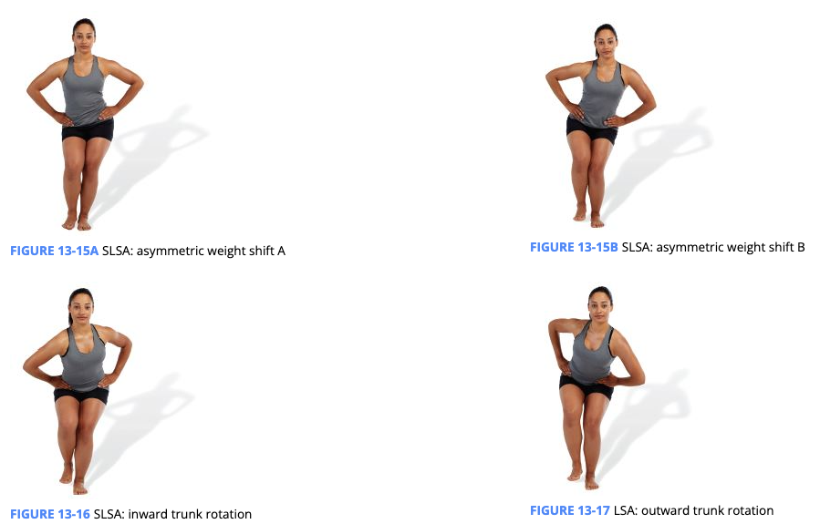

# LPHC

## Functional Anatomy

### Bons and Joints

+ iliofemoral joint 
  
  + femur attaches to the ilium
  + acetabulum is the socket in the ilium where the femoral head connects and helps to deepen the socket.
  + ball and socket
+ sacroiliac joint
  + sacrum is a triangular bone set between the left and right ilia, like a keystone.
  + Little movement occurs at this joint, which is classified as a diarthrodial joint
+ lumbosacral joint
  
  + L5 to sacrum
  + huge compressive force, requires stability to support such forces.

### Muscles

- Abdominal core complex
- Adductor complex
- Erector spinae
- Gastrocnemius/soleus
- Gluteus maximus and medius
- Hamstrings complex
- Hip flexors (psoas, rectus femoris)
- Intrinsic core stabilizers
- Latissimus dorsi
- Tensor fascia latae (TFL)/IT-band

### Altered LPHC Movement

+ 5% of male gymnasts, 80% of weightlifters, 69% of wrestlers, 58% of soccer players, 50% of tennis players, 30% of golfers, and 60% to 80% of the general population were reported to have LBP 
+ Individuals who have LBP are significantly more likely to have additional low-back injuries, which can predispose the individual to future osteoarthritis and long-term disability. 
+ static malalignments (altered length-tension relationships or altered joint arthrokinematics), abnormal muscle activation patterns (altered force-couple relationships), and dynamic malalignments (movement system impairments) can lead to LBP

+ Static malalignments
  + low back excessively arches, low back rounds, or trunk excessively leans forward
  + activation and the relative moment arm of the muscle fibers decrease
  + Vertebral disc injuries occur when the outer fibrous structure of the disc (annulus fibrosis) fails, allowing the internal contents of the disc (nucleus pulposus) to be extruded and irritate nerves exiting the intervertebral foramen
+ Abnormal muscle activation patterns
  + Subjects with LBP demonstrate impaired postural control, delayed muscle relaxation, and abnormal muscle recruitment patterns
  + transverse abdominis and multifidus activation is diminished in patients with LBP
  + similar delay in activation of the internal oblique, multifidus, and gluteus maximus was observed on the symptomatic side of individuals with sacroiliac joint pain
  + multifidus atrophy was present in clients even in the absence of continued LBP
  + bilateral imbalance in isometric strength of the hip extensors was related to the development of LBP
+ Dynamic malalignment
  + increased valgus positioning of the lower extremity, increased risk of knee injuries

### IR Model

+ Above
  + common injuries are often seen in the cervical spine and cervicothoracic region 
  + ability to recruit shoulder musculature
  + anterior translation of the humeral head (<u>Joseph et al., 2014</u>)
  + elbow
  + Core stabilization training has shown to increase thickness of the diaphragm and improve LPHC stability 
+ Below
  + significant risk factor for lower extremity overuse injuries
  + Knee
    + patellar tendinopathy (jumper’s knee; Silva et al., 2015), iliotibial band (IT-band) tendinitis (runner’s knee; Mucha et al., 2017), patellofemoral pain syndrome (Foroughi et al., 2019), and anterior cruciate ligament (ACL) tears 
    + ability to stabilize the LPHC has been shown to decrease hip flexion, adduction, and rotation while minimizing knee valgus and subtalar joint movement during dynamic single-leg landing mechanics 
    + voluntary recruitment of the transverse abdominis and internal obliques increased maximum voluntary contraction of the hip muscles during corrective hip strengthening exercises (Tsang et al., 2018). This suggests a coactivation of the deep abdominal musculature and hip musculature.
  + Foot and ankle
    + plantar fasciitis (McClinton et al., 2018), Achilles tendinopathy (Habets et al., 2017), and medial tibial stress syndrome

## Assessments

TABLE 13-2 LPHC Assessment Results

| **Assessment**                                               | **Results**                                                  |
| ------------------------------------------------------------ | ------------------------------------------------------------ |
| **Static posture**                                           | Hips extended  Hips flexed  Anterior pelvic tilt  Posterior pelvic tilt  Excessive lumbar lordosis  Reduced lumbar lordosis (flattened lumbar spine) |
| **Transitional and loaded movement**                         | Asymmetric weight shift  Excessive anterior pelvic tilt  Excessive posterior pelvic tilt  Excessive forward trunk lean Inward trunk rotation (single-leg and split squat)  Outward trunk rotation (single-leg and split squat)  Squat improves with hands on hips (address latissimus dorsi)  Squat does not improve with hands on hips (address core stabilizers)  Squat does not improve with heels elevated |
| **Dynamic movement**                                         | Asymmetric weight shift  Excessive anterior pelvic tilt  Excessive posterior pelvic tilt  Excessive forward trunk lean Excessive trunk motion (Davies test) |
| **Mobility assessment** Active knee extension, active knee flexion, ankle dorsiflexion, hip abduction and external rotation, seated hip internal and external rotation, lumbar flexion and extension, modified Thomas test, shoulder flexion | Limited knee flexion or extension ROM  Limited lumbar flexion or extension ROM  Limited hip abduction or adduction ROM  Limited hip extension ROM  Limited hip internal or external rotation ROM  Limited dorsiflexion ROM  Limited shoulder flexion ROM |

+ Static
  + 
  + Anterior tilt:
    + Lower crossed
    + layered crossed syndromes
    + Kendall’s lordotic
    + kyphosis-lordosis posture
    + pes planus distortion syndrome 
  + Posterior tilt
    + sway-back
    + flat-back postures 
    + Janda’s upper crossed syndrome, where rounding of the upper back can be responded to at the lumbar spine with increased flexion that visually flattens out the low back
+ Transitional
  + OHSA
    + anterior pelvic tilt may be linked with overactive/ shortened hip flexors and underactive abdominal muscles (**Figure 13-9**),
    +  posterior pelvic tilt (**Figure 13-10**) is associated with overactive/shortened hip extensors (e.g., hamstrings, adductor magnus) and underactivity of the hip flexors, spinal extensors, and latissimus dorsi.
    + Excessive forward lean of the trunk (Figure 13-11) and an asymmetric weight shift (Figure 13-12) are typically associated with dysfunction located outside of the LPHC (limited dorsiflexion ROM)
  + SLSA
    + asymmetric weight shift (Figure 13-15) and inward or outward trunk rotation
      
+ Loaded movement
  + if a client can maintain a neutral pelvis during the OHSA and SLSA, but then demonstrates an anterior tilt during a loaded squat assessment, hip extensor musculature activation (e.g., gluteus maximus) can be prioritized in the client’s program.
+ Dynamic
  + anterior tilting (hips sagging toward the floor) or posterior tilting (hips rounding toward the ceiling) of the pelvis or excessive trunk motion
+ Mobility
  + one or more of the static postural distortion patterns (e.g., Janda’s syndromes and Kendall’s postures) and then demonstrates an anterior or posterior pelvic tilt, then lumbar flexion and extension tests, knee flexion and extension, hip abduction and external rotation, and the modified Thomas test may be assessed to pinpoint which muscles affecting LPHC movement warrant corrective programming.

## Corrective Strategies

TABLE 13-3 Common Corrective Exercise Programming Selections for the LPHC

| **Phase**  | **Modality**                                  | **Muscle(s)/Exercise**                                       | **Acute Training Variables**                                 |
| ---------- | --------------------------------------------- | ------------------------------------------------------------ | ------------------------------------------------------------ |
| Inhibit    | Self-myofascial rolling                       | Adductor complex  Adductor magnus  Biceps femoris  Gastrocnemius/soleus  Hamstrings complex  Latissimus dorsi  Piriformis Rectus  femoris TFL | Hold areas of discomfort for 30 to 60 seconds Perform four to six repetitions of active joint movement |
| Lengthen   | Static stretching or neuromuscular stretching | Abdominal complex  Adductor complex  Adductor magnus  Biceps femoris  Gastrocnemius/soleus  Hamstrings complex  Hip flexor complex Piriformis  Spinal extensor complex TFL | Static: 30-second hold  Neuromuscular stretching: 7- to 10-second isometric contraction 30-second static hold |
| Activate   | Isolated strengthening                        | Adductor complex  Anterior tibialis  Core stabilizers  Gluteus maximus  Gluteus medius  Hamstrings complex  Hip flexor complex  Latissimus dorsi  Rectus abdominis  Spinal extensor complex | 10 to 15 reps with 4-second eccentric contraction, 2-second isometric contraction at end-range, and 1-second concentric contraction |
| Integrate* | Integrated dynamic movement                   | Ball wall squat with overhead press  Cable squat to row  Lateral tube walking  Lunge to overhead press  Step-up to overhead cable press | 10 to 15 reps under control                                  |

### Exercises

### Corrections

#### Excessive forward trunk lean

+ General: deal dorsiflexion and hip extension as well as the body’s ability to decelerate and control hip flexion. 
+ Inhibit: soleus, gastrocnemius, and hip flexor complex (rectus femoris and TFL). 
+ Lengthen: gastrocnemius/soleus, hip flexor complex, and abdominal complex (particularly if lumbar flexion is concurrently observed)
+ Activate: anterior tibialis, gluteus maximus, and intrinsic core stabilizers
+ Integrate:  begin with a ball squat

#### Excessive Anterior Pelvic Tilt - Low Back Arches

+ General: improve hip extension and improve the body’s ability to stabilize the LPHC
+ Inhibit: anterior fibers of the adductor complex as well as the hip flexor complex (psoas, rectus femoris, and TFL), spinal extensors, and latissimus dorsi.
+ Lengthen: hip flexor complex, spinal extensors, and latissimus dorsi. 
+ Activate: gluteus maximus and abdominal complex. 
+ Integrate: 
  + first include uniplanar exercises (sagittal plane) and then progress to multiplanar exercises (frontal and transverse). 
  + place the ball above the lumbar curve to prevent the individual from arching over the ball,
  + Squat to row progressions may also be useful to enforce proper coordination and activation of the posterior oblique subsystem. 

#### Excessive Posterior Pelvic Tilt—Low Back Flattens

+ General:
+ Inhibit:
+ Lengthen:
+ Activate:
+ Integrate:

+ General:
+ Inhibit:
+ Lengthen:
+ Activate:
+ Integrate:

+ General:
+ Inhibit:
+ Lengthen:
+ Activate:
+ Integrate:

+ General:
+ Inhibit:
+ Lengthen:
+ Activate:
+ Integrate:
