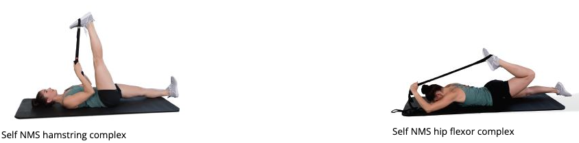

# LPHC

## Functional Anatomy

### Bons and Joints

+ iliofemoral joint 
  
  + femur attaches to the ilium
  + acetabulum is the socket in the ilium where the femoral head connects and helps to deepen the socket.
  + ball and socket
+ sacroiliac joint
  + sacrum is a triangular bone set between the left and right ilia, like a keystone.
  + Little movement occurs at this joint, which is classified as a diarthrodial joint
+ lumbosacral joint
  
  + L5 to sacrum
  + huge compressive force, requires stability to support such forces.

### Muscles

- Abdominal core complex
- Adductor complex
- Erector spinae
- Gastrocnemius/soleus
- Gluteus maximus and medius
- Hamstrings complex
- Hip flexors (psoas, rectus femoris)
- Intrinsic core stabilizers
- Latissimus dorsi
- Tensor fascia latae (TFL)/IT-band

### Altered LPHC Movement

+ 5% of male gymnasts, 80% of weightlifters, 69% of wrestlers, 58% of soccer players, 50% of tennis players, 30% of golfers, and 60% to 80% of the general population were reported to have LBP 
+ Individuals who have LBP are significantly more likely to have additional low-back injuries, which can predispose the individual to future osteoarthritis and long-term disability. 
+ static malalignments (altered length-tension relationships or altered joint arthrokinematics), abnormal muscle activation patterns (altered force-couple relationships), and dynamic malalignments (movement system impairments) can lead to LBP

+ Static malalignments
  + low back excessively arches, low back rounds, or trunk excessively leans forward
  + activation and the relative moment arm of the muscle fibers decrease
  + Vertebral disc injuries occur when the outer fibrous structure of the disc (annulus fibrosis) fails, allowing the internal contents of the disc (nucleus pulposus) to be extruded and irritate nerves exiting the intervertebral foramen
+ Abnormal muscle activation patterns
  + Subjects with LBP demonstrate impaired postural control, delayed muscle relaxation, and abnormal muscle recruitment patterns
  + transverse abdominis and multifidus activation is diminished in patients with LBP
  + similar delay in activation of the internal oblique, multifidus, and gluteus maximus was observed on the symptomatic side of individuals with sacroiliac joint pain
  + multifidus atrophy was present in clients even in the absence of continued LBP
  + bilateral imbalance in isometric strength of the hip extensors was related to the development of LBP
+ Dynamic malalignment
  + increased valgus positioning of the lower extremity, increased risk of knee injuries

### IR Model

+ Above
  + common injuries are often seen in the cervical spine and cervicothoracic region 
  + ability to recruit shoulder musculature
  + anterior translation of the humeral head (<u>Joseph et al., 2014</u>)
  + elbow
  + Core stabilization training has shown to increase thickness of the diaphragm and improve LPHC stability 
+ Below
  + significant risk factor for lower extremity overuse injuries
  + Knee
    + patellar tendinopathy (jumper’s knee; Silva et al., 2015), iliotibial band (IT-band) tendinitis (runner’s knee; Mucha et al., 2017), patellofemoral pain syndrome (Foroughi et al., 2019), and anterior cruciate ligament (ACL) tears 
    + ability to stabilize the LPHC has been shown to decrease hip flexion, adduction, and rotation while minimizing knee valgus and subtalar joint movement during dynamic single-leg landing mechanics 
    + voluntary recruitment of the transverse abdominis and internal obliques increased maximum voluntary contraction of the hip muscles during corrective hip strengthening exercises (Tsang et al., 2018). This suggests a coactivation of the deep abdominal musculature and hip musculature.
  + Foot and ankle
    + plantar fasciitis (McClinton et al., 2018), Achilles tendinopathy (Habets et al., 2017), and medial tibial stress syndrome

## Assessments

TABLE 13-2 LPHC Assessment Results

| **Assessment**                                               | **Results**                                                  |
| ------------------------------------------------------------ | ------------------------------------------------------------ |
| **Static posture**                                           | Hips extended  Hips flexed  Anterior pelvic tilt  Posterior pelvic tilt  Excessive lumbar lordosis  Reduced lumbar lordosis (flattened lumbar spine) |
| **Transitional and loaded movement**                         | Asymmetric weight shift  Excessive anterior pelvic tilt  Excessive posterior pelvic tilt  Excessive forward trunk lean Inward trunk rotation (single-leg and split squat)  Outward trunk rotation (single-leg and split squat)  Squat improves with hands on hips (address latissimus dorsi)  Squat does not improve with hands on hips (address core stabilizers)  Squat does not improve with heels elevated |
| **Dynamic movement**                                         | Asymmetric weight shift  Excessive anterior pelvic tilt  Excessive posterior pelvic tilt  Excessive forward trunk lean Excessive trunk motion (Davies test) |
| **Mobility assessment** Active knee extension, active knee flexion, ankle dorsiflexion, hip abduction and external rotation, seated hip internal and external rotation, lumbar flexion and extension, modified Thomas test, shoulder flexion | Limited knee flexion or extension ROM  Limited lumbar flexion or extension ROM  Limited hip abduction or adduction ROM  Limited hip extension ROM  Limited hip internal or external rotation ROM  Limited dorsiflexion ROM  Limited shoulder flexion ROM |

+ Static
  + 
  + Anterior tilt:
    + Lower crossed
    + layered crossed syndromes
    + Kendall’s lordotic
    + kyphosis-lordosis posture
    + pes planus distortion syndrome 
  + Posterior tilt
    + sway-back
    + flat-back postures 
    + Janda’s upper crossed syndrome, where rounding of the upper back can be responded to at the lumbar spine with increased flexion that visually flattens out the low back
+ Transitional
  + OHSA
    + anterior pelvic tilt may be linked with overactive/ shortened hip flexors and underactive abdominal muscles (**Figure 13-9**),
    +  posterior pelvic tilt (**Figure 13-10**) is associated with overactive/shortened hip extensors (e.g., hamstrings, adductor magnus) and underactivity of the hip flexors, spinal extensors, and latissimus dorsi.
    + Excessive forward lean of the trunk (Figure 13-11) and an asymmetric weight shift (Figure 13-12) are typically associated with dysfunction located outside of the LPHC (limited dorsiflexion ROM)
  + SLSA
    + asymmetric weight shift (Figure 13-15) and inward or outward trunk rotation
      
+ Loaded movement
  + if a client can maintain a neutral pelvis during the OHSA and SLSA, but then demonstrates an anterior tilt during a loaded squat assessment, hip extensor musculature activation (e.g., gluteus maximus) can be prioritized in the client’s program.
+ Dynamic
  + anterior tilting (hips sagging toward the floor) or posterior tilting (hips rounding toward the ceiling) of the pelvis or excessive trunk motion
+ Mobility
  + one or more of the static postural distortion patterns (e.g., Janda’s syndromes and Kendall’s postures) and then demonstrates an anterior or posterior pelvic tilt, then lumbar flexion and extension tests, knee flexion and extension, hip abduction and external rotation, and the modified Thomas test may be assessed to pinpoint which muscles affecting LPHC movement warrant corrective programming.

## Corrective Strategies

TABLE 13-3 Common Corrective Exercise Programming Selections for the LPHC

| **Phase**  | **Modality**                                  | **Muscle(s)/Exercise**                                       | **Acute Training Variables**                                 |
| ---------- | --------------------------------------------- | ------------------------------------------------------------ | ------------------------------------------------------------ |
| Inhibit    | Self-myofascial rolling                       | Adductor complex  Adductor magnus  Biceps femoris  Gastrocnemius/soleus  Hamstrings complex  Latissimus dorsi  Piriformis Rectus  femoris TFL | Hold areas of discomfort for 30 to 60 seconds Perform four to six repetitions of active joint movement |
| Lengthen   | Static stretching or neuromuscular stretching | Abdominal complex  Adductor complex  Adductor magnus  Biceps femoris  Gastrocnemius/soleus  Hamstrings complex  Hip flexor complex Piriformis  Spinal extensor complex TFL | Static: 30-second hold  Neuromuscular stretching: 7- to 10-second isometric contraction 30-second static hold |
| Activate   | Isolated strengthening                        | Adductor complex  Anterior tibialis  Core stabilizers  Gluteus maximus  Gluteus medius  Hamstrings complex  Hip flexor complex  Latissimus dorsi  Rectus abdominis  Spinal extensor complex | 10 to 15 reps with 4-second eccentric contraction, 2-second isometric contraction at end-range, and 1-second concentric contraction |
| Integrate* | Integrated dynamic movement                   | Ball wall squat with overhead press  Cable squat to row  Lateral tube walking  Lunge to overhead press  Step-up to overhead cable press | 10 to 15 reps under control                                  |

### Exercises

### Corrections

#### Excessive forward trunk lean

+ General: deal dorsiflexion and hip extension as well as the body’s ability to decelerate and control hip flexion. 
+ Inhibit: soleus, gastrocnemius, and hip flexor complex (rectus femoris and TFL). 
+ Lengthen: gastrocnemius/soleus, hip flexor complex, and abdominal complex (particularly if lumbar flexion is concurrently observed)
+ Activate: anterior tibialis, gluteus maximus, and intrinsic core stabilizers
+ Integrate:  begin with a ball squat

#### Excessive Anterior Pelvic Tilt - Low Back Arches

+ General: improve hip extension and improve the body’s ability to stabilize the LPHC
+ Inhibit: anterior fibers of the adductor complex as well as the hip flexor complex (psoas, rectus femoris, and TFL), spinal extensors, and latissimus dorsi.
+ Lengthen: hip flexor complex, spinal extensors, and latissimus dorsi. 
+ Activate: gluteus maximus and abdominal complex. 
+ Integrate: 
  + first include uniplanar exercises (sagittal plane) and then progress to multiplanar exercises (frontal and transverse). 
  + place the ball above the lumbar curve to prevent the individual from arching over the ball,
  + Squat to row progressions may also be useful to enforce proper coordination and activation of the posterior oblique subsystem. 

#### Excessive Posterior Pelvic Tilt—Low Back Flattens

+ General: allow appropriate hip flexion
+ Inhibit: hamstrings complex, piriformis, and adductor magnus. 
+ Lengthen: hamstrings complex, piriformis, abdominal complex (rectus abdominis and external obliques in particular), and adductor magnus. 
+ Activate: gluteus maximus, hip flexors, and spinal extensors. 
  + it is unlikely the gluteus maximus is truly overactive. It is more likely that the adductor magnus and piriformis are synergistically dominant while compensating for an underactive gluteus maximus, contributing to posterior tilting of the pelvis.
+ Integrate: first include uniplanar exercises (sagittal plane) and then progress to multiplanar exercises (frontal and transverse). 

#### Asymmetric Weight Shift

+ General: view it as a holistic frontal plane control issue.
+ Inhibit:
  + Opposite-side biceps femoris
  + Opposite-side gastrocnemius/soleus
  + Opposite-side piriformis
  + Same-side adductor complex
  + Same-side TFL
+ Lengthen: 
  + Opposite-side biceps femoris
  + Opposite-side gastrocnemius/soleus
  + Opposite-side piriformis
  + Same-side adductor complex
  + Same-side TFL
+ Activate:
  + Core stabilizers
  + Opposite-side adductor complex
  + Same-side gluteus medius
+ Integrate: same

#### Trunk rotation

+ General: underactive gluteus maximus and medius muscles paired with overactive hip internal or external rotator muscles in the stance leg
  + inward rotation is seen, the TFL and adductor complex (hip internal rotators) are likely overactive. 
  + outward rotation is seen, the piriformis (a hip external rotator), posterior fibers of the adductor magnus, and biceps femoris are most likely overactive.
+ inward trunk rotation is seen on the SLSA, corrective protocols for knee valgus can be applied to whichever side of the body the rotation is seen
+ An outward trunk rotation on the SLSA is more rarely seen, but can often be addressed by inhibiting the piriformis, activating the gluteus maximus and medius, and practicing proper form for two-leg and single-leg squat movement patterns

## Common issues

### Low-back Pain

+ Status
  + U.S. society, with up to 35% of individuals experiencing reduced activity due to chronic back conditions and approximately 7% of that number with back issues that persist for 6 months or more
+ Symptoms
  + The lumbar spine pain referral locations are called dermatomes  
  + if there is a disc herniation at the L5–S1 level, it will cause possible pain and neurological symptoms (e.g., numbness and tingling) down the leg into the foot
  + higher spinal level (e.g., L1–L3) would produce symptoms in the LPHC.
    
+ Cause
  + muscle imbalances, decreased mobility, disc pathology, facet joint dysfunction, joint degeneration (spondylosis), and spinal instability
  + Poor passive hip extension (Roach et al., 2015), increased anterior pelvic tilt (Król et al., 2017), increased lumbar lordosis (Hosseinifar et al., 2017), limited LPHC stability (McGill, 2016; Mitra & Mande, 2019; Puntumetakul et al., 2018), weak gluteus maximus (Amabile et al., 2017), weak gluteus medius (Cooper et al., 2016), too much sitting (Brakenridge et al., 2018), awkward trunk postures (Nourollahi et al., 2018), altered motor control of LPHC musculature (Roshini & Leo Aseer, 2019), and pelvic floor dysfunction
+ Approach
  +  improving motor control, mobility, isolated LPHC strength, lifting and ergonomics, and client education. 
  + **Abdominal Bracing Versus Abdominal Hollowing**
    + isometric spinal stabilization training is superior to dynamic exercises at developing LPHC stiffness 
    + Engagement of the transverse abdominis highly effective at minimizing low-back pain (LBP) and increasing LPHC stability. 
    + Evidence shows that deep abdominal muscles are more activated with abdominal hollowing and surface muscles are more activated with abdominal bracing
    + Abdominal hollowing was found superior to abdominal bracing for increasing LPHC stability and leg stiffness in hopping tasks 
    + abdominal bracing is one of the more effective techniques to activate the deep core musculature.
    + In early stages of the training, cueing abdominal hollowing may be considered a good starting point to ensure transverse abdominis activation.
    + abdominal bracing can be implemented immediately during core stabilization exercises to increase stiffness and minimize movement in the LPHC

### Intervertebral Disc Injury

+ Cause
  + Disc pressure increases with lumbar flexion and decreases in lordosis during the performance of activities. 
  + increase the strain placed on the discs and include flexion with lateral bending
  + compression combined with bending and twisting moments about the disc contributed to earlier degeneration in compromised intervertebral discs
  + Pelvic asymmetry alters static posture of the entire LPHC, which alters normal arthrokinematics 

### Sacroiliac Joint Dysfunction

+ Cause
  + LPHC muscle imbalances, neuromotor weakness, trauma, overuse, poor sitting posture, and pregnancy. 
+ Symptom
  + posterior buttocks or sacroiliac region and can refer into the groin or down the posterior lateral leg to the knee in some individuals 
    
+ Correction
  + LPHC muscle stabilization exercises
  + enhancing flexibility of the hip flexors, quadriceps, adductor complex, and hamstrings complex

### Muscle Strains

+ General
  + muscle and or muscle–tendon unit.
  + occur if the muscle works beyond its capacity,resulting in a tear of the muscle fibers.
+ Symptom
  +  In mild strains, the client may report tightness or tension. 
  + In more severe cases, the client may report feeling a sudden tear or pop that leads to immediate pain and weakness in the muscle (**Table 13-8**) (Floyd, 2017). 
  + Swelling, discoloration (ecchymosis), and loss of function often occur after the injury (Cheatham & Kolber, 2016). 
  + Muscle strains related to the LPHC and lower kinetic chain extremity primarily occur in the quadriceps, hamstrings, and adductors (groin).
+ Cause
  + Muscle strains of the quadriceps and hamstring groups are often caused by a severe stretch to the muscle or a rapid, forceful contraction (e.g., sprinting). 
  + the hamstrings have the highest frequency of strains in the body and are common in running and jumping sports.
  + risk factors include but are not limited to prior injury of the same muscle, age, poor flexibility, lower extremity muscle imbalance, improper warm-up, and training errors 
  + Adductor or groin strains are common in sports such as soccer, ice hockey, and figure skating (Kerbel et al., 2018). These activities require explosive acceleration, deceleration, and change of direction. 

## Quiz

## Refereces

> Ahmad, C. S., Redler, L. H., Ciccotti, M. G., Maffulli, N., Longo, U. G., & Bradley, J. (2013). Evaluation and management of hamstring injuries. *The American Journal of Sports Medicine*, *41*(12), 2933–2947. https://doi.org/10.1177/0363546513487063
>
> Algudairi, G., Aleisa, E., & Al-Badr, A. (2019). Prevalence of neuropathic pain and pelvic floor disorders among females seeking physical therapy for chronic low back pain. *Urology Annals, 11*(1), 20–26.
>
> Almeida, G. P., Silva, A. P., Franca, F. J., Magalhães, M. O., Burke, T. N., & Marques, A. P. (2016). Relationship between frontal plane projection angle of the knee and hip and trunk strength in women with and without patellofemoral pain. *Journal of Back and Musculoskeletal Rehabilitation*, *29*(2), 259–266. https://doi.org/10.3233/bmr-150622
>
> Amabile, A. H., Bolte, J. H., & Richter, S. D. (2017). Atrophy of gluteus maximus among women with a history of chronic low back pain. *PLoS One*, *12*(7), e0177008. https://doi.org/10.1371/journal.pone.0177008
>
> Arab, A. M., Soleimanifar, M., & Nourbakhsh, M. R. (2019). Relationship between hip extensor strength and back extensor length in patients with low back pain: A cross-sectional study. *Journal of Manipulative and Physiological Therapeutics*, *42*(2), 125–131. https://doi.org/10.1016/j.jmpt.2019.03.004
>
> Araujo, V. L., Souza, T. R., Carvalhais, V. O. D. C., Cruz, A. C., & Fonseca, S. T. (2017). Effects of hip and trunk muscle strengthening on hip function and lower limb kinematics during step-down task. *Clinical Biomechanics*, *44*, 28–35. https://doi.org/10.1016/j.clinbiomech.2017.02.012
>
> Baldon, R., Piva, S. R., Scattone Silva, R., & Serrão, F. V. (2015). Evaluating eccentric hip torque and trunk endurance as mediators of changes in lower limb and trunk kinematics in response to functional stabilization training in women with patellofemoral pain. *American Journal of Sports Medicine*, *43*(6), 1485–1493. https://doi.org/10.1177/0363546515574690
>
> Brakenridge, C. L., Chong, Y. Y., Winkler, E. A. H., Hadgraft, N. T., Fjeldsoe, B. S., Johnston, V., Straker, L. M., Healy, G. N., & Clark, B. K. (2018). Evaluating short-term musculoskeletal pain changes in desk-based workers receiving a workplace sitting-reduction intervention. *International Journal of Environmental Research and Public Health*, *15*(9), 1975. https://doi.org/10.3390/ijerph15091975
>
> Calvo-Muñoz, I., Gómez-Conesa, A., & Sánchez-Meca, J. (2013). Prevalence of low back pain in children and adolescents: A meta-analysis. *BMC Pediatrics*, *13*, 14. https://doi.org/10.1186/1471-2431-13-14
>
> Caneiro, J. P., O’Sullivan, P., Burnett, A., Barach, A., O’Neil, D., Tveit, O., & Olafsdottir, K. (2010). The influence of different sitting postures on head/neck posture and muscle activity. *Manual Therapy*, *15*(1), 54–60. https://doi.org/10.1016/j.math.2009.06.002
>
> Cheatham, S. W., & Kolber, M. J. (2016). *Orthopedic management of the hip and pelvis*. Elsevier.
>
> Cheatham, S. W., & Kreiswirth, E. M. (2014). The regional interdependence model: A clinical examination concept. *International Journal of Athletic Therapy & Training*, *19*(3), 8–14. https://doi.org/10.1123/ijatt.2013-0113
>
> Cibulka, M. T., Sinacore, D. R., Cromer, G. S., & Delitto, A. (1998). Unilateral hip rotation range of motion asymmetry in patients with sacroiliac joint regional pain. *Spine*, *23*(9), 1009–1015. https://doi.org/10.1097/00007632-199805010-00009
>
> Cooper, N. A., Scavo, K. M., Strickland, K. J., Tipayamongkol, N., Nicholson, J. D., Bewyer, D. C., & Sluka, K. A. (2016). Prevalence of gluteus medius weakness in people with chronic low back pain compared to healthy controls. *European Spine Journal*, *25*(4), 1258–1265. https://doi.org/10.1007/s00586-015-4027-6
>
> Cronstrom, A., Creaby, M. W., Nae, J., & Ageberg, E. (2016). Modifiable factors associated with knee abduction during weight-bearing activities: A systematic review and meta-analysis. *Sports Medicine*, *46*(11), 1647–1662. https://doi.org/10.1007/s40279-016-0519-8
>
> Daniels, J. M., Pontius, G., El-Amin, S., & Gabriel, K. (2011). Evaluation of low back pain in athletes. *Sports Health*, *3*(4), 336–345. https://doi.org/10.1177/1941738111410861
>
> De Blaiser, C., De Ridder, R., Willems, T., Vanden Bossche, L., Danneels, L., & Roosen, P. (2019). Impaired core stability as a risk factor for the development of lower extremity overuse injuries: A prospective cohort study. *American Journal of Sports Medicine*, *47*(7), 1713–1721. https://doi.org/10.1177/0363546519837724
>
> Dufour, S., Vandyken, B., Forget, M. J., & Vandyken, C. (2018). Association between lumbopelvic pain and pelvic floor dysfunction in women: A cross sectional study. *Musculoskeletal Science & Practice, 34*, 47–53.
>
> Dülger, E., Bilgin, S., Bulut, E., İnal İnce, D., Köse, N., Türkmen, C., Çetin, H., & Karakaya, J. (2018). The effect of stabilization exercises on diaphragm muscle thickness and movement in women with low back pain. *Journal of Back and Musculoskeletal Rehabilitation*, *31*(2), 323–329. https://doi.org/10.3233/BMR-169749
>
> Dupeyron, A., Hertzog, M., Micallef, J. P., & Perrey, S. (2013). Does an abdominal strengthening program influence leg stiffness during hopping tasks? *Journal of Strength & Conditioning Research*, *27*(8), 2129–2133. https://doi.org/10.1519/JSC.0b013e318278f0c7
>
> Emami, F., Yoosefinejad, A. K., & Razeghi, M. (2018). Correlations between core muscle geometry, pain intensity, functional disability and postural balance in patients with nonspecific mechanical low back pain. *Medical Engineering & Physics*, *60*, 39–46. https://doi.org/10.1016/j.medengphy.2018.07.006
>
> Fatahi, F., Ghasemi, G., Karimi, M., & Beyranvand, R. (2019). The effect of eight weeks of core stability training on the lower extremity joints moment during single-leg drop landing. *Baltic Journal of Health & Physical Activity*, *11*(1), 34–44. https://doi.org/10.29359/BJHPA.11.1.04
>
> Floyd, R. T. (2017). *Manual of structural kinesiology* (20th ed.). McGraw-Hill Education.
>
> Foroughi, F., Sobhani, S., Yoosefinejad, A. K., & Motealleh, A. (2019). Added value of isolated core postural control training on knee pain and function in women with patellofemoral pain syndrome: A randomized controlled trial. *Archives of Physical Medicine and Rehabilitation*, *100*(2), 220–229. https://doi.org/10.1016/j.apmr.2018.08.180
>
> Fuglsang, E. I., Telling, A. S., & Sárensen, H. (2017). Effect of ankle mobility and segment ratios on trunk lean in the barbell back squat. *Journal of Strength & Conditioning Research*, *31*(11), 3024–3033. https://doi.org/10.1519/JSC.0000000000001872
>
> Ha, S. M., Kwon, O. Y., Kim, S. J., & Choung, S. D. (2014). The importance of a normal breathing pattern for an effective abdominal-hollowing maneuver in healthy people: An experimental study. *Journal of Sport Rehabilitation*, *23*(1), 12–17. https://doi.org/10.1123/jsr.2012-0059
>
> Habets, B., Smits, H. W., Backx, F. J. G., van Cingel, R. E. H., & Huisstede, B. M. A. (2017). Hip muscle strength is decreased in middle-aged recreational male athletes with midportion Achilles tendinopathy: A cross-sectional study. *Physical Therapy in Sport*, *25*, 55–61. https://doi.org/10.1016/j.ptsp.2016.09.008
>
> Haddas, R., Hooper, T., James, C. R., & Sizer, P. S. (2016). Volitional spine stabilization during a drop vertical jump from different landing heights: Implications for anterior cruciate ligament injury. *Journal of Athletic Training*, *51*(12), 1003–1012. https://doi.org/10.4085/1062-6050-51.12.18
>
> Hodges, P., Holm, A. K., Hansson, T., & Holm, S. (2006). Rapid atrophy of the lumbar multifidus follows experimental disc or nerve root injury. *Spine*, *31*(25), 2926–2933. https://doi.org/10.1097/01.brs.0000248453.51165.0b
>
> Hosseinifar, M., Ghiasi, F., Akbari, A., & Ghorbani, M. (2017). The effect of stabilization exercises on lumbar lordosis in patients with low back pain. *Annals of Tropical Medicine & Public Health*, *10*(6), 1779–1784. https://doi.org/10.4103/ATMPH.ATMPH_654_17
>
> Hungerford, B., Gilleard, W., & Hodges, P. (2003). Evidence of altered lumbopelvic muscle recruitment in the presence of sacroiliac joint pain. *Spine, 28*(14), 1593–1600.
>
> Hwang, Y. I., & Kim, K. S. (2018). Effects of pelvic tilt angles and forced vital capacity in healthy individuals. *Journal of Physical Therapy Science*, *30*(1), 82–85. https://doi.org/10.1589/jpts.30.82
>
> Iwai, K., Nakazato, K., Irie, K., Fujimoto, H., & Nakajima, H. (2004). Trunk muscle strength and disability level of low back pain in collegiate wrestlers. *Medicine & Science in Sports & Exercise, 36*(8), 1296–1300.
>
> Jandre Reis, F. J., & Macedo, A. R. (2015). Influence of hamstring tightness in pelvic, lumbar and trunk range of motion in low back pain and asymptomatic volunteers during forward bending. *Asian Spine Journal*, *9*(4), 535–540. https://doi.org/10.4184/asj.2015.9.4.535
>
> Joseph, L. H., Hussain, R. I., Naicker, A. S., Htwe, O., Pirunsan, U., & Paungmali, A. (2014). Myofascial force transmission in sacroiliac joint dysfunction increases anterior translation of humeral head in contralateral glenohumeral joint. *Polish Annals of Medicine*, *21*(2), 103–108. https://doi.org/10.1016/j.poamed.2014.07.007
>
> Kahlaee, A. H., Ghamkhar, L., & Arab, A. M. (2017). Effect of the abdominal hollowing and bracing maneuvers on activity pattern of the lumbopelvic muscles during prone hip extension in subjects with or without chronic low back pain: A preliminary study. *Journal of Manipulative and Physiological Therapeutics*, *40*(2), 106–117. https://doi.org/10.1016/j.jmpt.2016.10.009
>
> Kerbel, Y. E., Smith, C. M., Prodromo, J. P., Nzeogu, M. I., & Mulcahey, M. K. (2018). Epidemiology of hip and groin injuries in collegiate athletes in the United States. *Orthopaedic Journal of Sports Medicine*, *6*(5), 2325967118771676. https://doi.org/10.1177/2325967118771676
>
> Kim, M.-H., & Oh, J.-S. (2015). Effects of performing an abdominal hollowing exercise on trunk muscle activity during curl-up exercise on an unstable surface. *Journal of Physical Therapy Science*, *27*(2), 501–503. https://doi.org/10.1589/jpts.27.501
>
> Król, A., Gleb, K., Polak, M., Szczygiel, E., & Wójcik, P. (2017). Relationship between mechanical factors and pelvic tilt in adults with and without low back pain. *Journal of Back and Musculoskeletal Rehabilitation, 30*(4), 699–705.
>
> Kurosawa, D., Murakami, E., & Aizawa, T. (2017). Groin pain associated with sacroiliac joint dysfunction and lumbar disorders. *Clinical Neurology and Neurosurgery*, *161*, 104–109. https://doi.org/10.1016/j.clineuro.2017.08.018
>
> Laudner, K. G., Wong, R., & Meister, K. (2019). The influence of lumbopelvic control on shoulder and elbow kinetics in elite baseball pitchers. *Journal of Shoulder and Elbow Surgery*, *28*(2), 330–334. https://doi.org/10.1016/j.jse.2018.07.015
>
> Lee, A. Y., Baek, S. O., Cho, Y. W., Lim, T. H., Jones, R., & Ahn, S. A. (2016). Pelvic floor muscle contraction and abdominal hollowing during walking can selectively activate local trunk stabilizing muscles. *Journal of Back and Musculoskeletal Rehabilitation*, *29*(4), 731–739.
>
> Lee, A. Y., Kim, E. H., Cho, Y. W., Kwon, S. O., Son, S. M., & Ahn, S. H. (2013). Effects of abdominal hollowing during stair climbing on the activations of local trunk stabilizing muscles: A cross-sectional study. *Annals of Rehabilitation Medicine*, *37*(6), 804–813. https://doi.org/10.5535/arm.2013.37.6.804
>
> Lee, B. C., & McGill, S. M. (2015). Effect of long-term isometric training on core/torso stiffness. *Journal of Strength & Conditioning Research*, *29*(6), 1515–1526. https://doi.org/10.1519/JSC.0000000000000740
>
> Maeo, S., Takahashi, T., Takai, Y., & Kanehisa, H. (2013). Trunk muscle activities during abdominal bracing: Comparison among muscles and exercises. *Journal of Sports Science & Medicine*, *12*(3), 467–474.
>
> Massoud Arab, A., Reza Nourbakhsh, M., & Mohammadifar, A. (2011). The relationship between hamstring length and gluteal muscle strength in individuals with sacroiliac joint dysfunction. *Journal of Manual & Manipulative Therapy, 19*(1), 5–10. https://doi.org/10.1179/106698110X12804993426848
>
> McClinton, S., Weber, C. F., & Heiderscheit, B. (2018). Low back pain and disability in individuals with plantar heel pain. *Foot*, *34*, 18–22. https://doi:10.1016/j.foot.2017.09.003
>
> McGill, S. (2016). *Low back disorders: Evidence-based prevention and rehabilitation* (3rd ed.). Human Kinetics.
>
> Mitra, M., & Mande, M. (2019). Effectiveness of core stabilization training with pressure biofeedback in the management of mechanical low back pain in subjects between age group of 20–25 years. *Indian Journal of Physiotherapy & Occupational* *Therapy, 13(1), 82–87. https://doi.org/10.5958/0973-5674.2019.00016.9*
>
> *Mısırlıoğlu, T. Ö., Eren, İ., Canbulat, N., Çobanoğlu, E., Günerbüyük, C., & Demirhan, M. (2018). Does a core stabilization exercise program have a role on shoulder rehabilitation? A comparative study in young females. Turkish Journal of Physical Medicine & Rehabilitation, 64(4), 328–336. https://doi.org/10.5606/tftrd.2018.1418*
>
> *Monfort-Pañego, M., Vera-García, F. J., Sánchez-Zuriaga, D., & Sarti-Martínez, M. A. (2009). Electromyographic studies in abdominal exercises: A literature synthesis. Journal of Manipulative & Physiological Therapeutics, 32(3), 232–244. https://doi.org/10.1016/j.jmpt.2009.02.007*
>
> *Mucha, M. D., Caldwell, W., Schlueter, E. L., Walters, C., & Hassen, A. (2017). Hip abductor strength and lower extremity running related injury in distance runners: A systematic review. Journal of Science and Medicine in Sport, 20(4), 349–355. https://doi.org/10.1016/j.jsams.2016.09.002*
>
> *Myer, G. D., Ford, K. R., Brent, J. L., & Hewett, T. E. (2012). An integrated approach to change the outcome part II: Targeted neuromuscular training techniques to reduce identified ACL injury risk factors. Journal of Strength and Conditioning Research, 26(8), 2272–2292. https://doi.org/10.1519/JSC.0b013e31825c2c7d*
>
> *Neumann, D. A. (2016). Kinesiology of the musculoskeletal system: Foundations for rehabilitation (3rd ed.). Elsevier.*
>
> *Nourollahi, M., Afshari, D., & Dianat, I. (2018). Awkward trunk postures and their relationship with low back pain in hospital nurses. Work, 59(3), 317–323. https://doi.org/10.3233/WOR-182683*
>
> *Page, P., Frank, C. C., & Lardner, R. (2010). Assessment and treatment of muscle imbalance: The Janda approach. Human Kinetics.*
>
> *Parfrey, K., Gibbons, S. G. T., Drinkwater, E. J., & Behm, D. G. (2014). Effect of head and limb orientation on trunk muscle activation during abdominal hollowing in chronic low back pain. BMC Musculoskeletal Disorders, 15(52). https://doi.org/10.1186/1471-2474-15-52*
>
> *Pel, J. J., Spoor, C. W., Pool-Goudzwaard, A. L., Hoek van Dijke, G. A., & Snijders, C. J. (2008). Biomechanical analysis of reducing sacroiliac joint shear load by optimization of pelvic muscle and ligament forces. Annals of Biomedical Engineering, 36(3), 415–424. https://doi.org/10.1007/s10439-007-9385-8*
>
> *Puntumetakul, R., Chalermsan, R., Hlaing, S. S., Tapanya, W., Saiklang, P., & Boucaut, R. (2018). The effect of core stabilization exercise on lumbar joint position sense in patients with subacute non-specific low back pain: A randomized controlled trial. Journal of Physical Therapy Science, 30(11), 1390–1396. https://doi.org/10.1589/jpts.30.1390*
>
> *Reeve, A., & Dilley, A. (2009). Effects of posture on the thickness of transversus abdominis in pain-free subjects. Manual Therapy, 14(6), 679–684. https://doi.org/10.1016/j.math.2009.02.008*
>
> *Roach, S. M., San Juan, J. G., Suprak, D. N., Lyda, M., Bies, A. J., & Boydston, C. R. (2015). Passive hip range of motion is reduced in active subjects with chronic low back pain compared to controls. International Journal of Sports Physical Therapy, 10(1), 13–20.*
>
> *Roshini, P. D., & Leo Aseer, P. A. (2019). Motor control training in chronic low back pain. Journal of Clinical and Diagnostic Research, 13(4), YC01–YC05. https://doi.org/10.7860/JCDR/2019/39618.12746*
>
> *Sadeghisani, M., Manshadi, F. D., Kalantari, K. K., Rahimi, A., Namnik, N., Karimi, M. T., & Oskouei, A. E. (2015). Correlation between hip rotation range-of-motion impairment and low back pain. A literature review. Ortopedia Traumatologica, Rehabilitacjal, 17(5), 455–462. https://doi.org/10.5604/15093492.1186813*
>
> *Silva, R. S., Ferreira, A. L. G., Nakagawa, T. H., Santos, J. E. M., & Serrão, F. V. (2015). Rehabilitation of patellar tendinopathy using hip extensor strengthening and landing-strategy modification: Case report with 6-month follow-up. Journal of Orthopaedic and Sports Physical Therapy, 45(11), 899–909.*
>
> *Sorensen, C. J., Johnson, M. B., Norton, B. J., Callaghan, J. P., & Van Dillen, L. R. (2016). Asymmetry of lumbopelvic movement patterns during active hip abduction is a risk factor for low back pain development during standing. Human Movement Science, 50, 38–46. https://doi.org/10.1016/j.humov.2016.10.003*
>
> *Suehiro, T., Mizutani, M., Watanabe, S., Ishida, H., Kobara, K., & Osaka, H. (2014). Comparison of spine motion and trunk muscle activity between abdominal hollowing and abdominal bracing maneuvers during prone hip extension. Journal of Bodywork & Movement Therapies, 18(3), 482–488. https://doi.org/10.1016/j.jbmt.2014.04.012*
>
> *Sueki, D. G., Cleland, J. A., & Wainner, R. S. (2013). A regional interdependence model of musculoskeletal dysfunction: Research, mechanisms, and clinical implications. Journal of Manual & Manipulative Therapy, 21(2), 90–102. https://doi.org/10.1179/2042618612y.0000000027*
>
> *Tsai, L. C., Ko, Y. A., Hammond, K. E., Xerogeanes, J. W., Warren, G. L., & Powers, C. M. (2017). Increasing hip and knee flexion during a drop-jump task reduces tibiofemoral shear and compressive forces: Implications for ACL injury prevention training. Journal of Sports Sciences, 35(24), 2405–2411. https://doi.org/10.1080/02640414.2016.1271138*
>
> *Tsang, S. M. H., Lam, A. H. M., Ng, M. H. L., Ng, K. W. K., Tsui, C. O. H., & Yiu, B. (2018). Abdominal muscle recruitment and its effect on the activity level of the hip and posterior thigh muscles during therapeutic exercises of the hip joint. Journal of Electromyography and Kinesiology, 42, 10–19. https://doi.org/10.1016/j.jelekin.2018.06.005*
>
> *U.S. Department of Health and Human Services. (2019). Arthritis, osteoporosis, and chronic back conditions. Healthy People 2020. Retrieved from https://www.healthypeople.gov/2020/data-search/Search-the-Data#topic-area=3507*
>
> *Vaičienė, G., Berškienė, K., Slapsinskaite, A., Mauricienė, V., & Razon, S. (2018). Not only static: Stabilization manoeuvres in dynamic exercises—a pilot study. PLoS One, 13(8), e0201017. https://doi.org/10.1371/journal.pone.0201017*
>
> *Vasseljen, O., Unsgaard-Tøndel, M., Westad, C., & Mork, P. J. (2012). Effect of core stability exercises on feed-forward activation of deep abdominal muscles in chronic low back pain. Spine, 37(13), 1101–1108. https://doi.org/10.1097/BRS.0b013e318241377c*
>
> *Vleeming, A., Schuenke, M. D., Masi, A. T., Carreiro, J. E., Danneels, L., & Willard, F. H. (2012). The sacroiliac joint: An overview of its anatomy, function and potential clinical implications. Journal of Anatomy, 221(6), 537–567. https://doi.org/10.1111/j.1469-7580.2012.01564.x*
>
> *Wallden, M. (2014). The middle crossed syndrome: New insights into core function. Journal of Bodywork & Movement Therapies, 18(4), 616–620. https://doi.org/10.1016/j.jbmt.2014.09.002*
>
> *Winkelmann, Z. K., Anderson, D., Games, K. E., & Eberman, L. E. (2016). Risk factors for medial tibial stress syndrome in active* *individuals: An evidence-based review. Journal of Athletic Training, 51(12), 1049–1052. https://doi.org/10.4085/1062-6050-51.12.13*
>
> *Wong, A. Y., Parent, E. C., Funabashi, M., Stanton, T. R., & Kawchuk, G. N. (2013). Do various baseline characteristics of transversus abdominis and lumbar multifidus predict clinical outcomes in nonspecific low back pain? A systematic review. Pain, 154(12), 2589–2602. https://doi.org/10.1016/j.pain.2013.07.010*
