# Introduction

+ thoracic spine is not inherently mobile, optimal thoracic spine mobility combines with the scapula and shoulder to provide significant degrees of freedom. 
+ shoulder is the most mobile joint in the body 

# Functional Anatomy

## Bones and Joints: Thoracic Spine

+ Due to the articulation with the rib cage, the thoracic spine is more rigid than the lumbar and cervical spines and provides protection for the thoracic viscera, such as the heart and lungs (Bogduk, 2016). 
+ movements such as rotation, flexion/extension, and lateral flexion
+ Proper alignment:
  + head is straight above their hips when viewed from the side. Standing in this position minimizes the forces of gravity and allows a person to stand with the best posture. 
  + Normal thoracic kyphosis ranges from 20 to 40 degrees when viewed from the side. A curvature that exceeds that range means hyperkyphosis is present (Bogduk, 2016).

+ IR: For example, decreased thoracic spine mobility can lead to excessive cervical ROM to compensate for the limitation in the thoracic spine. 

## Bones and Joints: Shoulder

+ ball and socket. A common anatomical analogy refers to the shoulder joint as a golf ball resting on a tee 
+ less on bony structures for stability (such as the ball and socket of the hip joint) and more on the ligaments and muscles surrounding the joint 
+ clavicle offers the only bony attachment to the axial skeleton: sternoclavicular and acromioclavicular joints. 
+ The shoulder girdle has the greatest range of motion of any joint in the body and refers specifically to the articulations between the humerus, scapula, clavicle, rib cage (thorax), and sternum that make up the glenohumeral (GH), acromioclavicular (AC), sternoclavicular (SC), and scapulothoracic joints 

### ANATOMY OF THE SCAPULA

Shoulder girdle

The bones and joints that connect the upper extremity to the axial skeleton. Composed of the scapulae, clavicles, and manubrium (broad upper portion) of the sternum.

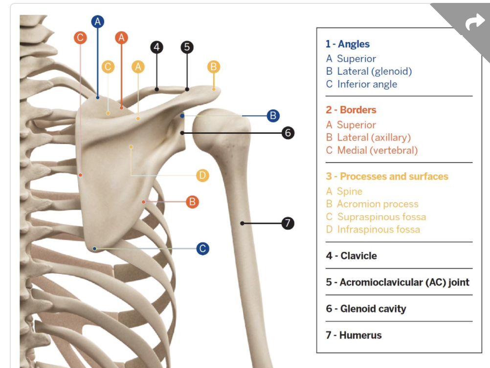

+ Supraspinuous/ infraspinous fossae allow the supraspinatus, infraspinatus, and teres minor muscles to fit tight to the scapula and connect to the head of the humerus. 
+ coracoid process is slightly below and medial to the acromion process
+ subscapular fossa,  subscapularis muscle lies 
+ glenoid cavity, a saucerlike landmark that forms the glenohumeral joint with the humerus. 

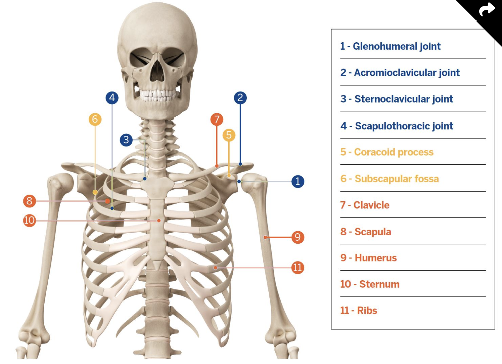

### GLENOHUMERAL JOINT

+ synovial, ball-and-socket 

+ great mobility, reduced stability, stability must be derived more from soft tissue as opposed to bony structures. 

+ The glenoid surface is one-third to one-quarter the size of the humeral head

+ static stabilizers include such structures as the glenoid labrum and the glenohumeral joint capsule, consisting of two major ligaments, the middle and inferior glenohumeral ligaments

+  inferior ligament

  + three sections: the anterior-inferior, axillary pouch, and posterior-inferior glenohumeral ligaments. 

  + attach to the glenoid labrum and blend into the humeral head. 

  + rimary stabilizer against anterior translation of the humeral head. 

  + The anterior and posterior portions of this ligament help stabilize the joint by becoming taut in extreme ranges of internal and external rotation and often are injured with repetitive use in these positions. 

  + in the midranges of shoulder motion these ligaments are relatively lax and the joint must rely heavily on the musculature that surrounds the joint for **dynamic stability**

    + Dynamic stabilization

      ​	Ability of the human movement system to control and minimize unwanted joint motions during movement.

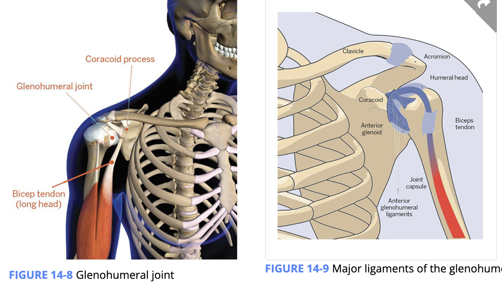

**Behind-the-Neck Exercises**
The close-packed position is when the joint surfaces are maximally aligned, which creates the greatest amount of mechanical stability. This position is achieved at 90 degrees of glenohumeral abduction and full external rotation (Floyd, 2017). In this position, most of the ligaments and a capsule surrounding the joint are taut. Performing exercises in this position increases a compressive and shear force applied to the joint and increases the risk for injury. To decrease stress on the joint and decrease the risk of injury, the joint should be placed in the loose-packed position. This is the position where the joint has the most extensibility in the capsule and ligaments (Floyd, 2017). 

For example, many people try to strengthen their latissimus dorsi and deltoids by performing behind-the-neck pulldowns or presses. This forces a person to place their shoulder into the closed-packed position (shoulder external rotation, abduction, and maximal elevation). However, a simple modification is to pull or press the load in front of the shoulder (front lat pulldowns or front shoulder presses), which avoids the closed-packed position and provides a safer alternative to avoid injuries in the future.

### SCAPULOTHORACIC JOINT

+ not a true joint but an articulation 
+ convex surface of the posterior thoracic cage and the concave surface of the anterior scapula (**Figure 14-10**) (Moore et al., 2014). 
+ allows shoulder movement beyond the 120 degrees of elevation provided by the glenohumeral joint. For every 2 degrees of glenohumeral elevation, there is 1 degree of scapulothoracic elevation
+ 17 muscles that attach to the scapula, they provide a stable base for the humerus to glide on and allow for an efficient transfer of force from the lower extremities and trunk.  upper, middle, and lower trapezius as well as the serratus anterior (**Figure 14-12**).

### STERNOCLAVICULAR JOINT

+ clavicle and sternum meet. 
+  the only bony connection of the scapula to the entire axial skeleton by way of the clavicle. 
+ The scapula “floats” on top of the rib cage and is held in place by muscles and two small joints

## Muscles

- rotator cuff: the primary steering mechanism of the glenohumeral joint. **SITS**
  - Posterior:
    - Supraspinatus:  initiates the first 15 degrees of shoulder abduction followed by deltoid activation for the remainder of the arc of motion. 
    - Subscapularis: stabilization of the humeral head from external rotation. 
  - Anterior: prevent internal rotation of the shoulder. decelerate the humerus during internal rotation, such as slowing the arm down during the pitching follow through.
    - infraspinatus
    - teres minor
-  scapular stabilizers

TABLE 14-1 Key Muscles Associated with the Shoulder and Their Concentric Actions

| **Muscle**        | **Concentric Action**                                        |
| ----------------- | ------------------------------------------------------------ |
| Supraspinatus     | Abduction                                                    |
| Subscapularis     | Internal rotation                                            |
| Infraspinatus     | External rotation                                            |
| Teres major       | Internal rotation, adduction, and extension                  |
| Teres minor       | External rotation                                            |
| Anterior deltoid  | Flexion and internal rotation                                |
| Lateral deltoid   | Abduction                                                    |
| Posterior deltoid | Extension and external rotation                              |
| Pectoralis major  | Flexion, horizontal adduction, and internal rotation         |
| Pectoralis minor  | Scapular protraction, forward translation over thoracic wall |
| Latissimus dorsi  | Internal rotation, adduction, and extension                  |
| Rhomboids         | Scapular retraction                                          |
| Upper trapezius   | Scapular elevation, cervical extension, lateral flexion, and rotation |
| Middle trapezius  | Scapular retraction                                          |
| Lower trapezius   | Scapular depression                                          |
| Serratus anterior | Scapular protraction                                         |
| Levator scapulae  | Scapular elevation and downward rotation, cervical extension, and lateral flexion |

+ muscles of the scapula that do not cross the glenohumeral joint 
  + serratus anterior, pectoralis minor, trapezius, levator scapulae, and rhomboids. 
  + These five muscles all originate on the thoracic spine and rib cage and insert on the scapula and are responsible for controlling motion of the scapulae.

+ tightness in the pectoralis minor, which inserts on the coracoid process of the scapula, will limit the effectiveness of the serratus anterior to upwardly rotate and posteriorly tilt the scapula. it can pull the scapula into a more protracted and anteriorly tilted position 

# Altered Thoracic Spine and Shoulder Movement

+ Self-reported prevalence of shoulder pain is estimated to be between 16% and 26% 
+ most common causes
  + rotator cuff disorders, glenohumeral disorders, acromioclavicular joint disease, and referred neck pain 

## Static Malalignments

+ Scoliosis Scoliosis in the thoracic region, the middle and lower trapezius and the serratus anterior on the convex (inner angle) side of the curve appear to be weaker compared to the concave (outer angle) side. On the concave side, the rhomboids appear to be weaker compared to the convex side

  Common symptoms associated with scoliosis include the following (Shakil et al., 2014):

  + One shoulder blade that is higher than the other
  + One shoulder blade that sticks out more than the other
  + Uneven hips
  + A rotating spine
  + Problems breathing because of reduced area in the chest for lungs to expand
  + Back pain

+ Hyprkyphosis 

  + round back, is usually the result of poor posture. 
  + increased lumbar lordosis, as in Janda’s layered syndrome or Kendall’s kyphosis-lordosis posture. head is held forward, the neck is hyperextended, the thoracic spine is flexed more than usual (and, usually, the scapulae are protracted or rounded forward), the lumbar spine is hyperextended, the pelvis is tilted anteriorly, and the hip joints are somewhat flexed. Typically, the knees are slightly hyperextended and the ankles are slightly plantar flexed
  + Some cases of hyperkyphosis are caused by degeneration, or wear and tear. Over time, the degenerative process can result in collapse of the intervertebral disc, changes in the shape of the vertebrae, and weakening of the ligaments that support the spine.
  + causes positional changes in the joints and segments above, namely the scapulae, neck, and shoulder. This increased curve places the head into a forward head position and causes anterior rounding of the shoulders. 
  + increases in multisegmental spinal loads and trunk muscle forces in upright and sitting positions.

## Abnormal Muscle Activation Patterns

+ Rounded shoulders can be a result of poor posture, increased thoracic kyphosis, muscle weakness, muscle tightness, or any combination and can be classified as the Janda upper crossed syndrome. 
+ the back muscles of the neck and shoulders (upper trapezius and levator scapula) become overactive and strained (Borstad, 2006; Borstad & Ludewig, 2005). 
+ The muscles in the front of the chest (e.g., pectoralis minor) become shortened and overactive, as does the latissimus dorsi, which causes internal rotation of the humerus.

## Dynamic Malalignment

increased load and stress may occur on the shoulder, elbow, and wrist joints, 

### Thoracic Spine and Shoulder Dysfunction and the Regional Interdependence Model

scapulae, neck, shoulder, elbow, wrist, and lumbar spine

####  thoracic mobilization

- Influence Above the Shoulder and Thoracic Spine
  - thoracic spine mobilization versus specific cervical spine therapy for treating individuals with neck dysfunction 

- Influences Related to the Shoulder and Thoracic Spine
  - increased middle trapezius activity in individuals with rotator cuff tendinopathy (Muth et al., 2012) and increased lower trapezius strength in asymptomatic individuals (Cleland et al., 2004). foam roller (or other modality) prior to horizontal or vertical push/pull exercises.
  -  shoulder dysfunction and reduced upper thoracic spine mobility, thoracic spine mobility and arm elevation. 
- Influence Below the Shoulder and Thoracic Spine
  - The lumbar spine has about 10 to 12 degrees cumulatively of rotation (Bible et al., 2010). The thoracic spine should contribute between 45 to 60 degrees of rotation (Johnson & Grindstaff, 2010). If the thoracic spine is not rotating well, the body will allow the lumbar spine to make up the difference in movement. Most lumbar spine injuries occur at L5/S1 and L4/L5. These lower lumbar vertebrae will move excessively to compensate for a lack of movement in the thoracic spine directly above. 
  - Two of the key components to pitching velocity are hip range of motion and trunk rotation. by improving hip range of motion, trunk rotation also improves, allowing more opportunity for hip to shoulder separation, and therefore greater velocity.

# Assessment Results for the Shoulder and Thoracic Spine

| **Assessment**                       | **Results**                                                  |
| ------------------------------------ | ------------------------------------------------------------ |
| **Static posture**                   | Rounded shoulders, Excessive thoracic kyphosis (hyperkyphosis), Shoulders elevated |
| **Transitional and loaded movement** | Arms fall forward , Scapular elevation, Scapular winging     |
| **Dynamic movement**                 | Scapular elevation, Scapular winging                         |

| **Assessment**                                               | **Results**                                                  |
| ------------------------------------------------------------ | ------------------------------------------------------------ |
| **Mobility** Shoulder flexion, shoulder extension, shoulder retraction, shoulder internal and external rotation, thoracic extension, seated thoracic rotation | Limited shoulder flexion ROM Limited shoulder extension ROM Limited shoulder retraction ROM Limited shoulder internal rotation ROM Limited shoulder external rotation ROM Limited thoracic extension ROM Limited thoracic rotation ROM |

## Static Posture

- Janda’s upper crossed and layered crossed syndromes, as well as Kendall’s flat back, sway back, and kyphosis-lordosis postures: excessive kyphosis (upper back rounding).
- overactivity of the latissimus dorsi and pectoralis minor muscles
- underactivity of shoulder and scapular retractor muscles. 
- arms to fall forward during an overhead squat assessment (OHSA).

## Transitional Movement Assessment

### OVERHEAD SQUAT ASSESSMENT

- common movement impairments associated with a lack of thoracic extension, glenohumeral flexion, and scapular muscle weakness
- arms fall forward is often observed when a client lacks optimal shoulder mobility. Compensate with shoudler elevation (upper trapezius and levator scapulae ), more obvious in loaded pushing/pulling assessment.
- overactive pectoralis major/minor and latissimus dorsi muscles,
- **Bending Elbows During the OHSA**: A rounded shoulder posture is sometimes also associated with overactivity or shortening of the biceps brachii muscle. 

#### HANDS-ON-HIPS MODIFICATION

+ reduces tension in the latissimus dorsi and creates more ROM throughout the trunk. 
+ Improve: thoracic and shoulder, 
+ not improve:LPHC.

### LOADED MOVEMENT ASSESSMENTS

- standing cable machine press or pull: horizontally loaded position.
  - lack of thoracic extension ROM, upper trapezius and levator scapulae muscles can become dominant and cause the shoulder structures to migrate upward.
  - Scapular winging: 
    - best seen during pushing tasks and is typically due to underactivity of the serratus anterior and scapular stabilizers. 
    - The location of these muscles is sandwiched between the scapula and the posterior rib cage. 
    - the scapulae are not held as tightly against the rib cage as they should be and can externally rotate slightly in the transverse plane, causing them to look like small “wings” on the individual’s back.
- standing overhead dumbbell press
  - assess the corrective progress of the arms fall forward movement impairment.

## Dynamic Movement Assessments

+ Davies 
  + plyometric movements for the upper extremity, 
  + stabilization and dynamic posture of the shoulder in a more complex situation 
  + clients have proper push-up and plank form, as well as adequate strength to remain in the high-plank push-up position for prolonged periods of time.

## Mobility Assessments

+ shoulder flexion (latissimus dorsi length) and extension, shoulder retraction (pectoralis minor length), shoulder internal and external rotation, thoracic extension, and thoracic rotation.
+ Flexibility of the shoulder extensor group, including the latissimus dorsi and pectorals, has a considerable influence on the positioning of the glenohumeral joint, as is demonstrated with the arms fall forward movement impairment. 
+ For most, internal rotation of the shoulders will not be limited due to the already-forward shoulder position many will present with; however, individuals with rounded shoulders will tend to have limited external rotation ROM.

# Corrective Strategies

| **Phase**  | **Modality**                             | **Muscle(s)/Exercise**                                       | **Acute Training Variables**                                 |
| ---------- | ---------------------------------------- | ------------------------------------------------------------ | ------------------------------------------------------------ |
| Inhibit    | Self-myofascial rolling                  | Biceps brachii Latissimus dorsi Levator scapulae Pectoralis major Pectoralis minor Thoracic spine Upper trapezius | Hold areas of discomfort for 30 to 60 seconds Perform four to six repetitions of active joint movement |
| Lengthen   | Static or neuromuscular stretching (NMS) | Biceps brachii Latissimus dorsi Levator scapulae Pectoralis major Pectoralis minor Posterior capsule/deltoid Upper trapezius | Static: 30-second hold NMS: 7- to 10-second isometric contraction; 30-second hold |
| Activate   | Isolated strengthening                   | Ball combo 1 Ball combo 2 Cobra Push-up plus Rotator cuff (resisted internal and external rotation) Scaption | 10 to 15 reps with 4-second eccentric contraction, 2-second isometric contraction at end-range, and 1-second concentric contraction |
| Integrate* | Integrated dynamic movement              | Pulling progressions Pushing progressions Single-leg RDL to PNF pattern Squat to row | 10 to 15 reps under control                                  |

## Common Exercise Selections for the Thoracic Spine and Shoulder

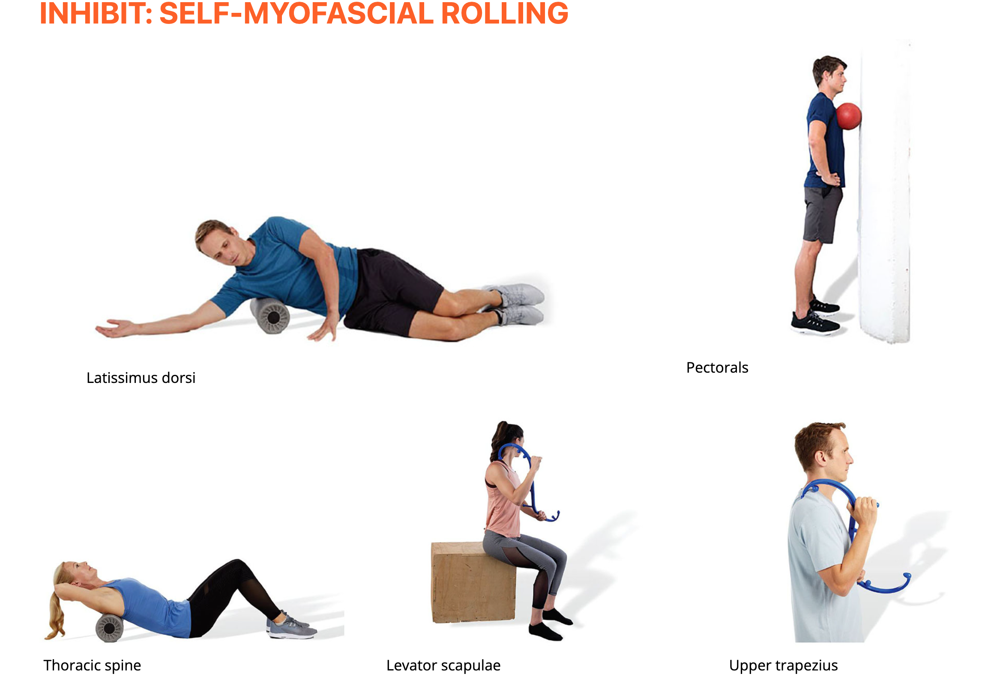

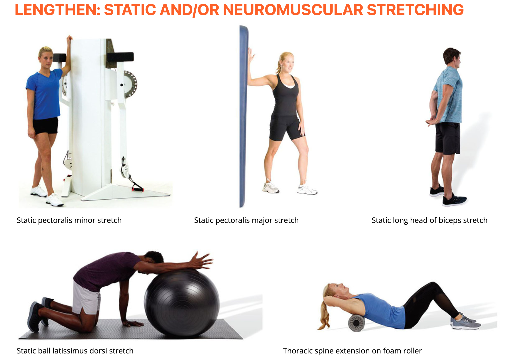

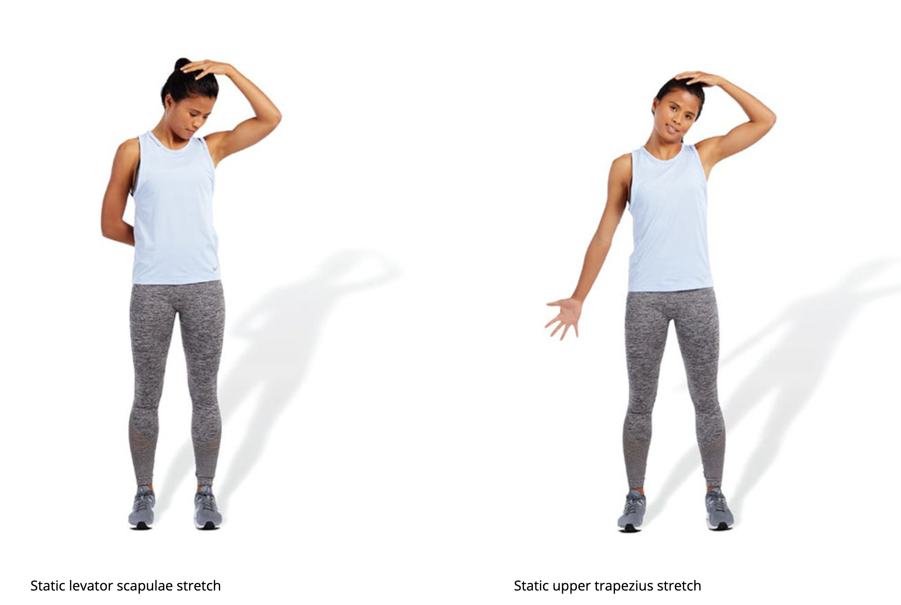

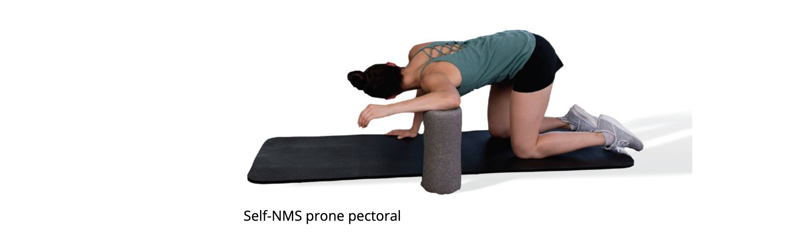

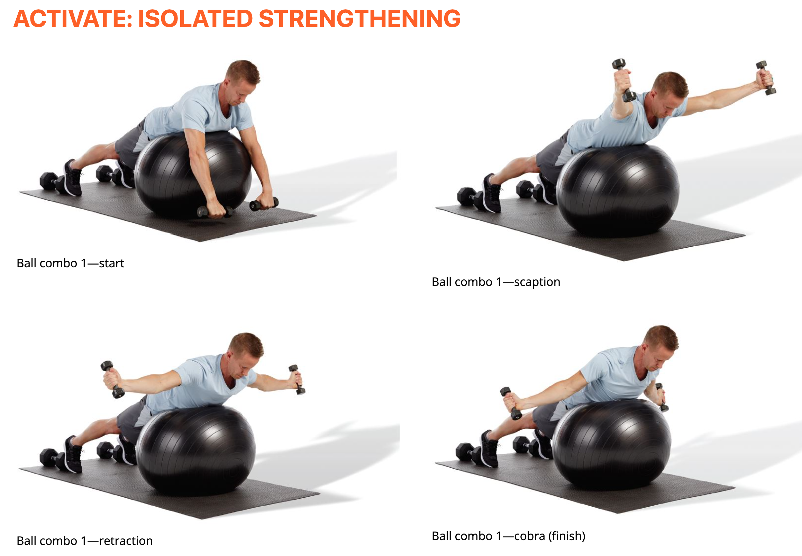

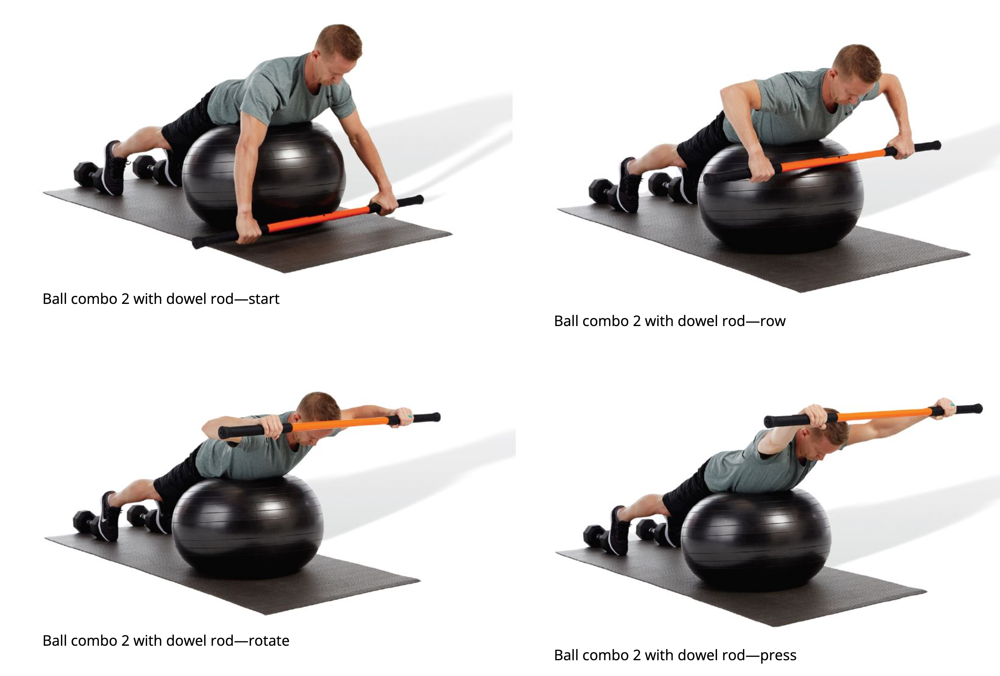

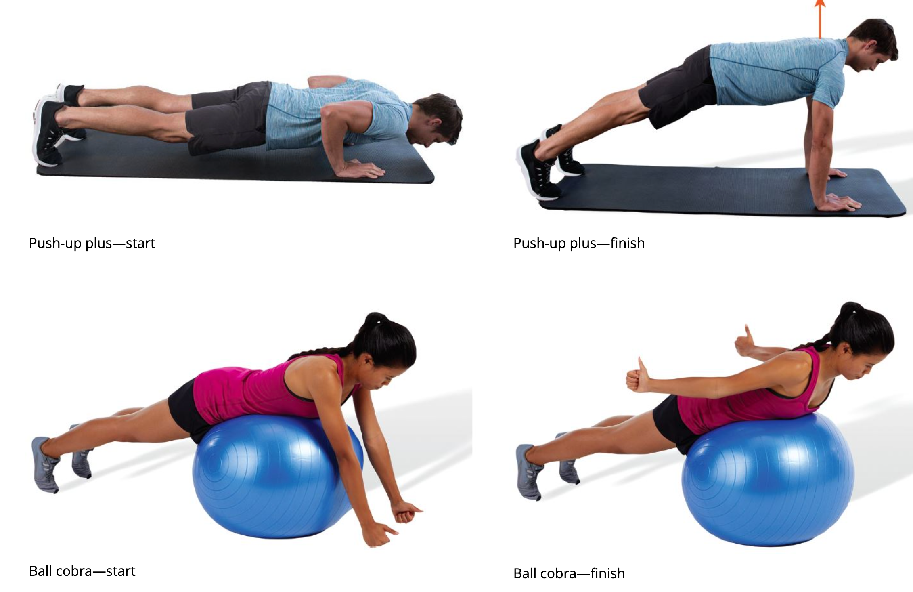

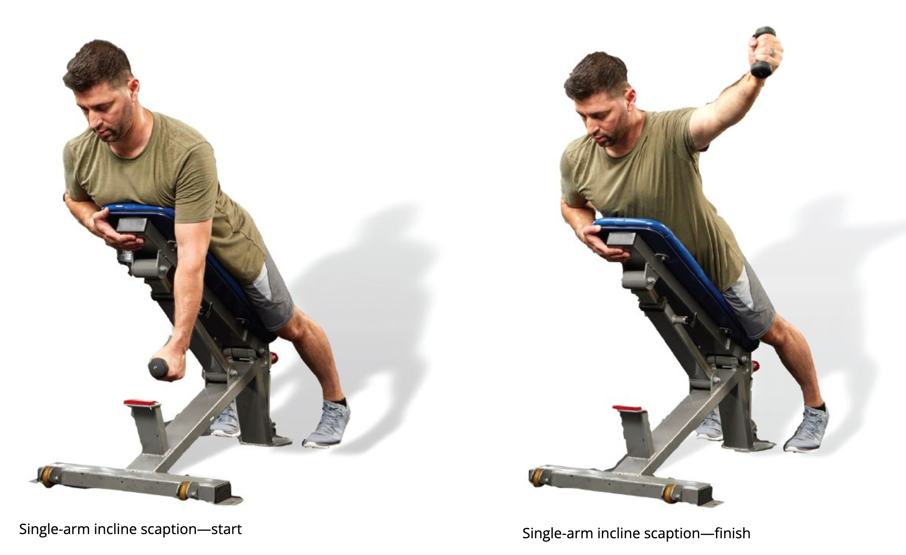

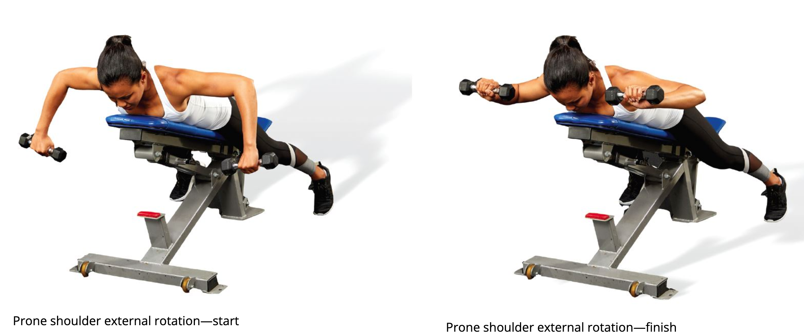

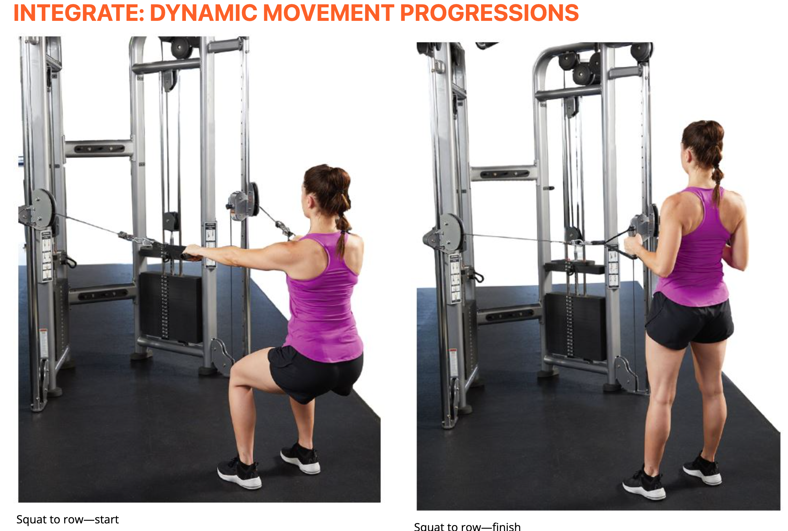

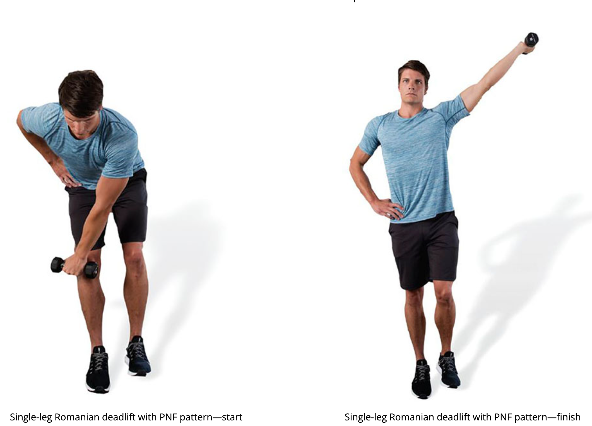

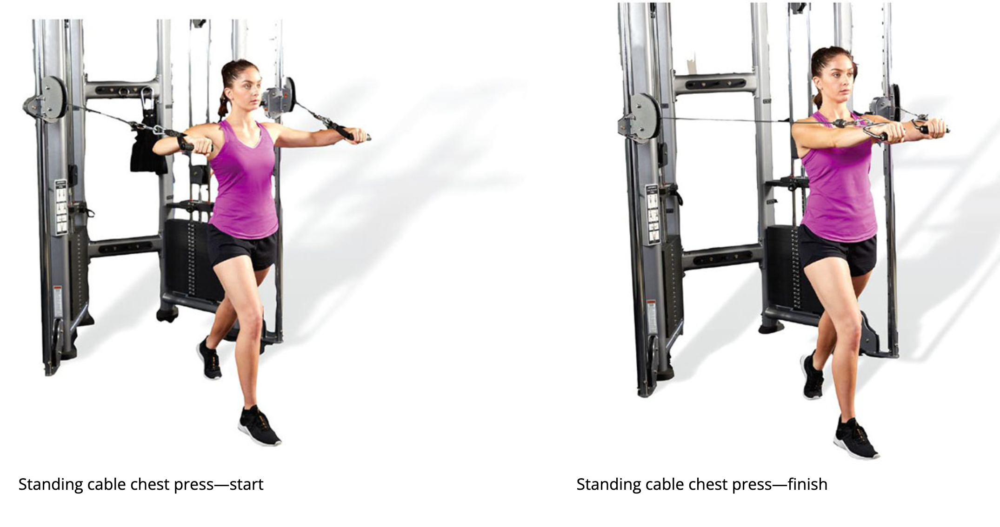

## Arms Fall Forward

### PHASE 3: ACTIVATE

Key activation exercises with isolated strengthening exercises include the middle and lower trapezius, rhomboids, and rotator cuff (ball combo 2 with dowel rod is an effective exercise to engage rotator cuff external rotation). The ball combo 2 exercise can also be performed with dumbbells, as needed.

### PHASE 4: INTEGRATE

first to emphasize scapular retraction and depression, such as a squat to row. Note that the sagittal plane row is largely dominated by the latissimus dorsi and that the latissimus dorsi are often overactive. Thus, the Corrective Exercise Specialist should place importance on form and scapular mechanics 

| **Phase**  | **Modality**                | **Muscle(s)/Exercise**                              | **Acute Training Variables**                                 |
| ---------- | --------------------------- | --------------------------------------------------- | ------------------------------------------------------------ |
| Inhibit    | Self-myofascial rolling     | Latissimus dorsi Pectorals Thoracic spine | Hold areas of discomfort for 30 to 60 secondsPerform four to six repetitions of active joint movement90 to 120 seconds per muscle group |
| Lengthen   | Static stretching           | Latissimus dorsi Pectorals                     | 30-second hold                                               |
| Activate   | Isolated strengthening      | Rhomboids Trapezius (middle and lower)         | 10 to 15 reps with 4-second eccentric contraction, 2-second isometric contraction at end-range, and 1-second concentric contraction |
| Integrate* | Integrated dynamic movement | Squat to row (transverse)                           | 10 to 15 reps under control                                  |

Progress by moving to alternating arms or using a transverse plane row (i.e., wide-grip row) rather than by increasing load. Additional progressions may include one-arm and eventually base-of-support changes.

## Shoulder Elevation

Many times, the client may demonstrate a combination of shoulder elevation with forward head posture (FHP). The example program that follows is for shoulder elevation without FHP, for simplicity. The broad objectives of the program are to improve the position of the scapula. When applied systematically, the Corrective Exercise Continuum contributes to efficient neuromuscular control and proper alignment of the shoulder girdle during movement.

### PHASE 3: ACTIVATE

ball cobra and ball scaption to reinforce scapulothoracic rhythm and downward rotation and depression of the scapula.

### PHASE 4: INTEGRATE

emphasize scapular depression and cervical spine stability. An integration exercise that may be implemented includes a single-leg Romanian deadlift with PNF (proprioceptive neuromuscular facilitation) pattern. One additional integration exercise that can be implemented is a standing lat pulldown. 

| **Phase**  | **Modality**                | **Muscle(s)/Exercise**                                       | **Acute Training Variables**                                 |
| ---------- | --------------------------- | ------------------------------------------------------------ | ------------------------------------------------------------ |
| Inhibit    | Self-myofascial rolling     | Levator scapulae Pectoralis minor Upper trapezius thoracic spine | Hold areas of discomfort for 30 to 60 secondsPerform four to six repetitions of active joint movement90 to 120 seconds per muscle group |
| Lengthen   | Static stretching           | Levator scapulaePectoralis minorUpper trapezius              | 30-second hold                                               |
| Activate   | Isolated strengthening      | Lower trapezius Serratus anterior                       | 10 to 15 reps with 4-second eccentric contraction, 2-second isometric contraction at end-range, and 1-second concentric contraction |
| Integrate* | Integrated dynamic movement | Single-leg RDL to PNF pattern                                | 10 to 15 reps under control                                  |

## Scapular Winging

### PHASE 3: ACTIVATE

Key activation exercises with isolated strengthening include the serratus anterior (e.g., push-up plus) and middle and lower trapezius (e.g., ball combo 1).

### PHASE 4: INTEGRATE

An integration exercise that could also be implemented for this compensation might be a standing one-arm cable chest press (see **Table 14-6**).

TABLE 14-6 Sample Corrective Exercise Program for the Thoracic Spine and Shoulder: Scapular Winging

| **Phase**  | **Modality**                | **Muscle(s)/Exercise**                                       | **Acute Training Variables**                                 |
| ---------- | --------------------------- | ------------------------------------------------------------ | ------------------------------------------------------------ |
| Inhibit    | Self-myofascial rolling     | Latissimus dorsi Pectoralis minor Upper trapezius  thoracic spine. | Hold areas of discomfort for 30 to 60 secondsPerform four to six repetitions of active joint movement90 to 120 seconds per muscle group |
| Lengthen   | Static stretching           | Latissimus dorsiPectoralis minorUpper trapezius              | 30-second hold                                               |
| Activate   | Isolated strengthening      | Serratus anterior Trapezius (middle and lower)          | 10 to 15 reps with 4-second eccentric contraction, 2-second isometric contraction at end-range, and 1-second concentric contraction |
| Integrate* | Integrated dynamic movement | Standing one-arm cable chest press                           | 10 to 15 reps under control                                  |

# Common Issues Associated with the Thoracic Spine and Shoulder

+ Status: 
  + injuries accounted for 8% of all injuries sustained at the high school level (Bonza et al., 2009). 
  + Olympic weightlifters and powerlifters can experience up to a 50% shoulder injury rate depending on experience level and age (Aasa et al., 2017). 
  + Thoracic spine pain and dysfunction is less common than in other regions of the spine
+ **Shoulder Injury Continuum**
  + The Cook and Purdam model describes the progression from a normal tendon to reactive tendinopathy, to tendon disrepair, and, ultimately, to degenerative tendinopathy. 
  + Reactive rotator cuff tendinopathy is an inflamed, overloaded tendon that causes pain on activity. 
  + The rotator cuff tendon is substantially overloaded and displays incomplete healing in the stage of tendon disrepair. 
  + The inflamed tendon may have degenerated to a small partial-thickness tear. 
  + Degenerativetendinopathy manifests in large partial- and full-thickness rotator cuff tears, as well as massive rotator cuff tears, that cannot heal 
+ Thoracic spine pain and dysfunction is often associated with pathologies such as **osteoporosis**, **osteoarthritis**, **Scheuermann’s disease**, and **ankylosing spondylitis** 
  + Scheuermann’s disease
    + A developmental dis-order of the spine that causes abnormal growth of usually the thoracic (upper back) vertebrae, but it can also be found in the lumbar vertebrae.
  + Ankylosing spondylitis
    + A form of arthritis that primarily affects the spine, although other joints can become involved; causes inflammation of the spinal joints (vertebrae) that can lead to severe chronic pain and discomfort.
+ slight finger motions stimulate postural changes throughout the entire upper extremity

## Shoulder Impingement Syndrome (SIS)

- **Shoulder impingement** 
  - Occurs when the space between the bone on top of the shoulder (acromion) and the ten-dons of the rotator cuff rub against each other during arm elevation.
- produced by a variety of subacromial pathologies, including subacromial bursitis, partial rotator cuff tears, biceps tendinitis, scapular dyskinesis, a tight posterior capsule, and postural abnor-malities (Kuhn, 2009). 
- Shoulder impingement syndrome (SIS) can be defined as compression of the rotator cuff and the subacromial bursa against the anteroinferior aspect of the acromion and the coracoacromial ligament, leading to pain and/or weakness around the shoulder joint, especially with overhead activity (Hughes et al., 2012).
- external impingement 
  - Primary external impingement implies abnormalities of the superior bony structures, leading to encroachment of the subacromial space from above. An abnormally shaped acromion is often the cause, but an acromial bony spur may occur in older age groups (Ogawa et al., 2005). 
  - Secondary external impingement refers to narrowing of the subacromial space by <u>anterior tilt and excessive internal rotation of an unstable scapula.</u> Weakness and inactivity of the scapular stabilizing muscles leads to an abnormal scapulohumeral rhythm (Hébert et al., 2002).
-  Internal impingement often occurs due to repetitive microtrauma to the rotator cuff tendons (predominantly supraspinatus) in athletes who engage in throwing, racquet, or other overhead actions (Myers et al., 2006). 

## Acromioclavicular Separation

+ AC separation, is a frequent injury among physically active people. The clavicle separates from the scapula. It is usually caused by a fall directly on the point of the shoulder or a hit to the AC joint in a contact sport like football or rugby

## Rotator Cuff Strain

- Rotator cuff **strains** or tears are caused by either overuse or an acute injury. 
  - Muscle strain
    - An injury to a muscle (tear in tendon) in which the muscle fibers tear as a result of overstretching; usually these are graded from I to III, with I being mild pulls and III being complete tears.
- lifting too heavy of a load with an outstretched arm, ballistic movements like a kipping pull-up, or repetitive overhead lifting with poor form (Allen et al., 2019; Bartolozzi et al., 1994; Cibulas et al., 2019; Kibler et al., 2006; Kukkonen et al., 2015).

## Biceps Tendinopathy

-  long head of the biceps muscle. Not usually found in isolation, it is usually caused by overuse, tendon impingement, shoulder joint instability, or trauma. Therefore, it coexists with other pathologies of the shoulder, including rotator cuff impingement syndrome, rotator cuff tears, labral tears, superior labrum from anterior to posterior (SLAP) lesions, and shoulder instability (Raney et al., 2017).

## Frozen Shoulder and Osteoarthritis

+ In frozen shoulder, medically termed adhesive capsulitis, inflammation develops in the shoulder, causing pain and stiffness. As a frozen shoulder progresses, movement in the shoulder can be severely limited. The etiology of frozen shoulder is unknown, and it often self-resolves within 12 months (Hsu et al., 2011).
+ Osteoarthritis is the common wear-and-tear arthritis that occurs with aging. The shoulder is less often affected by osteoarthritis than the knee, but it can occur at the AC joint. It is aptly named *weightlifter’s shoulder* due to the wear and tear from upper body pressing movements (Oh et al., 2011).

## Shoulder Instability

-  head of the humerus is forced out of the shoulder socket and causes laxity in the structures that hold the humeral head in place. This can happen as a result of a sudden injury or from overuse. When the shoulder is loose and slips out of place repeatedly, it is called chronic shoulder instability.
- The two most common types of labral injuries are SLAP tears and Bankart tears. 
  - SLAP tears occur at the front of the upper arm where the biceps tendon connects to the shoulder. Athletes most prone to this injury include baseball pitchers and volleyball players who engage in high-energy, quick-snap motions over the top of the shoulder. 
  - Bankart tears typically occur with shoulder dislocation in younger patients and occur when the head of the humerus either shifts anteriorly or posteriorly causing instability in either of those directions.

# Quiz

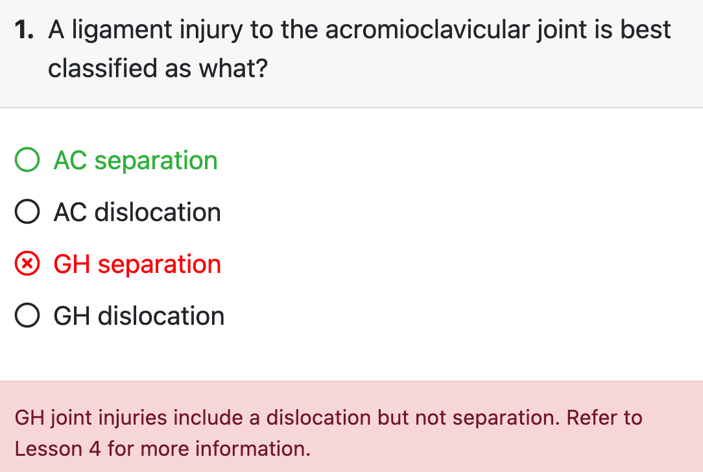

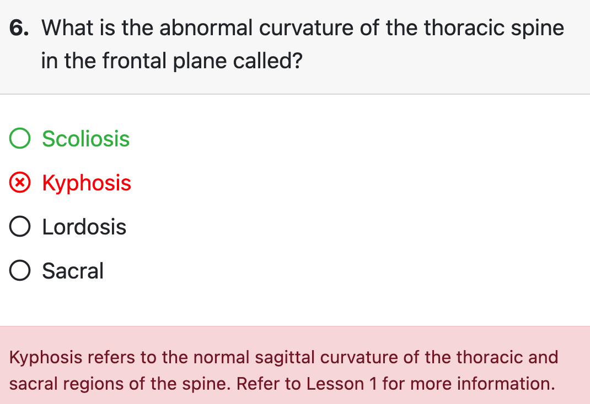

# Refereces

> Aasa, U., Svartholm, I., Andersson, F., & Berglund, L. (2017). Injuries among weightlifters and powerlifters: A systematic review. *British Journal of Sports Medicine*, *51*(4), 211–219. https://doi.org/10.1136/bjsports-2016-096037
>
> Allen, H., Chan, B. Y., Davis, K. W., & Blankenbaker, D. G. (2019). Overuse injuries of the shoulder. *Radiologic Clinics of North America*, *57*(5), 897–909. https://doi.org/10.1016/j.rcl.2019.03.003
>
> Aspegren, D., Hyde, T., & Miller, M. (2007). Conservative treatment of a female collegiate volleyball player with costochondritis. *Journal of Manipulative and Physiological Therapeutics*, *30*(4), 321–325.
>
> Bakhsh, W., & Nicandri, G. (2018). Anatomy and physical examination of the shoulder. *Sports Medicine and Arthroscopy Review*, *26*(3), e10–e22. https://doi.org/10.1097/jsa.0000000000000202
>
> Bartolozzi, A., Andreychik, D., & Ahmad, S. (1994). Determinants of outcome in the treatment of rotator cuff disease. *Clinical Orthopaedics and Related Research*, *308*, 90–97.
>
> Bau, J. G., Chia, T., Wei, S. H., Li, Y. H., & Kuo, F. C. (2017). Correlations of neck/shoulder perfusion characteristics and pain symptoms of the female office workers with sedentary lifestyle. *PLoS One*, *12*(1), e0169318. https://doi.org/10.1371/journal.pone.0169318
>
> Bergman, G. J., Winters, J. C., Groenier, K. H., Pool, J. J. M., Meyboom-de Jong, B., Postema, K., & van der Heijden, G. J. (2004). Manipulative therapy in addition to usual medical care for patients with shoulder dysfunction and pain: A randomized, controlled trial. *Annals of Internal Medicine*, *141*(6), 432–439.
>
> Bible, J. E., Biswas, D., Miller, C. P., Whang, P. G., & Grauer, J. N. (2010). Normal functional range of motion of the lumbar spine during 15 activities of daily living. *Journal of Spinal Disorders & Techniques*, *23*(2), 106–112.
>
> Bogduk, N. (2016). Functional anatomy of the spine. *Handbook of Clinical Neurology*, *136*, 675–688. https://doi.org/10.1016/b978-0-444-53486-6.00032-6
>
> Bonza, J. E., Fields, S. K., Yard, E. E., & Dawn Comstock, R. (2009). Shoulder injuries among United States high school athletes during the 2005–2006 and 2006–2007 school years. *Journal of Athletic Training*, *44*(1), 76–83. https://doi.org/10.4085/1062-6050-44.1.76
>
> Borstad, J. D. (2006). Resting position variables at the shoulder: Evidence to support a posture-impairment association. *Physical Therapy*, *86*(4), 549–557.
>
> Borstad, J. D., & Ludewig, P. M. (2005). The effect of long versus short pectoralis minor resting length on scapular kinematics in healthy individuals. *Journal of Orthopaedic & Sports Physical Therapy*, *35*(4), 227–238. https://doi.org/10.2519/jospt.2005.35.4.227
>
> Boyles, R. E., Ritland, B. M., Miracle, B. M., Barclay, D. M., Faul, M. S., Moore, J. H., Koppenhaver, S. L., & Wainner, R. S. (2009). The short-term effects of thoracic spine thrust manipulation on patients with shoulder impingement syndrome. *Manual Therapy*, *14*(4), 375–380.
>
> Briggs, A., Straker, L., & Greig, A. (2004). Upper quadrant postural changes of school children in response to interaction with different information technologies. *Ergonomics*, *47*(7), 790–819. https://doi.org/10.1080/00140130410001663569
>
> Briggs, A. M., Bragge, P., Smith, A. J., Govil, D., & Straker, L. M. (2009). Prevalence and associated factors for thoracic spine pain in the adult working population: A literature review. *Journal of Occupational Health*, *51*(3), 177–192. https://doi.org/10.1539/joh.k8007
>
> Briggs, A. M., van Dieen, J. H., Wrigley, T. V., Greig, A. M., Phillips, B., Lo, S. K., & Bennell, K. L. (2007). Thoracic kyphosis affects spinal loads and trunk muscle force. *Physical Therapy*, *87*(5), 595–607. https://doi.org/10.2522/ptj.20060119
>
> Briggs, A. M., Wrigley, T. V., Tully, E. A., Adams, P. E., Greig, A. M., & Bennell, K. L. (2007). Radiographic measures of thoracic kyphosis in osteoporosis: Cobb and vertebral centroid angles. *Skeletal Radiology*, *36*(8), 761–767. https://doi.org/10.1007/s00256-007-0284-8
>
> Caronni, A., & Cavallari, P. (2009). Anticipatory postural adjustments stabilise the whole upper-limb prior to a gentle index finger tap. *Experimental Brain Research, 194*(1), 59–66.
>
> Cibulas, A., Leyva, A., Cibulas, G., 2nd, Foss, M., Boron, A., Dennison, J., Gutterman, B., Kani, K., Porrino, J., Bancroft, L. W., & Scherer, K. (2019). Acute shoulder injury. *Radiologic Clinics of North America, 57*(5), 883–896. https://doi.org/10.1016/j.rcl.2019.03.004
>
> Cleland, J. A., Childs, J. D., Fritz, J. M., Whitman, J. M., & Eberhart, S. L. (2007). Development of a clinical prediction rule for guiding treatment of a subgroup of patients with neck pain: Use of thoracic spine manipulation, exercise, and patient education. *Physical Therapy*, *87*(1), 9–23.
>
> Cleland, J. A., Childs, J. D., McRae, M., Palmer, J. A., & Stowell, T. (2005). Immediate effects of thoracic manipulation in patients with neck pain: A randomized clinical trial. *Manual Therapy*, *10*(2), 127–135.
>
> Cleland, J. A., Glynn, P., Whitman, J. M., Eberhart, S. L., MacDonald, C., & Childs, J. D. (2007). Short-term effects of thrust versus nonthrust mobilization/manipulation directed at the thoracic spine in patients with neck pain: A randomized clinical trial. *Physical Therapy, 87*(4), 431–440.
>
> Cleland, J. A., Mintken, P. E., Carpenter, K., Fritz, J. M., Glynn, P., Whitman, J., & Childs, J. D. (2010). Examination of a clinical prediction rule to identify patients with neck pain likely to benefit from thoracic spine thrust manipulation and a general cervical range of motion exercise: Multi-center randomized clinical trial. *Physical Therapy*, *90*(9), 1239–1250.
>
> Cleland, J., Selleck, B., Stowell, T., Browne, L., Alberini, S., St. Cyr, H., & Caron, T. (2004). Short-term effects of thoracic manipulation on lower trapezius muscle strength. *Journal of Manual & Manipulative Therapy*, *12*(2), 82–90.
>
> Cole, M. H., & Grimshaw, P. N. (2016). The biomechanics of the modern golf swing: Implications for lower back injuries. *Sports Medicine*, *46*(3), 339–351. https://doi.org/10.1007/s40279-015-0429-1
>
> Cook, J. L., & Purdam, C. R. (2009). Is tendon pathology a continuum? A pathology model to explain the clinical presentation of load-induced tendinopathy. *British Journal of Sports Medicine*, *43*(6), 409–416.9781284200898
>
> Crosbie, J., Kilbreath, S. L., Hollmann, L., & York, S. (2008). Scapulo­humeral rhythm and associated spinal motion. *Clinical Biome­chanics*, *23*(2), 184–192.
>
> Cross, K. M., Kuenze, C., Grindstaff, T. L., & Hertel, J. (2011). Thoracic spine thrust manipulation improves pain, range of motion, and self-reported function in patients with mechanical neck pain: A systematic review. *Journal of Orthopaedic & Sports Physical Therapy*, *41*(9), 633–642.
>
> Deans, C. F., Gentile, J. M., & Tao, M. A. (2019). Acromioclavicular joint injuries in overhead athletes: A concise review of injury mechanisms, treatment options, and outcomes. *Current Reviews in Musculoskeletal Medicine*, *12*(2), 80–86. https://doi.org/10.1007/s12178-019-09542-w
>
> Dong, W., Goost, H., Lin, X. B., Burger, C., Paul, C., Wang, Z. L., Zhang, T.-Y., Jiang, Z.-C., Welle, K., & Kabir, K. (2015). Treatments for shoulder impingement syndrome: A PRISMA systematic review and network meta-analysis. *Medicine (Baltimore), 94*(10), e510.
>
> Dunning, J. R., Butts, R., Mourad, F., Young, I., Fernández-de-Las Peñas, C., Hagins, M., Stanislawski, T., Donley, J., Buck, D., Hooks, T. R., & Cleland, J. A. (2016). Upper cervical and upper thoracic manipulation versus mobilization and exercise in patients with cervicogenic headache: A multi-center randomized clinical trial. *BMC Musculoskeletal Disorders*, *17*, 64. https://doi.org/10.1186/s12891-016-0912-3
>
> Dunning, J. R., Cleland, J. A., Waldrop, M. A., Arnot, C. F., Young, I. A., Turner, M., & Sigurdsson, G. (2012). Upper cervical and upper thoracic thrust manipulation versus nonthrust mobilization in patients with mechanical neck pain: A multicenter randomized clinical trial. *Journal of Orthopaedic & Sports Physical Therapy*, *42*(1), 5–18.
>
> Fernández-de-las-Peñas, C., Cleland, J. A., Huijbregts, P., Palomeque-del-Cerro, L., & González-Iglesias, J. (2009). Repeated applications of thoracic spine thrust manipulation do not lead to tolerance in patients presenting with acute mechanical neck pain: A secondary analysis. *Journal of Manual & Manipulative Therapy*, *17*(3), 154–162.
>
> Floyd, R. T. (2017). *Manual of structural kinesiology* (20th ed.). McGraw-Hill Education.
>
> González-Iglesias, J., Fernández-de-las-Peñas, C., Cleland, J. A., Alburquerque-Sendín, F., Palomeque-del-Cerro, L., & Méndez-Sánchez, R. (2009). Inclusion of thoracic spine thrust manipulation into an electro-therapy/thermal program for the management of patients with acute mechanical neck pain: A randomized clinical trial. *Manual Therapy*, *14*(3), 306–313.
>
> González-Iglesias, J., Fernández-de-las-Peñas, C., Cleland, J. A., & Gutiérrez-Vega Mdel, R. (2009). Thoracic spine manipulation for the management of patients with neck pain: A randomized clinical trial. *Journal of Orthopaedic & Sports Physical Therapy*, *39*(1), 20–27.
>
> Haik, M. N., Alburquerque-Sendín, F., Silva, C. Z., Siqueira-Junior, A. L., Ribeiro, I. L., & Camargo, P. R. (2014). Scapular kinematics pre- and post-thoracic thrust manipulation in individuals with and without shoulder impingement symptoms: A randomized controlled study. *Journal of Orthopaedic & Sports Physical Therapy*, *44*(7), 475–487.
>
> Hamill, J., & Knutzen, K. (2006). *Biomechanical basis of human movement* (2nd ed.). Lippincott Williams & Wilkins.
>
> Hébert, L. J., Moffet, H., McFadyen, B. J., & Dionne, C. E. (2002). Scapular behavior in shoulder impingement syndrome. *Archives of Physical Medicine and Rehabilitation*, *83*(1), 60–69.
>
> Hsu, J. E., Anakwenze, O. A., Warrender, W. J., & Abboud, J. A. (2011). Current review of adhesive capsulitis. *Journal of Shoulder and Elbow Surgery*, *20*(3), 502–514. https://doi.org/10.1016/j.jse.2010.08.023
>
> Hughes, P. C., Green, R. A., & Taylor, N. F. (2012). Measurement of subacromial impingement of the rotator cuff. *Journal of Science and Medicine in Sport*, *15*(1), 2–7. https://doi.org/10.1016/j.jsams.2011.07.001
>
> Johnson, K. D., & Grindstaff, T. L. (2010). Thoracic rotation measurement techniques: Clinical commentary. *North American Journal of Sports and Physical Therapy*, *5*(4), 252–256.
>
> Kendall, F. P., McCreary, E. K., Provance, P. G., McIntyre Rodgers, M., & Romani, W. A. (2005). *Muscles: Testing and function, with posture and pain* (5th ed.). Lippincott, Williams, & Wilkins.
>
> Kibler, W. B., Sciascia, A., & Dome, D. (2006). Evaluation of apparent and absolute supraspinatus strength in patients with shoulder injury using the scapular retraction test. *American Journal of Sports Medicine*, *34*(10), 1643–1647. https://doi.org/10.1177/0363546506288728
>
> Klimek, C., Ashbeck, C., Brook, A. J., & Durall, C. (2018). Are injuries more common with CrossFit training than other forms of exercise? *Journal of Sport Rehabilitation*, *27*(3), 295–299. https://doi.org/10.1123/jsr.2016-0040
>
> Kuhn, J. E. (2009). Exercise in the treatment of rotator cuff impingement: A systematic review and a synthesized evidence-based rehabilitation protocol. *Journal of Shoulder and Elbow Surgery*, *18*(1), 138–160. https://doi.org/10.1016/j.jse.2008.06.004
>
> Kukkonen, J., Joukainen, A., Lehtinen, J., Mattila, K. T., Tuominen, E. K., Kauko, T., & Äärimaa, V. (2015). Treatment of nontraumatic rotator cuff tears: A randomized controlled trial with two years of clinical and imaging follow-up. *Journal of Bone and Joint Surgery (American Volume)*, *97*(21), 1729–1737. https://doi.org/10.2106/JBJS.N.01051
>
> Lau, H. M., Wing Chiu, T. T., & Lam, T.-H. (2011). The effectiveness of thoracic manipulation on patients with chronic mechanical neck pain: A randomized controlled trial. *Manual Therapy*, *16*(2), 141–147.
>
> Leboeuf-Yde, C., Nielsen, J., Kyvik, K. O., Fejer, R., & Hartvigsen, J. (2009). Pain in the lumbar, thoracic or cervical regions: Do age and gender matter? A population-based study of 34,902 Danish twins 20–71 years of age. *BMC Musculoskeletal Disorders*, *10*, 39. https://doi.org/10.1186/1471-2474-10-39
>
> Liu, W., Whitall, J., & Kepple, T. M. (2013). Multi-joint coordination of functional arm reaching: Induced position analysis. *Journal of Applied Biomechanics*, *29*(2), 235–240.
>
> Martin, R. M., & Fish, D. E. (2008). Scapular winging: Anatomical review, diagnosis, and treatments. *Current Reviews in Musculoskeletal Medicine*, *1*(1), 1–11. https://doi.org/10.1007/s12178-007-9000-5
>
> Masaracchio, M., Cleland, J. A., Hellman, M., & Hagins, M. (2013). Short-term combined effects of thoracic spine thrust manipulation and cervical spine nonthrust manipulation in individuals with mechanical neck pain: A randomized clinical trial. *Journal of Orthopaedic & Sports Physical Therapy*, *43*(3), 118–127. https://doi.org/10.2519/jospt.2013.4221
>
> McClure, P. W., Michener, L. A., & Karduna, A. R. (2006). Shoulder function and 3-dimensional scapular kinematics in people with and without shoulder impingement syndrome. *Physical Therapy*, *86*(8), 1075–1090.
>
> Meislin, R. J., Sperling, J. W., & Stitik, T. P. (2005). Persistent shoulder pain: Epidemiology, pathophysiology, and diagnosis. *American Journal of Orthopedics*, *34*(12 Suppl.), 5–9.
>
> Michener, L. A., McClure, P. W., & Karduna, A. R. (2003). Anatomical and biomechanical mechanisms of subacromial impingement syndrome. *Clinical Biomechanics*, *18*(5), 369–379.
>
> Mintken, P. E., Cleland, J. A., Carpenter, K. J., Bieniek, M. L., Keirns, M., & Whitman, J. M. (2010). Some factors predict successful short-term outcomes in individuals with shoulder pain receiving cervicothoracic manipulation: A single-arm trial. *Physical Therapy*, *90*(1), 26–42.
>
> Mitchell, C., Adebajo, A., Hay, E., & Carr, A. (2005). Shoulder pain: Diagnosis and management in primary care. *BMJ*, *331*(7525), 1124–1128. https://doi.org/10.1136/bmj.331.7525.1124
>
> Moore, K. L., Dalley, A. F., & Agur, A. M. R. (2014). *Clinically oriented anatomy* (7th ed.). Lippincott, Williams, & Wilkins.
>
> Morita, D., Yukawa, Y., Nakashima, H., Ito, K., Yoshida, G., Machino, M., Kanbara, S., Iwase, T., & Kato, F. (2014). Range of motion of thoracic spine in sagittal plane. *European Spine Journal*, *23*(3), 673–678. https://doi.org/10.1007/s00586-013-3088-7
>
> Muraki, T., Yamamoto, N., Sperling, J. W., Steinmann, S. P., Cofield, R. H., & An, K. N. (2017). The effect of scapular position on subacromial contact behavior: A cadaver study. *Journal of Shoulder and Elbow Surgery*, *26*(5), 861–869. https://doi.org/10.1016/j.jse.2016.10.009
>
> Muth, S., Barbe, M. F., Lauer, R., & McClure, P. W. (2012). The effects of thoracic spine manipulation in subjects with signs of rotator cuff tendinopathy. *Journal of Orthopaedic & Sports Physical Therapy*, *42*(12), 1005–1016. https://doi.org/10.2519/jospt.2012.4142
>
> Myers, J. B., Laudner, K. G., Pasquale, M. R., Bradley, J. P., & Lephart, S. M. (2006). Glenohumeral range of motion deficits and posterior shoulder tightness in throwers with pathologic internal impingement. *American Journal of Sports Medicine*, *34*(3), 385–391. https://doi.org/10.1177/0363546505281804
>
> Nakamaru, K., Aizawa, J., Kawarada, K., Uemura, Y., Koyama, T., & Nitta, O. (2019). Immediate effects of thoracic spine self-mobilization in patients with mechanical neck pain: A randomized controlled trial. *Journal of Bodywork and Movement Therapies*, *23*(2), 417–424.
>
> Norlander, S., Gustavsson, B. A., Lindell, J., & Nordgren, B. (1997). Reduced mobility in the cervico-thoracic motion segment—a risk factor for musculoskeletal neck-shoulder pain: A two-year prospective follow-up study. *Scandinavian Journal of Rehabilitation Medicine*, *29*(3), 167–174.
>
> Norlander, S., & Nordgren, B. (1998). Clinical symptoms related to musculoskeletal neck-shoulder pain and mobility in the cervico-thoracic spine. *Scandinavian Journal of Rehabilitation Medicine*, *30*(4), 243–251.
>
> Ogawa, K., Yoshida, A., Inokuchi, W., & Naniwa, T. (2005). Acromial spur: Relationship to aging and morphologic changes in the rotator cuff. *Journal of Shoulder and Elbow Surgery*, *14*(6), 591–598.
>
> Oh, J. H., Chung, S. W., Oh, C. H., Kim, S. H., Park, S. J., Kim, K. W., Hyuk Park, J., Lee, S. B., & Lee, J. J. (2011). The prevalence of shoulder osteoarthritis in the elderly Korean population: Association with risk factors and function. *Journal of Shoulder and Elbow Surgery*, *20*(5), 756–763.
>
> Page, P., Frank, C. C., & Lardner, R. (2010). *Assessment and treatment of muscle imbalance: The Janda approach*. Human Kinetics.
>
> Pillastrini, P., Rocchi, G., Deserri, D., Foschi, P., Mardegan, M., Naldi, M. T., Villafañe, J. H., & Bertozzi, L. (2016). Effectiveness of neuromuscular taping on painful hemiplegic shoulder: A randomised clinical trial. *Disability and Rehabilitation*, *38*(16), 1603–1609. https://doi.org/10.3109/09638288.2015.1107631
>
> Raney, E. B., Thankam, F. G., Dilisio, M. F., & Agrawal, D. K. (2017). Pain and the pathogenesis of biceps tendinopathy. *American Journal of Translational Research*, *9*(6), 2668–2683.
>
> Robb, A. J., Fleisig, G., Wilk, K., Macrina, L., Bolt, B., & Pajaczkowski, J. (2010). Passive ranges of motion of the hips and their relationship with pitching biomechanics and ball velocity in professional baseball pitchers. *American Journal of Sports Medicine, 38*(12), 2487–2493.
>
> Šarčević, Z. (2010). Scoliosis: Muscle imbalance and treatment. *British Journal of Sports Medicine*, *44*, i16.
>
> Sciascia, A., & Cromwell, R. (2012). Kinetic chain rehabilitation: A theoretical framework. *Rehabilitation Research and Practice*, *2012*, 853037–853037. https://doi.org/10.1155/2012/853037
>
> Shakil, H., Iqbal, Z. A., & Al-Ghadir, A. H. (2014). Scoliosis: Review of types of curves, etiological theories and conservative treatment. *Journal of Back and Musculoskeletal Rehabilitation*, *27*(2), 111–115. https://doi.org/10.3233/bmr-130438
>
> Singla, D., & Veqar, Z. (2017). Association between forward head, rounded shoulders, and increased thoracic kyphosis: A review of the literature. *Journal of Chiropractic Medicine*, *16*(3), 220–229. https://doi.org/10.1016/j.jcm.2017.03.004
>
> Smith, E., Hoy, D. G., Cross, M., Vos, T., Naghavi, M., Buchbinder, R., Woolf, A. D., & March, L. (2014). The global burden of other musculoskeletal disorders: Estimates from the Global Burden of Disease 2010 study. *Annals of Rheumatic Diseases*, *73*(8), 1462–1469. https://doi.org/10.1136/annrheumdis-2013-204680
>
> Sobel, J. S., Kremer, I., Winters, J. C., Arendzen, J. H., & de Jong, B. M. (1996). The influence of the mobility in the cervicothoracic spine and the upper ribs (shoulder girdle) on the mobility of the scapulohumeral joint. *Journal of Manipulative and Physiological Therapeutics*, *19*(7), 469–474.
>
> Sobel, J. S., Winters, J. C., Groenier, K., Arendzen, J. H., & Meyboom de Jong, B. (1997). Physical examination of the cervical spine and shoulder girdle in patients with shoulder complaints. *Journal of Manipulative and Physiological Therapeutics*, *20*(4), 257–262.
>
> Sueki, D. G., Cleland, J. A., & Wainner, R. S. (2013). A regional interdependence model of musculoskeletal dysfunction: Research, mechanisms, and clinical implications. *Journal of Manual & Manipulative Therapy*, *21*(2), 90–102. https://doi.org/10.1179/2042618612Y.0000000027
>
> Timmons, M. K., Thigpen, C. A., Seitz, A. L., Karduna, A. R., Arnold, B. L., & Michener, L. A. (2012). Scapular kinematics and subacromial-impingement syndrome: A meta-analysis. *Journal of Sport Rehabilitation*, *21*(4), 354–370.
>
> van Zuydam, J., Janse van Rensburg, D. C., Grant, C. C., Janse van Rensburg, A., & Patricios, J. (2015). Shouldering the blame for impingement: The rotator cuff continuum. South African Family Practice, 57(1), 34–38.
>
> Villafañe, J. H., Valdes, K., Anselmi, F., Pirali, C., & Negrini, S. (2015). The diagnostic accuracy of five tests for diagnosing partial-thickness tears of the supraspinatus tendon: A cohort study. Journal of Hand Therapy, 28(3), 247–251; quiz 252. https://doi.org/10.1016/j.jht.2015.01.011
>
> Vora, A. J., Doerr, K. D., & Wolfer, L. R. (2010). Functional anatomy and pathophysiology of axial low back pain: Disc, posterior elements, sacroiliac joint, and associated pain generators. Physical Medicine and Rehabilitation Clinics of North America, 21(4), 679–709. https://doi.org/10.1016/j.pmr.2010.07.005
>
> Walser, R. F., Meserve, B. B., & Boucher, T. R. (2009). The effectiveness of thoracic spine manipulation for the management of musculoskeletal conditions: A systematic review and meta-analysis of randomized clinical trials. Journal of Manual & Manipulative Therapy, 17(4), 237–246.
>
> Young, J. L., Walker, D., Snyder, S., & Daly, K. (2014). Thoracic manipulation versus mobilization in patients with mechanical neck pain: A systematic review. Journal of Manual & Manipulative Therapy, 22(3), 141–153.