# Introduction

- **Force transmission** in the forearm is a complex interaction of the radius, ulna, and interosseous membrane. 
  - Force transmission
    - Muscle forces applied to the skeleton via pathways other than muscular origin and insertion.
  - baseball pitch, the force generated by the large muscles of the lower extremity and trunk during the wind-up and stride phases are transferred to the ball through the shoulder and elbow, increase shoulder and elbow torques, which are linked to increased risk for injury. 

# Functional Anatomy

## Bones and Joints

+ elbow: three bones. wide variety of articulation points and movements
+ wrist: many more bones, does not have as wide a range of movement.

### ELBOW

+ humerus, ulna (pinky side), and radius (thumb side). 
+ humeroulnar joint
  + hinge joint 
  + elbow flexion and extension. 
  + simply called the elbow joint,
  +  does not allow rotation, pronation involves the radius crossing over the stationary ulna, forming an X; the bones are parallel when supinated 
+ humeroradial joint 
  + between the capitulum of the humerus and radial head. 
  + The fossa of the radial head is shallow and articulates with the rounded eminence (bony projection) of the capitulum, affording a variety of motions 
  + flexion/extension and rotation are allowed, sagittal and transverse plane (supination/pronation)
+ proximal radioulnar joint. 
  + head of the radius and the radial notch of the ulna. 
  + The radius is held in place by the radial annular ligament, which forms a collar around the joint
  + Forearm pronation and supination occurs at the proximal radioulnar joint and is produced by the head of the radius rotating within the ligament.

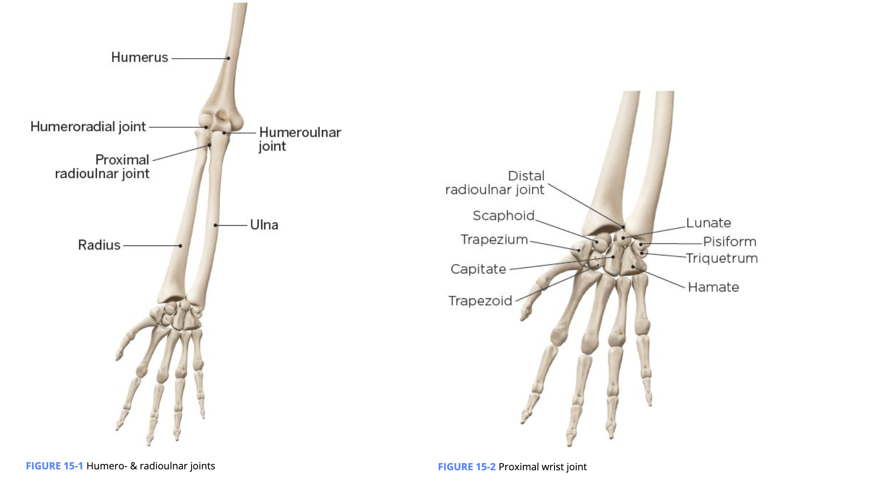

### WRIST

- 27 bones in the wrist and hand
- Distally, the radius and ulna make the distal radioulnar joint, which interacts with the carpal bones. 
- The carpus, or wrist, is composed of eight small bones arranged in two rows. 
  - proximal row
    - Pisiform, triquetrum, lunate, scaphoid. (Please Take Larry Shopping)
    - majority of wrist flexion and extension and radial and ulnar deviation range of motion (ROM)
    - wrist flexion and extension, as well as radial and ulnar deviation
  - distal row
    -  Hamate, capitate, trapezoid, trapezium. (He’s Come To Town.)

## Muscles

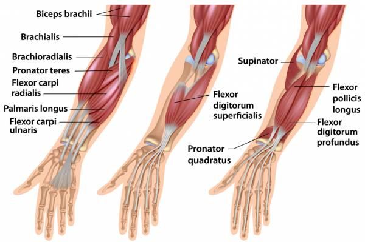

+ Elbow:  movement accomplished by seven muscles; position of the brachioradialis allows it to both supinate and pronate the forearm, depending on forearm position. these muscles cannot supinate the elbow when it is fully extended.
  + Elbow flexion:
    + Biceps brachii: multiarticular muscle, crossing both the elbow and the shoulder.  bulkiest of the elbow flexor group.
    + Brachialis (primary)
    + Brachioradialis
    + Pronator teres (weak elbow flexor)
  + Elbow extension
    + Triceps brachii:  
      + long head:  
        + crossing the shoulder and attaching to the scapula. Thus, in addition to elbow extension, the long head can also assist with shoulder extension
        + Shoulder flexion increases the length of the long head, which decreases the amount of force it produces (refer back to length-tension relationships), thus potentially increasing the relative amount of force required by the lateral and medial head 
      + Short head
      + medial head of the triceps was primarily composed of type I fibers and motor units, the lateral head is primarily type II fibers and motor units, and the long head is a balanced mixture of both. Therefore, the medial head may be more involved in movements requiring fine motor skills, the lateral used in more powerful elbow extension movements, and the long head used a little for both and for those tasks requiring higher endurance.
      + all triceps share a common insertion on the ulna, rotation of the forearm will not influence one head of the triceps over another.
  + Forearm pronation: very weak relative to the supination muscles. Most screws, lids, bolts, etc. tighten when turned clockwise because turning involves supination of the right arm. Most people are right-handed, and supination is more powerful than pronation because it is controlled by the supinator muscle and the large biceps brachii.
    + Pronator quadratus
    + Pronator teres
  + Forearm supination: Both the biceps brachii and the brachioradialis attach to the radius, which allows them to produce supination
    + Supinator (primary): can produce supination whether the elbow is flexed or extended.
    + Biceps brachii (secondary)
+ Hand and wrist: 9 muscle, In many sports, both forearm flexors and extensors are exposed to heavy eccentric loads. (extensor in tennis, flexor in golf)
  + Wrist ulnar deviation: he flexors and extensors on the ulnar side (pinky finger side) work together to perform the movement
    + Extensor carpi ulnaris
    + Flexor carpi ulnaris
  + Wrist radial deviation:  both the flexors and extensors on the radial (thumb side) work together to perform the movement.
    + Abductor pollicis longus
    + Extensor carpi radialis longus
    + Extensor carpi radialis brevis
    + Flexor carpi radialis
  + Wrist flexion: also flexion of the fingers
    + Flexor carpi radialis
    + Flexor carpus ulnaris
    + Palmaris longus
  + Wrist extension: not only wrist extension, but also extension of the fingers.
    + Extensor carpi radialis brevis
    + Extensor carpi radialis longus
    + Extensor carpi ulnaris
    + Extensor digiti minimi
    + Extensor digitorum
    + Extensor indicis
    + Extensor pollicis brevis
    + Extensor pollicis longus

# Altered Elbow and Wrist Movement

+ Between 1% and 3% of the U.S. population experiences elbow pain (Kane et al., 2014),
+  25% of all sports-related injuries involve the wrist and hand
+  incidence of lateral elbow pain in general practice is 4 to 7 per 1,000 people a year
+ the lower extremity, lumbar-pelvic-hip complex (LPHC), and shoulder all influence optimal function of this region.

## Static Malalignments

+ chronic elbow flexion, 
  + overactivity of the biceps brachii and brachialis
  + underactivity of the triceps. 
  + increased length of the triceps may also either affect or be affected by shoulder instability. 
  + excessive elbow flexion has been shown to restrict wrist ROM (Murray et al., 2002).

+ Chronic wrist extension
  +  computer keyboard without wrist support. 
  + tightness in the wrist extensors
  + lateral elbow pain. 
+ chronic wrist flexion 
  + repetitive activities requiring excessive gripping or carrying of heavy objects. 
  + tightness in the wrist flexors
  + medial elbow pain. 
  + should be placed on a neutral position when possible. 
  + aim to decrease exposure to repetitive tasks and limit extremes of elbow and wrist motion

## Abnormal Muscle Activation Patterns

+ Repeated wrist and elbow motion can lead to an overuse of the wrist extensors and to tendon injury (Herquelot et al., 2013). 
+ leads to changes in the shoulder complex 
+ elbow dysfunction may arise because of changes in the shoulder complex and the compensatory actions caused by the overloaded forearm muscles 
  + serratus anterior, rhomboids, lower trapezius, and rotator cuff complex. 
  + improving serratus anterior and rotator cuff activation has been shown to decrease elbow dysfunction

+  wrist immobilization resulted in increased shoulder pain.
  + compensatory movement from the loss of wrist motion was likely to blame. 
  + altered muscle activation patterns with a redistribution of force in the shoulder musculature during gripping 

## RI Model

+  Janda’s upper crossed syndrome creating a shortening of the cervical extensors, pectoralis major/minor, and possibly the elbow flexor group. 
  + trying to stabilize something overhead, a shortened pectoralis group (e.g., pectoralis minor) can cause rounded shoulders and limit full-shoulder flexion. 
    + compensation: wrist hyperextension to balance the mass over the base of support. 
    + overhead athletes such as baseball pitchers 

### Influence on the Wrist

+ reaching requires complex and simultaneous control of movements at the shoulder, elbow, and wrist 
  + Excessive elbow flexion due to biceps brachii shortening has been demonstrated to restrict wrist ROM (Murray et al., 2002). 
  + Having restricted wrist mobility due to shortened forearm/elbow flexors is an important consideration in sports, especially inoverhead movements like the jerk and snatch, where heavy loads are overhead.  golfers, which can lead to forearm and wrist injuries 

# Assessment Results for the Elbow and Wrist

+ overactivity of the biceps brachii can contribute to rounded shoulder static posture and the arms fall forward movement impairment, because that muscle crosses the glenohumeral joint.

| **Assessment**                                               | **Results**                                                  |
| ------------------------------------------------------------ | ------------------------------------------------------------ |
| **Static posture**                                           | Elbows rest in flexed positionWrists rest in non-neutral position |
| **Transitional and loaded movement**                         | Arms fall forwardArms do not straightenWrists in non-neutral position |
| **Mobility**Elbow flexion and extension, wrist flexion and extension | Limited elbow flexion ROMLimited elbow extension ROMLimited wrist flexion ROMLimited wrist extension ROM |

## Static Posture

If a client presents with rounded shoulders and excessive thoracic kyphosis (e.g., as with upper crossed syndrome and swayback postures), there is a strong chance that limited mobility of the elbow or wrist is a related factor.

static posture from a lateral view, the position of the elbows and wrists should also be noted. When standing with arms at the side, they should hang in a relatively straight line with the hips and legs, with the wrist in a straight, neutral position. If the elbow or wrist rests in a bent position, that is a sign that arm mobility assessments should be performed.

## Transitional Movement Assessments

### OVERHEAD SQUAT ASSESSMENT

+ elbows not fully extending overhead and the wrists moving into a non-neutral position. 
  + lack of elbow extension is often attributed to overactive/shortened biceps brachii and other elbow flexor muscles. 
  + compensate with wrist hyperextension as a form of relative flexibility to accomplish fully extended elbows.
  + The biceps brachii provide a divergent tension with the latissimus dorsi at the shoulder (both contributing to the complex force-couple at the glenohumeral joint); 
  + mobility assessments of both the elbow and shoulder joints to determine where the primary cause of the mobility restriction may be located (i.e., biceps brachii, latissimus dorsi, or both).

## Loaded Movement Assessment

+ Standing or seated overhead dumbbell press
  + lack of full elbow extension and/or an inability to maintain the wrist in a neutral position at the end of a push or press movement
  + wrist hyperextension can be seen in some individuals at the end-range of a push or a press.
+ loaded pull movement can help bring to light any overactivity/shortening of the wrist flexor musculature. 
  + At the end-range of the concentric phase of a pull, inward curling wrists

# Corrective Strategies for the Elbow and Wrist

| **Phase**  | **Modality**                                               | **Muscle(s)/Exercise(s)**                                    | **Acute Training Variables**                                 |
| ---------- | ---------------------------------------------------------- | ------------------------------------------------------------ | ------------------------------------------------------------ |
| Inhibit    | Self-myofascial rolling (using fingertips or massage ball) | Biceps brachii Brachialis Wrist extensors Wrist flexors | Hold areas of discomfort for 30 to 60 secondsPerform four to six repetitions of active joint movement |
| Lengthen   | Static stretching                                          | Biceps brachii Wrist extensors Wrist flexors       | 30-second hold                                               |
| Activate   | Isolated strengthening                                     | Elbow extension Wrist flexion or extension              | 10 to 15 reps with 4-second eccentric contraction, 2-second isometric contraction at end-range, and 1-second concentric contraction |
| Integrate* | Integrated dynamic movement                                | Inverted row  Prone ball triceps extension with cobra  Standing cable press  Triceps extension progressions | 10 to 15 reps under control                                  |

## Common Exercise Selections for the Elbow and Wrist

### INHIBIT: SELF-MYOFASCIAL ROLLING

+ self-applied pressure using the fingertips or a small massage ball is recommended over the use of a foam roller. 
+ apply pressure only on muscle bellies and avoid the brachial artery, which is just medial to the biceps along the inner portion of the upper arm. The radial and ulnar arteries branch off from the brachial artery and run along the lateral and medial aspects of the forearm, respectively.

Self-applied pressure to wrist extensors or flexors in the forearmSelf-applied pressure to the biceps brachii or brachialis

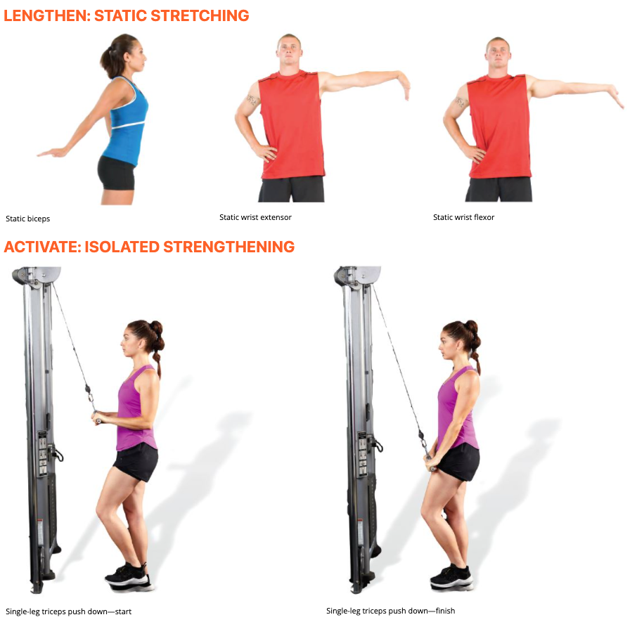

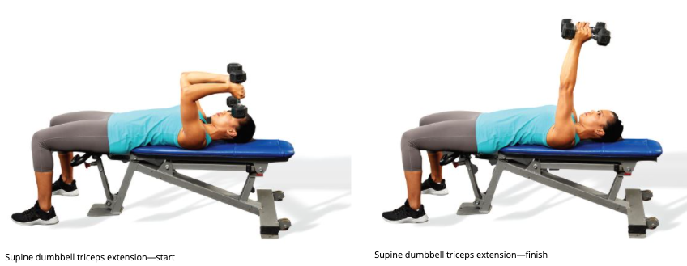

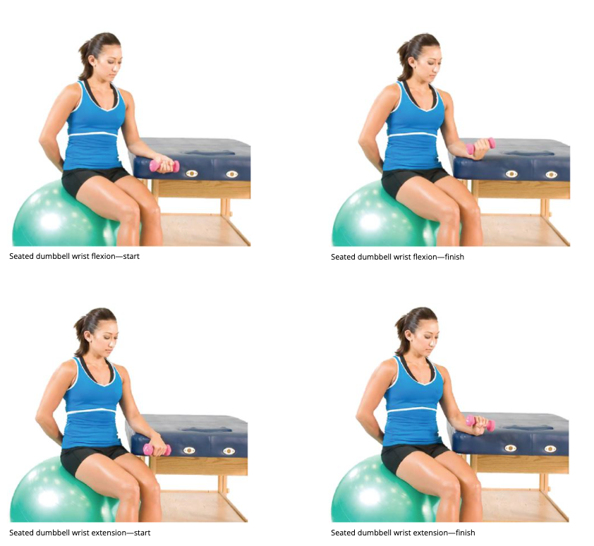

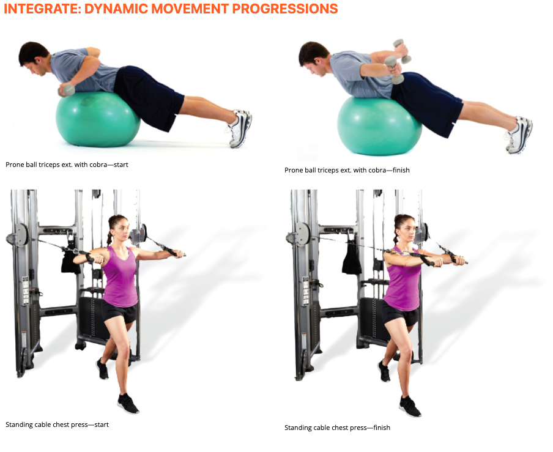

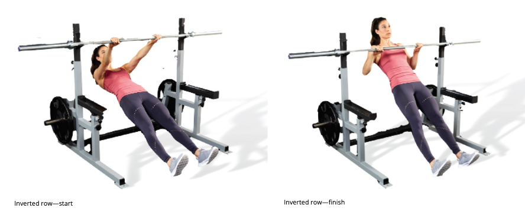

## Elbow Flexion

### PHASE 1: INHIBIT

+ biceps brachii and brachialis

### PHASE 2: LENGTHEN

biceps brachii and brachialis. A stretch that uses the combination of both shoulder and elbow extension is most effective.

### PHASE 3: ACTIVATE

Kelbow extension exercises to target the triceps. Effective exercises will isolate the long and short triceps by maintaining a neutral shoulder or isometric shoulder flexion, respectively.

### PHASE 4: INTEGRATE

coordinated muscle action through the upper extremity

| **Phase**  | **Modality**                | **Muscle(s)/Exercise(s)**  | **Acute Training Variables**                                 |
| ---------- | --------------------------- | -------------------------- | ------------------------------------------------------------ |
| Inhibit    | Self-myofascial rolling     | BrachialisBiceps brachii   | Hold areas of discomfort for 30 to 60 seconds Perform four to six repetitions of active joint movement |
| Lengthen   | Static stretching           | Biceps brachii             | 30-second hold                                               |
| Activate   | Isolated strengthening      | Triceps                    | 10 to 15 reps with 4-second eccentric contraction, 2-second isometric contraction at end-range, and 1-second concentric contraction |
| Integrate* | Integrated dynamic movement | Standing cable chest press | 10 to 15 reps under control                                  |

## Non-neutral Wrist

### PHASE 1: INHIBIT

wrist extensors or the wrist flexors, depending on which group is overactive/shortened.

### PHASE 2: LENGTHEN

 wrist extensors or the wrist flexors. Movements that combine elbow extension with wrist flexion or extension are most effective.

### PHASE 3: ACTIVATE

wrist flexors or the wrist extensors.

### PHASE 4: INTEGRATE

| **Phase**  | **Modality**                | **Muscle(s)/Exercise(s)**                                    | **Acute Training Variables**                                 |
| ---------- | --------------------------- | ------------------------------------------------------------ | ------------------------------------------------------------ |
| Inhibit    | Self-myofascial rolling     | Wrist flexors (restricted wrist extension) Wrist extensors (restricted wrist flexion) | Hold areas of discomfort for 30 to 60 secondsPerform four to six repetitions of active joint movement90 to 120 seconds per muscle group |
| Lengthen   | Static stretching           | Wrist flexors (restricted wrist extension) Wrist extensors (restricted wrist flexion) | 30-second hold                                               |
| Activate   | Isolated strengthening      | Wrist flexors or wrist extensors                             | 10 to 15 reps with 4-second eccentric contraction, 2-second isometric contraction at end-range, and 1-second concentric contraction |
| Integrate* | Integrated dynamic movement | Inverted row                                                 | 10 to 15 reps under control                                  |

# Common Issues Associated with the Elbow, Wrist, and Hand

## Common Elbow Injuries

refer a client to their healthcare professional for a medical evaluation if pain or dysfunction limit normal activities or signs of nerve involvement (i.e., numbness, tingling, or burning) are present.

### LATERAL EPICONDYLITIS (TENNIS ELBOW)

+ overhead tennis serve, the wrist extensors must contract to assist in decelerating the forward moving arm.
+  tennis backhand, the wrist extensors contract forcefully to stabilize the wrist, preventing wrist flexion from occurring when contact is made with the ball. 
+ ROM restrictions in wrist flexion and/or extension and report lateral elbow pain with aggravating activities.

### MEDIAL EPICONDYLITIS (GOLFER’S ELBOW)

+ aggravated by activities that resist the flexor muscles. 
+ ROM restrictions in wrist flexion and/or extension and report medial elbow pain with aggravating activities. 

HELPFUL HINT

**Client Presentation**

1. Individuals may have discomfort with gripping objects, such as a dumbbell.
2. Individuals may have discomfort with repetitive UKC movements involving gripping tasks, such as a dumbbell row or kettlebell swing.
3. Repetitive resisted movements for the elbow or forearm flexors or extensors could cause medial or lateral elbow discomfort.

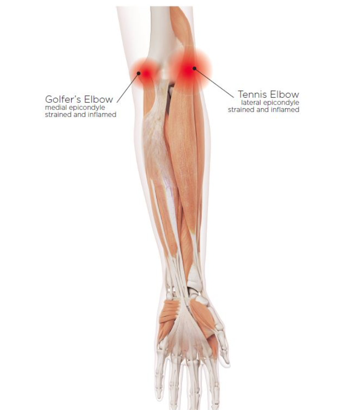

## Common Wrist and Hand Injuries

### DE QUERVAIN’S TENOSYNOVITIS

+ inflammation of the sheath, or synovium, that surrounds the two tendons that run between the wrist and the thumb 
+ activity that relies on repetitive hand or wrist movement may be associated
  +  typing, using gaming consoles (de Quervain’s tenosynovitis is also known as gamer’s thumb), racquet sports, and activities such as gardening. 
+ Symptoms may include pain in the back of the thumb and swelling at the base of thumb or wrist. 
+ ROM deficiency or increased pain during ulnar deviation. 

+  burning, decreased strength and flexibility, and pain caused by everyday activities.  tendinopathy is actually more responsible for these symptoms than tendinitis
+ tendinitis is the inflammation of the tendon and results from micro-tears that happen when the musculotendinous unit is acutely overloaded with a tensile force that is too heavy and/or too sudden
+ in the presence of most repetitive stressors and a lack of recovery, the tendon will begin to degenerate. Tendinopathy is a term used to describe this degenerative process in a tendon. Despite research indicating that what is thought to be tendinitis is usually tendinopathy, tendinitis is still a very common diagnosis

### CARPAL TUNNEL SYNDROME

+  affecting 3% to 6% of U.S. adults (Page et al., 2012). This syndrome causes numbness, tingling, weakness, and other symptoms in the hand.
+ median nerve of the brachial plexus being entrapped in the carpal tunnel of the wrist 
+ poor wrist alignment during activities such as typing.
+  Excessive and repeated wrist flexion or extension may close off the carpal tunnel space irritating the nerves .
+ ROM restrictions in wrist flexion and/or extension. 
+ Commonly, symptoms are the worst during sleep, and clients may be prescribed a wrist brace to maintain an open carpal tunnel. 
+ Individuals may have discomfort with gripping objects, such as a dumbbell.
+ Individuals may have discomfort with repetitive UKC movements involving gripping tasks, such as a dumbbell row, kettlebell swing, or battle ropes.

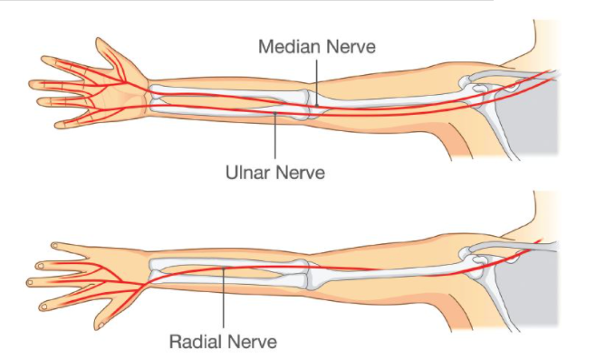

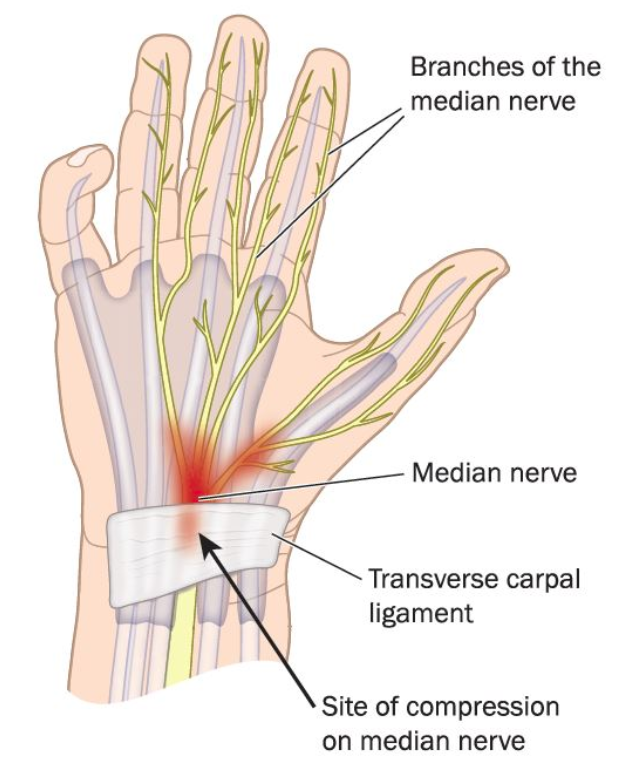

## Quiz

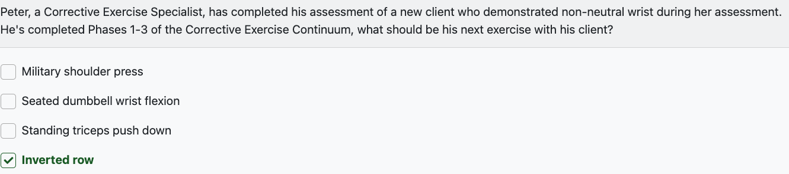

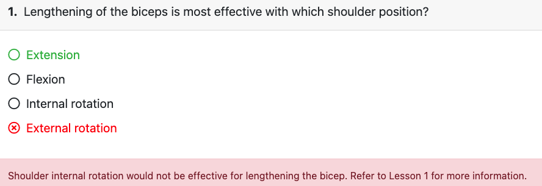