# Introduction

- neck pain is the third most common type of pain for Americans. 
- one of the four main causes of disability throughout the world
- two-thirds of the U.S. population will experience neck pain in their lifetime. 
- (42%) had suffered neck pain for longer than a year. 
- women are three times more likely to experience this health problem than men;
-  if an individual is under severe stress, the risk of neck pain increases by one and a half times. 
- neck strengthening, stretching, and proprioceptive exercises can decrease the risk of neck pain or improve symptoms
- muscles of the neck are linked to vestibular function, proprioceptive systems, stabilization of the head and eyes, postural orientation, and stability of the whole body. 

# Functional Anatomy

From a posterior view, the anatomic region of the neck runs from the superior nuchal line to the spine of the scapula; from a lateral view, it extends from the superior nuchal line and external occipital protuberance to the superior border of the clavicle and suprasternal notch

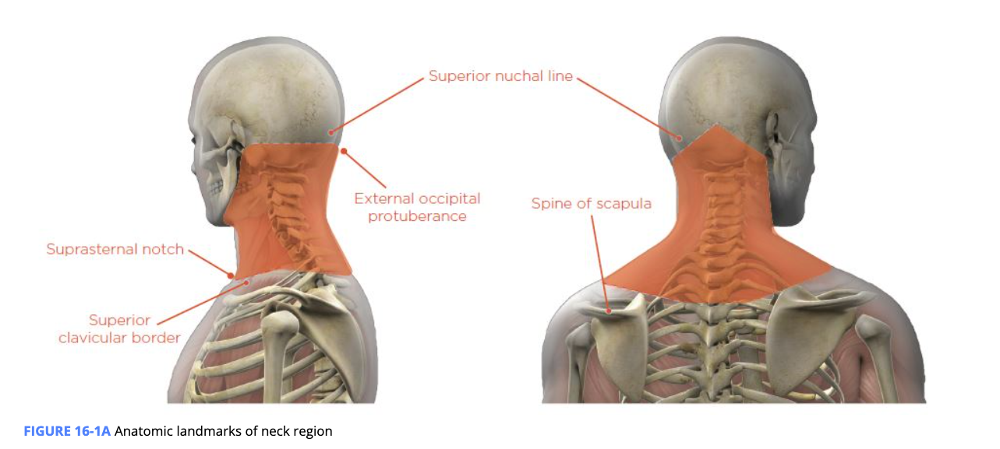

## Bones and Joints

+ C1 (atlas), C2 (axis), C3, C4, C5, C6, and C7 (Moore et al., 2013). 
+ intervening discs. Anterior to the cervical spine is the hyoid bone. The hyoid bone does not articulate with any other bone; rather, it is suspended in the anterior neck with a **muscular sling** by muscles located above (suprahyoids) and below (infrahyoids). 
  + Muscular sling
    + A group of muscles that, when contracted, provide stability.

+ Cervical lordosis: The curvature of the cervical spine.
+ joints. 
  + The base of the skull and C1 (atlas) make up the atlanto-occipital joint. 
  + The atlas (C1) and axis (C2) make up the atlanto-odontoid and atlantoaxial joints. 
  + The area between the occipital bone and the axis (C2) is known as the suboccipital region
  + Typical cervical vertebrae have four **facet joints**, formed by right and left superior and inferior facets
    + Facet joints: A set of synovial, plane joints located between and behind adjacent vertebrae.
  + The five lower cervical vertebrae also contain synovial articulations, located anterior and medial to the spinal nerve roots, called uncovertebral joints (aka Luschka joints), which are important for providing stability and guidance of cervical spine motion. 

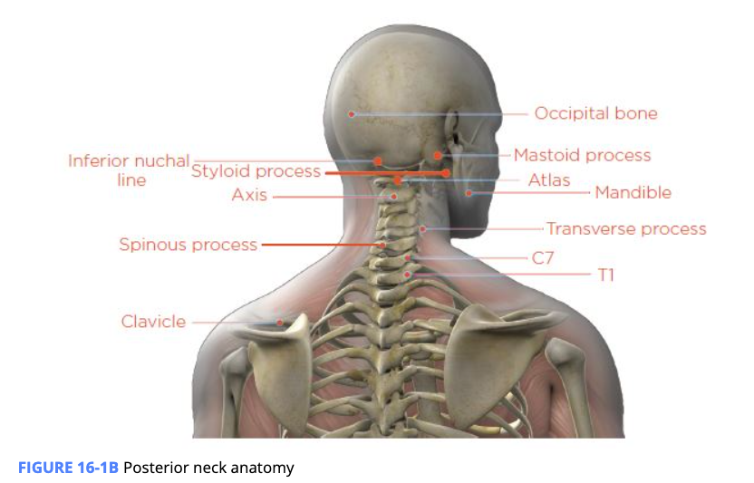

## Muscles

- **upper oblique subsystem** : The deep neck flexors, lower trapezius, and serratus anterior, pectorals, upper trapezius, and levator scapulae 
- Key Muscles Associated with the Cervical Spine
  - Cervical extensors (erector spinae and suboccipitals)
  - Deep cervical flexors
  - Levator scapulae
  - Pectoralis minor
  - Rhomboids
  - Scalenes
  - Sternocleidomastoid
  - Trapezius
- compensatory mechanism for underactivity of the deep neck flexors
  - lead to an inability to maintain an upright cervical spine position, 
  - upper trapezius, levator scapulae, sternocleidomastoid, and pectorals can become synergistically dominant (overactive) 
  - forward head migration and the rounding of the shoulders commonly seen in the upper crossed syndrome postural distortion
- The cervical extensors can also become shortened and overactive in individuals with **forward head posture (FHP)**
  - Occurs when the head is protruding anterior to the shoulders in the sagittal plane; can lead to development of head and neck pain, movement restrictions, and compensations above and below the cervical spine.
-  suboccipital muscles, which are part of the cervical extensors, can become overactive and be a source of neck pain and headaches
  - suboccipital muscles consist of four deep muscles located in the upper cervical spine below the occipital bone

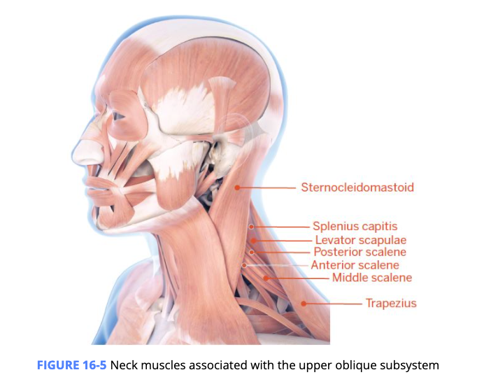

# Altered Cervical Spine Posture and Movement

## Static Malalignments

+ head protrudes forward, 
+ lower cervical spine to flex and the upper cervical spine to extend to keep the head upright.
+ lengthen the anterior neck muscles, and shorten the posterior neck muscles 
+ rounded shoulders and increased thoracic kyphosis, common in Janda’s upper crossed syndrome.

### CAUSES OF FORWARD HEAD POSTURE

+  young adults continue to maintain poor posture, it can eventually lead to **spinal remodeling**, which increases the risk for degenerative changes to occur in the spine over the life spa
  + Spinal remodeling: Abnormal reshaping of the spine’s physiologic curvatures due to sustained abnormal posture.
+ Text neck: Neck and upper back pain caused by poor posture during excessive cell phone use. Every inch of forward displacement of the head requires a 10-fold increase of muscular effort to support posture

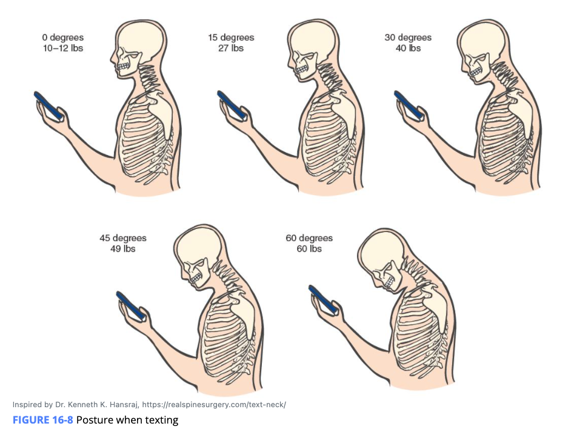

## Abnormal Movement Patterns

- shortened/overactive muscles: sternocleidomastoid, levator scapulae, scalenes, upper trapezius, cervical extensors, and suboccipitals 
- Lengthened/underactive muscles: deep cervical flexors
  - extreme FHPs, the lower cervical extensors may be lengthened
- Cervical rotation
  - For healthy individuals with normal head and neck posture, approximately 50% of cervical spine rotation occurs between the first cervical vertebra (C1) and the second cervical vertebra
  - in clients with an FHP, rotation as well as side-bending of the neck is often reduced. 
  - During function, the cervical spine requires balance between left and right associated musculature to maintain optimal posture. When this does not occur, abnormal asymmetric shifting can also be seen when assessing statically. This may be related to an overactive and underactive right and left sternocleidomastoid, scalenes, levator scapulae, and upper trapezius 
  - Advanced stages of FHP can cause compression in the upper cervical spine, which can significantly reduce the ability of C1 to rotate around C2. 
    - middle and lower cervical spine segments try to make up for the restrictions above by attempting to rotate through greater ranges of motion than they normally would. This can result in cervical spine instability or **hypermobility** in the middle and lower cervical spine, which increases the risk for cervical spine degeneration and pain
    - Hypermobility
      - Increased movement and functionality of a joint beyond normal range of motion.

### DYNAMIC MALALIGNMENT

- FHP can cause excessive stress to the cervical and upper thoracic spines that contributes to pain and decreased range of motion (ROM)
  - expansion of the upper thorax and contraction of the lower thorax, resulting in decreased respiratory function
- tension headache=, shoulder impingement, and carpal tunnel syndrome . 
-  more prone to nerve entrapment disorders (e.g., carpal tunnel) along the upper kinetic chain
-   Individuals with FHP may also have poor proprioception or joint position sense in the cervical region 

# Cervical Spine Dysfunction and the Regional Interdependence Model

## Hyoid Bone Positioning

- FHP increases tension in the musculature located directly above the hyoid bone (suprahyoids), which can cause the hyoid bone to elevate above its normal resting position
  - may contribute to the onset of anterior neck pain and jaw pain, 
  - difficulty swallowing food

## Influence Above the Cervical Spine

+ increased load bearing on the musculature and facet joints located in the upper cervical spine
+ overactivity and shortening of the cervical extensors and suboccipital musculature
+ reduced pain thresholds and predisposition to **myofascial trigger points** (Hong et al., 2019; Patwardhan et al., 2018).
  + Myofascial trigger points: Painful regions within a tight band of skeletal muscle that also give rise to referred pain.
  + Referred pain: Pain perceived at a different location than the source.
+ Cervicogenic headaches Headaches originating from the neck.
  + Suboccipital trigger points can contribute to the onset of cervicogenic headaches, can refer and radiate pain to the posterior and lateral portions of the head 
  + upper trapezius, sternocleidomastoid, and suboccipitals can radiatepain to the many regions around the head

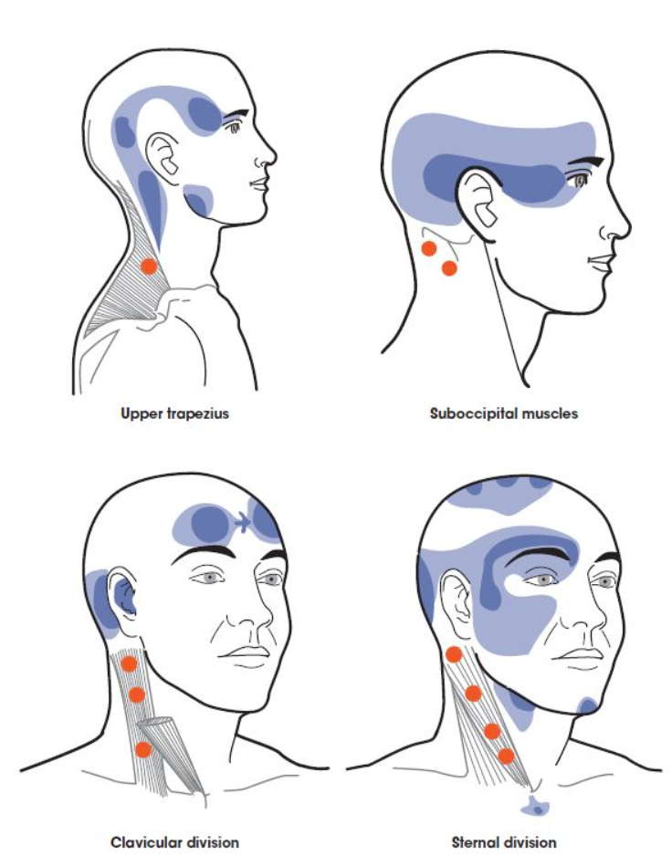

### INFLUENCE ON THE TEMPOROMANDIBULAR JOINT (TMJ)

- The temporomandibular joint (TMJ) is a modified hinge joint that allows the mandible (jawbone) to move upward, downward, anterior, and posterior, as well as side to side. 
- its function is not only influenced by muscles located throughout the head and neck, but also by a cartilaginous disc located within the joint (Zafar et al., 2000).
- FHP can contribute to the development of pain in the musculature surrounding the TMJ by altering length-tension relationships in the head and neck musculature
  - excessive tension in the muscles above the hyoid bone, which, in turn, places greater force demands on the muscles that close the jaw 
  - FHP can also influence the location where the upper and lower teeth come together, which can also affect TMJ function
  - Overactivity in the upper trapezius, sternocleidomastoid, levator scapulae, cervical extensors, and suboccipitals is also associated with TMJ disorders, because **cocontractions** occur in these muscles when teeth are clenched together excessively (Giannakopoulos et al., 2013).
    - Cocontractions
      - The simultaneous contraction of muscles around a joint.

## Influence Below the Cervical Spine

- rounded shoulders. Janda’s upper crossed syndrome. 
  - overactivity of the upper trapezius and levator scapulae muscles, this can negatively affect **scapulohumeral rhythm**, leading to **scapular dyskinesis**. 
    - Scapulohumeral rhythm: The interaction between the scapula and the humerus; important for shoulder function.
    - Scapular dyskinesis: Occurs when the scapula does not move in a normal fashion during humeral elevation.
      - associated with the development of shoulder pain and impingement. 
  - increased **thoracic kyphosis (TK)**, can promote **hyperextension** in the upper cervical spine, which contributes to neck pain and stiffness 
    - Thoracic kyphosis (TK)
      - The outward curvature of the thoracic spine that provides the rounded appearance of the upper back.
    - Hyperextension
      - Extension of a limb or joint greater than the normal range of motion.
- Sit with a slouched posture and forward head and shoulders and then try to raise one arm over your head. Feel the tightness in the shoulder and note the limited mobility when performing this. 

### THE INFLUENCE OF FHP ON THE RESPIRATORY SYSTEM

- Normal inspiration (breathing in) is initiated by contraction of the primary respiratory muscles, the diaphragm, and external intercostals 
- FHP, muscle activity and function of the diaphragm may decrease, which can reduce lung expansion during inspiration
  - compensate by utilizing accessory respiratory muscles such as the sternocleidomastoid for inspiration
  - cause the client’s shoulders to move up and down rather than remaining in their normal stationary position

# Assessment Results for the Cervical Spine

| **Assessment**                                               | **Results**                                                  |
| ------------------------------------------------------------ | ------------------------------------------------------------ |
| **Static posture**                                           | Forward head in cervical extension Shoulders rounded forward |
| **Transitional and loaded movement assessments**             | Arms fall forward Excessive cervical extension Scapular elevation |
| **Dynamic movement assessments**                             | Excessive cervical extension                                 |
| **Mobility** Cervical flexion and extension, rotation, and lateral flexion | Limited cervical extension ROM Limited cervical flexion ROM Limited cervical lateral flexion ROM Limited cervical rotation ROM |

## Static Posture

Janda’s upper crossed and layered crossed syndromes, and Kendall’s flat-back, sway-back, and kyphosis-lordosis postures. combination of the FHP and rounded shoulder position

## Transitional Movement Assessment

### OVERHEAD SQUAT ASSESSMENT

- cervical spine may extend excessively 
  - overactive cervical extensors causing the deep neck flexors to become underactive and lengthened. 

### LOADED MOVEMENT ASSESSMENT

- loaded pushing and pulling assessments
- Overactivity of the sternocleidomastoid, upper trapezius, and/or scalenes can cause FHP 
  - synergistically dominant. 
- underactive muscles of the trunk that help keep the shoulders retracted and depressed

## Dynamic Movement Assessments

- Davies test: best highlights dysfunction in the cervical spine region. 
  - head to drop below the shoulders either during the push-up starting position or when in motion.
- Pelvo-ocular reflex
  - A postural reflex in which anterior rotation of the pelvis occurs as a result of forward head posture.
  - the neuromotor response of the pelvic girdle and lower extremity (Lewit, 1985) that serves to orient the body in response to head position and anticipatory visual reference cues. 
  - It is theorized that head position affects pelvic position. As the head migrates forward, the pelvis reflexively rotates anteriorly to readjust the center of gravity (pelvo-ocular reflex). This rotation of the pelvis with concomitant forward head migration can lead to thoracolumbar pain 

## Mobility Assessments

- The same muscles that contribute to FHP when overactive/shortened are also the ones that can create ROM deficits for cervical rotation and lateral flexion (i.e., the sternocleidomastoid, scalenes, and upper trapezius). 

# Corrective Strategies for the Cervical Spine

| **Phase** | **Modality**                | **Muscle(s)/Exercise**                                       | **Acute Training Variables**                                 |
| --------- | --------------------------- | ------------------------------------------------------------ | ------------------------------------------------------------ |
| Inhibit   | Self-myofascial rolling     | Cervical extensors (suboccipitals) Levator scapulae Sternocleidomastoid Thoracic spine Upper trapezius | Hold areas of discomfort for 30 to 60 seconds Perform four to six repetitions of active joint movement |
| Lengthen  | Static stretching           | Levator scapulae Scalenes (included when stretching the upper trapezius and sternocleidomastoid) Sternocleidomastoid Upper trapezius | 30-second hold                                               |
| Activate  | Isolated strengthening      | Cobra progressions Deep cervical flexors (chin-tuck progressions) Scapular retraction progressions | 10 to 15 reps with 4-second eccentric contraction, 2-second isometric contraction at end-range, and 1-second concentric contraction |
| Integrate | Integrated dynamic movement | Ball combo 1 Ball combo 2 Lunge to scaption Scaption progressions Squat to row | 10 to 15 reps under control                                  |

## Common Exercise Selections for the Cervical Spine

+ cervical spine is contraindicated region for foam roller use because of the sensitive nature of this region of the body. 
  + address inhibition of the cervical extensors (suboccipitals) and the sternocleidomastoid by using self-applied pressure techniques rather than rollers or instrument-assisted devices.
+ Appropriate regions to inhibit via myofascial rolling or instrument-assisted devices include the thoracic spine, levator scapulae, and upper trapezius. 
  + The upper trapezius and levator scapulae may have mild pressure applied using one of many hook- or cane-type tools with rounded ends.
  +  levator scapulae lies partially under the upper trapezius and sternocleidomastoid on either end. Only the middle portion of the muscle is “superficial” on the lateral portion of the neck.
  + levator scapulae be inhibited by applying pressure to the medial portion of the upper trapezius, where its trigger points are normally located.
+ suboccipital muscles may benefit from simply placing a thumb or finger on the base of the skull and applying mild pressure. 
+ The sternocleidomastoid can be accessed by placing one or two fingers on the belly of the muscle and applying light pressure on identified trigger points. Care should be taken to avoid applying pressure to the carotid artery.

+ deep neck flexors are primarily made up of the longus colli and longus capitis muscles. 
  + stabilize the cervical spine in all positions against the effects of gravity. 
  + anatomic action: nod the chin. 
  + If muscle recruitment is impaired, the balance between the stabilizers on the front and the back of the neck will be disrupted. This will cause loss of proper alignment of the spinal segments and a posture that could lead to cervical pain

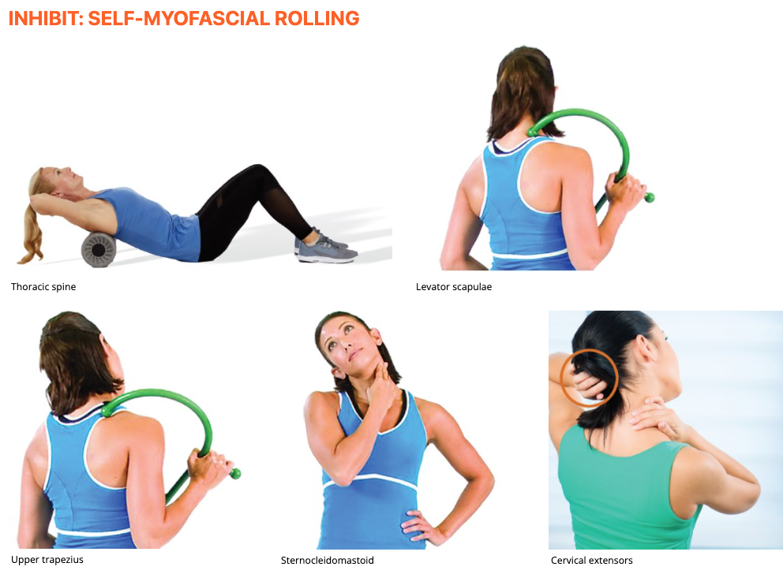

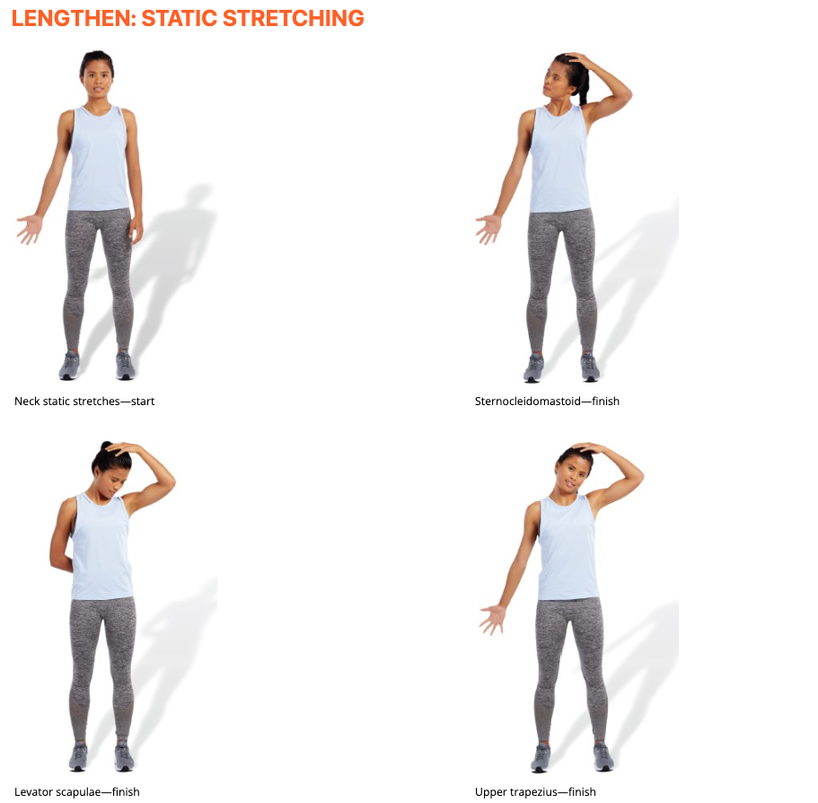

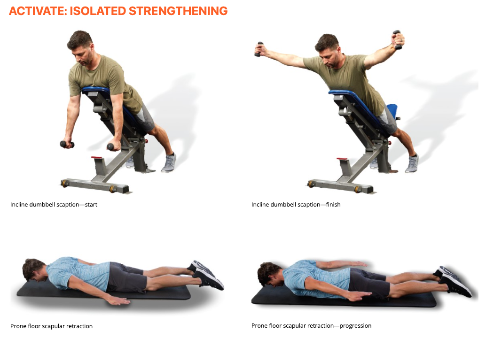

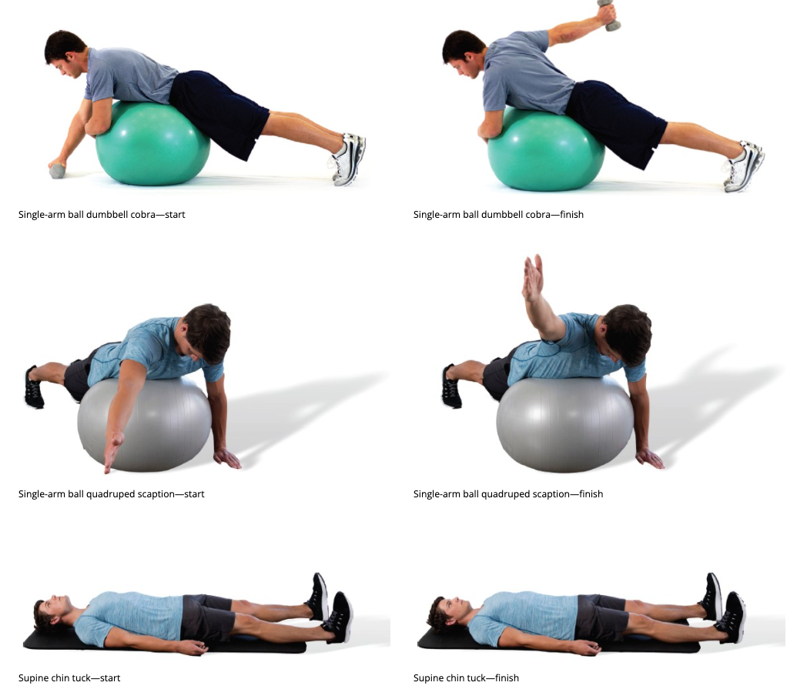

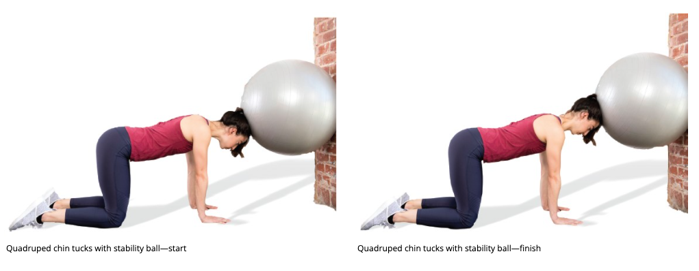

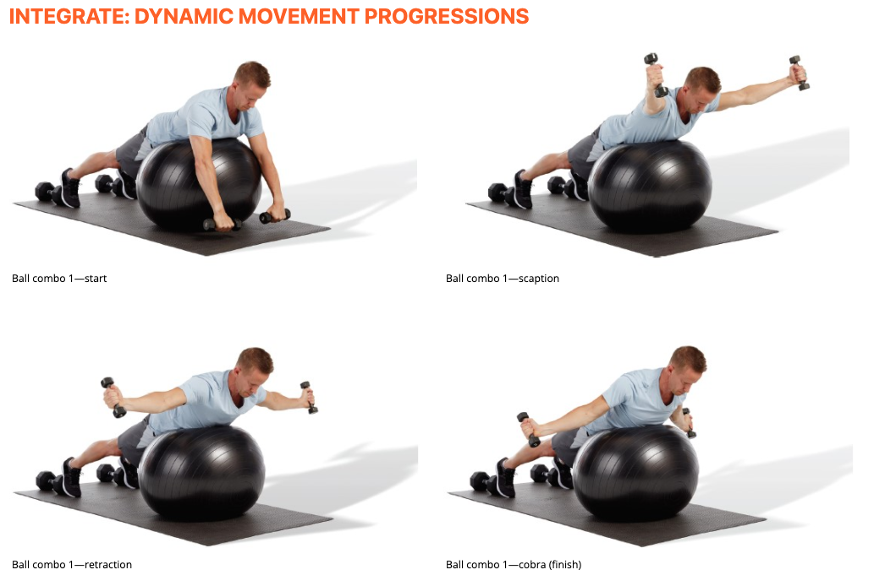

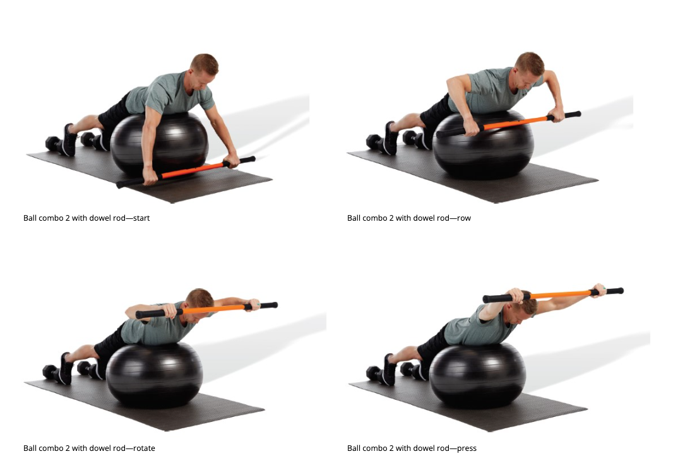

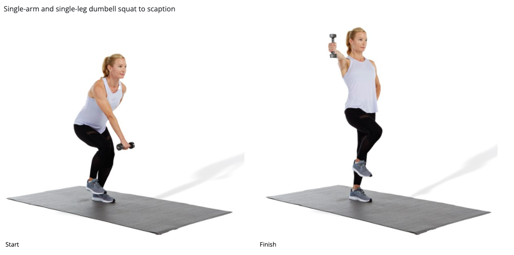

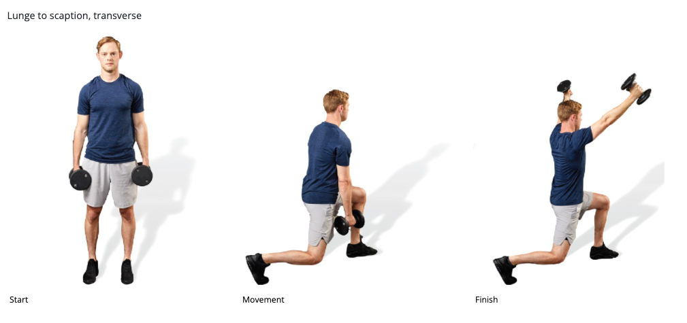

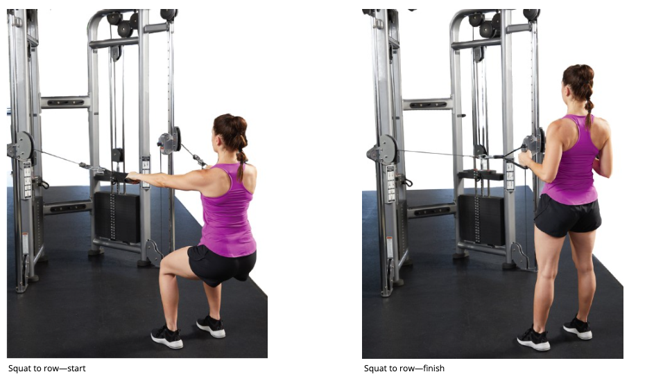

## Forward Head Posture

### PHASE 1: INHIBIT

+ cervical extensor (suboccipital), upper trapezius, levator scapulae, and sternocleidomastoid muscles and the thoracic spine.
  + cervical extensor (suboccipital) and sternocleidomastoid muscles utilizing self-applied pressure techniques.

### PHASE 2: LENGTHEN

+ upper trapezius, scalenes, levator scapulae, and sternocleidomastoid muscles (Bae et al., 2016). If mobility assessment reveals asymmetrical restriction, additional sets may be performed for the more restricted side.
+ Given the attachments of the scalene muscles, they will also be lengthened when performing stretches for the upper trapezius and sternocleidomastoid muscles.

### PHASE 3: ACTIVATE

+ deep cervical flexors, middle and lower trapezius, and rhomboids.
+ greatest level of middle and lower trapezius activation occurred at 90 and 125 degrees of shoulder abduction. horizontal row and scaption progressions

### PHASE 4: INTEGRATE

| **Phase** | **Modality**                                                | ***Muscle(s)/Exercise**                                      | **Acute Training Variables**                                 |
| --------- | ----------------------------------------------------------- | ------------------------------------------------------------ | ------------------------------------------------------------ |
| Inhibit   | Self-myofascial rolling technique appropriate to the region | Cervical extensors (suboccipitals) Levator scapulae Sternocleidomastoid Upper trapezius | Hold areas of discomfort for 30 to 60 seconds Perform between four and six repetitions of active joint movement 90 to 120 seconds per muscle group |
| Lengthen  | Static stretching                                           | Levator scapulae Sternocleidomastoid Upper trapezius | 30-second hold                                               |
| Activate  | Isolated strengthening                                      | Incline dumbbell scaption Quadruped chin tucks with stability ball | 10 to 15 reps with 4-second eccentric contraction, 2-second isometric contraction at end-range, and 1-second concentric contraction |
| Integrate | Integrated dynamic movement                                 | Ball combo 1 Squat to row                               | 10 to 15 reps under control                                  |

# Common Issues Associated with the Cervical Spine

+ neck pain or stiffness, text neck, elevated hyoid bone, trapezius dysfunction, levator scapulae dysfunction, cervical joint dysfunction, cervical strains, deep flexor dysfunction, and cervical disc lesions.
+ often seen with symptoms associated with the head. This includes TMJ disorders, headaches, dizziness, or lightheadedness 
+ Common injuries below the cervical spine toward the shoulder include shoulder pain, trapezius–levator scapulae dysfunction, acromioclavicular (AC) joint impingement, scapulothoracic dysfunction, and thoracic outlet dysfunction. 
+ At the thoracolumbar spine, low back pain and sacroiliac joint dysfunction may be seen with various compensations in posture (thoracic extension, anterior pelvic tilt, and sacroiliac joint translation)

| **Local Injuries**                                           | **Injuries Above the Cervical Spine**                        | **Injuries Below the Cervical Spine**                        |
| ------------------------------------------------------------ | ------------------------------------------------------------ | ------------------------------------------------------------ |
| Cervical disc lesions Cervical joint dysfunction Cervical strains Deep flexor dysfunction Elevated hyoid bone Levator scapulae dysfunction Pain/stiffness Text neck Trapezius dysfunction | Cervicogenic headaches Dizziness/lightheadedness TMJ-related symptoms | AC impingement Anterior pelvic tilt/low-back pain Dysfunctional breathing Sacroiliac joint dysfunction Scapulothoracic dysfunction Thoracic outlet syndrome Upper extremity pain/weakness |

## Muscle Strain

- risk for injury during collision and contact sports
- muscle strain occurs when a tendon or muscle is overstretched and/or overworked, which results in disruption or tearing of the muscle tissue. （pulled muscle）, pain, spasm, swelling, and muscle weakness.
- In mild cases, this injury occurs only to the musculotendinous tissue itself; 
- in severe cases, such as those caused by traumatic sport injuries, falls, or motor vehicle accidents, nerves may become damaged as well 
- can also be caused by sustained muscle contractions. Individuals who maintain poor or awkward neck posture for prolonged periods while working are also susceptible for developing a muscle strain in their neck. 

## Stenosis of the Cervical Spine

- Spinal stenosis is a condition most commonly seen in older individuals; however, it can affect some middle-aged individuals who have a genetic predisposition for this condition. 
- the spinal canal narrows, causing compression of the spinal cord. A reduction in disc height as well as thickening and reduced flexibility of spinal ligaments are often the main causes of this condition 
- chronic, dull pain that remains deep in the neck; if this pathology also results in compression of nerve roots, individuals can also experience radiating pain, numbness, tingling sensations, or motor weakness in the upper extremities 
- In severe cases, if the spinal cord is under significant compression, spinal stenosis can cause chronic muscle spasms in the extremities, as well as gait abnormalities

## Degenerative Disc Disease

- Intervertebral discs make up approximately 25% of the height of a healthy spine (Betts et al., 2013). 
- During the natural aging process, spinal discs slowly lose their ability to retain fluid, resulting in gradual loss of disc height as well as reduction in shock-absorbing capability . In advanced age, the discs dry out and become thinner. This contributes to the reduction of overall body height while aging. Not everyone experiences spinal discomfort as a result of aging; however, some individuals may experience pain, stiffness, and inflammation in the spine due to the effects of reduced disc height
- Degenerative disc disease (DDD) can lead to excessive compression forces placed on the facet joints, which can cause pain and predisposition to arthritic degeneration 
  -  Excessive compression restricts the facet joints’ ability to function properly. 
  - some facets may lose their ability to slide over each other, which contributes to neck stiffness or instability in the cervical spine. 
  - bone spurs in and around the facets, which can cause significant neck pain, stiffness, and inflammation
  - can occur in younger individuals who maintain poor posture
- DDD may also lead to a herniated disc (also known as a bulged disc). When the gel-like substance that is normally contained in the center of the disc (nucleus pulposus) projects out of the disc, 
  - can irritate or compress a nerve root that is located next to the spine.
  - often results in burning pain, numbness, or tingling that also radiates to the upper extremity. Weakness in upper extremity musculature is also a common symptom .
  - if the projecting disc material does not make direct contact with a nerve, it may not produce pain symptoms because the spinal discs themselves do not contain nerve endings . Up to 35% of individuals between 40 and 64 years of age may have a cervical disc herniation without symptoms 

## Quizes

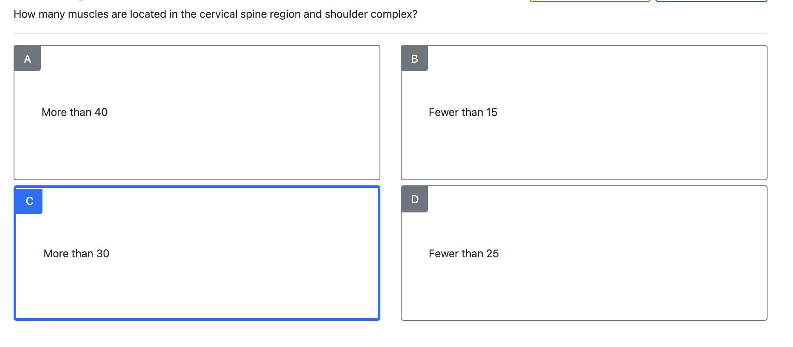

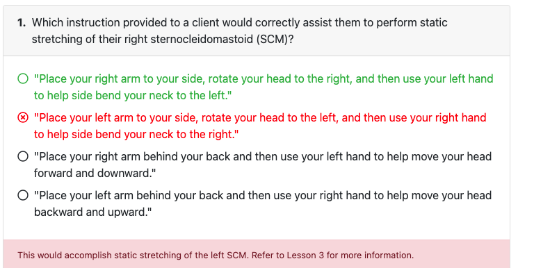

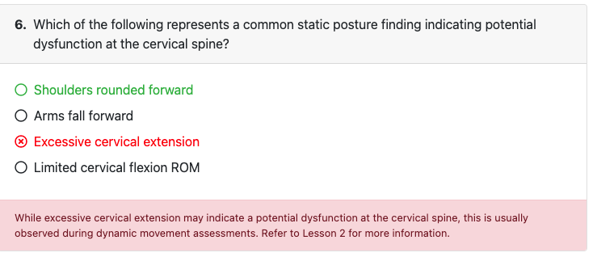

