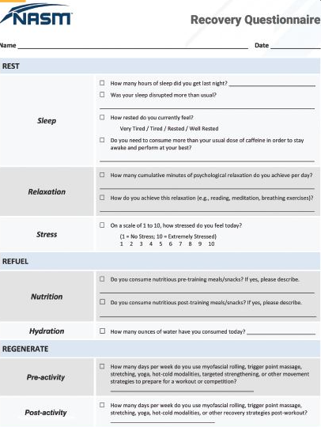
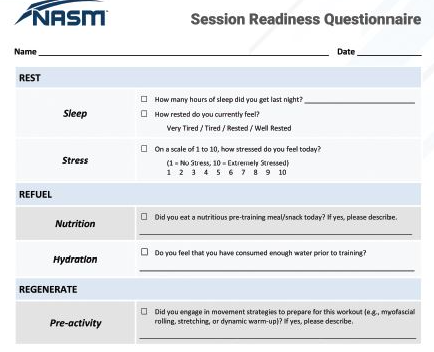
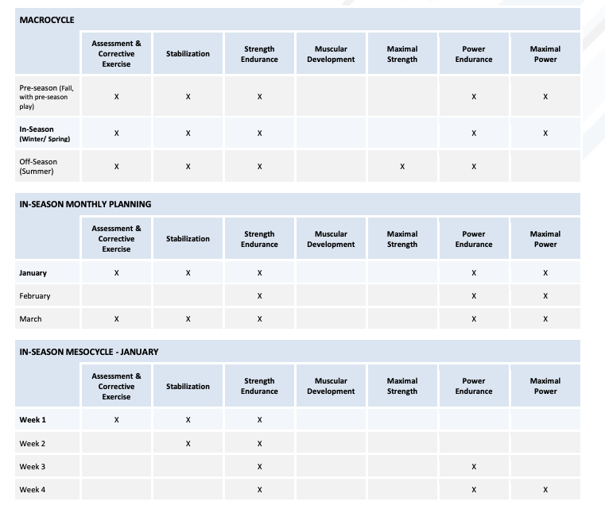
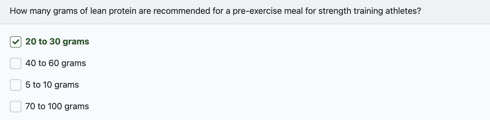
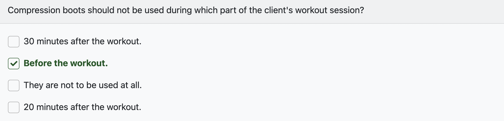
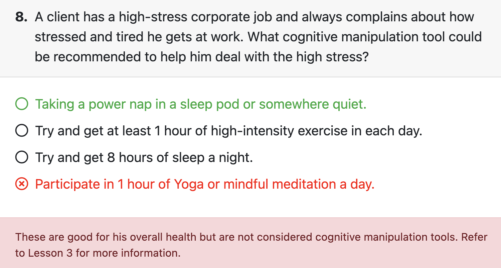

# Introduction

+ **Recovery** 
  + systematic physiological and psychological post-exercise process in which the body and brain require replenishment and rejuvenation in order to prepare for upcoming training or competition.

- Tools: Vibrating foam rollers, percussive massagers, sleep pods, compression boots, and wearable devices 
- Areas: sleep, nutrition, hydration, psychological relaxation, and movement (preparatory and restorative). 
- three phases: **rest**, **refuel**, and **regenerate**
  - Rest
    - improving daily sleep amount and quality, limiting stress, and increasing physical and psychological relaxation.
  - Refuel
    - nutrition and hydration habits prior to, during, and after activity.
  - Regenerate
    - movement-based self-care strategies to optimize movement quality and minimize compensation.

# Exercise, Recovery, and Overall Wellness

- Dr. Bill Hettler **six dimensions of wellness**. Interdependent categories used by the National Wellness Institute to illustrate the primary properties of an individual’s holistic health and overall functioning.
  - **Occupational.** person’s work and their attitude toward it. 
    - that career aligns with their personal interests, moral and political beliefs, and values.
  - **Physical.** nutrition, hydration, and physical activity components. 
    - well-balanced diet, meet at least minimal physical activity requirements, and refrain from consuming toxic substances such as drugs, alcohol, and tobacco
  - **Social.** welfare of those around them will find an environment built on trust and harmony.
  - **Intellectual.** consistently challenge their own beliefs, are open to new ideas, encourage creative thinking, and who are strategic in problem solving and planning are less likely to report stress and conflict. 
  - **Spiritual.**consistently question their own existence, values, and beliefs while at the same time are tolerant and open to other individuals’ spiritual beliefs have a deep appreciation for the universe. 
    - strive to have their actions align with their beliefs/values to achieve spiritual wellness.
  - **Emotional.** ability to identify and accept feelings and emotions. 
    - freely express their feelings will find more meaningful relationships and will be able to handle conflict with maturity and clarity. ability to accept other individuals’ feelings while understanding and responding to their own feelings.

+ Our role is to optimize the physical wellness and performance of their clients through proper exercise and recovery programming. 

# Recovery Planning

- recovery questionnaire. 
  - during client intake and even before each training session or athletic practice. 
  - client’s recovery-related habits. 
  - daily sleep (e.g., self-reports of total daily sleep amounts, quality, and daytime sleepiness), relaxation, nutrition and hydration habits, stress, muscle soreness, mental readiness, and pre- and post-training self-care routines.
- create a targeted recovery strategy
  - both physiological and psychological rejuvenation
  - select only those strategies that are most relevant and effective for their recovery plan. Working on a smaller number of actionable strategies creates a higher likelihood of adherence.
- implementation. 
  - effectively communicate programs, recovery strategies, and goals in a manner that increases adherence and compliance. 

## Recovery Questionnaire

### Rest

- minimum of 8 hours of sleep per night and 60 minutes of accumulated psychological relaxation per day and minimize the amount of perceived stress they experience. 
  - Psychological relaxation can take many forms depending on the individual and include breathing exercises, meditation, or reading.
- Metrics
  - Sleep
    - Aim for 8+ hr
    - Minimize sleep disruption beyond their baseline.
    - Maximize the sense of feeling rested, which helps to gauge sleep quality.
    - Minimize reliance on stimulants and empty calories, which helps to gauge sleep quality.
  - Relaxation
    - Target 60+ minutes per day.

### Refuel

- proper hydration and nutrition. 
  - Nutrition
    - Target a balanced nutritional approach appropriate to performance goals.
  - Hydration
    - Aim to replace fluid lost through sweat and retain hydration status prior to the next bout of training.
    - If less than 3% of body weight will be lost during competition or training, recommend fluid consumption as desired, or 500 mL (16.9 oz) before bed and within the hour prior to exercise.
- higher in carbohydrates, moderate in protein, and low in fat. 
- Hydration levels should be restored to pre-activity levels using pre- and post-activity weight measurements, when realistic.

### Regenerate

+ Regeneration is the cumulative process of deloading workouts and pre- and post-training routines to maintain optimal movement efficiency and recover from repetitive posture and movements. 
+ Metrics
  + Preactivity: Warm-up and movement preparation should follow the Corrective Exercise Continuum.
  + Postactivity: Cool-down and recovery or deloading workouts should follow the Corrective Exercise Continuum.

# Recovery Strategies

## Recovery Tools and Methods

- three underlying principles: physical manipulation, cognitive manipulation, and behavioral modification/goal-oriented behavior
  - Physical manipulation
    - percussion instruments, foam rollers (vibrating and nonvibrating), and compression boots. Percussion instruments are newer physical manipulation tools aimed to optimize and enhance recovery. Their intent is to keep the myofascia compliant to maintain its flexibility and health with repeated training in order to prevent overuse injuries. 
    - compression boots is to flush out lactate accumulation in blood during high-intensity exercise through repeated vascular compression and subsequent release. (post workout)
  - cognitive manipulation
    - physiological and psychological benefits of a power nap, sleeping pods
    - sensory deprivation chambers can not only flush out lactate accumulation in blood post-exercise (Morgan et al., 2013), but can also more rapidly transition the brain into a state of active rest and restoration 
    - transcranial stimulation devices in order to coax the brain into a state of preparation pre-workout or into a state of rest and restoration post-workout. ought to be approached with caution.
  - behavioral modification/goal-oriented behavior
    - wearables can be useful 

## Sleep Strategies

- critical recovery strategies is achieving adequate amounts of restorative nighttime sleep. 
- A direct correlation exists between hours of deep, restorative sleep; nighttime anabolic hormone release; and optimization of next-day performance 
- bedtime routine is a process beginning no less than an hour before bedtime. 
  - begins with adopting a strict regimen of bedtime and risetime that varies by no more than an hour. 
  - “lock on” to daily rhythms of hormone release and physiological processes that are entrained, in part, through consistent cues in an individual’s environment. 
  - ensures that nighttime release of the sleep-promoting hormone melatonin is optimized. Melatonin release is also optimized by dim light. 
  - Taking a hot shower can also facilitate consolidated and restorative sleep through the act of vasodilation and increasing blood flow to skeletal muscle and tissues.
- magnesium, zinc, and cherry root are preferred, whereas “Z drugs” such as antihistamines and diphenhydramine should be used with caution. The addition of any supplemental sleep aids requires physician clearance. 
- light exposure should be at an absolute minimum and the room temperature should be no greater than 72 degrees Fahrenheit if reasonably possible. Overly thick, warm blankets can additionally disrupt the ability to achieve restorative sleep by means of interfering with the body’s thermostat. 
- meditation and mindfulness practices that have been shown to transition brain activity from higher to lower (sleep- and recovery-promoting) frequencies. 

## Nutrient-Timing Applications: Endurance and Strength-Based Activities

- Carbohydrates and fat are the main substrates used by the body during endurance activity. The intensity and duration of the activity determines the contribution of each. Carbohydrates are the main substrate used during moderate- to high-intensity exercise, whereas fat is the predominant substrate used during lower-intensity exercise. In addition to intensity, as exercise duration continues (prolonged bouts of exercise), fuel substrates begin to shift, moving more from carbohydrates (glycogen) to fat stores.
- Like endurance activity, resistance-based exercise relies primarily on carbohydrates as the primary fuel source, making liver and muscle glycogen stores important for performance (Robergs et al., 1991). It is important to keep muscles fueled and hydrated to optimize performance and support adequate recovery. The body takes time to digest foods, so total energy intake and composition should be considered in the meals leading up to exercise. During exercise greater than 60 minutes, glycogen depletion can be delayed when exogenous glucose is present.

### ENDURANCE EXERCISE

- Glycogen stores are maximized with a higher carbohydrate diet and can be depleted with high-volume exercise such as consistent endurance activity, 8 to 12 grams/kilogram of body weight/day is optimal Athletes who continuously eat a carbohydrate-rich versus a protein- or fat-rich diet have greater muscle glycogen stores to draw from during training and racing
- adequate muscle glycogen stores help delay the onset of fatigue
- Endurance athletes should consume frequent meals and snacks throughout the day and avoid skipping meals. Good-quality carbohydrates, lean protein, and healthy fats should be the focus of all meals and snacks. 

| **Timing**                                                   | **Composition**                                              | **Hydration**                                                |
| ------------------------------------------------------------ | ------------------------------------------------------------ | ------------------------------------------------------------ |
| **Pre-exercise Meal**                                        |                                                              |                                                              |
| 3 to 4 hours before exercise                                 | High-quality carbohydrates that digest easily (e.g., English muffin, pancakes, waffles, low-fiber cereal, or whole grain bread) Lean protein (e.g., eggs, turkey, ham, roast beef, chicken, or tuna) Low in fiber and fat | 4 hours before activity, start hydration strategies. Example: Drink about 20 oz of water. |
| **Pre-exercise Snack**                                       |                                                              |                                                              |
| 30 minutes to 1 hour before exercise                         | High in carbohydrates (e.g., chocolate milk, yogurt, fruit, and nut butter or sports drink with protein powder) Moderate in protein Low in fat and fiber | Continue hydrating. Example: Drink 15 to 20 oz of water.     |
| **Peri-exercise Meal**                                       |                                                              |                                                              |
| Carbohydrate intake should begin shortly after onset of activity, but only if the exercise session is continuous and will last more than 60 minutes. Otherwise, no additional carbohydrate intake during exercise is required. | Products providing multiple transportable carbohydrates such as sports gels, blocks, sport beans, sports drinks, fruit, or high-carbohydrate bars with little to moderate protein | Continue hydrating, which is dependent on the athlete’s sweat rate. Example: Drink 0.4 to 0.8 L per hour. Sports drinks should contain 6% to 8% carbohydrate solution. Replace electrolytes lost with sports drinks or foods high in sodium and potassium. |

TABLE 17-2 Fueling Strategies for Endurance Athletes (continued)

| **Timing**                                                   | **Composition**                                              | **Hydration**                                                |
| ------------------------------------------------------------ | ------------------------------------------------------------ | ------------------------------------------------------------ |
| **Post-exercise Meal/Snack**                                 |                                                              |                                                              |
| Critical only if another exercise bout is planned within 24 hours; however, no harm in replenishment within 2 hours after exercise. | Quality carbohydrate and lean protein Carbohydrates: 1 to 1.2 g/kg per hour for 4 to 6 hours post-exercise Protein: 0.2 to 0.5 g/kg post-exercise as a complement to carbohydrate intake above | Continue hydrating. Example: Drink 16 to 24 oz of water or sports drink for every pound lost during exercise (1.25 to 1.5 liters per kilogram of body weight lost during exercise). |

### RESISTANCE EXERCISE

- resistance exercise can also significantly decrease muscle glycogen.
- It is well established that resistance exercise stimulates muscle protein synthesis (MPS), which is further stimulated and augmented by protein ingestion (Damas et al., 2015). MPS is an important factor for increasing the size of muscles, known as muscle hypertrophy.

TABLE 17-3 Fueling Strategies for Strength Athletes

| **Timing**                            | **Composition**                                              | **Hydration**                                                |
| ------------------------------------- | ------------------------------------------------------------ | ------------------------------------------------------------ |
| **Pre-exercise Meal**                 |                                                              |                                                              |
| 2 to 4 hours before exercise          | High quality carbohydrates (1 to 4 g/kg) 20 to 30 g lean protein Lower in fiber and fat | Start hydration strategies 4 hours before activity. Example: Drink about 20 oz of water |
| **Pre-exercise Snack**                |                                                              |                                                              |
| 30 minutes to 2 hours before exercise | High in carbohydrates Moderate in protein Low in fat and fiber | Continue hydrating. Example: Drink 15 to 20 oz of water.     |

TABLE 17-3 Fueling Strategies for Strength Athletes (continued)

| **Timing**                                                   | **Composition**                                              | **Hydration**                                                |
| ------------------------------------------------------------ | ------------------------------------------------------------ | ------------------------------------------------------------ |
| **Peri-exercise**                                            |                                                              |                                                              |
| Carbohydrate intake (and possibly protein) should begin shortly after onset of activity only if the exercise session lasts more than 60 minutes | 30 to 60 g of carbohydrates per hour spaced every 15 to 20 minutes for exercise lasting more than 60 minutes | Continue hydrating, which is dependent on the athlete’s sweat rate. Example: Drink 0.4 to 0.8 L per hour. Sports drinks should contain a 6% to 8% carbohydrate solution. Replace electrolytes lost with sports drinks or foods high in sodium and potassium. |
| **Post-exercise Meal/Snack**                                 |                                                              |                                                              |
| Critical only if exercising again within 24 hours, but not harmful to try to consume quality carbohydrates and protein soon after exercise session comes to an end and at repeated intervals (about every 4 hours), particularly with protein. | Quality carbohydrates and lean protein Carbohydrates: 1 to 1.2 g/kg for 4 to 6 hours post-exercise Protein: 20 to 30 g consumed after exercise | Continue hydrating. Example: Drink 16 to 24 oz of water or sports drink for every pound lost during exercise (1.25 to 1.5 liters per kilogram of body weight lost during exercise). |

may be overly complicated or unnecessary for a large majority of clients. Need to be prioritizing and focusing on basic strategies. These should be simple to apply, such as drinking water as desired during activity or consuming a healthy snack 30 to 60 minutes prior to exercise that provides quick-digesting carbohydrates and some protein. 

### HYDRATION

- If less than 3% of body weight will be lost during competition or training, the client may simply be directed to consume fluid as desired. 500 mL (16.9 oz) before bed and within the hour prior to exercise will satisfy the hydration needs for most exercisers.

## Movement Strategies

- establish postural integrity and improve stabilization and muscle balance before increasing intensity and volume in the training phases to follow. 

- weekly, if not daily, part in maintaining muscle balance and decreasing the stress of higher-intensity training through the use of pre- and post-training movement sequences.

- maximize adherence:

  - Formal assessment-based strategies
    - 30- to 60-minute sessions contained within a 4- to 6-week plan of slow tempos and low intensity
    - improving posture can take place over a matter of 5 to 10 minutes daily with the right coordinated movement sequences.
    - Example:
      - SMT or percussion tool for the anterior shoulder girdle
        - Performance tip: Exerciser may remain seated.
        - Static pectorals stretch
          - Performance tip: Find closest wall or door jamb.
        - Single-leg cobra
          - Performance tip: Use an open area that is at least arms-width across.
  - Strategies based on what “feels right”
    - At the onset of tension, relief can come by way of the following sequence right at the time of need
    - Example
      - SMT using hook-shaped tool with downward pressure into the upper trapezius
      - Levator scapulae stretch
      - Cervical flexion (chin tuck) with active holds
  - Preformatted routines
    - address many of the muscle imbalances that much of the greater population collectively experience.
    - Example
      - Anterior hip routine
        - SMT hip flexor complex (TFL, rectus femoris)
        - Three-dimensional standing hip flexor stretch
        - Hip hinge pattern (e.g., Romanian deadlift using body weight)
      - Shoulder routine
        - SMT latissimus dorsi
        - Static latissimus dorsi stretch using ball or fixed anchor (e.g., chair)
        - Standing scaption
      - Foot and ankle routine
        - SMT calf complex
        - Dynamic calf stretch (leg swings side to side)
        - Anterior tibialis activation

  

### EXAMPLE PROGRAMMING FOR SEASON-BASED SPORT

- Pre-season: Corrective exercise, stabilization, strength, and power

- In-season: Maintain strength and power; stabilization via self-care routines

- Off-season: Corrective exercise, self-care routines, and active rest

  

- self-care and corrective exercise strategies must be built into the strength and conditioning or workout schedule. They can also be integrated incrementally as a daily “mini” workout or built into the workout plan as a movement preparation and/or cool-down. 

# Communication Skills for Adherence

## Recovery Strategies and Lifestyle Compatibility

+ considers the nonnegotiable (e.g., work schedule) and the negotiable (e.g., recreational and leisure time) 
+ Examples
  + Watching TV during a bus ride so that it does not interfere with health-enhancing behaviors
    + Watching programming that educates on exercise, meditation or relaxation, or cooking skills for more nutritious mealsBeing more selective in the programs watched to reduce screen time and create more time for movement and sleep
  + overactive muscles
    + Perform myofascial rolling before and after workouts, while watching TV or immediately after getting home from the evening commute.
    + percussion tool that can be taken on business trips and used in a hotel room or fitness center to improve circulation.
    + Take breaks between calls or meetings with a preset stretching program that takes no more than 2 minutes to execute.

## Improving Client Self-Care Adherence

- When the client comes back for the next training session, one of two things occurs:
  - A verbal and nonverbal (i.e., handshake or high five) congratulations for successfully incorporating a positive change in quality of lif
  - A re-evaluation or new strategy is provided to achieve the proper sleep amount and quality.
- find the small “wins” in effort and to celebrate and encourage
- sample questions that can be used in order to find alternative solutions:
  - “On a scale of 1 to 5, how challenging was this assignment, and what can we do to make it easier?” “This didn’t work this time, but what can we do to remove some of the obstacles you encountered?”
  - “Do you think there is anything we could have done differently to achieve the desired result?” “Is this a behavior that you feel can be done on a daily basis?”
  - Such questions have no right or wrong answers

## Transtheoretical Model for Fitness and Recovery Strategies

- transtheoretical model (TTM) of behavior change 
  - **Precontemplation:** The person does not know that they have a problem or that a new behavior is needed.
  - **Contemplation:** The person understands that there is an issue that needs to be addressed and that the current behavioral path is detrimental to their goals or health.
  - **Preparation:** Research and planning on lifestyle change is taking place.
    - 10- to 15-minute bouts of daily self-care
  - **Action:** Behaviors are being executed to reverse the problem.
  - **Maintenance:** Consistent action is taking place for improved condition or lifestyle.
  - **Termination:** An undesirable status is no longer a temptation and new counter behavior has taken hold.

## Talking About Corrective Exercise with Clients

- begins with the explanation of the assessment process. 
- Tying movement back to the individual’s “why” or motivation for achieving results is a vital part of increasing adherence to their self-care routines. 

## Quiz

