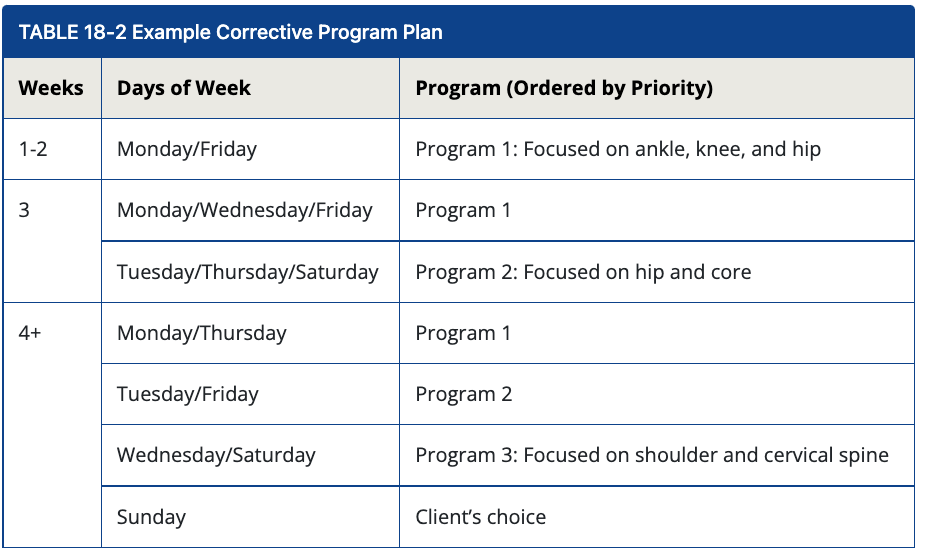

# Introduction

+ Framework
  + **System:** The four phases  (inhibit, lengthen, activate, integrate)
  + **Solutions and strategies:** 
    + Solutions: the high-level understanding of the client’s needs using the four phases , based on the probable overactive and underactive muscles associated with each movement impairment. 
      + example, if scapular winging is present, scapular control, activation of the serratus anterior, reduction in pectoralis minor overactivity, and integrated motion of the scapulae and upper extremities all become priorities to be addressed in a program.
    + strategy: translation of a solution into a goal-directed plan
  + Techniques: skills or specific methods used
    - **Inhibit:** Myofascial techniques such as foam rolling and local muscle vibration
    - **Lengthen:** Static, neuromuscular, or dynamic stretching
    - **Activate:** Isolated strengthening exercises
    - **Integrate:** Integrated dynamic movements
  + Tools:
    - **Inhibit:** Foam roller, roller ball, muscle vibration device, etc.
    - **Lengthen:** Stretch strap, elastic resistance band, stretching stick
    - **Activate:** Resistance cables, resistance machines, elastic resistance tubes/bands, dumbbells, kettlebells, stability balls, medicine balls
    - **Integrate:** Body weight, resistance machines, dumbbells, kettlebells, stability balls, medicine balls
  + **Tactics:** Tactics are the art or skill of employing available means to accomplish an end; how one supports and encourages the client to actually *perform* their scheduled program.

# Factors Influencing Program Design, Adherence, and Success

- Client-related factors

  - **Client Needs/Assessment Results**
    - In what areas does the client need to improve based on their current functional status and assessment results?
    - What functional and lifestyle needs exist that the program must take into consideration?
  - **Client Goals**
    - What specific goals and outcomes has the client expressed they want to accomplish and achieve through exercise and training that their program must support?
  - Client Expectations
    - What are the client’s or athlete’s expectations for their exercise or training program? Do they have preconceived thoughts, ideas, or beliefs about what they should be doing, such as the frequency and length of their program, based on what they want to achieve? Does corrective exercise align with their expectations?
  - **Client Capabilities**
    - Does the client have any physical or functional limitations that could affect their ability to successfully perform certain exercises or techniques in their program?

- Training-related factors

  - **Program or Training Goals**
    - What are the objectives of the corrective exercise program?
      - Post-rehab/reconditioning/return-to-performance?
      - Health and wellness optimization?
      - Workout preparation/targeted warm-up?
      - Injury risk reduction/durability?
      - Performance readiness?
      - Recovery and regeneration?
    - What are the objectives of the overall training program?
      - What neuromuscular and physiological adaptations are necessary to achieve the target objective(s)?
      - What specific competencies and qualities must be improved for adaptation to occur?
      - How will the corrective exercise program support and enhance this?
    - **Training Schedule**
      - How much time can the client commit to performing their program?
      - When will the client be doing their corrective exercise program?
        - What time of day?
        - Before exercise/training, after, or both?
      - Will the program ever be done stand-alone?
    - **Frequency**
      -  How many days per week is the client willing and/or able to do their program?How many days per week is recommended to achieve the program objective?If there is lack of alignment between what the client is willing and/or able to do and what is recommended, how can that be rectified? What tactics can be employed, compromise can be reached, or creative solution found?

- Environment-related factors

  - **Location/Setting**
    - Where will the client or athlete(s) be performing their program primarily?
      - Gym or training facility
      - Work/office
      - Home
      - Athletic field or court
      - Hotel
    - Will the program be performed with multiple clients/athletes at the same time?
      - Small group
      - Group exercise
      - Athletic team
  - **Equipment**
    - Based on location/setting, what equipment is accessible?
      - If the client will be doing their program in multiple settings with varied levels of equipment access, alternative program options may be necessary.
      - Contingency plans, including substitute exercises, may be necessary if desired equipment is unavailable at time of need.
  - **Provider Involvement**
    - Self-care/self-led programs
      - Self-care/self-led programs are those the client or athlete performs independently without direct supervision or coaching once they have been instructed or provided a plan of what to do.
      - Typically, self-care/self-led programs consist of techniques and exercises that are limited in complexity and easy for the client to perform to minimize any barriers or obstacles to completion.
    - Provider-directed programs
      - Provider-directed programs are those performed under the supervision and guidance of the health and fitness professional.
      - As with self-care/self-led programs, provider-directed programs may consist of techniques and exercises that are lower in complexity and easy for the client to perform; however, because there is an opportunity for coaching and direction, provider-directed programs may progress in complexity and difficulty to promote overload, adaptation, and adherence.
    - Provider-delivered programs
      - Provider-delivered programs are those directly administered by the health and fitness professional and consist of techniques and exercises that require direct application by the provider.
      - For providers qualified to do so, examples include, but are not limited to, local muscle vibration or percussion techniques and assisted stretching techniques.
      - For providers qualified to perform manual techniques, other techniques may include hands-on myofascial, joint mobilization, and muscle activation techniques.

  # Corrective Exercise for Any Goal

  + Muscular development

    + “Creating and supporting the right movement patterns helps your spine, joints, and muscles become more efficient at handling load. The more load you can handle safely, the more work you can accomplish and muscle development you can experience. Corrective exercise also creates fewer movement compensations, which helps you target the right muscles at the right time. You also won’t be ‘wasting energy’ because of inefficient movement, so recovery is more focused on helping you become stronger and more muscular over time.”

    + Focus on decreasing impairment in joints that will be working hard (e.g., shoulder joint mobility on chest day) and activating muscles that will contribute to the lifts executed.

      **Example corrective strategy for chest day:**

      - **Inhibit and lengthen:** Pectoralis minor, upper trapezius
      - **Activate:** Prone cobra
      - **Integrate:** Perform warm-up sets on the bench press

  + Weight loss

    + “Workouts should support your efforts to be stronger and healthier and give your body a reason to adapt to exercise. A proper warm-up is essential to getting more work done and fully benefitting from your workouts. I have individualized your flexibility and preparation routines to make sure your body is moving the best it can, so it gets the most from your workouts.”

    + maximize adherence. 

      **Example corrective strategy before a full-body resistance training session:**

      - **Inhibit:** Myofascial technique of choice for gastrocnemius/soleus, hip flexor complex, latissimus dorsi
      - **Lengthen:** Static stretch gastrocnemius, hip flexor complex, latissimus dorsi
      - **Activate:** Floor bridge, prone cobra
      - **Integrate:** Step-up to overhead press

  + Health and wellness and/ or movement longevity and independence

    + “Your workouts will focus on improving strength and cardiorespiratory health. Part of maximizing the health of your joints and muscles is maintaining the quality of your movement. The flexibility and strengthening routines that you will perform prior to and in between your workouts are a form of regular joint and muscle tissue maintenance, just like daily brushing and flossing maintain the health of your teeth.”

    + prioritize ease of completion and convenience.

      **Example corrective strategy before a cardio session:**

      - **Inhibit and lengthen:** Gastrocnemius/soleus, hip flexor complex, thoracic spine, upper trapezius
      - **Activate:** Floor bridge, quadruped arm/ opposite-leg raise
      - **Integrate:** Step-up to overhead press

  + Athletic performance

    + “Moving with higher quality and efficiency positively affects performance on the field or court while minimizing risk of injury. Based on the assessments we did, which show us how your body prefers to move, we will create targeted flexibility and strengthening strategies to optimize your movement and body control.”

    + Movement preparation for strength and conditioning, practice, and competition must include sequences that optimize flexibility, neuromuscular efficiency, movement quality, and performance specific to the upcoming activity.

      **Performance-related best practices:**

      - **Inhibit and lengthen:** Myofascial and stretching techniques of choice, focusing on individual areas that contribute to the athlete’s movement impairments, muscles affecting the foot/ankle, lumbo-pelvic-hip complex, and shoulder generally require attention.
      - **Activate:** Focus on muscle groups requiring intramuscular coordination specific to the athlete’s assessment results and sport (e.g., gluteus medius activation in jumping athletes).
      - **Integrate:** Use movements that are task and demand specific to the upcoming activity (e.g., hip swings, cutting maneuvers).

# Prioritizing Corrective Exercise Programming

+ Prioritizing a region:
  + a particular region may present most compensations and impairments
  + the region with the compensation that “sticks out” the most
  + based on the functional and lifestyle needs of the client..
+ as a customized movement preparation or “warm-up” sequence based on the functional requirements and performance demands of a particular workout, training session, or activity. 
  + vertical pushing (pressing)/pulling exercises and hinge-dominant exercises 
    + **Inhibit (tool of choice):** Tensor fascia latae (TFL), quadriceps, thoracic spine, latissimus dorsi
    + **Lengthen (static stretch):** Hip flexor complex, pectoralis minor, latissimus dorsi
    + **Activate:** Ball bridge, quadruped opposite arm/leg raise
    + **Integrate:** Single-leg Romanian deadlift (RDL) to proprioceptive neuromuscular facilitation (PNF), warm-up sets on first exercise
  + horizontal pushing/pulling-focused upper body and knee-dominant lower body workout 
    + **Inhibit (tool of choice):** Gastrocnemius/soleus, adductor complex, pectoralis minor, thoracic spine
    + **Lengthen (static stretch):** Gastrocnemius/soleus, adductor magnus, pectoralis major and minor
    + **Activate:** Floor bridge, side plank, prone cobra
    + **Integrate:** Squat to row, warm-up sets on first exercise

## Progressing Corrective Exercise to Improve Adherence

Research on the topic suggests a 3-month injury prevention program that included flexibility and strengthening exercises based on individual movement quality assessment performed 3 to 4 days per week did not produce lasting improvements in movement quality. Instead, a 9-month application of the identical program produced lasting improvements. importance of *regular* and *consistent* application

| **Variables**                | **Progression Options**                          |
| ---------------------------- | ------------------------------------------------ |
| Muscle action spectrum       | Eccentric, isometric, concentric                 |
| Plane of motion              | Sagittal, frontal, transverse                    |
| Proprioceptive demand        | Stable to less stable surface                    |
| Contraction speed spectrum   | Tempo selection: Slow, medium, fast, explosive   |
| Complexity                   | Movement demands progress from simple to complex |
| Frequency, sets, repetitions | Low to high volume                               |

## Corrective Exercise as the Entire Workout

 30 to 60 minutes

- **Post-rehabilitation/return to play or performance:** A client has completed treatment and has been cleared by their healthcare provider to return to exercise, using corrective programming to recondition and bridge the gap from rehab to fitness and/or performance.
- **Deconditioned clients:** Movement patterns and work capacity must be established before any higher demands can be placed on the kinetic chain to minimize the risk of overuse or acute musculoskeletal injury.
- **Separate recovery/deload/restorative workouts:** Many clients can benefit from occasional (or regularly scheduled) corrective exercise workouts as a form of active recovery placed within their mesocycle or microcycle planning to address subjective muscle soreness and maintain kinetic chain health and performance in the midst of high-intensity, high-demand training and/or competition.

## Corrective Exercise in Group Settings

**Assume common dysfunctions.** **Prepare participants for the specific demands of the class routine or session.** .**Perform individual movement assessments and assign homework.** 

**Successful Injury Rate Reduction in Athletic Populations**

- Multicomponent preventive training programs that include feedback regarding technique and at least three of the following exercise categories—strength, plyometrics, agility, balance, and flexibility—are recommended to reduce noncontact and indirect-contact ACL injuries during physical activity and should be performed at least two to three times per week throughout the preseason and in-season.
- Multicomponent training programs are advocated to improve lower extremity biomechanics, muscle activation, balance, strength, power, and functional performance measures as well as decrease landing impact forces.
- Exercises should be performed at progressive intensity levels that are challenging and allow for excellent movement quality and technique.
- To maintain the benefits of reduced injury rates and improved neuromuscular function and performance over time, multicomponent training programs (preseason, in-season, and off-season) should be performed each year and not discontinued after a single season.
- Multicomponent training programs are effective when implemented as a dynamic warm-up or as part of a comprehensive strength and conditioning program and should be regularly supervised by individuals who are skilled in identifying faulty movement patterns to ensure excellent movement quality and provide feedback on exercise technique.

- To facilitate the adoption and adherence of multicomponent training programs, education of athletes, coaches, parents, and administrators on the value of such programs is paramount. Things to highlight include the prevalence of lower extremity injuries in sports; costs (physically, psychologically, and financially) associated with ACL injury; that these programs not only are effective in reducing injury but also can improve physical performance and can be seamlessly incorporated into preseason, in-season, and off-season training practices without taking time away from skill development; and if time constraints are a concern, some evidence indicates that multicomponent training programs can be performed in 10 to 15 minutes as part of a dynamic warm-up before the start of practices and games.
- All individuals involved in sports and physical activity are advised to participate in a multicomponent training program focusing on injury resistance and movement quality; however, those who are active in particular sports or display certain traits should be targeted for preventive training because they either are at a relatively higher risk of ACL injury or have a greater potential for benefit. For example, athletes and children participating in higher risk sports that involve landing, jumping, and cutting tasks (e.g., basketball, soccer, football, team handball, etc.), especially women, should be targeted for injury risk reduction training. And, because a history of ACL injury is one of the strongest predictors of future ACL injury, individuals with such a history, especially younger individuals who return to sport-related activities, should be targeted for injury risk reduction training.

**Integrating Dynamic Stretching into Corrective Exercise for Athletes**

 Static stretching followed by dynamic stretching has been shown to improve flexibility without impairing performance (Wong et al., 2011). 

- Self-myofascial rolling (SMR): Gastrocnemius/soleus, hip flexors
- Static stretching: Gastrocnemius, kneeling hip flexor
- Isolated strengthening: Heel walking (tibialis anterior), floor bridge (gluteus maximus)
- Integration: Goblet squat, lunge to rotation (dynamic), leg swings (dynamic), A-skips (dynamic)

Keep in mind that the four phases of the program should be specific to the movement impairment demonstrated by the athlete, whereas the dynamic flexibility exercises chosen may be specific to the demands of competition or practice.

## Corrective Exercise with Time or Schedule Constraints

A common barrier to performing corrective exercise may be a perceived lack of time. 15- to 20-minute  “mini programs” 

TABLE 18-4 Example 5-Minute Corrective Strategies

| **Strategy 1**                                               | **Strategy 2**                                               | **Strategy 3**                                               |
| ------------------------------------------------------------ | ------------------------------------------------------------ | ------------------------------------------------------------ |
| Inhibit (tool of choice):Gastrocnemius/soleus 1 × 30 seconds | Inhibit (tool of choice):Adductors complex 1 × 30 seconds    | Inhibit (tool of choice):Thoracic spine 1 × 30 seconds       |
| Lengthen (static stretch):Soleus 1 × 30 seconds              | Lengthen (static stretch):Adductor magnus 1 × 30 seconds     | Lengthen (static stretch):Child’s pose using desk 1 × 30 seconds |
| Activate (isolated strength):Heel walking (anterior tibialis) 1 × 20 | Activate (isolated strength):Wall slides (gluteus medius) 1 × 20 | Activate (isolated strength):Standing cobra 1 × 20           |
| Integrate (total-body pattern)Multiplanar single-leg balance reach 1 × 10 | Integrate (total-body pattern):Side lunge to balance 1 × 10  | Integrate (total-body pattern):Squat to scaption 1 × 10      |

Without equipment:

+ Hip and shoulder region combination
  + Static stretch: Standing hip flexor with overhead reach 1 × 30 seconds
  + Hip swings 1 × 10 per leg
  + Single-leg balance with multiplanar arm reach 1 × 10 per leg
  + Multiplanar lunge with arm reach 1 × 10 per leg
  + Single-leg windmill 1 × 10 per leg
+ Lower body alignment and control
  + Static stretch: Gastrocnemius 1 × 30 seconds
  + Static stretch: TFL 1 × 30 seconds
  + Activate: Heel walking (i.e., walk while dorsiflexed) 1 × 20
  + Activate: Calf raise with toes in (medial gastrocnemius) 1 × 10
  + Multiplanar lunge to balance 1 × 10 per leg
  + Activate: Side-lying leg raise or wall slides 1 × 10 per leg
+ LPHC alignment and control
  + Static stretch: Kneeling hip flexor 1 × 30 seconds
  + Static stretch: Adductors 1 × 30 seconds
  + Dynamic stretch: Hamstring 1 × 30 seconds
  + Activate: Quadruped opposite arm/leg raise 1 × 20
  + Single-leg RDL to shoulder scaption/retraction/cobra 1 × 5 per leg
+ Upper body alignment and control
  + Static stretch: Levator scapulae 1 × 30 seconds
  + Static stretch: Scalenes 1 × 30 seconds
  + Static stretch: Pectorals 1 × 30 seconds
  + Single-leg standing cobra × 10 per leg
  + Single-leg squat to scaption × 10 repetitions per leg
+ Head and neck alignment and control
  + Static stretch: Levator scapulae 1 × 30 seconds
  + Static stretch: Scalenes 1 × 30 seconds
  + Static stretch: Sternocleidomastoid 1 × 30 seconds
  + Chin tucks against wall or chair headrest 1 × 20
  + Standing scaption/retraction/cobra 1 × 10