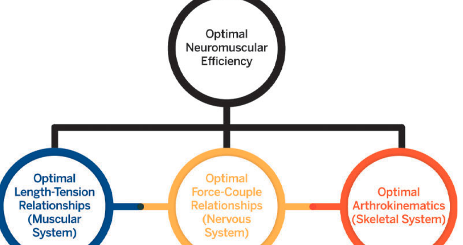
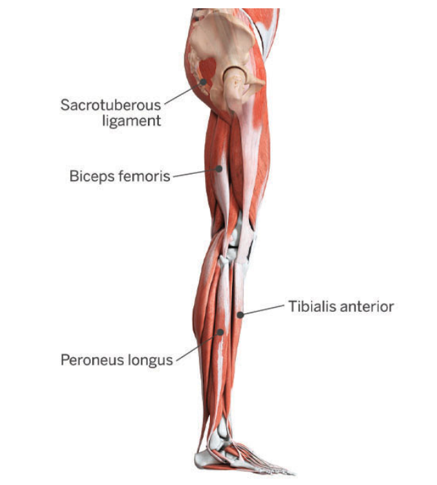
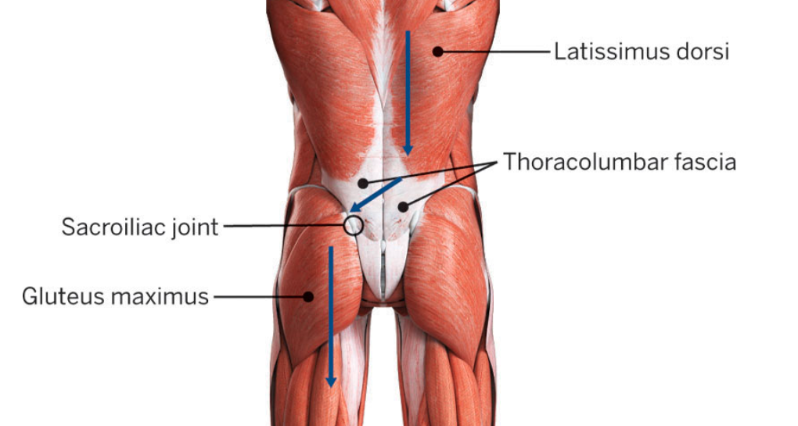
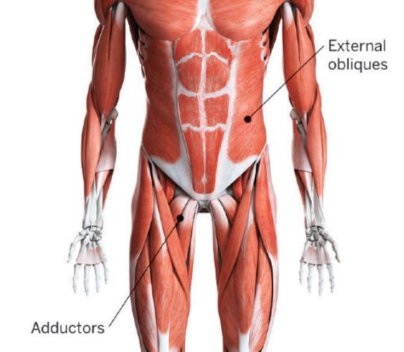
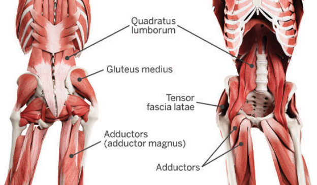
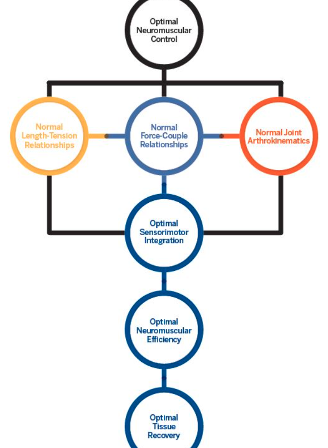
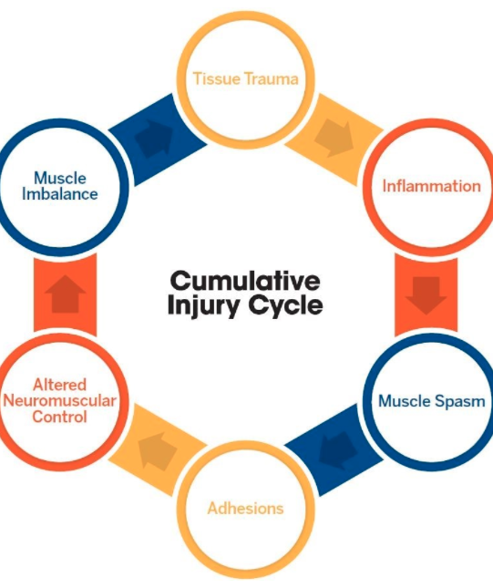
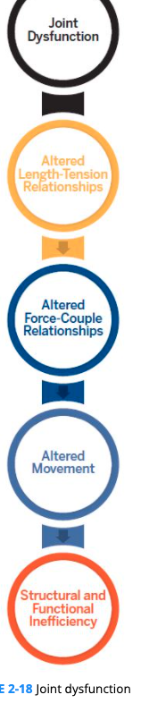

# Human Movement Science

## Introduction

+ Human movement system (HMS): muscular system, the skeletal system, and the nervous system
+ Movement patterns: Common combinations of joint motions the human body uses to move in all three planes of motion.

## Functional Anatomy

+ Roles of muscle: 
  + agonist, 
  + antagonist (reciprocal inhibition), psoas and the rectus femoris (hip flexors) are antagonistic to the gluteus maximus.
  + synergist, the triceps brachii are synergistic to the pectoralis major for pressing movements, whereas the hamstrings assist the gluteus maximus during hip extension.
  + stabilizer: muscles of the rotator cuff support the glenohumeral joint, whereas muscles such as the deltoids and latissimus dorsi create movement at the shoulder.
+ muscle action spectrum (eccentric, concentric, and isometric)

### Skeletal Muscle

+ Terminologies
  +  origins (i.e., the beginning attachment point of the muscle)
  + insertions (i.e., where it connects back to the skeleton), 
  + isolated (concentric) and integrated (eccentric and isometric) functions
  + innervations: A muscle’s point of connection to the nervous system.

## Motor Behavior

+ Motor behavior
  The human movement system’s response to internal and external environmental stimuli.

+ Sensory information

  The data that the central nervous system receives from sensory receptors to determine such things as the body’s position in space and limb orientation as well as information about the environment, temperature, texture, etc.

### Motor control

The study of posture and movements with the involved structures and mechanisms used by the central nervous system to assimilate and integrate sensory information with previous experiences.

+ Sensations

  A process by which sensory information is received by the receptor and transferred either to the spinal cord for reflexive motor behavior, to higher cortical areas for processing, or both.

+ Perceptions

  The integration of sensory information with past experiences or memories.

+ Afferent

  Sensory neurons that carry signals from sensory stimuli toward the central nervous system.

+ Efferent

  Motor neurons that carry signals from the central nervous system toward muscles to create movement.

+ Proprioception

  The cumulative neural input from sensory afferents to the central nervous system.  allows for the perception and awareness of the body’s relative position in space. uses mechanoreceptors (from cutaneous, fascia, muscle, tendon, and joint receptors) to provide information about static and dynamic positions, movements, and sensations related to muscle force and movement

+ Neuromuscular efficiency

  The ability of the neuromuscular system to allow agonists, antagonists, synergists, and stabilizers to work synergistically to produce, reduce, and dynamically stabilize the human movement system in all three planes of motion.

+ joint injury will likely also damage proprioceptive components, there is a need for core and balance training to enhance proprioceptive capabilities and increase postural control.

+ 80% of our population that experiences low back pain (LBP)

+ Sensorimotor integration

  The ability of the central nervous system to gather and interpret sensory information to execute the proper motor response.

+ Movement compensation

  When the body moves in a suboptimal way in response to kinetic chain dysfunction.

+ CNS recruits muscles in groups, or synergies. Through practice of proper movement patterns and technique, muscle synergies become more fluent and automated. This practicing of proper movement patterns and techniques is the focus of the fourth phase in the Corrective Exercise Continuum, integration.

### Motor learning

The utilization of these processes through practice and experience leading to a relatively permanent change in a person’s capacity to produce skilled movements.

+ Feedback

  The utilization of sensory information and sensorimotor integration to aid in the development of permanent neural representations of motor patterns for efficient movement.

+ Internal (sensory) feedback

  The process by which sensory information is used by the body via length-tension relationships, force-couple relationships, and arthrokinematics to monitor movement and the environment.

+ External (augmented) feedback

  Information provided by some external source, for example, a health and fitness professional, video, mirror, or heart rate monitor.

  + Knowledge of results

    Used after the completion of a movement to inform individuals about the outcome of their performance. increase their own awareness and augment their impressions with multiple forms of feedback.

  + Knowledge of performance

    Provides information about the quality of the movement.

### Motor development

The change in motor behavior over time throughout a person’s life span.

## Neuromuscular system integration

### Muscular Force

+ Sarcomere

  The functional unit of a muscle made up of overlapping actin and myosin filaments.

+ Cross-bridge mechanism
  The collective physiological processes that cause actin and myosin filaments to slide across each other, functionally shortening the muscle as it develops tension.

+ Length-tension relationship
  The resting length of a muscle and the tension the muscle can produce at this resting length.

+ Resting length
  A muscle’s state when the body is standing still; not contracting or stretching.

+ Neural drive
  The rate and volume of activation signals a muscle receives from the central nervous system.

+ Overactive/shortened
  Occurs when elevated neural drive causes a muscle to be held in a chronic state of contraction.

+ Underactive/lengthened
  Occurs when inhibited neural drive allows a muscle’s functional antagonist to pull it into a chronically elongated state.

+ Muscle imbalance

  Alteration of muscle length surrounding a joint.

+ Kinetic chain

  The combination and interrelation of the nervous, muscular, and skeletal systems.

### Force-couple relationship

The synergistic action of muscles to produce movement around a joint.

+ Examples
  + hip flexors (e.g., rectus femoris and psoas) and the hip extensors (e.g., gluteus maximus). When each muscle on each side of the hip has an optimal length-tension relationship (not too long or too short), the lumbo-pelvic-hip complex (LPHC) is maintained in the ideal neutral position. 

### The Regional Interdependence Model

+ Posture

  The independent and interdependent alignment (static posture) and function (transitional and dynamic posture) of all components of the human movement system at any given moment, controlled by the central nervous system.

+ Structural efficiency

  The alignment of each segment of the human movement system, which allows posture to be balanced in relation to a person’s center of gravity.

+ Functional efficiency
  The ability of the neuromuscular system to recruit correct muscle synergies, at the right time, with the appropriate amount of force to perform functional tasks with the least amount of energy and stress on the human movement system (HMS).

+ Examples

  + ankle lacks dorsiflexion and the individual leans excessively forward into hip flexion during a squat as a compensation.
  +  foot and ankle excessively pronate and turn out during movement. When the foot turns out, the knee usually compensates by collapsing into the valgus position, thereby straining the medial knee (and ankle) ligaments, compressing lateral knee joint structures, and causing dynamic malalignment of the patella. This may result in knee joint discomfort, excessive movement, weakness, and lack of stability in the muscles surrounding the knee. The hips then compensate for the altered ankle and knee mobility, which may result in an excessive anterior pelvic tilt and resultant low back tightness

## Muscular System

### Local musculature system

Muscles that connect directly to the spine and are predominantly involved in LPHC stabilization.most suitable for endurance, balance, and slow movement training with parameters of long duration, light resistance, low load, and slow velocity. are evident in the peripheral joints as well.

+ transversus abdominis, multifidus, internal oblique, psoas, diaphragm, and the muscles of the pelvic floor
+ drawing-in maneuver that is used during virtually every resistance training exercise to protect and stabilize the spine.
+ Joint support systems consist of muscles that are not movement specific; rather, they provide stability to allow movement of a joint. 
  + rotator cuff, which provides dynamic stabilization for the humeral head in relation to the glenoid fossa.
  + posterior fibers of the gluteus medius and the external rotators of the hip, which provide pelvo-femoral stabilization
  + oblique fibers of the vastus medialis, which provide patellar stabilization at the knee

### Global muscular system

Muscles responsible predominantly for movement and consisting of more superficial musculature that originates from the pelvis to the rib cage, the lower extremities, or both. fast-twitch, muscle fibers.

+ rectus abdominis, external obliques, erector spinae, hamstring complex, gluteus maximus, latissimus dorsi, adductors, quadriceps, and gastrocnemius.

#### subsystems:

##### deep longitudinal, 

+  stabilizing the sacroiliac joint (SIJ)
+ longitudinal means of reciprocal force transmission from the trunk to the ground
+ erector spinae, thoracolumbar fascia, sacrotuberous ligament, biceps femoris, tibialis anterior, and fibularis (peroneus) longus.
+ 
+ the long head of the biceps femoris attaches, in part, to the sacrotuberous ligament at the ischium. The sacrotuberous ligament, in turn, attaches from the ischium to the sacrum. The erector spinae attach from the sacrum and ilium up the ribs to the cervical spine. Thus, activation of the biceps femoris increases tension in the sacrotuberous ligament, which, in turn, transmits force across the sacrum, stabilizing the sacroiliac joint (SIJ), and then up the trunk through the erector spinae.
+ normal gait. Before heel strike, the biceps femoris activates to eccentrically decelerate hip flexion and knee extension. Simultaneously, the anterior tibialis activates to concentrically dorsiflex and invert the ankle and foot. Just after heel strike, the anterior tibialis eccentrically decelerates to lower the foot as the biceps femoris is further loaded through the lower leg via posterior movement of the fibula.
+ One example of a basic exercise to activate the DLS unilaterally is starting from the quadruped position and then first positioning the head to neutral while also extending the hip and knee of one leg, then lifting the straight leg against gravity toward the ceiling, and then lowering. This exercise would provide concentric and eccentric exercise of the DLS.
+ training DLS activation for gait would be in standing and performing a repetitive gait phase interval pattern of midstance to swing phase and heel strike and then retract to repeat with or without resistance bands for concentric and eccentric training.

##### posterior oblique, 

+ Just before heel strike, the latissimus dorsi and the contralateral gluteus maximus are eccentrically loaded, which adds pretension to the entire subsystem before weight bearing. At heel strike, each muscle accelerates its respective limb (through its concentric action) and creates tension across the thoracolumbar fascia. This tension also assists in stabilizing the SIJ. Thus, when an individual walks or runs, the POS transfers forces that are summated from the muscle’s transverse plane orientation to propulsion in the sagittal plane.
+ prime importance for rotational activities such as swinging a golf club or a baseball bat or throwing a ball
+ Dysfunction of any structure in the POS can lead to SIJ instability and LBP.
  +  The weakening of the gluteus maximus, the latissimus dorsi, or both, can lead to increased tension in the hamstring complex—a factor in recurrent hamstring strains. 
  + If performed in isolation, squats for the gluteus maximus and pulldowns/pull-ups for the latissimus dorsi will not adequately prepare the POS to perform optimally during functional activities. In contrast, prone flat or quadruped contralateral arm and leg lift exercises will activate the POS. Another example in standing is to perform simultaneous combination movements of shoulder internal rotation–adduction–extension with contralateral hip external rotation–extension with or without resistance bands

##### anterior oblique,

+ internal and external oblique muscles, the adductor complex, and the hip external rotators.
+ aid in pelvic stability and rotation as well as contributing to leg swing. The AOS is also a factor in the stabilization of the SIJ.
+ Examples
  + supine oblique core activation while reaching a hand to touch the flexed knee of a contralateral flexed and adducted hip
  + standing to perform a cross-body kicking motion using the contralateral arm to counter the motion with or without resistance bands

##### lateral subsystems.

+ gluteus medius, tensor fascia latae, adductor complex, and the quadratus lumborum
+ frontal plane and pelvo-femoral stability
+ foot with excessive pronation will result in decreased stability and control of the LPHC.
+ Example
  + side stepping in a knee extended or flexed position progressed with a resistance band placed just above knee joint (easier) or ankle joint (more challenging). faulty movement patterns, including excessive foot pronation, tibio-femoral internal rotation and adduction, or a laterally tilted pelvis.

## Scientific Rationale for Corrective Exercise

### Movement impairement

+ Cumulative injury cycle
  A cycle whereby an injury will induce inflammation, muscle spasm, adhesion, altered neuromuscular control, and muscle imbalances.

+ Movement impairment
  State in which the structural integrity of the human movement system is compromised because one or more segments of the kinetic chain are out of alignment.

###### 

+ Static malalignments
  Deviations from ideal posture that can be seen when standing still.
+ attern overload
  Occurs when a segment of the body is repeatedly moved or chronically held in the same way, leading to a state of muscle overactivity.
+ Altered reciprocal inhibition
  Process whereby an overactive/shortened muscle causes decreased neural drive, and therefore less-than-optimal recruitment of its functional antagonist.
+ Synergistic dominance
  The process by which a synergist compensates for an inhibited prime mover to maintain force production.
+ Dynamic malalignments
  Deviations from optimal posture during functional movements.
+ Relative flexibility
  The body’s ability to find the path of least resistance to accomplish a task, even if that path creates dynamic malalignments.
+ Kinetic chain checkpoints
  Key points on the body to observe and assess an individual’s static and dynamic posture; feet/ankles, knees, LPHC, shoulders, and head/neck.