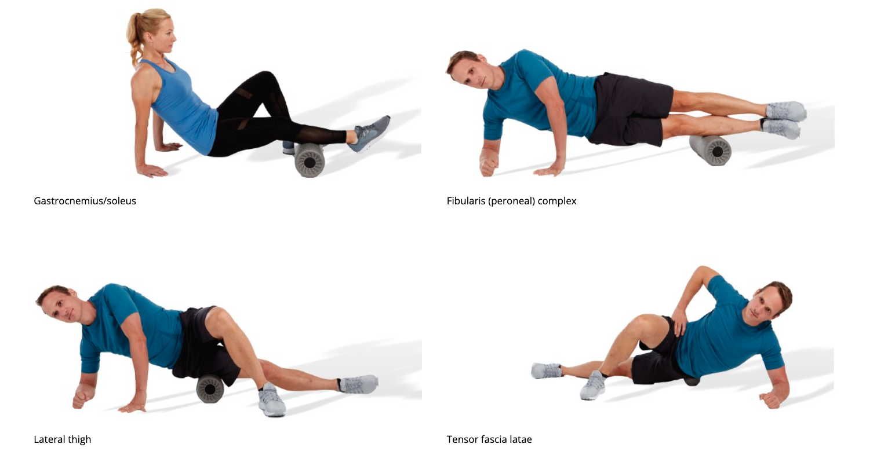
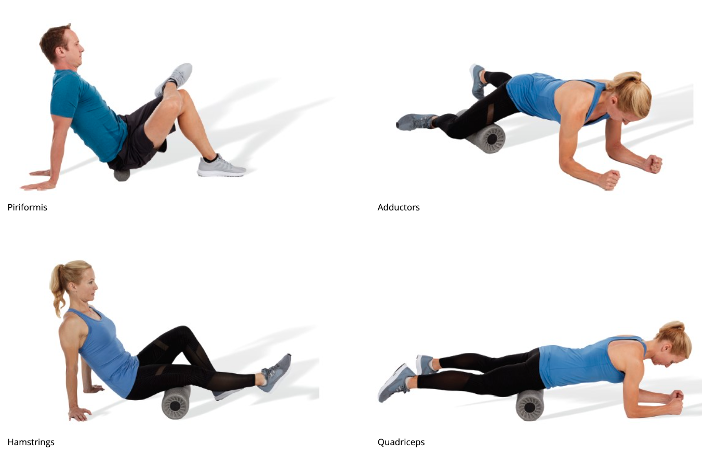
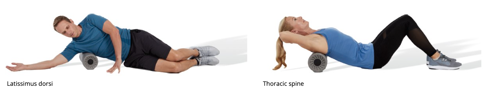

# Inhibitory Techniques

## Myofascial Rolling

+ Self-myofascial techniques
  The category of flexibility techniques used to reduce tension in muscle fibers. Primarily used for overactive tissue.
+ Myofascial adhesions
  Knots in muscle tissue that can result in altered neuromuscular control.
+ Inelastic
  Possessing the inability to stretch.
+ Davis’s law
  Law that states that soft tissue will model along the lines of stress.
+ Myofascial rolling
  A compression intervention where an external object (e.g., foam roller) compresses the myofascia. Myofascial rolling techniques may help in modulating the local receptor activity, tension (microspasm), and CNS activity that develop from the traumatized tissue
+ local mechanical effects, 
  + thixotropy (reduced viscosity), reducing myofascial restriction,  and stimulating cellular responses
  + fascial hydration
  + reduced arterial stiffness
  + circulary improvement
+ neurophysiological effects, 
  +  tissue relaxation: the roller pressure may induce a greater myofascial relaxation, or “stretch tolerance,” through CNS afferent input from the Golgi tendon reflex, gamma loop modulation, and mechanoreceptors
    + Gamma loop
      The reflex arc consisting of small anterior horn nerve cells and their small fibers that project to the intrafusal bundle and produce its contraction, which initiates the afferent impulses that pass through the posterior root to the anterior horn cells, inducing, in turn, reflex contraction of the entire muscle.
  + Pain modulation
    + Cutaneous receptor, mechanoreceptor, pain receptor
    + reduction in evoked pain sensations and spinal-level CNS excitability

## Guidelines

+ Pressure
  + Harder, smaller, more force applied -> more pressure
  + the subjects using the small, hard myofascial roller did not improve flexibility more than the subjects using the larger, softer myofascial roller
  + ideal amount of pressure is dependent on the user’s experience, pain threshold, and perception
  + constant pressure roller apparatus (CPRA). The use of the CPRA allowed researchers to attach 28.6 lb (13 kg) of weight plates
  + most practical methods for applying pressure are the use of body weight (rollers, balls) and upper body strength (handheld rollers).
  + soft to moderate rollers may achieve better overall results. They found that high-density myofascial rollers may in fact increase the perception of pain with only minimal increases in joint mobility
  +  goal should never be to cause or induce a significant amount of pain or discomfort
+ Texture
  + textured roller produced greater results, but Cheatham and Stull (2019) suggest that the textures may distort or “move” the tissues more than a smooth roller, which may stimulate the local receptors and CNS differently.
+ monitor the user for normal relaxed breathing patterns and communicate with the user by asking whether the amount of pressure is comfortable or not

## Tools

+ Roller
  + commonly from approximately 12 inches to up to 36 inches (30 to 90 cm)
+ Myofascial balls
  + more pressure
+ Handheld rollers
  + Because handheld rollers are guided by the user, size and density are less of a concern because the pressure may be easily changed by in­creasing or decreasing the amount of force. 
  + Handheld rollers are a suitable option for users who are unable to get on the ground to use a traditional roller. 
  + Further, handheld rollers appear to be as effective as a traditional roller on hamstrings flexibility
  + limited to the lower extremities, body positioning, and upper body strength
  + if the user can get on the ground, it is recommended to use a cylindrical myofascial roller over a handheld one.
  + more convenient for travel than a typical foam roller.
  + fitness professionals not use a handheld roller to apply pressure to their clients. The client should always be the one in control of the pressure
+ Vibration roller
  + vibration group experienced greater improvements in flexibility and mobility
  + setting a multispeed vibration roller to a lower setting does not appear to produce a different result than a higher frequency. 
  + vibration likely mitigates pain through an effect called vibratory analgesia, occurs when the vibration stimulates certain mechanoreceptors that temporarily interfere with the sensation of pain.
+ Cupping
  + promote movement of blood and other fluids through the tissues
  + active approach to cupping has been termed myofascial decompression. Decompression occurs by using the suction to “lift” the superficial tissue.
+ Myofascial flossing
  + Method intended to increase flexibility by wrapping an elastic band around a region of the body and performing movements.
  + help speed up recovery by reducing the negative effects of delayed onset muscle soreness (DOMS)
  + speeding up recovery from specific injuries, such as Achilles tendinopathy
+ Instrument-assisted soft tissue mobilization (IASTM)
  + Specifically designed instruments to provide a mobilizing effect to scar tissue and myofascial adhesions.
  + use of instruments is thought to provide healthcare profes­sionals with a mechanical advantage, allowing them to work myofascial tissue both deeper and differently than with their hands
  + removing scar tissue and promoting a return to normal function by inducing localized inflammation that restarts the healing process (Kim et al., 2017) and stimulates connective tis­sue remolding

### TABLE 3-1 Self-Myofascial Rolling Precautions

| Hypertension (controlled)                                    | Osteopenia                                   | Pregnancy                                     |
| ------------------------------------------------------------ | -------------------------------------------- | --------------------------------------------- |
| Diabetes                                                     | Varicose veins                               | Bony prominences or regions                   |
| Abnormal sensations (e.g., numbness)                         | Sensitivity to pressure                      | Recent injury or surgery                      |
| Inability to position the body or perform myofascial rolling correctly | Young children                               | Elderly                                       |
| Scoliosis or spinal deformity                                | Medications that may alter client sensations | Fibromyalgia (i.e., higher rolling pressures) |

### TABLE 3-2 Self-Myofascial Rolling Contraindications

| Skin rash, open wounds, blisters, local tissue inflammation, bruises, or tumors | Deep vein thrombosis                                         | Osteoporosis                                                 |
| ------------------------------------------------------------ | ------------------------------------------------------------ | ------------------------------------------------------------ |
| Bone fracture of myositis ossificans                         | Cancer or malignancy                                         | Hypertension (uncontrolled)                                  |
| Acute or severe cardiac, liver, or kidney disease            | Acute infection (viral or bacterial), fever, or contagious condition | Neurologic conditions resulting in loss or altered sensation |
| Bleeding disorders                                           | Systemic conditions (e.g., diabetes)                         | Recent surgery or injury                                     |
| Connective tissue disorders                                  | Peripheral vascular insufficiency or disease                 | Medications that thin the blood or alter sensations          |
| Direct pressure over surgical site or hardware               | Chronic pain conditions (e.g., rheumatoid arthritis)         | Direct pressure over face, eyes, arteries, veins (e.g., varicose veins), or nerves |
| Pregnancy (consult MD)                                       | Direct pressure over bony prominences or regions (e.g., lumbar vertebrae) | Extreme discomfort or pain felt by client                    |
| Severe scoliosis or spinal deformity                         | Osteomyelitis                                                | Osteoporosis                                                 |
|                                                              |                                                              |                                                              |

## Practical Application

+ Step 1: Reduce Overall Tension

  + breathe and relax for 30 to 60 seconds or until a reduction in discomfort is felt

+ Step 2: Introduce Tissue Movement

  + include active movements to investigate how each client responds
  + individuals who have increased sensitivity or who find the steps too complex may choose to simply roll the target muscle continuously for 90 to 120 seconds

+ Length

  + total of 5 to 10 minutes (rolling each muscle group for between 30 seconds and 2 minutes) at a pace of 2 to 5 seconds per roll

+ Frequency

  + rolling between two and five times per week may be enough to experience some positive results

+ Body position, Two common mistakes made while self-myofascial rolling are 

  + (1) allowing the lumbar spine to hyperextend (arched lower back) and the cervical spine to extend excessively (head falling forward) while rolling in a prone position and 
  + (2) elevating the shoulders (shoulder shrug) while in a seated position.

+ Summary

  + ■ Follow the two-step approach:

    - Hold pressure for 30 to 60 seconds.
    - Perform active movements to “free up” or mobilize myofascial tissues.

    ■ Spend between 90 seconds and 2 minutes (total) on each muscle group.
    ■ Perform myofascial rolling on most days of the week as part of a corrective exercise program.
    ■ Maintain a neutral spine and relaxed shoulders.
    ■ Modify, as necessary, to maintain a relaxed and safe position.
    ■ Roll slowly.

