## Introduction

+ Goal: improving available ROM at a joint, increasing tissue extensibility, decreasing muscle and tendon injury risk, and enhancing neuromuscular efficiency)

+ Flexibility vs stretching
  + Flexibility
    The present state or ability of a joint to move through a range of motion.
  + Stretching
    An active process to elongate muscles and connective tissues in order to increase the present state of flexibility.
+ Women more flexible then man
  +  differences in muscle mass, joint geometry, and the degree of collagen protein in the musculotendinous unit
  + more flexible during pregnancy due to release of hormones such as relaxin
  + the greater joint laxity of women and the greater potential for joint injuries.

### Types of stretching

+ Static stretching
  The process of passively taking a muscle to the point of tension and holding the stretch for a minimum of 30 seconds.
  + Static stretching combines low-to-moderate forces with long duration using a variety of neural, mechanical, and psycho-physiological mechanisms. This form of stretching, performed alone or with a partner, allows for relaxation and concomitant elongation of muscle. To properly perform static stretching, the stretch is held at the first point of tension or resistance barrier for a specific time period (e.g., 30 seconds). It is theorized that this form of flexibility decreases muscle spindle activity and motor neuron excitability (neural), muscle compliance and changes in fascicle angles and orientation (mechanical), and increased stretch tolerance (psycho-physiological).
+ Dynamic stretching
  The active extension of a muscle, using a muscle’s force production and the body’s momentum, to take a joint through the full available range of motion
  + Dynamic stretching uses a controlled movement through the full or nearly full joint ROM.
+ Neuromuscular stretching (NMS)
  A flexibility technique that incorporates varied combinations of isometric contraction and static stretching of the target muscle to create increases in range of motion. Also called proprioceptive neuromuscular facilitation (PNF).
  + Neuromuscular stretching (NMS; commonly called proprioceptive neuromuscular facilitation, or PNF) involves taking the muscle to its end-ROM (point of joint compensation), holding that position for 10 to 30 seconds, and then actively contracting the stretched muscle for 5 to 10 seconds. NMS often needs a partner but can be performed with stretch bands..
+ Active stretching
  + Active stretching uses multiple repetitions of a 2-second static stretch but emphasizes a contraction of the antagonist to induce reciprocal inhibition. This intervention is used to move
    muscles that tend to be overactive through available ranges of motion and to prepare them for work.
+ Ballistic stretching
  + Ballistic stretching is also dynamic, but it differs from dynamic stretching in that ballistic stretching incorporates higher-speed movements with bouncing actions at the end of the ROM. Due to the higher movement velocities and less control of the movement with ballistic stretching, it is riskier and carries a greater chance for injury, especially when a proper active warm-up is not incorporated beforehand. It is not considered a part of the corrective exercise strategy. It is used by competitive athletes in a warm-up in an attempt to activate the central nervous system and muscle.

### Static stretching

+ Characteristics
  + Elongation of muscle and myofascial tissue to an end-range and statically holding that position for a period of time
  + Maximal control of structural alignment
  + Minimal acceleration into and out of the elongated (stretch) position
  + lowest risk for injury during the stretching routine and deemed the safest to use because individuals can perform static stretching on their own with the slow, minimal-to-no motion required
  + commonly performed alone, so it can be easily incorporated into any integrated exercise program
+ Mechanical adaptations
  + affect the viscoelastic component of myofascial tissue
    + Viscoelastic
      The collective properties related to fluid flow, heat dissipation, and elasticity of tissue.
  + decrease in the passive resistance a muscle has to stretching, which allows greater tissue extensibility
  + causes an acute viscoelastic stress relaxation response, allowing for an immediate increase in ROM
+ Neurological adaptation 
  + decrease motor neuron excitability.
  + muscle spindle,
    + nuclear chain fibers preferentially respond to changes in muscle elongation,
    + nuclear bag fibers respond to both the extent and rate of elongation
    + when the static stretch is held for a prolonged period (e.g., 30 to 60 seconds), these reflexes are less active (disfacilitation), and thus the muscle can relax more
    + Even with less than a 10-second stretch, the nuclear bag fibers should decrease their discharge rate because there would be no change in the rate of the stretch.
  + Cutaneous (i.e., skin) nerve fibers, when activated by mechanical stress (e.g., tension, pressure, or vibration), can also contribute to an increase in ROM
    + help reduce muscle reflex activity (pre- and postsynaptic inhibition), but they only continue for a few seconds after stretching
    + provide a minor contribution during large-amplitude stretches
  + GTOs 
    + are activated by tension exerted on the muscle tendon (Chalmers, 2004; Houk et al., 1980), contributing to reflex inhibition (autogenic inhibition). 
    + However, it has been shown that GTOs are not highly sensitive to the tension associated with static stretching
    + more likely to occur with dynamic stretches that use large ranges of motion (Guissard & Duchateau, 2006) such as leg swings.
    + GTO inhibition stops around 60 to 100 milliseconds after stretching, so its effect would not persist after ending the stretch
    + GTOs are more active during active muscle contractions, their inhibition effect would contribute more during dynamic stretching than with a passive holding of a stretch.
  + Renshaw cells
    Interneurons that prevent excessive output of the central nervous system’s contraction reflex response to sudden changes in muscle length.
    + large-amplitude stretches (recurrent inhibition).
    + Recurrent inhibition plays a greater role with weak dynamic contractions
+ Psycho-physiological adaptations
  + stretch tolerance means the client or athlete can tolerate greater discomfort and then push themselves through a greater ROM
  + signal the release of endorphins and enkephalins (opioids made by the body) that will reduce pain and discomfort throughout the body
+ Chronic adaptations
  + muscle spindle discharge can be chronically reduced, leading to a more relaxed muscle
  + more compliant (i.e., less stiff) muscle that would cause less activation of the spindles.
  + decreases in muscle stiffness (increased compliance) are attributed to plastic (semi-permanent) changes in the muscle fiber angles, changes in the structure of tissue components (e.g., fewer collagen cross-linkages), and other factors.
  + Tissue creep
    An initial rapid increase in strain followed by a slower increase in strain at a constant stress.
    + muscles and tendons do not return to their original length after prolonged stretching because of physical changes in the proteins, such as collagen
  + stretch tolerance 

### Neuromuscular stretching

+ isometrically contracting a desired muscle in a lengthened position, reduced negative effect on muscular power than static stretching
+ 4 stages
  + Taking the target muscle to its end-range ROM (point of joint compensation) and holding for 10 seconds
  + Actively contracting the target muscle to be stretched (5- to 10-second submaximal intensity contraction)
  + Passively (or actively) elongating the target muscle to a new end-range
  + Statically holding the new position for 20 to 30 seconds and repeating the contract-relax cycle up to a total of three times
+ Variations
  + contract–relax method includes static stretching of the target muscle followed immediately by an isometric contraction of the stretched (target) muscle, followed with another stretch of the target muscle.
  + contract–relax–agonist–contract (CRAC) 
    + additional contraction of the agonist muscle (i.e., the muscle opposing the target muscle) immediately following the isometric contraction and prior to the additional stretching of the target muscle.
+ Advantage
  + more mechanical stress on the tendon than with passive static stretching
  + Because the muscle is already in an elongated position, the subsequent contraction will emphasize the elongation of the tendon (tissue creep), providing an additional mechanical factor (reduced tendon stiffness) not emphasized with static stretching and further helping to increase joint ROM
+ Mechanisms
  + activate the GTOs (autogenic inhibition) 
  + Autogenic inhibition
    The process by which neural impulses that sense tension are greater than the impulses that cause muscles to contract, providing an inhibitory effect to the muscle spindles.

### Dynamic Stretching

+ controlled movement through the entire ROM of the active joints (Fletcher, 2010): for example, single-leg squatting (Figure 4-5), multiplanar sequences (Figure 4-6), or moving the arms in circles (shoulder circumduction (Figure 4-7).
+ increase metabolic activity, elevating muscle temperature, improved muscle viscoelasticity
+  improve, or at least has no detrimental effects on, subsequent performance in comparison to the reports regarding prolonged static stretching or NMS performed in isolation without a full warm-up.
+ dynamic stretching excites the central nervous system. The higher rate and amount of muscle lengthening with dynamic stretching increases myotatic reflex activity, and thus counterbalances the inhibitory effects of static stretching on subsequent performance.
+ Inhibiting muscle activation of overactive tissues is a key component of the Corrective Exercise Continuum. **Thus, static stretching and/or NMS should be used prior to activity when muscle imbalances are present.**

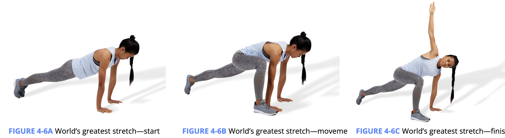

## Scientific Rationale for stretching

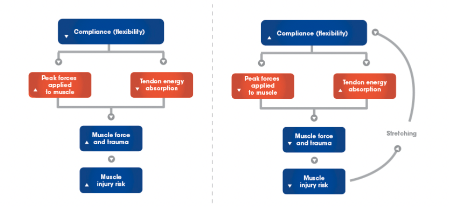

+ Although tissue compliance will not change the total or absolute force applied to muscles and tendons, it will influence how those forces are distributed over time. With a more compliant (i.e., more flexible) musculotendinous unit, muscles and tendons will absorb forces over a longer duration, reducing the peak forces applied to them

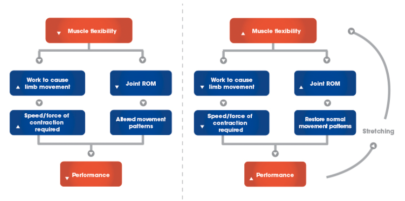

Traditional theory opposing static stretching pre-exercise

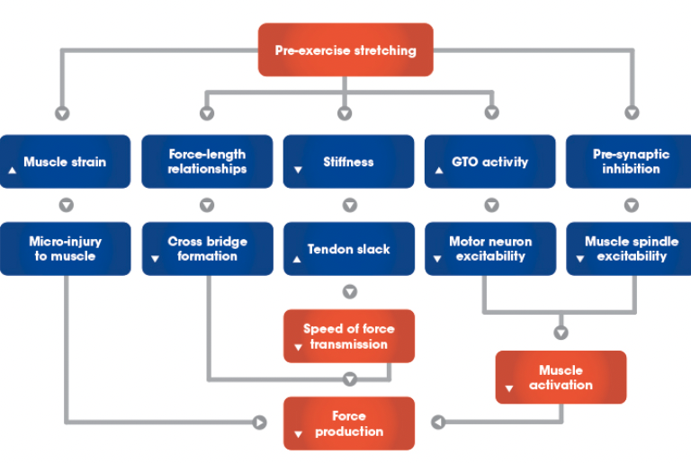

### Current Research supports pre-exercise stretching

#### Suggested warm-up components

+ Myofascial Rolling

  + 90 seconds to 2 minutes of myofascial rolling per muscle group to increase muscle temperatures, decrease tissue viscoelasticity, increase inhibition, and other factors.

+ Static Stretching

  + < 60 seconds per muscle group if participating in high-intensity exercise or athletic activity.

    No need to go to the point of discomfort or pain.

    Stretch major muscle groups and specific muscle groups to the activity. Focus on muscles identified as overactive/shortened during assessment stages.

+ Dynamic Stretching

  + ≤ 90 seconds per muscle group.

    Use full range of motion with a controlled movement at moderate speeds.

+ Task-Specific Activities

  + 5 to 15 minutes.

    Practice movements that are associated with the sport or task at velocities close to the actual movement. This may include exercises performed during the Activate and Integrate phases of the Corrective Exercise Continuum.

#### Psychological benefits of stretching

+ results in decreased feelings of sadness, and can decrease levels of stress-related hormones 
+ greater participant confidence regarding their performance in the ensuing sports-related tests. 

#### Improve ROM

+ it cannot be conclusively stated that one stretching technique is definitively better than the others for improving joint ROM.
+  degree of improvement may be relative to the total available ROM at the joint
+ each joint and muscle group may respond differently to stretching protocols
+  it is possible for overtraining to occur with excessive stretching frequencies, which may be reflected in the lack of increases in static ROM
+ Intensity: should approach their point of discomfort momentarily and then reduce that elongation by about 10%
  + elastic limit is the minimum amount of stress placed on tissue to elicit permanent strain. Going farther than the elastic limit could cause the tissue to not return to its original length (Alter, 2004), and thus contribute to strains (muscle) and sprains (ligaments).
  + Stretching an injured or fatigued muscle or tendon to the point of discomfort can lead to additional injury!
  + to the point of discomfort (high force) or not (low force): 
    + High-force, shorter-duration: emphasize elastic (short-term) tissue deformation. Low-force, longer-duration, plastic (long-term)
+ Duration: With the variation of research results from different lengthening technique protocols, it is important for the Corrective Exercise Specialist to find the right combination of techniques and training variables for each client that maximizes adherence and effectiveness. 
+ RI model
  + stretching tight ipsilateral quadriceps and hip flexor musculature would affect hip flexion ROM

#### Atheletic performance

+ acutely, prolonged static or NMS stretching may have a detrimental effect on muscular strength, power, balance, reaction and movement time, as well as vertical jump height and sprint speed
+ static stretching should be performed for less than 60 seconds per muscle prior to higher intensity athletic endeavors, whereas dynamic and ballistic stretching do not have the same effect 
+ comprehensive warm-up that includes static stretching followed by additional movements to activate the nervous system (such as in phases 3 and 4 of the Corrective Exercise Continuum) will prevent any negative effect on performance.
+ Problem with previous studies
  + lack of real-life application
  + primarily in individuals who do not have any functional ROM limitations
  + The few studies that involve a full warm-up do not report performance decrements and show that stretching may even provide some performance improvements

+ Stretching can enhance muscle and tendon compliance (less stiffness), which augments the stretch–shortening cycle (i.e., used in jumping, sprinting) by enhancing the ability to store elastic energy
  + This enhancement is more apparent with longer-duration eccentric (muscle lengthening) to concentric (muscle shortening) contractions, such as a rebound chest press (Wilson et al., 1992), but it might not have such a benefit on brief duration stretch–shortening cycle activities like sprinting.
+ greater force production at longer muscle lengths

#### Injury resistance

+ Stretching cannot decrease the incidence of all-cause injuries (e.g., concussions, fractured bones, etc.). However, static stretching can reduce the incidence of muscle and tendon injuries, especially with high-velocity and change-of-direction activities, as is common in athletics or higher-intensity exercise.

### Summary of evidences

+ There is strong evidence to indicate that regular stretching of all types (static, NMS, or dynamic) improves ROM.
+ There is a moderate level of evidence that dynamic stretch training can positively affect strength and performance, whereas static stretching can decrease muscle and tendon injury risk in healthy individuals without identified limitations in flexibility.
+ There is moderate evidence to indicate that acute, prolonged (> 60 seconds per muscle group), pre-exercise static stretching and NMS performed in isolation (i.e., without a complete warm-up sequence) can decrease strength and performance by 3–7%. However, when placed within the context of a comprehensive warm-up and/or the phases of the Corrective Exercise Continuum, static stretching and NMS will have a trivial chance of impairing subsequent performance and do not increase injury risk in healthy individuals without identified limitations in flexibility.

#### Limitation in researches

+ Research was not performed on individuals with limited flexibility.
  - Pre-exercise stretching may have positive effects on performance and injury risk in those who are inflexible at the outset.
+ Research focused primarily on stretching as the sole exercise.
  - Flexibility is only one piece to maximizing performance and decreasing injury risk.
  - Much of the research investigated impractical (lack of ecological validity) durations of stretching.
  - An integrated continuum may have different results: Inhibit → Stretch (Lengthen) → Activate → Integrate into Functional Movement
+ Research has not addressed an individual’s specific needs based on an assessment.
  - Research has taken a one-size-fits-all approach.
  - Research needs to investigate the effects of pre-exercise stretching on inflexible muscle groups.
+ A customized corrective exercise strategy may be most effective in improving performance and decreasing the risk of injury.

## Application Guidelines

+ Precautions
  + Special populations (e.g., pregnant women, osteoarthritis, and rheumatoid arthritis)
  + Seniors
  + Hypertensive patients
  + Neuromuscular disorders
  + Joint replacements
  + Fibromyalgia
  + Marfan syndrome
+ Contradictions
  + Acute injury or muscle strain or tear of the muscle being stretched
  + Recent musculoskeletal surgery or treatment (i.e., shoulder dislocations, ligament repairs, or fractures)
  + Acute rheumatoid arthritis of the affected joint
  + Osteoporosis
+ Cautions
  + pain should not be experienced during the stretching protocol, but that mild discomfort may be experienced. 
  + static stretching should only be applied to muscles that have been determined to be overactive/shortened during the assessment process.

### Static training Exercises 

Acute training variables

+ Daily (unless specified otherwise), 1-4 reps, 20- to 30-second hold, 60-second hold for older clients (≥ 65 years)

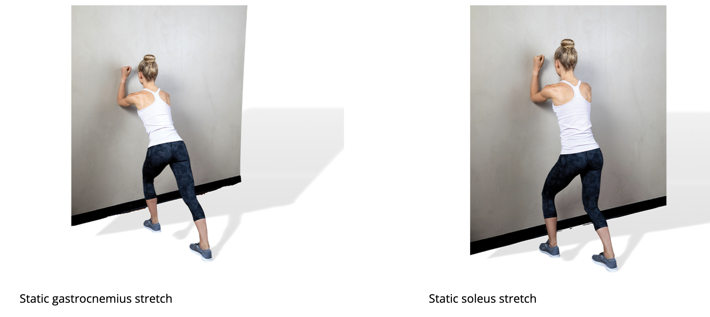

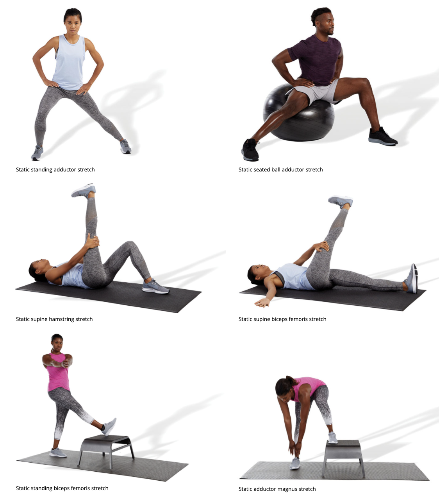

### 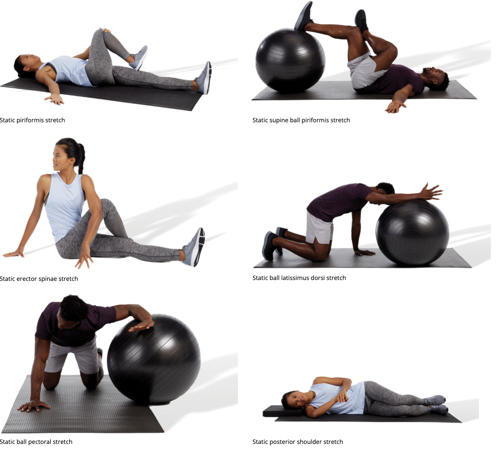

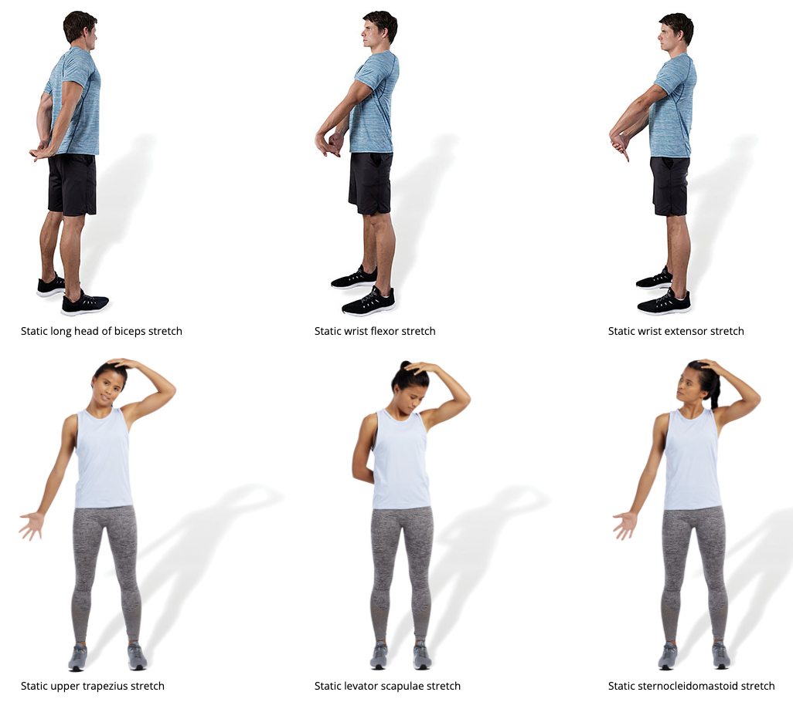

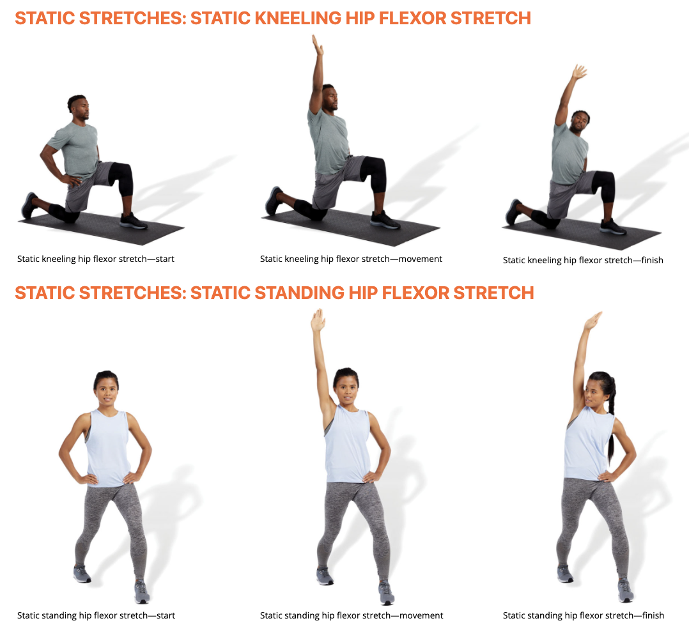

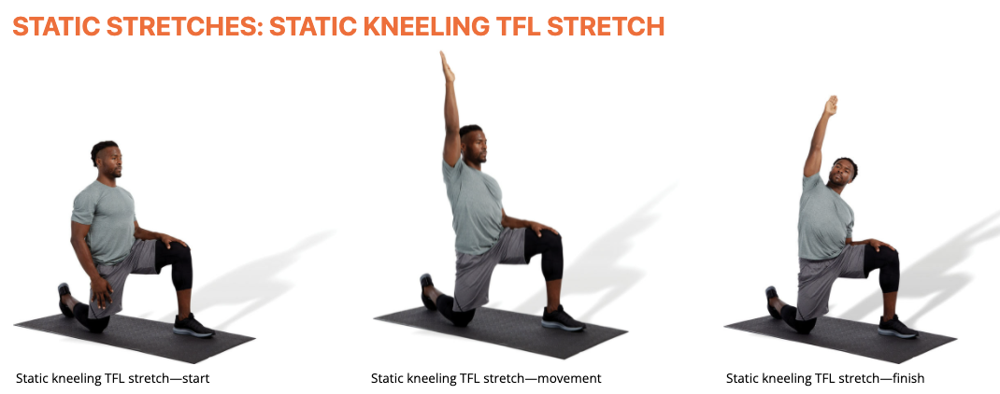

### Neuromuscular stretching Exercises

Acute variables

+  1-3 reps, isometric contraction of 7–10 seconds. holding the passive stretch for 20 to 30 seconds

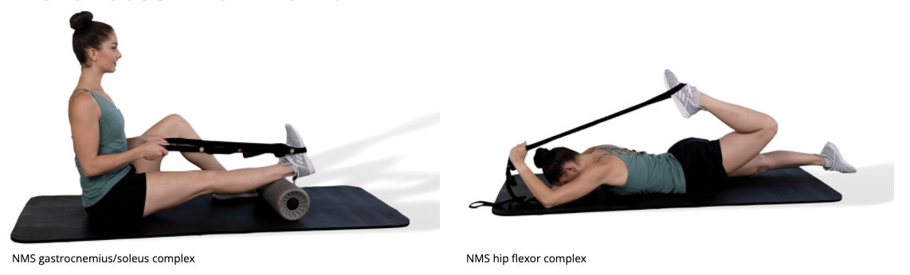

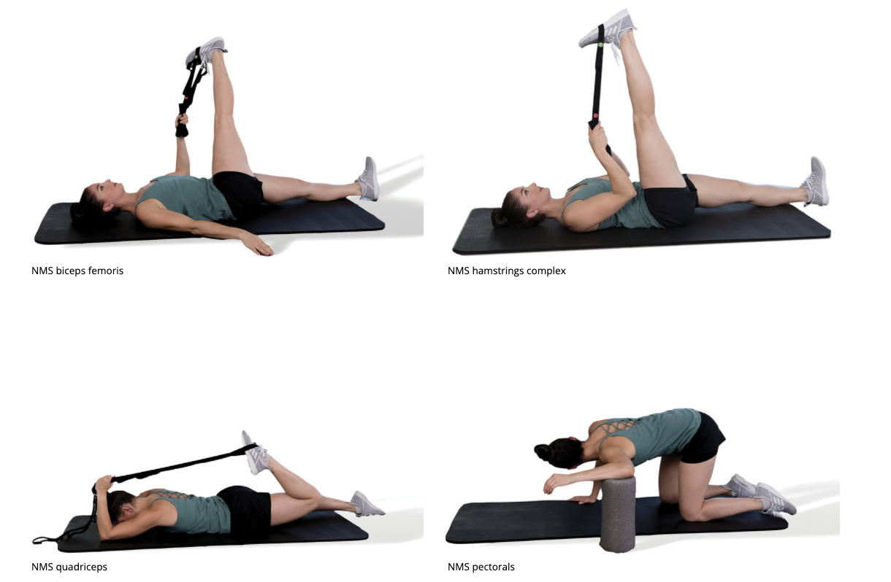

### Dynamic stretching Exercises

Acute variables

+ one cycle per second, 3 to 6 days per week, up to 90s

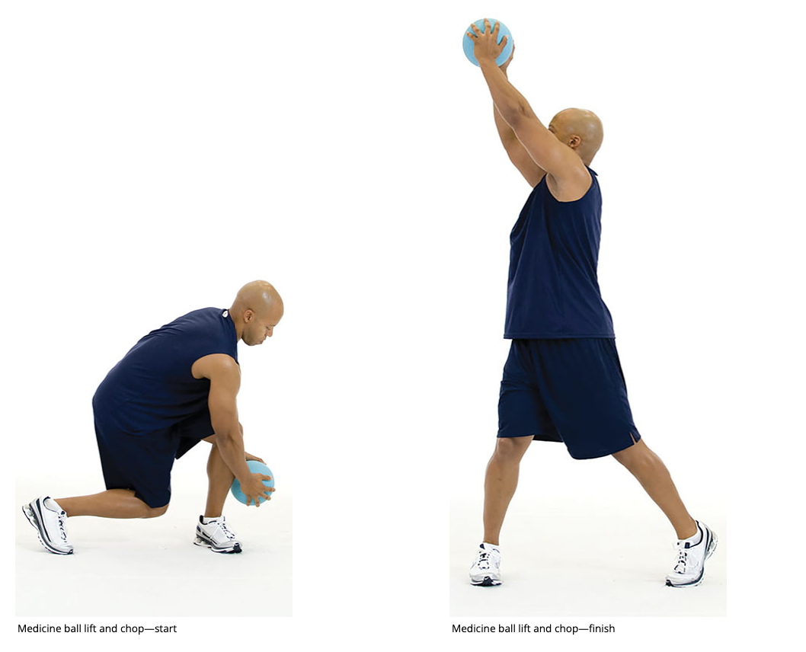

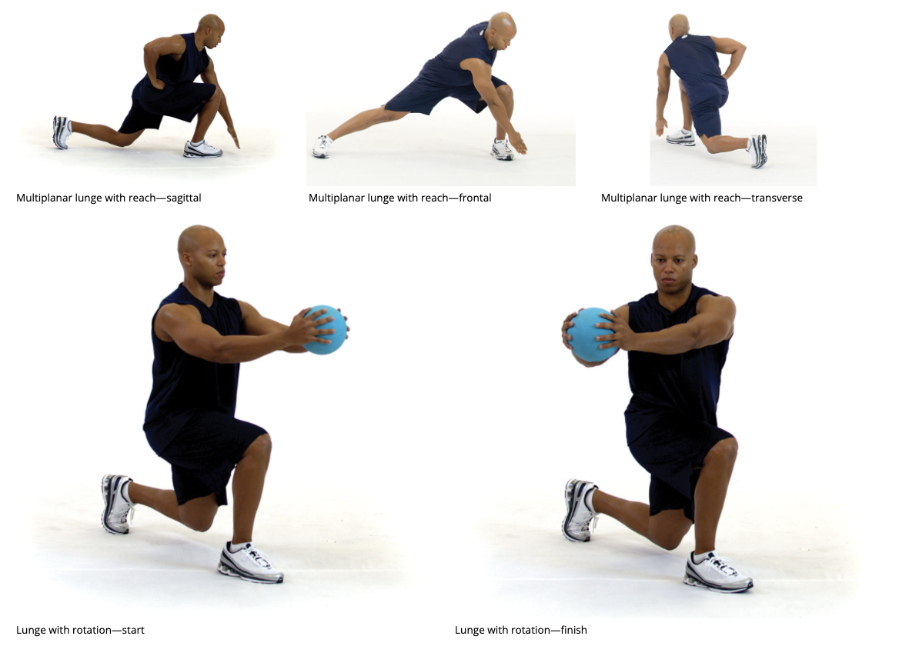

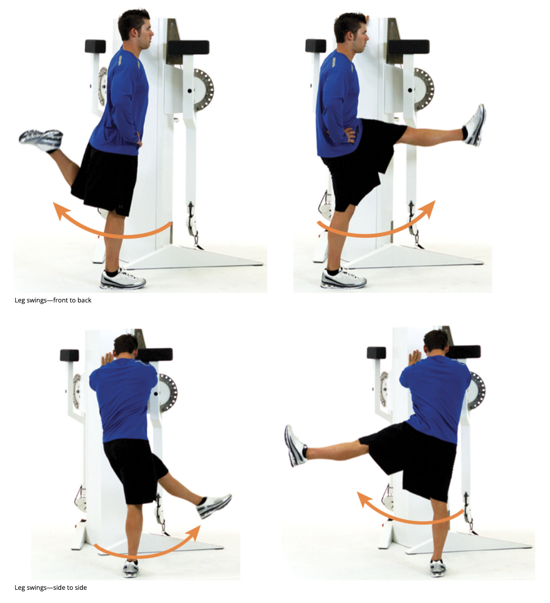

## Quiz

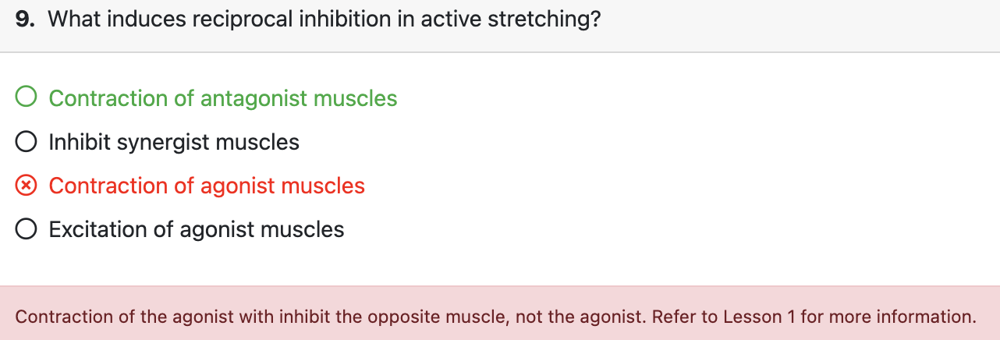

## Reference

> Allander, E., Bjornsson, O. J., Olafsson, O., Sigfusson, N., & Thorsteinsson, J. (1974). Normal range of joint movements in shoulder, hip, wrist and thumb with special reference to side: A comparison between two populations. *International Journal of Epidemiology*, *3*(3), 253–261. https://doi.org/10.109 /ije/3.3.253
>
> Alter, M. J. (2004). *Science of flexibility*. Human Kinetics.
>
> Amako, M., Oda, T., Masuoka, K., Yoko, H., & Campisi, P. (2003). Effect of static stretching on prevention of injuries for military recruits. *Military Medicine*, *168*(6), 442–446.
>
> Andrish, J. T., Bergeld, J. A., & Walheim, J. (1974). A prospective study on the management of shin splints. *Journal of Bone and Joint Surgery*, *56*(8), 1697–1700.
>
> Apostolopoulos, N. (2001). Performance flexibility. In B. Foran (Ed.), *High-performance sports conditioning* (pp. 49–61). Human Kinetics.
>
> Bacurau, R. F., Monteiro, G. A., Ugrinowitsch, C., Tricoli, V., Cabral, L. F., & Aoki, M. S. (2009). Acute effect of a ballistic and a static stretching exercise bout on flexibility and maximal strength. *Journal of Strength and Conditioning Research, 23*(1), 304–308.
>
> Bandy, W. D., & Irion, J. M. (1994). The effect of time on the static stretch of the hamstrings muscles. *Physical Therapy, 74*(9), 845–850.
>
> Bandy, W. D., Irion, J. M., & Briggler, M. (1997). The effect of time and frequency of static stretching on flexibility of the hamstring muscles. *Physical Therapy, 77*(10), 1090–1096.
>
> Bandy, W. D., Irion, J. M., & Briggler, M. (1998). The effect of static stretch and dynamic range of motion training on the flexibility of the hamstring muscles. *Journal of Orthopaedic and Sports Physical Therapy, 27*(4), 295–300.
>
> Baxter, C., Mc Naughton, L. R., Sparks, A., Norton, L., & Bentley, D. (2017). Impact of stretching on the performance and injury risk of long-distance runners. *Research in Sports Medicine, 25*(1), 78–90. https://doi.org/10.1080/15438627.2016.1258640
>
> Beedle, B. B., & Mann, C. L. (2007). A comparison of two warm-ups on joint range of motion. *Journal of Strength and Conditioning Research, 21*(3), 776–779.
>
> Behm, D. G. (2018). T*he science and physiology of flexibility and stretching: Implications and applications in sport performance and health*. Routledge.
>
> Behm, D. G., Bambury, A., Cahill, F., & Power, K. (2004). Effect of acute static stretching on force, balance, reaction time, and movement time. *Medicine & Science in Sports & Exercise, 36*(8), 1397–1402. https://doi.org/10.1249/01.mss.0000135788.23012.5f
>
> Behm, D. G., Blazevich, A. J., Kay, A. D., & McHugh, M. (2016). Acute effects of muscle stretching on physical performance, range of motion, and injury incidence in healthy active individuals: A systematic review. *Applied Physiology, Nutrition, and Metabolism, 41*(1), 1–11. https://doi.org/10.113/apnm-2015-0235
>
> Behm, D. G., Bradbury, E. E., Haynes, A. T., Hodder, J. N., Leonard, A. M., & Paddock, N. R. (2006). Flexibility is not related to stretch-induced deficits in force or power. *Journal of Sports Science and Medicine, 5*(1), 33–42.
>
> Behm, D. G., Button, D. C., & Butt, J. C. (2001). Factors affecting force loss with prolonged stretching. *Canadian Journal of Applied Physiology, 26*(3), 261–272.
>
> Behm, D. G., & Chaouachi, A. (2011). A review of the acute effects of static and dynamic stretching on performance. *European Journal of Applied Physiology, 111*(11), 2633–2651. https://doi .org/10.1007/s00421-011-1879-2
>
> Behm, D. G., & Kibele, A. (2007). Effects of differing intensities of static stretching on jump performance. *European Journal of Applied Physiology, 101*(5), 587–594. https://doi.org/10.1007 /s00421-007-0533-5
>
> Behm, D. G., Lau, R. J., O’Leary, J. J., Rayner, M. C. P., Burton, E. A., & Lavers, L. (2019). The acute effects of unilateral self-administered static stretching on contralateral limb performance. *Journal of Performance Health Research, 3*(1), 1–7. https://doi.org/10.25036/jphr.2019.3.1.behm
>
> Behm, D. G., Plewe, S., Grage, P., Rabbani, A., Beigi, H. T., Byrne, J. M., & Button, D. C. (2011). Relative static stretch-induced impairments and dynamic stretch-induced enhancements are similar in young and middle-aged men. *Applied Physiology, Nutrition, and Metabolism, 36*(6), 790–797. https://doi.org/10.1139/h11-107
>
> Behm, D. G., & Sale, D. G. (1993). Velocity specificity of resistance training. *Sports Medicine, 15*(6), 374–388.
>
> Bishop, D. (2003). Warm up II: Performance changes following active warm up and how to structure the warm up. *Sports Medicine, 33*(7), 483–498.
>
> Blazevich, A. J., Cannavan, D., Waugh, C. M., Fath, F., Miller, S. C., & Kay, A. D. (2012). Neuromuscular factors influencing the maximum stretch limit of the human plantar flexors. *Journal of Applied Physiology, 113*(9), 1446–1455. https://doi.org/10.1152 /japplphysiol.00882.2012
>
> Blazevich, A. J., Gill, N. D., Kvorning, T., Kay, A. D., Goh, A., Hilton, B., Drinkwater, E. J., & Behm, D. G. (2018). No effect of muscle stretching within a full, dynamic warm-up on athletic performance. *Medicine & Science in Sports & Exercise, 50*(6), 1258–1266. https://doi.org/10.1249/MSS.0000000000001539
>
> Bonnar, B. P., Deivert, R. G., & Gould, T. E. (2004). The relationship between isometric contraction durations during hold-relax stretching and improvement of hamstring flexibility. *Journal of Sports Medicine and Physical Fitness, 44*(3), 258–261.
>
> Burke, D. G., Culligan, C. J., & Holt, L. E. (2000). The theoretical basis of proprioceptive neuromuscular facilitation. *Journal of Strength and Conditioning Research, 14*(4), 496–500.
>
> Caldwell, S. L., Bilodeau, R. L. S., Cox, M. J., & Behm, D. G. (2019). Cross education training effects are evident with twice daily, self-administered band stretch training. *Journal of Sports Science and Medicine, 18*(3), 544–551.
>
> Cappa, D. F., & Behm, D. G. (2011). Training specificity of hurdle vs. countermovement jump training. *Journal of Strength and Conditioning Research, 25*(10), 2715–2720. https://doi.org /10.1519/JSC.0b013e318208d43c
>
> Cappa, D. F., & Behm, D. G. (2013). Neuromuscular characteristics of drop and hurdle jumps with different types of landings. *Journal of Strength and Conditioning Research, 27*(11), 3011–3020. https://doi.org/10.1519/JSC.0b013e31828c28b3
>
> Carlson, C. R., Collins, F. L., Nitz, A. J., Sturgis, E. T., & Rogers, J. L. (1990). Muscle stretching as an alternative relaxation training procedure. *Journal of Behavior Therapy and Experimental Psychiatry, 21*(1), 29–38.
>
> Carlson, C. R., & Curran, S. L. (1994). Stretch-based relaxation training. *Patient Education and Counseling, 23*(1), 5–12.
>
> Chalmers, G. (2004). Re-examination of the possible role of Golgi tendon organ and muscle spindle reflexes in proprioceptive neuromuscular facilitation muscle stretching. *Sports Biomechanics, 3*(1), 159–183.
>
> Chalmers, G. R., & Knutzen, K. M. (2004). Recurrent inhibition in the soleus motor pool of elderly and young adults. *Electromyography Clinical Neurophysiology, 44*(7), 413–421.
>
> Chandler, T. J., Kibler, W. B., Uhl, T. L., Wooten, B., Kiser, A., & Stone, E. (1990). Flexibility comparisons of junior elite tennis players to other athletes. *American Journal of Sports Medicine, 18*(2), 134–136. https://doi.org/10.1177/036354659001800204
>
> Chaouachi, A., Chamari, K., Wong, P., Castagna, C., Chaouachi, M., Moussa-Chamari, I., & Behm, D. G. (2008). Stretch and sprint training reduces stretch-induced sprint performance deficits in 13- to 15-year-old youth. *European Journal of Applied Physiology, 104*(3), 515–522. https://doi.org/10.1007/s00421-008-0799-2
>
> Clark, S., Christiansen, A., Hellman, D. F., Hugunin, J. W., & Hurst, K. M. (1999). Effects of ipsilateral anterior thigh soft tissue stretching on passive unilateral straight-leg raise. *Journal of Orthopaedic and Sports Physical Therapy, 29*(1), 4–9; discussion 10–12. https://doi .org/10.2519/jospt.1999.29.1.4
>
> Cornwell, A., Nelson, A. G., & Sidaway, B. (2002). Acute effects of stretching on the neuromechanical properties of the triceps surae muscle complex. *European Journal of Applied Physiology, 86*(5), 428–434.
>
> Davis, D. S., Ashby, P. E., McHale, K. L., McQuain, J. A., & Wine, J. M.(2005). The effectiveness of 3 stretching techniques on hamstring flexibility using consistent stretching parameters. *Journal of Strength and Conditioning Research, 19*(1), 27–32.
>
> DeVries, H. A. (1986). *Physiology of exercise for physical education and athletics* (4th ed.). William C. Brown.
>
> Ebben, W. P., & Blackard, D. O. (2001). Strength and conditioning practices of National Football League strength and conditioning coaches. *Journal of Strength and Conditioning Research, 15*(1), 48–58.
>
> Ebben, W. P., Carroll, R. M., & Simenz, C. J. (2004). Strength and conditioning practices of National Hockey League strength and conditioning coaches. *Journal of Strength and Conditioning Research, 18*(4), 889–897.
>
> Ebben, W. P., Hintz, M. J., & Simenz, C. J. (2005). Strength and conditioning practices of Major League Baseball strength and conditioning coaches. *Journal of Strength and Conditioning Research, 19*(3), 538–546.
>
> Etnyre, B. R., & Lee, E. J. (1988). Chronic and acute flexibility of men and women using three different stretching techniques. *Research Quarterly for Exercise and Sport, 59*(3), 222–228.
>
> Fasen, J. M., O’Connor, A. M., Schwartz, S. L., Watson, J. O., Plastaras, C. T., Garvan, C. W., Bulcao, C., Johnson, S. C., & Akuthota, V. (2009). A randomized controlled trial of hamstring stretching: comparison of four techniques. *Journal of Strength and Conditioning Research, 23*(2), 660–667. https://doi.org/10.1519 /JSC.0b013e318198fbd1
>
> Feland, J. B., & Marin, H. N. (2004). Effect of submaximal contraction intensity in contract-relax proprioceptive neuromuscular facilitation stretching. *British Journal of Sports Medicine, 38*(4), E18.
>
> Feland, J. B., Myrer, J. W., Schulthies, S. S., Fellingham, G. W., & Measom, G. W. (2001). The effect of duration of stretching of the hamstring muscle group for increasing range of motion in people aged 65 years or older. *Physical Therapy, 81*(5), 1110–1117.
>
> Fletcher, I. M. (2010). The effect of different dynamic stretch velocities on jump performance. *European Journal of Applied Physiology, 109*(3), 491–498. https://doi.org/10.1007/s00421-010-1386-x
>
> Fletcher, I. M., & Jones, B. (2004). The effect of different warm-up stretch protocols on 20 meter sprint performance in trained rugby union players. *Journal of Strength and Conditioning Research, 18*(4), 885–888.
>
> Ford, G. S., Mazzone, M. A., & Taylor, K. (2005). The effect of 4 different durations of static hamstring stretching on passive knee-extension range of motion. *Journal of Sport Rehabilitation, 14*(2), 95–107. https://doi.org/10.1123/jsr.14.2.95
>
> Fowles, J. R., Sale, D. G., & MacDougall, J. D. (2000). Reduced strength after passive stretch of the human plantar flexors. *Journal of Applied Physiology, 89*(3), 1179–1188.
>
> Fradkin, A. J., Gabbe, B. J., & Cameron, P. A. (2006). Does warming up prevent injury in sport? The evidence from randomised controlled trials? *Journal of Science and Medicine in Sport, 9*(3), 214–220. https://doi.org/10.1016/j.jsams.2006.03.026
>
> Gabbard, C., & Tandy, R. (1988). Body composition and flexibility among prepubescent males and females. *Journal of Human Movement Studies, 4*(14), 153–159.
>
> Gajdosik, R. L., Vander Linden, D. W., McNair, P. J., Williams, A. K., & Riggin, T. J. (2005). Effects of an eight-week stretching program on the passive-elastic properties and function of the calf muscles of older women. *Clinical Biomechanics, 20*(9), 973–983.
>
> Godges, J. J., MacRae, P. G., & Engelke, K. A. (1993). Effects of exercise on hip range of motion, trunk muscle performance, and gait economy. *Physical Therapy, 73*(7), 468–477. https://doi.org/10.1093/ptj/73.7.468
>
> Grewal, R., Xu, J., Sotereanos, D. G., & Woo, S. L. (1996). Biomechanical properties of peripheral nerves. *Hand Clinics, 12*(2), 195–204.
>
> Guissard, N., & Duchateau, J. (2004). Effect of static stretch training on neural and mechanical properties of the human plantar-flexor muscles. *Muscle and Nerve, 29*(2), 248–255.
>
> Guissard, N., & Duchateau, J. (2006). Neural aspects of muscle stretching. *Exercise and Sport Science Reviews, 34*(4), 154–158.
>
> Guissard, N., Duchateau, J., & Hainaut, K. (1988). Muscle stretching and motoneuron excitability. European Journal of Applied Physiology, *Occupational Physiology, 58*(1–2), 47–52.
>
> Guissard, N., Duchateau, J., & Hainaut, K. (2001). Mechanisms of decreased motoneurone excitation during passive muscle stretching. *Experimental Brain Research, 137*(2), 163–169.
>
> Haley, S. M., Tada, W. L., & Carmichael, E. M. (1986). Spinal mobility in young children. A normative study. *Physical Therapy, 66*(11), 1697–1703.
>
> Halvorson, G. A. (1989). Principles of rehabilitating sports injuries. In C. C. Teitz (Ed.), *Scientific foundations of sports medicine* (pp. 345–371). Mosby.
>
> Hamaguchi, T., Fukudo, S., Kanazawa, M., Tomiie, T., Shimizu, K., Oyama, M., & Sakurai, K. (2008). Changes in salivary physiological stress markers induced by muscle stretching in patients with irritable bowel syndrome. *BioPsychoSocial Medicine*, 2, 20.
>
> Hartig, D., & Henderson, J. M. (1999). Increasing hamstring flexibility decreases lower extremity overuse injuries in military basic trainees. *American Journal of Sports Medicine, 27*(2), 173–176.
>
> Harvey, L., Herbert, R., & Crosbie, J. (2002). Does stretching induce lasting increases in joint ROM? A systematic review. *Physiotherapy Research International*, 7(1), 1–13.
>
> Hebbelink, M. (1988). *Flexibility*. Blackwell Scientific.
>
> Higgs, F., & Winter, S. L. (2009). The effect of a four-week proprioceptive neuromuscular facilitation stretching program on isokinetic torque production. *Journal of Strength and Conditioning Research*, *23*(5), 1442–1447.
>
> Hilyer, J. C., Brown, K. C., Sirles, A. T., & Peoples, L. (1990). A flexibility intervention to reduce the incidence and severity of joint injuries among municipal firefighters. *Journal of Occupational Medicine, 32*(7), 631–637.
>
> Hindle, K. B., Whitcomb, T. J., Briggs, W. O., & Hong, J. (2012). Proprioceptive neuromuscular facilitation (PNF): Its mechanisms and effects on range of motion and muscular function. *Journal of Human Kinetics, 31*, 105–113.
>
> Houk, J. C., Crago, P. E., & Rymer, W. Z. (1980). Functional properties of the Golgi tendon organs. In J. E. Desmedt (Ed.), *Spinal and supraspinal mechanisms of voluntary motor control and locomotion* (Vol. 8, pp. 33–43). Karger.
>
> Hubley-Kozey, C. L. (1991). Testing flexibility. In J. D. MacDougall, H. A. Weger, & H. J. Green (Eds.), *Physiological testing of the high-performance athlete* (2nd ed., pp. 309–359). Human Kinetics.
>
> Hunter, J. P., & Marshall, R. N. (2002). Effects of power and flexibility training on vertical jump technique. *Medicine & Science in Sports & Exercise, 34*(3), 478–486.
>
> Jenner, J. R., & Stephens, J. A. (1982). Cutaneous reflex responses and their central nervous pathways studied in man. *Journal of Physiology*, 333, 405–419.
>
> Jones, M. A., Buis, J. M., & Harris, I. D. (1986). Relationships of race and sex to physical and motor measures. *Perceptual and Motor Skills, 63*(1), 169–170. https://doi.org/10.2466/pms.1986.63.1.169
>
> Katz, R., & Pierrot-Deseilligny, E. (1999). Recurrent inhibition in humans. *Progress in Neurobiology, 57*(3), 325–355.
>
> Kay, A. D., & Blazevich, A. J. (2012). Effect of acute static stretch on maximal muscle performance: A systematic review. *Medicine & Science in Sports & Exercise, 44*(1), 154–164. https://doi.org/10.1249/MSS.0b013e318225cb27
>
> Kay, A. D., Husbands-Beasley, J., & Blazevich, A. J. (2015). Effects of contract-relax, static stretching, and isometric contractions on muscle-tendon mechanics. *Medicine & Science in Sports & Exercise, 47*(10), 2181–2190. https://doi.org/10.1249/MSS.0000000000000632
>
> Kent, M. (1998). *The Oxford dictionary of sports science and medicine* (2nd ed.). Oxford University Press.
>
> Kisner, C., & Colby, L. A. (2002). *Therapeutic exercise: Foundations and techniques* (4th ed.). F. A. Davis.
>
> Knudson, D., Bennett, K., Corn, R., Leick, D., & Smith, C. (2001). Acute effects of stretching are not evident in the kinematics of the vertical jump. *Journal of Strength and Conditioning Research, 15*(1), 98–101.
>
> Knudson, D. V., Noffal, G. J., Bahamonde, R. E., Bauer, J. A., & Blackwell, J. R. (2004). Stretching has no effect on tennis serve performance. *Journal of Strength and Conditioning Research, 18*(3), 654–656.
>
> Kokkonen, J., Nelson, A. G., Eldredge, C., & Winchester, J. B. (2007). Chronic static stretching improves exercise performance. *Medicine & Science in Sports & Exercise, 39*(10), 1825–1831.
>
> Kubo, K., Kanehisa, H., & Fukunaga, T. (2001). Is passive stiffness in human muscles related to the elasticity of tendon structures? *European Journal of Applied Physiology, 85*(3–4), 226–232.
>
> Kubo, K., Kanehisa, H., & Fukunaga, T. (2002). Effect of stretching training on the viscoelastic properties of human tendon structures in vivo. *Journal of Applied Physiology, 92*(2), 595–601.
>
> Kummel, J., Kramer, A., Cronin, N. J., & Gruber, M. (2016). Postactivation potentiation can counteract declines in force and power that occur after stretching. *Scandinavian Journal of Medicine & Science in Sports, 27*(12), 1750–1760. https://doi.org/10.1111/sms.12817
>
> Laban, M. M. (1962). Collagen tissue: Implications of its response to stress in vitro. *Archives of Physical Medicine and Rehabilitation*, *43*, 461–466.
>
> LaRoche, D. P., Lussier, M. V., & Roy, S. J. (2008). Chronic stretching and voluntary muscle force. *Journal of Strength and Conditioning Research, 22*(2), 589–596. https://doi.org/10.1519/JSC.0b013e3181636aef
>
> Liemohn, W. P. (1988). Flexibility and muscular strength. Journal of Physical Education, *Recreation & Dance, 59*(7), 37–40.
>
> Little, T., & Williams, A. G. (2006). Effects of differential stretching protocols during warm-ups on high-speed motor capacities in professional soccer players. *Journal of Strength and Conditioning Research, 20*(1), 203–207.
>
> Lucas, R. C., & Koslow, R. (1984). Comparative study of static, dynamic, and proprioceptive neuromuscular facilitation stretching techniques on flexibility. *Perceptual and Motor Skills, 58*(2), 615–618. https://doi.org/10.2466/pms.1984.58.2.615
>
> Lundborg, G. (1975). Structure and function of the intraneural microvessels as related to trauma, edema formation, and nerve function. *Journal of Bone and Joint Surgery. American Volume, 57*(7), 938–948.
>
> Lundborg, G., & Rydevik, B. (1973). Effects of stretching the tibial nerve of the rabbit. A preliminary study of the intraneural circulation and the barrier function of the perineurium. *Journal of Bone and Joint Surgery. British Volume, 55*(2), 390–401.
>
> Magnusson, S. P., Simonsen, E. B., Aagaard, P., Dyhre-Poulsen, P., McHugh, M. P., & Kjaer, M. (1996). Mechanical and physiological responses to stretching with and without preisometric contraction in human skeletal muscle. *Archives of Physical Medicine and Rehabilitation, 77*(4), 373–378. https://doi.org/10.1016/s0003-9993(96)90087-8
>
> Magnusson, S. P., Simonsen, E. B., Aagaard, P., & Kjaer, M. (1996). Biomechanical responses to repeated stretches in human hamstring muscle in vivo. *American Journal of Sports Medicine, 24*(5), 622–627.
>
> Magnusson, S. P., Simonsen, E. B., Aagaard, P., Sorensen, H., & Kjaer, M. (1996). A mechanism for altered flexibility in human skeletal muscle. *Journal of Physiology, 497*(Pt 1), 291–298.
>
> Magnusson, S. P., Simonsen, E. B., Dyhre-Poulsen, P., Aagaard, P., Mohr, T., & Kjaer, M. (1996). Viscoelastic stress relaxation during static stretch in human skeletal muscle in the absence of EMG activity. *Scandinavian Journal of Medicine & Science in Sports, 6*(6), 323–328.
>
> Manoel, M. E., Harris-Love, M. O., Danoff, J. V., & Miller, T. A. (2008). Acute effects of static, dynamic, and proprioceptive neuromuscular facilitation stretching on muscle power in women. *Journal of Strength and Conditioning Research, 22*(5), 1528–1534.
>
> Marek, S. M., Cramer, J. T., Fincher, A. L., Massey, L. L., Dangelmaier, S. M., Purkayastha, S., Fitz, K. A., & Culbertson, J. Y. (2005). Acute effects of static and proprioceptive neuromuscular facilitation stretching on muscle strength and power output. *Journal of Athletic Training, 40*(2), 94–103.
>
> Matthews, P. B. (1981). Muscle spindles: Their messages and their fusimotor supply. In V. B. Brooks (Ed.), *Handbook of physiology. Section 1: The nervous system* (Vol. II, pp. 189–288). American Physiological Society.
>
> McGill, S. M. (2002). *Low back disorders: Evidence based prevention and rehabilitation*. Human Kinetics.
>
> McHugh, M. P., & Cosgrave, C. H. (2010). To stretch or not to stretch: The role of stretching in injury prevention and performance. *Scandinavian Journal of Medicine & Science in Sports, 20*(2),169–181. https://doi.org/10.1111/j.1600-0838.2009.01058.x
>
> Medeiros, D. M., & Lima, C. S. (2017). Influence of chronic stretching on muscle performance: Systematic review. *Human Movement Science, 54*, 220–229. https://doi.org/10.101/j.humov.2017.05.006
>
> Melzack, R., & Wall, P. D. (1965). Pain mechanisms: A new theory. *Science, 150*(3699), 971–979.
>
> Mitchell, U. H., Myrer, J. W., Hopkins, J. T., Hunter, I., Feland, J. B., & Hilton, S. C. (2007). Acute stretch perception alteration contributes to the success of the PNF “contract-relax” stretch. *Journal of Sport Rehabilitation, 16*(2), 85–92.
>
> Morelli, M., Chapman, C. E., & Sullivan, S. J. (1999). Do cutaneous receptors contribute to changes in the amplitude of the H-reflex during massage? *Electromyography Clinical Neurophysiology, 39*(7), 441–447.
>
> Murphy, J. R., Di Santo, M. C., Alkanani, T., & Behm, D. G. (2010). Aerobic activity before and following short-duration static stretching improves range of motion and performance vs. a traditional warm-up. *Applied Physiology, Nutrition, and Metabolism, 35*(5), 679–690. https://doi.org/10.1139/H10-062
>
> Nelson, R. T., & Bandy, W. D. (2005). An update on flexibility. *Strength Conditioning Journal, 27*(1), 10–16.
>
> Nelson, A. G., & Kokkonen, J. (2001). Acute ballistic muscle stretching inhibits maximal strength performance. *Research Quarterly for Exercise and Sport, 72*(4), 415–419. https://doi.org/10.1080/02701367.2001.10608978
>
> Ogata, K., & Naito, M. (1986). Blood flow of peripheral nerve effects of dissection, stretching and compression. *Journal of Hand Surgery. British & European Volume, 11*(1), 10–14.
>
> Pope, R. P., Herbert, R. D., & Kirwan, J. D. (1998). Effects of ankle dorsiflexion range and pre-exercise calf muscle stretching on injury risk in army recruits. *Australian Journal of Physiotherapy, 44*(3), 165–177.
>
> Pope, R. P., Herbert, R. D., Kirwan, J. D., & Graham, B. J. (2000). A randomized trial of preexercise stretching for prevention of lower-limb injury. *Medicine & Science in Sports & Exercise, 32*(2), 271–277.
>
> Power, K., Behm, D., Cahill, F., Carroll, M., & Young, W. (2004). An acute bout of static stretching: Effects on force and jumping performance. *Medicine & Science in Sports & Exercise, 36*(8), 1389–1396.
>
> Reid, J. C., Greene, R., Young, J. D., Hodgson, D. D., Blazevich, A. J., & Behm, D. G. (2018). The effects of different durations of static stretching within a comprehensive warm-up on voluntary and evoked contractile properties. *European Journal of Applied Physiology, 118*(7), 1427–1445. https://doi.org/10.1007/s00421-018-3874-3
>
> Rowlands, A. V., Marginson, V. F., & Lee, J. (2003). Chronic flexibility gains: Effect of isometric contraction duration during proprioceptive neuromuscular facilitation stretching techniques. *Research Quarterly for Exercise and Sport, 74*(1), 47–51.
>
> Sady, S. P., Wortman, M., & Blanke, D. (1982). Flexibility training: Ballistic, static or proprioceptive neuromuscular facilitation? *Archives of Physical Medicine and Rehabilitation, 63*(6), 261–263.
>
> Safran, M. R., Garrett, W. E., Jr., Seaber, A. V., Glisson, R. R., & Ribbeck, B. M. (1988). The role of warmup in muscular injury prevention. *American Journal of Sports Medicine, 16*(2), 123–129.
>
> Sale, D., & MacDougall, D. (1981). Specificity in strength training: A review for the coach and athlete. *Canadian Journal of Applied Sport Sciences, 6*(2), 87–92.
>
> Samson, M., Button, D. C., Chaouachi, A., & Behm, D. G. (2012). Effects of dynamic and static stretching within general and activity specific warm-up protocols. *Journal of Sports Science and Medicine, 11*(2), 279–285.
>
> Sandberg, J. B., Wagner, D. R., Willardson, J. M., & Smith, G. A. (2012). Acute effects of antagonist stretching on jump height, torque, and electromyography of agonist musculature. *Journal of Strength and Conditioning Research, 26*(5), 1249–1256. https://doi.org/10.1519/JSC.0b013e31824f2399
>
> Schuback, B. H., Hooper, J., & Salisbury, L. G. (2004). A comparison of a self-stretch incorporating proprioceptive neuromuscular facilitation components and a therapist-applied PNF-technique on hamstring flexibility. *Physiotherapy, 90*(3), 151–157. https://doi.org/10.1016/j.physio.2004.02.009
>
> Sharman, M. J., Cresswell, A. G., & Riek, S. (2006). Proprioceptive neuromuscular facilitation stretching: Mechanisms and clinical implications. *Sports Medicine, 36*(11), 929–939.
>
> Shrier, I. (2004). Does stretching improve performance? A systematic and critical review of the literature. *Clinical Journal of Sport Medicine, 14*(5), 267–273.
>
> Shrier, I., & Gossal, K. (2000). Myths and truths of stretching. *The Physician and Sports Medicine, 28*(8), 57–63.
>
> Simenz, C. J., Dugan, C. A., & Ebben, W. P. (2005). Strength and conditioning practices of National Basketball Association strength and conditioning coaches. *Journal of Strength and Conditioning Research, 19*(3), 495–504.
>
> Small, K., Mc Naughton, L., & Matthews, M. (2008). A systematic review into the efficacy of static stretching as part of a warm-up for the prevention of exercise-related injury. *Research in Sports Medicine, 16*(3), 213–231. https://doi.org/10.1080 /15438620802310784
>
> Smith, C. A. (1994). The warm-up procedure: To stretch or not to stretch. A brief review. *Journal of Orthopedic & Sports Physical Therapy, 19*(1), 12–17.
>
> Smith, J. W. (1966). Factors influencing nerve repair. I. Blood supply of peripheral nerves. *Archives of Surgery, 93*(2), 335–341.
>
> Smith, N. P., Barclay, C. J., & Loiselle, D. S. (2005). The efficiency of muscle contraction. *Progress in Biophysics & Molecular Biology, 88*(1), 1–58. https://doi.org/10.1016/j.pbiomolbio.2003.11.014
>
> Soucie, J. M., Wang, C., Forsyth, A., Funk, S., Denny, M., Roach, K. E., Boone, D., & Hemophilia Treatment Center Network. (2010). Range of motion measurements: Reference values and a database for comparison studies. *Haemophilia, 17*(3), 500–507. https://doi .org/10.1111/j.1365-2516.2010.02399.x
>
> Stone, W. J., & Kroll, W. A. (1991). *Sports conditioning and weight training: Programs for athletic competition* (3rd ed.). William C. Brown.
>
> Sugano, A., & Nomura, T. (2000). Influence of water exercise and land stretching on salivary cortisol concentrations and anxiety in chronic low back pain patients. *Journal of Physiologica lAnthropology and Applied Human Science, 19*(4), 175–180. https://doi.org/10.2114/jpa.19.175
>
> Sullivan, M. K., Dejulia, J. J., & Worrell, T. W. (1992.). Effect of pelvic position and stretching method on hamstring muscle flexibility. *Medicine & Science in Sports & Exercise, 24*(12), 1383–1389.
>
> Sun, J.-S., Tsuang, Y.-H., Liu, T.-K., Hang, Y.-S., Cheng, C.-K., & Lee, W. W.-L. (1995). *Viscoplasticity of rabbit skeletal muscle under dynamic cyclic loading. Clinical Biomechanics, 10*(5), 258–262.
>
> Sunderland, S. (1978). Traumatized nerves, roots and ganglia: Musculoskeletal factors and neuropathological consequences. In I. M. Korr (Ed.), *The neurobiologic mechanisms in manipulative therapy* (pp. 137–138). Plenum Press.
>
> Sunderland, S. (1991). *Nerve injuries and their repair. A critical appraisal* (3rd ed.). Churchill Livingstone.
>
> Taylor, J. M., Weston, M., & Portas, M. D. (2013). The effect of a short practical warm-up protocol on repeated sprint performance. *Journal of Strength and Conditioning Research, 27*(7), 2034–2038. https://doi.org/10.1519/JSC.0b013e3182736056
>
> Thacker, S. B., Gilchrist, J., Stroup, D. F., & Kimsey, C. D., Jr. (2004). The impact of stretching on sports injury risk: A systematic review of the literature. *Medicine & Science in Sports & Exercise, 35*(3), 371–378.
>
> Thomas, E., Bianco, A., Paoli, A., & Palma, A. (2018). The relation between stretching typology and stretching duration: The effects on range of motion. *International Journal of Sports Medicine, 39*(4), 243–254. https://doi.org/10.1055/s-0044-101146
>
> Turki, O., Chaouachi, A., Drinkwater, E. J., Chtara, M., Chamari, K., Amri, M., & Behm, D. G. (2011). Ten minutes of dynamic stretching is sufficient to potentiate vertical jump performance characteristics. *Journal of Strength and Conditioning Research, 25*(9), 2453–2463. https://doi.org/10.1519/JSC.0b013e31822a5a79
>
> Wall, E. J., Massie, J. B., Kwan, M. K., Rydevik, B. L., Myers, R. R., & Garfin, S. R. (1992). Experimental stretch neuropathy. Changes in nerve conduction under tension. *Journal of Bone and Joint Surgery. British Volume, 74*(1), 126–129.
>
> Wallmann, H. W., Christensen, S. D., Perry, C., & Hoover, D. L. (2012). The acute effects of various types of stretching static, dynamic, ballistic, and no stretch of the iliopsoas on 40-yard sprint times in recreational runners. *International Journal of Sports Physical Therapy, 7*(5), 540–547.
>
> Wallmann, H. W., Mercer, J. A., & Landers, M. R. (2008). Surface electromyographic assessment of the effect of dynamic activity and dynamic activity with static stretching of the gastrocnemius on vertical jump performance. *Journal of Strength and Conditioning Research, 22*(3), 787–793. https://doi.org/10.1519 /JSC.0b013e3181660e27
>
> Warren, C. G., Lehmann, J. F., & Koblanski, J. N. (1971). Elongation of rat tail tendon: Effect of load and temperature. *Archives of Physical Medicine and Rehabilitation, 52*(10), 465–474.
>
> Warren, C. G., Lehmann, J. F., & Koblanski, J. N. (1976). Heat and stretch procedures: An evaluation using rat tail tendon. *Archives of Physical Medicine and Rehabilitation, 57*(3), 122–126.
>
> Whalen, A., Farrell, K., Roberts, S., Smith, H., & Behm, D. G. (2019). Topical analgesic improved or maintained ballistic hip flexion range of motion with treated and untreated legs. *Journal of Sports Science and Medicine, 18*(3), 552–558.
>
> Willy, R. W., Kyle, B. A., Moore, S. A., & Chleboun, G. S. (2001). Effect of cessation and resumption of static hamstring muscle stretching on joint range of motion. *Journal of Orthopaedic & Sports Physical Therapy, 31*(3), 138–144. https://doi.org/10.2519/jospt.2001.31.3.138
>
> Wilson, G. J., Elliot, B. C., & Wood, G. A. (1992). Stretch shorten cycle performance enhancement through flexibility training. *Medicine & Science in Sports & Exercise, 24*(1), 116–123.
>
> Winters, M. V., Blake, C. G., Trost, J. S., Marcello-Brinker, T. B., Lowe, L. M., Garber, M. B., & Wainner, R. S. (2004). Passive versus active stretching of hip flexor muscles in subjects with limited hip extension: A randomized clinical trial. *Physical Therapy, 84*(9), 800–807.
>
> Witvrouw, E., Mahieu, N., Roosen, P., & McNair, P. (2007). The role of stretching in tendon injuries. *British Journal of Sports Medicine, 41*(4), 224–226.
>
> Woods, K., Bishop, P., & Jones, E. (2007). Warm-up and stretching in the prevention of muscular injury. *Sports Medicine, 37*(12), 1089–1099.
>
> Youdas, J. W., Krause, D. A., Egan, K. S., Therneau, T. M., & Laskowski, E. R. (2005). The effect of static stretching of the calf muscle-tendon unit on active ankle dorsiflexion range of motion. *Journal of Orthopedic Sports Physiology Therapy, 33*(7), 408–417.
>
> Youdas, J. W., Krause, D. A., Hollman, J. H., Harmsen, W. S., & Laskowski, E. (2005). The influence of gender and age on hamstring muscle length in healthy adults. *Journal of Orthopaedic & Sports Physical Therapy, 35*(4), 246–252. https://doi.org/10 .2519/jospt.2005.35.4.246
>
> Young, W. B., & Behm, D. (2002). Should static stretching be used during a warm-up for strength and power activities? *Strength and Conditioning Journal, 24*(6), 33–37. https://doi.org/10.1519 /00126548-200212000-00006
>
> Young, W., Elias, G., & Power, J. (2006). Effects of static stretching volume and intensity on plantar flexor explosive force production and range of motion. *Journal of Sports Medicine and Physical Fitness, 46*(3), 403–411.
>
> Young, W., & Elliott, S. (2001). Acute effects on static stretching, proprioceptive neuromuscular facilitation stretching, and maximum voluntary contractions on explosive force production and jumping performance. *Research Quarterly for Exercise and Sport, 72*(3), 273–279.
>
> Young, W. B. (2007). The use of static stretching in warm-up for training and competition. International *Journal of Sports Physiology and Performance, 2*(2), 212–216.

