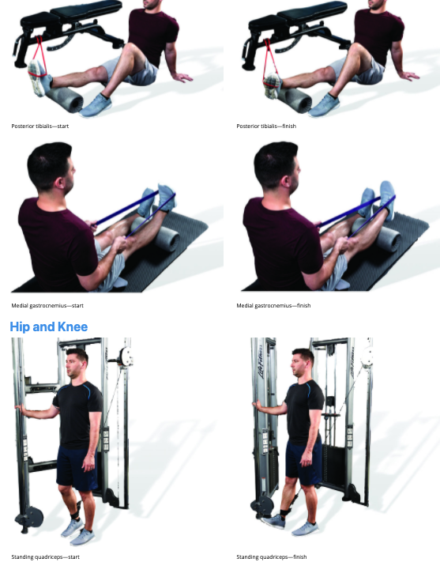
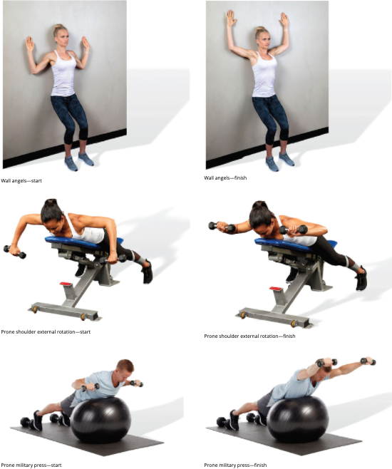
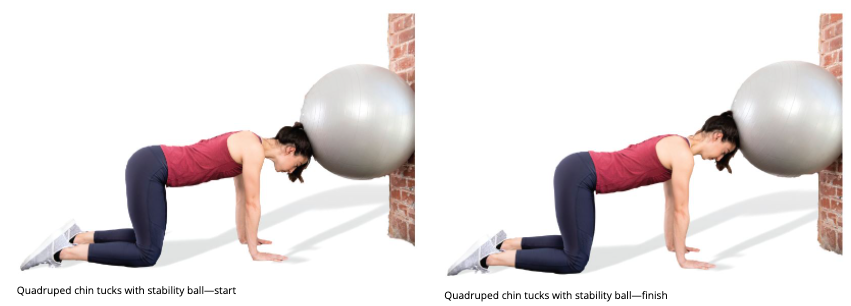

# Activation Techniques

## Isolated Strengthening

+ used to increase intramuscular coordination of specific muscles

  + ntramuscular coordination
    The ability of the neuromuscular system to allow optimal levels of motor unit recruitment and synchronization within a muscle.
  + chieved through a combination of enhanced motor unit activation, synchronization, and firing rate. 
    + Motor unit activation
      The progressive activation of a muscle by successive recruitment of contractile units (motor units) to accomplish increasing gradations of contractile strength.
    + Synchronization
      The synergistic activation of multiple motor units.
    + Firing rate
      The frequency at which a motor unit is activated.
  + developed through resistance exercises focusing on a particular muscle
  + important: increased activation of the muscle throughout the full available ROM of a joint or joints
    + important to achieve before performing integrated exercises to avoid compensation of synergistic muscles (synergistic dominance) during the final phase of the Corrective Exercise Continuum.

+  can be performed immediately after inhibitory and length-ening techniques. 

  + prevent overactive muscles to dominate over targeted muscle
  + allow greater end-ROM

+ **Mennell’s Four Basic Truisms**

  Mennell’s (1964) truisms provide a theoretical basis for the following hypothesis: Attempting to strengthen muscles when joint motion restriction is present will provide less-than-optimal results, and limited joint ROM needs to be considered during any exercise application.

  1. When a joint is not free to move, the muscles that move it cannot be free to move it.
  2. Muscles cannot be restored to normal if the joints that they move are not free to move.
  3. Normal muscle function is dependent on normal joint movement.
  4. Impaired muscle function perpetuates and may cause deterioration in abnormal joints.

+ Eccentric focused exercise (4 sec)
  +  recovery of muscle injury and tendinopathies
  + Grater Strength gains
  + eccentric exercise on a muscle on one side of the body increases strength of the contralateral muscle on the unexercised limb
  + substantial gains in cross-sectional area, promotion of optimal fiber length, increased pennation angle, and targeting of type II muscle fibers while improving variables related to strength, power, and speed performance
  + muscle damage and increased delayed onset muscle soreness
    + first bout of eccentric exercise and subsequent DOMS has a protective effect on the muscle tissue that minimizes soreness and aids in faster recovery during future workouts
  + goal is to practice slow and controlled submaximal eccentric muscle recruitment and to progressively increase intensity over time 

## Guidelines

+ Precautions

  + Special populations
  + Neuromuscular disorders
  + Clients with poor core stabilization strength

+ Contradictions

  + Acute injury or muscle strain or tear of the muscle being strengthened
  + Acute rheumatoid arthritis of the affected joint
  + Impaired joint motion
  + Pain produced during the movement

+ Acute variables

  + 3-5 days/ week, 1-2 sets, 10-15 reps, 4/2/1

    + 4 seconds eccentric

      2 seconds isometric hold at end-range

      1 second concentric

## Exercises

+ Optimizing plank
  + Abdominal activity was significantly increased for those performing isometric dorsiflexion compared to those performing a traditional plank
  + increase in core musculature activation when performing a posterior tilt

## Quiz

