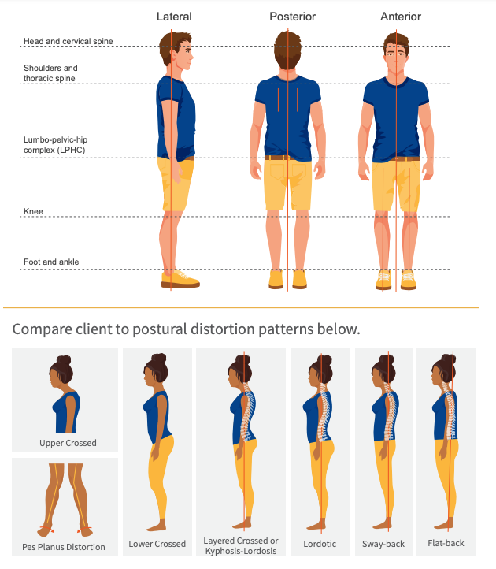
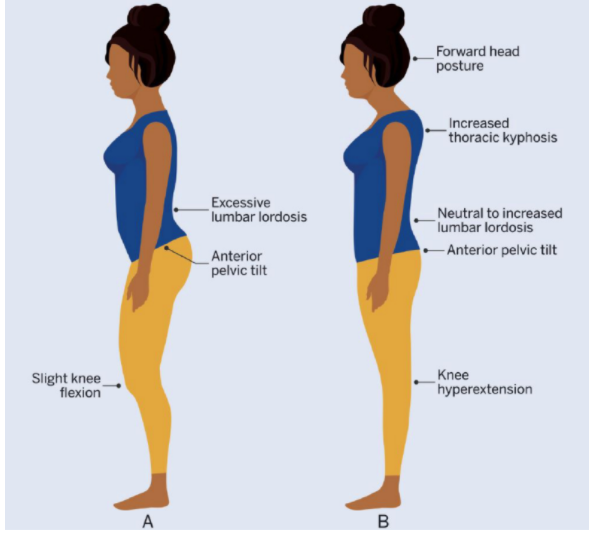

## Introduction

+ Static posture is considered the base for movement because it requires isometric contractions from many different muscles to maintain muscle tension to hold the specific position
+ identifying muscle imbalances (altered length-tension relationships, Occur when the resting length of a muscle is too short or too long to generate optimal force.)
+  look for causative factors during the comprehensive assessment in order to help link the client’s subjective reports (e.g., an area of discomfort) with potential causes (e.g., sitting at a desk all day).
+ Regional Interdependence (RI) model

## Muscle imbalance

+ Pattern overload
  + Occurs when a segment of the body is repeatedly moved or chronically held in the same way, leading to a state of muscle overactivity.
  + e.g. non-optimal computer position -> head forward posture -> cervical stabilizer less efficient
+ muscle imbalance includes altered reciprocal inhibition, synergistic dominance, arthrokinematic dysfunction, and/or overall decreased neuromuscular control -> altered neuromuscular control -> tissue fatigue -> cumulative injury cycle
+ Postural distortion
  Malalignments of bodily segments that place undue stress on the joints; for example, poor posture at one or more of the kinetic chain checkpoints

### Muscles Prone to Imbalance

| **Overactive/Shortened**    | **Underactive/Lengthened**                      |
| --------------------------- | ----------------------------------------------- |
| **Upper Body**              |                                                 |
| Cervical extensors          | Deep cervical flexors (longus coli and capitis) |
| Latissimus dorsi            | Middle and lower trapezius                      |
| Levator scapulae            | Rhomboids                                       |
| Pectorals (major and minor) | Serratus anterior                               |
| Scalenes                    |                                                 |
| Sternocleidomastoid         |                                                 |
| Upper trapezius             |                                                 |
| **LPHC and Lower Body**     |                                                 |
| Gastrocnemius               | Gluteus maximus and medius                      |
| Hamstrings                  | Fibularis (peroneal) muscles                    |
| Hip adductors               | Rectus abdominis                                |
| Piriformis                  | Tibialis anterior and posterior                 |
| Psoas                       | Transverse abdominis                            |
| Quadratus lumborum          | Vastus medialis and lateralis                   |
| Rectus femoris              |                                                 |
| Soleus                      |                                                 |
| Tensor fascia latae         |                                                 |

+ Factors causing postural imbalance
  + Chronic suboptimal postures
    + office work: neck, arm
  + Habitual repetitive movements
    + sitting: hip flexors
    + Swimmer: overemphasized pectoral muscles in relation to the scapular retractors
    + students tend to favor one shoulder over the other when carrying a backpack
    + individuals who overemphasize chest, shoulder, and biceps work. This often results in rounded shoulders, a forward head, and internal rotation at the shoulder joint
  + Acute injuries 
    + compensatory patterns
    + Soft tissue injury may also result in tissue that becomes chronically restricted
    + Immobilization through splinting or self-immobilization due to pain (i.e., guarding behavior) may cause the local tissues to become shortened
  + Recovery from surgery
    + Surgical scars:  Collagen fibers from healing scars often develop in a random fashion and can bind to the local myofascia and alter joint and muscle function
  + Incompletely rehabilitated past injuries

## Systematic Approach to Assess Static Posture

+ Preparation
  + shoes off, stand in relaxed position, form-fitting clothing

#### Anterior View

- **Foot and ankle**: Straight and parallel, not flattened or externally rotated
- **Knees**: In line with the second and third toes, not valgus or varus
- **LPHC**: Pelvis level to the horizon
- **Shoulders**: Level, not elevated or rounded
- **Head**: Neutral position, neither tilted nor rotated

#### Lateral View

- **Foot and ankle**: Neutral position, leg vertical at a right angle to the sole of foot
- **Knees**: Neutral position, not flexed nor hyperextended
- **LPHC**: Pelvis in neutral position, not anteriorly nor posteriorly rotated
- **Shoulders**: In line with the hips and ears
- **Head**: Neutral position, not in cervical extension (jutting forward)

#### Posterior View

- **Foot and ankle**: Heels are straight and parallel, not overly pronated (flattened)
- **Knees**: Neutral position, neither valgus nor varus
- **LPHC**: Pelvis level to the horizon
- **Shoulders/scapulae**: Level, not elevated nor rounded forward
- **Head**: Neutral position, neither tilted nor rotated

### Common Postural Distortion

+ Kyphosis

  Natural curvature of the thoracic spine toward the back of the body

+ Lordosis

  Natural curvature of the lumbar or cervical spine toward the front of the body.

#### Janda’s postural distortion syndromes

+ Basics
  + most popular postural classifications
  + 3 patterns: upper, lower, layered
  + static postural assessment, movement-based testing, and evaluating gait mechanics
+ Determination
  +  look for the most prominent static malalignments first.

|                              | **Lower Crossed Syndrome**                                   | **Upper Crossed Syndrome**            | **Layered Crossed Syndrome**                                 |
| ---------------------------- | ------------------------------------------------------------ | ------------------------------------- | ------------------------------------------------------------ |
| **Foot and Ankle**           | **Overactive**: Gastrocnemius/soleus **Underactive**: NC     | **Overactive**: NC**Underactive**: NC | **Overactive**: Gastrocnemius/soleus **Underactive**: NC     |
| **Knee**                     | **Overactive**: See foot and ankle **Underactive**: NC       | **Overactive**: NC**Underactive**: NC | **Overactive**: See foot and ankle **Underactive**: NC       |
| **Lumbo-Pelvic-Hip Complex** | **Overactive**: Hip flexors, lumbar extensors **Underactive**: Abdominals, hip extensors, gluteus maximus and medius | **Overactive**: NC**Underactive**: NC | **Overactive**: Hip flexors, lumbar extensors **Underactive**: Abdominals, hip extensors, gluteus maximus and medius |

| **Shoulders and Thoracic Spine** | **Overactive**: NC **Underactive**: NC | **Overactive**: Pectorals, upper trapezius, levator scapulae **Underactive**: Trapezius (middle/lower), rhomboids, serratus anterior | **Overactive**: Pectorals, upper trapezius, levator scapulae **Underactive**: Trapezius (middle/lower) rhomboids, serratus anterior |
| -------------------------------- | -------------------------------------- | ------------------------------------------------------------ | ------------------------------------------------------------ |
| **Head and Cervical Spine**      | **Overactive**: NC **Underactive**: NC | **Overactive**: Cervical extensors**Underactive**: Cervical flexors | **Overactive**: Cervical extensors **Underactive**: Cervical flexors |

##### Lower crossed syndrome

+ Cause: spend long periods of time sitting, chronic anterior positioning of the hip
+ Muscles:
  + Overactive: Hip flexors, lumbar extensors, gastrocnemius, coleus
  + Underactive: abdominals, gluteus maximus/medius, hamstrings
+ Static positions
  + **Head:** Neutral to forward
  + **Cervical spine**: Normal to extended
  + **Thoracic spine**: Normal to rounded
  + **Shoulders**: Neutral to rounded
  + **Lumbar spine**: Neutral to excessive lordosis, possible lateral shift
  + **Pelvis**: Anterior tilt
  + **Hip joints**: Flexed or neutral
  + **Knee joints**: Flexed or hyperextended
  + **Ankle joints**: Neutral or plantar flexed (lower leg will not be at a right angle to the sole of the foot when observed from the lateral view.)
+ Effect: inhibit deep stabilizing muscles, requiring compensatory activation of superficial muscles to help stabilize the spinal segments. 
+ Kinetic chain:
  + spine responds to increased lumbar lordosis with subsequent increases in thoracic kyphosis and cervical lordosis
  + rounding of the upper back and possible forward head posture
  + hyperextension of the knees and chronically plantar flexed feet
+ Subtypes: seen above and below the hip
  +  LCS-A,  increase in lumbar lordosis (i.e., excessive low-back arch) and an increase in thoracolumbar kyphosis
  + LCS-B have a more mobile lower back and abdominal area;
    + less prominent lumbar lordosis 
    + more visible compensatory malalignment in the upper back, head and neck, and knees, presenting more prominent kyphosis in the thoracic spine, knee hyperextension (i.e., recurvatum), and forward head posture (Page et al., 2010).

##### Upper crossed syndrome

+ Positions
  + **Head:** Forward
  + **Cervical spine:** Extended
  + **Thoracic spine:** Excessive kyphosis
  + **Shoulders:** Rounded, elevated (scapular winging)
  + **Lumbar spine:** Normal curve or extended
  + **Pelvis: Neutral**
  + **Hip joints:** Neutral or slightly flexed
  + **Knee joints:** Neutral or slightly flexed
  + **Ankle joints:** Neutral
+ Muscle
  + **Overactive/shortened**
    - Cervical extensors
    - Pectorals (major and minor)
    - Upper trapezius
    - Levator scapulae
  + **Underactive/lengthened**
    - Deep neck flexors
    - Rhomboids, middle/lower trapezius
    - Serratus anterior
+ Effect: 
  + dysfunction at the atlanto-occipital joint (cervical vertebra C1), cervical vertebral segments C4 through C5, the cervicothoracic joint, the glenohumeral joint, and thoracic vertebra T4 through T5 segments 
  + decrease shoulder joint (glenohumeral) stability as the glenoid fossa (joint) becomes more vertical due to an underactive serratus anterior, which can lead to shoulder abduction, rotation, and scapular winging. [Q: what does glenoid fossa becoming more vertical mean? https://stanfordmedicine25.stanford.edu/, check paper]
  + increases activation of the levator scapulae and upper trapezius to maintain an optimal (centralized) shoulder joint position. This can often lead to neck discomfort and shoulder injuries

##### Layered Crossed Syndrome

Both components of UCS and LCS

+ Positions
  + **Head**: Forward
  + **Cervical spine**: Extended
  + **Thoracic spine**: Excessive kyphosis
  + **Shoulders**: Rounded, elevated, possible scapular winging
  + **Lumbar spine**: Excessive lordosis, possible lateral shift
  + **Pelvis**: Anterior tilt
  + **Hip joints**: Flexed
  + **Knee joints**: Flexed or hyperextended
  + **Ankle joints**: Neutral or plantar flexed
+ Muscle
  + **Overactive/shortened**
    - Cervical extensors
    - Pectorals (major and minor)
    - Upper trapezius
    - Levator scapulae
    - Hip flexors
    - Lumbar extensors
    - Gastrocnemius/soleus
  + **Underactive/lengthened**
    - Deep neck flexors
    - Rhomboids, middle/lower trapezius
    - Serratus anterior
    - Anterior abdominals
    - Hip extensors (hamstrings)
    - Gluteus maximus and medius

#### Kendall’s posture classifications 

+ Basics
  + second-most popular paradigm
  + 4 patterns: lordotic, flat-back, sway-back, kyphosis-lordosis

|                                  | Lordotic Posture                                             | **Flat-Back Posture**                                        | **Sway-Back Posture**                                        | **Kyphosis- Lordosis Posture**                               |
| -------------------------------- | ------------------------------------------------------------ | ------------------------------------------------------------ | ------------------------------------------------------------ | ------------------------------------------------------------ |
| **Foot and Ankle**               | **Overactive**: NC **Underactive**: NC                       | **Overactive**: NC **Underactive**: NC                       | **Overactive**: NC **Underactive**: NC                       | **Overactive**: NC **Underactive**: NC                       |
| **Knee**                         | **Overactive**: NC **Underactive**: NC                       | **Overactive**: NC **Underactive**: NC                       | **Overactive**: NC **Underactive**: NC                       | **Overactive**: NC **Underactive**: NC                       |
| **Lumbo-Pelvic-Hip Complex**     | **Overactive**: Hip flexors, internal obliques, lumbar extensors  **Underactive**: Abdominals, hip extensors | **Overactive**: Abdominals, intercostals, internal obliques, hip extensors **Underactive**:  Lumbar extensors, hip flexors | **Overactive**: Abdominals (upper fibers), internal obliques, hip extensors **Underactive**: External obliques, hip flexors | **Overactive**: Internal obliques, hip flexors, lumbar extensors  **Underactive**: External obliques, hip extensors |
| **Shoulders and Thoracic Spine** | **Overactive**: NC **Underactive**: NC                       | **Overactive**: Pectoralis minor, shoulder adductors, upper trapezius, levator scapulae **Underactive**: Thoracic extensors, trapezius (middle and lower) | **Overactive**: Upper trapezius, levator scapulae, pectoralis minor, intercostals  **Underactive**: Thoracic extensors, trapezius (middle and lower) | **Overactive**: Upper trapezius, levator scapulae, shoulder adductors, intercostals, pectoralis minor **Underactive**: Thoracic extensors, trapezius (middle and lower) |
| **Head and Cervical Spine**      | **Overactive**: NC **Underactive**: NC                       | **Overactive**: Cervical extensors **Underactive**: Cervical flexors | **Overactive**: Cervical extensors **Underactive**: Cervical flexors | **Overactive**: Cervical extensors **Underactive**: Cervical flexors |

##### Lordotic Posture

+ Key: Excessive lumbar lordosis

+ Positions
  + **Head**: Neutral position
  + **Cervical spine**: Normal curve
  + **Thoracic spine**: Normal curve
  + **Lumbar spine**: Excessive lordosis
  + **Pelvis**: Anteriorly tilted
  + **Hip joints**: Flexed
  + **Knee joints**: Slightly flexed or hyperextended
  + **Ankle joints**: Slightly plantar flexed
+ Muscle
  + **Overactive/shortened**
    - Hip flexors
    - Internal obliques (upper)
    - Lumbar extensors
  + **Underactive/lengthened**
    - Abdominals (external obliques)
    - Hip extensors (hamstrings)

##### Flat-back posture

+ Key: excessive upper thoracic kyphosis, reduced lower thoracic kyphosis, reduced lumbar lordosis (posterior pelvis tilt)
+ Positions
  + **Head**: Forward
  + **Cervical spine**: Extended
  + **Thoracic spine**: Excessive kyphosis (upper region), flat
    (lower region)
  + **Lumbar spine**: Reduced lordosis or flat
  + **Pelvis**: Posterior tilt
  + **Hip joints**: Extended
  + **Knee joints**: Hyperextended
  + **Ankle joints**: Neural or plantar flexed
+ Muscles
  + **Overactive/shortened**
    - Cervical extensors
    - Pectoralis minor
    - Shoulder adductors
    - Upper trapezius and levator scapulae
    - Anterior abdominals and intercostals
    - Internal obliques (upper and lateral fibers)
    - Hip extensors (hamstrings)
  + **Underactive/lengthened**
    - Cervical flexors
    - Thoracic extensors
    - Trapezius (middle and lower)
    - Lumbar extensors
    - Hip flexors (iliopsoas)

##### Sway-back posture

+ Key: forward head, excessive thoracic kyphosis, reduced lumbar lordosis
+ Positions
  + **Head:** Forward
  + **Cervical spine**: Extended
  + **Thoracic spine**: Excessive kyphosis with posterior displacement
  + **Lumbar spine**: Reduced lordosis (flattening)
  + **Pelvis**: Posterior tilt
  + **Hip joints**: Extended
  + **Knee joints**: Hyperextended
  + **Ankle joints**: Neutral
+ Muscle
  + **Overactive/shortened**
    - Cervical extensors
    - Upper trapezius and levator scapulae
    - Pectoralis minor
    - Intercostals
    - Abdominals (upper fibers)
    - Internal obliques (upper fibers)
    - Hip extensors (hamstrings)
  + **Underactive/lengthened**
    - Cervical flexors
    - Thoracic extensors
    - Trapezius (middle and lower)
    - Abdominals (external obliques)
    - Hip flexors (iliopsoas)

##### Kyphosis-lordosis posture

+ Key: forward head, excessive lumbar lordosis
+ Positions
  + **Head:** Forward
  + **Cervical spine:** Extended
  + **Thoracic spine:** Excessive kyphosis
  + **Shoulders:** Rounded, elevated
  + **Lumbar spine:** Excessive lordosis, possible lateral shift
  + **Pelvis:** Anterior tilt
  + **Hip joints:** Flexed
  + **Knee joints:** Flexed or hyperextended
  + **Ankle joints:** Neutral or plantar flexed
+ Muscles
  + **Overactive/shortened**
    - Cervical extensors
    - Upper trapezius and levator scapulae
    - Shoulder adductors
    - Intercostals
    - Pectoralis minor
    - Internal obliques (upper and lateral)
    - Hip flexors (iliopsoas)
    - Lumbar extensors
  + **Underactive/lengthened**
    - Cervical flexors
    - Thoracic extensors
    - Trapezius (middle and lower)
    - Anterior abdominals (external obliques)
    - Hip extensors (hamstrings)

#### Pes Planus Distortion Syndrome

+ Key: flat feet, knee valgus, and an anterior pelvic tilt.
+ Positions
  + **Pelvis**: Anterior tilt
  + **Hip joints**: Internally rotated
  + **Knee joints**: Valgus, flexed
  + **Ankle joints**: Pronated (flattened, pes planus)
+ Muscle
  + **Overactive/shortened**
    - Gastrocnemius and soleus
    - Peroneals
    - Adductors
    - Iliotibial band
    - Iliopsoas
    - Hamstrings
  + **Underactive/lengthened**
    - Posterior and anterior tibialis
    - Vastus medialis
    - Gluteus maximus and medius
    - Hip external rotators
    - Hip flexors
    - Thoracolumbar paraspinals
- Effect: Plantar fasciitis, medial tibial stress syndrome (shin splints), patellar tendonitis, and low-back pain

## Reference

> Alvira-Lechuz, J., Espiau, M. R., & Alvira-Lechuz, E. (2017). Treatment of the scar after arthroscopic surgery on a knee. *Journal of Bodywork and Movement Therapies*, *21*(2), 328–333. https://doi.org/10.1016/j.jbmt.2016.07.013
>
> Arshadi, R., Ghasemi, G. A., & Samadi, H. (2019). Effects of an 8-week selective corrective exercises program on electromyography activity of scapular and neck muscles in persons with upper crossed syndrome: Randomized controlled trial. *Physical Therapy in Sport*, *37*, 113–119. https://doi.org/10.1016/j.ptsp.2019.03.008
>
> Barwick, A., Smith, J., & Chuter, V. (2012). The relationship between foot motion and lumbopelvic-hip function: A review of the literature. *Foot (Edinburgh)*, *22*(3), 224–231. https://doi.org/10.1016/j.foot.2012.03.006
>
> Bokaee, F., Rezasoltani, A., Manshadi, F. D., Naimi, S. S., Baghban, A. A., & Azimi, H. (2016). Comparison of isometric force of the craniocervical flexor and extensor muscles between women with and without forward head posture. *Cranio*, *34*(5), 286–290. https://doi.org/10.1080/08869634.2016.1169616
>
> Bokshan, S. L., DePasse, J. M., Eltorai, A. E., Paxton, E. S., Green, A., & Daniels, A. H. (2016). An evidence-based approach to differentiating the cause of shoulder and cervical spine pain. *American Journal of Medicine*, *129*(9), 913–918. https://doi.org/10.1016/j.amjmed.2016.04.023
>
> Bruno Garza, J. L., & Young, J. G. (2015). A literature review of the effects of computer input device design on biomechanical loading and musculoskeletal outcomes during computer work. *Work*, *52*(2), 217–230. https://doi.org/10.3233/wor-152161
>
> Chuter, V. H., & Janse de Jonge, X. A. (2012). Proximal and distal contributions to lower extremity injury: A review of the literature. *Gait Posture*, *36*(1), 7–15. https://doi.org/10.1016/j.gaitpost.2012.02.001
>
> Clark, M., Lucett, S., & National Academy of Sports Medicine. (2010). *NASM essentials of corrective exercise training.* Wolters Kluwer Health/Lippincott Williams & Wilkins.
>
> Cuellar, J. M., & Lanman, T. H. (2017). “Text neck”: An epidemic of the modern era of cell phones? *Spine Journal*, *17*(6), 901–902. https://doi.org/10.1016/j.spinee.2017.03.009
>
> Fares, J., Fares, M. Y., & Fares, Y. (2017). Musculoskeletal neck pain in children and adolescents: Risk factors and complications. *Surgical Neurology International*, *8*, 72. https://doi.org/10.4103/sni.sni_445_16
>
> Fritz, S. (2013). *Sports & exercise massage: Comprehensive care in athletics, fitness, & rehabilitation* (2nd ed.). Mosby.
>
> Intolo, P., Shalokhon, B., Wongwech, G., Wisiasut, P., Nanthavanij, S., & Baxter, D. G. (2019). Analysis of neck and shoulder postures, and muscle activities relative to perceived pain during laptop computer use at a low-height table, sofa and bed. *Work*, *63*(3), 361–367. https://doi.org/10.3233/wor-192942
>
> Kendall, F. P., McCreary, E. K., Provance, P. G., Rodgers, M., & Romani, W. (2014). *Muscles: Testing and function, with posture and pain* (5th ed.). Wolters Kluwer Health.
>
> Key, J. (2010). The pelvic crossed syndromes: A reflection of imbalanced function in the myofascial envelope; a further exploration of Janda’s work. *Journal of Bodywork and Movement Therapies*, *14*(3), 299–301. https://doi.org/10.1016/j.jbmt.2010.01.008
>
> Kim, E. K., & Kim, J. S. (2016). Correlation between rounded shoulder posture, neck disability indices, and degree of forward head posture. *Journal of Physical Therapy Science*, *28*(10), 2929–2932. https://doi.org/10.1589/jpts.28.2929
>
> Kolber, M. J., Cheatham, S. W., Salamh, P. A., & Hanney, W. J. (2014). Characteristics of shoulder impingement in the recreational weight-training population. *Journal of Strength & Conditioning Research*, *28*(4), 1081–1089. https://doi.org/10.1519/jsc.0000000000000250
>
> Kolber, M. J., Hanney, W. J., Cheatham, S. W., Salamh, P. A., Masaracchio, M., & Liu, X. (2017). Shoulder joint and muscle characteristics among weight-training participants with and without impingement syndrome. *Journal of Strength & Conditioning Research*, *31*(4), 1024–1032. https://doi.org/10.1519/jsc.0000000000001554
>
> Lee, C. H., Lee, S., & Shin, G. (2017). Reliability of forward head posture evaluation while sitting, standing, walking and running. *Human Movement Science*, *55*, 81–86. https://doi.org/10.1016/j.humov.2017.07.008
>
> Lynch, S. S., Thigpen, C. A., Mihalik, J. P., Prentice, W. E., & Padua, D. (2010). The effects of an exercise intervention on forward head and rounded shoulder postures in elite swimmers. *British Journal of Sports Medicine*, *44*(5), 376–381. https://doi.org/10.1136/bjsm.2009.066837
>
> McCann, R. S., Crossett, I. D., Terada, M., Kosik, K. B., Bolding, B. A., & Gribble, P. A. (2017). Hip strength and star excursion balance test deficits of patients with chronic ankle instability. *Journal of Science and Medicine in Sport*, *20*(11), 992–996. https://doi.org/10.1016/j.jsams.2017.05.005
>
> Mersmann, F., Bohm, S., & Arampatzis, A. (2017). Imbalances in the development of muscle and tendon as risk factor for tendinopathies in youth athletes: A review of current evidence and concepts of prevention. *Frontiers in Physiology*, *8*, 987. https://doi.org/10.3389/fphys.2017.00987
>
> Neal, B. S., Griffiths, I. B., Dowling, G. J., Murley, G. S., Munteanu, S. E., Franettovich Smith, M. M., Collins, N. J., & Barton, C. J. (2014). Foot posture as a risk factor for lower limb overuse injury: A systematic review and meta-analysis. *Journal of Foot and Ankle Research*, *7*(1), 55. https://doi.org/10.1186/s13047-014-0055-4
>
> Okunuki, T., Koshino, Y., Yamanaka, M., Tsutsumi, K., Igarashi, M., Samukawa, M., Saitoh, H., & Tohyama, H. (2019). Forefoot and hindfoot kinematics in subjects with medial tibial stress syndrome during walking and running. *Journal of Orthopaedic Research*, *37*(4), 927–932. https://doi.org/10.1002/jor.24223
>
> Oliveira, A. C., & Silva, A. G. (2016). Neck muscle endurance and head posture: A comparison between adolescents with and without neck pain. *Manual Therapy*, *22*, 62–67. https://doi.org/10.1016/j.math.2015.10.002
>
> Page, P., Frank, C. C., & Lardner, R. (2010). *Assessment and treatment of muscle imbalance: The Janda approach.* Human Kinetics.
>
> Shiri, R., & Falah-Hassani, K. (2015). Computer use and carpal tunnel syndrome: A meta-analysis. *Journal of the Neurological Sciences*, *349*(1–2), 15–19. https://doi.org/10.1016/j.jns.2014.12.037
>
> Struyf, F., Tate, A., Kuppens, K., Feijen, S., & Michener, L. A. (2017). Musculoskeletal dysfunctions associated with swimmers’ shoulder. *British Journal of Sports Medicine*, *51*(10), 775–780. https://doi.org/10.1136/bjsports-2016-096847
>
> Sueki, D. G., Cleland, J. A., & Wainner, R. S. (2013). A regional interdependence model of musculoskeletal dysfunction: Research, mechanisms, and clinical implications. *Journal of Manual & Manipulative Therapy*, *21*(2), 90–102. https://doi.org/10.1179/2042618612y.0000000027
>
> Tegtmeier, P. (2018). A scoping review on smart mobile devices and physical strain. *Work*, *59*(2), 273–283. https://doi.org/10.3233/wor-172678
>
> Trulsson, A., Miller, M., Gummesson, C., & Garwicz, M. (2016). Associations between altered movement patterns during single-leg squat and muscle activity at weight-transfer initiation in individuals with anterior cruciate ligament injury. *BMJ Open Sport & Exercise Medicine*, *2*(1), e000131. https://doi.org/10.1136/bmjsem-2016-000131
>
> Verhagen, A. P., Bierma-Zeinstra, S. M., Burdorf, A., Stynes, S. M., de Vet, H. C., & Koes, B. W. (2013). Conservative interventions for treating work-related complaints of the arm, neck or shoulder in adults. *The Cochrane Database of Systematic Reviews,* (12), Cd008742. https://doi.org/10.1002/14651858.CD008742.pub2
