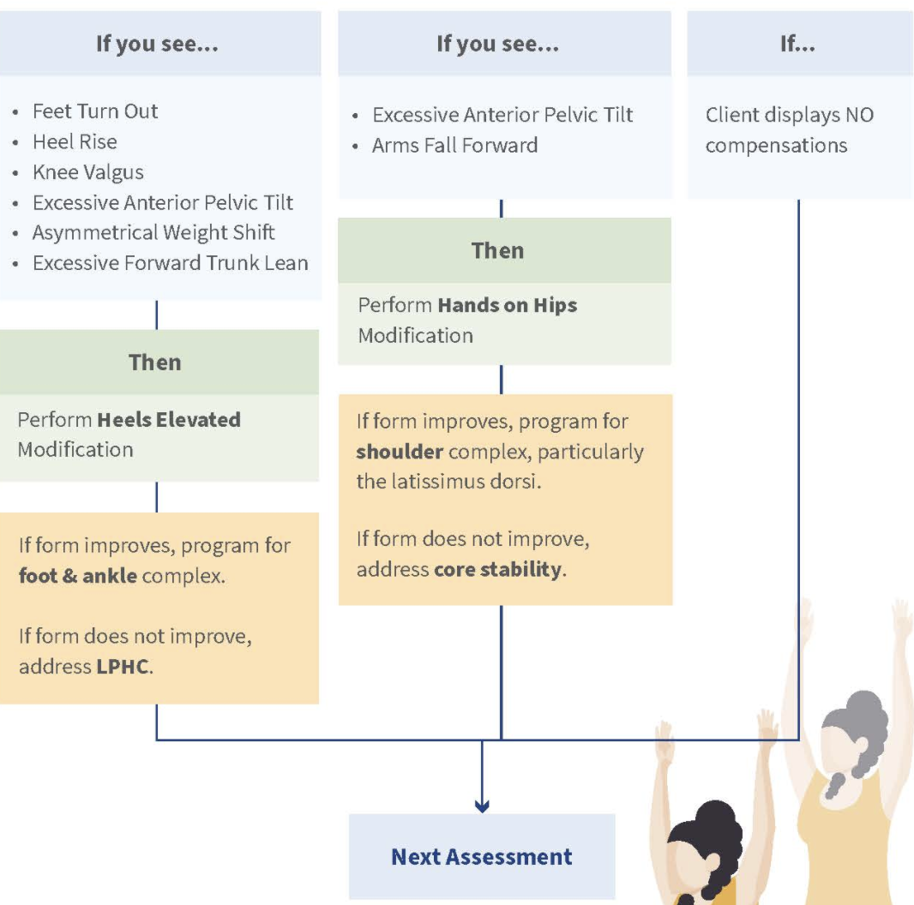
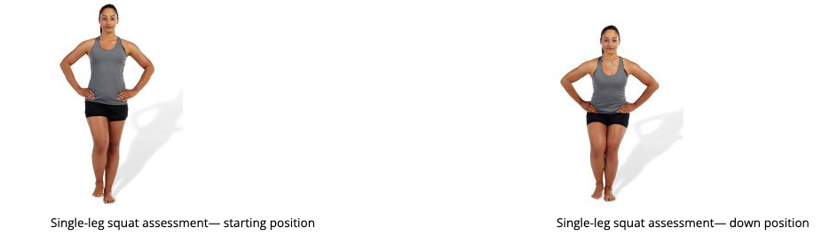

## Introduction

+ Movement assessments are the cornerstone of a comprehensive and integrated assessment process

### Types

#### Transitional assessments: movement without a change in the base of support

+ Include
  + Overhead squat (OHSA): start here, do not proceed to more challenging assessments if demonstrates compensation/ impairment
  + Modified overhead squat
  + Single-leg squat (SLS)
  + Split squat

#### Loaded assessments: under an additional source of resistance

+ relate to Primary movement patterns: Common patterns of functional movement used by all humans.
+ include
  + Push
  + Pull
  + Overhead press
  + Trunk rotation
    + Common compensation
      + leaning towards rotation direction (instead, maintain upright)
      + Shrugging
      + if over ROM, will reach with arm or raise shoulder up
    + modification
      + keep outer foot steady, rotate hip and inner leg, hip internal rotation, can strengthen foot for pes. good for client with limited hip internal rotation
      + allow pivoting of outer foot
  + Squat
  + Hinge: more forward lean than squat, a lot hip flexion
    + compensation
      + round lumbar spine: too much hip flexion, need more forward lean less drop down
      + Neck come up: neck needs to be inline with trunk
      + hip come forward too much after standing up
    + alternative
      + Romanian dead lift: little knee flexion, more activation of hamstring, drive hips forward while standing up
  + Split stance
  + Single leg and stepping
+ if a client refuses or is unable to perform the necessary transitional movement assessments, the Corrective Exercise Specialist can include these specific loaded movement assessments within the client’s workouts.
  + Loaded squat
  + Standing push
  + Standing pull 
  + Standing overhead dumbbell press

#### Dynamic assessments: with change in base of support

+ Goal
  + as a method of refinement and confirmation for what was observed in the transitional assessments (gait assessment)
  + add additional challenge to the movement assessment process for more advanced clients. (depth jump assessment and Davies test), reserved for those clients ready for plyometric or sport-specific activities.
  + perform dynamic assessments in the fastest manner that can be safely controlled and discouraged from rushing through the movement carelessly. 
+ Gait (walking) assessment
+ Depth jump assessment
+ The Davies test

### Kinetic Chain Checkpoints

+ Anterior: The anterior view is used to assess frontal and transverse plane movements (adduction, abduction, elevation, and rotation)
+ Lateral: The lateral view is used to assess sagittal plane movements (flexion and extension)  
+ Posterior: The posterior view is used to assess foot and ankle pronation, asymmetrical weight shift, and scapular elevation 

### Common movement impairments

+ muscle imbalances → compensatory strategies → observable movement impairments

  + Explaining to clients: Referring to compensations as “movement strategies” or “habits that their body prefers” will not only make more sense to the client, but also avoid sounding too negative, clinical, or serious.

+ Excessive pronation
  Look for the arch of the foot to collapse and flatten, eversion of the heel, or malalignment of the **Achilles tendon**.

+ Feet turn out

  Look for the toes to rotate laterally during the movement (aka foot abduction).

+ Heel rise
  Look for the heel to come off of the ground during the movement.

+ Knee valgus
  Look for the knees to collapse inward.

+ Knee varus
  Look for the knees to bow outward.

+ Knee dominance
  Look for an upright trunk, the knees to move in front of the toes, and/or for more knee anterior displacement compared to hip posterior displacement; that is, the knees move forward more than the hips move back. May be seen with heel rise.
  

+ Asymmetric weight shift
  Look for the hip to shift toward one side or the other. The side of the body opposite the shift may also exhibit the hip dropping in the frontal plane.

+ Excessive trunk movement
  Look for instability of the trunk when in a push-up position (specifically during the dynamic Davies test).
  

+ Excessive anterior pelvic tilt
  Look for the pelvis to roll forward and for the lumbar spine to extend beyond normal curvature, creating a prominent low-back arch.

+ Excessive posterior pelvic tilt

  Look for the pelvis to roll backward and for the lumbar spine to flex, creating a flattening or rounding of the lower back.

+ Excessive forward trunk lean
  Look for the trunk to lean forward and beyond ideal parallel alignment with the shins.

+ Trunk rotation
  Look for the trunk of the body to rotate internally or externally during single-leg movements.
  

+ Scapular elevation
  Look for the shoulders to move up toward the ears.

+ Scapular winging
  Look for the scapulae to protrude excessively from the back, seen most prominently in a push-up position (specifically during the dynamic Davies test or when pushing).
  

+ Arms fall forward
  Look for the arms to fall forward to no longer be aligned with the torso and ears.

+ Excessive cervical extension (forward head)
  Look for the head to migrate forward, moving the ears out of alignment with the shoulders.
  

+ Muscles listed as overactive/shortened and underactive/ lengthened are ones that best meet the following criteria:

  Biomechanical properties (i.e., the motion created or allowed by the muscle)
  Tendencies of muscle group activity (e.g., the gluteus maximus is usually underactive)
  Solution practicality in most settings (e.g., it is not realistic to program inhibition of the subscapularis in a nonclinical setting)
  Programming efficiency in most scenarios (e.g., performing activation of the medial hamstrings will also involve other tibial internal rotators)

## Transitional Movement Assessments

+ neuromuscular system is capable of making real-time adjustments to its performance, so even a client with present muscle imbalances can achieve good form for a few repetitions when they know what ideal form is supposed to look like.  the client should be initially instructed on how to perform each movement assessment with minimal information about what ideal posture looks like. 

### OHSA

+ first movement assessment that will be used for all clients and will serve as the qualifier to determine which additional movement assessments should be used

#### Procedure

**Starting Position**

The individual stands with the feet hip-to-shoulder-width apart and pointed straight ahead and parallel. The foot and ankle complex should be in a neutral position. The assessment should be performed with the shoes off if possible to best view the foot and ankle complex.Have the individual raise their arms overhead, extended and aligned with the torso.

**Movement**

Instruct the individual to squat to a depth that brings the femur parallel to the ground (roughly the height of a chair) and then return to the starting position. The squat depth can also be reduced if the client has discomfort with a deeper squat. Have the client repeat the movement for five repetitions, observing from anterior, lateral, and posterior views (five repetitions for each viewpoint).

#### Observation

From the *anterior view*, look for the following potential movement impairments:

- **Foot and ankle:** Feet turn out
- **Knee:** Valgus or varus
- **LPHC:** Asymmetric weight shift
- **Shoulder:** Scapular elevation

From the *lateral view*, look for the following potential movement impairments:

- **Foot and ankle:** Heel rise
- **Knee:** Knee dominance
- LPHC:
  - Excessive anterior pelvic tilt
  - Excessive posterior pelvic tilt
  - Excessive forward trunk lean
- **Shoulder:** Arms fall forward
- **Head and cervical spine:** Forward head

From the *posterior view*, look for the following potential movement impairments:

- **Foot and ankle:** Excessive foot pronation
- **LPHC:** Asymmetric weight shift
- **Shoulder:** Scapular elevation

#### Modifications

+ Heels elevated: 
  + Spot changes in
    + knee valgus may be an impairment due to a lack of ankle dorsiflexion or muscle imbalances at the hip, such as overactive adductors and underactive gluteals
    + Excessive forward trunk lean
  + if corrected: foot and ankle complex. if not: LPHC.
+ Hands on hips
  + Spot changes in: anterior pelvic tilt 
  + If corrected: tight latissimus dorsi, if not: hip

### Single leg Squat

+ the most challenging of the lower extremity transitional assessments 
+ Assess:
  + hip abductor strength
  + issues with trunk rotation
+ avoided for clients who are at risk for falls and loss of balance or are recovering from a knee injury (knee pain).

#### Procedure

**Starting Position**

1. The individual should stand on one leg with the hands on the hips and eyes focused forward.
2. The stance foot should be pointed straight ahead and the foot, ankle, knee, and the LPHC should be in a neutral position.
3. The non-weight-bearing knee should be flexed with the foot next to, but not touching, the stance limb’s calf.

**Movement**

1. Have the individual squat as deep as is comfortable and controllable, and return to the starting position.
2. Perform up to five repetitions per viewpoint, then repeat on the opposite leg. Perform at a comfortable pace without using momentum to bounce out of the bottom.

#### Observation

- **Anterior:** View the feet, knees, and LPHC from the front. The feet and hips should remain in the sagittal plane with the knees tracking in line with the foot (second and third toes). The LPHC should remain level and not rotate or shift from side to side beyond what is needed to first obtain balance.

- **Lateral:** View the feet, ankles, knees, and LPHC from the side. The heel should stay on the ground. The pelvis and spine should remain in a neutral posture. The torso should remain parallel with the tibia.

- **Posterior:** View the feet and ankles from the back. The arch of the foot and calcaneus should remain in a neutral position.

  From the *anterior view,* look for the following potential movement impairments:

  - **Knee:** Valgus or varus
  - LPHC:
    - Asymmetric weight shift
    - Inward trunk rotation
    - Outward trunk rotation

  From the *lateral view,* look for the following potential movement impairments:

  - **Foot and ankle:** Heel rise
  - **Knee:** dominance
  - LPHC:
    - Excessive anterior pelvic tilt
    - Excessive posterior pelvic tilt
    - Excessive forward trunk lean

  From the *posterior view*, look for the following potential movement impairments:

  - **Foot and ankle:** Excessive foot pronation

### Split Squat

+ Goal
  + mimics the stance required of a walking and running gait as well as many other activities of daily living
  + assessing an individual’s balance and hip and knee extensor strength
+ Can be used in 2 ways
  + regression to the single-leg squat.
  + gain more information for programming decisions related to split-stance movements (e.g., walking lunges, split jumps, Olympic lifting, etc.). 
    + lthough walking and step lunges are sometimes used as assessments, evidence suggests that a static split squat places less stress on the knee and may be safer for clients, especially those recovering from knee injury

#### Procedure

**Starting Position**

1. The individual stands in a narrow, split stance with the feet parallel (no wider than hip-width) and pointed straight ahead. The step length should be sufficient for the back knee to contact the ground behind the front foot.
2. Have the individual place their hands on the hips while standing in an upright position.

**Movement**

1. Instruct the individual to lower to a depth that brings their rear knee just above the ground without touching and return to the starting position. The front foot should remain planted on the ground while the rear foot heel is allowed to rise.
2. Repeat the movement for five repetitions, observing from each position (five reps per view). Perform at a comfortable pace without using momentum to bounce out of the bottom.

#### Observation

From the *anterior view*, look for the following potential movement impairments:

- **Knee:** Valgus or varus
- LPHC:
  - Asymmetric weight shift
  - Inward trunk rotation
  - Outward trunk rotation

From the *lateral view*, look for the following potential movement impairments:

- **Ankles:** Heel rise (front foot)
- **Knee:** Knee dominance (front knee)
- LPHC:
  - Excessive anterior pelvic tilt
  - Excessive posterior pelvic tilt

From the *posterior view*, look for the following potential movement impairments:

- **Foot and ankle:** Excessive foot pronation

## Loaded movement Assessment

+ Application
  + customized formal assessment to gain additional information about the client. 
  + used with clients who refuse, or are unable, to perform the transitional movement assessments.
+ four of the body’s primary movement patterns: squatting, pushing, pulling, and overhead pressing.

### Loaded Squat Assessment

+ dynamic posture, core stability, and overall neuromuscular control while under external load. 

+ help determine which type of loaded squat a client might be ready to perform during workouts.

#### PROCEDURE

**Starting Position**

1. feet hip-to-shoulder-width apart and pointed straight ahead. shoes off 
2. Choose a resistance that will challenge the client without exhausting them while executing the weight placement (front, back, goblet, etc.) that is desired for exercise programming.

**Movement**

1. thighs parallel to the floor or normal chair height
2. 15 total repetitions, five reps per view at a 2-0-2 (medium) tempo.

#### OBSERVATION

From the *anterior view*, look for the following potential movement impairments:

- **Foot and ankle:** Feet turn out
- **Knee:** Valgus or varus
- **LPHC:** Asymmetric weight shift

From the *lateral view,* look for the following potential movement impairments:

- **Foot and ankle:** Heel rise
- **Knee:** Knee dominance
- LPHC:
  - Excessive anterior pelvic tilt
  - Excessive posterior pelvic tilt
  - Excessive forward trunk lean

From the *posterior view*, look for the following potential movement impairments:

- **Foot and ankle:** Excessive foot pronation

### Standing Push Assessment

+ performance of a horizontal pushing movement with both arms.
+ observe scapular and shoulder mechanics, upper extremity muscle activation patterns, and the stability of the LPHC and cervical spine and head. 
+ measure the muscle forces produced by the body, biomechanical loads on the spine and joints, and the movement efficiency of the human movement system
+ using a cable machine or resistance band.

#### PROCEDURE

**Starting Position**

1. Instruct the client to stand with the abdomen drawn inward, feet in a split stance, and feet parallel with toes pointing forward.
2. Have the client hold a handle in each hand.

**Movement**

1. Choose a resistance that will challenge the client without exhausting them.
2. The client will perform 10 repetitions at a 2-0-2 (medium) tempo.
3. Instruct the client to perform 5 standing push repetitions (chest press).
4. The client then switches the feet and performs the push again for another 5 repetitions.

If the client is not able to perform a standing push movement in a narrow, split stance, use one of the following modifications:

**Option 1:**  wider split stance. This testing position still assesses the upper extremity and cervical spine and head, but it decreases the challenge to the LPHC and the individual’s balance.

**Option 2:** The client performs the pushing movement seated on an upright chest-press machine.

#### OBSERVATION

From the *lateral view*, look for the following potential movement impairments:

**LPHC:**

+ Excessive anterior pelvic tilt
+ Excessive posterior pelvic tilt
+ Trunk rotation

**Shoulder:** 

+ Scapular elevation or winging

**Cervical spine and head:** 

+ Excessive cervical extension/forward head

### Standing Pull Assessment

+ performance of a horizontal pulling motion with both arms. 
+ evaluate scapular and shoulder mechanics, upper extremity muscle activation patterns, and the stability of the LPHC and cervical spine and head. 
+ cable machine or resistance band.

#### PROCEDURE

**Starting Position**

1. Instruct the individual to stand in a narrow, split stance with the toes pointing forward. The client positions the right foot forward and the left foot back.
2. The client holds a handle in each hand.

**Movement**

1. Choose a resistance that will challenge the client without exhausting them.
2. The client will perform 10 repetitions at a 2-0-2 (medium) tempo.
3. Instruct the client to perform 5 standing pull (row) repetitions.
4. The client then alternates the feet and performs the pull again for another 5 repetitions.

If the client is not able to perform a standing pull movement in a narrow split stance, use one of the following modifications:

- **Option 1:**  wider split stance to increase their base of support. 
- **Option 2:** seated on a forward row machine.

#### OBSERVATION

From the *lateral view*, look for the following potential movement impairments:

**LPHC:**

+ Excessive anterior pelvic tilt 
+ Excessive posterior pelvic tilt
+ Trunk rotation

**Shoulder:** 

+ Scapular elevation

**Cervical spine and head:**

+  Excessive cervical extension/forward head

### Standing Overhead Dumbbell Press Assessment

+ vertical pushing movements in their exercise programming. 
+ upper extremity strength and stability of the LPHC, scapula, and cervical spine and head in a manner that is similar to many sports

#### PROCEDURE

**Starting Position**

1. Instruct the individual to stand with their feet hip-to-shoulder-width apart and toes pointing forward.
2. Choose a dumbbell weight that will challenge the client without exhausting them.
3. The upper extremities should start at 90 degrees of horizontal abduction and 90 degrees
   of elbow flexion.

**Movement**

1. Instruct the individual to fully abduct the shoulders and extend the arms, pressing the dumbbells together overhead, and return to the starting position.
2. The client will perform 10 repetitions at a 2-0-2 (medium) tempo.

#### OBSERVATION

From the *lateral view*, look for the following potential movement impairments:

**LPHC:**

+ Excessive anterior pelvic tilt
+ Excessive posterior pelvic tilt

**Shoulder**:

+ Scapular elevation
+ Arms fall forward

**Cervical spine and head:** 

+ Excessive cervical extension/forward head

# Dynamic Movement Assessments

During the depth jump and Davies test assessments, an emphasis on movement speed and/or performance should be used to encourage dynamic movement from the client.

## Gait Assessment

+ real-world scenario
+ clinical applications of gait analysis often involve detailed breakdowns of muscle activation and movement patterns through the multiple phases of a complete gait cycle.
+ Corrective Exercise Specialist is interested in observing if movement compensations seen elsewhere will predictably reveal themselves during normal ambulation
+ not considered a performance test. at a speed that is consistent with their activities of daily living
+ helpful to take video recordings of the client from each viewpoint.

### PROCEDURE

**Starting Position**

1. The individual stands on a treadmill set at a 1-degree incline.

**Movement**

1. Instruct the individual to walk at a comfortable pace.

### OBSERVATION

From the *anterior view*, look for the following potential movement impairments:

- **Foot and ankle:** Feet turn out
- **Knee:** Valgus or varus
- **LPHC:** Asymmetric weight shift

From the *lateral view*, look for the following potential movement impairments:

+ **LPHC:**Excessive anterior pelvic tilt/ Excessive posterior pelvic tilt

From the *posterior view*, look for the following potential movement impairments:

- **Foot and ankle:** Excessive foot pronation

## Depth Jump Assessment

+ jumping and landing tasks. 
+ same biomechanical movement pattern as the overhead squat, just progressed into an open chain, dynamic setting
+ predictor of repeat ACL injuries in those who display knee valgus, knee dominance, and hip internal rotation
+ a performance test and a maximal vertical jump should be encouraged in the explanation of the movement.
+ moving fast, take video recordings of the client from each viewpoint. 
+  landing imposes higher load and greater difficulty than jumping. Thus, it may be more beneficial to observe impairments during landing versus jumping.
+ deeper hip and knee flexion angles decrease biomechanical stress on the knee (Tsai et al., 2017), allowing soft tissues, rather than joints, to absorb the forces of landing. 
  + *stiff landing* by not allowing their hips and knees to bend adequately (e.g., knees < 90 degrees). 
  + This may be due to issues such as, but not limited to, motor weakness, poor form, or a mobility deficit in the lower kinetic chain. 
  + *asymmetric contact*, preferentially landing on one leg more than the other. This may also be due to motor weakness, poor form, mobility deficits, or prior injury 
+ client should be allowed one to two practice repetitions of the depth jump assessment before assessing the movement.

### PROCEDURE

**Starting Position**

1. The individual stands on a 12-inch box.
2. A target line is drawn on the floor 12 inches in front of the box.

**Movement**

1. The individual is instructed to hop off of the box and land with both feet just after the line.
2. Upon the initial landing, the client should quickly jump up for maximum height.
3. The client will then land a second time under control.
4. The number of repetitions may vary for each client depending on their ability to perform under fatigue. **One to three** repetitions per view are recommended as a starting point, following an opportunity to practice the movement after a demonstration.

### OBSERVATION

Anterior

- **Foot and ankle:**
- Feet turn out
- Excessive pronation
- Asymmetric contact/landing
- **Knee:** Valgus or varus
- **LPHC:** Asymmetric weight shift

From the *lateral view*, look for the following potential movement impairments:

- **Knee:**
- Knee dominance
- Stiff landing
- **LPHC:**
- Excessive anterior pelvic tilt
- Excessive posterior pelvic tilt
- Excessive forward trunk lean

## Davies Test

+ repetitive, plyometric activity for the upper extremity. upper extremity agility, strength and stabilization, and stability of the trunk and LPHC 
+ after the client can complete the standing push assessment with ease and after ensuring that they can safely begin upper extremity plyometric-style activities. not be suitable for individuals who lack shoulder stability, have current shoulder pain, or lack the functional strength to perform a push-up.
+ a performance test, and a maximal number of repetitions during the 15-second testing period should be encouraged in the explanation of the movement. 
+ Bringing in a third individual to help time and count repetitions of the Davies test can be extremely helpful. This will allow the fitness professional to focus attention on the client’s form and performance while the helper handles the stopwatch and counting tasks.

### PROCEDURE

**Starting Position**

1. Place two pieces of tape on the floor 36 inches (approximately 90 centimeters) apart.
2. Have the individual assume a push-up position with one hand on each piece of tape.

**Movement**

1. Instruct the individual to quickly move the right hand to touch the left hand and then move the left hand to touch the right hand.
2. The individual’s body weight should shift over the planted hand as they touch it with the floating hand, while maintaining postural control and minimizing unnecessary trunk motion (e.g., excessive rotation).
3. Perform alternating touching on each side for 15 seconds and record both the number of times a line is touched by both hands and movement impairments observed.
4. Perform for three trials.

### OBSERVATION

From the *lateral view*, look for the following potential movement impairments:

**LPHC:**Excessive anterior pelvic tilt

Excessive posterior pelvic tilt

Excessive trunk movement

**Shoulder:**Scapular elevation Scapular winging

**Cervical spine and head:** Excessive cervical extension/forward head

# Assessment Implementation Options

+ primary :  overhead squat.
+ second option to consider is that a comprehensive battery of the assessments covered in this chapter can become a client’s entire first workout. 
+ Third, using movement assessments to build their client base. Offering 30- to 45-minute complimentary assessment sessions that take prospective clients through the assessment process can be a fantastic way to attract new members, sign new clients, and generate revenue.

# Quiz

