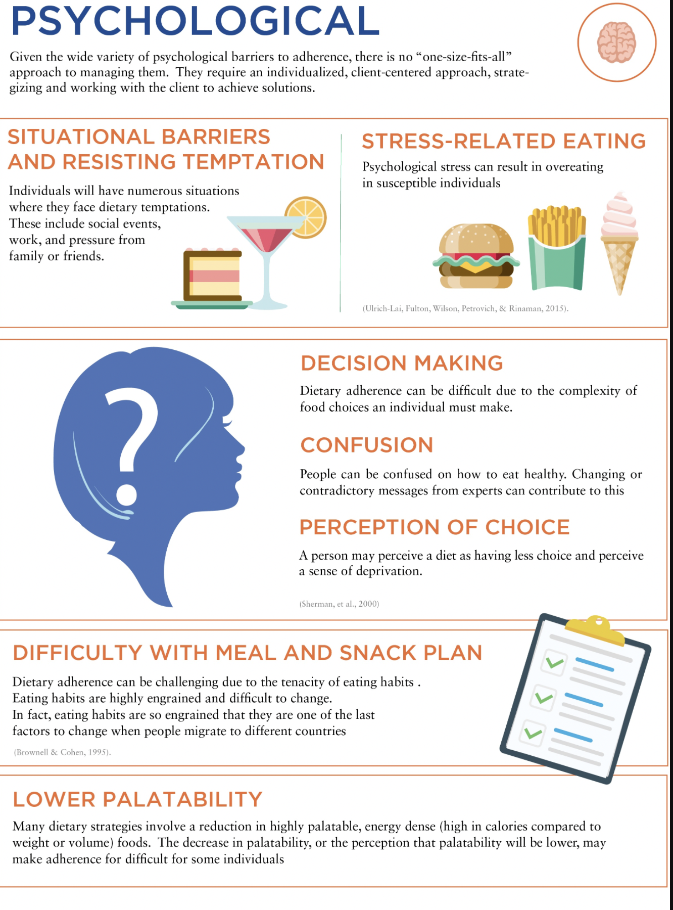
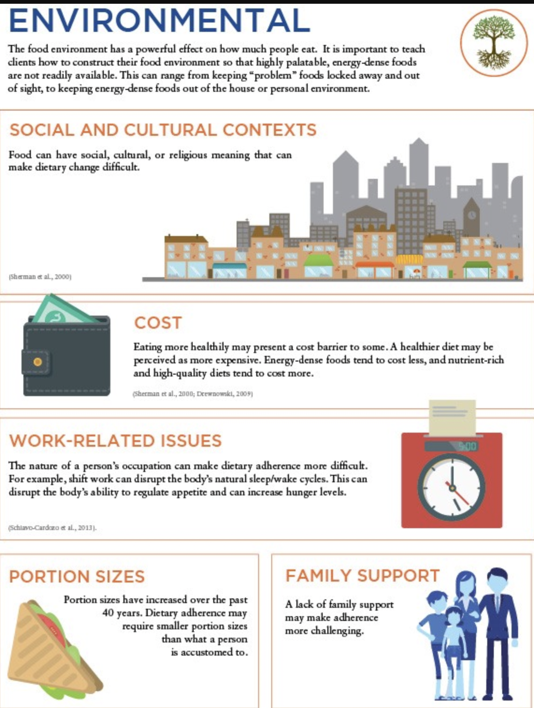
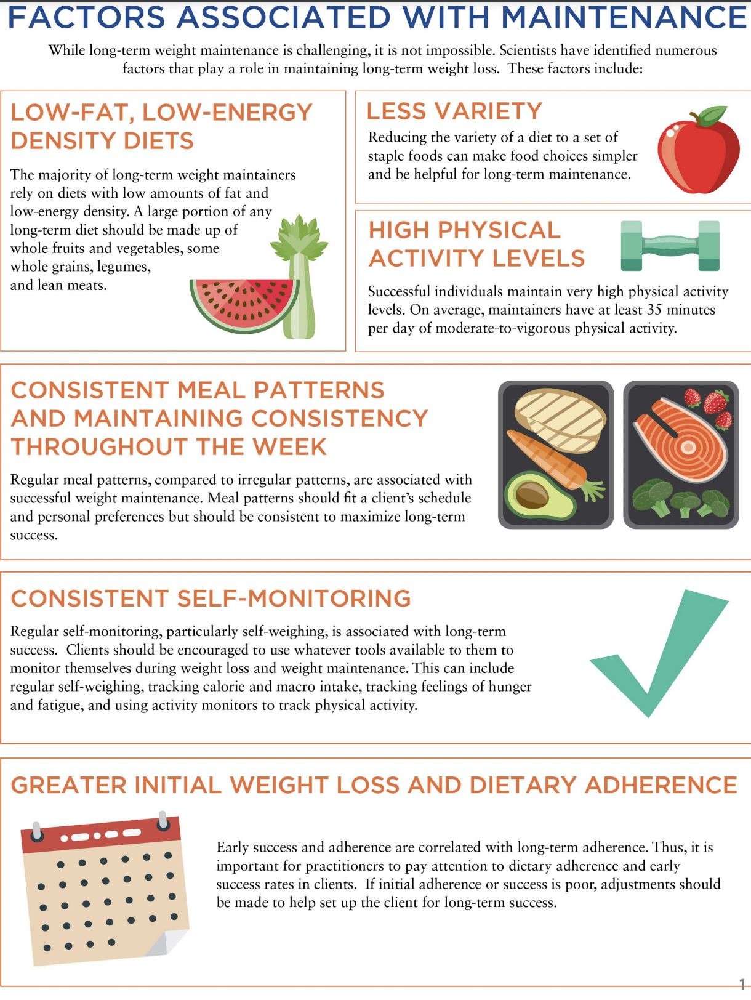
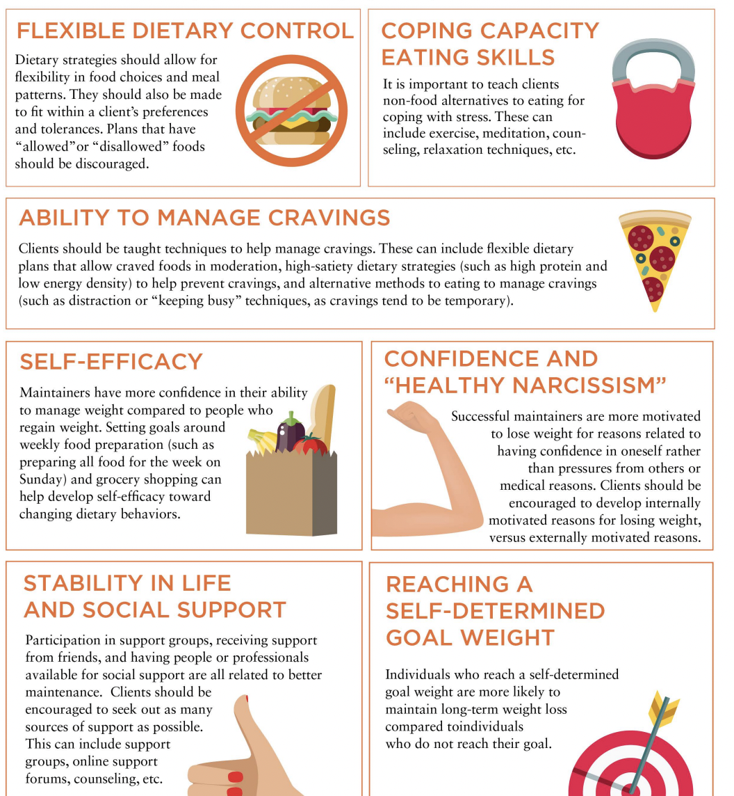

## Weight loss plateaus

+ Two major challenges that people face include weight-loss plateaus and preventing weight regain
+ Only 17% of adults in the United States sustain a 10% weight loss after 1 year
+ Plateau
  A period of stalled progress of 1 month or longer.
+ Weight change is a function of energy balance. If weight loss stops, it means there is no longer a deficit. Energy consumption has reached a new equilibrium with energy expenditure. 
  + Energy Balance
    The amount of calories consumed compared to the amount of calories expended.

### Lapses in Dietary Adherence

+ Weight-loss success is strongly related to dietary adherence rather than diet type or macronutrient composition
  + Dietary Adherence
    The degree to which an individual sticks with a diet.
  + people with low dietary adherence show greater weight regain at 1 to 2 years compared to people with high adherence
+ Energy expenditure adaptations (decreases in metabolism and physical activity) are not a major factor in weight-loss plateaus

+ Weight loss projection tool: https://www.niddk.nih.gov/bwp

### Causes of Dietary Adherence Lapses

- Physiological: When the body is placed in an energy deficit, there are strong signals to try to bring the body back into energy balance.
  - increase in appetite: reduced obese people (i.e., obese people who have lost significant weight) do not experience a decrease in hunger during overfeeding, causing inadvertently overeating, hitting a weight plateau, or regaining weight.
  - biological drive to increase calorie intake by approximately 100 calories for every kilogram of weight loss
  - important to help clients structure their plan to maximize satiety and adherence
  - important to empathize with clients during lapses and understand how they might be feeling.
  - After 2 years, energy intake has returned to baseline and appetite remains elevated.
- Psychological
  
- Environmental
  - The abundance of hyperpalatable, energy-dense foods has a significant role in the obesity epidemic
    - Hyperpalatable
      Foods that are ultra-processed and made to be highly appealing to our senses.
    -  important to teach clients how to construct their food environment so that highly palatable, energy-dense foods are not readily available. This can range from keeping problem foods locked away and out of sight to keeping energy-dense foods out of the house or personal environment
  - 

## Cognitive Reframing

+ important to educate the client about the near-certainty of plateaus and that they are a normal part of the weight-loss journey.
  + plateaus can be viewed as successful weight-loss maintenance at a lower body weight.
  + considered maintenance practice or opportunities to test program sustainability.
    + Maintenance Practice
      Periods of body weight plateaus where a client practices maintenance of habits and becomes used to the new body weight.
+ Re-Establishing an Energy Deficit
  + Reduce intake
    + Approaches
      + Reduction in energy density of food choices (i.e., food with similar volume but less calories)
      + Reduction in portion size
      + Reduction in frequency of intake
      + use of meal-replacement powders or ready-to-eat low-calorie meals for a short period of time can be useful - tighter control of calorie intake
    + If the self-reported calorie intake is already low (such as 1,000 to 1,200 calories per day), further lowering calorie intake may not be an option
      + People often underreport how much they really eat, sometimes by significant amounts 
      + an increase in prescribed calorie intake may be useful, as it may improve adherence
  + Increase expenditure
    + Approaches
      + Increasing formal exercise volume
      + Increasing nonexercise physical activity
      + Increasing recreational physical activity
  + Guidelines
    +  If there is room to decrease calorie intake and a client’s self-reported hunger levels are not too high, then reducing calorie intake may be the best method.
    + If there is room to decrease calorie intake but hunger levels are high, then an increase in activity may be a better option.
    + If calorie intake is already low and the client is reporting accurately, then an increase in activity is preferable.
    + If calorie intake is low but underreporting is suspected, then an increase in calorie intake (to improve adherence) or efforts to improve self-reporting accuracy combined with an increase in activity may be best.
    + If there is not much room to increase formal exercise in the client’s daily schedule, then efforts to improve recreational activity or nonexercise activity (particularly in short bouts throughout the day) may work best.
+ Improving diet adherence
  + Physiological 
    + While larger deficits may result in greater weight loss and possibly create more buy-in, they do so at the expense of greater hunger and possibly lower adherence. For example, people who try to adhere to a 30% deficit do no better than people who are prescribed a 10% deficit
    + Improve satiety
      + Lower energy density, higher protein, and higher fiber intakes are all associated with greater satiety
        + Energy Density
          The amount of calories relative to the volume or weight of a food, often expressed in calories per gram.
      + Reducing food variety and palatability can also help improve satiety, but this must be balanced with the person’s individual preferences and ability to adhere.
        +  buffet effect refers to the tendency of people to eat more when there is a large variety of food. This is why decreasing variety may help with satiety and adherence.
    + Higher physical activity levels are associated with better adherence (Downer et al., 2016), perhaps due to lower brain responses to food cues (Luo, O'Connor, Belcher, & Page, 2018) and better appetite regulation.
    + modified foods (such as artificially sweetened foods) can enhance adherence through the substitution of lower-calorie versions of a person’s preferred foods
  + Environmental
    + Reduce food cues and visibility
    + Create effort barriers
      + Keep less-healthy food in a locked cabinet.
      + Keep foods in a less-prepared form (e.g., whole oranges versus sliced oranges).
      + Only keep foods in the house that need to be prepared or cooked (not premade or prepackaged).
      + Keep energy-dense and problem foods out of the personal environment.
    + Optimal Foraging Theory (OFT) refers to how human brains assign value to food. OFT is defined by the calories gained from a food relative to how much energy and time is needed to obtain it. Energy-dense foods provide a lot of calories and are easy to obtain and, thus, provide high value to the brain. Making such foods difficult to obtain (like keeping them out of the house) reduces the value of these foods.  
  + Psychological
    + Education: behavioral education will help promote dietary adherence more than nutrition education 
    + Motivation: 
      + increasing awareness of the benefits of progressing toward and achieving goals.
      + sense of personal control and self-efficacy
      + increasing the perceived benefits of goal achievement and weight loss while decreasing the perceived costs 
    + Awareness of a plan and goals associated with that plan: 
      + very-specific plans to engage in a particular behavior are more likely to carry it out 
  + Active self-regulation and self-monitoring: 
    + Teaching people the behavioral skills to navigate obstacles and temptations
    + e.g. consumes a high-protein snack before going to a social event
  + Social support: 
    + encouragement tends to work better than warnings 
  + Cognitive and behavioral skills:
    + cognitive reframing of lapses as temporary setbacks rather than failures.
  + Flexible over rigid approaches:
  + Managing feelings of deprivation: 
    + modest deficits, flexible dieting approaches, and avoidance of dichotomous thinking around food and diets
  + Tailoring dietary characteristics to the individual: 
    + macronutrient distribution, food choices, and the continuity of the diet

## Long-Term Weight Maintenance

+ Cause of challenge: 
  + Impaired Satiety Signals
    A loss of effectiveness of the signals that travel to the brain and tell people they are full.
  + If clients are tracking well on weekdays but not weekends, and if they are not losing weight, it is likely due to a loss of adherence and high-calorie intakes on the weekends. 

+  If it is obvious that a client is struggling with adherence early in a program, it is important to make rapid adjustments.
+ Set boundaries: triggers for action. For example, a red-light number can be a body weight at which, if a client exceeds it, they should seek professional help to make sure no further regain occurs. Say a client loses 30 pounds. The client might set a red-light number at a 10-pound regain. 
+ Factors associated with weight regain
  + Sedentary lifestyle: 
    + physical activity energy expenditure is low (1,000 calories per week)
    + Low leisure time
  + Disinhibited eating
  + Dichotomous view of foods and a rigid approach to dieting
  + Binge eating
  + Emotional eating, psychosocial stress, and low coping capacity
  + Lack of social support
  + Psychopathology: Depression
  + Medication-induced appetite elevation: glucocorticoid
  + Excessive loss of fat-free mass: predictor of subsequent weight regain
  + Diet burnout: Prescription of maintenance breaks can also be useful.

+ Weight cycling history
  + Weight Cycling
    Repetitive cycles of weight loss followed by weight regain where most or all of the weight is gained back.
  + alter a person’s confidence to be able to achieve long-term success.
+ Diet Breaks as an Adherence Tool
  + Intermittent Dietary Strategies
    Alternating periods of energy restriction with periods of maintenance or diet breaks.
  + 