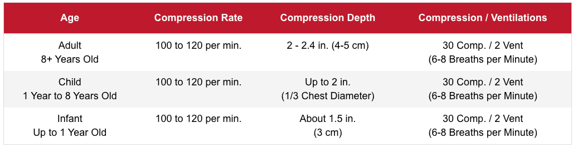

# CPRAED

+ Intro
  + without oxygen properly delivered, irreversible brain damage and multi-system organ failure happens in 4-6 mins
  + initial treatment: High-Quality, “Fast-n-Hard” Cardiopulmonary Resuscitation, double change of survival and reduce permanent brain injury
  + Chain of survival
    + Early access: Call 911
    + Early CPR: oxygenate vital organs
    + Early Defibrillation with AED/ defibrillator: return heart to normal rhythm
    + Advanced care by EMD personnel
  + Heart attack symptoms
    + chest pain: must be treated as heart attack if > 10 mins of chest pain. center of chest, a few minutes come and go, pressure feeling
    + Upper body discomfort/ pain: pain radiation
    + shortness of breath
    + Others:
      + feeling of impending doom
      + nausea and vomiting
      + cold sweats (cool, clammy, sweaty skin)
    + 1/3 did not have chest pain
  + Good Samaritan laws
    + protect voluntter rescuers from being prosecuted/ sued
    + If rendering first-aid care of any type to a victim, you are not permitted to leave them alone unless:
      - \- It is necessary to call for help (911)
      - \- Another rescuer with equal or higher qualifications takes over care of the victim
      - \- Continuing care becomes dangerous/unsafe for the rescuer
      - \- The victim refuses your first-aid care
  + Consents
    + Informed: if victim refuses help, call 911
    + Implied, if an adult or child is:
      + Unconscious/unresponsive
        Pulseless/breathless
        Delusional/confused
        Intoxicated after ingesting alcohol/drugs
        Deemed mentally unfit to make decisions regarding their own safety
        Responder has a reasonable belief that any of these conditions exist
        If the legal parent or guardian of a conscious child is not immediately reachable
        (In that situation, you will act just as the parent or legal guardian would in making decisions for the child)
    + Parental consent (< age 18): if parent are present
  + Precaution: treat all as communicable disease
    + PPE
      + latex exam gloves
      + one-way valve CPR masks
      + goggles
    + Clean up
      + remove contaminated material and discard in biohazard bag
      + wash hands
+ CPR
  + Steps
    + Check scene: hazards (signs of violence, fire, smell)
    + Check victim consciousness (‘are you okay?’/ tickle bottom of feet for infant), 
    + Phone: 911 immediately, or after 2 mins of CPR on child
    + React
  + Lay-person Rescuer
    Adult: 8 years-old to adult
    Child: 1-year-to 8-years-old
    Infant: 1-month to 1-year-old
    Newborn: < 1-month-old
  + 
+ Adult CPR
  + CABD
    + Compression: 
      + center of sternum on the line between nipples, 2 inches above the xiphoid process (“notch”), 
      + keep fingertips off
      + shoulder directly above hands
      + 100-120 / min (or else ineffective, allow chest fully recoil before another compression)
    + Airway
      + Gently push down on the forehead while lifting the chin to effectively open the victim’s airway
      + Avoid lifting on the chin too hard
    + Breathing
      + 2 breaths, 1 s each
    + Defibrillation
      + Attach
        + Turn on AED
        + Expose victim’s chest, clean and dry
        + apply AED pad
        + “Clear, everyone stand clear”
        + Analyze caridac rhythm
      + Shock
        + “Clear, everyone stand clear”
        + push shock button
  + Two rescuer: 
    + 1 CPR 1 911
    + alternate: 1 CPR 1 breath
+ Child CPR
  + Compression: 1 or 2 hands
  + Breath: too high pressure cause gastric distension
+ Infant CPR
  + Check consciousness: tapping, tickling bottom of foot and making noise
  + Compression: just below nipple line, compress use two fingers just above xiphoid process
+ Compression Only -CPR
  + "Hands-only" CPR is now considered appropriate for infants and children when the only person available to render care is not trained in rescue breathing
  + Chest compressions should only be stopped when;
    - The victim shows obvious signs of life such as breathing/moving
    - EMS arrives to take over care of the victim
    - An AED is attached and prepared to analyze/shock the victim
    - The scene becomes too unsafe to continue
    - Total exhaustion prevents continuing care
+ Recovery position
  + **Place the potentially injured victim in the recovery position by:**
    - \1. Make sure the victim is lying flat on his/her back (supine) and as straight as possible
    - \2. Kneel beside the victim about half-way up their body (in the area of their abdomen)
    - \3. Gently; raise their closest arm above their head and place the opposite arm across the chest with their hand cupping the side of their neck
    - Bend the victim's leg at the knee opposite to you (will prevent them from moving or rolling onto their stomach)
    - \5. Gently; roll the victim toward you with both your hands spread equally (1-hand on their hip and the other on their shoulder) so that their head rests on the initially raised arm (This now places the victim on their side)
+ Chocking
  + Prep
    + Ask “are you choking”
  + Conscious Choking adult 
    + Foreign-Body-Airway-Obstruction (FBAO)/Partial Occlusion: wheezing or high-pitched squealing sound, encourage to cough
    + Foreign-Body-Airway-Obstruction/Complete Occlusion: abdominal thrusts
      + Abdominal thrusts
        + stand behind victim (kneel for kid)
        + Make a fist with one-hand and place the thumb side of that hand down into the victim's abdomen just above their "belly-button" (umbilicus)
        + Deliver forceful, yet gentle (not jerking or jabbing) inward and upward abdominal thrusts
      + If victim too large: victim stand against wall, push
      + Pregnant victim: from center of chest (sternum)
      + Self: abdominal thrusts on self, or press into object (char eg.)
  + Unconsicous
    + Lie flat
    + Compress center of chest, 30 times
    + Tilt head, remove expelled material
    + rescue breath
  + Infant
    + Concious
      + face down, chest on my forearm
      + 5 back elbows between shoulder blades with a flag hand
      + turn supine, 5 chest thrusts with 2-3 fingers
      + repeat
    + Unconcious: Infant CPR
+ AED
  + Process
    + turn on
    + Voice Prompt 1; "Remove clothing from the victim's chest”
    + Voice Prompt 2; "Attach the appropriate pads to the victim's chest as shown”
    + Voice Prompt 3; "Plug in the electrical connector”
    + Voice Prompt 4; "Analyzing rhythm, everyone stand clear”
    + Voice Prompt 5; "Shock Advised! Everyone stand clear; push the shock button, now"!
    + Voice Prompt 6; "Begin 5 cycles of CPR”
    + After 2 minutes of CPR the AED will announce that it is re-analyzing the victim
  + Considerations
    + shave chest hair
    + dry
    + remove medication patches and clean
    + not on top of medical devices, > 1’’ from pacemaker
    + can use adult pads on infants and children
    + pads not touching each other, if pads too large, place on on the back

