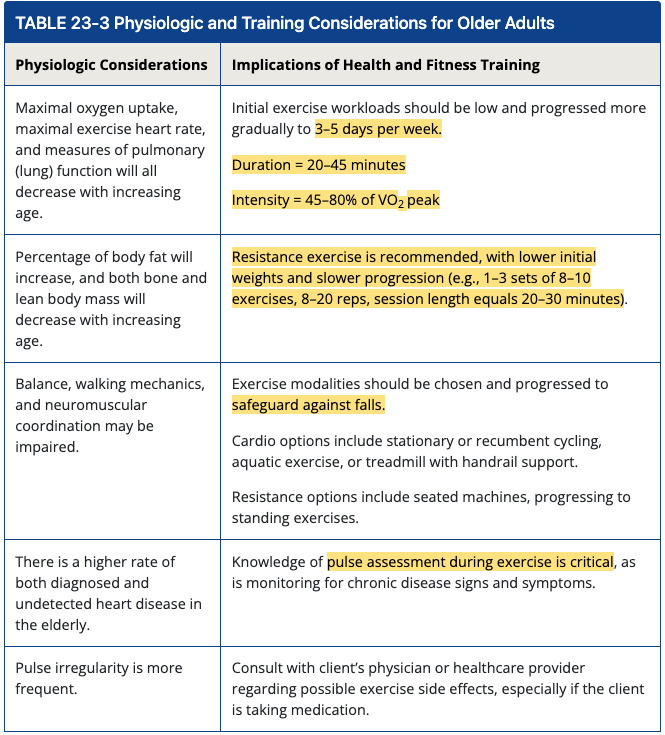
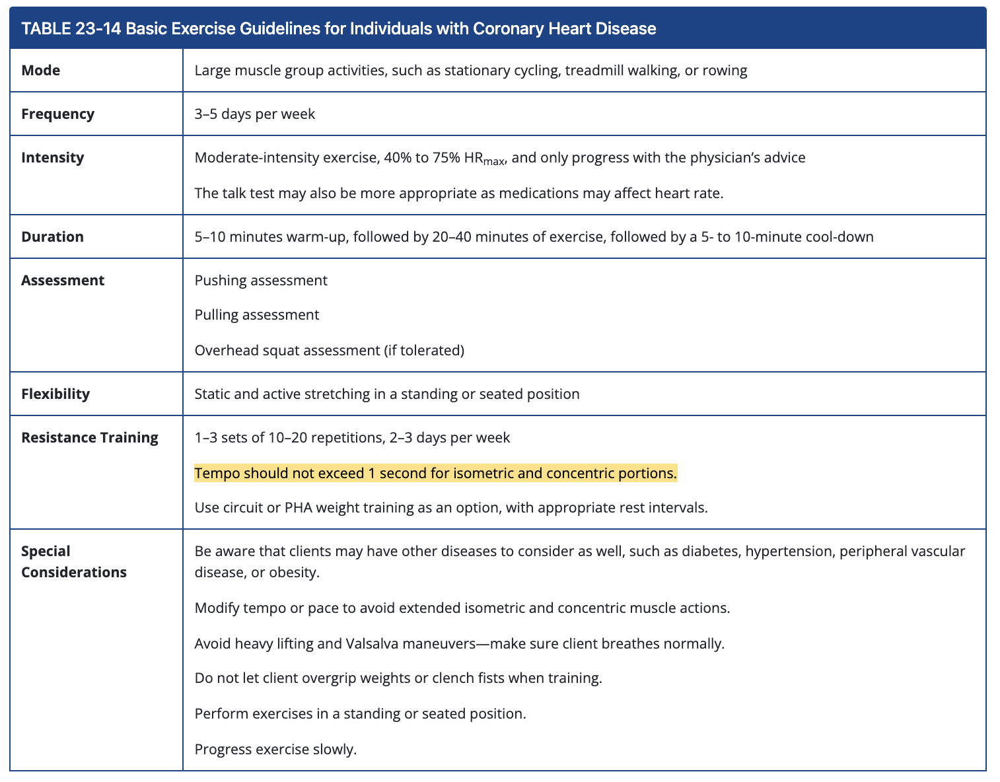

# C18 Plyometric Training Concepts

## Progression

1. Beginner
   1. Squat jump with stabilization
   2. Box jump-up with stabilization
   3. Box jump-down with stabilization
   4. Multiplanar jump with stabilization
2. Intermediate
   1. Squat jump
   2. Tuck jump
   3. Butt kick
   4. Power step-up
3. Advanced
   1. Ice skaters (also known as skater jumps)
   2. Single-leg power step-up
   3. Proprioceptive plyometrics
   4. Depth jump

To remember: sequence and start-end location of each drill

# C20 Resistance training

| Warm-up set             | 1-2 sets at a low intensity to psychologically and physiologically prepare for the resistance training exercise |
| :---------------------- | :----------------------------------------------------------- |
| Single set              | Performing one set of each exercise                          |
| Multiple set            | Performing a multiple number of sets for each exercise       |
| Pyramid                 | Increasing (or decreasing) weight with each set              |
| Superset                | Performing two exercises in rapid succession with minimal rest |
| Complex training        | Performing a multijoint or compound exercise, with a heavy load, immediately followed by an explosive movement (e.g., a barbell squat then a vertical jump) |
| Drop set                | Performing a set to failure, then removing a small percentage of the load and continuing with the set |
| Giant set               | Performing four or more exercises in rotation with as little rest as possible between sets |
| Rest pause              | Incorporating a slight pause between repetitions within a series of sets |
| Circuit training        | Performing a series of exercises, one after the other, with minimal rest |
| Peripheral heart action | A variation of circuit training that alternates upper and lower body exercises throughout the set |
| Split routine           | A resistance training routine that trains different body parts on separate days |
| Vertical loading        | A form of training in which strength training exercises are performed in rapid succession, starting with the upper " " |

# C21 OPT

# C22 Exercise Modality

| Exercise                   | Phase   | Goal                                | Pro            | Con                                         |
| -------------------------- | ------- | ----------------------------------- | -------------- | ------------------------------------------- |
| Strength training machines |         | Progress to less stable environment | Extra support  | Less training on stability                  |
| Free weights               |         |                                     | Needs spotting | Planes of motion, train stability, fat loss |
| Cable machines             |         |                                     | Versatile      |                                             |
| Resistance band            | 2, 5    |                                     |                |                                             |
| TRX RIP                    | 1, 2, 5 |                                     |                |                                             |
| Medicine ball              | 5       |                                     |                |                                             |
| Suspended body weight      | 1, 2    |                                     |                |                                             |
|                            |         |                                     |                |                                             |
|                            |         |                                     |                |                                             |
|                            |         |                                     |                |                                             |

# C23 Health Conditions and Special Populations

