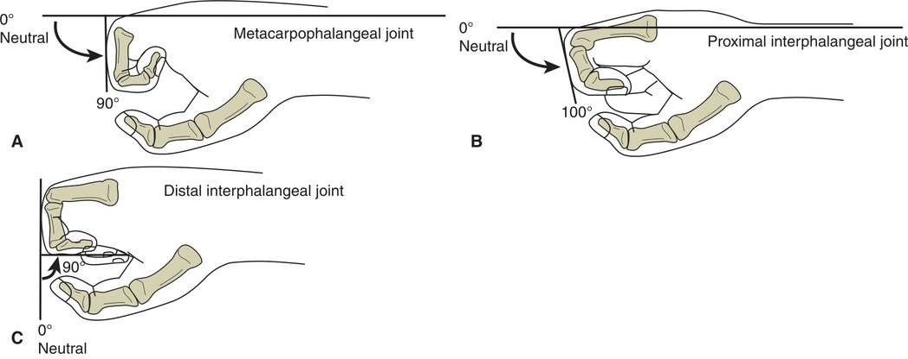
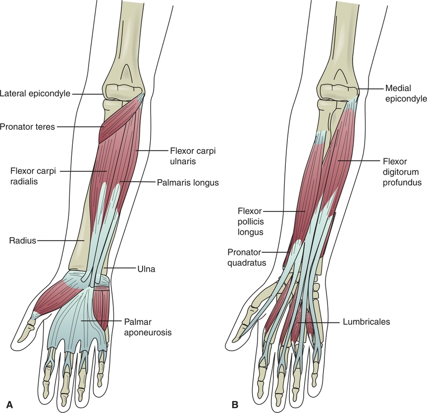
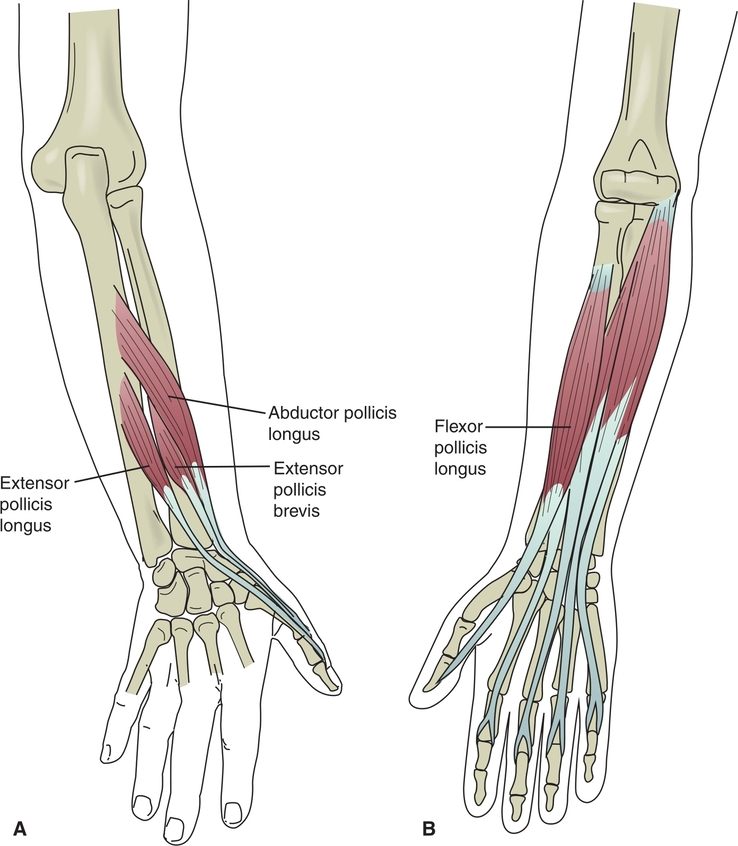

The wrist complex is made up of the articulations between the distal radius and the carpal bones. The distal ulna, which is considered more of a primary bone for the elbow, does not articulate directly with the carpals because a fibrocartilaginous disc separates it from the carpals. The function of the wrist, whether acting as a stabilizer or as a mover, affects the position and function of the hand. Because many of the muscle tendons that move the hand and fingers cross the wrist, their ability to generate power, lengthen when additional range of motion is needed, or produce fine intrinsic motion is influenced by the position of the wrist. In addition to the small articulations between each of the carpal bones, the wrist complex is composed of the radiocarpal and midcarpal joints ([Fig. 10.1](https://jigsaw.vitalsource.com/books/9780803675056/epub/OPS/c10.xhtml?favre=brett#fig10-1)). The bony structures and connective tissues related to these joints are examined first before studying the kinematics and muscles that control the wrist complex.

### BONY STRUCTURES

The distal end of the lateral radius forms the radial styloid process, and the ulna forms the ulna styloid process. The distal articular surface of the radius is concave in both the sagittal and the frontal planes and is tilted medially toward the ulna approximately 25° ([Fig. 10.2A](https://jigsaw.vitalsource.com/books/9780803675056/epub/OPS/c10.xhtml?favre=brett#fig10-2)). This tilt allows the wrist to move through a larger range of ulnar deviation compared with radial deviation. The radial surface is also angled about 10° toward the palm. This palmar orientation allows more flexion than extension at the wrist ([Fig. 10.2B](https://jigsaw.vitalsource.com/books/9780803675056/epub/OPS/c10.xhtml?favre=brett#fig10-2)). On the dorsal surface of the radius is the dorsal (Lister’s) tubercle. This bony area separates the tendons of the extensor carpi radialis brevis from the extensor pollicis longus ([Fig. 10.3](https://jigsaw.vitalsource.com/books/9780803675056/epub/OPS/c10.xhtml?favre=brett#fig10-3)).

The eight small carpal bones are arranged in two horizontal rows: The scaphoid, lunate, triquetrum, and pisiform make up the proximal row of the carpals, and the trapezium, trapezoid, capitate, and hamate make up the distal row ([Fig. 10.3](https://jigsaw.vitalsource.com/books/9780803675056/epub/OPS/c10.xhtml?favre=brett#fig10-3)). The pisiform is classified as a sesamoid bone because it is located within the flexor carpi ulnaris tendon. The scaphoid, lunate, and triquetrum articulate with the radius. The scaphoid and trapezium are located in what is referred to as the floor of the “anatomical snuff box.” The anatomical snuff box is located between the tendon of the extensor pollicis longus and the tendons of the extensor pollicis brevis (EPB) and abductor pollicis longus (APL); the depression between the tendons is the “floor,” where the scaphoid and trapezium are located ([Fig. 10.4](https://jigsaw.vitalsource.com/books/9780803675056/epub/OPS/c10.xhtml?favre=brett#fig10-4)). The scaphoid, lunate, and triquetrum are often involved with injuries of the distal radius; the scaphoid is the most frequently fractured carpal, followed by the lunate and then the triquetrum. In a scaphoid fracture, the snuff box floor is often painful and tender to palpation. Clinically, it is important to check someone who has sustained radius and ulna fractures similar to those in the x-ray in [Figure 10.5](https://jigsaw.vitalsource.com/books/9780803675056/epub/OPS/c10.xhtml?favre=brett#fig10-5) for signs and symptoms of a scaphoid fracture.

**Figure 10.1** Anterior view of the radiocarpal and midcarpal joints of the wrist. *(From Starkey C, Brown D*. Examination of Orthopedic & Athletic Injuries, *4th ed. Philadelphia, PA: F. A. Davis Company, 2015, p. 732, with permission.)*

**Figure 10.2** Medial **(A)** and palmar **(B)** tilt of the radial styloid process. *(From Roy S, Wolf SL, Scalzitti DA*. The Rehabilitation Specialist’s Handbook, *4th ed. Philadelphia, PA: F. A. Davis Company, 2013: p. 53, with permission.)* Figure

**10.3** Anterior view of the distal radius and ulna and the carpal bones. ***KIA\***

The capitate, the largest and most central bone of the wrist, is located between the hamate and the trapezoid. Its distal surface articulates with the base of the third metacarpal bone, providing rigid longitudinal stability to the wrist and hand. Ulnar and radial deviation of the wrist occurs around an axis through the capitate in a dorsopalmar direction. The trapezium forms a saddle-shaped articulation with the base of the first metacarpal of the thumb. The trapezoid, located between the capitate and the trapezium, articulates with the base of the second metacarpal. The hamate articulates with the fourth and fifth metacarpals and contributes to mobility of the ulnar side of the hand (see [Fig. 10.3](https://jigsaw.vitalsource.com/books/9780803675056/epub/OPS/c10.xhtml?favre=brett#fig10-3)).

### JOINT AND LIGAMENT STRUCTURES

The radiocarpal joint is made up of the distal biconcave surface of the radius, the articular disc, and the biconvex surfaces of the scaphoid and the lunate. The disc binds the radius and ulna at the distal radioulnar joint and separates this joint from the radiocarpal joint. The triquetrum functions as a component of the joint when the wrist is in full ulnar deviation as it comes in contact with the disc. Although there are several small intercarpal joints between the carpals, the midcarpal joint is considered the second main joint of the wrist. The joint consists of the articulation between the proximal and distal rows of carpals.

The extrinsic ligaments in the wrist attach the distal forearm to the wrist. The dorsal radiocarpal ligament supports the posterior aspect of the radiocarpal joint. It blends with the joint capsule and attaches to the lunate and triquetrum. The radial collateral ligament is a thickening of the lateral capsule of the wrist. The palmar radiocarpal ligaments are three ligaments between the radius and the carpals: the radioscaphocapitate, the radiolunate, and the radioscapholunate. These ligaments become taut as the wrist moves into terminal extension. The ulnar collateral ligament is located on the ulnar side of the wrist and is a thickening of the medial wrist joint capsule. The intrinsic ligaments of the wrist run between the carpal bones. These strong ligaments bind the distal row of the carpals to the base of the metacarpals ([Fig. 10.6](https://jigsaw.vitalsource.com/books/9780803675056/epub/OPS/c10.xhtml?favre=brett#fig10-6)).

### CARPAL TUNNEL

The flexor retinaculum and the extensor retinaculum are components of the ligamentous structures of the wrist. These connective tissue bands confine the tendons of the finger flexors and extensors, maintaining them close to the bony structures, and prevent “bowstringing” away from the carpals as they cross the wrist. The muscles are attached at each end and run in a straight line if the wrist is in neutral but have to curve with the wrist if it moves into flexion or extension. The retinaculum secures the tendons at the wrist so that they curve as the wrist moves. Without the retinaculum, they would not be held to the wrist as it curves with movement and would bow away from the skeleton. The transverse carpal ligament (TCL) is a component of the flexor retinaculum that runs between the hamate and pisiform medially and the trapezium and the scaphoid laterally. The extrinsic finger flexor tendons and the median nerve pass through the carpal tunnel on their way into the hand. The carpal bones make up the floor of the tunnel, and the TCL and flexor retinaculum form the roof. Because of this relatively inflexible space, the median nerve is susceptible to compression if the space is compromised ([Fig. 10.7](https://jigsaw.vitalsource.com/books/9780803675056/epub/OPS/c10.xhtml?favre=brett#fig10-7)).

**Figure 10.4** Anatomical snuffbox of the hand.

**Figure 10.5** X-ray shows fractures in the distal radius and ulna.

### KINEMATICS

At the wrist, the osteokinematic biaxial motions of flexion and extension occur in a sagittal plane around a frontal axis. Abduction of the wrist toward the ulna is termed **ulnar deviation;** abduction toward the radius is termed **radial deviation**. Ulnar and radial deviation occur around an anterior-posterior axis. In healthy joints, the average range of motion is 65° to 85° of flexion, 60° to 85° of extension, 15° to 21° of radial deviation, and 20° to 45° of ulnar deviation. [Figure 10.8](https://jigsaw.vitalsource.com/books/9780803675056/epub/OPS/c10.xhtml?favre=brett#fig10-8) illustrates the osteokinematic motions of wrist flexion and extension and ulnar and radial deviation.

### MUSCLES

The muscles of the wrist and hand function in a complex manner. Some of the muscles act in synergies that are challenging to inhibit. The muscles acting on the wrist  function to actively flex, extend, or ulnarly or radially deviate the wrist. In addition to this active movement of the wrist, and equally important, these muscles provide dynamic stabilization during finger and hand functions. With a strong stabilized wrist, the hand and fingers are able to produce either a dynamic grip or fine motor intrinsic movements. For example, a power grip making a fist recruits strong stabilization by wrist extensors, an action that is difficult to perform while inhibiting the wrist extensor muscles.

**Figure 10.6** Dorsal **(A)** and palmar **(B)** views of the wrist ligaments.

Other muscles cross several joints and require opposition by antagonist muscles to isolate their action to only the desired joints of motion. First, the individual action of the wrist and hand muscles is described, followed by analysis of how they function in synergistic movements. Refer to [Appendix B](https://jigsaw.vitalsource.com/books/9780803675056/epub/OPS/c10-AppB.xhtml), which follows this chapter, to view the specific origins, insertions, and neurological innervation of the muscles in the wrist and hand.

#### Wrist Extensors

The wrist extensor muscles have a common proximal attachment on the lateral humeral epicondyle and supracondylar ridge. The primary wrist extensors include the extensor carpi radialis longus, extensor carpi radialis brevis, and extensor carpi ulnaris. The extensor carpi radialis longus has the more superior attachment on the supracondylar ridge. The extensor digitorum assists with wrist extension when it also acts as a finger extensor ([Fig. 10.9](https://jigsaw.vitalsource.com/books/9780803675056/epub/OPS/c10.xhtml?favre=brett#fig10-9)). The extensor group plays an important role in isometrically maintaining the wrist in extension during powerful handgrips. This role is discussed further in the following section related to grips of the hand.

**Figure 10.7** Transverse view of the structures of the carpal tunnel. The carpals and transverse carpal ligament compose the floor and roof of the carpal tunnel. The tendons of the flexor digitorum superficialis and flexor digitorum profundus are encased in their synovial sheaths. The median nerve travels through the tunnel along with the flexor tendons. ***KIA\***

## **Clinical Connection 10.1**

Carpal tunnel syndrome (CTS) is characterized by involvement of the median nerve as it passes through the carpal tunnel of the wrist. CTS involves sensory impairment on the volar surface of the thumb, index, middle, and radial half of the ring digits and motor weakness of the thenar muscles. Symptoms include paresthesia, tingling, numbness, pain, and hand dysfunction secondary to weakness.

Causes of CTS include inflammation of the flexor tendons as a result of overuse either by repetitive flexion and extension or sustained positions using a forceful grip. Swelling of the area secondary to overuse or local trauma or disease such as osteoarthritis can occupy the limited space in the tunnel, compressing the nerve. Occupations that require repetitive wrist and finger flexion and extension or a powerful sustained grip can contribute to the development of CTS. Systemic conditions such as pregnancy (fluid retention), rheumatoid arthritis, and diabetes can also result in local swelling and nerve compression. Mechanical compression caused by prolonged wrist flexion or excessive vibration can also lead to CTS. People who sleep in a position with their wrists in flexion can develop CTS as a result of prolonged compression of the median nerve in the carpal tunnel.

## **Clinical Connection 10.2**

Lateral epicondylalgia, also known as tennis elbow, is an overuse syndrome seen in people with a history of repetitive forceful hand grasp; it is seen in up to 50% of individuals who play tennis. It typically involves overuse of the extensor carpi radialis brevis muscles and the common extensor muscle tendons at the proximal attachment to the lateral humeral epicondyle. The condition is characterized by pain and tenderness in the common wrist extensors, decreased grip strength, and slower upper limb reaction times. Conservative treatment interventions include bracing, increasing grip size of the sports equipment, strengthening weakened muscles, and stretching tight structures.

**Figure 10.8** **(A)** Wrist flexion and extension. **(B)** Ulnar and radial deviation. ***KIA\***

#### Wrist Flexors

In contrast to the wrist extensors on the lateral humeral epicondyle, the wrist flexors originate from a common flexor tendon at the medial humeral epicondyle. The flexor carpi radialis, flexor carpi ulnaris, palmaris longus, flexor digitorum superficialis (FDS), flexor digitorum profundus (FDP), flexor pollicis longus, and APL all contribute to flexion at the wrist. The flexor carpi radialis tendon is lateral to the centrally located palmaris longus in the ventral forearm, although palmaris longus is absent in 5% to 25% of the population. The flexor carpi ulnaris is located on the ulnar side of the forearm ([Fig. 10.10](https://jigsaw.vitalsource.com/books/9780803675056/epub/OPS/c10.xhtml?favre=brett#fig10-10)).

#### Wrist Radial and Ulnar Deviation

With the exception of the palmaris longus and extensor carpi radialis brevis, which are centrally located, the wrist flexors and extensors are located on either the radial or the ulnar side of the wrist. Flexors and extensors located on the radial side produce radial deviation, and flexors and extensors on the ulnar side produce ulnar deviation. The extensor carpi ulnaris and flexor carpi ulnaris work together to produce ulnar deviation. In the same manner, the extensor carpi radialis longus and flexor carpi radialis contract to produce radial deviation. The APL and EPB also assist with radial deviation. Muscles that produce radial and ulnar deviation act together as synergists even as the same muscles work as antagonists during wrist flexion and extension. Although the extensor carpi ulnaris and flexor carpi ulnaris oppose each other during wrist flexion and extension, they work together to produce ulnar deviation.

## HAND COMPLEX STRUCTURES

The hand is a multifaceted structure designed to perform intrinsic prehension or gross powerful grasps. It can generate forces that exceed 100 lb or gently hold delicate objects as it performs work activities or assists with fine motor activities of daily living such as feeding and dressing. The hand also functions as a sensory organ, providing the brain with information about the shape and texture of objects, the temperature of its surroundings, and other characteristics of the environment. The final accomplishments of the hand are interdependent on the stability and position provided by the trunk, shoulder, elbow, and wrist.

**Figure 10.9** Posterior view of the primary wrist extensors: extensor carpi radialis longus, extensor carpi radialis brevis, and extensor carpi ulnaris. Secondary wrist extensors that act on the digits are also shown. ***KIA\***

### BONY STRUCTURES

The hand is made up of the bones distal to the carpals of the wrist and includes the five metacarpals and the 14 phalanges of the digits or fingers of the hand ([Fig. 10.11](https://jigsaw.vitalsource.com/books/9780803675056/epub/OPS/c10.xhtml?favre=brett#fig10-11)). The thumb is considered the first digit, the index finger is the second digit, the middle finger is the third digit, the ring finger is the fourth digit, and the “pinky finger” is the fifth digit. The fifth digit is the smallest in the hand. The metacarpals articulate proximally with one or more carpal bones and with each adjacent metacarpal. The shaft of each metacarpal is slightly concave on the palmar surface and extends distally to form the head of each metacarpal.

The thumb is composed of two phalanges, the proximal and the distal. Digits 2 through 5 have three phalanges each, the proximal, middle, and distal phalanges. The bases of the proximal phalanges are biconcave to form articulations with the metacarpals.

#### Hand Arches

The carpals and metacarpals of the hand are arranged into one longitudinal and two transverse arches. The proximal transverse arch is a relatively rigid arch formed by the distal carpus with the capitate as the keystone of the arch. The distal transverse arch passes through all the metacarpal heads with the third metacarpal as its keystone. This arch is more mobile than the proximal arch. The longitudinal arch of the hand is formed by the long axis of the four digits and the proximal carpus, with the second and third metacarpals being the central pillars of the arch ([Fig. 10.12](https://jigsaw.vitalsource.com/books/9780803675056/epub/OPS/c10.xhtml?favre=brett#fig10-12)). The mobility of the thumb and the fourth and fifth digits around the second and third digits allow the hand to cup an object or the palm to flatten out. The intrinsic muscles of the hand support these hand arches. Paralysis of these muscles, bone injury, or joint deformity secondary to disease can lead to collapse of these arches and severe disability of hand function.

### JOINT STRUCTURES

The hand joints are designed for functional use in various degrees of flexion. The hand functions in flexion as it holds large objects in the palm or small items between the fingers. The multiple joints in the hand complex allow for these complex actions.

#### Carpometacarpal Joints

The bases of the second through fifth metacarpals articulate with the distal row of carpals to form the carpometacarpal (CMC) joints. The third CMC joint is the most stable of these joints and forms the central pillar of the hand. The CMC joints on either side are more mobile and allow the hand to fold around the third CMC joint. This mobility gives the palmar surface of the hand its concave shape to fit around cylindrical objects and enhances the hand’s ability to grasp objects. Each of the synovial CMC joints has articular joint capsules that are reinforced by several small dorsal and palmar CMC and intermetacarpal ligaments ([Fig. 10.13](https://jigsaw.vitalsource.com/books/9780803675056/epub/OPS/c10.xhtml?favre=brett#fig10-13)).

The CMC of the thumb is formed by the articulation between the trapezium and the first metacarpal ([Fig. 10.14](https://jigsaw.vitalsource.com/books/9780803675056/epub/OPS/c10.xhtml?favre=brett#fig10-14)). The joint is classified as a saddle joint, as each of the two joint surfaces is convex in one direction and concave in the other. This complex design allows the thumb to have 2° of freedom: flexion and extension and abduction and adduction. The joint also permits some axial rotation. A combination of movements allows the thumb to oppose the other fingers, enhancing hand dexterity. The loose capsule of the thumb CMC joint accommodates the movement of the joint and is supported by collateral and oblique ligaments.

**Figure 10.10** **(A)** Anterior view of the primary wrist flexor muscles: flexor carpi radialis, palmaris longus, and flexor carpi ulnaris. **(B)** Flexor digitorum superficialis is a secondary wrist flexor and finger flexor. **(C)** Flexor digitorum profundus. *(From Starkey C, Brown D*. Examination of Orthopedic & Athletic Injuries, *4th ed. Philadelphia, PA: F. A. Davis Company, 2015, p. 695, with permission.)* ***KIA\***

##### **Kinematics**

Movement in the second through the fourth CMC joints includes 1° of freedom: flexion and extension. The second and third joints have very little movement, but there is increased mobility in these joints moving from the radial to the ulnar side of the hand. The fifth CMC has at least 2° of freedom: flexion and extension and abduction and adduction as well as some movement in opposition. This arrangement allows the little finger to oppose the thumb.

The thumb CMC joint has 2° of freedom resulting from its configuration as a saddle joint. Abduction and adduction occur in a plane at a right angle to the palm. Thumb flexion and extension occur in a plane parallel to the palm, whereas thumb **opposition** occurs as the metacarpal rotates on the trapezium. During thumb opposition, the thumb pad opposes the finger pads. Returning from opposition is termed **reposition**. [Figure 10.15](https://jigsaw.vitalsource.com/books/9780803675056/epub/OPS/c10.xhtml?favre=brett#fig10-15) illustrates the orthokinematic motions of the thumb at the CMC joint.

#### Metacarpophalangeal and Interphalangeal Joints

The metacarpophalangeal (MCP) and interphalangeal (IP) joints are the joints of the thumb and fingers. The proximal convex surface of each joint articulates with the distal concave surface segment. The MCP joints are the proximal metacarpal and the base of the proximal phalange. The motions of flexion and extension and abduction and adduction occur at these MCP joints. During abduction, the fingers move away from the midline of the hand and move toward the midline during adduction. A combination of all these movements results in a circumduction motion of the finger.

Digits 2 through 5 have two IP joints: the proximal interphalangeal (PIP) joint and the distal interphalangeal (DIP) joint. The thumb has only one IP joint, formed by the proximal and distal phalanges (see [Fig. 10.11](https://jigsaw.vitalsource.com/books/9780803675056/epub/OPS/c10.xhtml?favre=brett#fig10-11)). These joints have 1° of freedom and move in flexion and extension. The PIP joint of the index finger has 100° to 110° of flexion compared with its IP joint, which averages 80° of flexion. The ranges in the CMC, MCP, PIP, and DIP joints increase with each digit from the second to the fifth finger. In the fifth digit, the PIP joint averages 135° of flexion; the DIP joint averages 90° ([Fig. 10.16](https://jigsaw.vitalsource.com/books/9780803675056/epub/OPS/c10.xhtml?favre=brett#fig10-16)). This increased mobility of the hand from the radial to the ulnar aspects allows greater closure of the hand and a firmer grip. [Figure 10.17](https://jigsaw.vitalsource.com/books/9780803675056/epub/OPS/c10.xhtml?favre=brett#fig10-17) illustrates how each of the flexed digits converges toward the scaphoid. This obliquity is the result of the increased MCP joint range of motion from the second through the fifth fingers.

**Figure 10.11** Palmar view of the wrist and hand joints. *(From Houglum B, Beroto D*. Brunnstrom’s Clinical Kinesiology, *6th ed. Philadelphia, PA: F. A. Davis Company, 2012, p. 264, with permission.)* ***KIA\***

**Figure 10.12** Mediolateral view of the three arches of the hand. The relatively fixed proximal arch is in the distal carpal row. The more mobile proximal transverse arch is in the metacarpal heads. The longitudinal axis of the digits forms the longitudinal arch.

**Figure 10.13** Palmar carpometacarpal and intermetacarpal ligaments.

**Figure 10.14** Anterior view of the saddle-shaped first carpometacarpal joint of the thumb. *(From Levangie P, Norkin C.* Joint Structure and Function: A Comprehensive Analysis, *5th ed. Philadelphia, PA: F. A. Davis Company, 2011: p. 339, with permission.)*

### LIGAMENT AND CONNECTIVE TISSUE STRUCTURES

Each joint in the hand complex has a thick anterior capsule that is reinforced by a fibrocartilaginous structure called the volar plate. About 75% of the head of each metacarpal is covered with articular cartilage that extends onto the palmar (volar) surface. The phalanges have articular surfaces that extend into the fibrocartilaginous volar plates. The volar plates reinforce the capsule, increase joint stability, and limit hyperextension of the joints. During joint flexion, the volar plate slides under the metacarpal. Compared with the anterior portion of the capsule, the posterior capsules of the joints in the hand are thin and lax. The laxity allows them to stretch when the fingers flex and grasp an object.

**Figure 10.15** **(A)** Thumb flexion and extension. **(B)** Thumb abduction and adduction. **(C)** Thumb opposition and reposition. ***KIA\***

**Figure 10.16** Range of motion. **(A)** MCP joint. **(B)** PIP joint. **(C)** DIP joint.

**Figure 10.17** **(A)** The MCP joint flexion range of motion increases from the radial to the ulnar side of the hand with the greatest range in the fourth and fifth joints. **(B)** The flexed digits converge toward the scaphoid.

Firm medial and lateral collateral ligaments provide lateral support on each side of the MCP and IP joints of the fingers. The collateral ligaments attach the metacarpals to the bases of the phalanges. When the MCP joints are extended, the collateral ligaments are slack. However, in a flexed position, the collateral ligaments are taut, which prevents joint abduction and spreading of the fingers. This decreased mobility when the MCPs are flexed increases joint stability during gripping.

The accessory collateral ligaments originate from the metacarpal and insert into the volar plate. This plate of fibrocartilage is firmly attached to the base of the phalanx but loosely attached to the metacarpal and reinforces the anterior joint capsule. The plates are connected to each adjacent joint plate by the transverse intermetacarpal ligaments. During MCP flexion, the plate slides proximally, functioning to prevent impingement of the flexor tendons. The plate also limits hyperextension of the MCP joint during extension ([Fig. 10.18](https://jigsaw.vitalsource.com/books/9780803675056/epub/OPS/c10.xhtml?favre=brett#fig10-18)).

The hand has a complex retinacular system of connective tissue that restrains the tendons and joints and divides the hand into functional compartments. The retinacula keep the tendons close to the bone, preventing them from bowstringing across the joints. This connective tissue system interconnects the extrinsic and intrinsic hand muscles and balances the forces produced by flexor and extensor muscles. This system is discussed in further detail later in the sections on the extensor mechanism and the finger flexor pulley system.

**Figure 10.18** **(A)** The volar plate attaches to the base of the proximal phalanx at the MCP joint. In extension, the collateral ligament is loose, and the accessory ligament is taut. **(B)** In MCP flexion, the plate slides proximally, the collateral ligament tightens, and the accessory ligament loosens.

### MUSCLES

Using the hand requires the coordinated function of wrist muscles and the muscles that control the thumb and digits. The hand muscles are classified as either extrinsic or intrinsic. Extrinsic muscles have proximal attachments on the forearm or the distal humerus and distal attachments in the hand. Intrinsic muscles have their proximal and distal attachments located within the hand.

#### Extrinsic Muscles

The extrinsic muscles originate outside of the hand and function primarily to produce strength and gross motor control of the hand. The extrinsic thumb and finger flexors are located on the ventral surface of the forearm and hand, and the extensors are located on the dorsal surface.

##### **Finger Flexors**

The extrinsic finger and thumb flexors include the FDS, FDP, and flexor pollicis longus. The FDS has a proximal attachment as part of the common flexor tendon on the medial humeral epicondyle and proximal ulna and radius. Its distal tendons attach on digits 2 through 5. Before each distal attachment is formed, the tendons split to insert on either side of the middle phalanx of their corresponding digit. The FDP attaches proximally to the ulna and interosseous membrane and crosses the wrist, dividing into four separate tendons. Each tendon lies under its respective superficialis tendon until it emerges between the split of the superficialis tendons and attaches to the distal phalanx of each finger. Both of these muscles function to flex digits 2 through 5, and because they cross the wrist, they assist with wrist flexion.

The flexor pollicis longus is the extrinsic flexor of the thumb. It originates in the anterior forearm and attaches to the distal phalanx. It is the only flexor of the thumb IP joint and contributes to flexion of the MCP and CMC joints of the thumb and to wrist flexion ([Fig. 10.19](https://jigsaw.vitalsource.com/books/9780803675056/epub/OPS/c10.xhtml?favre=brett#fig10-19)). [Table 10.1](https://jigsaw.vitalsource.com/books/9780803675056/epub/OPS/c10.xhtml?favre=brett#tab10-1) lists the extrinsic muscles of the fingers.

##### **Tenodesis**

Because these three flexor muscles cross over the anterior surface of the wrist before terminating at their distal attachments, the position of the wrist influences the length and passive tension of these muscles. When the wrist is extended, the finger flexors are stretched over the wrist, and this tension passively pulls the fingers and thumb into flexion without active contraction of the flexor muscles. This action that occurs when a polyarticular muscle that is stretched over one joint passively moves the other joints it crosses is termed **tenodesis**. Tenodesis can serve as a functional tool for people with C6 tetraplegia. In a C6 spinal cord injury, wrist extensors are innervated, but the finger flexors are not innervated and do not have an intact pathway to the brain; they cannot actively function. It is impossible for the fingers to actively grasp an object. By employing a tenodesis action, the person can extend the wrist, stretching the finger flexors while putting the finger extensors on slack, producing passive finger flexion to hold an object. To release the object, the person simply flexes the wrist, which slackens the finger flexors and stretches the finger extensors, resulting in passive finger extension and opening of the hand ([Fig. 10.20](https://jigsaw.vitalsource.com/books/9780803675056/epub/OPS/c10.xhtml?favre=brett#fig10-20)).

##### **Flexor Tendon Sheath Pulley System**

As the flexor superficialis and flexor profundus tendons fan out to each digit, they are surrounded by synovial tendon sheaths. The sheath provides a source of nutrition and lubrication for the tendons. In addition to the tendon sheaths, the tendons are protected by the radial and ulnar bursae. Within each sheath are distinct rings of tissue called flexor pulleys that help maintain the flexor tendons close to the phalanges. Without the flexor pulleys, the flexor tendons could pull away from the joint structure and “bowstring” during a strong contraction of the flexor muscles. The pulleys are labeled the annular and cruciate pulleys.

The annular pulley fiber rings attach to the sides of the volar plates of the MCP, PIP, and DIP joints and to the shafts of the proximal and distal phalanges. Cruciate pulley fibers attach proximally on the phalangeal shafts and form distal attachments on the volar plates of the PIP and DIP joints. These pulleys allow the tendons to conform to the bone as the digit curves and prevent bowstringing of the flexor tendons. The fingers are able to flex without pinching the pulleys, and the shape of the pulleys distributes pressures more evenly across the tendon and its sheath ([Fig. 10.21](https://jigsaw.vitalsource.com/books/9780803675056/epub/OPS/c10.xhtml?favre=brett#fig10-21)).

##### **Finger Extensors**

As the wrist and finger extensor tendons cross the wrist, they are held in place by the dorsal retinaculum. The tendons are covered with synovial sheaths, and as they travel under the retinaculum they enter tunnels formed by the retinaculum. These six fibro-osseous tunnels formed by the retinaculum separate the wrist extensor, finger extensor, and thumb abductor and extensor muscles. The most radially located tunnel is designated as tunnel 1 and contains the tendons of the APL, which abducts the thumb, and EPB. The EPB extends the CMC and MCP joints of the thumb and can assist with wrist extension. Tunnel 2 contains the extensor carpi radialis longus and extensor carpi radialis brevis (refer to the wrist section and see [Fig. 10.9](https://jigsaw.vitalsource.com/books/9780803675056/epub/OPS/c10.xhtml?favre=brett#fig10-9) to review their function and location). The extensor pollicis longus is the only muscle located in tunnel 3, which extends all the joints of the thumb and assists with wrist extension. [Figure 10.22](https://jigsaw.vitalsource.com/books/9780803675056/epub/OPS/c10.xhtml?favre=brett#fig10-22) illustrates the dorsal and palmar extrinsic muscles of the thumb. The tendons of the extensor digitorum and extensor indicis travel through tunnel 4. The extensor digitorum attaches proximally as part of the extensor tendon on the lateral humerus. The extensor digitorum tendons cross the wrist and course toward each of the digits before inserting distally on digits 2 through 5. Dorsal to the MCP joints, the extensor digitorum tendons are interconnected by thin strips of connective tissue called juncturae tendineae. These strips stabilize the position of the tendons as they approach the fingers. Contracting the extensor digitorum muscle extends all four of the digits. Because the muscle also crosses the wrist, it can assist with producing wrist extension. The extensor indicis also extends the joints of the second digit. Tunnel 5 contains the extensor digiti minimi that extends the fifth digit. The extensor indicis and digiti minimi can also assist with wrist extension because they both cross the wrist. The following section elaborates further on the relationship between the function of the extensor digitorum, extensor indicis, and extensor digiti minimi in producing extension of the joints of the fingers. Tunnel 6 contains the extensor carpi ulnaris tendon and is the most medially located ([Fig. 10.23](https://jigsaw.vitalsource.com/books/9780803675056/epub/OPS/c10.xhtml?favre=brett#fig10-23)).

**Figure 10.19** **(A)** Anterior view of the forearm extrinsic finger flexors. **(B)** Anterior view displaying the flexor digitorum and flexor pollicis longus with a resected flexor digitorum superficialis.

| **TABLE 10.1** Extrinsic Hand Muscles |                          |
| ------------------------------------- | ------------------------ |
| **Ventral Muscle Group**              | **Dorsal Muscle Group**  |
| Flexor digitorum profundus            | Extensor digitorum       |
| Flexor digitorum superficialis        | Extensor indicis         |
| Flexor pollicis longus                | Extensor digiti minimi   |
|                                       | Extensor pollicis longus |
|                                       | Extensor pollicis brevis |
|                                       | Abductor pollicis longus |

**Figure 10.20** Tenodesis. **(A)** Tenodesis action opens the hand when the wrist is flexed. **(B)** Active wrist extension creates passive tension in digital flexors that flexes the fingers without effort from the person.

**Figure 10.21** **(A)** Palmar view of the flexor tendon pulley system showing the tunnels formed by the flexor retinaculum and the transverse carpal ligaments (TCLs). The pulleys and tendon sheaths have been removed on the fourth digit to display the relationship between the flexor digitorum profundus (FDP) as it passes through the split flexor digitorum superficialis (FDS). The annular pulleys are labeled A1 through A5; the cruciate pulleys are labeled C1 through C3. **(B)** Side view of the annular pulleys. *(From Starkey C, Brown D*. Examination of Orthopedic & Athletic Injuries, *4th ed. Philadelphia, PA: F. A. Davis Company, 2015, p. 740, with permission.)*

**Figure 10.22** Extrinsic muscles of the thumb. **(A)** Dorsal view. **(B)** Palmar view.

##### **Extensor Mechanism**

The extensor mechanism of the fingers involves an interrelationship between the finger joints that is formed directly by several connective tissue structures and indirectly by muscles that increase tension on these structures. The mechanism is formed by an elaboration of the extensor digitorum tendons. The extensor indicis and the extensor digiti minimi insert into the extensor mechanisms of the second and fifth digits, respectively.

The extensor digitorum tendons cross their respective MCP joints attaching to the dorsal side of the proximal phalanx by a tendinous slip. This attachment allows the muscle to extend the MCP joint. The extensor digitorum tendon then flattens into a central band that forms the backbone of the extensor mechanism. The central band continues distally, branching into two lateral bands in addition to the central band before crossing the PIP joint. The lateral bands are stabilized by thin connective tissue referred to as retinacular ligaments that assist with the coordination of movement between the PIP and DIP joints. The central band inserts into the base of the middle phalanx, producing the capability to extend the PIP joint. The lateral bands continue distally and fuse into a single terminal band that attaches to the distal phalanx. Tension produced in these lateral bands extends the DIP joints.

In addition to the tendinous attachments of the extensor digitorum, a connective tissue aponeurosis called the dorsal hood covers the dorsum and sides of each metacarpal and proximal phalanx. The dorsal hood attaches on the palmar side at the junction of the volar plate and the transverse intermetacarpal ligament.

The extensor mechanism serves as a movable hood of tissue as the fingers flex and extend. When the extensor digitorum muscle contracts, it creates tension in the bands and pulls the hood proximally over the MCP joint and extends the proximal phalanx. If it were the only muscle contracting, it would produce MCP hyperextension accompanied by IP flexion caused by the passive stretch of the FDP and FDS. The position of MCP hyperextension with IP flexion is called clawing. Conditions that result in weak or absent intrinsic muscles can lead to this clawing posture, which is referred to as the intrinsic minus position of the hand.

Several of the intrinsic muscles of the hand transmit force to the noncontractile components of the extensor mechanism and prevent this clawing posture. Both the interossei and the lumbricales produce a flexion torque at the MCP joints to prevent hyperextension as the primary finger extensors extend the MCP joints. Because these intrinsic muscles attach to the extensor mechanism, they produce tension in the extensor mechanism that contributes to PIP and DIP joint extension. [Figure 10.24](https://jigsaw.vitalsource.com/books/9780803675056/epub/OPS/c10.xhtml?favre=brett#fig10-24) illustrates the structures that make up the extensor mechanism. Contraction of the lumbricales and interossei muscles with any activity in the extrinsic finger flexors or extensors produces the intrinsic plus position of the hand ([Fig. 10.25](https://jigsaw.vitalsource.com/books/9780803675056/epub/OPS/c10.xhtml?favre=brett#fig10-25)).

To achieve PIP and IP extension along with MCP extension, the lumbricales and interossei contribute extensor forces through their attachments to the central tendon and lateral bands of the extensor mechanism. When the PIPs extend, the lateral bands move proximally to extend the DIP joints. The oblique fibers of the intrinsic muscles act together with extensor digitorum to maintain digital extension. The movement and position of the PIP and DIP joints are interdependent as a result of active and passive forces at play between them. Active PIP extension results in DIP extension and vice versa. The same phenomenon occurs during joint flexion.

**Figure 10.23** **(A)** Dorsal view of upper extremity extensors: the extensor indicis, extensor pollicis longus, extensor pollicis brevis, and abductor pollicis longus. **(B)** The extensor tendons as they pass through the six canals and the extensor retinaculum. *(From Starkey C, Brown D*. Examination of Orthopedic & Athletic Injuries, *4th ed. Philadelphia, PA: F. A. Davis Company, 2015, p. 732, with permission.)*

During finger flexion, the terminal tendon and lateral bands are stretched over the dorsal aspect of the DIP joint. This stretch pulls the dorsal hood distally, causing the central tendon of the extensor mechanism to relax and reducing its extensor force at the joints, allowing IP flexion.

**Figure 10.24** Extensor mechanism of the hand. **(A)** Dorsal view. **(B)** Lateral view.

**Figure 10.25** **(A)** The intrinsic plus position of the hand produced by activity of the lumbricales and interossei muscles without activity of the extrinsic finger muscles. **(B)** The intrinsic minus position of the hand produced by activity of the finer flexors and extensors without intrinsic muscle activity.

#### Intrinsic Muscles

The intrinsic muscles of the hand are small muscles that have both attachments within the hand. These muscles are responsible for the fine motor finger movements needed for intricate control and function. They are classified according to their location within the hand. The thenar muscles are located at the base of the thumb, the deep muscle group is located within the palm, and the hypothenar muscles are located at the base of the fifth digit.

##### **Thenar Muscles**

The thenar muscle group is made up of the flexor pollicis brevis, the abductor pollicis brevis, and the opponens pollicis. *Pollicis* is a Latin term referring to the thumb, thus connecting the thenar group to the thumb. The flexor pollicis brevis assists with thumb flexion. The abductor pollicis brevis abducts the thumb at the CMC joint and assists with opposition, whereas the opponens pollicis flexes, abducts, and medially rotates the thumb. The combination of three motions is termed opposition and positions the first metacarpal so that it faces the palm and is able to touch the fifth finger. The thumb plays a major role in the accomplishments of the hand, contributing 40% to 70% of its total function ([Fig. 10.26](https://jigsaw.vitalsource.com/books/9780803675056/epub/OPS/c10.xhtml?favre=brett#fig10-26)).

**Figure 10.26** Palmar view of the major structures of the hand, including the thenar and hypothenar muscles. *(From Starkey C, Brown D*. Examination of Orthopedic & Athletic Injuries, *4th ed. Philadelphia, PA: F. A. Davis Company, 2015, p. 740, with permission.)*

##### **Hypothenar Muscles**

The three muscles that make up the hypothenar muscle group move the fifth digit. The flexor digiti minimi flexes the MCP joint of the fifth digit. The abductor digiti minimi abducts the MCP joint of the fifth finger, and the opponens digit minimi produces opposition of the fifth digit (see [Fig. 10.26](https://jigsaw.vitalsource.com/books/9780803675056/epub/OPS/c10.xhtml?favre=brett#fig10-26)).

##### **Deep Muscles**

The muscles that make up the deep muscle group lie in the palm of the hand between the thenar and hypothenar muscle groups. This group comprises the interossei and lumbrical muscles and adductor pollicis ([Fig. 10.27](https://jigsaw.vitalsource.com/books/9780803675056/epub/OPS/c10.xhtml?favre=brett#fig10-27)). The interossei muscles consist of three palmar and four dorsal muscles that have attachments on the metacarpals and the base of the proximal phalanges. The palmar interossei adduct the MCP joints of digits 2 through 5. The dorsal interossei abduct these same joints. The acronyms PAD and DAB can help you to remember that the *p*almar interossei *ad*duct and the *d*orsal interossei *ab*duct these joints.

Rather than having bony attachments, the lumbricales support proximal and distal attachments to other muscle tendons. Their proximal attachments are to the FDP tendons and distally to the lateral bands of the extensor mechanism. This unique attachment allows the lumbricales to flex the MCP joints and extend the IP joints for digits 2 through 5 ([Fig. 10.27C](https://jigsaw.vitalsource.com/books/9780803675056/epub/OPS/c10.xhtml?favre=brett#fig10-27)). The lumbricales are active during activities such as holding playing cards, where the MCP joints are flexed and the PIP and DIP joints are extended. [Figure 10.17D](https://jigsaw.vitalsource.com/books/9780803675056/epub/OPS/c10.xhtml?favre=brett#fig10-17) shows the hand holding an object using MCP flexion and PIP and DIP extension.

The adductor pollicis attaches proximally to the second and third metacarpals and capitate and distally to the base of the first proximal phalanx. It adducts the palm toward the hand. See [Figure 10.27](https://jigsaw.vitalsource.com/books/9780803675056/epub/OPS/c10.xhtml?favre=brett#fig10-27) to view the muscles in the deep muscle group of the hand. [Table 10.2](https://jigsaw.vitalsource.com/books/9780803675056/epub/OPS/c10.xhtml?favre=brett#tab10-2) lists the intrinsic muscles of the hand.

**Figure. 10.27** **(A)** Palmar view of adductor pollicis. **(B)** Dorsal interossei. **(C)** Palmar interossei. **(D)** Example of lumbrical action. Their tendon-to-extensor mechanism attachment allows the lumbricales to flex the MCP joints and extend the IP joints in digits 2 through 5.

| **TABLE 10.2** Intrinsic Hand Muscles |                        |                   |
| ------------------------------------- | ---------------------- | ----------------- |
| **Thenar Muscles**                    | **Hypothenar Muscles** | **Deep Muscles**  |
| Abductor pollicis brevis              | Flexor digiti minimi   | Adductor pollicis |
| Flexor pollicis brevis                | Abductor digiti minimi | Lumbricales       |
| Opponens pollicis                     | Opponens digiti minimi | Interossei        |
|                                       | Palmaris brevis        |                   |

## FUNCTIONAL USE OF THE WRIST AND HAND

The function of the hand is interdependent on the movement and function of the wrist in that the position of the wrist facilitates strength or fine motor manipulation of the hand. Both complexes are the final link in the chain of upper extremity joints that requires proximal stability and control at the scapulothoracic complex and control and directional reach at the shoulder, elbow, and forearm. Impairment in one or more links of this chain can alter the function of the entire extremity.

### FUNCTIONAL POSITION

For the hand to manipulate objects during daily activities, it must be able to hold an object on the palmar surface with the fingers and thumb flexed to maintain contact, between the fingers, or between the fingers and the thumb. For the fingers to provide a flexion force, the wrist must be stabilized in a position of approximately 20° of extension and slight ulnar deviation. This position is called the functional position of the wrist and hand and is characterized by wrist complex extension (20°), ulnar deviation (10°), MCP flexion (45°), PIP flexion (30°), and slight DIP joint flexion. In this position, the finger flexors are at an optimal length for facilitating flexion, and the wrist complex muscles all are under an equal amount of tension ([Fig. 10.28](https://jigsaw.vitalsource.com/books/9780803675056/epub/OPS/c10.xhtml?favre=brett#fig10-28)).

### PREHENSION

The hand performs the final component of an upper extremity task as it grasps an object when the shoulder complex and elbow reach for the object. The hand also functions in a closed chain position as it pushes on the arms of chairs when a person is standing from a sitting position. It can support the arm on a stable surface while the person uses the opposite arm for an activity. The hand manipulates objects when typing on a keyboard and assists communication through the use of hand gestures and expressions. **Prehension** is the ability of the fingers and thumb to grasp and hold an object. Prehension is either a grip or a pinch. A grip is a form of prehension in which all the digits are functioning, whereas a pinch most often involves only the thumb and the index finger. The categories of grip and pinch are further divided into movements needed to produce power and movements recruited for precision activities.

**Figure 10.28** Functional position of the hand with wrist extension, ulnar deviation, and flexion of the MCP and IP joints.

#### Grips

The power grip is used when power and strength are needed to hold and use an object. An example of a power grip is holding and using a tool such as a hammer. During a power grip, the wrist musculature perform a strong isometric contraction to stabilize the wrist in some extension and facilitate strong finger flexion with assistance from the intrinsic muscles. The thumb opposes the fingers or adducts and is flexed with the position depending on the size and weight of the object being held in the entire hand. A cylindrical grip is a type of power grip in which the finger flexors and hand intrinsic muscles work to maintain the grasp. Typically, the wrist is maintained in neutral and slight ulnar deviation. [Table 10.3](https://jigsaw.vitalsource.com/books/9780803675056/epub/OPS/c10.xhtml?favre=brett#tab10-3) summarizes the muscle activity that contributes to power grips.

The precision grip (often called a spherical grip) holds the object between one or more fingers and the thumb. In contrast to the power grip, in which the thumb is adducted, in the precision grip, the thumb is abducted and often positioned to oppose the fingers. The fingers are often spread wider than in a cylindrical grip, requiring more activity from the interossei muscles. The precision grip is used when control and accuracy are required. The grip adapts to the size of various objects by modifying the concavity of the distal transverse arch.

| **TABLE 10.3** Muscle Control With Power Grips |                                                              |
| ---------------------------------------------- | ------------------------------------------------------------ |
| **Muscles**                                    | **Function**                                                 |
| Extrinsic finger flexors                       | Isometric contraction provides major gripping force          |
| Extensor digitorum                             | Provides compressive forces at MCP joints                    |
| Interossei                                     | Rotate the first phalanx to assist with compression and flex the MCP joint |
| Fourth lumbricalis                             | Only lumbricalis to function in a power grip                 |
| Thenar muscles, adductor pollicis              | Compress thumb against an object                             |

A hook grip is a grip that involves flexed PIP and DIP finger joints without contribution by the thumb. This grip is often used for carrying an object over a sustained period of time. The FDP is the primary finger flexor activated in this hook grip. It is often used for grasping handles on objects such as luggage or a brief case. [Figure 10.29](https://jigsaw.vitalsource.com/books/9780803675056/epub/OPS/c10.xhtml?favre=brett#fig10-29) displays power, precision, and hook grips.

**Figure 10.29** Grips. **(A)** Power grip. **(B)** Precision grip holding a small object. **(C)** Precision grip holding a larger object. **(D)** Hook grip.

#### Pinches

The hand uses both a power pinch and a precision pinch during prehension that involves a pinch between the thumb and fingers. The power key pinch stabilizes an object between the thumb and lateral border of the index finger. As the name implies, it is used to generate a force for holding a key while turning it. The adductor pollicis and the first dorsal interosseous provide the forces to hold the object between the thumb and index finger.

If fine control is needed between the thumb and the index finger, a precision pinch may be used. A precision pinch can hold the object between the tips of the thumb and index finger in a tip-to-tip method. This method is used to hold and manipulate small objects where precision is needed. When larger objects require more contact surface area, a pulp-to-pulp pinch method is used ([Fig. 10.30](https://jigsaw.vitalsource.com/books/9780803675056/epub/OPS/c10.xhtml?favre=brett#fig10-30)).

|      |      |
| ---- | ---- |
|      |      |