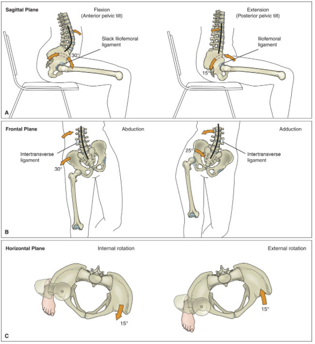
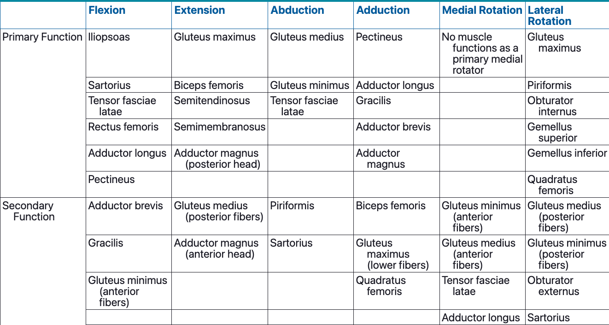
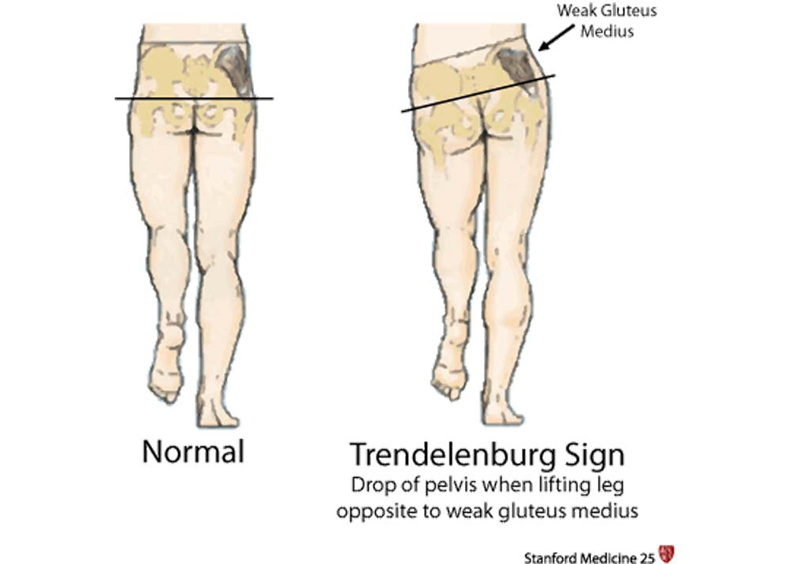
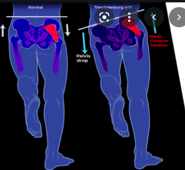

## Muscles

- The precise function of the hip muscles often changes, depending on the position of the hip. For example, 
  - hip adductor muscles may augment hip flexors when the hip is in the neutral hip position or in extension but can be hip extensors when the joint is flexed. 
  - The piriformis muscle functions as a lateral hip rotator when the hip is in neutral but medially rotates the joint when the hip is flexed to 90°.
- multijoint muscles 
  - rectus femoris, which attaches above the hip and below the knee. The muscle can contract sufficiently as a hip flexor when both the hip and the knee are flexed and as a knee extensor when the hip and the knee are extended. However, it becomes actively insufficient if it flexes the hip while the knee is extended.

### FLEXORS

- iliopsoas, sartorius, tensor fasciae latae, rectus femoris, adductor longus, and pectineus. 
- iliopsoas muscle
  - a strong hip flexor, assists with hip lateral rotation and abduction
  - Consists of the iliacus and psoas major. 
    - iliacus attaches to the iliac fossa and the lateral end of the sacrum and distally to the lesser trochanter of the femur. 
    - psoas major muscle attaches proximally to the bodies and transverse processes as well as vertebral bodies and intervertebral discs of T12 and L1-L4 vertebrae. It blends distally with the iliacus tendon and attaches to the lesser trochanter of the femur. 
      - spine stabilizer as it crosses the lumbar spine, the lumbosacral joint, the sacroiliac joint, and the hip joint. 
      - can become tight, from
        - being in a shortened position for an extended period of time, such as when a person maintains a prolonged sitting position, 
        - if hip extensors are much weaker than hip flexors. 
      - Tightness causes increased lumbar lordosis, and the psoas moves the pelvis into an increased anterior tilted position. increase stress to the spinal joints, resulting in pain and dysfunction. 
- rectus femoris
  
  - strong knee extensor, primary hip flexor.
  - attaches proximally to the AIIS and distally to the tibia via the patellar tendon. 
  - active insufficiency
    - greater hip flexion torque when the knee is maintained in flexion. 

+ When the femurs are fixed, contraction of the hip flexors rotates the pelvis in an anterior tilt around a medial-lateral axis. The lumbar spine extensors, along with the hip flexors, produce a force couple that rotates the pelvis anteriorly. An excessive lordotic spinal position increases the compressive forces on the facet joints and lumbosacral junctions.

### ADDUCTORS

- superficial layer: pectineus, adductor longus, and gracilis muscles. 
  - attach proximally to the pubic ramus. 
  - pectineus and adductor longus attach distally on the posterior aspect of the femur along the linea aspera. 
  - The femoral triangle, an anatomical landmark for palpating the femoral artery, is formed medially by the adductor longus and pectineus, laterally by the sartorius, and superiorly by the inguinal ligament
    
  - long, slender gracilis muscle runs inferiorly the length of the femur, crosses the knee joint, and attaches to the proximal tibia..
- middle layer: adductor brevis 
  - triangle-shaped muscle 
  - attaches proximally to the pubic ramus and distally to the upper third of the linea aspera behind the pectineus and adductor longus.
- deep layer: large adductor magnus, 
  - from the ischial ramus and the ischial tuberosity. Its fibers fan out in a triangular shape, attaching along the length of the linea aspera. 
- diagonal orientation 
  - sagittal plane, 
    - the posterior fibers of the adductor magnus muscle function as strong hip extensors regardless of the position of the hip. 
    - The remaining adductors produce either hip flexion or extension torques depending on the position of the hip in the sagittal plane. 
      - Toward the end range of hip flexion, the adductor group can produce a strong extension torque. 
      - near the end range of hip extension, the adductor group contributes to hip flexion torques. 
      - assist with high-powered activities, such as sprinting up a steep hill or performing repeated deep squats. 

### EXTENSORS

- Primary: gluteus maximus, hamstrings,  posterior head of adductor magnus
- secondary: gluteus medius, adductor magnus. 
- gluteus maximus
  - proximal to the ilium, sacrum, and coccyx. Its superior fibers insert into the IT band, and its inferior fibers attach to the gluteal tuberosity. 
  - largest muscle in the lower extremity
  - recruited to extend the hip when the resistance to the movement is greater than the weight of the limb.
  - greatest extensor force when the hip is near 70° of flexion. 
  - also contribute to hip lateral rotation, although this ability decreases as the hip moves into flexion. 
  - together with the abdominal muscles as a force couple to posteriorly tilt the pelvis on the femur. This posterior rotation decreases lumbar lordosis.
- hamstrings: biceps femoris, the semitendinosus, and the semimembranosus muscles. 
  - attach proximally to the ischial tuberosity. 
  - biceps femoris is the most laterally positioned of the three muscles and attaches distally to the laterally positioned head of the fibula and the lateral aspect of the tibial condyle. 
  - semitendinosus and semimembranosus muscles attach to the medial aspect of the tibia. 
  - extend the hip and flex the knee.
  - hip is extended and the knee is flexed to at least 90°, the hamstrings become actively insufficient and cannot contribute much to the hip extension force. Their ability to extend the hip increases as the knee is extended during hip extension.
- when the femurs are fixed, the hip extensors rotate the pelvis in a posterior tilt around a medial-lateral axis. The trunk flexors (rectus abdominis) and the hip extensors produce a force couple that rotates the pelvis in a posterior direction, reduces lumbar lordosis and results in a flattened lumbar spinal curve.

### ABDUCTORS

- primary: gluteus medius, gluteus minimus, and tensor fasciae latae. 
- Secondary: piriformis, sartorius, and superior fibers of the gluteus maximus. 
- gluteus medius
  - lateral surface of the ilium and attaches distally to the greater trochanter beneath the gluteus maximus 
  - anterior fibers are active during hip flexion, 
  - posterior fibers contract during hip extension. 
  - When the hip is in neutral, the posterior fibers laterally rotate the hip. 
  - When the hip is positioned in flexion, all the fibers medially rotate the hip. 
  - All three portions of the gluteus medius produce hip abduction, regardless of the position of the hip.
- gluteus minimus 
  - deep to the gluteus medius and attaches proximally to the outer surface of the ilium and distally to the greater trochanter. 
  - abductor and flexor muscle of the hip. 
  - It medially rotates the hip when it is positioned in flexion.
- stabilizing the pelvis on the hip during single leg stance. As the gravitational force produces an adduction torque on the unloaded limb and the pelvis rotates downward, the muscles counter this pelvic drop by pulling the weight-bearing pelvis in the opposite direction. Their function as a pelvic stabilizer is important during each stance phase of the gait cycle when the body weight is supported by one leg as the contralateral limb swings forward. As the leg advances during swing, the hip abductors contract to stabilize the pelvis on the standing leg, holding it level while the unloaded leg advances.

### LATERAL ROTATORS

- six deep, small muscles that function as hip lateral rotators: the piriformis, gemellus superior and gemellus inferior, obturator internus and obturator externus, and quadratus femoris. 
- The gluteus maximus and the posterior fibers of the gluteus medius, gluteus minimus, and sartorius add to the force produced by the deeper small muscles to produce strong lateral hip rotation torque forces.
- beneath the gluteus maximus muscle. Their muscle fibers and line of force are oriented mainly in the horizontal plane, nearly perpendicular to the axis of rotation. merge into a fan-shaped common tendon that inserts on the greater trochanter of the femur. This fanned tendon stabilizes the posterior aspect of the hip joint.

-  piriformis, 
  - the most superior of the deep six rotators, 
  - attaches to the anterior inferior surface of the sacrum and runs diagonally through the greater sciatic foramen to attach to the greater trochanter. The muscle functions as a hip lateral rotator and abductor.
  - as the hip approaches 90° of flexion, the orientation of the muscle fibers rotates the hip medially. This change in fiber position shortens the piriformis **when a person sits with the legs crossed**. (thus pigeon pose stretches piriformis). Prolonged sitting in this position can cause muscle tightness. The close proximity of the piriformis to the large sciatic nerve can be clinically significant when a tight or shortened piriformis muscle compresses the nerve.

- Hip abductor weakness can result in a gait pattern known as a Trendelenburg gait
- non–weight-bearing side drops inferiorly during single leg stance: **Trendelenburg sign**. For example, a person with a positive 
- common compensation for this inferior pelvic tilt is to laterally bend the trunk to the side of muscle weakness. This lateral bend shifts the center of gravity and weight of the trunk and upper body back over the weight-bearing leg. This pelvic drop with compensatory lateral trunk bending is referred to as a Trendelenburg gait.
  

- Piriformis syndrome
  - piriformis dysfunction compresses the sciatic nerve at its exit through the sciatic notch below the piriformis muscle. 
  - shortening or spasm of the piriformis from direct trauma, spine or sacroiliac joint dysfunction, injury, or overuse. 
  - pain, numbness, and tingling in the posterior hip region. increase during sitting or squatting, but they can be exacerbated by walking and other activities. 
  - nonsteroidal anti-inflammatory drugs and muscle relaxants. Physical therapy interventions include ultrasound, soft tissue mobilization, piriformis stretching, thermal modalities, therapeutic exercise, and various treatments to the lumbar spine.
  - Chronic untreated abnormal Trendelenburg gait may lead to the development of secondary pathology at the knees or ankles over the years. It is also known to accelerate the process of wear and tear at the hip joint. The wear and tear usually occur at the portions of the hip which are typically not used during normal gait, more so in athletes.[[9\]](https://www.ncbi.nlm.nih.gov/books/NBK541094/#)[[10\]](https://www.ncbi.nlm.nih.gov/books/NBK541094/#) Untreated Trendelenburg gait can also lead to dynamic lower extremity valgus.[[11\]](https://www.ncbi.nlm.nih.gov/books/NBK541094/#) The mechanism behind this is that the pelvis of the unaffected side will be elevated thereby having the trunk lean towards the affected side. The ground resultant force will, in turn, be directed to the lateral knee joint thereby producing a valgus knee on the affected side. This over time can lead to knee pain. https://www.ncbi.nlm.nih.gov/books/NBK541094/

### MEDIAL ROTATORS

- anterior fibers: gluteus medius and gluteus minimus, tensor fasciae latae, adductor longus, adductor brevis, and pectineus. As the hip approaches 90° of flexion, the orientation of these fibers becomes more perpendicular to the vertical axis of the hip rotation. This change in alignment increases the ability of the muscles to generate a medial rotation torque. Some lateral rotator muscles switch their function from lateral rotators to medial rotators as the hip approaches 90° of flexion. 
  - hip lateral rotators are lengthened and stretched at end ranges of hip medial rotation when the hip is extended but are stretched in lateral hip rotation when the hip is flexed.
- standing on the right leg with the left leg unloaded, activating the right lateral rotators rotates the pelvis to the left in the horizontal plane (the left iliac crest rotates backward). This type of activity is seen during a cutting motion to the left while running. The person running plants the right foot and turns sharply to the left. 
- During the gait cycle, the medial rotators play a role in rotating the pelvis on the side of the swing leg toward the weight-bearing stance leg. They medially rotate the pelvis in the horizontal plane over the fixed femur of the stance leg. [Figure 11.30](https://jigsaw.vitalsource.com/books/9780803675056/epub/OPS/c11.xhtml?brand=vitalsource&create=true&favre=brett#fig11-30) illustrates the left innominate bone rotating about the right hip as the left iliac crest moves forward.
- 