# Introduction

- comprises the medial and lateral compartments of the tibiofemoral joint and the patellofemoral joint. 
- The knee joint is a biaxial modified hinge joint that moves in the sagittal plane during flexion and extension and in the horizontal plane during medial and lateral rotation.
- stability of the joint comes primarily from the ligaments, intra-articular menisci, and large muscles that surround the joint. 

## KNEE STRUCTURES

### BONY STRUCTURES

#### Femur

- The femur and tibia meet to form an angle that measures an average of 170° to 175° **genu valgum**. An < 170°, genu valgum. > 180° is called **genu varum;**
  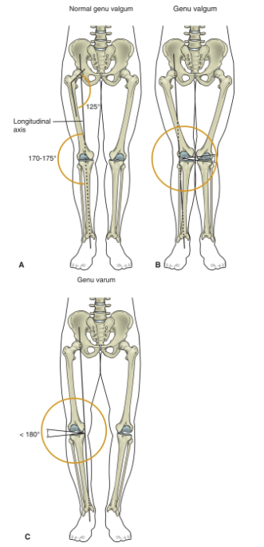
- distal end: medial and lateral condyles, form the intercondylar (trochlear) groove. 
  - medial condyle is longer than the lateral condyle. 
  - posterior aspect of the patella articulates with the intercondylar groove to form the patellofemoral joint. 
  - cruciate ligaments pass through this notch. 
- Projecting above each condyle are the medial and lateral epicondyles, 
  - attachment sites for tendons and ligaments associated with
- adductor tubercle is superior to the medial epicondyle and is the attachment site for the hip adductor muscles. 
- The depression between the posterior aspect of the condyles forms the popliteal surface of the femur. This area, which also contains the popliteal nerve and artery, is called the popliteal fossa 

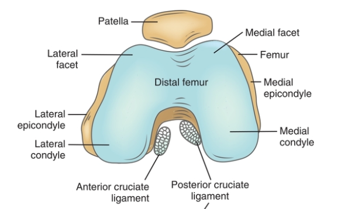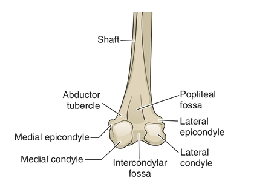

#### Proximal Tibia and Fibula

- proximal medial and lateral condyles articulate with the distal femur. 
  - separated by the intercondylar eminence.
- The proximal surface of the tibia is referred to as the tibial plateau, 
  - larger medial plateau and a smaller lateral plateau. 
- tibial tuberosity is a projection on the anterior proximal surface of the tibia that serves as the attachment site for the patellar tendon. 
- The tibial tubercle, inferior to the lateral tibial condyle, is the attachment site for the iliotibial (IT) band 
- proximal fibula does not articulate directly with the femur

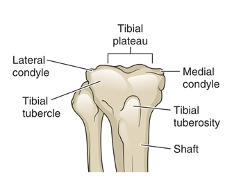

#### Patella

- largest sesamoid bone 
- embedded within the quadriceps tendon. 
- pointed apex at its inferior border, and the superior border forms the base of the patella. 
- The posterior surface of the patella is covered with a thick layer of smooth hyaline cartilage that forms a vertical ridge and a medial and lateral facet.
- articulates with the femur via the intercondylar groove. Its thick articular cartilage is subject to large compressive and friction forces produced by the powerful quadriceps muscles. Excessive wearing of the patellar articular cartilage can cause retropatellar knee pain during functional activities (e.g., ascending and descending stairs) 
- Functionally, the patella increases the space between the femur and the quadriceps muscle by acting as a dynamic lever, with a resultant increase in the internal moment arm of the knee extensors. patella provides the most effective leverage for the quadriceps muscles from 60° to 30° of extension. As the joint approaches terminal knee extension, the patella no longer changes the moment arm and has little influence in the force generated by the quadriceps.

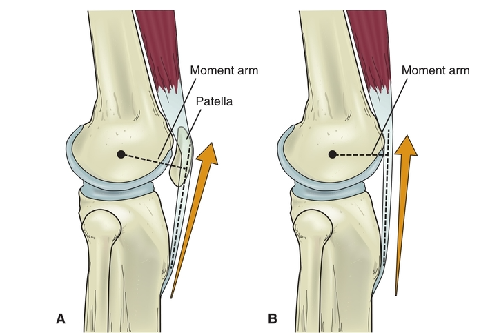

### JOINT STRUCTURES

movement at the tibiofemoral joint produces simultaneous movement at the patellofemoral joint.

#### Patellofemoral Joint

- Because the patella is attached to the tibial tuberosity by the patellar tendon, it follows the direction of the tibia.
- The patellofemoral joint is subject to high loads during functional activities: 0.5 times body weight during walking and more than 7 times the body weight during squatting.

#### Tibiofemoral Joint

- The articular structures that provide static stability to the joint include the joint menisci, capsule, and ligaments.

##### **Menisci**

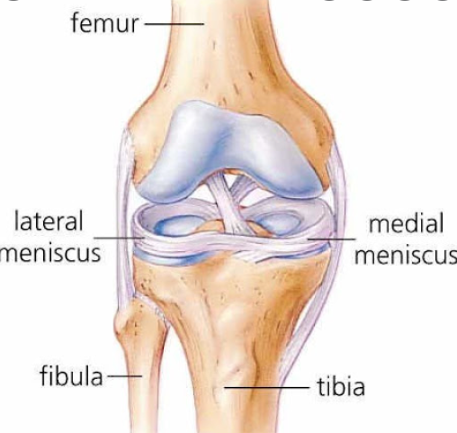

- medial and lateral menisci 
  - semicircular fibrocartilage rings attached to the proximal tibia that improve the joint congruency between the tibia and the femur. 
  - form shallow concave seats for the convex femoral condyles 
  - outer edges of the menisci are loosely attached to the tibia and the capsule by coronary ligaments, which allow the menisci to pivot during joint movement. 
  - The menisci are attached to each other by the transverse ligament and to the patella by the patellomeniscal ligaments.
  - semimembranosus and the quadriceps attach to both menisci, 
  - popliteus tendon attaches to the lateral meniscus. These muscles help stabilize the position of the menisci.
  - 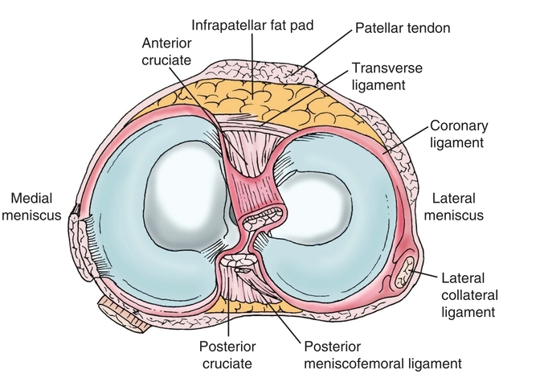
- primary function: absorb the shock or compressive forces to the knee joint. 
  - compressive forces at the knee are 3 times the body weight during walking, are >4 times ascending stairs, 8 times running. T
  - stabilize the joint and control the arthrokinematic motions between the joint surfaces. T
    - wedge to prevent the femoral condyles from gliding excessively on the tibial surface 
  - Compression of the menisci also pushes synovial fluid into the joint surfaces, nourishing articular cartilage. 
  - reducing friction during motion and in providing proprioceptive feedback related to the knee joint. 
- During tibiofemoral motion, the menisci follow the motion of the femoral condyles on the tibia.
  - each meniscus moves a small distance across the tibial articular surface. 
    - lateral meniscus moves approximately 12 mm anteriorly and posteriorly, almost twice the distance of the medial meniscus. 
    - medial meniscus has less mobility due to its greater limitation by ligament and capsular attachments. 
  - The menisci shift anteriorly on the tibial plateau during knee extension and shift posteriorly during knee flexion. 
  - knee laterally rotates, the lateral meniscus moves anteriorly, and the medial meniscus moves posteriorly. 
  - The restriction of movement and its attachments may play a role in injuries to the medial meniscus.
  - 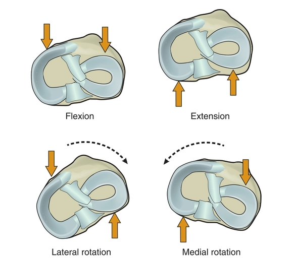

- blood supply that is adequate at the peripheral borders. In contrast, the internal borders are relatively avascular with little blood supply. 
  - Meniscal injuries are the most common knee injury, with the medial meniscus being twice as likely as the lateral meniscus to be injured. 
  - Injury can result from an axial rotational force as the body pivots over a planted foot and from valgus or varus forces at the knee in the frontal plane. often are associated with injuries to the anterior cruciate ligaments. Surgical removal of a meniscus is associated with increased stresses to the articular cartilage of the knee joint and the development of osteoarthritis of the knee. Even a partial meniscectomy increases the stresses to the articular cartilage and significantly increases the risk for development of osteoarthritis. 

##### **Bursae**

- a fluid-filled sac or saclike cavity
- 14 bursae in the knee complex that reduce the friction between structures. S
- suprapatellar bursa is located behind the patellar tendon, whereas the deep infrapatellar bursa is between the patellar ligament and the tibial tuberosity. Fat pads associated with these two bursae further reduce friction between the moving components in the area. 
- These bursae can become inflamed secondary to excessive compression by the quadriceps muscle group or from malalignment and poor tracking of the patellofemoral joint. 
- The subcutaneous prepatellar bursa lies between the skin and the patella, and the subcutaneous infrapatellar bursae lie between the skin and the patellar ligament

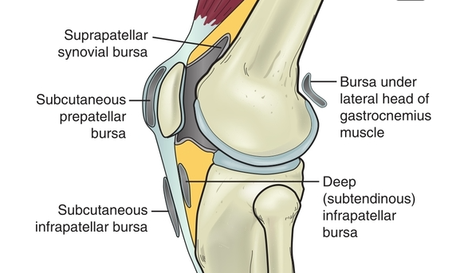

##### **Capsule and Ligaments**

- anterior:
  - reinforced by medial and lateral patellar retinacular fibers. These are connective tissue fibers that extend from the medial and lateral vastus muscles and the IT band. 

###### *medial and lateral collateral ligaments*

- lateral collateral ligament (LCL) : a strong ligament attaching the lateral femoral epicondyle to the fibular head
- MCL: Fibers of the ligament also blend with the retinacular fibers, the medial meniscus, and the tendon of the semimembranosus muscle
- frontal plane. 
  - The MCL resists valgus forces, 
  - LCL resists varus forces. 
- stabilize the knee during joint motion in the sagittal plane. 
  - Most of the fibers are pulled taut at the end range of extension. T
- The ligaments are often injured when the foot is planted on the ground and the femur, along with the pelvis and body, rotates on the stabilized lower leg.

###### *anterior and posterior cruciate ligaments*

- cruciate ligaments are intracapsular, located within the joint capsule. 
- A vascular synovial lining that provides blood supply to the ligaments covers them. 
- restrict excessive motion between the femur and tibia in several planes. 
- indirect control of the knee because they contain mechanoreceptors that provide proprioceptive feedback to the nervous system related to the position and movement of the joint.
- anterior cruciate ligament (ACL) 
  - anterior intercondylar area of the tibial plateau. 
  - runs obliquely in a superior, lateral, and posterior direction to attach to the lateral femoral condyle
  - most of the ACL fibers become taut as the knee approaches full extension. 
  - last 50° to 60° of active knee extension
    - quadriceps mechanism pulls the tibia anteriorly as the muscle slides it across the femoral condyles. As the ACL fibers become more taut, they help limit this anterior slide of the tibia so that it remains in contact with the femur
    - As the quadriceps works to extend the knee, the ACL works as an antagonist to oppose excessive anterior tibial translation.
  - 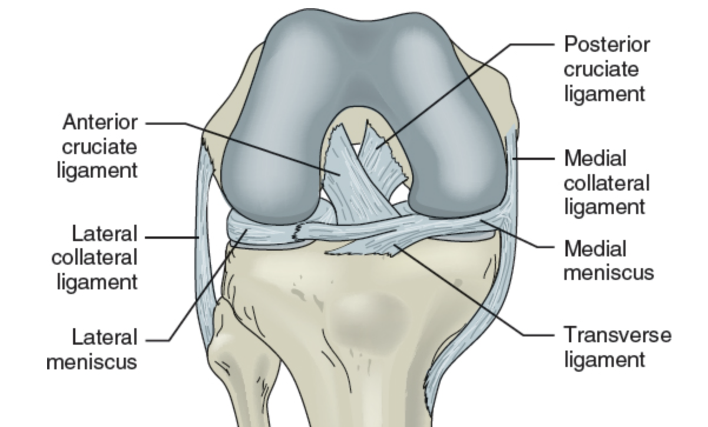
  - 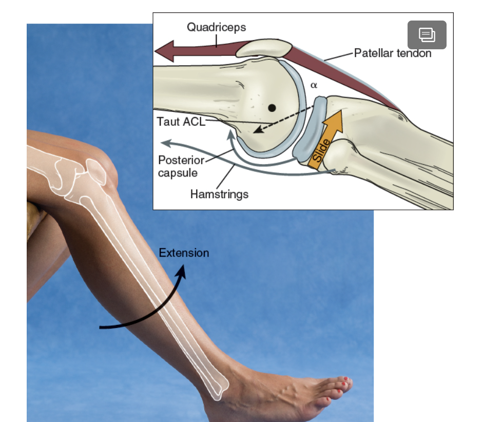
  - The ACL is the ligament in the knee that is most frequently completely ruptured (torn). 
    - due to a noncontact injury, 
    - when the foot is planted and there is excessive genu valgus and lateral rotation of the knee. 
    - excessive genu valgus is often combined with hip adduction and medial rotation. 
    - often results in secondary involvement of the menisci, MCL, or articular cartilage and bone
- The posterior cruciate ligament (PCL)
  - from the posterior intercondylar area of the tibia to the medial femoral condyle. 
  - most PCL fibers become taut with increasing amounts of knee flexion. This tension peaks by 90° to 120° of flexion. 
  - restrict terminal knee flexion, but it also resists the posterior glide of the tibia on the femur that occurs with knee flexion. 
  - limits excessive anterior gliding of the femur on a fixed lower limb
  - PCL injuries are far less frequent and are often associated with high-intensity trauma, such as motor vehicle accidents or contact sports. Falling over a flexed knee or striking the knee against the dashboard when seated during a car accident can lead to a PCL rupture. At least half of all PCL injuries include injury to other knee structures, such as the meniscus, joint capsule, or ACL.

## KINEMATICS

### OSTEOKINEMATICS

- The tibiofemoral joint has two degrees of freedom. 
  - Flexion and extension of the joint occurs in the sagittal plane, 
  - when the knee is slightly flexed, there is a small amount of medial and lateral rotation.

#### Flexion and Extension

- This axis of rotation is not fixed but migrates with the femoral condyles, changes the internal moment arm of the muscles. 
  - 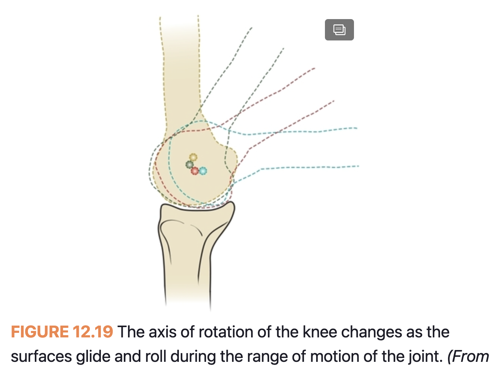
- Average range of motion is from approximately 130° of flexion to approximately 5° beyond the 0° where the knee is in the straight position 
  - 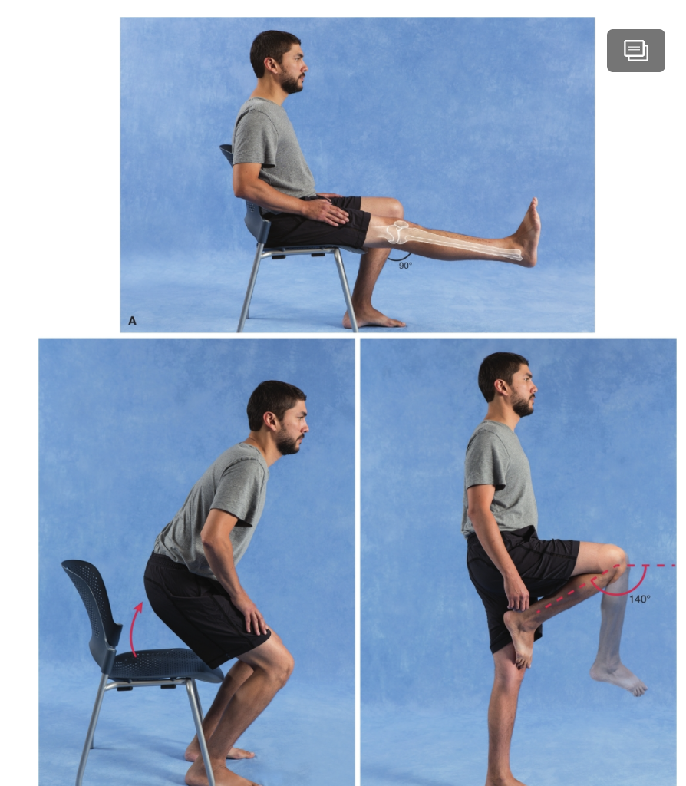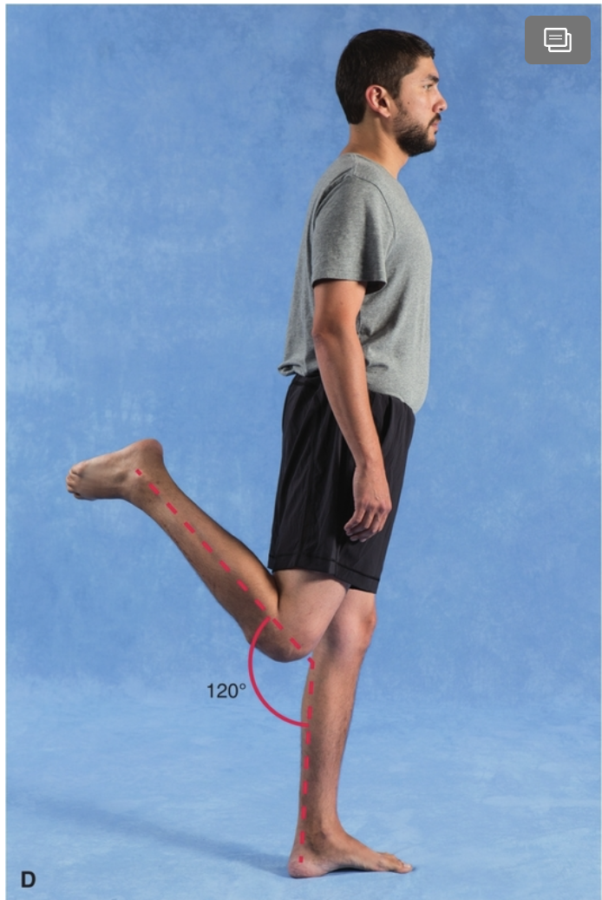
- Hyperextension of the knee beyond 10° from the neutral position is called genu recurvatum
  - caused by weak quadriceps muscles or by a tight gastrocnemius muscle
  - can lead to wearing of the knee articular cartilage. 

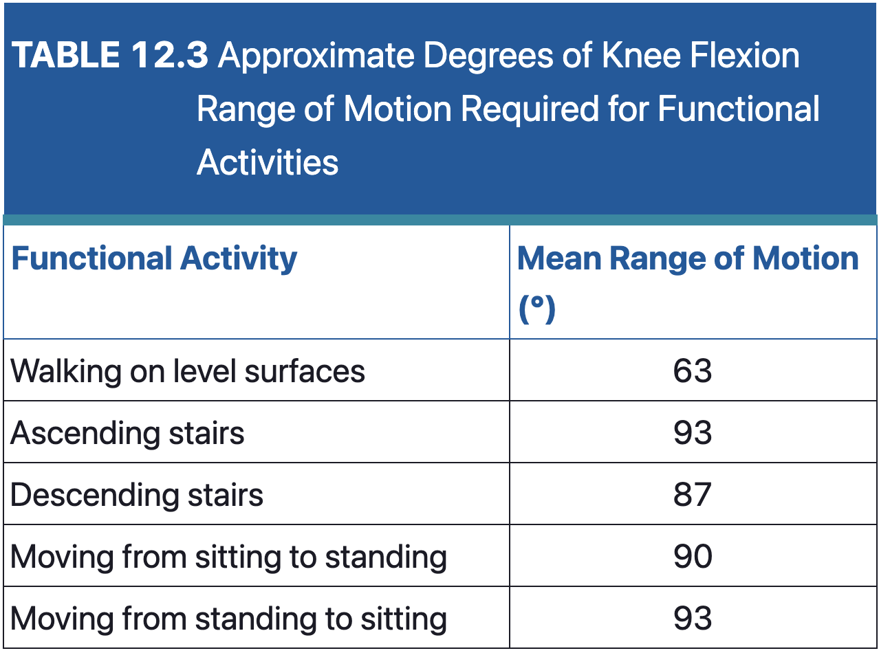

##### **Clinical Connection 12.1**

- ACL injuries have also been identified as a major risk factor for the development of knee osteoarthritis.
- involves a noncontact mechanism that occurs when landing a jump, decelerating, cutting, or pivoting over a single leg when the foot is planted on the ground. 
- knee is usually near full extension and, with ground reaction forces lateral to the knee, most often sustains a marked “valgus collapse.” a correlation between female subjects who display excessive knee valgus angles during a vertical jump drop test and ACL injuries.
- after reconstruction surgery following a ruptured ACL, the individual should undergo an intensive rehabilitation program that includes core strength and stability exercises; balance training; and exercises that focus on function, agility, control, and power to prevent reinjury and maximize optimal return to function.

#### Patellar Tracking

- A shortened tight IT band or lateral patellar retinacular fibers can contribute to the lateral pull of the patella. 
- Lax medial retinacular tissues and a lax MCL can also be contributing factors. 
- height of the lateral facet of the intercondylar groove resists lateral patellar tracking. A shallow intercondylar groove with a flattened lateral facet is a risk factor for excessive lateral patellar tracking.
-  Extremes of joint alignment, such as excessive genu valgum, external tibial torsion, and flattened medial longitudinal foot arches, can also contribute to lateral patellar tracking. 
- muscle weakness or poor neuromuscular control of hip lateral rotator and abductor muscles to excessive lateral patellar tracking. 

##### **Q-Angle**

- Excessive lateral glide of the patella during knee extension appears to be associated with patellofemoral joint pain. 
- A specific factor influencing patellar tracking is the lateral line of pull of the quadriceps muscles. 
- **Q-angle** is a clinical measure of the line of pull of the quadriceps. 
  - In a healthy adult, the Q-angle measures about 13° to 15°. 
  -  Q-angle greater than 15° indicates a greater lateral muscle pull on the patella

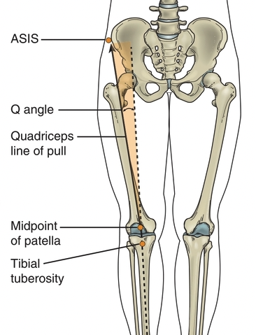

#### Medial and Lateral (Axial) Rotation

- At 90° of knee flexion, there is an average of 45° of total axial rotation. 
- Once the knee approaches full extension, there is practically no capacity for axial rotation at the tibiofemoral joint. 
- motion is defined from the location of the tibial tuberosity in relation to the anterior distal femur. 
  - If the tuberosity is lateral to the anterior femur, the joint is laterally rotated.
  - if the femur rotates medially, by definition, the tibial tuberosity is now lateral to the femoral anterior surface, so the joint is laterally rotated.
  - 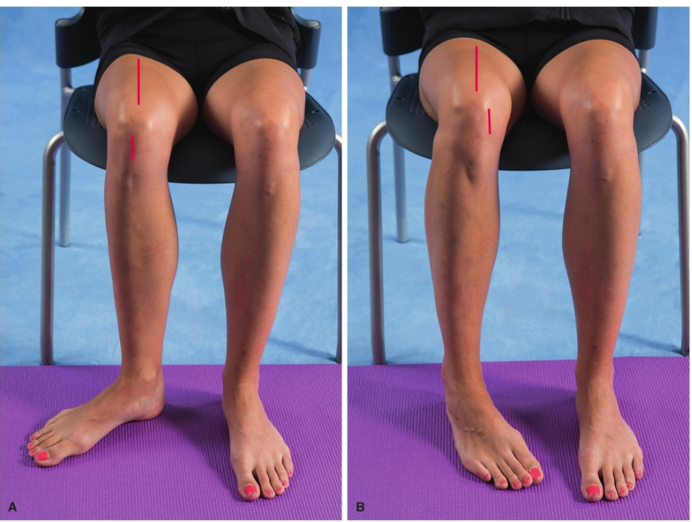

### ARTHROKINEMATICS

##### **Clinical Connection 12.2**

- Patellofemoral pain syndrome (PFS)
  - anterior or retropatellar discomfort and pain
  - often exacerbated during functional activities such as squatting, running, jumping, negotiating stairs, kneeling, and even prolonged sitting with the knees flexed. 
  - causes
    - most likely related to patellar malalignment and maltracking in the femoral trochlear groove. 
      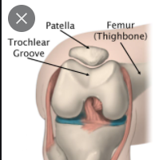
    - result of hip abductor and lateral rotator muscle weakness resulting in dynamic genu valgum and excessive femoral medial rotation, often seen when landing from a jump. 
    - also result from quadriceps weakness, foot malalignment, and structural abnormalities of the patellofemoral joint.
  - Corrective exercise
    -  strengthening hip abductors and lateral hip rotators
    - To minimize patellofemoral joint stresses while performing quadriceps strengthening exercises, **squat exercises should be performed from 45° to 0° of knee extension**. 
    - Patellar taping has been shown to reduce pain, alter patellofemoral kinematics, and improve knee joint proprioception.

##### **Clinical Connection 12.3**

- IT band syndrome .
  - common for runners
  -  cause 
    - training volume and shoe wear, 
    - dysfunction in the person’s flexibility, strength, and running mechanics. 
    - repeated knee flexion, such as cyclists. 
    - **Decreased hip lateral rotation strength and IT band tightness**
  - signs and symptoms include lateral knee pain that is worse during the activity, tenderness to palpation of the IT band insertion area, and sometimes an audible or palpable clicking as the lateral IT band moves across the lateral femoral epicondyle. 

#### Extension

- 

##### **Screw-Home Mechanism**

- The articular surface of the medial condyle is oriented in about a 30° lateral curve toward the intercondylar groove and projects further anteriorly than the lateral condyle. Because of this configuration, the tibia follows the lateral orientation of the medial condyle during tibia-on-femur knee extension. 
  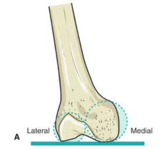

- As the knee is locked into full extension, the tibia laterally rotates about 10° during the last 20° to 30° of knee extension. Once the articular surfaces undergo this rotation, they achieve optimal congruency This rotation is referred to as the **screw-home mechanism**. 
  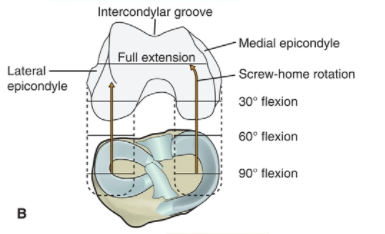

- During closed chain knee extension, where the femur is moving on the tibia, the knee locks as the femur rotates medially on the fixed tibia. 

  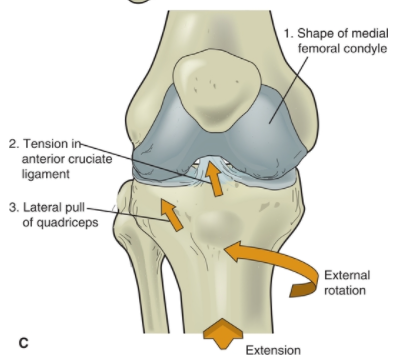

#### Flexion

- During knee flexion, the arthrokinematics occur in the reverse direction from knee extension. To flex the knee with the tibia moving on the femur, the tibia must first rotate medially. The popliteus muscle facilitates this action. (This function is discussed further in the section on muscles.) The muscle also is responsible for the lateral rotation of the femur to initiate the femur moving on the tibia to flex the knee in a closed chain motion.

## MUSCLES

### KNEE EXTENSORS

- quadriceps femoris : rectus femoris, vastus lateralis, vastus medialis, and vastus intermedius. 
  - vastus medialis and vastus lateralis arise from the anterolateral femoral shaft and feature oblique fibers that approach the patellar tendon at an angle to the quadriceps tendon. 
  - vastus medialis has two distinct fiber directions: longitudinal and oblique. 
    - vastus medialis are labeled vastus medialis longus (VML) and vastus medialis oblique (VMO). 
    - The longitudinal fibers of VML are angled 15° to 18° medially from their patellar attachment in the frontal plane. 
    - The VMO fibers are at a 55° angle. Because of this oblique orientation, the VMO is unable to extend the knee effectively and is believed to provide medial stability and counter the lateral forces of vastus lateralis during knee extension
- deep vastus intermedius 
  - beneath the rectus femoris muscle
  - the most efficient knee extensor of the group. 
- All four muscles of the quadriceps converge into a strong quadriceps tendon that attaches to the patella. 
- vastus muscles are one-joint muscles and function only to extend the knee. 
  -  80% of the total extension torque at the knee.
- rectus femoris attaches to the AIIS and is a two-joint muscle, as it crosses the hip and the knee
  -  flexing the hip and extending the knee.
  - 20% of the knee extension torque at the knee and is most effective when the hip is extended.
- producing a force that is about two thirds greater than the force generated by the knee flexor muscles. 
- maintain about 90% of its maximal strength by taking advantage of the concept of optimal physiological muscle length and the moment arm produced by the patella. 
  - Hip and knee extended: rectus femoris optimal
  - 80° of knee flexion: vasti muscles optimal. As the knee continues to extend through the range of motion, the patella increases the moment arm of the quadriceps, allowing the muscle group to maintain near its maximal force from 80° to 30°. 
  - last 30° of knee extension that the ability of the quadriceps to generate a maximal force declines 
- quadriceps also function isometrically to stabilize the knee joint and act as “shock absorbers” for the knee. When landing from a jump, the muscles act like a spring mechanism to dampen the high-impact load by eccentrically controlling the knee flexion at impact.

### KNEE FLEXORS AND ROTATORS

- hamstring muscles: semimembranosus, semitendinosus, and the long and short heads of the biceps femoris
  - short head of the biceps femoris attaches proximally to the lateral lip of the linea aspera of the femur. 
  - The semimembranosus, semitendinosus, and long head of the biceps femoris attach proximal to the ischial tuberosity. 
  - Both heads of the biceps femoris attach to the head of the fibula, with some fibers interfacing with the LCL and tibia. 
  - Distally, the semimembranosus attaches to the medial tibial condyle. It also has attachments to the connective tissue structures of the MCL and menisci. 
  - Injuries resulting from excessive hamstring contraction or overlengthening can involve collateral ligaments and menisci. 
  - The semitendinosus distal tendon is more superficial than the semitendinosus; it becomes prominent with resisted knee flexion and is used as a palpation site during muscle testing.
  - 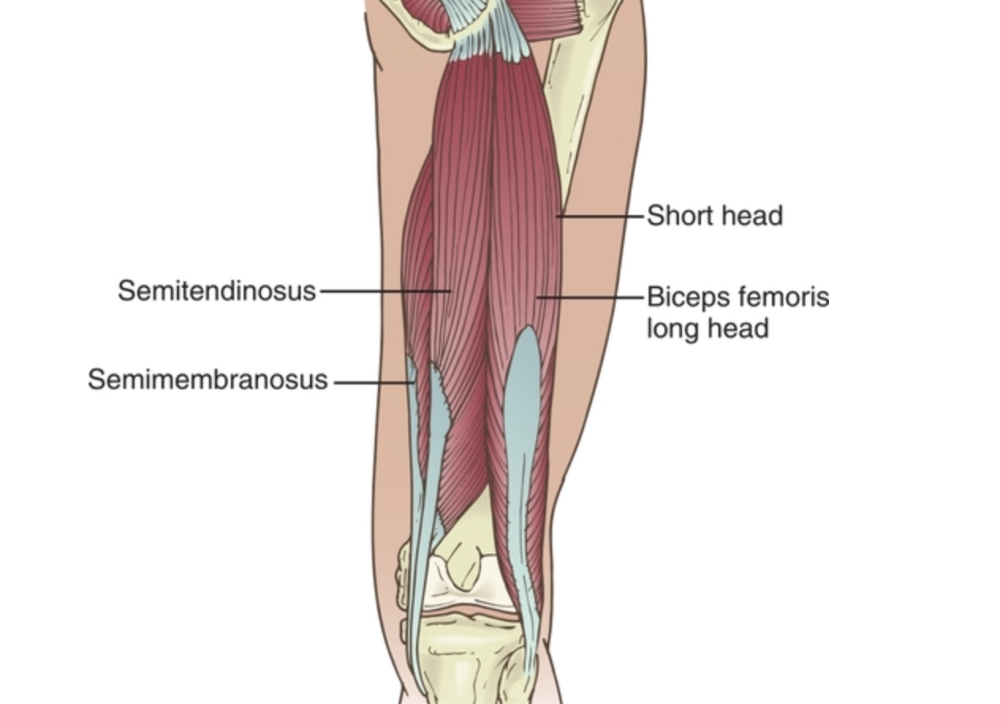
- All the hamstring muscles, with the exception of the short head of biceps femoris, are two-joint muscles, as they cross both the hip and knee joints. 
- The semimembranosus and semitendinosus medially rotate the knee, whereas biceps femoris laterally rotates the knee. 
- Active axial rotation at the knee is greatest when the knee is flexed. As the knee approaches full extension, there is little to no axial knee rotation because the joint is mechanically locked. The hamstrings also provide dynamic stabilization to the knee because they restrict an anterior glide of the tibia on the femur during knee extension.
- The sartorius and gracilis muscles
  -  posterior to the mediolateral axis of the knee,
  - flex and medially rotate the knee. The active contraction of the pes anserinus dynamically stabilizes the medial aspect of the knee. Activation of this muscle group, along with the MCL and joint capsule, resists valgus stresses to the knee 
  - 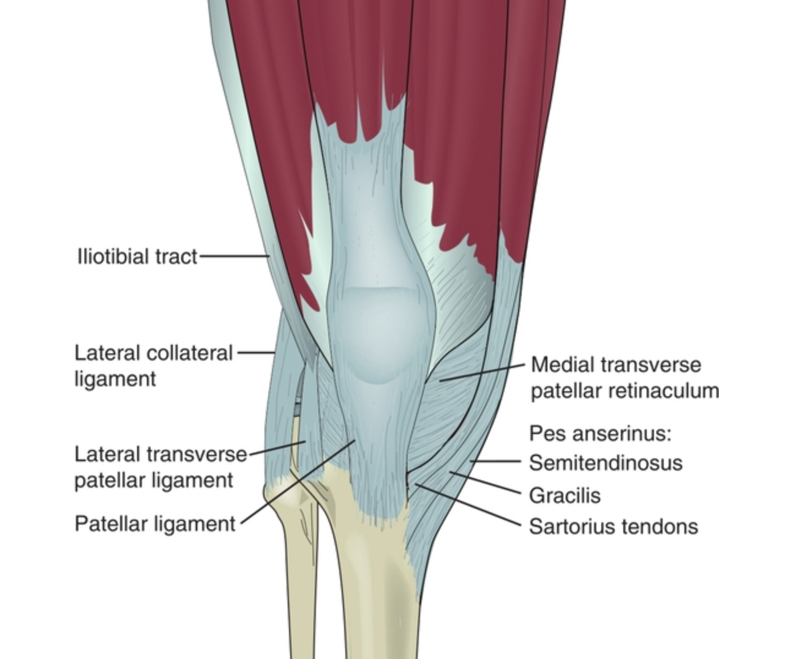
- The medial and lateral heads of the gastrocnemius assist with knee flexion, although their major role is plantar flexion of the ankle. 
- The popliteus muscle is a small triangular muscle that lies deep to the gastrocnemius in the popliteal fossa
  - unlocking an extended knee. It medially rotates the joint to unlock the knee. 
  - If the femur is moving on the tibia at the start of knee flexion, such as when moving into a squatting position, the popliteus laterally rotates the femur over a relatively fixed tibia. In relationship to the femur, the tibia is in medial rotation. 
  - When the tibia is moving on the femur, knee flexion begins by the popliteus “unlocking” the joint by medially rotating the tibia on the femur.
    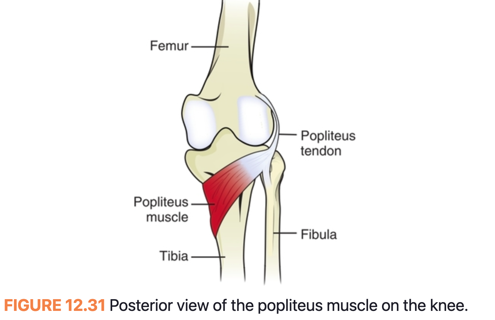

## INFLUENCE OF HIP POSITION ON KNEE FUNCTION

### KNEE EXTENSION WITH HIP FLEXION

- concurrent hip flexion and knee extension are limited by hamstring inflexibility, joint contractures, or spasticity, the person can take only short strides and walk with flexed knees. 
- also be the result of active insufficiency of the rectus femoris to concurrently flex the hip while extending the knee.
  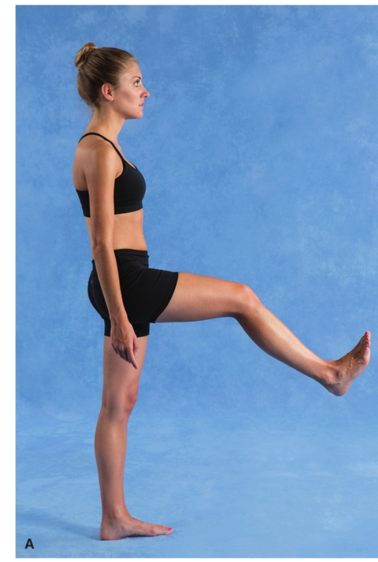

### KNEE FLEXION WITH HIP EXTENSION

- tight rectus femoris limitation in knee flexion when the hip is extended.

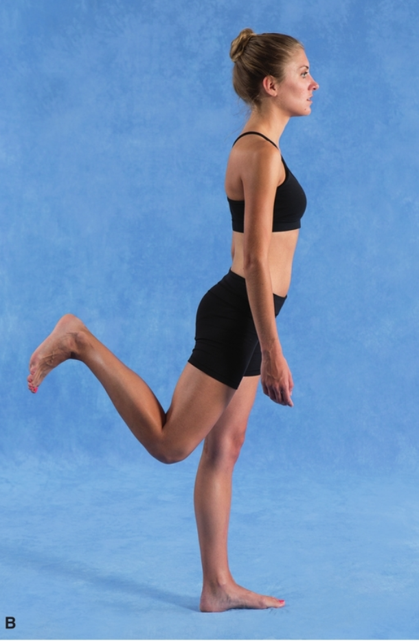

### KNEE FLEXION WITH HIP FLEXION

- hamstrings with a length–tension advantage as they are lengthened over a flexed hip while actively flexing the knee. 

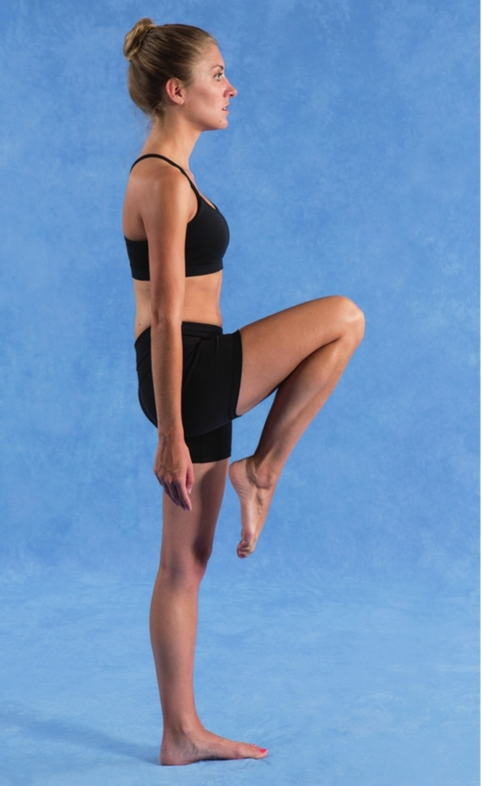

### KNEE EXTENSION WITH HIP EXTENSION

- moving from a sitting to a standing position and ascending stairs and during running and jumping. 
- extended knee lengthens the hamstrings over the knee and allows them to be effective hip extensors. 
- When standing from a sitting position, both muscles work concentrically—the quadriceps to extend the knee and the hamstrings to extend the hips. 
- When sitting from a standing position, the muscles work eccentrically to control flexion—the quadriceps at the knee and the hamstrings at the hip.