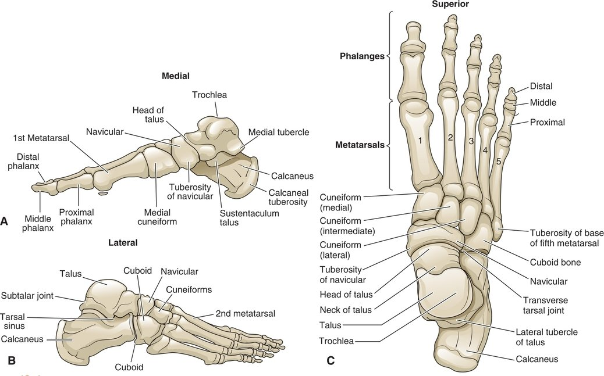

+ *ankle*: talocrural joint
+ *foot*: all the joints distal to the ankle. 
+ talus, calcaneus, navicular, cuneiforms, and cuboid bones make up the **tarsus** area of the foot and are called tarsal bones. 
+ foot is divided into three regions: the rearfoot, the midfoot, and the forefoot. 
  + rearfoot comprises the talus and calcaneus. 
  + midfoot comprises the tarsal bones (navicular, three cuneiforms, and cuboid). 
  + forefoot refers to the five metatarsals and 14 phalanges. 
    + large great toe has two phalanges, and the four lesser toes have three. 
+ dorsal surface refers to the top of the foot, whereas the plantar surface is the bottom of the foot

**FIGURE 13.1** Right stance and swing phases of the gait cycle.

## BONY STRUCTURES

### TIBIA

+ tibia forms the medial malleolus on its medial surface and articulates laterally with the fibula
+ **tibial torsion**. 
  + distal end is rotated 20° to 30° laterally compared with the proximal end.
  + 

### FIBULA

- fibular head is located lateral to the lateral tibial condyle. 
- lateral malleolus. 
- transmits only about 10% of the body weight to the foot. 
- function as a pulley for the lateral muscle tendons 

### TALUS

- The talus is the most superior of the tarsal bones and articulates medially with the tibia and laterally with the fibula to form the talocrural joint. 
- The trochlear surface of the talus is covered with dome-shaped articular cartilage and has a convex anterior-posterior surface and a slightly concave medial-lateral surface.

### CALCANEUS

- The calcaneus is the largest of the tarsal bones and accepts forces as the heel strikes the ground during walking. 
- Achilles tendon of the gastrocnemius muscle attaches to the calcaneal tuberosity. 
- The sustentaculum talus is inferior to the talus as it projects medially as a horizontal shelf for the talus. 
- On its lateral surface is the trochlea, under which the fibularis (peroneal) tendons pass. 
- The tarsal sinus is a canal between the talus and calcaneus.

### NAVICULAR, CUNEIFORMS, AND CUBOID

- The navicular accepts the head of the talus to form the talonavicular joint. 
  - navicular bone has three facets that articulate with the three cuneiform bones.
- The medial, middle, and lateral cuneiform bones are located between the navicular and the bases of the three medial metatarsal bones. 
- cuboid bone articulates with the base of the fourth and fifth metatarsals, the calcaneus, the lateral cuneiform, and the navicular.

### METATARSALS AND PHALANGES

- base of each metatarsal is located at the proximal end of the bone and terminates with a convex head. 
  - metatarsal shafts are slightly concave on their plantar surface, which increases the ability of the bones to support loads. 
  -  fifth metatarsal has a large bony tuberosity on its lateral edge.
- 14 phalanges. 
  - The first toe is called the hallux and is often referred to as the great toe. 
    - proximal and distal phalange. 
    - Under the hallux are two sesamoid bones that are encapsulated in a small synovial sac. These bones assist with weight-bearing and protect the tendons of the great toe flexors. 
  - second through the fifth toes has a proximal, medial, and distal phalanx. 
  - Each metatarsal with its associated phalanges is referred to as a *ray* of the forefoot.

##### **Clinical Connection 13.1**

- An excessive adduction deformity of the first ray is called hallux valgus. The deformity is characterized by a deviation of the great toe toward the midline of the foot. 
  - Excessively tight footwear, genetics, pronated feet, obesity, and osteoarthritis may contribute to the development of hallux valgus. 
  - MTP joint can dislocate and expose the metatarsal head as a bunion. 
  - painful and often results in changes in weight-bearing. 
  - People with extreme hallux valgus shift their weight from the first ray and excessively load the lateral metatarsal bones.

## JOINT STRUCTURES

### PROXIMAL AND DISTAL TIBIOFIBULAR JOINTS

- During ankle movement, the fibula slides superiorly and inferiorly and rotates against the tibia. Thus, injury to the tibiofibular joints can indirectly affect ankle motion and function.
- proximal tibiofibular joint. 
  - This synovial joint is reinforced by a capsule and anterior and posterior ligaments and has a minimal amount of gliding motion. 
  - transfers forces from the fibula to the tibia. The anterior and posterior tibiofibular ligaments maintain the congruency between the two bones. 
-  distal tibiofibular joint i
  -  fibrous synarthrodial joint reinforced by the interosseous membrane that permits little movement between the two bones. 

### TALOCRURAL JOINT

- trochlea and the sides of the talus as they fit into and around the space formed by the distal tibia and the medial and lateral malleoli
- rectangular-shaped, the joint is often referred to as the “mortise” because it resembles a carpenter’s mortise joint
- 90% to 95% of the compressive forces of the body are transmitted through the tibia and talus. 
- To protect the subchondral bone of the joint from these compressive stresses, the articular surface of the talus is covered with approximately 3 mm of articular cartilage.

#### Ligaments

- The interosseous ligament and anterior and posterior distal tibiofibular ligaments stabilize the joint.
- The talocrural joint is stabilized by ligaments positioned medially and laterally. 
  - The thin capsule of the talocrural joint is reinforced medially by the triangle-shaped deltoid ligament.  four individual ligaments: 
    - the anterior and posterior tibiotalar ligaments, the tibionavicular ligament, and the tibiocalcaneal ligament 
    - attaches to the medial malleolus and fans out to attach to the navicular, the sustentaculum talus, and medial talus to form the four separate ligaments.
    - To resist eversion

- The lateral ligaments of the ankle are the anterior and posterior talofibular ligaments and the calcaneofibular ligament
  - resist inversion. 
  - Because the lateral malleolus extends further distally compared with the medial malleolus, there is a greater capacity for ankle inversion rather than eversion. 
  - This greater range contributes to the large number of ankle inversion sprains involving the lateral ligaments compared with eversion sprains.
    

#### Osteokinematics

- Pronation describes the combination of motions of eversion, abduction, and dorsiflexion. 
- Supination refers to motion with the elements of inversion, adduction, and plantar flexion.
- The talocrural joint has one degree of freedom, as movement occurs around an axis that deviates about 10° from the frontal plane and 6° in the horizontal plane 
  - dorsiflexion is associated with a very small amount of abduction and eversion. 
  - Plantar flexion occurs in the opposite direction from dorsiflexion and is associated with slight adduction and inversion. 
  - major motion that occurs at the talocrural joint is dorsiflexion and plantar flexion.
    
- 15° to 25° of dorsiflexion and approximately 40° to 55° of plantar flexion. 

#### Arthrokinematics

- During open chain talocrural dorsiflexion, the talus 
  - rolls anteriorly in relation to the leg and 
  - slides posteriorly. tightens the calcaneofibular ligament. 
- End-range dorsiflexion elongates the posterior joint capsule and the Achilles tendon. 
  
- fibula displays superior-inferior motion and medial-lateral rotation during talocrural dorsiflexion and plantar flexion. This motion requires some mobility at both the proximal and the distal tibiofibular joints.

### SUBTALAR JOINT

- posterior calcaneal facet makes up approximately 70% of the total articular surface of the subtalar joint.

#### Osteokinematics

- almost equal amounts of inversion/eversion and abduction/adduction but a very small amount of dorsiflexion and plantar flexion at the subtalar joint. 
- In non–weight-bearing positions, the talus is relatively stationary, and the calcaneus moves on the talus. 
- During weight-bearing closed chain motion, the talus moves on the calcaneus. 
- twice as much inversion compared with eversion, although some studies suggest ratios approaching 3:1.

### TRANSVERSE TARSAL JOINT

- talonavicular joint and the calcaneocuboid joint. 
- The medial compartment of the transverse tarsal joint is the talonavicular joint, where a twisting in inversion and eversion occurs as the midfoot moves relative to the rearfoot. 
  - convex head of the talus and the concave surface of the navicular bone.
- The calcaneocuboid joint forms the lateral component of the transverse tarsal joint and is formed by the anterior surface of the calcaneus and the cuboid. There is less motion at this wedge-type joint compared with the talonavicular joint.

#### Capsule and Ligaments

#### Osteokinematics

- Movement at the transverse tarsal joint is almost always associated with movement at other joints, most notably the subtalar joint. 
- two axes: a longitudinal anterior-posterior axis and an oblique axis. The motions of inversion and eversion occur around the longitudinal axis. Abduction and dorsiflexion and adduction and plantar flexion occur around the oblique axis. These combinations of motion around both axes produce pronation and supination, which, in a weight-bearing position, allow the midfoot to adapt to a variety of surfaces with different contours and forms. The amount
- 20° to 25° of inversion and 10° to 15° of eversion.

### TARSOMETATARSAL JOINTS

- The rearfoot and the forefoot are linked by the tarsometatarsal joints, which are synovial plane joints. The joints comprise the cuboid and the three cuneiform bones that articulate with the base of the five metatarsal bones. 

### INTERMETATARSAL JOINTS

- synovial joints between the second and third bases and between the third and fourth bases of the metatarsals. 
- not synovial joints, ligaments connect the first and second metatarsal bases.

#### Kinematics

- Because the second ray has the least amount of movement of the metatarsals, it is often used as a reference point for motion of the forefoot. 
- medial forefoot is more stable, the lateral forefoot has greater range of motion. The first ray has only a limited amount of movement, occurring mainly in flexion and extension. 
  - This limited movement allows the medial aspect of the foot to move around the second ray as the foot adapts to various surfaces during weight-bearing activities.
  - medial border of the foot to make contact with the ground as the heel rises during the push-off phase of gait.
- Rotation of the first, third, fourth, and fifth metatarsals around the second metatarsal affects the mobility and stability of the foot. It provides a means for the forefoot to invert and evert independently of the rearfoot. 
- Inversion and eversion of the metatarsals at the tarsometatarsal joints and the intermetatarsal joints is minimal and is described relative to the second metatarsal rather than the midline of the body.

### METATARSOPHALANGEAL AND INTERPHALANGEAL JOINTS

- The metatarsophalangeal (MTP) joints 
  - biaxial—they permit movement in the sagittal and horizontal planes. 
  -  90° of hyperextension and 30° to 45° of flexion.、enables standing on the toes and permits sufficient push-off as the heel rises off the ground at the end phase of stance when walking. 
  - A much smaller degree of abduction and adduction of the toes 
  - 
- The interphalangeal (IP) joints of the toes,
  - hinge joints that permit 1° of motion: flexion and extension. 
  - Toe flexion in a closed chain standing position helps to balance the leg. 
- 

## FOOT ARCHES

- The calcaneus, talus, navicular, three cuneiforms, and first three metatarsal bones form the medial longitudinal arch, 
  - highest and longest of the three arches
  - talonavicular joint is the keystone at the top of the arch. 
  - the main shock-absorbing structure of the foot. 
  - struts compress during weight-bearing and then rebound when unloaded
- The lateral longitudinal arch is lower than the medial arch and is made up of the calcaneus, cuboid, and fifth metatarsal. 
  - normally makes contact with the ground across its entire length.
  - rigid and assists with transmitting the thrust to propel the body forward during the push-off phase of gait.

- The transverse arch runs in a medial to lateral direction, perpendicular to the longitudinal arches. 
  - The arch is across the first through the fifth metatarsals and tarsals. 
  - The distal border of the arch is the ball of the foot. 
  - The middle cuneiform forms the keystone of the arch with the second metatarsal positioned at the highest point of the arch.
  - During weight-bearing, 
    - pronation at the subtalar and transverse tarsal joints decreases the curve of the medial longitudinal arch and lowers the arch. 
    - forefoot is placed in supination during initial heel strike. The first metatarsal is in a position of dorsiflexion, whereas the fifth metatarsal is in plantar flexion. 
    - This acceptance of weight with the foot flat on the ground is referred to as the stance phase of ambulation.

##### **Clinical Connection 13.2**

- An abnormally raised medial longitudinal arch with excessive rearfoot inversion is known as pes cavus. The most obvious features of pes cavus include a combined rearfoot inversion, forefoot eversion, and excessively plantar-flexed first metatarsal. 
  - metatarsal heads experience a greater amount of contact pressure. This additional pressure on the metatarsals can result in pain and discomfort. 
  - The pes cavus foot is very rigid and has difficulty absorbing forces during walking and running. Complete or near-complete loss of the medial longitudinal arch is called pes planus.
-  tension is placed on the plantar fascia when the joints extend. This tension pulls the metatarsal and tarsal bones together, converting the foot into a rigid structure. This tension provides the main passive support of the medial longitudinal arch. During higher loading activities, such as walking, running, and jumping, muscles provide additional dynamic support to the medial longitudinal arch.

## MUSCLES

- an anterior, posterior superficial, posterior deep, and lateral compartment
- thick fascial membrane called a septum contains each compartment of muscle bellies. 
- 

### ANTERIOR MUSCLE GROUP

- tibialis anterior, extensor hallucis longus, extensor digitorum longus, and fibularis tertius (also known as peroneus tertius). 
-  located on the lateral side of the anterior tibial shaft, the adjacent fibula, and the interosseous membrane. 
- The tendons of these muscles are restrained by the superior and inferior extensor retinaculum as they cross the ankle before attaching to their distal insertions 

##### **Clinical Connection 13.3**

- Plantar fasciitis
  - more of a noninflammatory degenerative process. 
  - pain along the medial border of the plantar fascia, including its insertion site on the calcaneus. 
  - Symptoms are worse first thing in the morning when taking steps after getting out of bed, after prolonged sitting, or when beginning an activity. 
  - The fascia may be tender with palpation and contain nodules. Discomfort can often be elicited when the great toe is hyperextended and stretches the plantar fascia.
- Cause: The causes of plantar fasciitis are often related to increased pronation or excessive supination at the subtalar joint, repetitive foot stresses, ill-fitting footwear, prolonged walking or standing on hard surfaces, obesity, weak intrinsic foot muscles, and tight gastrocnemius muscles. 
- A heel spur (see x-ray) may develop at the site of calcaneal stress and usually causes pain when the heel makes contact with the ground. 
- therapy: manual therapy and exercise to strengthen the ankle and foot and to increase mobility. These measures can also address any proximal weakness of the lower extremities and trunk. Appropriate footwear and orthotics that correct excessive foot positions play an important role in a comprehensive program to reduce posterior heel pain.

#### Tibialis Anterior

- The superior and inferior extensor retinacula hold the tendon in place as it crosses the ankle before inserting on the medial plantar surface of the cuneiform and base of the first metatarsal bone.

- primary dorsiflexor, invertor of the ankle. 
  - controls the rate of descent of the arch, which indirectly controls pronation and eversion of the rearfoot. 
  - The tibialis anterior and peroneus longus work together to control the foot on uneven terrain. 
  - If the tibialis anterior is weak and fails to control the descent of the foot to the floor, the foot may slap the ground with a distinctive “foot slap” sound.

#### Extensor Hallucis Longus and Extensor Digitorum Longus

- The extensor hallucis longus (EHL) lies deep to the tibialis anterior and the extensor digitorum longus. 
- secured by the retinaculum as it crosses the anterior surface of the ankle lateral to the tibialis anterior tendon. 
- assists with ankle dorsiflexion and extends the first MTP and IP joints (see [Fig. 13.20](https://jigsaw.vitalsource.com/books/9780803675056/epub/OPS/c13.xhtml?favre=brett#fig13-20)).
- ankle dorsiflexion and eversion and extend the MTP and IP joints of the four lesser toes. 
- active ankle dorsiflexion and toe extension prevent the toes from scraping the ground as the hip flexes.

### POSTERIOR MUSCLE GROUP

#### Superficial Muscle Group

The gastrocnemius, soleus, and plantaris

##### **Gastrocnemius**

+ medial and a lateral head. 
+ The larger medial head attaches to the femur just proximal to the femoral condyle, and the lateral head arises from the lateral femoral condyle.
+ converge into the Achilles tendon that attaches to the posterior calcaneus 
+ plantar flexion of the ankle.  also flexes the knee.

##### **Soleus**

- The broad flat soleus muscle lies beneath the gastrocnemius, and the two muscles together are sometimes referred to as the triceps surae. 
- attaches to the popliteal line of the tibia and the upper one third of the fibula. 
- soleus is a one-joint muscle that does not cross the knee, its only action is plantar flexion of the ankle.
- The triceps surae group produces 80% of the total plantar flexion torque produced by the deep and superficial posterior calf muscles. This force can average 2.4 times the body weight. 
- Because of the two-joint configuration of the gastrocnemius and plantaris, a greater force is produced when the knee is in an extended position compared with when it is in a flexed position. 
- The gastrocnemius consists of a high number of fast-twitch and fast-fatiguing muscle fibers. 
- the soleus muscle is made up of a high percentage of slow-twitch postural muscle fibers. 

##### **Plantaris**

- originates proximal to the knee joint. It attaches to the lateral supracondylar line of the femur and merges with the gastrocnemius and soleus to form the Achilles tendon
- The muscle is absent in 7% to 10% of the population, and its function is not clearly understood, although it is believed to augment the function of the gastrocnemius and soleus.

#### Deep Muscle Group

tibialis posterior, the flexor digitorum longus, and the flexor hallucis longus

##### **Tibialis Posterior**

- It is centrally positioned in the upper calf. courses medially down the lower calf, where its tendon courses around the tip of the medial malleolus and then continues down to the plantar surface of the foot. 
- held in place by this flexor retinaculum as they course around the medial malleolus, forming the tarsal tunnel. 
  - tendons of the tibialis posterior, flexor digitorum longus, and flexor hallucis longus, along with the tibial nerve and artery, pass through this tunnel, which is analogous to the carpal tunnel at the wrist.
- inverts the foot, assists with plantar flexion. also recruited when increased loads are placed on the foot, so it can help stabilize the arches.
- As the muscle contracts, it pulls the navicular inferiorly and medially as it stabilizes the bone against the talus. 
- Toward the end of the stance phase of walking, as the weight is being shifted off the weight-bearing leg, the tibialis posterior contracts concentrically to lift the medial longitudinal arch upward, converting the foot into the rigid lever needed to push off the limb and propel the body forward.

##### Flexor Digitorum Longus

- posterior medial aspect of the calf. 
- attach to the bases of the distal phalanges of the four lesser toes 
- flexion of the MTP and IP joints and assists with plantar flexion of the ankle.

##### Flexor Hallucis Longus

- lateral posterior aspect of the calf. 
- flexes the first MTP joint and IP joint. It also assists with plantar flexion.
- Both the flexor hallucis longus and the flexor digitorum longus provide stability and control during closed chain activities, such as standing, walking, running, and standing on the toes. They contract to provide dynamic support to the medial longitudinal arch. When the body sways forward, the gripping forces of these flexors on the ground help in maintaining balance.

- The deep posterior muscle group assists with supination because the muscles resist pronation during the stance phase of the gait cycle. 
  - the tibialis posterior eccentrically decelerates rearfoot pronation as the entire foot contacts the ground and controls lowering of the medial longitudinal arch. 
    - helps absorb some of the impact of loading the foot. 
  - As the limb moves into the middle and late portions of stance phase, the tibialis posterior concentrically guides the foot into supination and heightens the medial longitudinal arch.

### LATERAL MUSCLE GROUP: FIBULARIS LONGUS AND FIBULARIS BREVIS

- fibularis longus 
  - attaches to the head of the fibula close to the distal attachment of the biceps femoris muscle. 
  - also attaches to the proximal tibia and fibular shaft. 
  - converge into a tendon that travels around the lateral malleolus and then enters the plantar surface of the foot through a groove in the cuboid bone. 
  - inserts on the first tarsometatarsal joint. 
  - stabilize the first ray of the foot
- fibularis brevis 
  - attaches lower on the fibula than the peroneus longus and passes behind the lateral malleolus and across the calcaneus and cuboid before attaching to the fifth metatarsal bone. 
  - Both the longus and the brevis tendons are anchored around the lateral malleolus by the fibular retinaculum
- primary evertors of the foot during open chain activities. 
- also assist with plantar flexion of the ankle, although they are far more effective as stabilizers during closed chain activities. 
- fibularis longus provides major support to the lateral longitudinal and transverse metatarsal arches. It also stabilizes the first tarsometatarsal joint during activation of the tibialis anterior by pulling on the first ray to pronate the forefoot. 
- During the stance phase of gait, the fibularis longus holds the first ray in contact with the ground to stabilize the foot while the body shifts weight from the rearfoot to the forefoot.

##### **Clinical Connection 13.4**

- posterior tibial tendon dysfunction (PTTD). 
- Risks
  - People with low medial longitudinal foot arches
  - Muscle weakness and poor gait biomechanics 
  - Increased hindfoot eversion with resultant pronation 
  - age-related degeneration, inflammatory arthritis, hypertension, diabetes mellitus, obesity, and acute trauma rupture.
- three stages of progression. 
  - I: mild swelling, medial ankle discomfort, and pain during heel raises. 
  - II: there is progressive lowering of the medial longitudinal foot arch with a secondary midfoot abduction deformity. In this stage, the posterior tibialis tendon is inflamed and elongated and can be ruptured. The rearfoot is still flexible, but the patient cannot perform heel raises. 
  - III: rearfoot is fixed in eversion. People in the early stages of this condition can benefit from corrective orthoses and strengthening and stretching exercises.

### INTRINSIC MUSCLE GROUP

- As noted earlier, both attachments of the intrinsic muscles of the foot are located within the foot itself. Most of the intrinsic foot muscles are anatomically similar to the intrinsic muscles in the hand, but the foot does not contain muscles that perform opposition. Although their described actions relate to the foot in an unloaded position, these actions are not used for dexterity as in the hand.
- primary function: assist with standing and walking balance by intrinsically adjusting the foot. 
- also provide stability and rigidity to the foot to assist with propulsion during walking. 
- The extensor digitorum brevis attaches to the dorsal surface of the calcaneus and sends four tendons to the toes. 

- The remaining intrinsic muscles of the foot are on the plantar surface of the foot and are arranged in four layers.

| **TABLE 13.1** Intrinsic Muscles on the Plantar Aspect of the Foot |                                                              |
| ------------------------------------------------------------ | ------------------------------------------------------------ |
| **Muscle**                                                   | **Function**                                                 |
| **Superficial Layer** plantar fascia                         |                                                              |
| Flexor digitorum brevis                                      | Assists flexor digitorum longus with flexing toes            |
| Abductor hallucis                                            | Abducts great toe; assists with flexion of great toe         |
| Abductor digit minimi                                        | Abducts fifth toe; assists with flexion of fifth toe         |
| ***Second Layer\***                                          |                                                              |
| Quadratus plantae                                            | Assists with stabilizing flexor digitorum longus tendons     |
| Lumbricales                                                  | Flex MTP joints and extend interphalangeal joints; maintain integrity of transverse arch during toe extension |
| ***Third Layer\***                                           |                                                              |
| Adductor hallucis                                            | Adducts great toe toward second toe                          |
| Flexor hallucis brevis                                       | Flexes great toe                                             |
| Flexor digiti minimi                                         | Flexes MTP of fifth toe; contributes to lateral longitudinal arch stability |
| ***Deepest Layer\***                                         |                                                              |
| Plantar interossei (3)                                       | Adduct and flex 3 lateral phalanges; support lateral longitudinal arch |
| Dorsal interossei (4)                                        | Extend and abduct toes 2–4; help maintain parallel alignment of metatarsals during stance phase; stabilize forefoot during push-off phase of gait |

*MTP, metatarsophalangeal.*

## FUNCTIONAL PERFORMANCE OF THE FOOT

- The functional use of the lower extremities requires the coordination and function of numerous joints and muscles, each performing a specific task. For example, to kick a ball, the standing leg and foot must provide the stability needed for static and dynamic balance, making minute adjustments, while the kicking leg produces power and speed. The legs and feet must be sturdy to produce power and speed for propulsion when jumping and pliable to absorb forces when landing the jump. The function of the ankle and foot in performing these tasks requires that many joints and muscles work together. Although the range of motion is small in each specific joint of the ankle and foot, together they produce the mobility needed to conform to uneven surfaces. It is important to understand the interrelationships between the ankle and segments of the foot during activities. Pronation and supination are combinations of motion in three planes that occur at the ankle and several joints of the foot. These motions allow the ankle and foot to assist with balance while adapting to various surfaces and inclines and then to become rigid levers for propulsion.

### PRONATION AND SUPINATION AT THE SUBTALAR JOINT

- Supination: inversion, adduction, and plantar flexion, 	
  - returns the subtalar joint to a position that makes the foot rigid enough for the propulsion component of walking.
- Pronation: eversion, abduction, and dorsiflexion. 
  - unlocks the subtalar joint and allows the foot to adapt to various surfaces. Supination 
- During open chain activities, the talus is stabilized in the talocrural joint between the tibia and fibula, while the calcaneus moves, producing supination and pronation at the subtalar joint. The calcaneus is moving in all three planes. For example, during supination, the calcaneus inverts in the frontal plane, plantar-flexes in the sagittal plane, and adducts in the horizontal plane.

- In a weight-bearing position, the calcaneus can move in the frontal plane but cannot move freely in the sagittal or horizontal plane because it is fixed to the ground by the weight of the body. As the calcaneus is fixed, the talus now moves during supination and pronation. 
  - In pronation, the calcaneus everts, while the talus plantar-flexes and adducts 
  - calcaneus inverts, while the talus dorsiflexes and abducts during supination 
  - Excessive weight-bearing pronation produces tibial medial rotation and can place the knees in a position of increased genu valgum. 
  - excessive supination can place the knees in a position of increased genu varum.

### PRONATION AND SUPINATION AT THE TRANSVERSE TARSAL JOINT

- The transverse tarsal joint can contribute to both pronation and supination. Motion at this joint is necessary for the foot to maintain contact with the ground regardless of the terrain. 
- As the rearfoot supinates, the transverse tarsal joint follows and also supinates. 
- As the rearfoot moves into pronation, the transverse joint can move into supination or pronation. This ability helps the toes maintain contact with the ground when the rearfoot is in a position that would tend to lift the toes off the ground.