Each of the previous chapters of this text either presents concepts related to human movement or examines the individual joints of the body and how they move. One functional activity that can require the movement or stabilization of nearly every joint in the body at some point is walking. Whether a person is walking and talking at the same time, turning the head to look at an object while walking, or simply moving from place to place, the human body attempts to perform this function of gait in the safest, most efficient manner. Walking is an activity in which a person repeatedly loses and regains balance. It begins as the body leans forward in a potential fall that is prevented by recovering balance as the foot moves forward to a new position. While walking, the body moves from one point to another by this repetitive and alternating placement of the feet to counter the forward displacement of the body. This chapter examines the components of gait in terms of the gait cycle, studies the movement of various joints during walking, and explores how muscles work together to produce walking. The chapter concludes with a brief examination of some common atypical gait patterns that result from the dysfunction of various body systems.

## THE GAIT CYCLE

Walking occurs as the result of a repetitive series of movements that occur in cycles. Individual functional units of walking make up a **gait cycle**. Each cycle of the series has distinct characteristics that can be described and quantified in terms of spatial and temporal measurements. Clinical measurements of the components of gait cycles can be compared against normal values. Measurement deviations from normal values can be associated with decreased performance and an increased risk of falls.

The gait cycle has two phases: a **stance phase** and a **swing phase**. The stance phase begins when the foot initially makes contact with ground and ends when the same foot leaves the ground. Once the foot completely leaves the ground, the swing phase begins and continues as the lower limb swings forward. The swing phase ends when the foot again makes contact with the ground, beginning the next stance phase. As the gait cycle occurs over and over, walking occurs. During normal walking speeds, 60% of the cycle occurs during the stance phase, and 40% occurs in the swing phase. [Figure 14.1](https://jigsaw.vitalsource.com/books/9780803675056/epub/OPS/c14.xhtml?favre=brett#fig14-1) illustrates the stance and swing phases of a gait cycle along with the events and subphases that occur during each of the two main phases.

### STANCE PHASE

Each stance phase is divided into five events: **initial contact** (also referred to as heel contact or heel strike), **foot flat, mid-stance, heel off** (or heel rise), and **toe off**. As the foot makes contact with the ground, the limb begins to move over the ankle and foot. During this portion of the phase, the foot functions as a pliable unit to allow the foot to adapt to uneven surfaces. Toward the end of stance phase, the foot becomes a rigid lever to assist with toe off and propelling the body forward into the swing phase of gait ([Fig. 14.1](https://jigsaw.vitalsource.com/books/9780803675056/epub/OPS/c14.xhtml?favre=brett#fig14-1)).

Initial contact refers to the moment the foot contacts the ground. The term *heel contact* or *heel strike* may be used for this contact but may be inaccurate if the contact is made with a portion of the foot other than the heel. For example, a person with extreme shortening of the Achilles tendon may not have enough ankle range of motion to achieve heel strike, so the toes make the initial contact with the ground. Initial or heel contact is considered the beginning of the gait cycle. As the heel contacts the ground, the ankle is in slight plantar flexion, as the lower leg is posterior to the ankle axis, and the toes are extended. The foot lowers to the ground through the eccentric control of the ankle dorsiflexor muscles. Foot flat occurs when the entire foot makes contact with the ground. As the body shifts over the weight-bearing foot, mid-stance of the cycle occurs. Heel off begins as the heel lifts off the ground, and toe off occurs when the toes lift off the surface (see [Fig. 14.1](https://jigsaw.vitalsource.com/books/9780803675056/epub/OPS/c14.xhtml?favre=brett#fig14-1)).

There are three subphases within the stance phase: **initial contact phase, mid-stance phase**, and **push off phase**. The first phase begins with initial contact and ends with foot flat. Rancho Los Amigos National Rehabilitation Center terminology for this phase is weight acceptance or the loading response phase. The mid-stance phase begins with foot flat and ends with heel off (also referred to as terminal stance). The push off phase begins with heel off and ends with toe off. Preswing phase is a term used by some authors that refers to the last 10% of stance phase and ends with toe off (see [Fig. 14.1](https://jigsaw.vitalsource.com/books/9780803675056/epub/OPS/c14.xhtml?favre=brett#fig14-1)).

### SWING PHASE

The swing phase of each gait cycle occurs in three subphases: **early swing**, **mid-swing**, and **late swing**. Early swing is from the time of toe off to mid-swing. The terms *initial swing phase* and *acceleration phase* are also used to describe early swing phase. Mid-swing occurs when the lower limb is directly under the hip, from the end of acceleration of the limb to the beginning of deceleration. Late swing is the subphase in which the limb is decelerating between mid-swing and initial contact (heel strike). The knee begins to extend in preparation for initial contact (see [Fig. 14.1](https://jigsaw.vitalsource.com/books/9780803675056/epub/OPS/c14.xhtml?favre=brett#fig14-1)). (This phase is also referred to as terminal swing or the deceleration phase.) [Table 14.1](https://jigsaw.vitalsource.com/books/9780803675056/epub/OPS/c14.xhtml?favre=brett#tab14-1) summarizes the phases and events of the stance and swing phases of a gait cycle.

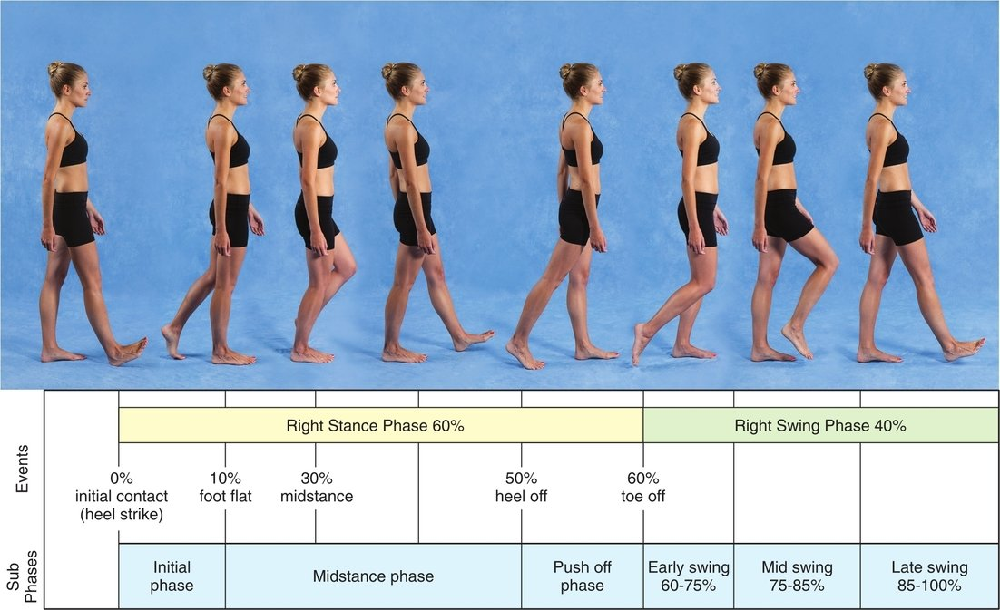

**Figure 14.1** Subdivisions of the gait cycle. ***KIA\***

| **TABLE 14.1** Phases and Events in a Gait Cycle |                         |                                    |
| ------------------------------------------------ | ----------------------- | ---------------------------------- |
| **Phases**                                       | **Events**              | **Sequential Percentage in Cycle** |
| Stance                                           | Heel or initial contact | 0                                  |
| Foot flat                                        | 8–10                    |                                    |
| Mid-stance                                       | 30                      |                                    |
| Heel off                                         | 30–50                   |                                    |
| Toe off                                          | 60                      |                                    |
| Swing                                            | Early swing             | 60–75                              |
| Mid-swing                                        | 75–85                   |                                    |
| Late swing                                       | 85–100                  |                                    |

### LIMB SUPPORT PHASES

There are two periods during the stance phase of the gait cycle when both limbs are in simultaneous contact with the ground. These phases are called **double limb support** and occur first at initial contact and again at toe off. Together, each double limb support represents 20% of the total gait cycle. **Single limb support** occurs twice during the gait cycle: once during stance phase and throughout the entire swing phase of the cycle. Each single limb support component represents 40% of the entire gait cycle. In simpler terms, only one limb is supporting the body during 80% of the gait cycle; two limbs support the body during the remaining 20% of the cycle ([Fig. 14.2](https://jigsaw.vitalsource.com/books/9780803675056/epub/OPS/c14.xhtml?favre=brett#fig14-2)). As the speed of walking increases, less time is spent in double limb support. Double limb support does not occur during running; it is replaced by periods in which both feet are off the ground at the same time. Walking speeds below normal increase the period of time that both feet are on the ground simultaneously. People who have difficulty with balance and stability often spend increased time in double limb support as a strategy to improve their stability and decrease the risk for falls.

### SPATIAL DESCRIPTORS OF GAIT

A step in the gait cycle begins when one foot strikes the ground and ends when the other foot makes contact with the ground. The **step length** is measured between the contact point of the first heel and the contact point of the second heel ([Fig. 14.4](https://jigsaw.vitalsource.com/books/9780803675056/epub/OPS/c14.xhtml?favre=brett#fig14-4)). For example, when the right heel contacts the ground, the length between that contact point and the point when the left heel makes contact is the left step length. It is the length the left limb was able to step once the right heel was planted. Step lengths vary depending on the height of the person but typically average 72 cm. The symmetry of the gait cycle can be measured by comparing the right and left step lengths ([Fig. 14.4](https://jigsaw.vitalsource.com/books/9780803675056/epub/OPS/c14.xhtml?favre=brett#fig14-4)).

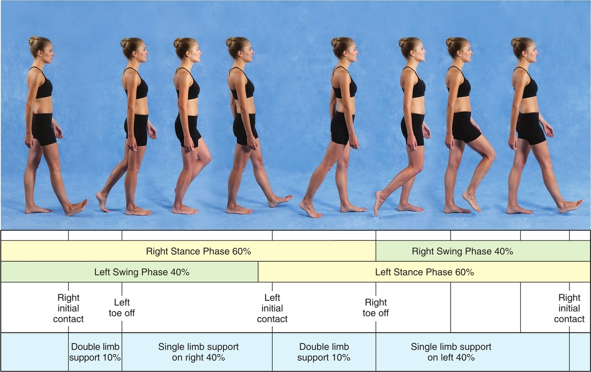

**Figure 14.2** Phases of stance and swing and periods of single and double limb support. ***KIA\***

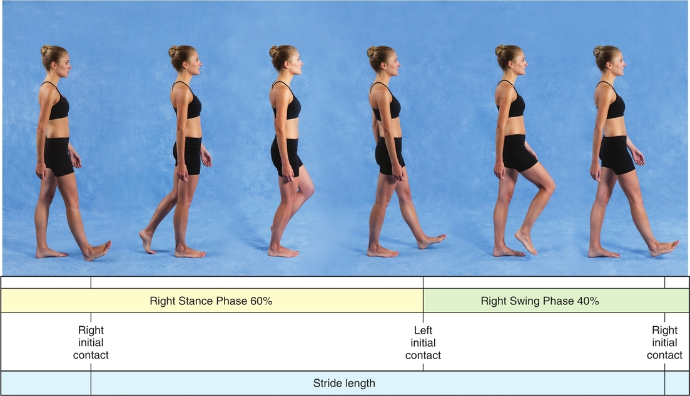

**Figure 14.3** Components of stride and step lengths.

A stride is defined as the right and left step combined together. The **stride length** is measured from the point of contact of one foot to the subsequent point of contact for the same foot and consists of a right step length and a left step length. Stride lengths average about 144 cm, and stride length represents one complete gait cycle (see [Fig. 14.4](https://jigsaw.vitalsource.com/books/9780803675056/epub/OPS/c14.xhtml?favre=brett#fig14-4)).

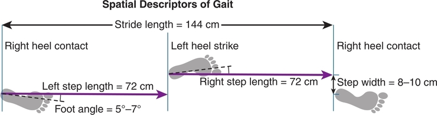

**Figure 14.4** Spatial measurements for stride length, step length, step width, and foot angle for a right gait cycle.

**Step width** is the lateral measurement between the centers of the heels of two consecutive heel strikes. This lateral distance between feet averages 8 to 10 cm. Larger step widths can indicate that the person needs a greater base of support when walking because of decreased stability and impaired balance. **Foot angle**, described as the amount of “toe out,” is the angle between the progression of the body during walking and the long axis of the foot. The average adult foot angle is 5° to 7° (see [Fig. 14.4](https://jigsaw.vitalsource.com/books/9780803675056/epub/OPS/c14.xhtml?favre=brett#fig14-4)).

### TEMPORAL DESCRIPTORS OF GAIT

In addition to spatial distances, elements of the gait cycle are measured by time, specifically, duration. The time to complete one right or left step is called **step time. Cadence**, also called step rate, is the number of steps taken per minute. **Stride time** is the time it takes for a person to complete one full gait cycle. Typically, a healthy adult takes an average of 110 steps per minute. A combination of both spatial and temporal measurements is taken when measuring **walking speed** or **gait speed**, the distance covered walking during a given amount of time. The speed is measured in either miles per hour or meters per second and is defined as the step rate multiplied by the step length. Gait speed varies among individuals and is influenced by fitness levels, strength, balance, age, height, and weight. Studies have validated the association between decreased ability to walk at normal walking speeds, especially with indoor dwellers, and an increased risk of falls. Gait speed is used in clinical settings to determine a patient’s risk of falling.

## CENTER OF MASS DISPLACEMENT DURING GAIT

The body’s center of mass (COM) is located anterior to the second sacral vertebra. As the body leans forward during walking, the COM of the body is displaced in a linear direction in front of the supporting limbs. The foot steps forward to prevent a loss of balance when the COM moves beyond the body’s base of support of the feet. This repeated forward displacement of the COM and the forward placement of the foot to prevent a fall produce the activity of walking. The COM moves twice in a vertical direction, first up and then down, during one complete gait cycle. The COM vertical height is at its lowest point during the midpoint of both periods of double limb support. The body lowers as the hip and knee flex, acting as shock absorbers during weight-bearing. The COM rises to its maximum height during the midpoint of both periods of single leg support ([Fig. 14.5A](https://jigsaw.vitalsource.com/books/9780803675056/epub/OPS/c14.xhtml?favre=brett#fig14-5)). As the hip and knee extend to a neutral position, the height promotes clearance of the swing limb. On average, the total amount of vertical displacement of the COM, from lowest to highest point, is about 5 cm for a man. Displacement of the COM during walking is often measured by tracking the movement of the head.

In addition to vertical displacement, the COM moves laterally, from side to side, during walking. Maximum lateral displacement of the COM occurs to the right at the midpoint of the stance phase on the right leg. Similarly, left maximal lateral displacement occurs at the midpoint of left stance phase. On average, total lateral displacement for an adult is about 4 cm. The amount of lateral displacement increases as the base of support of the feet increases and decreases as the base of support narrows ([Fig. 14.5B](https://jigsaw.vitalsource.com/books/9780803675056/epub/OPS/c14.xhtml?favre=brett#fig14-5)).

## JOINT KINEMATICS DURING GAIT

The activity of walking is produced by the linear progression of the body’s COM, while the joints of the lower extremities repeatedly move in angular rotational movements. These angular joint rotations occur primarily in the sagittal plane; some smaller rotational movements occur in the frontal and horizontal planes. The hip, knee, ankle, tarsometatarsal, and first metatarsophalangeal (MTP) joints move predominantly in the sagittal plane, whereas movement at the pelvis occurs mostly in the frontal plane.

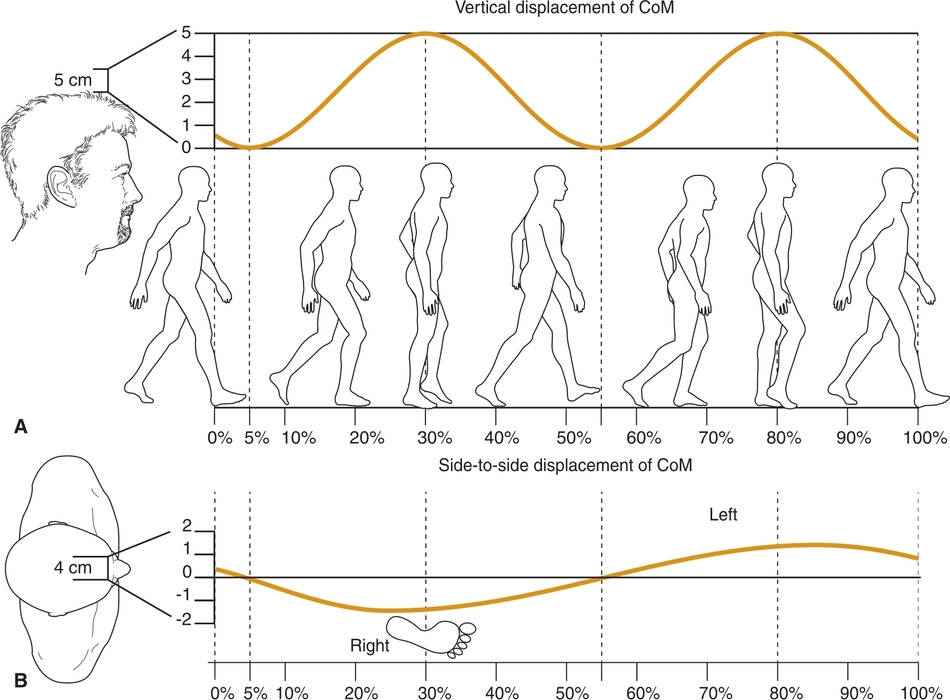

**Figure 14.5** **(A)** Vertical displacement of the center of mass (COM) during gait. **(B)** Side-to-side displacement of the COM during gait.

### PELVIS

During walking, there is a small amount of anterior and posterior tilt of the pelvis in the sagittal plane. A small amount of posterior pelvic tilt occurs at the beginning of the gait cycle, during double limb support. The pelvis then moves into an anterior tilt during single limb support. During the end of stance phase, the pelvis tilts posteriorly until just after toe off. The pelvis then moves into an anterior tilt during initial and mid-swing phase before starting to tilt posteriorly during late swing. The degree of pelvic tilting tends to increase the faster a person walks.

In the frontal plane, the pelvis rotates about 10° to 15° as a result of pelvis-on-femur hip abduction and adduction. During weight acceptance onto the right leg, the left iliac crest drops inferiorly below the height of the right iliac crest ([Fig. 14.6A](https://jigsaw.vitalsource.com/books/9780803675056/epub/OPS/c14.xhtml?favre=brett#fig14-6)). The right hip is in pelvis-on-femur right hip adduction. The left anterior superior iliac spine (ASIS) rotates forward in the horizontal plane.

As the trunk moves forward and the weight shifts over the left support leg, the right ASIS rotates forward as the right leg swings forward ([Fig. 14.6B](https://jigsaw.vitalsource.com/books/9780803675056/epub/OPS/c14.xhtml?favre=brett#fig14-6)). By left toe off, the left ASIS is in a posterior position compared with the right ASIS and then moves forward as the left lower extremity moves into the swing phase.

### HIP

At initial contact, the hip is flexed nearly 30° in the sagittal plane around a medial-lateral axis. As the body transitions forward over the foot, the hip extends and reaches about 10° of extension by heel off. During swing phase, the hip flexes again, reaching a maximum of about 30° before the foot begins to make contact with the ground ([Fig. 14.7](https://jigsaw.vitalsource.com/books/9780803675056/epub/OPS/c14.xhtml?favre=brett#fig14-7)). The hip rotates in the horizontal plane as the pelvis rotates during the gait cycle. At right initial contact, the right hip is in lateral rotation as the left ASIS is in posterior rotation. During right stance phase, the right hip moves into medial rotation as the left ASIS rotates in an anterior direction. The hip begins to laterally rotate to reach a neutral position by toe off.

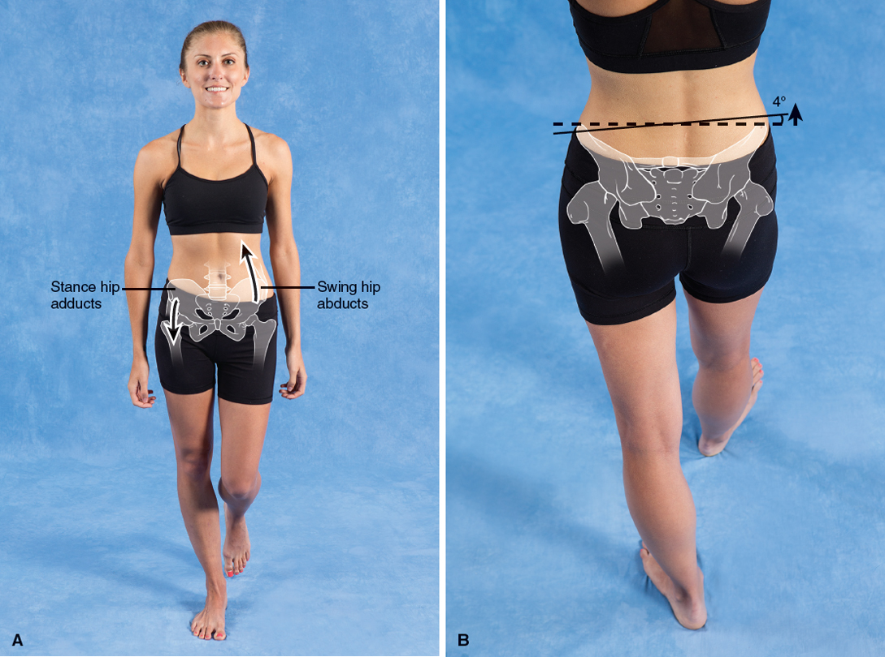

**Figure 14.6** **(A)** Pelvic tilt in the frontal plane that occurs during gait. **(B)** Rotation of the pelvis in the horizontal plane during gait.

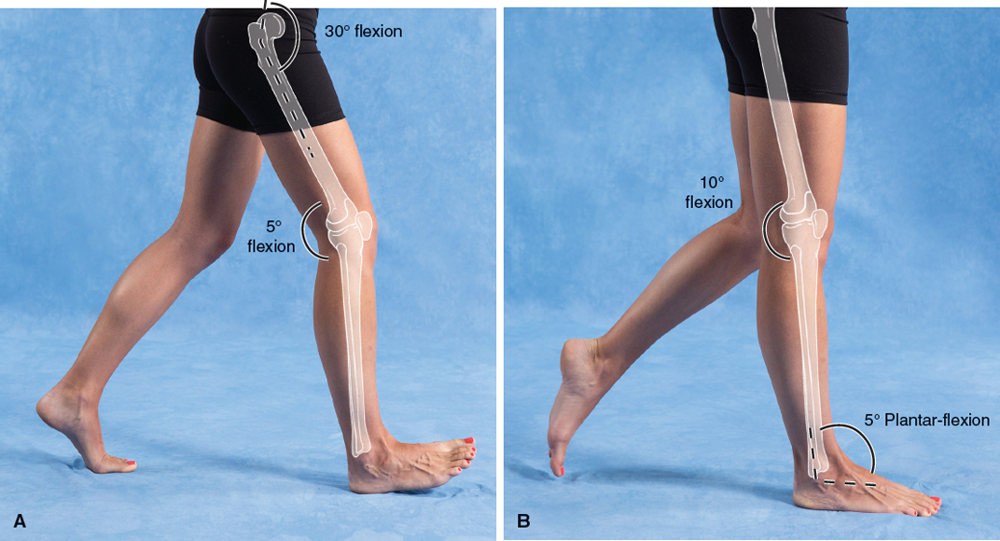
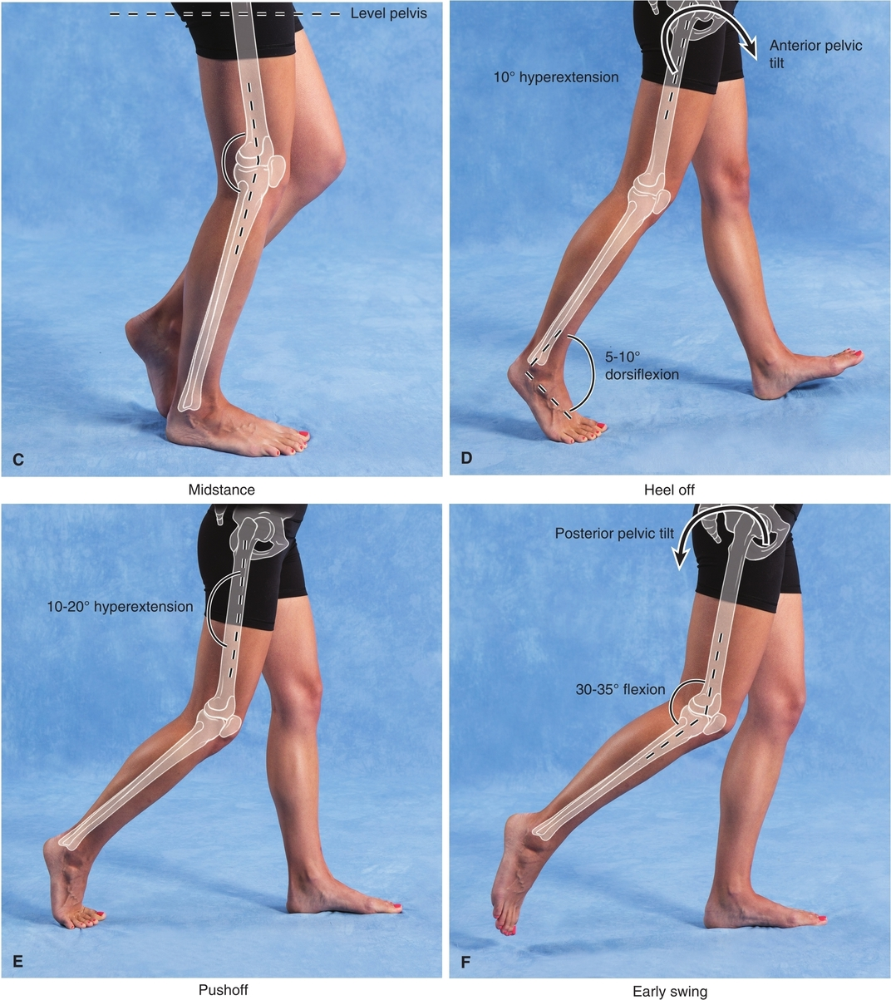
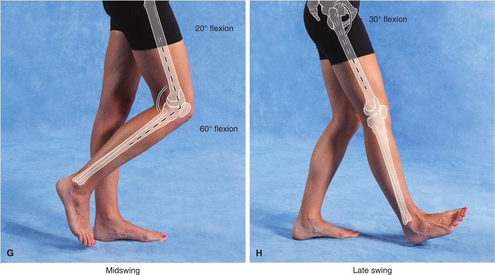

### KNEE

The knee is in approximately 5° of flexion at initial contact and continues to flex to approximately 10° to 15° as the foot makes contact with the ground. This position of flexion, controlled by the eccentric contraction of the quadriceps, facilitates weight acceptance as the body shifts over the weight-bearing limb. Slight flexion of the knee also serves as a shock-absorbing mechanism for the lower extremity. From flexion, the knee moves near full extension as the body shifts over the foot. As the heel begins to rise off the ground, the knee begins to flex, reaching about 35° of flexion at toe off. As the knee continues to flex, the limb’s distance from the ground shortens, allowing the toes to clear the ground. By mid-swing of the gait cycle, the knee approaches 60° of flexion (see [Fig. 14.7](https://jigsaw.vitalsource.com/books/9780803675056/epub/OPS/c14.xhtml?favre=brett#fig14-7)).

### ANKLE

At initial contact, the talocrural joint is in a slight amount of plantar flexion between 0° and 5°. The ankle dorsiflexors eccentrically contract to lower the foot to the ground. As the tibia moves forward over the flat foot, the ankle moves into up to 10° of dorsiflexion. The ankle moves into plantar flexion as the heel rises from the ground during heel off and reaches 15° to 20° of plantar flexion just after toe off (see Fig.14.7).

### SUBTALAR JOINT

Pronation and supination at the subtalar joint are discussed in detail in [Chapter 13](https://jigsaw.vitalsource.com/books/9780803675056/epub/OPS/c13.xhtml). At the subtalar joint during the gait cycle, the calcaneus assumes a position of about 2° to 3° of inversion in the frontal plane at initial contact. Then the calcaneus begins to evert and reaches about 2° of eversion by mid-stance. The subtalar joint then reverses its motion and reaches a neutral position by heel off before continuing to an inverted position. As the calcaneus moves into eversion and the foot pronates, the longitudinal arch flattens, and the foot becomes pliable, to adapt to various terrains. During heel off with calcaneal inversion, the longitudinal arch rises, and the foot becomes a rigid lever to assist with push off ([Fig. 14.8](https://jigsaw.vitalsource.com/books/9780803675056/epub/OPS/c14.xhtml?favre=brett#fig14-8)).

### FIRST TARSOMETATARSAL AND FIRST METATARSOPHALANGEAL JOINTS

During the gait cycle, the first tarsometatarsal joint assists with the flexibility of the medial longitudinal arch by moving in a small amount of dorsiflexion and plantar flexion. An important component of the gait cycle is the normal function of the MTP joint of the great toe. At initial contact, the first MTP joint is in a position of slight extension and then maintains a neutral position throughout the cycle until heel off. As the heel rises, the MTP joint extends to 45° to 55° of closed chain extension (see [Fig. 13.16D](https://jigsaw.vitalsource.com/books/9780803675056/epub/OPS/c13.xhtml#fig13-16)). The toes then lift off the ground, and the joint flexes slightly. Restricted toe extension during heel off can decrease the efficiency of push off during the gait cycle.

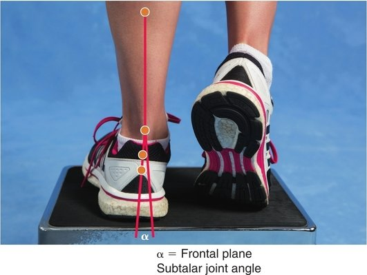

**Figure 14.8** The inversion and eversion angle of the calcaneus during walking can be measured using the lines bisecting the lower leg and the calcaneus. The calcaneus typically moves from 3° of eversion to 2° of inversion during the gait cycle.

### TRUNK AND UPPER EXTREMITIES

During normal walking, the arms swing in a rhythmic pattern that is opposite the pattern of the lower extremities. As the hip moves into flexion, the ipsilateral arm moves into extension. Conversely, as the lower extremity extends, the ipsilateral arm flexes. Although the magnitude of arm swing between flexion and extension varies among individuals, the pattern of movement is fairly consistent. The function of the arm swing balances the small rotational components of the trunk that occur during walking. This small amount of trunk rotation in the horizontal plane places the shoulder girdle in a rotated position opposite to the pelvis. Both arm swing and this small amount of trunk rotation contribute to an efficient gait pattern.

## MUSCLE ACTIVITY DURING GAIT

### HIP AND KNEE MUSCLE ACTIVITY

Both the hamstrings and the gluteus maximus start to activate at the end of late swing to extend the hip and prepare the leg to accept the weight at the beginning of initial contact and in stance phase. The hip extensors prevent uncontrolled trunk flexion as the trunk is displaced forward over the supporting limb. The gluteus maximus continues to contract throughout the stance phase, supporting the body weight. The muscle is mainly inactive during the swing phase until late swing, when it increases its activity to slow the flexing hip and begin active hip extension.

During the gait cycle, the hip flexors lift the lower extremity during toe off and help the foot clear the ground during initial swing phase. During the second half of swing phase, the limb swings forward as a result of the momentum gained by the leg during initial swing, without needing activation of the hip flexor muscles. The hip abductor muscles are activated during the gait cycle on the stance leg to eccentrically lower the contralateral pelvis on the side where the leg is in swing phase of the cycle. The hip abductors work concentrically in late stance to control the frontal plane alignment of the femur.

The components of the quadriceps play different roles during normal walking speeds. The vasti muscles begin to activate during the final components of swing phase and assist with shock absorption at initial contact. They eccentrically control knee flexion as the body weight transfers to the standing limb. The quadriceps then contract concentrically to extend the knee and support the body weight during mid-stance. As the lower extremity transitions from stance to swing phase, the rectus femoris assists with hip flexion and eccentrically controls knee flexion.

### ANKLE AND FOOT MUSCLE ACTIVITY

At initial contact of the heel with the ground, the tibialis anterior, extensor digitorum longus, and extensor hallucis longus activate eccentrically to decelerate plantar flexion of the ankle as it lowers to the ground. During swing phase, these same muscles produce enough ankle dorsiflexion to clear the toes from the ground.

The plantar flexor muscles, including the gastrocnemius, soleus, and secondary muscles that contribute to plantar flexion (see [Chapter 13](https://jigsaw.vitalsource.com/books/9780803675056/epub/OPS/c13.xhtml)), are active throughout stance phase to eccentrically control forward movement of the tibia and fibula over the ankle. Without this control, the knee can move into excessive uncontrolled knee flexion during the stance phase. The plantar flexors provide a push off action as they increase their activity near heel off. They produce a plantar flexion torque that assists in the forward propulsion of the body. The activation of the plantar flexor muscles decreases to nearly zero as the toes leave the ground during the toe off phase.

In addition to its contribution as a plantar flexor, the tibialis posterior is an important supinator of the foot during the first half of the gait cycle. As the foot makes contact with the ground, the tibialis posterior decelerates and controls foot pronation. The muscle then begins to concentrically supinate the foot from mid-stance to toe off. The tibialis posterior is prone to overuse injuries as it works to control excessive pronation in people with overly pronated feet.

In addition to their contributions as plantar flexors, the peroneus (fibularis) longus and brevis balance the supinators of the foot by their action as pronators. The peroneus (fibularis) longus also anchors the first ray to the ground as the body shifts over the weight-bearing limb to reach the end of the stance phase (sometimes called terminal stance). The muscle assists the foot in functioning as a rigid lever during the end of stance phase and heel off. The intrinsic muscles of the foot stabilize the foot and support the medial longitudinal arch during stance phase.

## ATYPICAL GAIT PATTERNS

Dysfunction in one or more body systems can interfere with the normal biomechanics of walking and produce atypical gait patterns. Impairments in the motor, sensory, perceptual, or cognitive systems can contribute to atypical gait patterns. Whether the impairments involve the neurological system, the musculoskeletal system, or a combination of the two, several common patterns can emerge. Some common gait dysfunctions that result from muscle weakness, paralysis, or shortening of the muscles and associated connective tissue structures are discussed in this section. Although these atypical patterns of gait allow the individual to maintain the ability to walk, the patterns are usually very inefficient: They can increase the energy expended during walking, the stresses to the body, and the risk of falls and injury.

### FOOT SLAP AND FOOT DROP

Muscle weakness or paralysis is a common cause of atypical gait patterns. Dysfunction of the tibialis anterior and other ankle dorsiflexors that normally eccentrically control ankle dorsiflexion at initial contact can result in a gait deviation called foot slap ([Fig. 14.9A](https://jigsaw.vitalsource.com/books/9780803675056/epub/OPS/c14.xhtml?favre=brett#fig14-9)). The term comes from the characteristic sound made by the foot as it slaps the floor during its uncontrolled descent to the ground. Impairment of these same muscle groups can result in a drop foot pattern (also called a high steppage gait) seen during swing phase. Because the muscles do not dorsiflex the ankle at swing phase, the foot is in a dropped position and may not clear the ground as the limb attempts to swing forward. To compensate for this inability to clear the foot off the ground, the person may use excessive hip and knee flexion to lift the entire limb farther from the ground ([Fig. 14.9B](https://jigsaw.vitalsource.com/books/9780803675056/epub/OPS/c14.xhtml?favre=brett#fig14-9)). People who cannot control dorsiflexion when walking may benefit from an ankle-foot orthosis either to assist with dorsiflexion or to prevent plantar flexion depending on their specific needs.

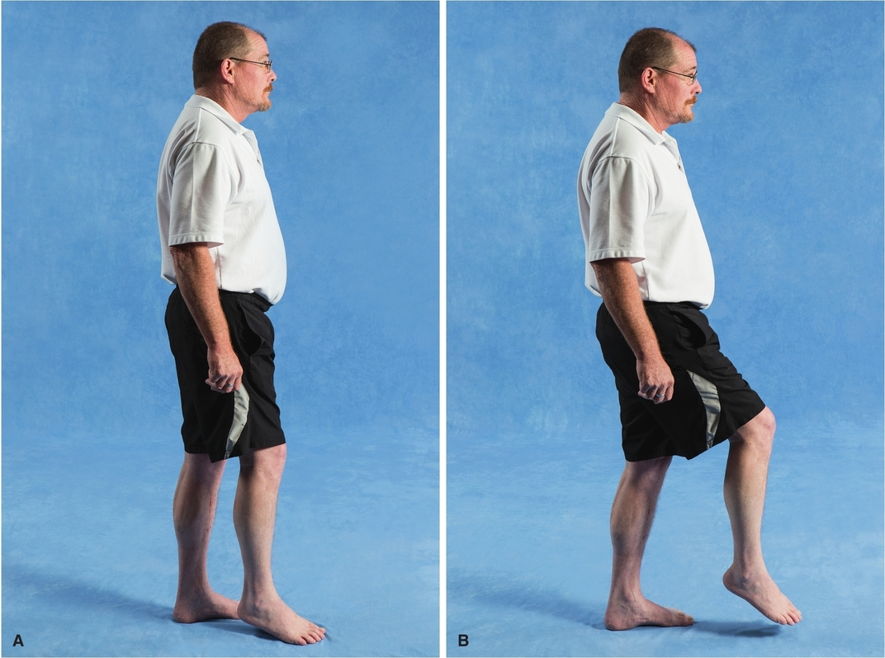

**Figure 14.9** Weak dorsiflexor muscles can produce foot slap **(A)** or foot drop **(B)**.

### GLUTEUS MAXIMUS LURCH

If the gluteus maximus is weak and cannot maintain the hip in extension, it jackknifes into flexion when the heel strikes the ground. The hip then moves into hyperextension at mid-stance. This extreme rocking forward and backward motion of the trunk and hips is called a gluteus maximus lurch ([Fig. 14.10A](https://jigsaw.vitalsource.com/books/9780803675056/epub/OPS/c14.xhtml?favre=brett#fig14-10)). Weakness in the knee extensors can produce genu recurvatum, a condition in which the knee remains in full extension or hyperextension throughout the stance phase. The weak quadriceps have difficulty controlling knee flexion as the limb is loaded, resulting in decreased knee stability at mid-stance. The trunk leans anteriorly to move the COM anterior to the axis of the knee. This produces passive knee extension in an attempt to increase knee stability without the function of the knee extensor musculature ([Fig. 14.10B](https://jigsaw.vitalsource.com/books/9780803675056/epub/OPS/c14.xhtml?favre=brett#fig14-10)).

### TRENDELENBURG GAIT

Hip abductor weakness of the stance limb can produce excessive downward dropping of the pelvis on the non–weight-bearing side. This pelvic drop is called a positive **Trendelenburg sign**. To compensate for this hip abductor weakness when walking, the trunk leans laterally toward the stance limb in a compensatory Trendelenburg gait ([Fig. 14.11](https://jigsaw.vitalsource.com/books/9780803675056/epub/OPS/c14.xhtml?favre=brett#fig14-11)). If the weakness is bilateral, and the trunk leans to each side during stance phase, the result is known as a waddling gait.

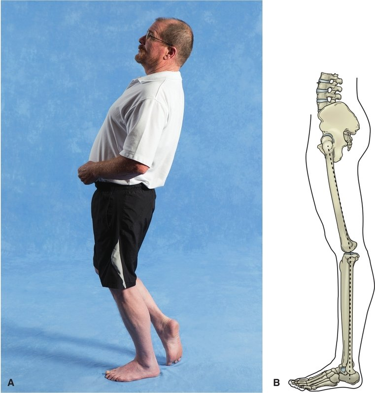

**Figure 14.10** Weak hip and knee extensor muscles can result in gluteus maximus lurch **(A)** or genu recurvatum **(B)**.

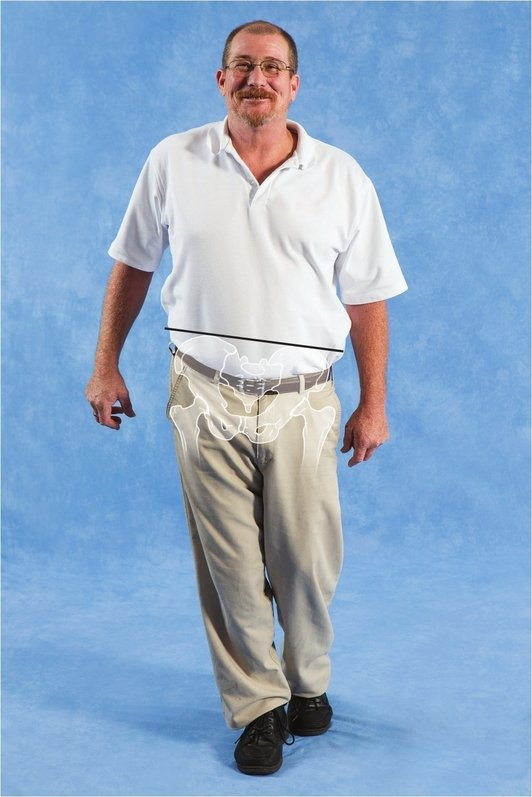

**Figure 14.11** A Trendelenburg gait compensates for hip abductor weakness.

### VAULTING, HIP HIKING, AND CIRCUMDUCTION GAIT

Decreased range of motion as a result of soft tissue tightness or contractures or muscle spasticity can increase the difficulty of shortening the limb during swing phase by flexing the hip, knee, and foot. The ability to clear the limb during swing phase and propel the body forward is impaired. Strategies that may be used to compensate for this decreased ability are vaulting, hip hiking, and circumduction.

In vaulting, the person rises up on the toes on the stance limb to produce a limb longer than the swing limb. This height increase can provide enough clearance for the impaired limb to progress forward ([Fig. 14.12A](https://jigsaw.vitalsource.com/books/9780803675056/epub/OPS/c14.xhtml?favre=brett#fig14-12)). Hip hiking produces a similar increase in functional leg length by elevating the pelvis in the frontal plane on the stance leg. This increase in stance leg length can provide additional height to allow the swing leg to clear the ground. In circumduction, the person swings the affected limb in a circular motion, rather than flexing it in the sagittal plane, to move the leg during swing phase ([Fig. 14.12B](https://jigsaw.vitalsource.com/books/9780803675056/epub/OPS/c14.xhtml?favre=brett#fig14-12)).

| **TABLE 14.2** Common Changes in Gait in Older Adults |                                                      |
| ----------------------------------------------------- | ---------------------------------------------------- |
| Spatial and Temporal Changes                          | **Kinesiology Changes**                              |
| Decreased step length                                 | Decreased arm swing                                  |
| Decreased stride length                               | Decreased hip, knee, and ankle flexion               |
| Increased stride width                                | Decreased stability                                  |
| Increased stance phase                                | Decreased ability to absorb shock at initial contact |
| Increased double limb support time                    | Decreased ability to generate power during push off  |
| Decreased swing phase                                 |                                                      |
| Decreased walking speed                               |                                                      |
| Decreased step rate                                   |                                                      |

### OTHER GAIT PATTERNS

An antalgic gait pattern can result when a person is trying to avoid putting weight on a painful limb. Typically, to avoid standing on the painful limb, the stance time will be shorter on the painful side than on the opposite side. The step length of the uninvolved side will be shorter as the person avoids standing on the painful limb.

Many neurological disorders impair muscle function and result in abnormal gait patterns. The concepts related to impaired motor control and muscle function as a result of neurological involvement are beyond the scope of this text. However, despite the cause of any atypical gait pattern, the components of the gait cycle and the spatial and temporal measures described in this chapter can be used to describe the gait pattern. For example, a gait pattern common in people who have Parkinson disease is called festinating gait, characterized by absent arm swing, a flexed trunk, and short accelerating steps. An ataxic gait pattern can be seen in many neurological disorders. Typically, in an ataxic gait the step lengths and step width are irregular and uneven. The steps do not occur in a rhythmic pattern, and there is decreased limb control and exaggerated limb movement.

A relationship has been identified between gait speed and lower extremity strength in older adults. As strength decreases, the ability to generate speed decreases, contributing to gait disorders in older adults and individuals with neurological pathology. [Table 14.2](https://jigsaw.vitalsource.com/books/9780803675056/epub/OPS/c14.xhtml?favre=brett#tab14-2) outlines gait pattern changes that can occur in older adults without specific neurological involvement.

|  | Visit Kinesiology in Action and answer the posttest questions to evaluate your understanding of the chapter. |
| ------------------------------------------------- | ------------------------------------------------------------ |
|                                                   |                                                              |

## CHAPTER SUMMARY

For a person to ambulate in the most efficient and safest manner, the segments and systems of the body must work in synergy, each providing information to and receiving output from the central nervous system. The components of walking are broken down into the functional units of the gait cycle. The gait cycle is further divided into specific events and phases occurring within the cycle that can be quantified in terms of spatial or temporal measurements or a combination of the two. Initial measurements can provide a baseline to compare against future measurements after a period of rehabilitation. For example, a person may have a 12-cm step width before rehabilitation that decreases to 8 cm after doing strengthening and balancing activities. Reduction in step width can indicate a more stable gait pattern. Measuring stride or step lengths or gait speeds before and after rehabilitation interventions can indicate improvement in a person’s functional ability to walk.

During each gait cycle, the body’s joints move in specific ranges of motion. Muscles are activated in specific sequences to provide stability, control, or movement, depending on where they are needed in the gait cycle. Impairments in the available range of motion needed for a movement or dysfunction of any of the muscles activated during walking can result in atypical gait patterns. Although a person may be able to walk with an atypical gait pattern, the pattern usually requires more energy because of its inefficiency, placing greater demands on the cardiopulmonary and musculoskeletal systems. The pattern can also increase joint stresses, causing degenerative joint changes over time.

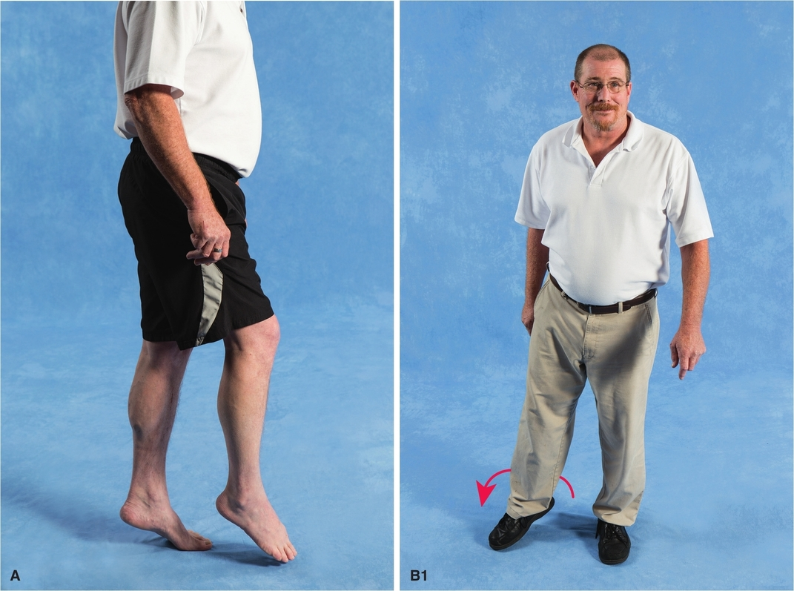
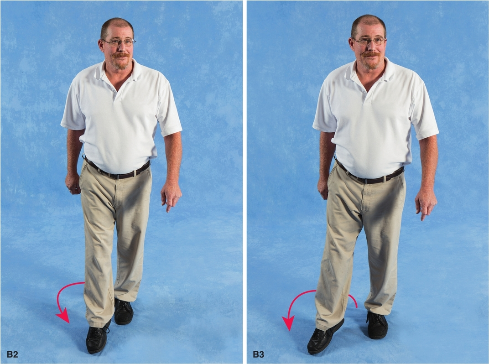

**Figure 14.12** To compensate for a decreased ability to shorten the swing limb, a person may plantar flex the stance limb, resulting in a vaulting gait **(A)**, or swing the affected limb in a circular motion to clear the ground in a circumduction gait **(B)**.