- anterior portion of the spinal column consists of the vertebral bodies and intervertebral discs, weight-bearing surfaces that provide shock absorption and mobility in various directions. 
-  posterior section of the spinal column protects the spinal cord; guides and limits motion; and, through elongation of muscles over the bony segments, increases the mechanical advantage of the muscles. 

## SPINAL STRUCTURES

### SPINAL CURVES

+ **kyphotic curve** and is classified as a primary curve. 
+ As the infant begins to lift the head against gravity while in a prone position, a secondary **lordotic curve** develops in the cervical spine. 

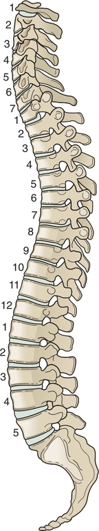

### VERTEBRAE

#### Bony Structures

- anterior vertebral structures provide weight-bearing and mobility
- vertebral foramen
  - large opening posterior to the vertebral body that functions as a canal through which the spinal cord passes down the length of the vertebral column. 
- neural arch, 
  - pedicles 
    - transmit forces generated by trunk muscles and by positions of the spine to the anterior vertebral bodies
  - posterior vertebral structures : control motion in the spine.
    - transverse process
    - spinous processes 
      - oriented horizontally or inferiorly depending on the region of the spine. 
      - Both the transverse and the spinous processes are sites for ligament and muscle attachments.
    -  pars interarticularis 
      - withstands flexion forces and can be an area involved in stress fractures.
    - transverse foramen 
      - provides a protective passageway for the vertebral artery. 
    - superior articular processes and inferior articular processes that project from each pedicle

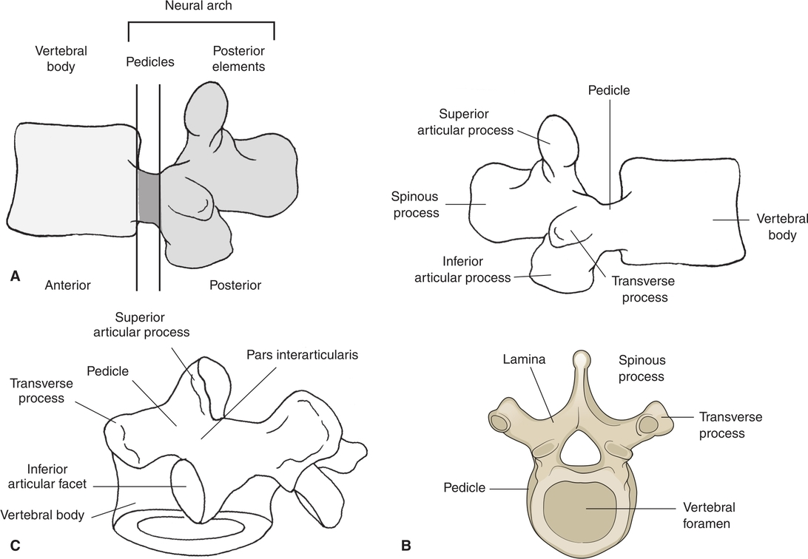

##### **Clinical Connection 5.1**

- Defects in the pars interarticularis can result from congenital malformation, fracture, or degenerative changes as a result of aging or obesity. 
- spondylolisthesis. 
  - anterior slippage of the vertebra on the one below it. 
  - discomfort and hypermobility from overstretched posterior ligaments and joint capsules to sensory changes and motor weakness from compression on spinal nerves or the spinal cord.
  -  percent of slippage is measured on a radiograph. 
  - Symptoms often respond to core stabilization exercises and stretching of shortened soft tissue. Large degrees of slippage may require surgical intervention before the patient can begin rehabilitative exercises.

#### Facet Joints

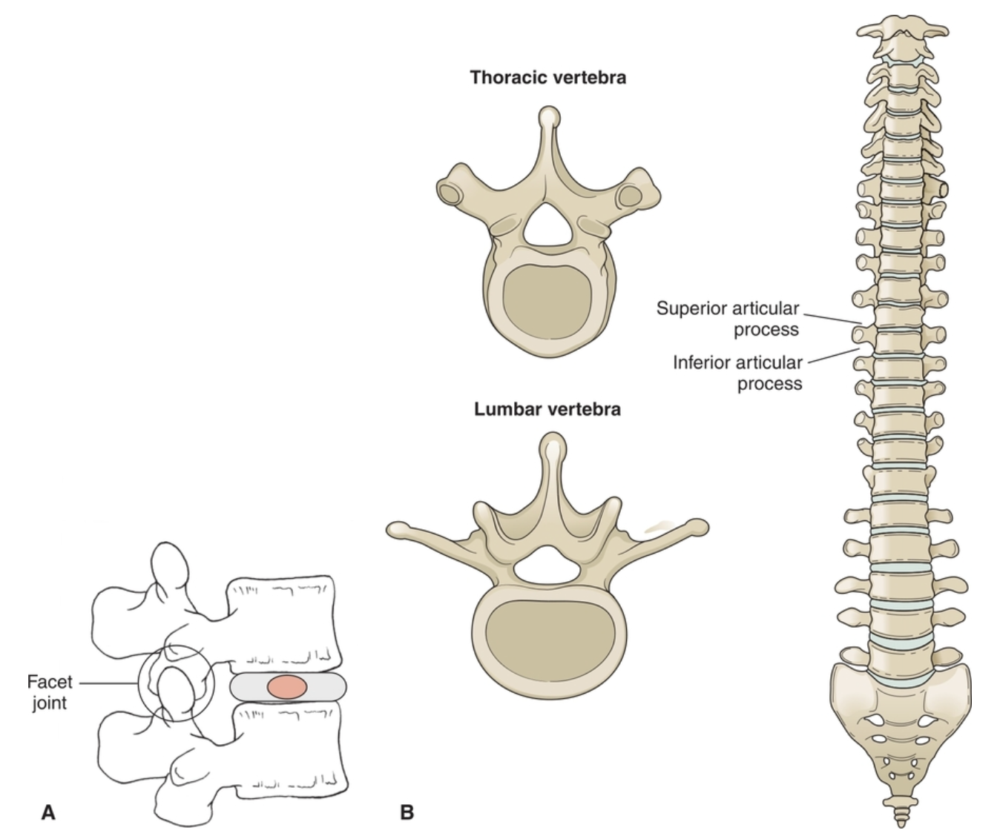

- The facet joints (zygapophyseal joints) 

  - articulation between the right and left superior articular processes and the inferior right and left articular processes, one on each side of the vertebra

  - guide spinal movement, and the planes of orientation of the joints determine the directions of movement for various levels in the spine. 
    - cervical facets are typically oriented in a plane approximately 45° between the frontal and the transverse planes. 
      - cervical rotation in the transverse plane and lateral bending in the frontal planes. 
    - thoracic spine, the facets are generally oriented in the frontal plane, 
      - more lateral bending compared with thoracic flexion or extension. 
    - Lumbar facet joints tend to be oriented closer to the sagittal plane, 
      - flexion and extension in the sagittal plane

#### Intervertebral Discs

- facet joints for appropriate alignment 
- sufficient space for the passage of nerves and vascular structures through the vertebral foramina. 
- shock absorbers
- The IVDs make up 20% to 30% of the length of the spine and increase in size from 3 mm in the cervical region to 9 mm in the lumbar spine.
- fibrocartilaginous joints are symphysis-type joints that have movement in all three planes and nonlinear anterior and posterior gliding. Although the movement between each intervertebral joint is slight, their combined movement allows the spine to move in long arcs of motion.

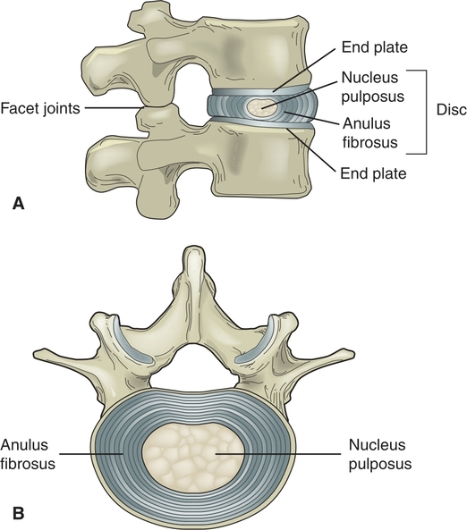

**Figure 5.5** ***(A)\*** Sagittal view of an intervertebral disc with end plate attachments to the vertebrae. Discal spacing assists with alignment of the facet joints and formation of the intervertebral foramen. ***(B)\*** Frontal view of an intervertebral disc. ***KIA\***

- With prolonged compression and bending forces to the spine, such as seen while sitting in a slumped posture for several hours, there can be a shift in loading from the nucleus pulposus to the anulus. This excessive loading can cause buckling or prolapse of the anulus.

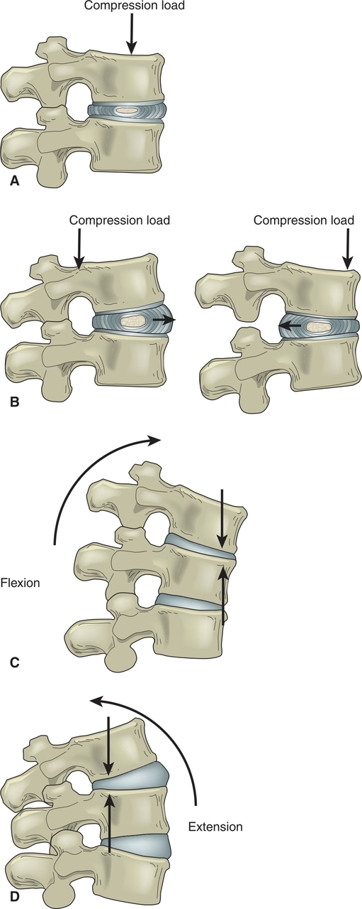

##### **Clinical Connection 5.2**

- The central nucleus pulposus can protrude into the anulus but still be contained by the outer layers (A), or 
- it can extrude through the anulus, while maintaining contact with the disc (B). 
- A *sequestered nucleus* describes an extruded nucleus that has separated from the disc; fragments of the nucleus can enter the epidural spinal canal (C). 
- Irritation and compression of spinal nerve roots can produce pain, sensory impairment, and motor weakness in the extremities. 

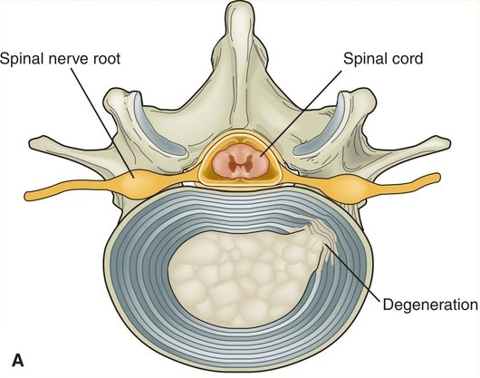

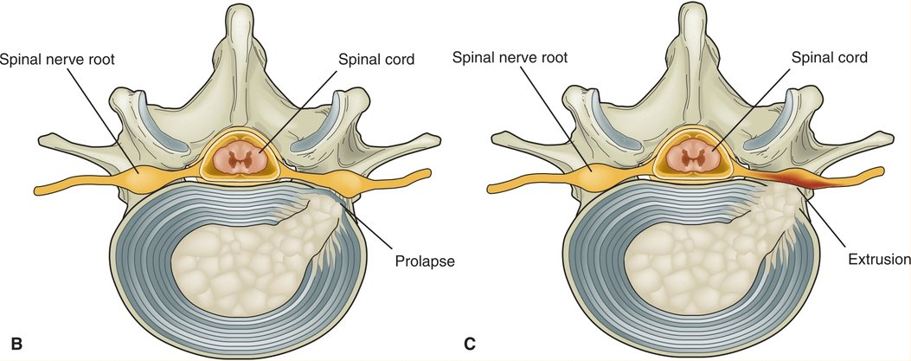

#### Ligaments

- anterior longitudinal ligaments and posterior longitudinal ligaments span nearly the entire length of the spine from C2 to the sacrum. 
  - The anterior longitudinal ligament runs along the anterior and lateral surfaces of the vertebral bodies and discs from the sacrum to C2. At the level of C2, extensions of the anterior ligament become the atlanto-occipital and atlantoaxial ligaments. 
  - The anterior longitudinal ligament is twice as strong as the posterior longitudinal ligament and is compressed during spinal flexion and stretched during extension, preventing hyperextension especially in the lumbar and cervical lordotic curves. 
- The posterior longitudinal ligament lines the anterior surface of the vertebral bodies and discs from the sacrum to C2, where the fibers intertwine with the atlanto-occipital and atlantoaxial membranes.

- supraspinous ligaments 
  - connect the tips of the spinous processes of the vertebrae from the level of C7 to L3 or L4. In the cervical spine, the ligaments become the nuchal ligament that connects the base of the skull to the upper cervical vertebra.
  -  At the base of the skull, the nuchal ligament is an attachment site for the upper trapezius muscles. 
- Deep to the supraspinous ligaments are the interspinous ligaments that connect adjacent spinous processes 
- supraspinous and interspinous ligaments are the first structures that can be injured with excessive spinal flexion. 
- The medial branches of the dorsal rami, which may transmit sensory impulses related to pain when the low back is injured, innervate the interspinous ligaments. Damage to these structures and the mechanoreceptors located in the ligaments may also play a role in the loss of recruitment of spine stabilizer muscles often seen with spinal injuries.

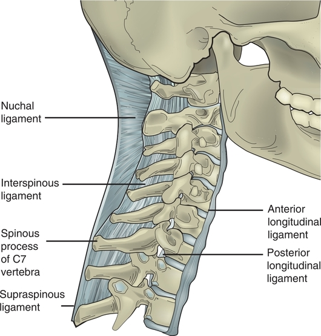

**Figure 5.8** Sagittal view of the spinal ligaments. ***KIA\***

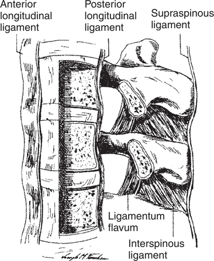

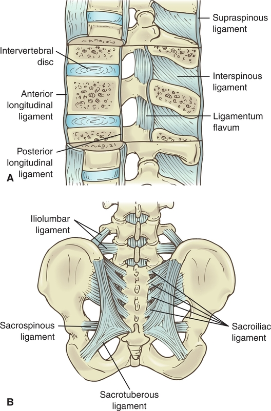

- ligamentum flava are a series of 23 intersegmental ligaments that connect the lamina for two adjacent vertebra running from C2 to the sacrum. These highly elastic ligaments have fibers that cover the anterior surfaces of the facet joints and form the posterior surface of the vertebral canal. 
  - resist forward flexion and assist in returning the spine from a flexed position to an erect posture 

- Intertransverse ligaments attach adjacent transverse processes to each other and to deep spinal muscles. 
  - stretched on the contralateral side and compressed on the ipsilateral side during trunk lateral bending 
- iliolumbar ligament is a strong, short ligament that runs from each transverse process of L5 and from adjacent fibers of the quadratus lumborum to the pelvis. The ligament attaches along the medial aspect of the crest of the ilium securing each fifth lumbar vertebra to the iliac crest and the sacrum

## SPINAL KINEMATICS

-  **coupled motion** when the motion around one axis is consistently associated with the motion around another axis. 
  - most common coupled motions in the spine are lateral bending and rotation 
- Without the IVDs, vertebral bodies would be able to slide only one on the other during translatory motion. 
- The IVD allows a vertebra to rock or tilt on another one, increasing the range or arc of movement
- The orientation of the facet joints determines the direction in which the vertebra or vertebrae tilt and glide. If the facet joints are oriented in the sagittal plane, the largest ranges of motion are flexion and extension. 

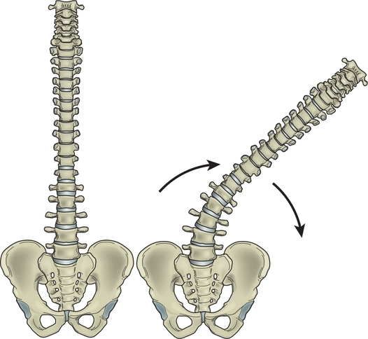

**Figure 5.11** Lateral flexion of the spine is a coupled motion with spinal rotation.

## REGIONAL SPINAL CHARACTERISTICS

### CERVICAL REGION

- cervical lordosis 
- most prominent spinous process in the cervical spine is typically at the C7 level. 
- craniovertebral occipital condyles of the occiput and C1 and C2. The lower cervical spine is composed of the vertebrae C3 through C7. 

- C1 (known as the atlas), has no vertebral body or spinous process. 
  - The motion of occipital flexion and extension (a nodding movement of the head on the atlas) occurs at the atlanto-occipital joint.
  - consists of a pair of condyloid joints. It is a synovial joint. no disk
- C2 (known as the axis), articulates with C1 to form the atlantoaxial joints. 
  - a vertical projection called the dens (also known as the odontoid process)
  - posterior groove articulates with the transverse ligament that holds the dens in place anteriorly. 
  - The alar ligament provides posterior stability to the atlantoaxial joint. 
  - Between 55% and 58% of the total amount of cervical rotation occurs at the atlantoaxial joints. The remainder of cervical rotation occurs throughout the cervical spine
  - the **atlantoaxial joint does not have an intervertebral disc**. This joint is secured by a thick, strong ligament called the transverse ligament.

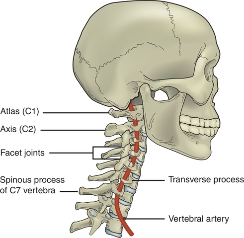

**Figure 5.13** Sagittal view of the upper and lower cervical spine.

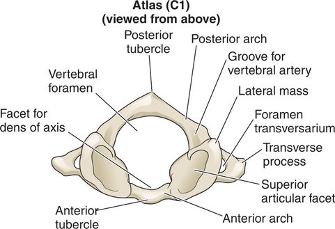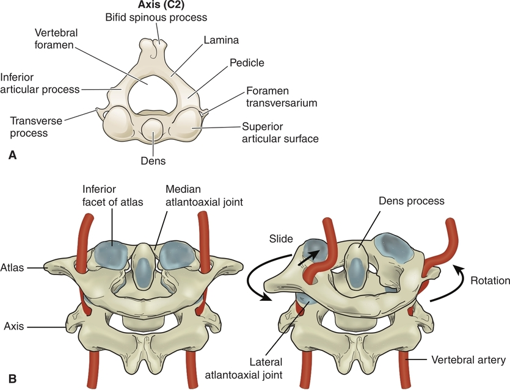

- normal averages are about 50° of flexion, 60° to 80° of extension, 40° to 45° of side bending, and 80° of rotation. 
- Cervical side-bending is coupled with rotation. This movement normally allows the entire cervical spine to flex so that the chin touches the chest, to extend so that the anterior neck forms a vertical line from the chin to the chest, and to rotate so that a person can look over the shoulder when backing up in a car 

##### **Clinical Connection 5.3**

-  forward head posture. who display rounded shoulders, a flexed lower cervical spine, and an extended upper cervical spine (craniocervical protraction) (A). This neck position is called protraction. 
- Tight anterior chest and superficial neck flexor muscles, weak cervical and thoracic extensor muscles, and weak deep cervical flexor muscles are often the result of poor posture while working on a computer, carrying a heavy backpack, or participating in activities where the head is protruded in a forward position. 
- **benefit from exercises to strengthen weakened muscles and stretch shortened muscles and soft tissue.** 
- **Exercises and postural training promote lower-to-mid–cervical spine extension and upper craniocervical spine flexion (craniocervical retraction) (B).**

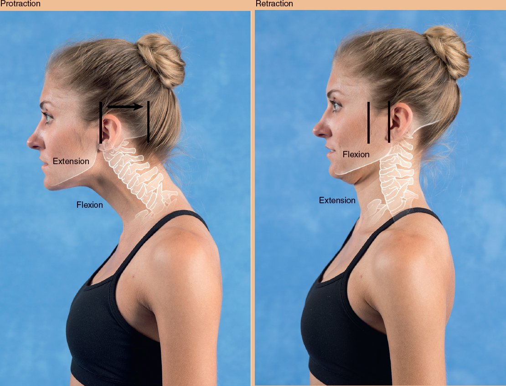

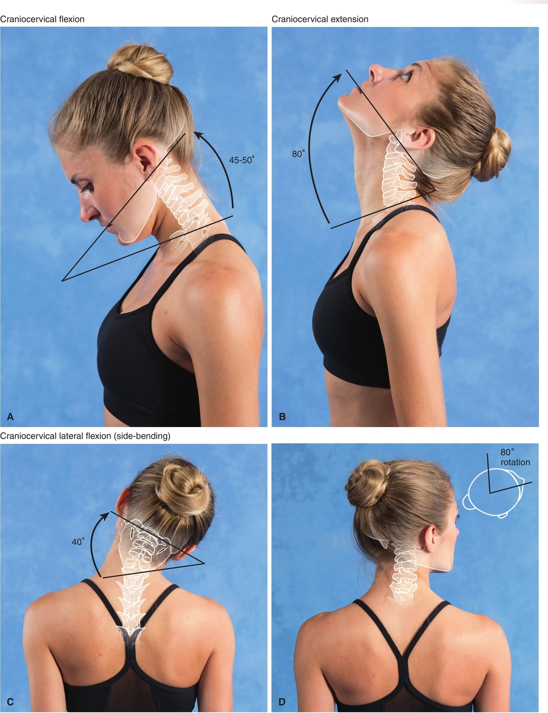

### THORACIC REGION

- thoracic kyphosis. 
- increase secondary to habitual forwarded slump posture that results in overstretching of posterior spinal muscles and connective soft tissue and increasing shortening of anterior thoracic structures. 
  - Trunk extensor muscles become weaker as they are overlengthened and can no longer hold the spine in an erect position. 
  - Shortening of the trunk flexor muscles and connective tissue pull the spine into more flexion. As shown in
  - often associated with a forward head position.
  - **also occur as a result of vertebral changes associated with diseases such as osteoporosis. As the vertebrae collapse with osteoporosis, the anterior trunk structures shorten, and the posterior trunk structures become overlengthened and weak.**

- With the exception of T1 and T12, the thoracic vertebral bodies have equal heights and depths, which increases the stability of the thoracic spine and decreases its mobility. The spinous processes in the thoracic spine are oriented in a downward direction, downward projection and segmental overlap limits extension in the thoracic spine

- flexion and extension are limited in the thoracic spine. 
  - In the upper thoracic spine, lateral flexion is typically coupled with rotation in the same direction, but these directions may be coupled in the opposite direction in the lower thoracic spine. 
  - general ranges of thoracolumbar motion average 70° to 85° for flexion, 35° to 40° for extension, 45° for lateral bending, and 30° to 40° for rotation

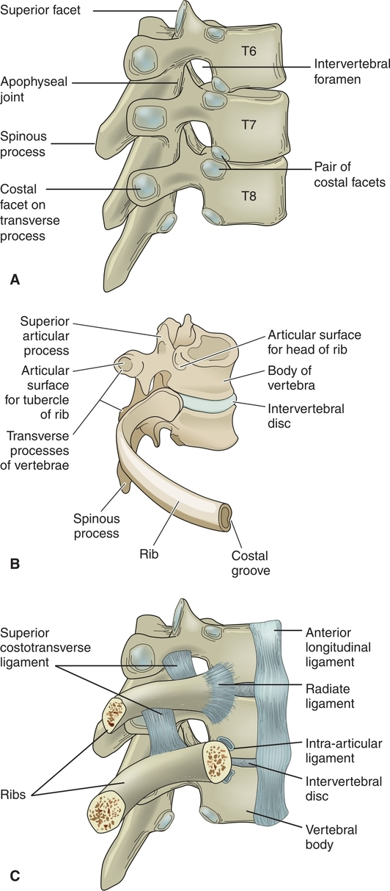

### LUMBAR REGION

- The lumbar spinous processes are directed horizontally, and the facet joints are oriented in the sagittal plane, supporting increased ranges in flexion and extension. 
- highest degree of flexion occurs at L5-S1
- Lateral flexion coupled with rotation tends to be greater in the upper lumbar levels compared with the lower levels
- lumbar lordosis. 
- The fifth lumbar vertebra changes to more of a wedge shape to articulate with the sacrum at the lumbosacral junction of L5-S1. 
  - This junction is subject to large amounts of anterior shear forces produced by body weight and forms an angle called the **lumbosacral angle**. between the L5-S1 articulation and the horizontal plane. The position of the pelvis changes the angle and influences the lumbar curvature. An increased angle results in a greater amount of lumbar lordosis and greater shearing forces at the L5-S1 joint
    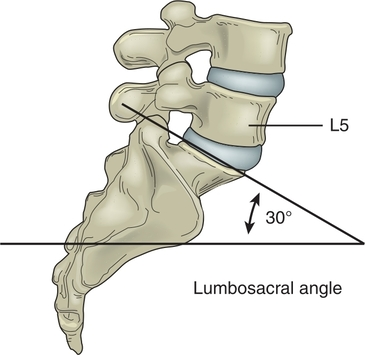
- The ligamentum flavum and the anterior longitudinal ligaments are sturdy and well developed in the lumbar region, in contrast to the posterior longitudinal ligament, which becomes thinner as it progresses toward the sacrum. The supraspinous ligaments may end by levels L3 or L4, and the iliolumbar ligament replaces the interspinous ligament at L5-S1. 
- The iliolumbar ligament is a group of ligamentous bands that run from the tips of the transverse processes at L5 to the iliac crests on each side of the vertebra. This ligament functions to resist excessive movement of L5 on S1 and can be a source of low back pain when injured.
- A sturdy complex fascial system, the thoracolumbar fascia, functions to increase trunk and pelvis stability during heavy lifting and high-intensity whole-body work. 
  - large thick posterior layer that gives rise to the latissimus dorsi and erector spinae muscles. 
  - anterior and middle layers attach to the lumbar transverse processes and iliac crests. 
    - associated with the internal and external abdominal obliques and the transverse abdominis muscles.
  - As core spine stabilizer muscles contract, they produce passive tension in the fascia, increasing spinal stability. 
  - Contraction of the gluteus maximus and contralateral latissimus dorsi increases tension in the fascia and assists with transmitting forces between the trunk and the pelvis
  - 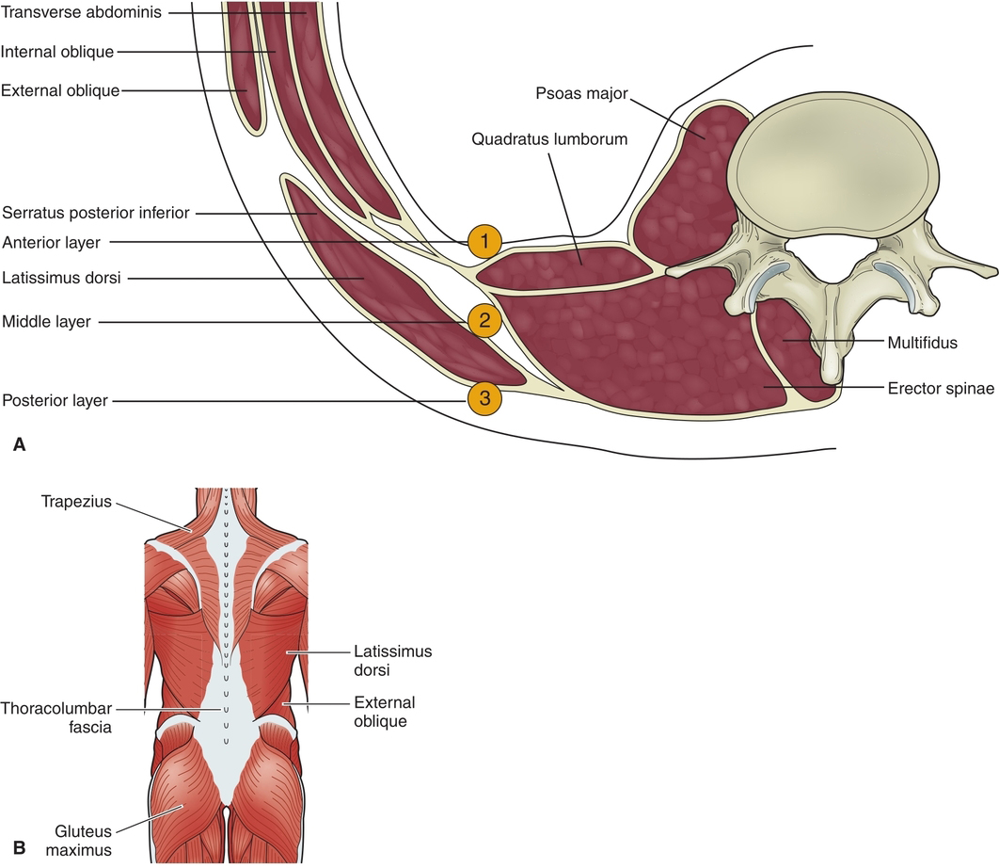
- 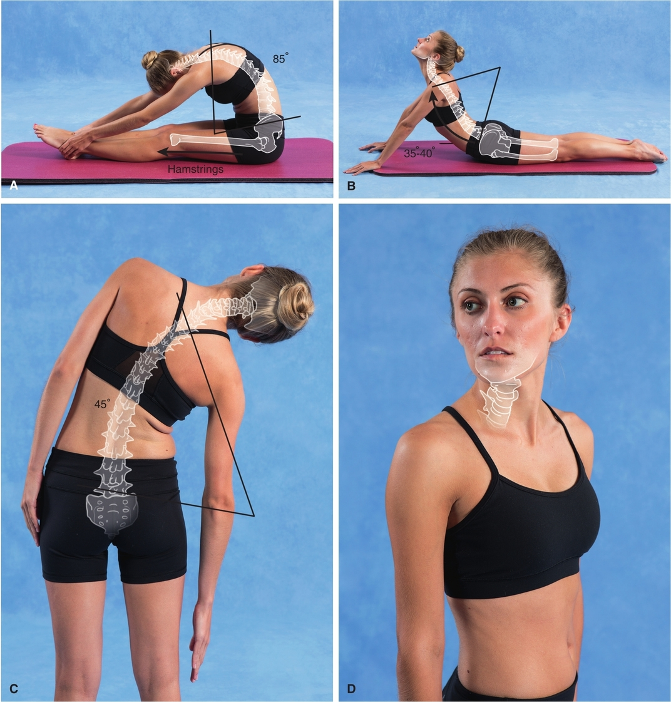

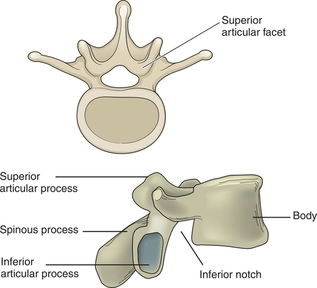

### SACRAL REGION

- sacroiliac (SI) joint

  - sacral surface of the SI joint is covered by hyaline cartilage;
  -  the iliac surface consists of fibrocartilage. 
  - synovial joint 
  - weight-bearing surface that relieves stress on the pelvis. 
  - sacroiliac ligaments function as shock absorbers to counter weight-bearing forces between the sacrum and the ilium. 
    - The sacrospinous ligament binds the ischial spines of the lateral borders of the sacrum and the coccyx, 
    - sacrotuberous ligament attaches the sacrum to the ischial tuberosity
  - 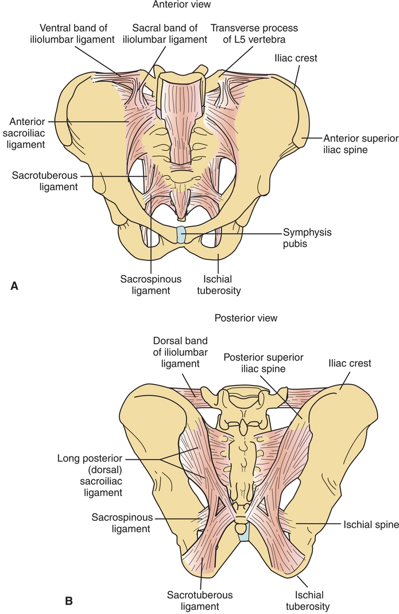

- symphysis pubis

  -  cartilaginous joint between the two anterior portions of the pelvic ring. 
  -  a fibrocartilaginous disc that joins the hyaline cartilage surfaces of each end of the joint. 
  - it widens in women to expand the pelvic area during childbirth.

- sacral movement. 

  - **Nutation** is movement of the sacrum when the base moves anterior and inferior while the apex moves posterior and superior  When the trunk moves into flexion while in a standing position, the sacrum moves in nutation. 
  -  **counternutation** when the sacral base moves posterior and superior and the apex moves anterior and inferior 
  - 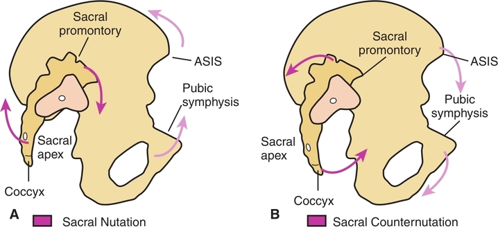

- **anterior pelvic tilt** 

  - anterior superior iliac spine of the pelvis and the pubic symphysis move inferiorly. 
  - excessive anterior tilt of the pelvis, there is an increase in lumbar extension. 
  - decreases the space in the intervertebral foramen and moves the discal material in an anterior direction

- **posterior pelvic tilt**, 

  - increases the diameter of the intervertebral foramen and moves the nucleus pulposus posteriorly 

- pelvis can also rotate around a vertical axis in a horizontal plane. It can move in abduction and adduction in the frontal plane around a sagittal axis

- 

  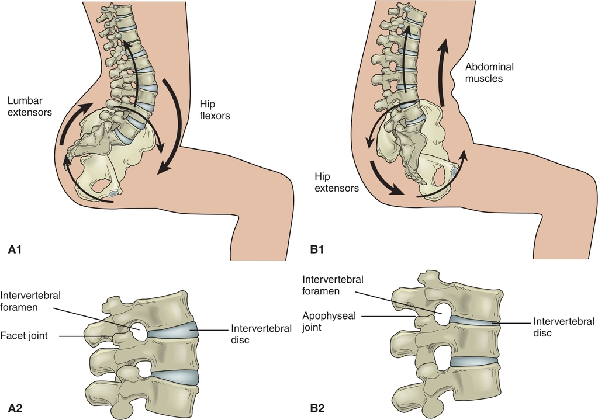

  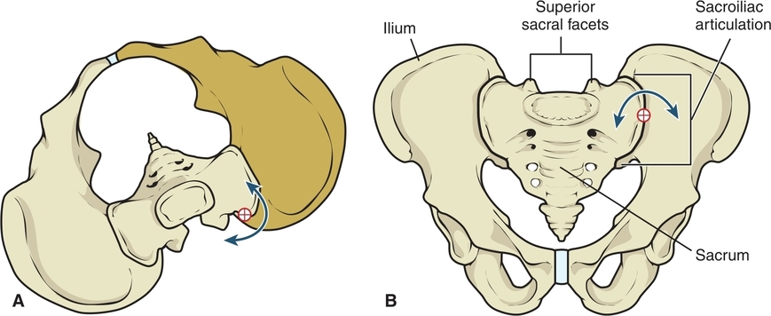

## SPINAL MUSCLES

### POSTERIOR SPINAL MUSCLES

- superficial layer: the trapezius, latissimus dorsi, rhomboids, levator scapula, and serratus anterior.
  - influence the movement of the scapula during shoulder movement and are discussed in detail in 
  - Bilateral activation of these muscles produces spinal extension in the region of the muscle, whereas unilateral contraction can cause lateral flexion and rotation. 
    - Upper trapezius 
      - contraction of bilateral upper trapezius muscles produces cervical extension, but unilateral contraction causes **ipsilateral lateral flexion and contralateral rotation** of the head and neck. 
      - upper trapezius muscles contract to elevate the scapulae. 
    - levator scapula 
      - deep to the trapezius and attaches proximally to the transverse processes of C1 through C4. The 
      - bilaterally to elevate the scapulae, assist with scapular downward rotation 
      - ipsilateral lateral head and neck flexion and rotation.
- Cervical Region
  - **splenius capitis and splenius cervicis**
    - deep to the levator and function as the primary movers of the head and neck. 
    - extend the head and cervical spine. 
    - Unilateral contraction produces cervical rotation. 
  - semispinalis capitis and semispinalis cervicis are deeper
    -  assist with neck and head extension. 
  - longissimus capitis and longissimus cervicis muscles
    - deeper and lateral to the semispinalis. 
    - compress the cervical spinal segments. 
  - deep suboccipital muscles produce occipital extension ([Fig. 5.27](https://jigsaw.vitalsource.com/books/9780803675056/epub/OPS/c05.xhtml?favre=brett#fig5-27)).
- middle layer 
  - erector spinae 
    -  longissimus and iliocostalis muscle groups
    - ribs and thoracic transverse processes to form muscles in the thoracic region. 
    - lumbar area, the long muscle tendons form the erector spinae aponeurosis that inserts into the lumbar spinous processes, sacrum, and iliac crest 
    - long moment arm and produces lumbar and thoracic extension when contracting bilaterally, and flexion and rotation when contracting unilaterally. 
    - forward trunk flexion in standing, the erector spinae muscle group eccentrically controls forward bending motion against the force of gravity. The strong erector spinae aponeurosis, thoracolumbar fascia, and posterior ligaments assist with controlling the descent of the trunk.
- deep layer
  - semispinalis, multifidus, and deep rotator muscles.
  - originate from the transverse process and attach to the spinous processes spanning one to eight intervertebral segments. 
  - thickest in the lumbosacral area. 
  - control segmental shear and torsion of the vertebrae

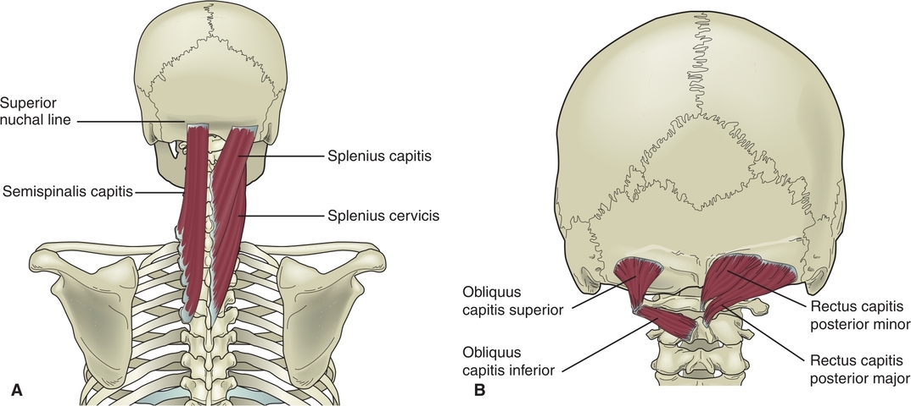

**Figure 5.27** ***(A)\*** Posterior cervical muscles. ***(B)\*** Suboccipital muscles.

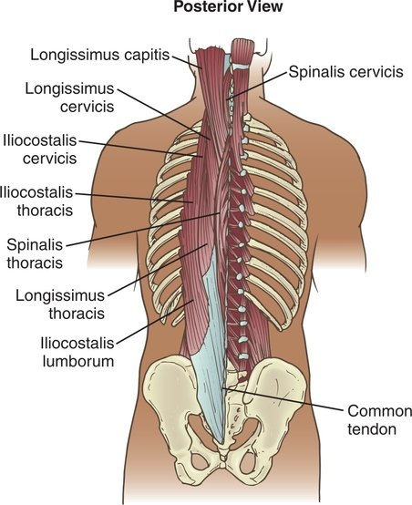

**Figure 5.28** The erector spinae muscle group. *(From Starkey C, Brown D*. Examination of Orthopedic and Athletic Injuries, *4th ed., Philadelphia, PA: F. A. Davis Company, 2015, p. 482, with permission.)*

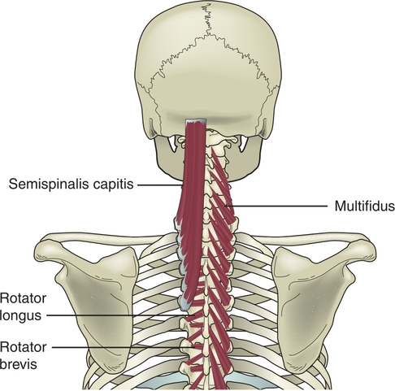

**Figure 5.29** The transversospinal muscle group.

- quadratus lumborum
  - bilateral frontal plane trunk stability. 
  - attaches inferiorly to the iliolumbar ligament and iliac crest and superiorly to the 12th rib and transverse processes of L1 through L4 
  - during a single leg stance position, the quadratus can “hip hike” the unloaded side by elevating or hiking the pelvis. People with paraplegia who require bracing when walking may use this hip hike pattern. By hiking the pelvis, the person is able to raise the lower extremity enough to clear the foot during the swing phase of ambulation.

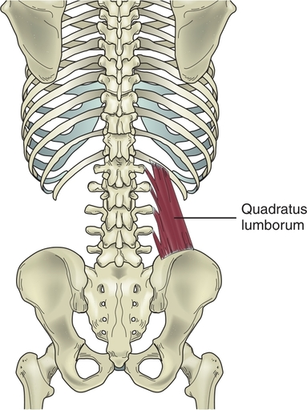

### ANTERIOR SPINAL MUSCLES

##### Cervical Region

- anterior, middle, and posterior scalenes. 
  - 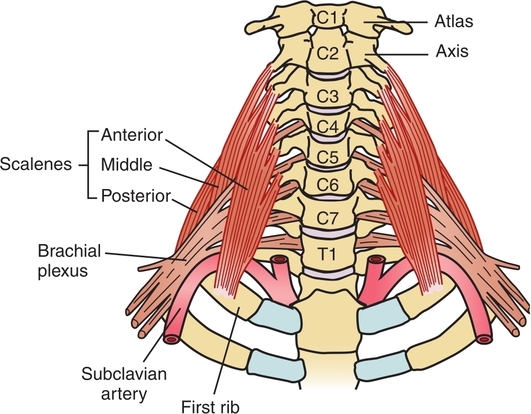
  - attach to the anterior tubercles of the transverse processes of cervical vertebrae and the first two ribs forming a triangular configuration. 
  - When the cervical attachments are relatively fixed, 
    - elevate the first two ribs. 
    - active inspiration
  - thoracic rib cage is stationary, 
    - move the cervical spine. 
    - ipsilateral lateral flexion of the cervical spine coupled with a small degree of rotation. 
    - cervical flexion but only to a small degree. 
    - **brachial plexus** and the subclavian artery and vein pass between the anterior and middle scalene muscles. These structures can be compressed between the muscles and the first rib and **may produce neurologic symptoms of pain, numbness, and tingling in the arm** 
- sternocleidomastoid 
  - attachments to the manubrium, clavicle, and mastoid process.
  - **primary mover for lower cervical flexion** when contracting bilaterally. 
  - a small amount of extension in the atlantoaxial and atlanto-occipital joints. Unilateral contraction produces ipsilateral lateral flexion and contralateral cervical rotation ([Fig. 5.32](https://jigsaw.vitalsource.com/books/9780803675056/epub/OPS/c05.xhtml?favre=brett#fig5-32)).

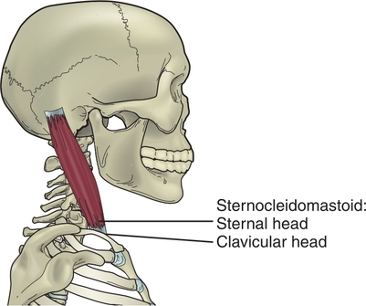

- longus capitis and longus colli 
  - 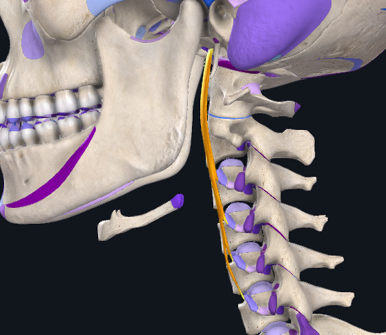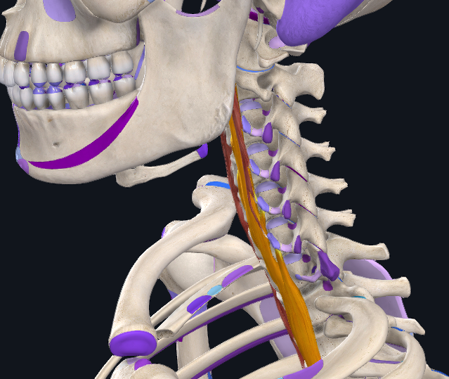
  - deep muscles located posterior to the trachea and esophagus. 
  - stabilize the spine with compression forces and assist with flexion. 
- rectus capitis anterior and rectus capitis lateralis
  - small cross-sectional area, 
  - small amount of movement as the anterior muscle provides suboccipital flexion of the occiput on the atlas, while the lateralis produces lateral flexion at the joint.

##### Trunk region

- rectus abdominis
  - primary mover of trunk flexion
  - divided into sections by fascia, covered by a fascial sheath, and separated into right and left sides by a fibrous band of connective tissue called the linea alba. 
  - attaches superiorly to the cartilages of ribs 5 through 7 and the xiphoid process of the sternum. Its fibers are oriented longitudinally and attach to the pubis. 
  - flexes the thoracic and upper lumbar spine and posteriorly tilts the pelvis.

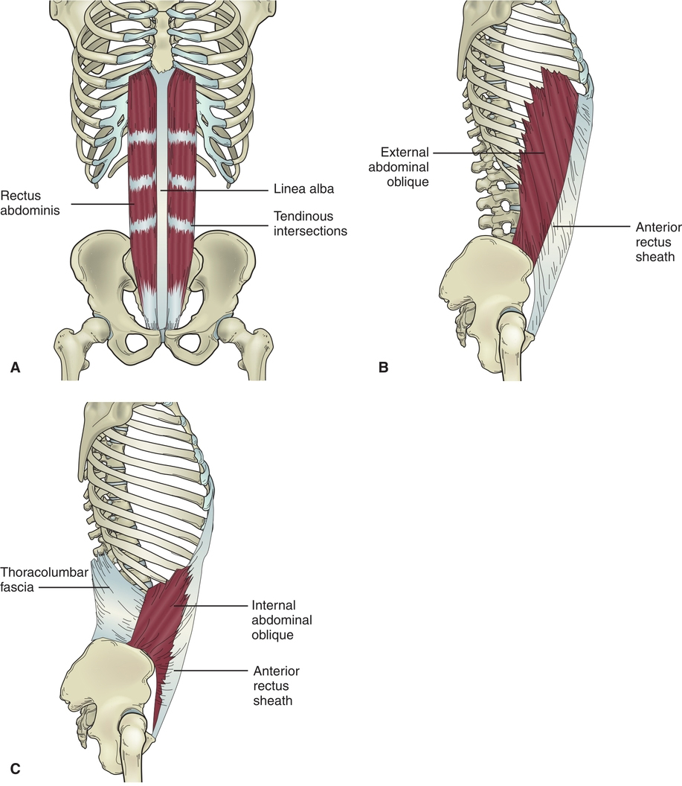

- external and internal oblique muscles
  - originate posterolaterally on the trunk and run obliquely toward the midline as they merge with the linea alba. 
  - external oblique muscle runs from a superior lateral to a medial inferior point. 
  - internal oblique muscle, whose fibers run in the opposite direction from the external oblique. The obliques are trunk rotators: 
  -  diagonal rotational force
- transversus abdominis
  - deepest of the abdominal muscles, 
  - compresses the abdomen and helps stabilize the lumbar area through its attachments to the thoracolumbar fascia. 
  - stabilization of the SI joints. 

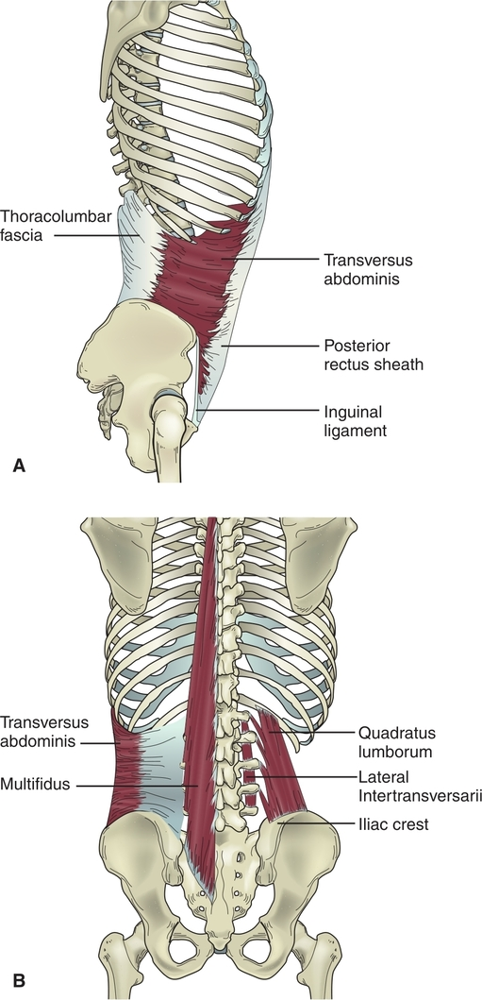

- iliopsoas plays
  - psoas muscle originates in the lumbar area and attaches to the lesser trochanter of the femur
  - distal end of the psoas merges with the iliacus muscle that runs from the iliac crest to the lesser trochanter. 
  - principal hip flexors, moving both the femur on the pelvis and the pelvis on the femur. 
  - psoas plays a role as a vertical stabilizer of the spine as it compresses the lumbar segments providing spinal stability during hip flexion.

## SPINAL MUSCLE STABILIZATION AND ALIGNMENT

- People with acute and chronic low back pain 
  - often display significant atrophy in the multifidi that can occur within days of the onset of symptoms. 
  - Activation of the transversus abdominis and multifidi is often ineffective or absent 
  - exercises to strengthen the lumbar multifidi and transversus abdominis muscles 
  - Lumbar stabilization exercises are designed first to activate the deep lumbar stabilizers and then progress to contraction of the primary trunk movers
  - 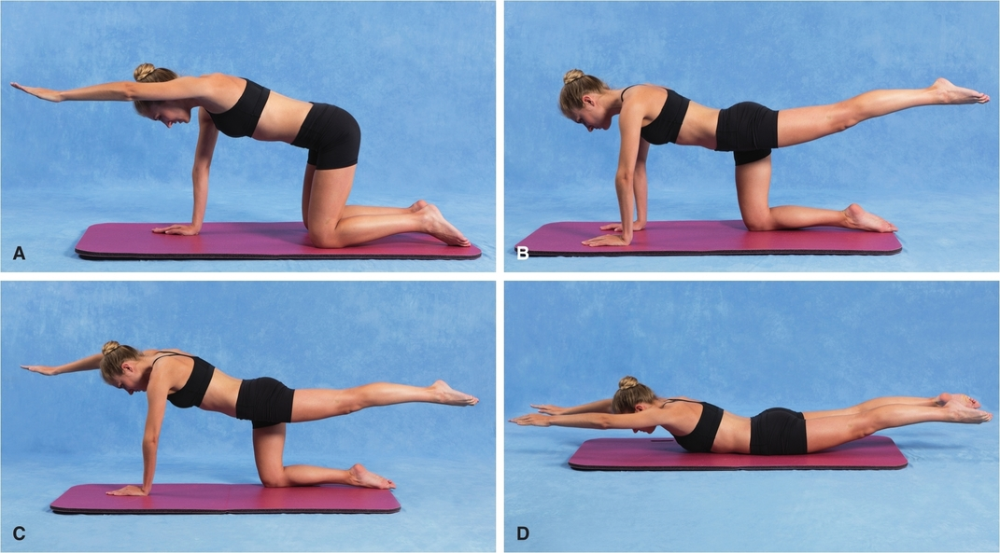
- slouched sitting posture. 
  - excessive lumbar flexion with the decreased lumbar lordosis and increased thoracic kyphosis,
  - cervical spine is in flexion anterior to the thoracolumbar vertebrae. 
  - extends the occipital vertebrae to take the eye level from a downward orientation. 
  - protracted posture (lower cervical flexion and occipital extension), which can result in spinal pain and dysfunction and upper extremity symptoms. 

