The posterior thoracic vertebrae, the circumferential ribs, and the anterior sternum form the closed system of the thorax ([Fig. 6.1](https://jigsaw.vitalsource.com/books/9780803675056/epub/OPS/c06.xhtml?favre=brett#fig6-1)). The thorax provides an anchor for muscle attachments of the arms, head, neck, vertebral column, and pelvis. It also provides external protection for the vital organs of the heart and lungs and for the viscera located in the thoracic cavity. This chapter explores the important role of the thorax in ventilation. [Chapter 5](https://jigsaw.vitalsource.com/books/9780803675056/epub/OPS/c05.xhtml) discussed the posterior bony and connective tissue structures that form the articulations between the thoracic vertebrae and the ribs, including the 12 thoracic vertebrae and their articulations with each rib. This chapter examines the anterior articulations and the role anterior and posterior structures play in ventilation. [Chapter 5](https://jigsaw.vitalsource.com/books/9780803675056/epub/OPS/c05.xhtml) explained the role of trunk muscles in movement of the spine. In this chapter, the discussion focuses on how these same muscles function as muscles of ventilation. For efficient ventilation that meets the respiratory needs of the body, there must be adequate mobility of the bony components of the thorax and optimal activation of the respiratory muscles to move the thorax.

## STRUCTURES OF THE THORAX

### STERNUM

The sternum is the long, flat bony plate located in the midline of the anterior upper chest. It forms the anterior wall of the thorax and is located anterior to the heart. Its anterior surface is slightly convex, whereas the posterior surface is concave. The body of the sternum is joined to the manubrium superiorly forming the manubriosternal joint that is supported by the manubriosternal ligament. It is a synarthrodial joint that has a fibrocartilaginous disc. The suprasternal (jugular) notch is located on the superior end of the bone, and lateral to the notch are the clavicular facets of the sternoclavicular joints. The manubrium articulates with the first costal cartilage and first ribs inferior to the sternoclavicular joint at the first sternocostal joint. The sternal angle, where the sternum joins the manubrium, can usually be easily palpated and is used as a landmark for locating the second rib that attaches at this point. A series of costal facets on the lateral borders of the sternum articulate with ribs 2 to 7. The sternum forms another articulation inferiorly as it joins the xiphoid process. This sternoxiphoid joint is also a synarthrodial joint and commonly ossifies by the age of 40 years ([Fig. 6.2](https://jigsaw.vitalsource.com/books/9780803675056/epub/OPS/c06.xhtml?favre=brett#fig6-2)).

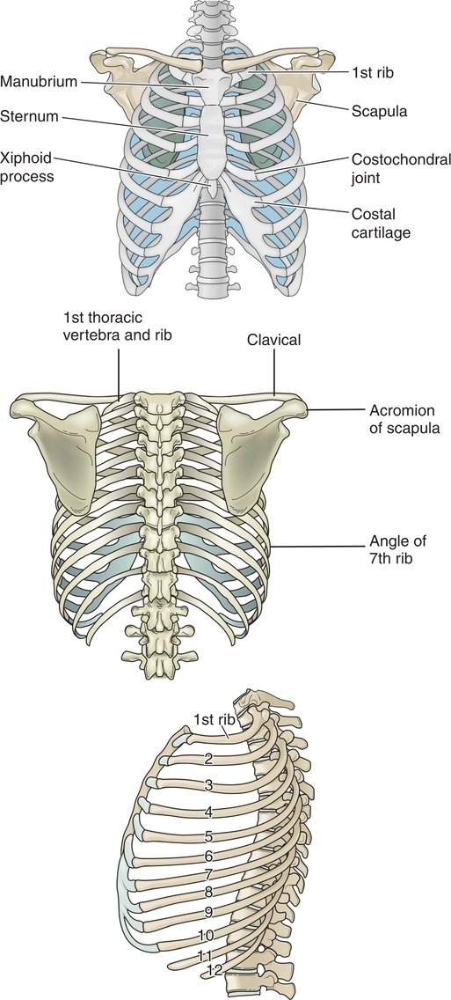

**Figure 6.1** The components of the thorax: sternum, thoracic vertebrae, and 12 pairs of ribs with their costicartilages. *(From Cowen V*. Pathophysiology for Massage Therapists: A Functional Approach. *F. A. Davis Company, Philadelphia, PA: 2016, p. 88, with permission.)*

### RIBS

The 12 ribs that form the thorax are curved flat bones that gradually increase in length from ribs 1 to 7 and then shorten from ribs 8 to 12. The first seven pairs of ribs articulate with the lateral sides of the sternum through their cartilaginous ends, forming the sternocostal joints. The sternocostal joints have a costochondral junction between the rib and cartilage interface and a chondrosternal junction between the cartilage and sternal attachment. Although there is little movement at the costochondral junctions and the first chondrosternal junction, chondrosternal junctions 2 through 7 are synovial joints and display slight gliding motions during changes in thoracic volume. Radiate ligaments reinforce these synovial joints.

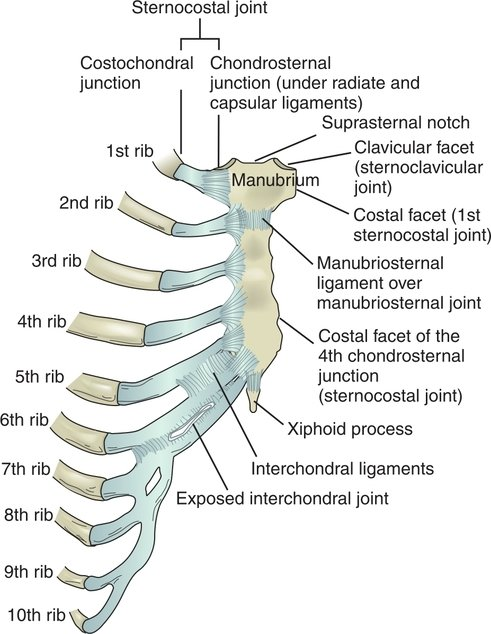

**Figure 6.2** Anterior view of the sternum and associated joints with ligaments formed between the parts of the sternum and between the sternum and ribs 1 through 10. Ribs 11 and 12 do not articulate with the sternum. ***KIA\***

The cartilaginous borders of ribs 5 through 10 form the interchondral joints that are reinforced by the interchondral ligaments. Ribs 11 and 12 do not have an anterior attachment to the sternum. Posteriorly, the heads of the ribs articulate with the vertebral bodies and interposed intervertebral discs, as described in [Chapter 5](https://jigsaw.vitalsource.com/books/9780803675056/epub/OPS/c05.xhtml). The heads of ribs 1 through 12 and the thoracic vertebral bodies form the costovertebral joints. Ribs 1 through 10 and their corresponding transverse processes form the costotransverse joints. Typically, costotransverse joints are absent for ribs 11 and 12 ([Fig. 6.3](https://jigsaw.vitalsource.com/books/9780803675056/epub/OPS/c06.xhtml?favre=brett#fig6-3)).

Because of their anterior and posterior attachments, ribs 1 through 10 form a closed kinematic chain in which the articulating segments are interdependent. These ribs form the costovertebral and costotransverse joints posteriorly and articulate either directly or indirectly anteriorly to the sternum. The mobility of these ribs is adequate for ventilatory function but restricted enough to stabilize the thorax as it protects internal organs.

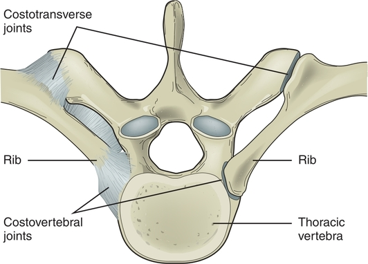

**Figure 6.3** Costovertebral and costotransverse joints. ***KIA\***

## VENTILATION

Ventilation is the mechanical process by which air is inhaled and exhaled as it passes through the respiratory system—the airways and the lungs. In ventilation, the body receives oxygen and expels carbon dioxide in the air exchange between the lungs and the blood. In adults, normal respiration is rhythmical, quiet, and not labored and occurs at a rate of 12 to 20 breaths per minute. The process is life sustaining and can be adversely affected by pathologies that alter the mechanical process of ventilation.

In the nondiseased state, the term **quiet ventilation** describes ventilation during low-intensity activities that have low metabolic demands. The respiration rate (breaths per minute) and respiration depth are on the low end of the normal values spectrum. As activity levels and metabolic demands increase, the rate and depth of ventilation can increase to a point where ventilation is described as **forced ventilation**. The range between quiet and forced ventilation depends on a person’s level of fitness and the health of the respiratory system.

The study of ventilation kinematics includes the concepts of lung volumes and lung capacities. The amount of air that moves in and out of the respiratory system during quiet breathing is called the **tidal volume**. In deeper inspiration, the amount of air inspired is termed the **inspiratory reserve volume**, and the amount expired after quiet expiration is the **expiratory reserve volume**. The amount of air remaining in the lungs to maintain inflation of the tissue after maximal expiration is called the **residual volume**. [Figure 6.4](https://jigsaw.vitalsource.com/books/9780803675056/epub/OPS/c06.xhtml?favre=brett#fig6-4) is a schematic of the lung volumes and their relationship to one another.

The lung’s capacity to hold its maximal volume is called the **total lung capacity** (TLC). TLC includes the residual volume, the volume that remains in the lung tissues to keep them inflated. In healthy adults, the TLC is about 5.5 to 6 L of air. The **vital capacity** is the maximal amount of air that can be inhaled and exhaled from the lungs and is typically 4.5 L in a healthy adult. The **inspiratory capacity** is the volume of air that can be inspired during quiet ventilation plus the volume that can be inspired during forced ventilation. The **functional residual capacity** is the volume of air that remains in the lungs after quiet expiration; it is the combination of expiratory reserve volume and residual volume. The correlation between lung volumes and lung capacities is depicted in [Figure 6.5](https://jigsaw.vitalsource.com/books/9780803675056/epub/OPS/c06.xhtml?favre=brett#fig6-5).

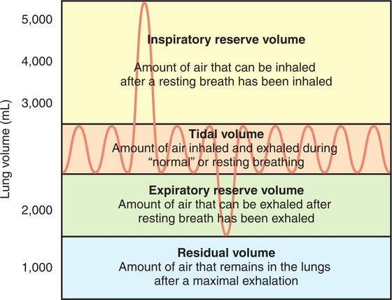

**Figure 6.4** Lung volumes. The inspiratory reserve volume, tidal volume, and expiratory reserve volume represent the total amount of air that can be moved in and out of the lungs. The residual volume remains in the lungs to keep the lungs inflated. ***KIA\***

**Figure 6.5** Lung volumes in relation to lung capacities. The total lung capacity represents all lung volumes. The vital capacity represents the volumes of air that can be moved in and out of the lungs and excludes the residual volume. ***KIA\***

## KINEMATICS DURING VENTILATION

During inspiration, the thoracic volume increases vertically, anteriorly and posteriorly, and medially and laterally. The vertical diameter increases mainly because of contraction of the diaphragm muscle, considered the primary muscle of ventilation. This increase generates 70% to 80% of the inspiratory force during quiet breathing. The diaphragm muscle arises from the ribs, sternum, and vertebral bodies, and its fibers traverse superiorly to form a central tendon that does not have a bony insertion. At rest, the diaphragm is dome shaped ([Fig. 6.6A](https://jigsaw.vitalsource.com/books/9780803675056/epub/OPS/c06.xhtml?favre=brett#fig6-6)). When the diaphragm contracts during inspiration, the dome descends toward the abdominal cavity, compresses the abdominal contents, and increases intra-abdominal pressure and the vertical diameter of the thorax ([Fig. 6.7](https://jigsaw.vitalsource.com/books/9780803675056/epub/OPS/c06.xhtml?favre=brett#fig6-7)). In deeper inspirations, this increase in intra-abdominal pressure stabilizes the central tendon. This stabilization allows the diaphragm to lift the lower ribs and rotate them outwardly in a “bucket-handle” motion. This motion increases the medial-lateral volume of the thorax ([Fig. 6.8](https://jigsaw.vitalsource.com/books/9780803675056/epub/OPS/c06.xhtml?favre=brett#fig6-8)).

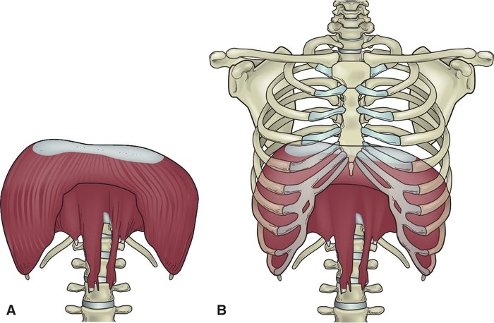

**Figure 6.6** **(A)** At rest, the diaphragm is a dome-shaped muscle. **(B)** The diaphragm has three sites of attachment within the rib cage: a sternal attachment, a costal attachment, and a vertebral attachment.

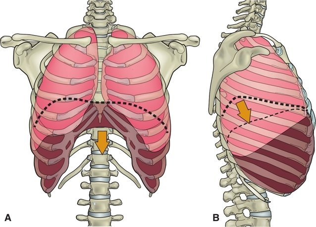

**Figure 6.7** **(A)** Anterior view of the diaphragm descending during inspiration. **(B)** Lateral view of the diaphragm showing the excursion of the diaphragm during inspiration and expiration.

The first rib moves very little during ventilation, but ribs 2 through 7 are mobile, and their movement during inspiration pushes the sternum in a ventral and superior direction in a “pump-handle” motion. The motion of the upper ribs and sternum increases the anterior-posterior diameter of the thorax. The movement is mainly in the sagittal plane ([Fig. 6.9](https://jigsaw.vitalsource.com/books/9780803675056/epub/OPS/c06.xhtml?favre=brett#fig6-9)). The lower six ribs elevate during inspiration in a motion that occurs more in the frontal plane around a sagittal axis of motion, producing the lateral increase in diameter of the thorax (the “bucket-handle” motion described above).

As the thoracic volume increases, the intrapulmonary pressure decreases below atmospheric pressure, and the air moves from the higher pressure in the external environment into the lower pressure in the lungs. As the diaphragm relaxes, it returns to its dome-shaped position. The return to this position decreases the thoracic volume, resulting in an increase in intrapulmonary pressure; the air moves from the higher lung pressure to the lower atmospheric pressure, and exhalation occurs. Essentially, exhalation during regular breathing is a passive phenomenon in healthy people.

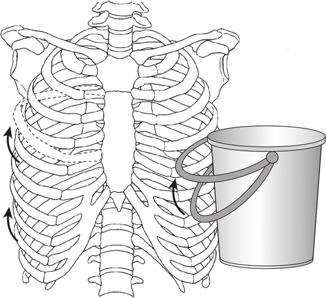

**Figure 6.8** The “bucket-handle” motion of the ribs increases the lateral dimensions of the thorax during inspiration. *(From Levangie P, Norkin C*. Joint Structure and Function: A Comprehensive Analysis, *5th ed. Philadelphia, PA: F. A. Davis Company, 2011: p. 198, with permission.)* ***KIA\***

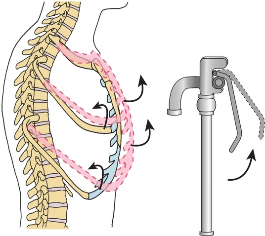

**Figure 6.9** During inspiration, the upper ribs move like a pump handle to increase the anterior and posterior dimensions of the thorax. *(From Levangie P, Norkin C*. Joint Structure and Function: A Comprehensive Analysis, *5th ed. Philadelphia, PA: F. A. Davis Company, 2011: p. 198, with permission.)*

## MUSCLES OF VENTILATION

Muscle recruitment in ventilation depends on the type of ventilation needed to meet the metabolic demands of an activity and the health of the respiratory and neuromuscular systems. Any muscle that attaches to the thorax and can change its volume can potentially be a muscle involved in ventilation. In general, muscles that increase thoracic volume are inspiratory muscles, and muscles that decrease thoracic volume are expiratory muscles. The muscles associated with ventilation tend to be more fatigue resistant and have a higher oxidative capacity than other skeletal muscles. Under both voluntary and involuntary neural control, these muscles contract rhythmically throughout the life span as they resist the elastic properties of the lungs and the resistance to airflow in the airways. During quiet ventilation, the primary muscles of ventilation are recruited during inspiration; expiration is a passive phenomenon. During forced ventilation, both inspiratory and expiratory muscles are recruited and are referred to as the accessory muscles of ventilation. See [Appendix A](https://jigsaw.vitalsource.com/books/9780803675056/epub/OPS/c07-AppA.xhtml) to review the detailed anatomy and innervation of the muscles related to ventilation.

## **Clinical Connection 6.1**

Spinal scoliosis and increased spinal kyphosis are spinal deformities that can greatly affect pulmonary functions because of their tendency to alter respiratory mechanics. In scoliosis, there is a lateral curve of the spine with a rotational component of the vertebrae. This malalignment affects the position of the ribs attached to the vertebrae and can compromise the volume of the thoracic cavity. On the concave side of the lateral curve, anterior rotation of the rib cage decreases the lung space and consequently the lung volume. Increased kyphotic curves of the spine can compress the anterior chest, decrease the volume of the thorax, and reduce rib mobility during respiration. Significant correlations exist between the severity of the curves and the decrease in lung volumes. Decreased lung volumes can lead to decreased activity capacity—and overall body weakness—as a result of decreased oxygen availability. This weakness can lead to falls and the development of other cardiopulmonary and metabolic diseases. In some patient populations, respiratory muscle exercises can improve posture and lung function.

### MUSCLES OF QUIET VENTILATION

Quiet ventilation, also called resting ventilation, is the breathing that occurs when a person is at rest or performing low-level activities while lying or sitting. There is minimal metabolic activity of the large muscle groups of the lower extremities and low oxygen requirements of the body to perform the activities. In a healthy person, quiet breathing has a regular rhythm at a rate of 12 to 18 breaths per minute, and the tidal volume is about 0.5 L, about 10% of the vital capacity of the lungs.

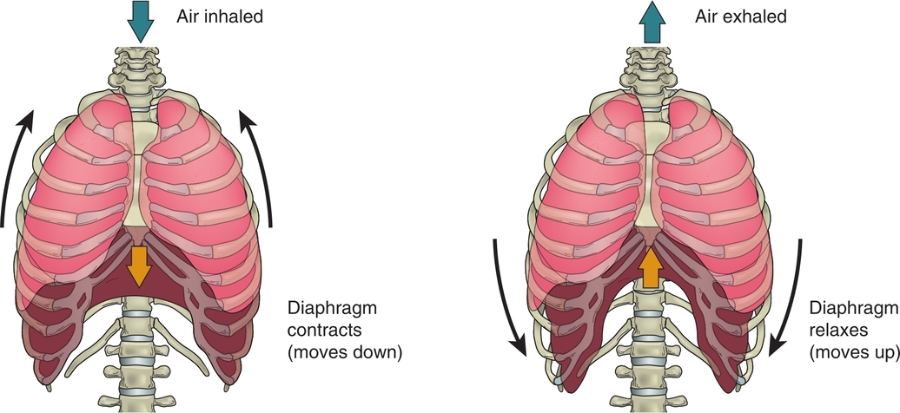

**Figure 6.10** During inspiration, the diaphragm contracts and descends, increasing the thoracic space. This increased space decreases internal pressure, and air is drawn into the lungs.

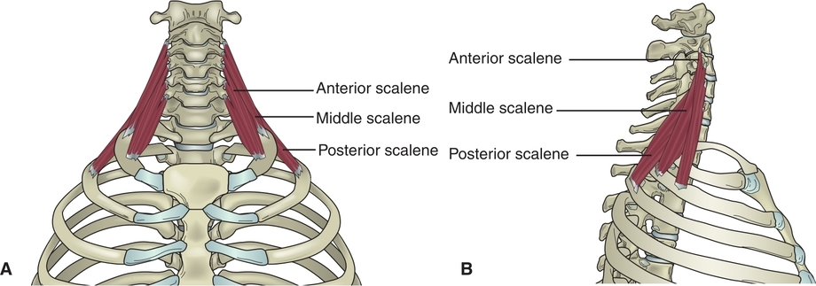

**Figure 6.11** Scalene muscles. **(A)** Anterior view of the scalenes that lift the upper ribs during inspiration. **(B)** Lateral view of the anterior, middle, and posterior scalenes.

#### Diaphragm Muscle

The diaphragm is the primary ventilatory muscle during quiet inspiration and the first muscle recruited during inspiration. The muscle is innervated by the phrenic nerve (C3-C5). In quiet breathing, the central tendon at the top of the dome descends toward the pelvic region, dropping about 1.5 cm to increase the thoracic volume. During forced inspiration, the diaphragm can drop up to 10 cm. The opposing abdominal resistance of the contents in the abdominal cavity stabilizes the contracted diaphragm, allowing the diaphragm to elevate the lower ribs as it continues to contract. The diaphragm performs 60% to 80% of the work required during ventilation. Contraction of the diaphragm increases the anterior-posterior and medial-lateral dimensions of the thorax during ventilation. As the volume increases, pressures decrease, and air flows into the lungs ([Fig. 6.10](https://jigsaw.vitalsource.com/books/9780803675056/epub/OPS/c06.xhtml?favre=brett#fig6-10)).

#### Scalene Muscles

The scalene muscles contribute to quiet ventilation and originate from the transverse processes of cervical vertebrae C3-C8. The anterior scalene and middle scalene muscles insert on the first rib, and the posterior scalene inserts on the second rib. During each inspiration, they contract to lift the first two ribs and attached sternum, increasing thoracic volume and resulting in the “pump-handle” motion of the upper rib cage. Movement of the scalene muscles increases as activity or metabolic demands increase, moving ventilation along the spectrum from quiet to forced breathing ([Fig. 6.11](https://jigsaw.vitalsource.com/books/9780803675056/epub/OPS/c06.xhtml?favre=brett#fig6-11)).

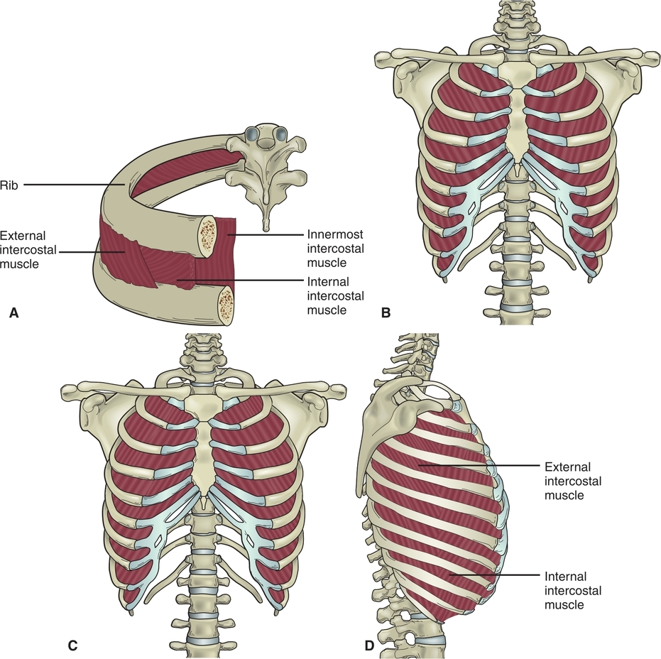

**Figure 6.12** Intercostal muscles. **(A)** Anterior view showing the relationship between the external and internal intercostal and subcostal muscles, ribs, sternum, and a thoracic vertebra. **(B)** Anterior view of external intercostal muscles. **(C)** Anterior view of internal intercostal muscles. **(D)** Lateral view of external and internal intercostal muscles. ***KIA\***

#### Intercostal Muscles

The intercostal muscles are a three-layered set of muscles that lie within the intercostal spaces and are innervated by the adjacent intercostal nerve. The specific actions of each layer are complicated and not completely understood.

The external intercostal muscle fibers run in an oblique and medial direction and are considered primary muscles of inspiration. The internal intercostals are deep to the external intercostal muscle fibers, and the fibers run in an oblique and lateral direction. The parasternal fibers of the internal intercostals elevate the ribs and help to increase thoracic volume during inspiration. The subcostal muscles function as intercostal muscles as they cross the intercostal spaces in the lower rib cage. Their fibers run parallel and deep to the internal intercostal muscles, and they are more developed in the lower portion of the thorax ([Fig. 6.12](https://jigsaw.vitalsource.com/books/9780803675056/epub/OPS/c06.xhtml?favre=brett#fig6-12)).

Recruitment of the three-layered intercostal muscles begins at the most superior intercostal spaces during quiet ventilation and proceeds caudally as inspiratory needs increase. The intercostal muscles also stabilize the rib cage during diaphragmatic contraction, preventing the inward movement of the upper chest during inspiration. The lateral portions of the intercostal muscles also play a role in axial rotation of the thorax. The contralateral external and internal muscles work together to produce trunk rotation. For example, right trunk rotation results from contraction of the left external and the right internal muscles. [Figure 6.13](https://jigsaw.vitalsource.com/books/9780803675056/epub/OPS/c06.xhtml?favre=brett#fig6-13) summarizes the kinematics of quiet inspiration.

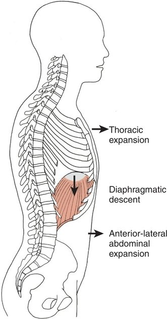

**Figure 6.13** During quiet inspiration, the thorax expands as the diaphragm descends. The abdominal viscera are displaced anteriorly and laterally. In passive expiration, structures return to their resting position. *(From Levangie P, Norkin C*. Joint Structure and Function: A Comprehensive Analysis, *5th ed. Philadelphia, PA: F. A. Davis Company, 2011: p. 202, with permission.)****KIA\***

### MUSCLES OF FORCED INSPIRATION

When the healthy body requires an increase in inspiration, additional muscles are recruited to assist the primary muscles of inspiration during forced inspiration. As the metabolic demands of the body increase during increased activity such as exercise, the respiratory system responds by increasing the rate and volume of inspiration. The muscles used to accomplish this task are referred to as the muscles of forced inspiration or accessory muscles of inspiration. If the respiratory system is dysfunctional as a result of disease, injury, or the aging process, these same accessory muscles may be recruited when breathing during daily nonstrenuous activities.

#### Sternocleidomastoid Muscle

The sternocleidomastoid muscle attaches to the cervical spine. During forced inspiration, it increases intrathoracic volume by elevating the upper rib cage and sternum in the “pump-handle” motion. This movement facilitates lung expansion in an effort to increase gas exchange. The sternocleidomastoid is commonly recruited near the end of maximal inspiration.

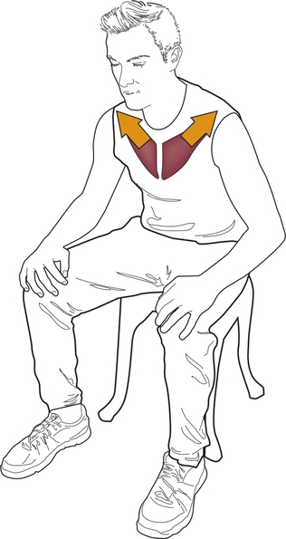

**Figure 6.14** When the arms are stabilized on a surface, the pectoralis major performs a reversal of action and pulls the sternum toward the humerus to assist with inspiration. People with COPD frequently use this pattern of breathing.

#### Pectoralis Major and Minor Muscles

The pectoralis major muscle (sternocostal head) contracts to elevate the upper middle ribs and sternum when the arms are stabilized (see [Chapter 8](https://jigsaw.vitalsource.com/books/9780803675056/epub/OPS/c08.xhtml) and [Appendix B](https://jigsaw.vitalsource.com/books/9780803675056/epub/OPS/c10-AppB.xhtml) to view illustrations and details related to this muscle). The clavicular head of the pectoralis muscle can assist with either inspiration or expiration depending on the position of the upper extremities. When the arms are positioned so that the humeral attachment is below the clavicle, the pectoralis major acts as an expiratory muscle by pulling the manubrium and upper ribs downward. When the arms are elevated so that the humeral attachment is above the clavicle, the pectoralis major pulls the manubrium and ribs upward and outward. The pectoralis minor assists with the elevation of ribs 3, 4, and 5 during increased inspiration. People who have chronic obstructive pulmonary disease (COPD) often utilize this reversal of action of the pectoralis major muscle by stabilizing their arms on a stable surface to assist with respirations ([Fig. 6.14](https://jigsaw.vitalsource.com/books/9780803675056/epub/OPS/c06.xhtml?favre=brett#fig6-14)).

#### Additional Inspiratory Muscles

The serratus posterior superior and inferior may also be recruited during forced inspiration. The serratus posterior superior increases the thoracic volume by elevating the upper ribs; the serratus posterior inferior stabilizes the lower ribs during contraction of the diaphragm ([Fig. 6.15A](https://jigsaw.vitalsource.com/books/9780803675056/epub/OPS/c06.xhtml?favre=brett#fig6-15)). The levatores costarum (longus and brevis) muscles ([Fig. 6.15B](https://jigsaw.vitalsource.com/books/9780803675056/epub/OPS/c06.xhtml?favre=brett#fig6-15)) elevate the ribs, and the latissimus dorsi (see [Chapter 8](https://jigsaw.vitalsource.com/books/9780803675056/epub/OPS/c08.xhtml)) elevates the lower ribs if the arms are fixed. The quadratus lumborum also stabilizes the lower ribs during diaphragm contraction, and portions of the erector spinae can increase intrathoracic volume by extending the trunk (see [Chapter 5](https://jigsaw.vitalsource.com/books/9780803675056/epub/OPS/c05.xhtml)).

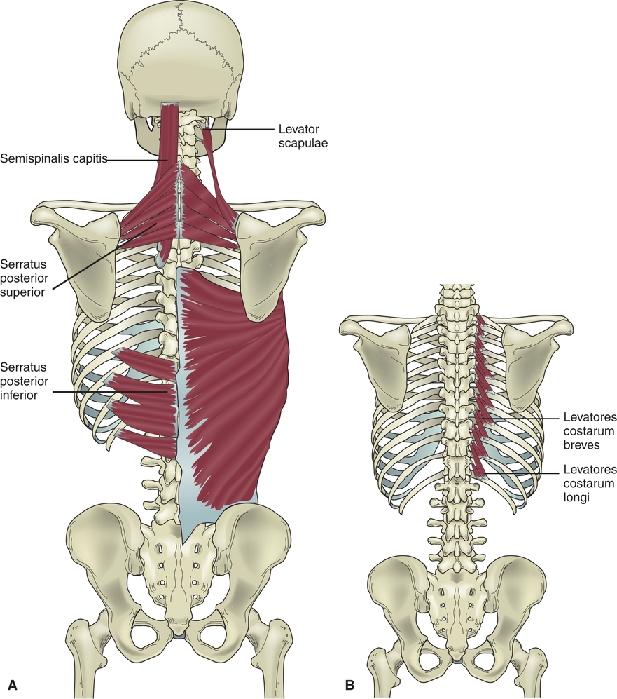

**Figure 6.15** **(A)** Serratus posterior superior and serratus posterior inferior. **(B)** Levatores costarum muscles.

### MUSCLES OF FORCED EXPIRATION

Quiet expiration is a passive process, as the diaphragm relaxes and returns to its dome position reducing the volume of the intrathoracic cavity and increasing the pressure within the space. This increased pressure causes the air to move from the higher intrathoracic pressure to the lower external atmospheric pressure. Elastic recoil of thoracic and lung tissue also assists with the passive expulsion of air from the lungs.

Contrary to quiet passive expiration, forced expiration occurs when the body must rapidly reduce intrathoracic volume and increase pressure to expel air quickly. Forced expiration is the active process in which air is forced from the lungs by contracting muscles. The muscles involved in forced expiration include four abdominal muscles, the transversus thoracis, and the interosseous fibers of the internal intercostals.

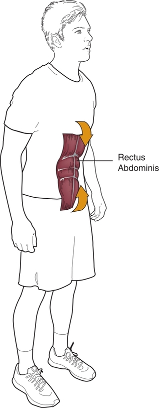

**Figure 6.16** Rectus abdominis, transverse abdominis, and the oblique muscles contract to increase intrathoracic pressure and assist with air expulsion during forced exhalation.

#### Abdominal Muscles

The rectus abdominis, the external and internal abdominal obliques, and the transversus abdominis play a role in the mechanical process of forced expiration. Contraction of these muscles depresses the ribs and sternum and flexes the trunk. These contractions increase intra-abdominal pressure, forcing the diaphragm upward into the thoracic cavity, decreasing its volume, and forcefully expelling the contents. These muscles also play a role in the inspiratory phase of ventilation. When the diaphragm is forced up during contraction of the abdominal muscles, it is passively stretched to an optimal length. This stretch prepares the diaphragm for a prime muscle contraction to initiate the next inspiration ([Fig. 6.16](https://jigsaw.vitalsource.com/books/9780803675056/epub/OPS/c06.xhtml?favre=brett#fig6-16)). See [Chapter 5](https://jigsaw.vitalsource.com/books/9780803675056/epub/OPS/c05.xhtml) for a review of the anatomy of the abdominal muscles.

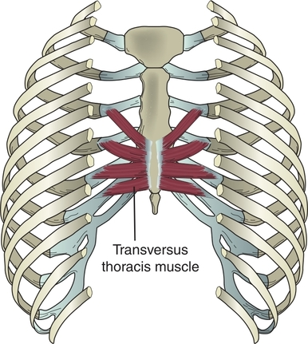

**Figure 6.17** The transverse thoracis muscle viewed from the internal anterior wall of the thorax.

#### Transversus Thoracis and Internal Intercostal Muscles

The transversus thoracis muscle, located on the ventral surface of the anterior thorax, is a muscle of forced expiration. The muscle is located on each side of the inner surfaces of the body of the sternum and has lateral attachments on the inner sides of the sternocostal joints at the second through the sixth ribs. Along with the interosseous fibers of the internal intercostal muscles, the transversus thoracis decreases the intrathoracic volume by depressing the ribs. Both sides of the muscles are recruited with the abdominal muscles during forced expiration ([Fig. 6.17](https://jigsaw.vitalsource.com/books/9780803675056/epub/OPS/c06.xhtml?favre=brett#fig6-17)).

The nervous system recruits the appropriate muscle fibers needed to meet the oxygen demands of the body, including the primary use of mainly the diaphragm during quiet inspiration and the recruitment of various muscles to increase the depth and frequency of inspiration as well as the force and frequency of expiration. All muscles of ventilation are listed in [Table 6.1](https://jigsaw.vitalsource.com/books/9780803675056/epub/OPS/c06.xhtml?favre=brett#tab6-1).

## VENTILATION SYSTEM CHANGES RELATED TO AGING AND DISEASE

### AGE-RELATED CHANGES

As the body ages, the ventilation system undergoes changes that increase the mechanical workload for breathing, as the efficiency of the process decreases and the effectiveness of gas exchange is reduced. The process is affected by changes in mechanical properties of the structures related to respiration, changes in lung volumes, and impairments in gas exchange and lung defenses.

| **TABLE 6.1** Muscles Used in Ventilation                    |                                                              |
| ------------------------------------------------------------ | ------------------------------------------------------------ |
| **Muscles of Quiet Inspiration (Primary Muscles of Inspiration)** | **Muscles of Forced Inspiration (Accessory Muscles of Inspiration)** |
| Diaphragm Scalenes Intercostals                              | Primary muscles of inspirationSerratus posterior superiorSerratus posterior inferiorLevator costarum (longus and brevis)SternocleidomastoidLatissimus dorsiIliocostalis thoracic and cervicis (erector spinae)Pectoralis minorPectoralis major (sternocostal head)Quadratus lumborum |

With aging comes a decrease in chest wall compliance and mobility and reduced recoil ability of lung tissues. These changes are due to an increase in the formation of cross-links in collagen fibers of the connective tissues, an increase in rib calcification, and a decrease in the strength of the respiratory muscles. Changes in spinal curves (i.e., scoliosis, kyphosis, or both) influence lung volumes, resulting in decreased compliance. Each of these adverse factors can increase the work required for breathing. Although tidal volumes remain fairly constant, lung vital capacity decreases and residual volumes increase with aging. The amount of gas exchanged between the lungs and circulatory system needed for maximal work decreases, reducing the amount of work a person is able to perform. A person’s ability to climb a flight of stairs may be limited not only by decreased leg strength associated with aging, but also by an inability to obtain adequate oxygen for the given workload.

Ventilation, diffusion between alveoli and capillaries, and pulmonary circulation all become less efficient with aging. The membranes between the alveoli and capillaries thicken, hindering gas exchange. The changes in the mechanical properties of ventilation and these alterations in gas exchange increase the energy requirements of respiration for performing a given amount of work.

### DISEASE-RELATED CHANGES

COPD is a general term that includes a group of respiratory diseases: emphysema, chronic obstructive bronchitis, and asthmatic bronchitis. Each of these conditions has in common an increased resistance to airflow with an accompanying increase in the expiratory phase of respiration. COPD also decreases lung tissue elasticity. This resistance to airflow results in chronic overworking of the respiratory muscles in an effort to maintain sufficient blood levels of oxygen. Studies show that overworking these muscles or respiratory muscle dysfunction secondary to weakness or disease can exacerbate disease and its symptoms, increasing a person’s risk for hospitalization.

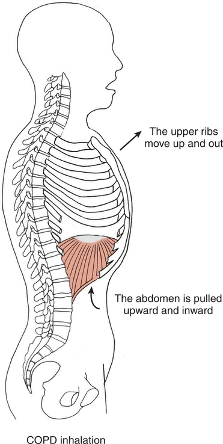

**Figure 6.18** The paradoxical respiratory movement patterns displayed by people with COPD differ from patterns displayed by people without pulmonary disease. Accessory muscles elevate the upper ribs, the diaphragm is unable to descend, and the abdominal viscera are pulled up and in. *(From Levangie P, Norkin C*. Joint Structure and Function: A Comprehensive Analysis, *5th ed. Philadelphia, PA: F. A. Davis Company, 2011: p. 209, with permission.)* ***KIA\***

Because of the decreased thoracic movement during respiration in COPD, the lungs hyperinflate. This change in structures shortens the fibers of the diaphragm, and over time it becomes flattened rather than dome shaped. People who have COPD often present with a barrel-shaped thorax, flattened diaphragm, and protruding abdomen. During inspiration, the flattened diaphragm pulls the lower rib cage inward, working against inflation of the lungs. The diaphragm’s ability to expand the thoracic rib cage decreases, and inspiration requires the use of the muscles that elevate the upper rib cage ([Fig. 6.18](https://jigsaw.vitalsource.com/books/9780803675056/epub/OPS/c06.xhtml?favre=brett#fig6-18)). As these muscles forcefully elevate the upper ribs, the diaphragm and abdominal viscera may be pulled up and in during forceful inspiration. This paradoxical pattern of breathing requires a great deal of energy and greatly increases the work associated with breathing. Regular exercise has been shown to increase the functional capacity and ability to perform activities and improve the quality of life in people with COPD.

