The temporomandibular (TM) joint of a healthy adult moves more than 1,500 times a day. The TM joint is one of the most frequently used joints: It is used during chewing, swallowing, and speaking. There is joint motion during small intrinsic mouth movements and during the large movements associated with yawning and singing. The mandible normally opens and closes in a straight vertical line without deviating from side to side.

The posterior ends of the mandible form the bicondylar joint as they articulate with the temporal bone and function at the same time during mandible movement. The two distinct articulations are interdependent and are further divided by a disc in each joint. The disc divides each joint into upper and lower articulations. Ultimately, this complex structure forms four distinct articulations that move congruently to allow the jaw to move in a variety of planes and directions and withstand large compressive loads as it accomplishes the functional activities of eating, swallowing, and talking. The joint functions as a combination hinge and plane joint. It is subject to malalignment, abnormal stresses, and injury that can result in oral dysfunction and head, neck, and jaw pain. Postural malalignment, pathology, and aging can adversely affect the joint.

## JOINT STRUCTURES

### BONE AND DISC STRUCTURES

The bones that form the structures of the TM joints are the mandible, maxillae, temporal, zygomatic, sphenoid, and hyoid ([Fig. 7.1A](https://jigsaw.vitalsource.com/books/9780803675056/epub/OPS/c07.xhtml?favre=brett#fig7-1)). The condyles of the ramus of the mobile mandible form the joint as they articulate with the mandibular (articular) fossa of the temporal bone on each posterior end. The articular eminence is an anterior protuberance that is continuous with the fossa. The postglenoid tubercle is the posterior border of the fossa ([Fig. 7.1B](https://jigsaw.vitalsource.com/books/9780803675056/epub/OPS/c07.xhtml?favre=brett#fig7-1)). The coronoid process of the mandible ([Fig. 7.2](https://jigsaw.vitalsource.com/books/9780803675056/epub/OPS/c07.xhtml?favre=brett#fig7-2)) is an attachment site for muscles involved with mastication, the term used to describe chewing food by crushing or grinding food with the teeth. These muscles are discussed later in this chapter.

Articulations at the TM joint form a synovial joint that differs from other synovial joints in a way that allows it to withstand the continual wear and motion that occurs at the joint. In contrast to most synovial joints, the articular surfaces of the TM joint are not covered with hyaline cartilage. Instead, the mandibular condyles are covered with dense fibrocartilage that can resist large bite forces and repetitive stresses. Unlike hyaline cartilage, this fibrocartilage can repair itself.

Within the TM joint is an articular disc ([Fig. 7.3](https://jigsaw.vitalsource.com/books/9780803675056/epub/OPS/c07.xhtml?favre=brett#fig7-3)) that also assists with countering stresses delivered to the joint. As noted earlier, the disc divides the joint into a superior and inferior joint. Each joint has its own synovial lining. The disc is anchored medially and laterally to the outer borders of the condyles, allowing movement in anterior and posterior directions. Anteriorly, the disc is attached to the joint capsule and the lateral pterygoid muscle. Posteriorly, it is attached to thick connective tissue. Because of this division, there are actually four separate joints—two on each side—that function together during mandibular motion. The inferior joint formed by the underlying surface of the disc and the mandibular condyle functions as a hinge joint. The upper surface of the disc and the temporal bone forms the superior joint that functions as a gliding joint.

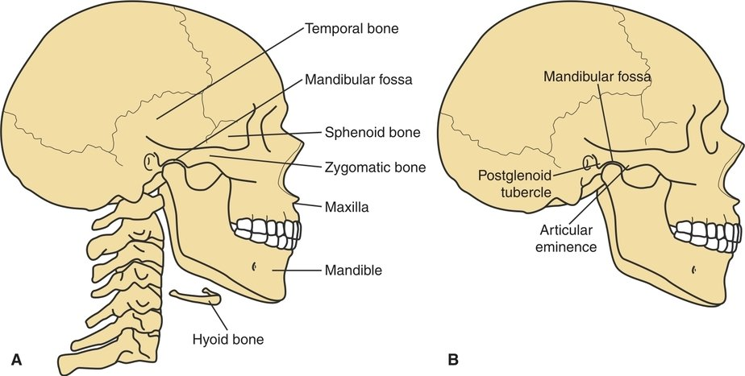

**Figure 7.1** The bones and landmarks of the TM joint. **(A)** Lateral view of the mandible, temporal, sphenoid, maxilla, zygomatic, and hyoid bones. **(B)** Bony landmarks associated with the TM joint are the mandibular fossa, the postglenoid tubercle, and the articular eminence. *(From Levangie P, Norkin C*. Joint Structure and Function: A Comprehensive Analysis, *5th ed. Philadelphia, PA: F. A. Davis Company, 2011: p. 214, with permission.)* ***KIA\***

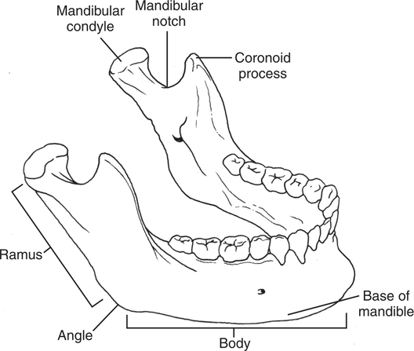

**Figure 7.2** The mandible. *(From Levangie P, Norkin C*. Joint Structure and Function: A Comprehensive Analysis, *5th ed. Philadelphia, PA: F. A. Davis Company, 2011: p. 213, with permission.)* ***KIA\***

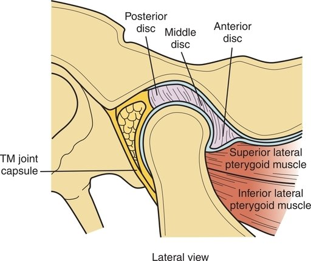

**Figure 7.3** A disc within the TM joint divides the joint into an upper joint and lower joint. The articular surfaces of the condyle and the articular eminence are covered with fibrocartilage. *(From Levangie P, Norkin C*. Joint Structure and Function: A Comprehensive Analysis, *5th ed. Philadelphia, PA: F. A. Davis Company, 2011: p. 214, with permission.)*

The disc increases the stability of the joint, decreases stresses to the joint, and enhances joint mobility and function. In contrast to the bony articular surfaces, the disc cannot repair itself and can be the source of malalignment, dysfunctional movement, and pain associated with injury or disease ([Fig. 7.4](https://jigsaw.vitalsource.com/books/9780803675056/epub/OPS/c07.xhtml?favre=brett#fig7-4)).

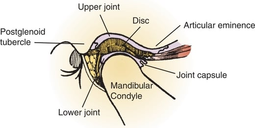

**Figure 7.4** Cross section of the TM joint showing variation in the disc thickness. *(From Levangie P, Norkin C*. Joint Structure and Function: A Comprehensive Analysis, *5th ed. Philadelphia, PA: F. A. Davis Company, 2011: p. 216, with permission.)* ***KIA\***

### CAPSULE AND LIGAMENTS

A sturdy joint capsule surrounds the TM joint. The anterior, posterior, and superior portions of the TM joint capsule are lax. This laxity can predispose the joint to anterior dislocations. During an anterior dislocation, the mandible is displaced anteriorly as the condyles travel forward along the articular eminence and become locked in the anterior superior aspect of the eminence. The dislocation can occur secondary to trauma or after extreme mouth opening during eating, yawning, singing, vomiting, or dental treatments. However, the inferior portion of the joint capsule is taut, and the lateral portion is strong, and together they stabilize the joint. The capsule is highly innervated with receptors that provide information to the brain about the movements and position of the joint during activities.

The temporomandibular ligament reinforces the capsule and limits mandibular depression and retrusion. The stylomandibular ligament attaches the styloid process of the temporal bone to the ramus of the mandible. There is controversy over its function, but it may contribute to preventing excessive protrusion of the mandible. The sphenomandibular ligament, between the sphenoid bone and the ramus of the mandible, may also check mandibular protrusion. The three ligaments are depicted in [Figure 7.5](https://jigsaw.vitalsource.com/books/9780803675056/epub/OPS/c07.xhtml?favre=brett#fig7-5).

## KINEMATICS

Most TM joint movements including speaking and chewing occur without resistance. The joint can generate tremendous power during mastication or perform delicate motions such as whispering or whistling. Similar to other joints, the TM joint displays both osteokinematic and arthrokinematic motions.

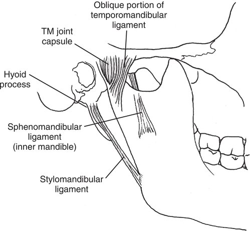

**Figure 7.5** Lateral view of the TM joint shows its supporting ligaments: the temporomandibular ligament, the sphenomandibular ligament, and the stylomandibular ligament. *(From Levangie P, Norkin C*. Joint Structure and Function: A Comprehensive Analysis, *5th ed. Philadelphia, PA: F. A. Davis Company, 2011: p. 216, with permission.)*

### MANDIBULAR DEPRESSION AND ELEVATION

A component of opening the mouth is mandibular depression; closing the mouth involves mandibular elevation ([Fig. 7.6](https://jigsaw.vitalsource.com/books/9780803675056/epub/OPS/c07.xhtml?favre=brett#fig7-6)). These motions occur in the sagittal plane around a medial lateral axis. Typically, the range of motion during depression is 40 to 50 mm. Clinically, this range is often measured by placing two to three knuckles between the upper and lower incisors of the teeth. For the osteokinematic motion of the mandible to move through the full range of motion, arthrokinematic rolling and gliding of the mandibular condyles must occur. Each condyle rolls anteriorly on the inferior surface of the disc at the start of mandibular depression. (Some sources start at a different reference point on the mandible and describe a posterior roll.) The mandibular condyle and the disc move as one unit and glide in an anterior direction ([Fig. 7.7](https://jigsaw.vitalsource.com/books/9780803675056/epub/OPS/c07.xhtml?favre=brett#fig7-7)). This gliding occurs in the upper section of the joint between the disc and the articular eminence of the temporal bone. (This motion can be palpated by putting a fingertip in the ear and pressing in an anterior direction. As the mouth opens, the mandible depresses, and the condyles can be felt to move in an anterior direction away from the inserted fingertip.) The reverse arthrokinematics occur during mandibular elevation. The condyles roll posteriorly on the disc in the lower joint. In the upper division of the joint, the disc–condyle complex glides in a posterior direction.

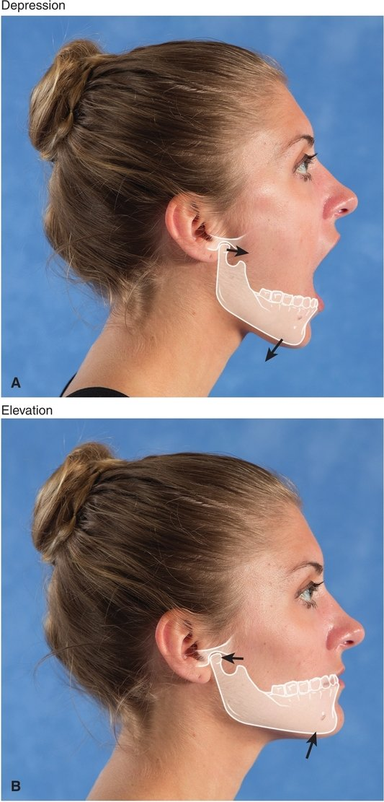

**Figure 7.6** **(A)** Mandibular depression. **(B)** Mandibular elevation. ***KIA\***

### MANDIBULAR PROTRUSION AND RETRUSION

For adequate motion of the mouth and maximal opening and closing, mandibular protrusion accompanies mandibular depression when the mouth opens; retrusion accompanies mandibular elevation when the mouth closes. Protrusion and retrusion occur in the upper TM joints. In protrusion, the disc–condyle complex glides anteriorly, and in retrusion it moves posteriorly. The condyle does not rotate during protrusion and retrusion. Although the lower teeth can usually pass the upper teeth during mandibular protrusion, protrusion is still adequate if the upper and lower incisors touch each other ([Fig. 7.8](https://jigsaw.vitalsource.com/books/9780803675056/epub/OPS/c07.xhtml?favre=brett#fig7-8)).

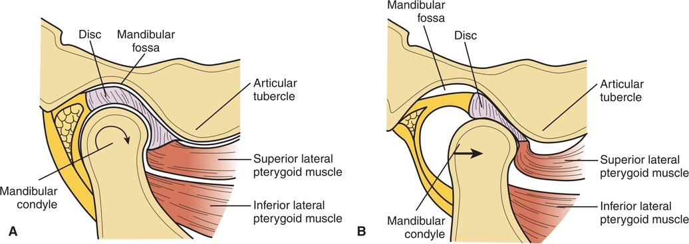

**Figure 7.7** **(A)** During mandibular depression, as the mouth opens, the condyle rolls in an anterior direction on the disc. **(B)** In the later phases of mouth opening, the condyle and disc glide together in an anterior direction on the articular eminence. ***KIA\***

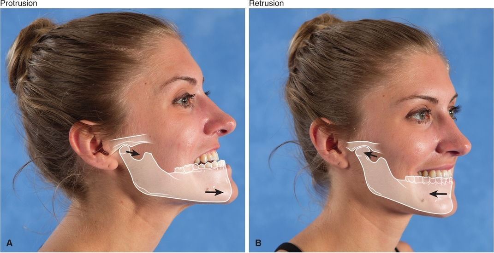

**Figure 7.8** **(A)** During mandibular protrusion, the mandible moves anteriorly with little rotation. **(B)** In mandibular retrusion, the mandible moves posteriorly. ***KIA\***

### MANDIBULAR LATERAL EXCURSION

Side-to-side movement of the mandible is called lateral excursion. A typical amount of excursion is measured by observing that the midline of the lower teeth moves the full width of one of the central incisors in either direction. Typically, this range of motion is 8 to 11 mm. During lateral movement, the ipsilateral mandibular condyle spins around a vertical axis, while the contralateral condyle rotates anteriorly and slightly medially ([Fig. 7.9](https://jigsaw.vitalsource.com/books/9780803675056/epub/OPS/c07.xhtml?favre=brett#fig7-9)).

## MUSCLES

The muscles related to the TM joint are divided into two categories: primary and secondary muscle groups. The primary muscles are the larger muscles of the two sets and have the capacity to generate power. The primary muscles are activated during resisted chewing and biting. The secondary muscles assist the primary muscles as they function. The secondary muscles are smaller and are involved with finer, intrinsic TM joint movements, such as movements associated with facial expressions and talking softly. As with every activity, the level of intensity determines the group of muscles needed to accomplish the task. Chewing soft foods may not require recruitment of the larger, more powerful muscles needed to chew a piece of meat.

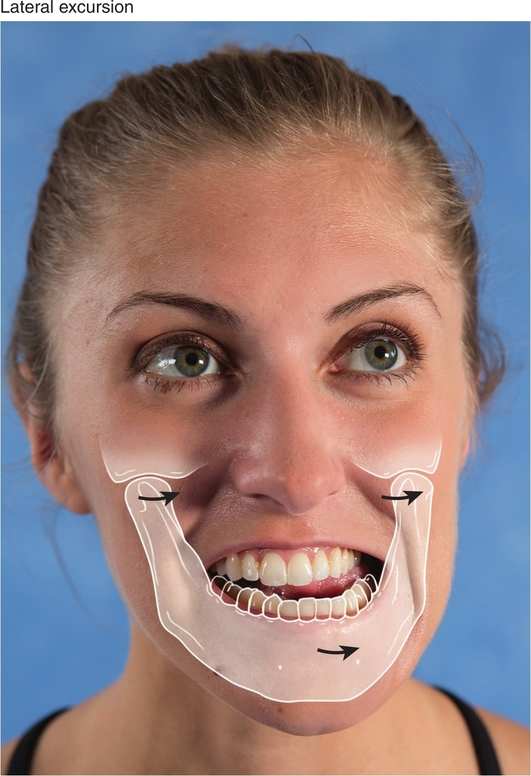

**Figure 7.9** Mandible lateral excursion is primarily a side-to-side translation. Note how the midline of the lower teeth moves the full width of one of the central incisors as the model moves her mandible to the left. ***KIA\***

### PRIMARY MUSCLES

The primary muscles of mastication and mouth movements are the temporalis, masseter, medial pterygoid, and lateral pterygoid ([Fig. 7.10](https://jigsaw.vitalsource.com/books/9780803675056/epub/OPS/c07.xhtml?favre=brett#fig7-10)). The temporalis, masseter, and medial pterygoid are powerful muscles that close the jaw; the lateral pterygoid is involved in opening the jaw. All four muscles are innervated by the trigeminal nerve (cranial nerve V).

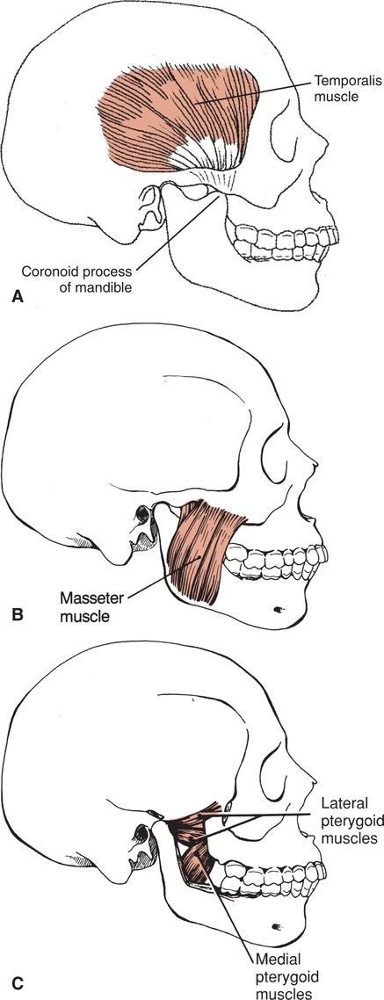

**Figure 7.10** The primary muscles of the TM joint. **(A)** Temporalis muscle. **(B)** Masseter muscle. **(C)** Medial and lateral pterygoid muscles. *(From Levangie P, Norkin C*. Joint Structure and Function: A Comprehensive Analysis, *5th ed. Philadelphia, PA: F. A. Davis Company, 2011: p. 220, with permission.)* ***KIA\***

The temporalis ([Fig. 7.10A](https://jigsaw.vitalsource.com/books/9780803675056/epub/OPS/c07.xhtml?favre=brett#fig7-10)) is a flat, fan-shaped muscle that originates in the temporal fossa and converges to attach to the coronoid process of the mandible. The temporalis can be palpated over the temporal fossa during a contraction as a person bites down. The masseter ([Fig. 7.10B](https://jigsaw.vitalsource.com/books/9780803675056/epub/OPS/c07.xhtml?favre=brett#fig7-10)) attaches on the zygomatic arch and the angle and ramus of the mandible. The medial pterygoid ([Fig. 7.10C](https://jigsaw.vitalsource.com/books/9780803675056/epub/OPS/c07.xhtml?favre=brett#fig7-10)) is located on the inside of the mandible and is similar to the masseter in size and fiber alignment. It attaches superiorly to the lateral pterygoid plate on the sphenoid bone. The inferior attachment is on the internal surface of the mandibular ramus near its angle.

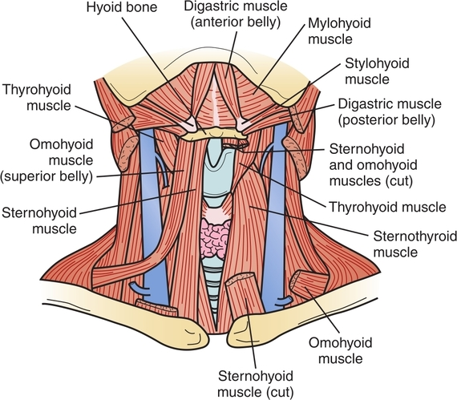

**Figure 7.11** The suprahyoid and infrahyoid muscle groups associated with the TM joint. *(From Levangie P, Norkin C*. Joint Structure and Function: A Comprehensive Analysis, *5th ed. Philadelphia, PA: F. A. Davis Company, 2011: p. 220, with permission.)*

## **Clinical Connection 7.1**

Faulty forward head posture has been associated with symptoms affecting the head and neck, including headache, cervical spine dysfunction, and TM joint dysfunction. When the head and neck are protruded forward and the shoulders are rounded, adaptive shortening occurs in the suboccipital cervical extensors and the anterior chest tissues. The overlengthened deep cervical flexors, thoracic extensors, and scapular retractors become weak and ineffective. This abnormal posture has an adverse effect on the kinematics of the TM joint. Postural exercises have been shown to result in significant improvements in pain and mouth opening in individuals with TM joint dysfunction.

Low-level activity of the temporalis keeps the mouth in a resting position with the lips together and the teeth slightly apart. As the mouth opens, this muscle activity decreases because gravity is usually sufficient to pull the mandible down. With resisted opening, the lateral pterygoid and the secondary muscles are activated (e.g., if the teeth get “stuck” in a chewy food and need added muscle strength to pull the jaw away from the food to open the mouth). The lateral pterygoid consists of fibers that run horizontally, attaching to the sphenoid bone, and posteriorly, attaching to the mandible, the articular disc, and the joint capsule. Although there is some controversy in the literature, it is believed that the superior fibers protrude the mandible, and the inferior fibers depress and protrude the mandible. Bilateral contraction of the masseter, temporalis, and medial pterygoid muscles elevates the mandible. Mandibular protrusion is accomplished by bilateral action of the masseter and the medial and lateral pterygoid muscles. Retrusion occurs through activation of the posterior fibers of the temporalis muscles and the anterior portion of the digastric muscle.

### SECONDARY MUSCLES

The secondary muscles of mastication and other mouth movements are divided into two groups depending on their relationship to the hyoid bone—the suprahyoid group and the infrahyoid group ([Fig. 7.11](https://jigsaw.vitalsource.com/books/9780803675056/epub/OPS/c07.xhtml?favre=brett#fig7-11)). Both groups are involved with tongue movements and movements that occur during speech and swallowing. The infrahyoid muscles are the omohyoid, sternohyoid, sternothyroid, and thyrohyoid muscles. They stabilize the hyoid bone, allowing the suprahyoid muscles to assist with depression. The suprahyoid muscles—the digastric, geniohyoid, mylohyoid, and stylohyoid—are involved with mandibular depression. The digastric muscle is mainly associated with mandibular depression ([Fig. 7.12](https://jigsaw.vitalsource.com/books/9780803675056/epub/OPS/c07.xhtml?favre=brett#fig7-12)). [Table 7.1](https://jigsaw.vitalsource.com/books/9780803675056/epub/OPS/c07.xhtml?favre=brett#tab7-1) summarizes the synergistic action of the primary and secondary muscles at the TM joint.

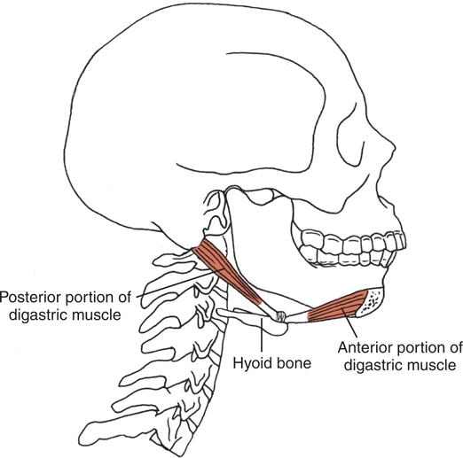

**Figure 7.12** The anterior portion of the digastric muscle arises from the mandible, and the posterior portion arises from the mastoid process. The two portions are joined by a fibrous loop to the hyoid bone. *(From Levangie P, Norkin C*. Joint Structure and Function: A Comprehensive Analysis, *5th ed. Philadelphia, PA: F. A. Davis Company, 2011: p. 220, with permission.)*

| **TABLE 7.1** Synergistic Muscle Action at the TM Joint |                                                              |
| ------------------------------------------------------- | ------------------------------------------------------------ |
| **Mandibular Action**                                   | **Muscles and Action Involved**                              |
| Depression                                              | Concentric contraction of bilateral digastric muscles and inferior lateral pterygoid |
| Elevation                                               | Concentric contraction of bilateral masseter, temporalis, and medial pterygoid muscles |
|                                                         | Eccentric contraction of bilateral lateral pterygoid muscles controls the discs as the mandible elevates |
| Protrusion                                              | Bilateral contraction of masseter and medial and lateral pterygoid muscles |
| Retrusion                                               | Bilateral contraction of posterior fibers of the temporalis muscle and the anterior portion of the digastric muscles |
| Lateral excursion                                       | Unilateral contraction of the temporalis muscle produces lateral excursion to the same side |
|                                                         | The medial and lateral pterygoid muscles produce lateral excursion to the opposite sides |

## TEMPOROMANDIBULAR JOINT DYSFUNCTION RELATED TO AGING AND DISEASE

TM joint dysfunction is a blanket term that covers a wide variety of conditions related to the joint and its malfunction. There are three cardinal signs of TM joint dysfunction:

• Pain in the region of the TM joint that worsens with movement

• Joint noise that occurs during joint movement

• Limited range of motion of the TM joint, joint locking, and decreased movement on chewing, talking, or other functional activities.

Although joint disorders can occur in very young children and elderly adults, they are most common in women between the ages of 20 and 40 years. It is speculated that hormonal influences may affect the articular cartilage and joint structures. The dysfunction is often the result of trauma to the cervical spine or mouth and jaw, poor posture, inflammatory conditions, or faulty movement patterns. Teeth grinding, open-mouth breathing, forward head posture, and malocclusion can contribute to TM joint dysfunction. Disc derangement, a condition in which the disc is displaced from its normal functional relationship with the mandibular condyle and the temporal bone, can also contribute to TM joint dysfunction. Although TM joint subjective symptoms and clinical signs are present in older adults, the risk appears to be relatively low, and symptoms are not necessarily associated with degenerative changes seen on radiography or magnetic resonance imaging.

Soft tissue and joint mobilization techniques, muscle strengthening and stretching, and orthotic devices are effective interventions to address TM joint dysfunction. [Table 7.2](https://jigsaw.vitalsource.com/books/9780803675056/epub/OPS/c07.xhtml?favre=brett#tab7-2) summarizes pathologies that may damage the TM joint, resulting in one or all of the cardinal signs of TM joint dysfunction.