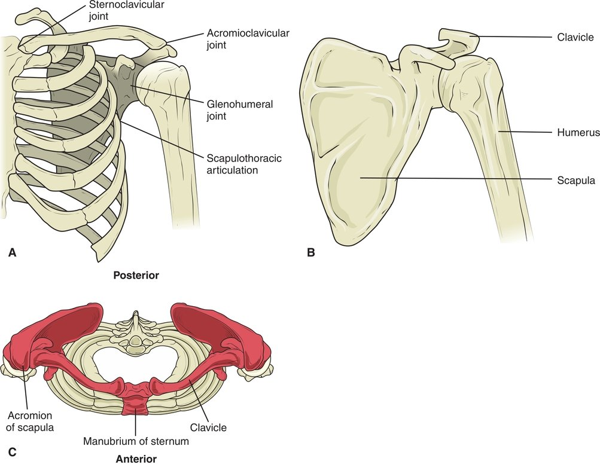

## SHOULDER COMPLEX STRUCTURES

### BONES

#### Sternum

- The sternum is the flat, long bone located in the midline of the anterior thorax and acts as an anterior anchor for the ribs. 
- The regions of the sternum are, from proximal to distal, the manubrium, the body, and the xiphoid process. 
- The clavicular facets are located on each side of the manubrium and are the site of the sternal articulation with the clavicle. Between the two facets is the jugular notch (sternal notch), which is located at the superior border of the manubrium.

#### Clavicle

-  20° posterior to the frontal plane and slightly above the horizontal plane. 
- The bone has a convex shape medially and curves to a concave shape laterally.

#### Scapula

- three sides, or borders: the medial (or vertebral) border, the lateral (or axillary) border, and the superior border. 

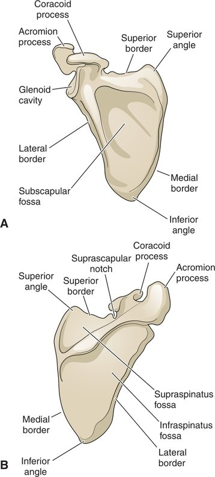

- The long head of the biceps attaches to the supraglenoid tubercle, and the long head of the triceps attaches to the infraglenoid tubercle. 
- Most of the functional movements occurring between the scapula and the humerus take place in the scapular plane.

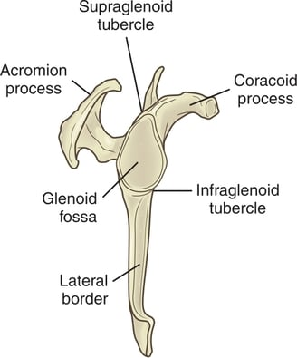

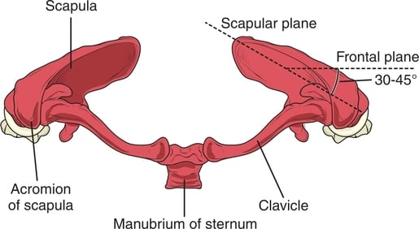

#### Humerus

- The convex head of the humerus articulates with the slightly concave glenoid fossa to form the glenohumeral (GH) joint. 
- 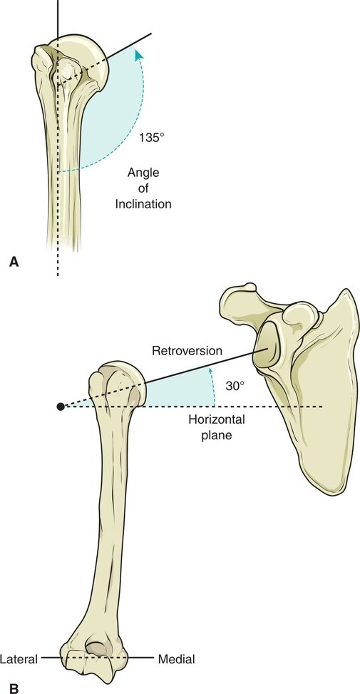
- The greater and lesser tubercles on the humerus are divided by the intertubercular (bicipital) groove. The tubercles and the deltoid tuberosity are points of attachment for shoulder complex muscle groups. On the posterior surface of the humerus is the radial groove that divides the lateral and medial heads of the triceps
  

### JOINTS

- 4 joints: the sternoclavicular (SC), the acromioclavicular (AC), the scapulothoracic, and the GH joints. 
  -  SC and AC joint motion is always linked to scapulothoracic movement. 

#### Sternoclavicular Joint

- plane synovial joint 
  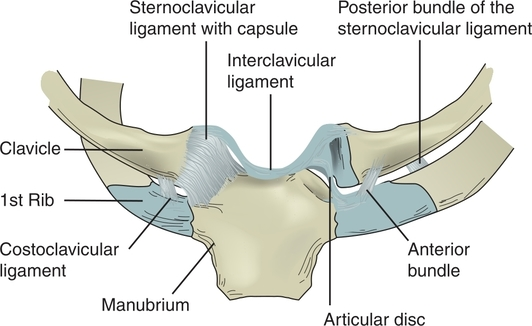

##### **Capsule, Ligaments, and Disc**

- The anterior and posterior SC ligaments limit anterior and posterior movement of the medial clavicle. 
- costoclavicular ligament runs from the cartilage of the first rib to the clavicle in a crisscross pattern of fibers. checks joint motion in all directions except during clavicular depression. 
- interclavicular ligament connects the medial aspects of each clavicle as it crosses the jugular notch.
- a flattened fibrocartilage disc that divides the joint into two sections. The disc functions as a shock absorber while enhancing the stability of the joint. 
- Dislocations at the SC joint are uncommon, accounting for 1% of the joint dislocations that occur throughout the body.

##### **Kinematics**

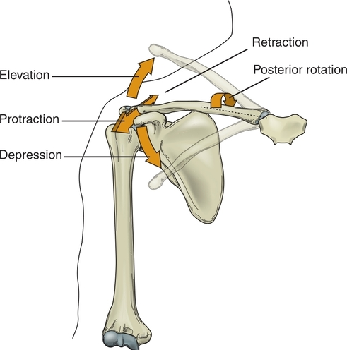

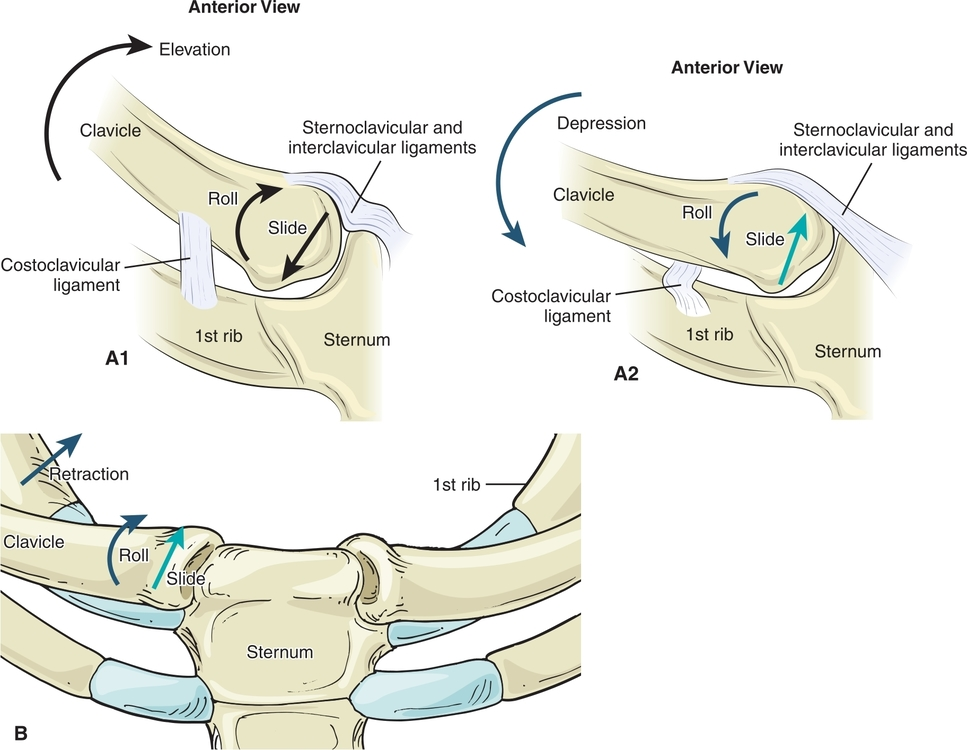

#### Acromioclavicular Joint

##### **Capsule, Ligaments, and Disc**

- A weak capsule surrounds the AC joint that is reinforced by the superior and inferior AC ligaments. The superior joint has further support through the attachment of the deltoid and trapezius muscles. The coracoclavicular ligament also stabilizes the AC joint by securing the clavicle with the scapula and providing superior and inferior stability. The ligament is divided into the trapezoid ligament, which runs in a superior and lateral direction from the coracoid process to the clavicle, and the conoid ligament, which runs in a more vertical direction from the coracoid process to the clavicle ([Fig. 8.11](https://jigsaw.vitalsource.com/books/9780803675056/epub/OPS/c08.xhtml?favre=brett#fig8-11)). Fibrocartilage lines the articular surfaces of the AC joint, which is a fibrocartilaginous disc in early childhood. With repeated upper extremity motion, the joint develops a joint space and in a small percentage of the population contains an incomplete articular disc.

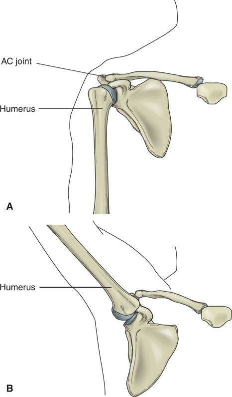

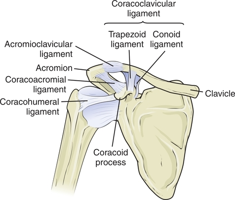

##### **Kinematics**

+ Upward rotation at the AC joint occurs in conjunction with shoulder flexion or abduction, and downward rotation is associated with shoulder adduction or extension.

- The tilting motion allows the scapula to maintain contact with the curvature of the rib cage during shoulder movement while orienting the glenoid fossa with the humeral head. 

- medial rotation, the glenoid fossa moves anteriorly and medially, while the medial scapular border moves away from the thorax. This plane of motion allows the scapula to maintain contact with the horizontal curvature of the thorax 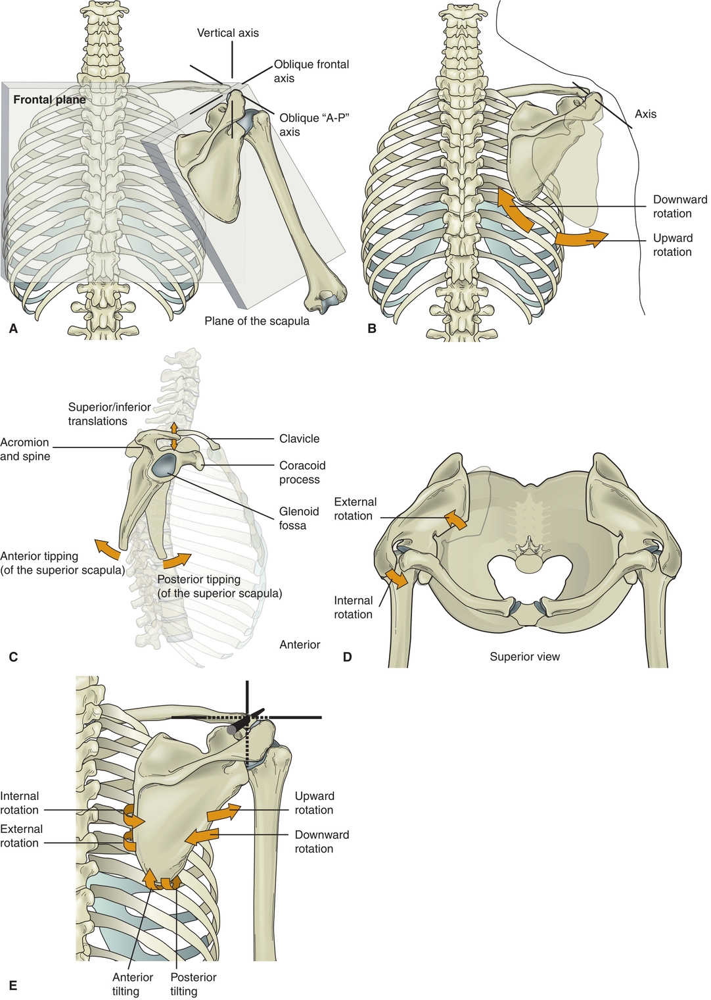

#### Scapulothoracic Joint

- The scapula rests on the muscles between the ventral surface of the thorax and the thoracic ribs. scapulothoracic movement is interdependent on movement at the AC and SC joints.

##### **Kinematics**

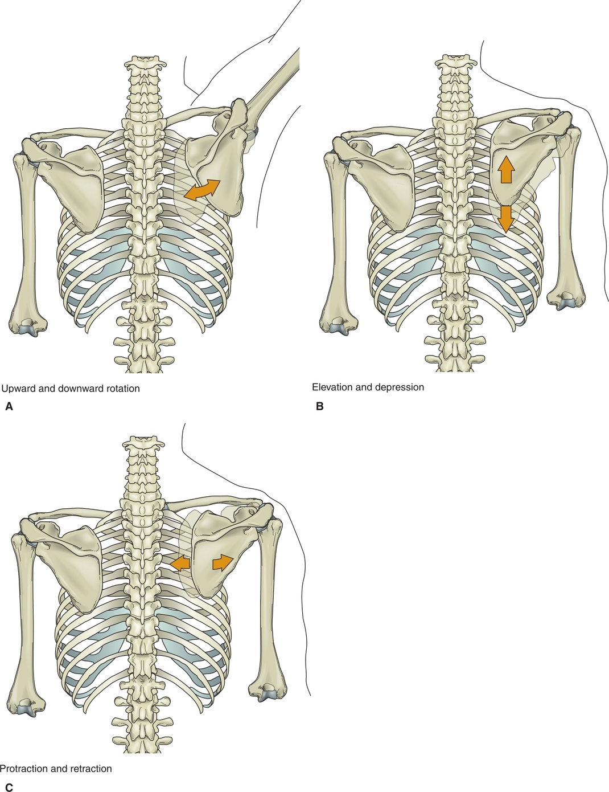

#### Glenohumeral Joint

- The spherical convex humeral head is twice the size of the smaller, shallow glenoid fossa, decreasing the contact area between the two surfaces. 
- A cartilaginous glenoid labrum outlines the fossa, increasing the depth of the fossa by 50% and contributing to the stability of the joint. The labrum increases the humeral head stability within the fossa, reduces joint friction, and provides an attachment site for the GH ligaments and the long head of the biceps brachii. 

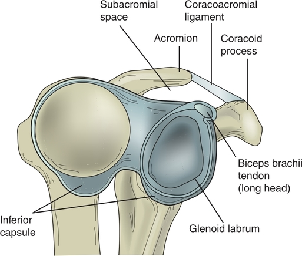

##### **Capsule and Ligaments**

-  In a resting anatomical position, the capsule is taut superiorly and lax anteriorly and inferiorly. The inferior portion features several folds, referred to as the axillary pouch. When the shoulder is elevated, the folds lengthen and allow the humeral head the mobility needed for overhead arm movement.

- The superior ligament limits anterior-posterior and inferior translation of the humeral head in the resting position. The middle ligament promotes anterior stability with the arm at the side of the body and during the first 60° of shoulder abduction. Medial and lateral humeral head rotation during shoulder abduction tightens all three ligaments and increases joint stability.

- The coracohumeral ligament contributes to humeral head stability as it spans from the coracoid process to the greater and lesser tubercles of the humerus, forming a tunnel for the long head of the biceps tendon. 
  - limits inferior translation of the humeral head and lateral rotation when the arm is at the side of the body in the dependent position. 
  - also becomes taut during lateral rotation when the shoulder is abducted. 
  - may assist in preventing superior translation of the humeral head toward the acromion when the rotator cuff muscles are impaired. 
  - Excessive superior translation of the head can impinge the structures that lie between the humeral head and the acromion process.
- In the resting position with the arm at the side of the body, gravity exerts a downward force on the humeral head as it rests on the smaller glenoid fossa.

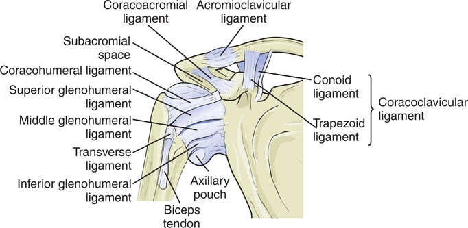

##### **Coracoacromial Arch**

- The acromion, the coracoid process, and the coraco­acromial ligament, which spans the two bony prominences, together form the coracoacromial arch over the humeral head. 
- The space between the arch and the humeral head is called the subacromial space. 
- The subacromial bursa, the rotator cuff tendons, the tendon of the long head of the biceps brachii, and a portion of the joint capsule all occupy this space. 
- The subacromial bursa protects the supraspinatus muscle and tendon from the acromion process. Several bursae are situated between structures throughout the shoulder complex to minimize stresses between tissues. 
- The subdeltoid bursa is a lateral branch of the subacromial bursa and is located between the deltoid muscle and the supraspinatus tendon and humeral head.

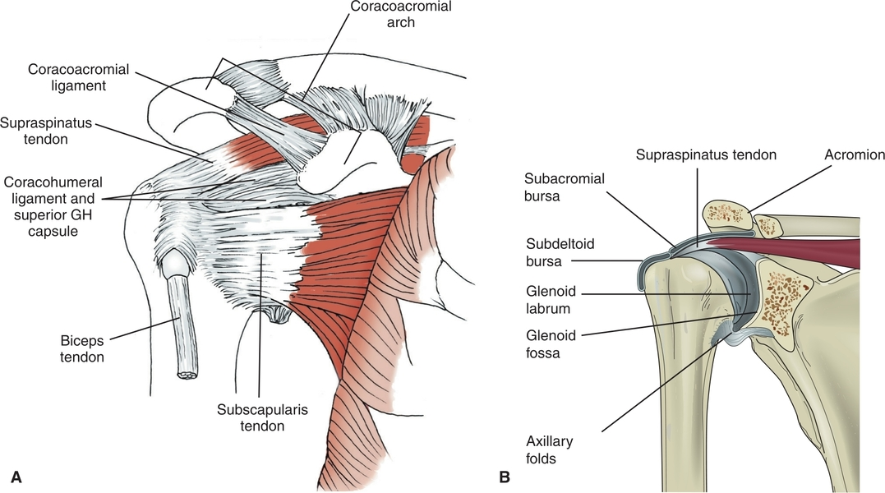

- bony spurs, a change in the acromion shape or slope, or a disproportional humeral head can decrease the subacromial space. 
- Functional factors related to dysfunction of scapular movement or humeral movement or both can also decrease the subacromial space during arm movement. 
- Both anatomical and functional factors can lead to impingement of the subacromial structures between the humeral head and the coracoacromial arch as the arm elevates. Chronic impingement can lead to inflammation of the subacromial structures. This inflammation can lead to fibrosis and thickening of the tissues, further decreasing the subacromial space.

##### **Kinematics**

- GH joint has 3 degrees of freedom of movement: flexion and extension, abduction and adduction, and medial and lateral rotatio
  - Flexion and extension of the GH joint occur in the sagittal plane around a horizontal axis. Range of motion is about 120° of flexion and 50° to 60° of extension. This limited amount of overhead reach is increased to a full 180° with the addition of scapulothoracic motion
  - During flexion, the humeral head is rolling in a superior direction and gliding inferiorly. The humerus rolls and glides in the opposite directions during extension.

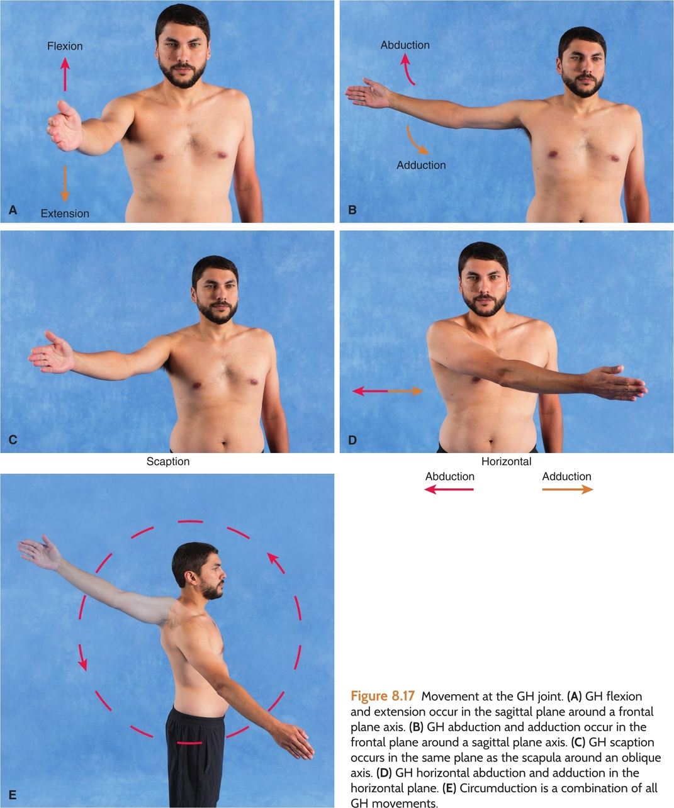

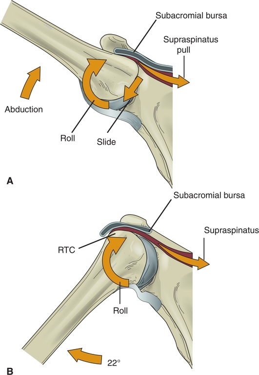

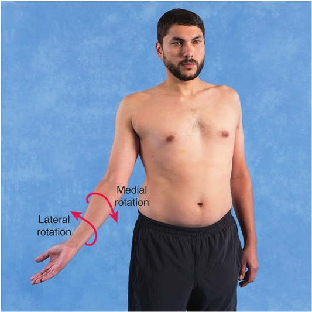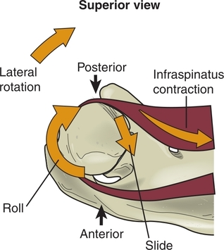

## SHOULDER COMPLEX KINEMATICS

- impairment and dysfunction in one part of the chain can affect the role of the entire complex. To regain function of the entire shoulder complex, these individual impairments must be addressed.

### SCAPULOTHORACIC AND GLENOHUMERAL CONTRIBUTIONS

- collaborative movement between the links of the shoulder complex is termed scapulohumeral rhythm. 

- The primary movement at the scapulothoracic joint is upward rotation with secondary posterior tilting. The role of medial and lateral scapular rotation varies, but movement is minimal in either direction below 100° of arm elevation. By end range of elevation, the scapula is generally in a position of lateral rotation on the thorax.

- During the first 30° of GH abduction or 60° of flexion, there is little active scapular motion. After these initial set points, the amount of humeral movement maintains a ratio of movement with the scapula of 2 : 1. Although studies measuring this movement vary in their results, in general, **scapulohumeral rhythm** is achieved when, beyond 30° of abduction or 60° of flexion, for every 3° of shoulder elevation, 2° occurs at the GH joint and 1° degree results from scapulothoracic joint upward rotation. Thus, a full 180° of motion during arm elevation results from 120° of GH joint movement and 60° of scapulothoracic upward rotation

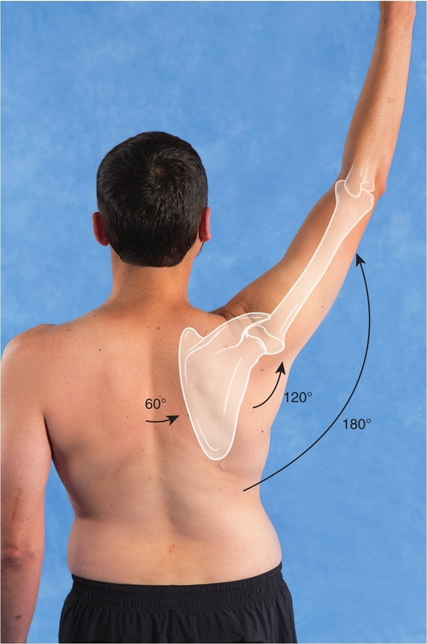

### STERNOCLAVICULAR AND ACROMIOCLAVICULAR CONTRIBUTIONS

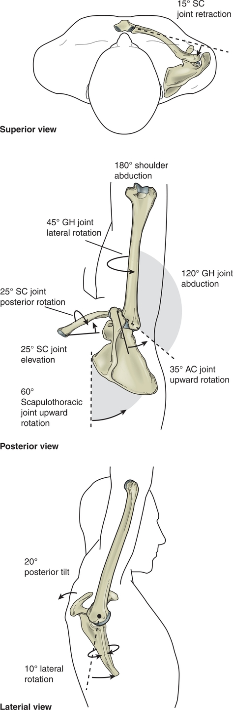

## SHOULDER COMPLEX MUSCLES

### SCAPULOTHORACIC JOINT MUSCLES

The scapulothoracic muscles produce the scapular movements of elevation, depression, protraction, retraction, upward rotation, and downward rotation. These motions provide optimal scapular orientation for humerus movement.

#### Elevators and Depressors

- Elevators:
  - upper trapezius and levator scapulae muscles: primary 
  - rhomboids assist 

+ depression results from activation of the lower trapezius, latissimus dorsi, and pectoralis minor muscles
  + The lower trapezius and pectoralis minor have a direct function of depression as they attach to the scapula. 
  + The latissimus dorsi indirectly depresses the scapula by moving the humerus inferiorly. 
  + If the humerus is stabilized, the scapular depressors can work in a reversal of action. This reversal of action is often used for people with paralysis who practice pressure relief to avoid skin and tissue breakdown. When a person is sitting in a wheelchair with the arms placed on the armrest, the lower trapezius and latissimus dorsi can be contracted to elevate the pelvis up toward the fixed scapula. This maneuver lifts the ischial tuberosities off the sitting surface and decreases contact pressure on the tissues between the bone prominences and the seat 

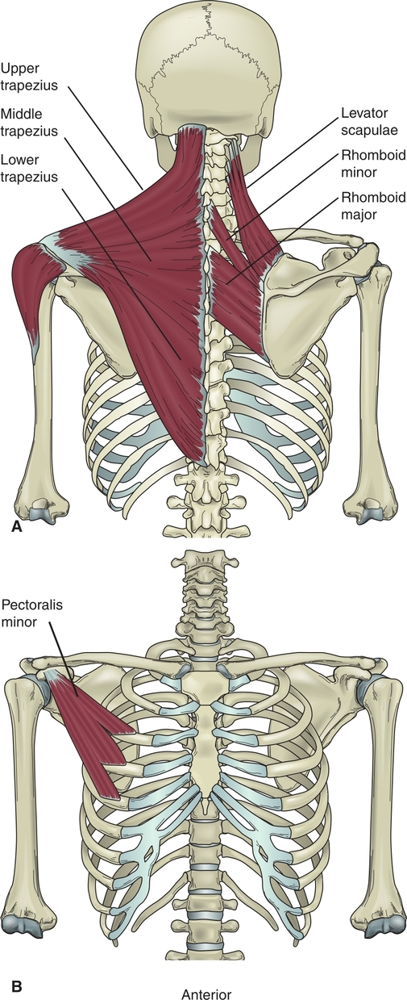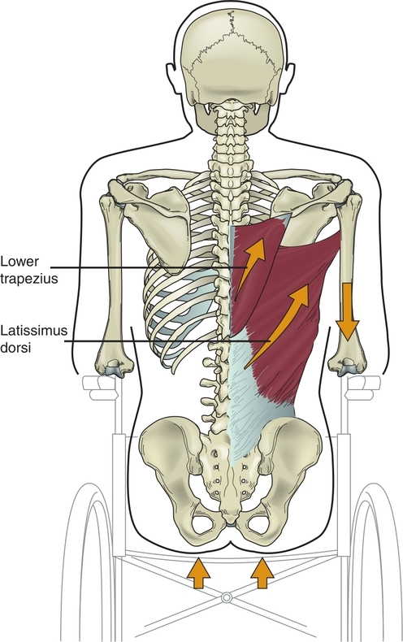

#### Protractors and Retractors

- The serratus anterior muscle is the primary protractor of the scapula 
  - When the elbows are completely extended during the push-up, the serratus can protract the scapulae and lift the thorax further up from the support surface
- The middle trapezius fibers are aligned in a near-horizontal direction and function as the primary scapular retractors. The rhomboids and lower trapezius muscles also assist with scapular retraction. T
  - Because of the superior diagonal orientation of the rhomboid fibers and the inferior orientation of the lower trapezius fibers, these opposing directions cancel each other, resulting in retraction

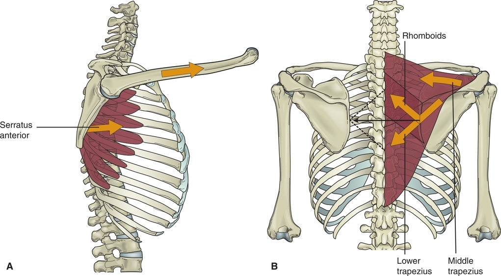

#### Upward and Downward Rotators

- Scapular upward rotation： serratus anterior and the upper and lower trapezius muscles. 
  - Without upward rotation of the scapula, the length of the deltoid muscle could not produce adequate tension to elevate the humerus.
- Downward rotation: levator scapulae, pectoralis minor, and rhomboids

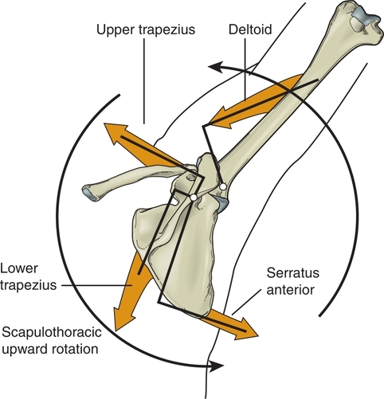

### GLENOHUMERAL JOINT MUSCLES

 SITS : supraspinatus, the infraspinatus, the teres minor, and the subscapularis 

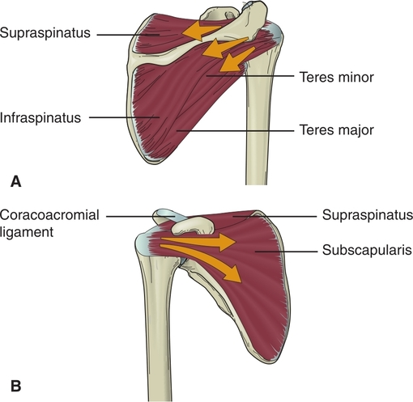

#### Dynamic Stabilizers

- The GH joint is structurally designed as a joint of mobility rather than stability. rotator cuff muscles play a major role in providing this dynamic stability. 

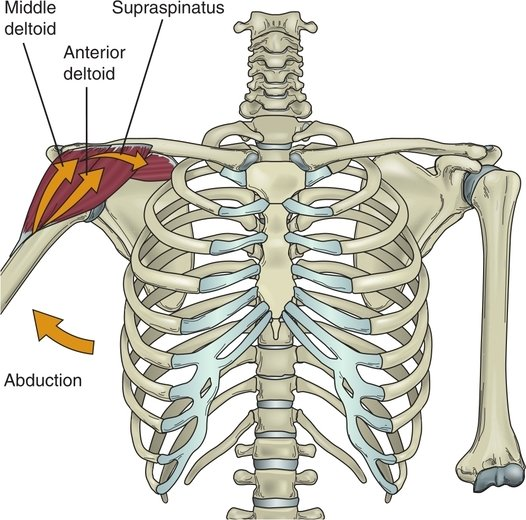

- The supraspinatus muscle is located in the supraspinous fossa of the scapula and contributes to the tendinous cuff as it attaches to the greater tubercle of the humerus. 
  - With its horizontal line of pull, the supraspinatus compresses the humeral head into the glenoid fossa, providing stability as it centralizes the head against the glenoid fossa during motion. 
  - During shoulder abduction, the supraspinatus assists with humeral abduction and produces the superior roll of the head of the humerus as the shaft moves in a superior direction. 
  - It also generates a small amount of humeral head lateral rotation during the motion 
- During shoulder elevation, the infraspinatus, teres minor, and subscapularis exert an inferior force on the humeral head to glide it in an inferior direction. 
  - The infraspinatus muscle lies in the infraspinous fossa, whereas the teres minor attaches to the lateral scapula border. The tendons of both muscles emerge into the rotator cuff attaching to the greater tubercle. 
  - The subscapularis is located in the anterior scapula fossa and contributes to the cuff from an anterior direction as it attaches to the lesser tubercle of the humerus. 
  - The inferior translatory pull on the humeral head produced by these muscles counters the superior force of the deltoid muscle during shoulder elevation 

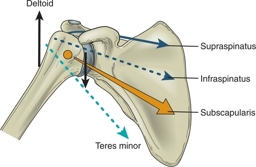

- The tendon of the long head of the biceps attaches to the supraglenoid tubercle, traverses over the humeral head, and descends through the intertubercular groove. When the biceps is activated, the tendon pulls the humeral head inferiorly. 
- The long head of the triceps that attaches to the infraglenoid tubercle contributes to humeral head stability during humeral motion.
- The subscapularis muscle provides medial humeral rotation and anterior stability to the shoulder. 
- The infraspinatus and teres minor muscles laterally rotate the humerus, clearing the greater tuberosity from the coracoacromial arch during shoulder elevation. By preventing excessive superior translation of the humerus toward the acromial arch and producing lateral rotation of the humeral head, these muscles avoid possible impingement of structures in the subacromial space. 
- Rotator cuff muscle malfunction resulting from overuse or injury can lead to subacromial impingement, pain, and shoulder dysfunction.

#### Primary Movers

- deltoid, latissimus dorsi, teres major, pectoralis major, and coracobrachialis.

- deltoid muscle has proximal attachments to the clavicle and acromion process of the scapula and converges to attach to the deltoid tuberosity of the humerus. 
  - anterior portion produces GH flexion and horizontal adduction and contributes to medial rotation. 
  - middle deltoid fibers contribute to shoulder abduction once the supraspinatus muscle initiates the motion. 
    - In a resting position, the deltoid muscle line of pull initially elevates the humerus toward the coracoacromial arch but has little ability to produce humerus rotary movement and abduction. 
    - The supraspinatus initiates the abduction, while the other rotators counter the superior movement of the humerus produced by the deltoid. 
    - As the shoulder moves toward 50° of abduction, the deltoid’s moment arm to produce motion increases, and the deltoid becomes the primary mover for the remaining range of abduction.
  - posterior fibers can result in GH extension, horizontal abduction, or lateral rotation. 
  - long head of the biceps and coracobrachialis assist the deltoid during shoulder 
    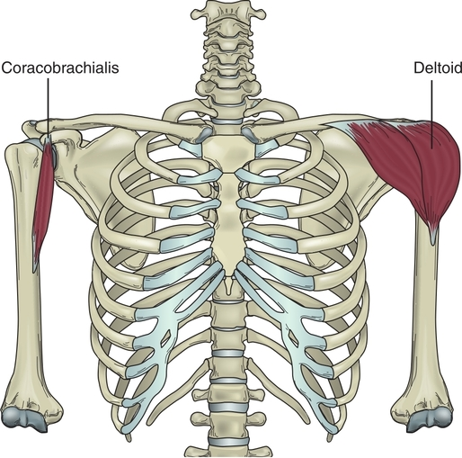
- The major adductor and extensor muscles of the GH joint
  - posterior deltoid, latissimus dorsi, teres major, long head of the triceps, and the sternocostal portion of the pectoralis major. 
  - pulling, where the arm is extending and adducting against resistance, the teres major assists the latissimus dorsi muscle. 
    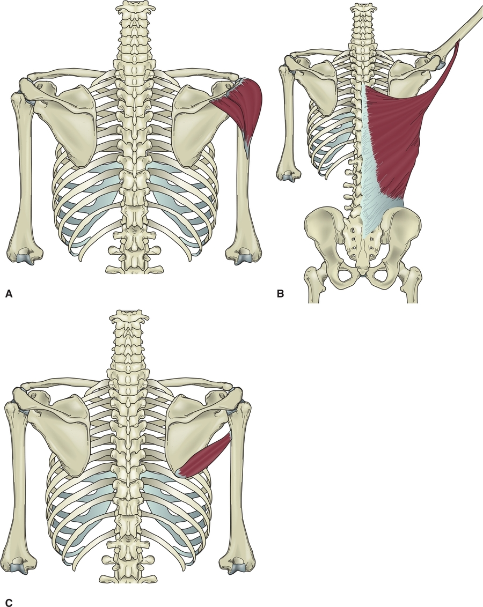

- The pectoralis major muscle is located anteriorly as it originates on the clavicle, ribs, and sternum and attaches to the crest of the greater tubercle. 
  - The muscle is divided into two portions: the clavicular head and the sternocostal head. 
  - GH adduction, medial rotation, and horizontal adduction. 
  - The clavicular portion of the muscle assists with shoulder flexion, 
  - sternocostal portion extends the GH joint from a fully flexed position 

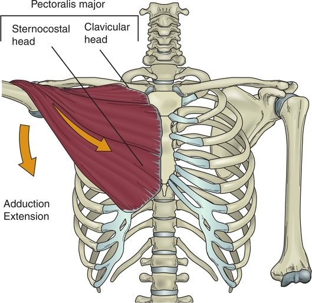

##### **Clinical Connection 8.1**

- Impingement syndrome 
  - structures within the subacromial space are compromised and impinged. 
  - early stages, people with impingement syndrome can experience shoulder pain when raising the arm. In more advanced injury, they may have discomfort even at rest.
- Intrinsic factors are related to muscle weakness. 
  - Rotator cuff muscle weakness can result in excessive humeral head elevation in the glenoid fossa during overhead lifting of the arm. The humeral head compresses the structures in the subacromial space, including the rotator cuff, coracoacromial ligament, bursa, and bicipital tendon. 
  - Repetitive overuse of the arm with this subacromial compression can produce microtrauma, tendonitis, and GH instability. The subacromial space can also be compromised by excessive scapular protraction and tilt resulting from scapulothoracic muscle weakness. 
- Extrinsic factors that can cause impingement include a malformation of the acromion that results in compression on the rotator cuff or degenerative joint changes in the AC joint. These bony factors, although extrinsic to the actual joint space, can produce external stresses to the subacromial structures.

## FUNCTIONAL DEFICITS IN THE SHOULDER COMPLEX

- During arm elevation, the upper and lower trapezius and serratus anterior muscles work in synergy to rotate the scapula upward while maintaining it in contact with the thorax. 
- If the serratus anterior is weak, the medial border of the scapula is “winged” and not held in contact with the thorax. Normal scapulohumeral rhythm is disrupted, making efficient arm elevation difficult.
- Imbalances in the strength of these upward rotators of the scapula can also lead to shoulder injury, pain, and dysfunction. 
  - For example, if the upper trapezius muscle is strong in relation to a weaker lower trapezius or serratus anterior muscle, the scapula will be pulled superiorly before rotating in an upward direction during arm elevation. 
  - This superior motion causes the humeral head to migrate upward in the glenoid fossa, resulting in impingement of subacromial soft tissue structures.
- forward head 
  - rhomboids and lower trapezius muscles are overlengthened and weakened, whereas the pectoralis minor muscles are often tight and shortened. 
  - This excessively protracted scapular position and the inability of the scapula to effectively rotate upward compresses the subacromial structures as the arm reaches overhead. 
  - The posterior GH joint capsule can also become excessively tight, which hinders the inferior glide of the humeral head during arm elevation. This capsular tightness can contribute to impingement of subacromial structures.
- If the rotator cuff muscles are weak or malfunctioning and not countering this superior translation, the upward movement of the humeral head can be more substantial. The impingement that can occur with the malaligned scapula and repetitive arm elevation can injure the rotator cuff. 
- The cuff is compressed between the humeral head and the coracoacromial ligament, acromion, and rim of the glenoid fossa, resulting in a condition known as rotator cuff syndrome. When the rotator cuff undergoes repetitive microtrauma from the humeral impingement, it can become inflamed. Clinical signs of rotator cuff damage include shoulder pain when raising the arm overhead and shoulder pain at rest.

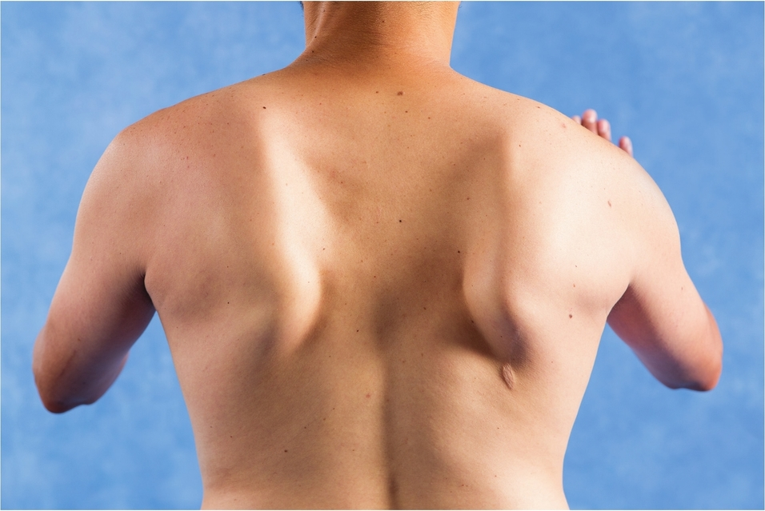

**Figure 8.33** Scapular winging.