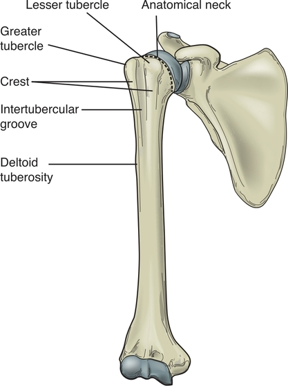

The study of the upper extremity begins by studying the shoulder complex. The shoulder complex is made up of articulations among the sternum, clavicle, ribs, humerus, and scapula ([Fig. 8.1](https://jigsaw.vitalsource.com/books/9780803675056/epub/OPS/c08.xhtml?favre=brett#fig8-1)). During motion of the shoulder complex, each of these articulations plays a role in the movement by either stabilizing a joint so that another portion of the complex can move on it or participating in arthrokinematic and osteokinematic motions. For optimal function, several muscles work together to produce movement of the shoulder complex. Muscle weakness of any of the muscle groups can affect the ability of the other muscles to generate power or perform fine-motor activities.

**Figure 8.1** The shoulder complex. **(A)** Anterior view of the shoulder complex structures and joints. **(B)** Posterior view. **(C)** Superior view. *(From Houglum B, Beroto D*. Brunnstrom’s Clinical Kinesiology, *6th ed. Philadelphia, PA: F. A. Davis Company, 2012, with permission.)*

## SHOULDER COMPLEX STRUCTURES

Five bones and their connective tissue structures form the joints that make up the shoulder complex. The configuration of each structure plays a role in the kinematics of the individual joints and in upper extremity movement as a whole.

### BONES

#### Sternum

The sternum is the flat, long bone located in the midline of the anterior thorax and acts as an anterior anchor for the ribs. The regions of the sternum are, from proximal to distal, the manubrium, the body, and the xiphoid process. The clavicular facets are located on each side of the manubrium and are the site of the sternal articulation with the clavicle. Between the two facets is the jugular notch (sternal notch), which is located at the superior border of the manubrium.

#### Clavicle

The clavicle is the curved bone that articulates medially with the sternum and laterally with the scapula. The costal facet of the clavicle links to the first rib. In the anatomical position, the clavicle lies about 20° posterior to the frontal plane and slightly above the horizontal plane. The bone has a convex shape medially and curves to a concave shape laterally.

#### Scapula

The scapula is located on the posterolateral aspect of the thorax. In the anatomical position, it is typically at the level between T2 and T7 vertebrae. The scapula has three sides, or borders: the medial (or vertebral) border, the lateral (or axillary) border, and the superior border. The medial border runs parallel to the vertebral column and is typically about 6 cm from the spine. The upper corner of the medial border is the superior angle, and the lower corner is the inferior angle of the scapula. The lateral border runs from the inferior angle to the lower border of the glenoid cavity. The superior border runs from the superior angle to the base of the coracoid process.

The scapular spine divides the posterior surface of the scapula into the supraspinous fossa and the infraspinous fossa. The lateral end of the scapular spine flattens to form the prominent acromion process. The coracoid process protrudes from the anterior surface of the scapula and is the site of attachment for several muscle groups. The subscapular fossa is located on the ventral surface of the scapula. [Figure 8.2](https://jigsaw.vitalsource.com/books/9780803675056/epub/OPS/c08.xhtml?favre=brett#fig8-2) depicts the landmarks of the scapula.

**Figure 8.2** Landmarks of the scapula. **(A)** Anterior view of the scapula. **(B)** Posterior view. *(From Roy S, Wolf SL, Scalzitti DA*. The Rehabilitation Specialist’s Handbook, *4th ed. Philadelphia, PA: F. A. Davis Company, 2013: p. 51, with permission.)*

The acromion process protrudes laterally and forms a shelf over the glenoid fossa ([Fig. 8.3](https://jigsaw.vitalsource.com/books/9780803675056/epub/OPS/c08.xhtml?favre=brett#fig8-3)). Within the concave fossa are the supraglenoid and infraglenoid tubercles. These tubercles serve as muscle attachment sites: The long head of the biceps attaches to the supraglenoid tubercle, and the long head of the triceps attaches to the infraglenoid tubercle. The glenoid fossa is oriented approximately 35° anterior to the frontal plane. This orientation is referred to as the scapular plane and is illustrated in [Figure 8.4](https://jigsaw.vitalsource.com/books/9780803675056/epub/OPS/c08.xhtml?favre=brett#fig8-4). Most of the functional movements occurring between the scapula and the humerus take place in the scapular plane.

**Figure 8.3** Frontal plane view of the scapula showing the glenoid fossa. *(From Starkey C, Brown D*. Examination of Orthopedic & Athletic Injuries, *4th ed. Philadelphia, PA: F. A. Davis Company, 2015, p. 603, with permission.)*

**Figure 8.4** Superior view of the scapula in its resting position 30° to 45° from the frontal plane. *(From Houglum B, Beroto D*. Brunnstrom’s Clinical Kinesiology, *6th ed. Philadelphia, PA: F. A. Davis Company, 2012, p.163, with permission.)*

#### Humerus

The convex head of the humerus articulates with the slightly concave glenoid fossa to form the glenohumeral (GH) joint. The anatomical neck separates the head of the humerus from the shaft. The head is oriented medially and superiorly, forming a 130° to 150° angle of inclination with the humeral shaft ([Fig. 8.5A](https://jigsaw.vitalsource.com/books/9780803675056/epub/OPS/c08.xhtml?favre=brett#fig8-5)). This angle is formed by the intersection of a line through the humeral head and neck and a line through the longitudinal axis of the humeral shaft. The head is inclined in relationship to the long shaft of the humerus. The head of the humerus is rotated posteriorly about 30° from the horizontal plane. This posterior rotation is referred to as retroversion, from the Latin *retro*, meaning “backward,” and *verto*, meaning “to turn” ([Fig. 8.5B](https://jigsaw.vitalsource.com/books/9780803675056/epub/OPS/c08.xhtml?favre=brett#fig8-5)).

The greater and lesser tubercles on the humerus are divided by the intertubercular (bicipital) groove. The tubercles and the deltoid tuberosity are points of attachment for shoulder complex muscle groups. On the posterior surface of the humerus is the radial groove that divides the lateral and medial heads of the triceps ([Fig. 8.6](https://jigsaw.vitalsource.com/books/9780803675056/epub/OPS/c08.xhtml?favre=brett#fig8-6)).

### JOINTS

There are four distinct joints within the shoulder complex: the sternoclavicular (SC), the acromioclavicular (AC), the scapulothoracic, and the GH joints. Movement in these joints is coupled so that each joint functions as a link in a chain contributing to the overall final movement of the upper extremity. Motion at the SC and the AC joints produces motion at the scapulothoracic joint. Dysfunction in one of these joints can interfere with optimal movement and function of the upper extremity. Because of the scapula’s articulation with the clavicle, SC and AC joint motion is always linked to scapulothoracic movement. When there is movement at the scapulothoracic joint, movement will occur at the SC joint, the AC joint, or both joints. The position and movement of the scapula also influence movement between the humerus and the scapula.

**Figure 8.5** **(A)** The 135° angle between the shaft and head of the humerus in the frontal plane is referred to as the angle of inclination. **(B)** The humeral head is rotated posteriorly in relation to the distal humerus in 30° of retroversion. *(From Houglum B, Beroto D*. Brunnstrom’s Clinical Kinesiology, *6th ed. Philadelphia, PA: F. A. Davis Company, 2012, p.166, with permission.)*

**Figure 8.6** Anterior view of the proximal humerus bony landmarks.

**Figure 8.7** Anterior view of the SC joints and associated ligaments. The capsule and a portion of the SC ligament have been removed to display the articular disc and posterior bundle of the SC ligament.

#### Sternoclavicular Joint

The upper extremity and the shoulder complex attach to the axial skeleton via the SC joint ([Fig. 8.7](https://jigsaw.vitalsource.com/books/9780803675056/epub/OPS/c08.xhtml?favre=brett#fig8-7)). The SC joint is classified as a plane synovial joint and encompasses the complex articulation between the medial end of the clavicle, the clavicular facet of the sternum, and the superior cartilage of the first rib. Movement at the SC joint produces movement at the scapula as a result of the clavicle’s articulation with the scapula at the AC joint. Likewise, movement of the scapula often results in movement at the SC joint.

##### **Capsule, Ligaments, and Disc**

A strong fibrous capsule and ligamentous structures reinforce the SC joint. The irregular saddle-shaped surface of both the clavicle and the sternum, the capsule, and the ligaments contribute to the tremendous stability of the joint. The anterior and posterior SC ligaments limit anterior and posterior movement of the medial clavicle. The costoclavicular ligament runs from the cartilage of the first rib to the clavicle in a crisscross pattern of fibers. This arrangement of fibers checks joint motion in all directions except during clavicular depression. The interclavicular ligament connects the medial aspects of each clavicle as it crosses the jugular notch.

The joint contains a flattened fibrocartilage disc that divides the joint into two sections. The disc functions as a shock absorber while enhancing the stability of the joint. As the upper extremity moves, the disc provides a pivot point for the clavicle to move on the sternum. The bony configuration, strong periarticular structures, and intra-articular disc minimize stresses and excessive motion at the SC joint. Dislocations at the SC joint are uncommon, accounting for 1% of the joint dislocations that occur throughout the body.

##### **Kinematics**

The clavicle displays 3 degrees of freedom as it moves to bring the scapula into optimal positions with the head of the humerus during shoulder movement. Osteokinematic motion of the clavicle includes elevation and depression, and protraction and retraction using the lateral end of the clavicle as the reference point for describing the motion ([Fig. 8.8](https://jigsaw.vitalsource.com/books/9780803675056/epub/OPS/c08.xhtml?favre=brett#fig8-8)). The clavicle also rotates anteriorly and posteriorly around the longitudinal axis of the bone.

There are approximately 45° of elevation and 10° of depression at the SC joint in a near-frontal plane. As the lateral end of the clavicle elevates, the convex surface rolls superiorly and slides inferiorly on the sternum in arthrokinematic motion ([Fig. 8.9A](https://jigsaw.vitalsource.com/books/9780803675056/epub/OPS/c08.xhtml?favre=brett#fig8-9)). Clavicular depression results in the convex surface rolling interiorly and sliding superiorly.

SC protraction and retraction occurs in a near-horizontal plane around a vertical axis. During the 15° to 20° of protraction, the lateral clavicle moves anteriorly, while the medial clavicle slides anteriorly. There is 30° or more of retraction range of motion where the lateral clavicle moves in a posterior direction and the medial clavicle slides posteriorly (Fig.8.9B).

Rotation of the clavicle in an anterior-posterior direction occurs around the long axis of the clavicle. As the clavicle rotates posteriorly, the inferior surface of the bone faces anteriorly. Posterior rotation can be 50°. As the clavicle returns from this posterior position, it rotates in an anterior direction back to its beginning neutral position. There is very little rotation past the neutral position.

**Figure 8.8** Clavicular elevation and depression occur in a near-frontal plane, protraction and retraction occur in a near-horizontal plane, and rotation occurs in a near-sagittal plane.

**Figure 8.9** **(A1)** During clavicular elevation, the proximal end slides inferiorly as it rolls superiorly; **(A2)** these motions are reversed during clavicular depression. **(B)** During clavicular retraction, the proximal end rolls and slides posteriorly; during protraction, it rolls and slides anteriorly. *(From Houglum B, Beroto D*. Brunnstrom’s Clinical Kinesiology, *6th ed. Philadelphia, PA: F. A. Davis Company, 2012, p.174, with permission.)*

#### Acromioclavicular Joint

The AC joint is a plane synovial joint made up of the lateral end of the clavicle and the acromion of the scapula. The joint has 3 degrees of freedom that enable the scapula to rotate outside of its original plane in the resting position during arm movement. The purpose of the AC joint is to rotate the scapula during upper extremity movement so that the head of the humerus and the glenoid fossa of the scapula remain in alignment. This optimal position allows the arm to move throughout a full range of motion without impingement or damage to the tendons and connective tissues that lie between the humeral head and the acromion process ([Fig. 8.10](https://jigsaw.vitalsource.com/books/9780803675056/epub/OPS/c08.xhtml?favre=brett#fig8-10)).

##### **Capsule, Ligaments, and Disc**

A weak capsule surrounds the AC joint that is reinforced by the superior and inferior AC ligaments. The superior joint has further support through the attachment of the deltoid and trapezius muscles. The coracoclavicular ligament also stabilizes the AC joint by securing the clavicle with the scapula and providing superior and inferior stability. The ligament is divided into the trapezoid ligament, which runs in a superior and lateral direction from the coracoid process to the clavicle, and the conoid ligament, which runs in a more vertical direction from the coracoid process to the clavicle ([Fig. 8.11](https://jigsaw.vitalsource.com/books/9780803675056/epub/OPS/c08.xhtml?favre=brett#fig8-11)). Fibrocartilage lines the articular surfaces of the AC joint, which is a fibrocartilaginous disc in early childhood. With repeated upper extremity motion, the joint develops a joint space and in a small percentage of the population contains an incomplete articular disc.

**Figure 8.10** The AC joint. **(A)** Anterior view of the AC joint at rest. **(B)** Rotation at the AC joint allows the glenoid fossa to maintain its alignment with the humerus as the arm elevates.

**Figure 8.11** Anterior view of the right AC joint and associated ligaments. *(From Houglum B, Beroto D*. Brunnstrom’s Clinical Kinesiology, *6th ed. Philadelphia, PA: F. A. Davis Company, 2012, p. 173, with permission.)* ***KIA\***

##### **Kinematics**

AC joint motion occurs around an axis that is oriented to the plane of the scapula. The 3° of AC joint motion are upward and downward rotation, anterior and posterior tilting, and medial and lateral rotation.

Upward and downward rotation occurs around an anterior-posterior axis that is perpendicular to the plane of the scapula ([Fig. 8.12A](https://jigsaw.vitalsource.com/books/9780803675056/epub/OPS/c08.xhtml?favre=brett#fig8-12)). During upward rotation, the glenoid fossa rotates superiorly, and the inferior angle of the scapula rotates upward. Downward rotation tilts the glenoid fossa inferiorly, and the inferior angle of the scapula rotates downward. Upward rotation at the AC joint occurs in conjunction with shoulder flexion or abduction, and downward rotation is associated with shoulder adduction or extension. Although ranges vary, upward rotation can occur up to 30° during full shoulder elevation and 17° of downward rotation from the resting position ([Fig. 8.12B](https://jigsaw.vitalsource.com/books/9780803675056/epub/OPS/c08.xhtml?favre=brett#fig8-12)).

Anterior and posterior tilting of the scapula occurs in relationship to the clavicle around an oblique medial-lateral axis. During anterior tilting, the acromion tilts in an anterior direction, and the inferior angle of the scapula tilts posteriorly. The opposite occurs during posterior tilting. The tilting motion allows the scapula to maintain contact with the curvature of the rib cage during shoulder movement while orienting the glenoid fossa with the humeral head. The range of anterior-posterior tilt is approximately 20° but can extend to 40° during maximal shoulder movement ([Fig. 8.12C](https://jigsaw.vitalsource.com/books/9780803675056/epub/OPS/c08.xhtml?favre=brett#fig8-12)).

The third degree of motion at the AC joint is medial and lateral rotation. This motion occurs around a vertical axis in relationship to the clavicle. During medial rotation, the glenoid fossa moves anteriorly and medially, while the medial scapular border moves away from the thorax. The fossa moves posteriorly and laterally with lateral rotation, while the medial scapular border moves toward the thorax. This plane of motion allows the scapula to maintain contact with the horizontal curvature of the thorax ([Fig. 8.12D](https://jigsaw.vitalsource.com/books/9780803675056/epub/OPS/c08.xhtml?favre=brett#fig8-12)). [Figure 8.12E](https://jigsaw.vitalsource.com/books/9780803675056/epub/OPS/c08.xhtml?favre=brett#fig8-12) depicts the 3 degrees of freedom that occur at the AC joint.

#### Scapulothoracic Joint

The scapula is positioned on the posterolateral thorax but does not form a true anatomical joint with the thorax. The scapula rests on the muscles between the ventral surface of the thorax and the thoracic ribs. In its resting position, the scapula is anteriorly tilted 10° to 15° and upwardly rotated 5° to 10° from the vertical plane. It is medially rotated 35° to 45° from the horizontal plane. Although these ranges are considered normal values, there is a wide range of individual variability. Because the scapula attaches to the clavicle and the clavicle attaches to the sternum, scapulothoracic movement is interdependent on movement at the AC and SC joints.

**Figure 8.12** Movement at the AC joint. **(A)** The axes of rotation of the AC joint are oriented in the scapular planes rather than the cardinal planes. **(B)** Upward and downward scapular rotation at the AC joint. **(C)** Lateral view of anterior and posterior tipping of the scapula that occurs at the AC joint during arm motion. **(D)** Superior view of scapular medial and lateral rotation that occurs at the AC joint. **(E)** Summary of motions that occur at the AC joint.

##### **Kinematics**

Scapular rotational motion involves the three motions described at the AC joint. Because it is clinically difficult to observe and measure AC joint motion, scapular motion is frequently assessed to determine scapular mobility and function. The 3 degrees of rotational motion (upward and downward rotation, anterior and posterior tilt, and medial and lateral rotation) are now described in terms of the entire scapula rather than the glenoid fossa of the scapula, as described in the AC joint section. During upward rotation, the inferior scapular angle moves in a superior and lateral upward rotation. The glenoid fossa tilts superiorly. The opposite motion occurs with downward rotation: The inferior scapular angle moves inferiorly with downward rotation, and the glenoid fossa tilts inferiorly. Between 50° and 60° of scapular upward rotation occurs with arm elevation.

The scapula also moves in the linear motions of elevation and depression and protraction and retraction. Scapular elevation occurs as the scapula moves from an upward direction on the thorax and requires elevation of the clavicle at the SC joint. An example of this motion is shrugging the shoulders. Both the lateral end of the clavicle and the acromion process move in a superior direction during scapular elevation. In scapular depression, the scapula moves downward on the thorax. This is an important movement when the upper extremities are weight bearing because depressing the scapulae lifts the trunk. An example of this motion is walking with crutches and pushing down on the hands to lift the body and move it forward. This scapular depression movement can lift the trunk several inches.

Scapular protraction (abduction) and retraction (adduction) describe the motion of the medial border of the scapula as it moves in a linear fashion away from and toward the spine. During protraction, the lateral end of the clavicle and the scapula move anteriorly as the scapula moves away from the spine while maintaining contact with the thorax. End-range scapular protraction results in the glenoid fossa facing anteriorly. Scapular retraction moves the scapula medially toward the vertebral column. Protraction and retraction of the scapula occurs because of protraction and retraction of the clavicle at the SC joint. Scapular motions are illustrated in [Figure 8.13](https://jigsaw.vitalsource.com/books/9780803675056/epub/OPS/c08.xhtml?favre=brett#fig8-13).

#### Glenohumeral Joint

The glenoid fossa of the scapula and the head of the humerus form the GH joint. The joint is a synovial ball-and-socket joint that is designed for mobility rather than stability and has 3 degrees of freedom. The spherical convex humeral head is twice the size of the smaller, shallow glenoid fossa, decreasing the contact area between the two surfaces. A cartilaginous glenoid labrum outlines the fossa, increasing the depth of the fossa by 50% and contributing to the stability of the joint. The labrum increases the humeral head stability within the fossa, reduces joint friction, and provides an attachment site for the GH ligaments and the long head of the biceps brachii. The head of the humerus faces a posterior, medial, and superior direction, whereas the fossa is oriented in an anterior-lateral position in the scapular plane and is slightly upwardly rotated ([Fig. 8.14](https://jigsaw.vitalsource.com/books/9780803675056/epub/OPS/c08.xhtml?favre=brett#fig8-14)).

##### **Capsule and Ligaments**

The GH joint is encased in a fibrous capsule that is twice the surface area of the humeral head. This loose capsule spans from the glenoid neck to the anatomical neck of the humerus. In a resting anatomical position, the capsule is taut superiorly and lax anteriorly and inferiorly. The inferior portion features several folds, referred to as the axillary pouch. When the shoulder is elevated, the folds lengthen and allow the humeral head the mobility needed for overhead arm movement.

The loose capsule allows mobility but provides minimal stability for the GH joint. To promote static joint stability, the superior, middle, and inferior GH ligaments reinforce the capsule as thickened regions within the capsule itself. The superior ligament limits anterior-posterior and inferior translation of the humeral head in the resting position. The middle ligament promotes anterior stability with the arm at the side of the body and during the first 60° of shoulder abduction. Medial and lateral humeral head rotation during shoulder abduction tightens all three ligaments and increases joint stability.

The coracohumeral ligament contributes to humeral head stability as it spans from the coracoid process to the greater and lesser tubercles of the humerus, forming a tunnel for the long head of the biceps tendon. The ligament limits inferior translation of the humeral head and lateral rotation when the arm is at the side of the body in the dependent position. It also becomes taut during lateral rotation when the shoulder is abducted. There is some evidence that the ligament may assist in preventing superior translation of the humeral head toward the acromion when the rotator cuff muscles are impaired. Excessive superior translation of the head can impinge the structures that lie between the humeral head and the acromion process. [Figure 8.15](https://jigsaw.vitalsource.com/books/9780803675056/epub/OPS/c08.xhtml?favre=brett#fig8-15) shows the joint capsule and ligaments associated with the GH joint.

**Figure 8.13** Scapular motion. **(A)** Scapular upward and downward rotation. **(B)** Scapular elevation and depression. **(C)** Scapular protraction and retraction. ***KIA\***

In the resting position with the arm at the side of the body, gravity exerts a downward force on the humeral head as it rests on the smaller glenoid fossa. To counter this force and provide static stability to the GH joint, noncontractile structures, including the superior capsule, superior GH ligament, and coracohumeral ligament, are taut and resist the force. The airtight joint vacuum created by an intact capsule and the glenoid labrum further enhances the stability of the joint. When these structures are intact and sufficient to counter forces, the muscles provide little if any static stability. If the forces exceed the ability of these noncontractile structures to maintain stability, the supraspinatus muscle may become electrically active to provide tension and stability to the joint. Dynamic stability is discussed later in this chapter.

##### **Coracoacromial Arch**

The acromion, the coracoid process, and the coraco­acromial ligament, which spans the two bony prominences, together form the coracoacromial arch ([Fig. 8.16](https://jigsaw.vitalsource.com/books/9780803675056/epub/OPS/c08.xhtml?favre=brett#fig8-16)) over the humeral head. The space between the arch and the humeral head is called the subacromial space. The subacromial bursa, the rotator cuff tendons, the tendon of the long head of the biceps brachii, and a portion of the joint capsule all occupy this space. The subacromial bursa protects the supraspinatus muscle and tendon from the acromion process. Several bursae are situated between structures throughout the shoulder complex to minimize stresses between tissues. The subdeltoid bursa is a lateral branch of the subacromial bursa and is located between the deltoid muscle and the supraspinatus tendon and humeral head.

**Figure 8.14** The GH joint opened up to show the larger convex humeral head and the smaller concave glenoid fossa with the outer labrum.

During normal function of the shoulder complex, the subacromial space provides adequate room for these structures as the humeral head moves on the glenoid fossa during arm elevation. Anatomical factors such as bony spurs, a change in the acromion shape or slope, or a disproportional humeral head can decrease the subacromial space. Functional factors related to dysfunction of scapular movement or humeral movement or both can also decrease the subacromial space during arm movement. Both anatomical and functional factors can lead to impingement of the subacromial structures between the humeral head and the coracoacromial arch as the arm elevates. Chronic impingement can lead to inflammation of the subacromial structures. This inflammation can lead to fibrosis and thickening of the tissues, further decreasing the subacromial space.

##### **Kinematics**

This section discusses movement that occurs solely at the GH joint, omitting, for the moment, concurrent movement of the scapulothoracic, SC, and AC joints. In most functional arm movements, movement at all the joints of the shoulder complex accomplishes the motion. The combining motion of the shoulder complex joints is discussed in detail later in this chapter.

**Figure 8.15** Anterior view of the GH joint showing the joint capsule and primary joint ligaments. *(From Houglum B, Beroto D.* Brunnstrom’s Clinical Kinesiology, *6th ed. Philadelphia, PA: F. A. Davis Company, 2012, p. 174, with permission.)*

When isolating the movement that occurs at the GH joint, the reported ranges of motion are highly variable. The GH joint has 3 degrees of freedom of movement: flexion and extension, abduction and adduction, and medial and lateral rotation ([Fig. 8.17](https://jigsaw.vitalsource.com/books/9780803675056/epub/OPS/c08.xhtml?favre=brett#fig8-17)). Flexion and extension of the GH joint occur in the sagittal plane around a horizontal axis. Range of motion is about 120° of flexion and 50° to 60° of extension. This limited amount of overhead reach is increased to a full 180° with the addition of scapulothoracic motion ([Fig. 8.17A](https://jigsaw.vitalsource.com/books/9780803675056/epub/OPS/c08.xhtml?favre=brett#fig8-17)). During flexion, the humeral head is rolling in a superior direction and gliding inferiorly. The humerus rolls and glides in the opposite directions during extension.

**Figure 8.16** **(A)** Anterior view of the coracoacromial arch and subacromial space with the supraspinatus and long head of the biceps tendon. **(B)** Frontal section with subacromial bursae and supraspinatus tendon. *(From Levangie P, Norkin C*. Joint Structure and Function: A Comprehensive Analysis, *5th ed. Philadelphia, PA: F. A. Davis Company, 2011: p. 248, with permission.)*

GH abduction and adduction occur in a frontal plane around a sagittal axis ([Fig. 8.17B](https://jigsaw.vitalsource.com/books/9780803675056/epub/OPS/c08.xhtml?favre=brett#fig8-17)). The maximum range of abduction can occur only if the humerus is laterally rotated to clear the greater tubercle from the coracoacromial arch. With the humerus in neutral or medial rotation, the tubercle impinges on the arch during shoulder abduction and restricts full abduction. Reports of available ranges of motion for abduction at the GH joint are highly variable, but normal range is usually considered between approximately 90° and 120° (without considering the other shoulder complex joints).

When the humerus is placed in the same plane as the scapula and elevated in the plane of the scapula, the movement is termed scapular abduction (or scaption) ([Fig. 8.17C](https://jigsaw.vitalsource.com/books/9780803675056/epub/OPS/c08.xhtml?favre=brett#fig8-17)). Reaching across the body in the horizontal plane is termed horizontal adduction ([Fig. 8.17D](https://jigsaw.vitalsource.com/books/9780803675056/epub/OPS/c08.xhtml?favre=brett#fig8-17)); moving in the opposite direction is horizontal abduction. A combination of all shoulder movements is called circumduction ([Fig. 8.17E](https://jigsaw.vitalsource.com/books/9780803675056/epub/OPS/c08.xhtml?favre=brett#fig8-17)).

The humeral head arthrokinematics in shoulder motion is a controversial subject in the literature. There is agreement that during shoulder abduction or flexion, the humeral head must slide inferiorly to minimize the effects of the superior rolling that occurs with the humeral head ([Fig. 8.18A](https://jigsaw.vitalsource.com/books/9780803675056/epub/OPS/c08.xhtml?favre=brett#fig8-18)). However, because the center of rotation changes within the humeral head, the head’s center appears to move 1 to 2 mm superiorly during portions of the range of motion. The concurrent inferior glide prevents the humeral head from compressing the contents of the subacromial space ([Fig. 8.18B](https://jigsaw.vitalsource.com/books/9780803675056/epub/OPS/c08.xhtml?favre=brett#fig8-18)). During adduction and extension, the slide occurs in a superior direction as it rolls in an inferior direction.

Medial and lateral rotation at the GH joint occurs in the horizontal plane around a vertical axis. The amount of available range of motion in rotation depends on the position of the joint in other planes. In the anatomical position, rotation is limited, but it increases when the shoulder is in 90° of abduction, where there are approximately 70° of medial rotation and 90° of lateral rotation ([Fig. 8.19](https://jigsaw.vitalsource.com/books/9780803675056/epub/OPS/c08.xhtml?favre=brett#fig8-19)). During lateral rotation, the humeral head rolls posteriorly and slides anteriorly. The simultaneous roll and slide allows the larger humeral head to maintain contact with the smaller glenoid fossa. These arthrokinematic movements are reversed during medial rotation; the humeral head rolls anteriorly and slides posteriorly ([Fig. 8.20](https://jigsaw.vitalsource.com/books/9780803675056/epub/OPS/c08.xhtml?favre=brett#fig8-20)).

**Figure 8.17** Movement at the GH joint. **(A)** GH flexion and extension occur in the sagittal plane around a frontal plane axis. **(B)** GH abduction and adduction occur in the frontal plane around a sagittal plane axis. **(C)** GH scaption occurs in the same plane as the scapula around an oblique axis. **(D)** GH horizontal abduction and adduction in the horizontal plane. **(E)** Circumduction is a combination of all GH movements.

**Figure 8.18** During shoulder abduction, the humeral head rolls superiorly, and the net glide is in an inferior direction **(A)**. Without the concurrent inferior glide, the humeral head would roll superiorly and compress the contents of the subacromial space **(B)**. RTC, rotator cuff. ***KIA\***

During functional use of the arm for self-care, work, and leisure activities, tasks are rarely, if ever, accomplished by isolated movement in only one of the joints of the shoulder complex. The next section combines the kinematics of each joint and explains the integrated function of the shoulder complex as the joints work in synergy to perform functional movements.

## SHOULDER COMPLEX KINEMATICS

The clavicle, scapula, and humerus function together as a kinetic chain to produce functional upper extremity movement. Because each joint contributes to the total motion, a much larger range of motion is produced than if each joint worked individually. The scapula acts as a stable base for optimal muscle control and function of the GH joint. Achieving optimal kinematics of the scapula and shoulder requires effective clavicular motion with contributions from the SC and AC joints. Because of the integrated effort and contribution of each link in the shoulder complex, impairment and dysfunction in one part of the chain can affect the role of the entire complex. To regain function of the entire shoulder complex, these individual impairments must be addressed.

**Figure 8.19** Right shoulder lateral and medial rotation with the arm in the anatomical position.

**Figure 8.20** Superior view of the humeral head rolling posteriorly and sliding anteriorly during GH lateral rotation.

### SCAPULOTHORACIC AND GLENOHUMERAL CONTRIBUTIONS

During overhead elevation of the arm, a relationship of movement exists between the humerus and the scapula. This collaborative movement between the links of the shoulder complex is termed scapulohumeral rhythm. To maintain optimal congruency between the glenoid and humeral head, the movement between the two must be synchronous.

The primary movement at the scapulothoracic joint is upward rotation with secondary posterior tilting. The role of medial and lateral scapular rotation varies, but movement is minimal in either direction below 100° of arm elevation. By end range of elevation, the scapula is generally in a position of lateral rotation on the thorax.

During the first 30° of GH abduction or 60° of flexion, there is little active scapular motion. After these initial set points, the amount of humeral movement maintains a ratio of movement with the scapula of 2 : 1. Although studies measuring this movement vary in their results, in general, **scapulohumeral rhythm** is achieved when, beyond 30° of abduction or 60° of flexion, for every 3° of shoulder elevation, 2° occurs at the GH joint and 1° degree results from scapulothoracic joint upward rotation. Thus, a full 180° of motion during arm elevation results from 120° of GH joint movement and 60° of scapulothoracic upward rotation ([Fig. 8.21](https://jigsaw.vitalsource.com/books/9780803675056/epub/OPS/c08.xhtml?favre=brett#fig8-21)).

**Figure 8.21** Scapulohumeral rhythm during shoulder abduction. The scapula upwardly rotates 60° and the humerus abducts 120° for a total of 180° of movement.

As the scapula upwardly rotates, its changing position allows the scapular glenoid fossa to maintain alignment with the head of the humerus. The scapular rotation also allows the shoulder abductor muscles to maintain an optimal length-tension relationship. The middle deltoid and supraspinatus muscles can effectively move the humerus through a large range of motion because of this length-tension ratio. Upward scapular rotation maintains the subacromial space between the acromion process and the humeral head. Inadequate upward rotation can reduce the subacromial space, injuring structures such as the supraspinatus tendon.

For full-range, symptom-free shoulder elevation in various planes, the humeral head must rotate laterally within the glenoid fossa. This rotation allows the greater tubercle to pass posterior to the acromion, avoiding impingement of the structures in the subacromial space. The amount of rotation required to clear the tubercle varies depending on the plane of movement. Shoulder abduction in the frontal plane requires 25° to 55° of rotation, but less is required for elevation in the scapular plane.

### STERNOCLAVICULAR AND ACROMIOCLAVICULAR CONTRIBUTIONS

Normal scapulothoracic movement during arm elevation in any plane also requires motion at the SC and AC joints. Scapular upward rotation when the arm is elevated is coupled with posterior rotation of the clavicle at the SC joint. The SC joint also retracts and undergoes minimal elevation. As the arm elevates, observation of the scapula moving relative to the clavicle at the AC joint reveals posterior tilting, upward rotation, and internal rotation of the scapula. Both the SC and the AC joints play a role in achieving scapular upward rotation during arm elevation. [Figure 8.22](https://jigsaw.vitalsource.com/books/9780803675056/epub/OPS/c08.xhtml?favre=brett#fig8-22) shows the contributions of movement at each joint at the shoulder complex to achieve full-range, symptom-free shoulder abduction.

## SHOULDER COMPLEX MUSCLES

Individual muscles of the shoulder complex rarely, if ever, perform shoulder complex movement. Instead, shoulder complex muscles function in synergy to produce the large ranges of motion necessary to reach overhead or behind the trunk. Most of these muscles are classified as either stabilizers or mobilizers. The proximal scapular stabilizers sustain the scapula against the thorax and orient the scapula in optimal alignment with the humeral head. The GH stabilizers orient the humeral head within the glenoid fossa so that the mobilizers can move the humerus on the fossa. The stabilizers originate on the spine, ribs, and cranium and attach on the scapula and clavicle. The mobilizers originate on the scapula and clavicle and insert on the humerus or forearm bones. The discussion of the shoulder complex muscles examines how they work together to produce functional movement of the shoulder. The specific muscle attachments and nerve innervations for the shoulder complex muscles are listed in [Appendix B](https://jigsaw.vitalsource.com/books/9780803675056/epub/OPS/c10-AppB.xhtml), which follows [Chapter 10](https://jigsaw.vitalsource.com/books/9780803675056/epub/OPS/c10.xhtml).

**Figure 8.22** Posterior view of the contributions of each joint of the shoulder complex during GH abduction.

### SCAPULOTHORACIC JOINT MUSCLES

The scapulothoracic muscles produce the scapular movements of elevation, depression, protraction, retraction, upward rotation, and downward rotation. These motions provide optimal scapular orientation for humerus movement.

#### Elevators and Depressors

[Chapter 5](https://jigsaw.vitalsource.com/books/9780803675056/epub/OPS/c05.xhtml) describes the function of the upper trapezius and levator scapulae muscles in moving the cervical spine. These same muscles are the primary scapula elevators, but here the rhomboids assist in the action. The upper trapezius attachments to the acromion process and scapular spine and levator’s attachment to the scapular superior angle pull the scapula superiorly toward the proximal cervical spine and occiput. These muscles resist the downward gravitation pull on the shoulder girdle. Scapular depression results from activation of the lower trapezius, latissimus dorsi, and pectoralis minor muscles ([Fig. 8.23](https://jigsaw.vitalsource.com/books/9780803675056/epub/OPS/c08.xhtml?favre=brett#fig8-23)). The lower trapezius and pectoralis minor have a direct function of depression as they attach to the scapula. The latissimus dorsi indirectly depresses the scapula by moving the humerus inferiorly. If the humerus is stabilized, the scapular depressors can work in a reversal of action. This reversal of action is often used for people with paralysis who practice pressure relief to avoid skin and tissue breakdown. When a person is sitting in a wheelchair with the arms placed on the armrest, the lower trapezius and latissimus dorsi can be contracted to elevate the pelvis up toward the fixed scapula. This maneuver lifts the ischial tuberosities off the sitting surface and decreases contact pressure on the tissues between the bone prominences and the seat ([Fig. 8.24](https://jigsaw.vitalsource.com/books/9780803675056/epub/OPS/c08.xhtml?favre=brett#fig8-24)).

#### Protractors and Retractors

The serratus anterior muscle is the primary protractor of the scapula and in an open chain movement produces scapular protraction during forward reaching or pushing with the upper extremity. It is often referred to as the “saw muscle” because the muscle fibers that attach to the ribs and thorax appear serrated, similar to a knife or a saw blade. In a closed chain function with the hands planted on a surface, the serratus provides scapular protraction during the end range of a standard prone push-up. When the elbows are completely extended during the push-up, the serratus can protract the scapulae and lift the thorax further up from the support surface ([Fig. 8.25A](https://jigsaw.vitalsource.com/books/9780803675056/epub/OPS/c08.xhtml?favre=brett#fig8-25)).

**Figure 8.23** **(A)** Posterior view of the scapulothoracic muscles. **(B)** Anterior view of the scapular depressor pectoralis minor. ***KIA\***

**Figure 8.24** In a reversal of action, the latissimus dorsi and lower trapezius muscles elevate the pelvis against a stabilized scapula. In this example, a client sitting in a wheelchair places the arms on the armrest and contracts the lower trapezius and latissimus dorsi to elevate the pelvis up toward the fixed scapula. This maneuver lifts the ischial tuberosities off the seat and decreases contact pressure on the tissues between the bony prominences and the seat. ***KIA\***

The middle trapezius fibers are aligned in a near-horizontal direction and function as the primary scapular retractors. The rhomboids and lower trapezius muscles also assist with scapular retraction. These muscles are recruited during pulling activities involving the arms, as they retract the scapulae and stabilize them on the thorax. Because of the superior diagonal orientation of the rhomboid fibers and the inferior orientation of the lower trapezius fibers, these opposing directions cancel each other, resulting in retraction ([Fig. 8.25B](https://jigsaw.vitalsource.com/books/9780803675056/epub/OPS/c08.xhtml?favre=brett#fig8-25)).

#### Upward and Downward Rotators

Scapular upward rotation is accomplished by the synergistic contractions of the serratus anterior and the upper and lower trapezius muscles. These contractions are essential to keep the glenoid fossa aligned with the humeral head and maintain an efficient length of the deltoid muscle during arm elevation. Without upward rotation of the scapula, the length of the deltoid muscle could not produce adequate tension to elevate the humerus.

**Figure 8.25** **(A)** The serratus anterior muscle protracts the scapula during forward arm reaching. **(B)** Middle trapezius, rhomboids, and lower trapezius muscles retract the scapula at different angles related to the orientation of the muscle fibers. ***KIA\***

The scapula’s axis of rotation is oriented in an anterior-posterior direction. The serratus and upper and lower fibers of the trapezius form a force-couple to upwardly rotate the scapula. The lower fibers of the serratus anterior pull the inferior angle of the scapula forward and rotate the glenoid fossa upward and laterally. The upper trapezius exerts a superior and medial pull, while the lower trapezius pulls the spine of the scapula inferiorly and medially ([Fig. 8.26](https://jigsaw.vitalsource.com/books/9780803675056/epub/OPS/c08.xhtml?favre=brett#fig8-26)). The levator scapulae, pectoralis minor, and rhomboids work together to produce scapular downward rotation against resistance.

### GLENOHUMERAL JOINT MUSCLES

To understand the role of the primary movers of the GH joint, one must be familiar with the muscles that provide dynamic stability and control the arthrokinematic motion of the GH joint. This stability and intra-articular control is produced by a group of four muscles termed the rotator cuff muscles. The acronym SITS is commonly used to refer to the four muscles whose tendons form the rotator cuff: the supraspinatus, the infraspinatus, the teres minor, and the subscapularis ([Fig. 8.27](https://jigsaw.vitalsource.com/books/9780803675056/epub/OPS/c08.xhtml?favre=brett#fig8-27)).

**Figure 8.26** Posterior view of the upper and lower trapezius and serratus anterior muscles producing upward rotation of the scapula while the deltoid muscle is abducting the arm.

#### Dynamic Stabilizers

The GH joint is structurally designed as a joint of mobility rather than stability. The noncontractile structures that enhance stability of the joint when it is at rest were discussed earlier in this chapter. As force is applied to the arm or the arm begins to move through arcs of motion, contractile tissues (muscles and tendons) provide dynamic stability to maintain the larger humeral head in alignment with the smaller glenoid fossa. The rotator cuff muscles play a major role in providing this dynamic stability. The distal tendinous end of the cuff muscles blends with and reinforces the joint capsule to form a protective cuff around the GH joint. When carrying a load with the arm, these muscles isometrically contract, increasing the rigidity of the cuff and holding the humeral head against the fossa to prevent shoulder subluxation.

**Figure 8.27** **(A)** Posterior view of the rotator cuff muscles as they merge to form the common rotator cuff tendon insertion on the humerus. **(B)** Anterior view of the subscapularis and its anterior contribution to the rotator cuff. ***KIA\***

**Figure 8.28** Anterior view of the middle deltoid and the supraspinatus producing GH abduction. The supraspinatus stabilizes the humeral head in the glenoid fossa.

The supraspinatus muscle is located in the supraspinous fossa of the scapula and contributes to the tendinous cuff as it attaches to the greater tubercle of the humerus. With its horizontal line of pull, the supraspinatus compresses the humeral head into the glenoid fossa, providing stability as it centralizes the head against the glenoid fossa during motion. During shoulder abduction, the supraspinatus assists with humeral abduction and produces the superior roll of the head of the humerus as the shaft moves in a superior direction. It also generates a small amount of humeral head lateral rotation during the motion ([Fig. 8.28](https://jigsaw.vitalsource.com/books/9780803675056/epub/OPS/c08.xhtml?favre=brett#fig8-28)).

During shoulder elevation, the infraspinatus, teres minor, and subscapularis exert an inferior force on the humeral head to glide it in an inferior direction. The infraspinatus muscle lies in the infraspinous fossa, whereas the teres minor attaches to the lateral scapula border. The tendons of both muscles emerge into the rotator cuff attaching to the greater tubercle. The subscapularis is located in the anterior scapula fossa and contributes to the cuff from an anterior direction as it attaches to the lesser tubercle of the humerus. The inferior translatory pull on the humeral head produced by these muscles counters the superior force of the deltoid muscle during shoulder elevation ([Fig. 8.29](https://jigsaw.vitalsource.com/books/9780803675056/epub/OPS/c08.xhtml?favre=brett#fig8-29)).

**Figure 8.29** Anterior view of the rotator cuff muscles and their role in GH arthrokinematics during GH abduction. The supraspinatus rolls the humeral head superiorly while compressing it into the fossa. The other rotator cuff muscles produce an inferior glide of the humeral head to counter excessive superior translation.

The long heads of the biceps and triceps tendons also play a role in this inferior translation of the humeral head during shoulder elevation. The tendon of the long head of the biceps attaches to the supraglenoid tubercle, traverses over the humeral head, and descends through the intertubercular groove. When the biceps is activated, the tendon pulls the humeral head inferiorly. The long head of the triceps that attaches to the infraglenoid tubercle contributes to humeral head stability during humeral motion.

The subscapularis muscle provides medial humeral rotation and anterior stability to the shoulder. The infraspinatus and teres minor muscles laterally rotate the humerus, clearing the greater tuberosity from the coracoacromial arch during shoulder elevation. By preventing excessive superior translation of the humerus toward the acromial arch and producing lateral rotation of the humeral head, these muscles avoid possible impingement of structures in the subacromial space. Rotator cuff muscle malfunction resulting from overuse or injury can lead to subacromial impingement, pain, and shoulder dysfunction.

#### Primary Movers

During normal shoulder movement, the dynamic stabilizers provide the stability and arthrokinematic motion necessary for the primary movers to accomplish shoulder motion through large arcs of motion. These muscles include the deltoid, latissimus dorsi, teres major, pectoralis major, and coracobrachialis.

The deltoid muscle has proximal attachments to the clavicle and acromion process of the scapula and converges to attach to the deltoid tuberosity of the humerus. The muscle has three functional units, each determined by the orientation of its fibers. The anterior portion produces GH flexion and horizontal adduction and contributes to medial rotation. Conversely, contraction of the posterior fibers can result in GH extension, horizontal abduction, or lateral rotation. Because of their attachments proximal to the humerus, the long head of the biceps and coracobrachialis assist the deltoid during shoulder flexion ([Fig. 8.30](https://jigsaw.vitalsource.com/books/9780803675056/epub/OPS/c08.xhtml?favre=brett#fig8-30)).

The middle deltoid fibers contribute to shoulder abduction once the supraspinatus muscle initiates the motion. In a resting position, the deltoid muscle line of pull initially elevates the humerus toward the coracoacromial arch but has little ability to produce humerus rotary movement and abduction. The supraspinatus initiates the abduction, while the other rotators counter the superior movement of the humerus produced by the deltoid. As the shoulder moves toward 50° of abduction, the deltoid’s moment arm to produce motion increases, and the deltoid becomes the primary mover for the remaining range of abduction.

The major adductor and extensor muscles of the GH joint are the posterior deltoid, latissimus dorsi, teres major, long head of the triceps, and the sternocostal portion of the pectoralis major. The action of the broad latissimus dorsi muscle on the scapula was discussed earlier in the chapter. As the muscle traverses anteriorly from its posterior attachments, it forms the posterior border of the axilla before attaching to the lesser tubercle of the humerus. Its attachment is proximal to the teres major, which originates on the lateral scapula border distal to the teres minor. The latissimus dorsi is activated during GH extension or adduction and is considered a medial rotator of the joint. During upper extremity activities, such as pulling, where the arm is extending and adducting against resistance, the teres major assists the latissimus dorsi muscle. The long head of the triceps, with its infraglenoid attachments, can also contribute to shoulder extension ([Fig. 8.31](https://jigsaw.vitalsource.com/books/9780803675056/epub/OPS/c08.xhtml?favre=brett#fig8-31)).

**Figure 8.30** The deltoid muscle produces shoulder flexion, abduction, or extension depending on which portion of the muscle fibers are activated. The coracobrachialis can assist the deltoid muscle with shoulder flexion and may contribute to shoulder stability. ***KIA\***

The pectoralis major muscle is located anteriorly as it originates on the clavicle, ribs, and sternum and attaches to the crest of the greater tubercle. The muscle is divided into two portions: the clavicular head and the sternocostal head. The arrangement of muscle fibers and sites of attachment allow these two portions to function independently of each other. The muscle as one unit performs GH adduction, medial rotation, and horizontal adduction. The clavicular portion of the muscle assists with shoulder flexion, and the sternocostal portion extends the GH joint from a fully flexed position ([Fig. 8.32](https://jigsaw.vitalsource.com/books/9780803675056/epub/OPS/c08.xhtml?favre=brett#fig8-32)).

**Figure 8.31** Posterior view of GH extensors. **(A)** Posterior deltoid. **(B)** Latissimus dorsi. **(C)** Teres major.

## **Clinical Connection 8.1**

Impingement syndrome is a condition in which structures within the subacromial space are compromised and impinged. Chronic impingement can lead to inflammation and tissue damage. During the early stages, people with impingement syndrome can experience shoulder pain when raising the arm. In more advanced injury, they may have discomfort even at rest.

Both intrinsic and extrinsic factors can lead to impingement, resulting in pain and upper extremity dysfunction. Intrinsic factors are related to muscle weakness. Rotator cuff muscle weakness can result in excessive humeral head elevation in the glenoid fossa during overhead lifting of the arm. The humeral head compresses the structures in the subacromial space, including the rotator cuff, coracoacromial ligament, bursa, and bicipital tendon. Repetitive overuse of the arm with this subacromial compression can produce microtrauma, tendonitis, and GH instability. The subacromial space can also be compromised by excessive scapular protraction and tilt resulting from scapulothoracic muscle weakness. Extrinsic factors that can cause impingement include a malformation of the acromion that results in compression on the rotator cuff or degenerative joint changes in the AC joint. These bony factors, although extrinsic to the actual joint space, can produce external stresses to the subacromial structures.

## FUNCTIONAL DEFICITS IN THE SHOULDER COMPLEX

Scapular motion is essential to achieve functional movement of the upper extremity. A deficiency in one scapular muscle as a result of paralysis or injury can compromise the scapula’s position and correct pattern of movement. During arm elevation, the upper and lower trapezius and serratus anterior muscles work in synergy to rotate the scapula upward while maintaining it in contact with the thorax. If the serratus anterior is weak, the medial border of the scapula is “winged” and not held in contact with the thorax ([Fig. 8.33](https://jigsaw.vitalsource.com/books/9780803675056/epub/OPS/c08.xhtml?favre=brett#fig8-33)). Normal scapulohumeral rhythm is disrupted, making efficient arm elevation difficult.

As dysfunction of the serratus anterior results in reduced upward scapular rotation, posterior tilting, and lateral scapular rotation, the subacromial space is reduced, which can lead to secondary impingement of structures in the subacromial space. Imbalances in the strength of these upward rotators of the scapula can also lead to shoulder injury, pain, and dysfunction. For example, if the upper trapezius muscle is strong in relation to a weaker lower trapezius or serratus anterior muscle, the scapula will be pulled superiorly before rotating in an upward direction during arm elevation. This superior motion causes the humeral head to migrate upward in the glenoid fossa, resulting in impingement of subacromial soft tissue structures.

**Figure 8.32** Anterior view of pectoralis major showing its clavicular and sternocostal heads. ***KIA\***

[Chapter 5](https://jigsaw.vitalsource.com/books/9780803675056/epub/OPS/c05.xhtml) explains how the malalignments of rounded shoulders and forward head posture affect the cervical spine. In this slumped posture, the scapulae are in a protracted position. The rhomboids and lower trapezius muscles are overlengthened and weakened, whereas the pectoralis minor muscles are often tight and shortened. The tight pectoralis muscles limit the scapula’s ability to rotate upward and tilt posteriorly during shoulder elevation. This excessively protracted scapular position and the inability of the scapula to effectively rotate upward compresses the subacromial structures as the arm reaches overhead. The posterior GH joint capsule can also become excessively tight, which hinders the inferior glide of the humeral head during arm elevation. This capsular tightness can contribute to impingement of subacromial structures.

If the rotator cuff muscles are weak or malfunctioning and not countering this superior translation, the upward movement of the humeral head can be more substantial. The impingement that can occur with the malaligned scapula and repetitive arm elevation can injure the rotator cuff. The cuff is compressed between the humeral head and the coracoacromial ligament, acromion, and rim of the glenoid fossa, resulting in a condition known as rotator cuff syndrome. When the rotator cuff undergoes repetitive microtrauma from the humeral impingement, it can become inflamed. Clinical signs of rotator cuff damage include shoulder pain when raising the arm overhead and shoulder pain at rest.

**Figure 8.33** Scapular winging.