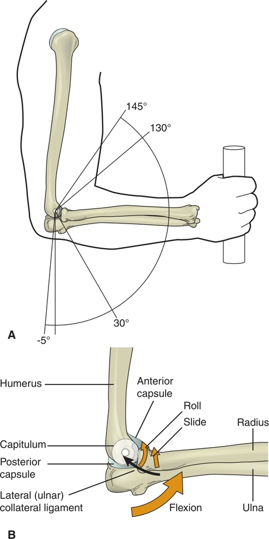

This chapter studies the structures and functions of the elbow complex, which consists of the humeroradial and humeroulnar joints and the proximal and distal radioulnar joints. The elbow complex functions to position the hand in space so that it can accomplish a multitude of tasks ranging from intrinsic fine motor manipulations to powerful grips. The elbow lengthens the arm for reaching and shortens the arm to enable the hand to bring objects to the face (e.g., for eating and grooming). By adding a rotational component of motion, the elbow complex provides a means for the hand to function in all planes. Finally, the elbow complex stabilizes the arm so that the wrist and hand can generate a strong grasp and links the function of the shoulder to the hand.

## ELBOW COMPLEX STRUCTURES

The elbow complex consists of the articulations between the distal humerus, the radius, and the ulna. These bones form the joints of the elbow complex: humeroulnar joint, humeroradial joint, proximal radioulnar joint, and distal radioulnar joint ([Fig. 9.1](https://jigsaw.vitalsource.com/books/9780803675056/epub/OPS/c09.xhtml?favre=brett#fig9-1)). The articulating structures along with the associated ligaments and joint capsules provide static stability to each of the joints. This section first examines the structures and kinematics of each joint in the elbow complex and then looks at the role of the elbow complex muscles in elbow and forearm function.

### BONY STRUCTURES

#### Distal Humerus

The bony structures and landmarks of the proximal portion of the humerus are examined in [Chapter 8](https://jigsaw.vitalsource.com/books/9780803675056/epub/OPS/c08.xhtml). The shaft of the bone runs the length of the arm and flares at its distal aspect, forming the medial epicondyle and lateral epicondyle. These bony projections provide attachment sites for forearm and wrist muscles; this is discussed later in this chapter and in [Chapter 10](https://jigsaw.vitalsource.com/books/9780803675056/epub/OPS/c10.xhtml). The supracondylar ridges are bony ridges superior to the condyles. The hourglass-shaped trochlea and the rounded capitulum lie between the condyles. The trochlear groove divides the trochlea into medial and lateral sides, and the capitulotrochlear groove separates the trochlea from the capitulum. The coronoid fossa is the indentation on the humerus superior to the trochlea. The radial fossa is superior to the capitulum ([Fig. 9.2A](https://jigsaw.vitalsource.com/books/9780803675056/epub/OPS/c09.xhtml?favre=brett#fig9-2)). On the posterior surface of the humerus is an indentation called the olecranon fossa. The radial groove is located on the proximal one third of the humeral shaft ([Fig.9.2B](https://jigsaw.vitalsource.com/books/9780803675056/epub/OPS/c09.xhtml?favre=brett#fig9-2)).

**Figure 9.1** Articulations of the elbow complex.

#### Radius and Ulna

The radius and ulna are the bones in the forearm that articulate with the proximal humerus. These bones lie parallel to each other in the forearm. The proximal radius is termed the radial head and has a concave surface called the fovea. The radial tuberosity is on the radial neck that lies just distal to the radial head. This bony area serves as the attachment site for the biceps brachii.

The proximal articulating surface of the ulna is concave and is called the trochlear notch. The trochlear ridge divides the notch surface into halves. The olecranon process extends from the superior end of the trochlear notch, and the ulnar coronoid process extends from the lower end. Medial to the olecranon process is a groove through which the ulnar nerve transverses. Hitting your “funny bone” in this area can produce a tingling sensation as the ulnar nerve receives the mechanical stimulation. Below the trochlear notch is the ulnar radial notch, which is located on the lateral aspect of the proximal ulna.

**Figure 9.2** **(A)** Anterior structures of the right humerus. **(B)** Posterior view of the right humerus. *(From Roy S, Wolf SL, Scalzitti DA*. The Rehabilitation Specialist’s Handbook, *4th ed. Philadelphia, PA: F. A. Davis Company, 2013: p. 52, with permission.)* ***KIA\***

The distal end of the radius extends to form the radial styloid process on its lateral side and the ulnar notch along its medial border. The ulnar styloid process is a smaller extension of the ulna. Between the ulnar notch and the ulnar head is an articular disc. It is attached to the distal edge of the ulnar notch, the ulnar head, and the base of the styloid process. [Figure 9.3](https://jigsaw.vitalsource.com/books/9780803675056/epub/OPS/c09.xhtml?favre=brett#fig9-3) presents an anterior view of the bony landmarks of the radius and ulna.

### JOINTS

The articulations of the elbow complex include the humeroulnar and humeroradial joints and the proximal and distal radioulnar joints. The humeroulnar and humeroradial joints make up what is typically called the elbow joint. The elbow joint is considered to be a loose hinge joint. The proximal and distal radioulnar joints function as one diarthrodial joint.

#### Humeroulnar and Humeroradial Joints

The ulnar trochlear ridge articulating with the humeral trochlear groove forms the humeroulnar joint. During elbow flexion, the ridge slides along the trochlear groove until the coronoid process reaches the coronoid fossa. In extension, the ridge slides until the olecranon process articulates with the olecranon fossa. The convex humeral capitulum and the concave radial head form the humeroradial joint. During elbow flexion, the radial head slides into the radial fossa. As the elbow reaches full extension, there is no contact between the articular surfaces.

##### **Capsule, Ligaments, and Bursae**

The large, loose capsule of the elbow encompasses the humeroradial, humeroulnar, and proximal radioulnar joints. The loose folds of the capsule allow for expansion as the elbow moves through its full range of motion into flexion. The synovial membrane and fat pads of the capsule line the coronoid, radial, and olecranon fossae. The ulnar or medial collateral ligament (MCL), the radial or lateral collateral ligament (LCL), and the annular ligament reinforce the capsule on its medial and lateral surfaces, adding to the stability of the elbow complex ([Fig. 9.4](https://jigsaw.vitalsource.com/books/9780803675056/epub/OPS/c09.xhtml?favre=brett#fig9-4)).

The medial (ulnar) and lateral (radial) collateral ligaments are located on each side of the elbow hinge joint. They provide medial and lateral stability to the joint. The MCL consists of an anterior, a transverse, and a posterior portion. The anterior portion attaches to the anterior and inferior aspects of the medial humeral epicondyle and distally to the proximal medial ulna. This portion of the ligament counters medial or valgus stresses to the elbow during 20° to 120° of elbow flexion. A **valgus angle** is defined as one where the distal bone of a joint is angled outward, away from the body. A valgus stress results from a stress applied to the lateral side of the elbow that increases the valgus angle at the elbow. A **varus angle** describes the relationship between two bones in which the distal bone is angled toward the midline of the body. A varus stress to the elbow results from a force applied to the medial aspect of the elbow. The posterior portion of the MCL attaches to the posterior aspect of the medial humeral epicondyle and the ulnar coronoid and olecranon processes. This portion of the ligament limits elbow extension. The transverse fibers of the MCL connect the olecranon and the ulnar coronoid processes and help maintain congruent joint surfaces ([Fig. 9.5A](https://jigsaw.vitalsource.com/books/9780803675056/epub/OPS/c09.xhtml?favre=brett#fig9-5)).

**Figure 9.3** Anterior view of the bony landmarks of the radius and ulna. *(From Starkey C, Brown D*. Examination of Orthopedic & Athletic Injuries, *4th ed. Philadelphia, PA: F. A. Davis Company, 2015, p. 691, with permission.)* ***KIA\***

The LCL is a fan-shaped ligament that includes radial and ulnar portions of the ligament. The radial portion attaches to the inferior lateral humeral epicondyle and merges with the annular ligament that surrounds the major portion of the radial head. It blends with the joint capsule and is reinforced by the LCL. The ulnar portion attaches the lateral humeral epicondyle to the lateral ulna and annular ligament. The LCL stabilizes the elbow against a varus stress to the elbow. Along with the annular ligament, the LCL contributes to elbow joint rotational and posterolateral stability ([Fig. 9.5B](https://jigsaw.vitalsource.com/books/9780803675056/epub/OPS/c09.xhtml?favre=brett#fig9-5)).

**Figure 9.4** Anterior view of the elbow joint capsule and associated collateral and annular ligaments.

**Figure 9.5** Collateral ligaments of the elbow complex. **(A)** Medial view of the anterior, posterior, and transverse parts of the medial collateral ligament. **(B)** Lateral view of the two portions of the lateral collateral ligament and the annular ligament. *(From Starkey C, Brown D*. Examination of Orthopedic & Athletic Injuries, *4th ed. Philadelphia, PA: F. A. Davis Company, 2015, p. 691, with permission.)* ***KIA\***

There are seven major bursae in the elbow complex. A large bursa is located between the olecranon and the olecranon fossa. This olecranon bursa disperses forces as the olecranon compresses into the olecranon fossa during elbow extension.

## **Clinical Connection 9.1**

The MCL of the elbow is subject to stress and injury either from a force delivered to the lateral elbow or from repetitive valgus loading. Repetitive valgus loading is common in athletic activities, especially in overhanded pitching motions. During the cocking and acceleration phases of the pitch, the MCL is the most vulnerable to injury. At high loads, the MCL must rely on the triceps brachii, anconeus, wrist flexors, and forearm pronators to increase dynamic stabilization at the elbow. Athletes with this type of injury often complain of pain on the medial aspect of the elbow that worsens during elbow motion. The area can be tender on palpation, and swelling may or may not be present. Factors that make one more prone to this type of injury during athletic activity include inadequate range of motion at the shoulder, throwing technique, weakness of the dynamic muscle stabilizers of the elbow, and overall balance and core stability. Addressing these factors can help prevent this injury.

##### **Kinematics**

Flexion and extension occur at the proximal elbow complex but a small amount of rotation also occurs at the end ranges; thus, the humeroulnar and humeroradial articulations are classified as “modified” hinge joints. Flexion is the motion that decreases the angle between the humerus and the forearm, as when the elbow is bending to bring the hand toward the mouth. Active elbow flexion range of motion averages 145°, and passive ranges increase to 160°, depending on tissue restrictions from contact of the forearm with the arm muscles. Most functional activities require elbow active range of motion between 30° and 130°.

During flexion, the ulnar trochlear notch rolls and glides anteriorly over the trochlear groove ([Fig. 9.6](https://jigsaw.vitalsource.com/books/9780803675056/epub/OPS/c09.xhtml?favre=brett#fig9-6)). The proximal radial head rolls and glides anteriorly over the capitulum during flexion, pulling the head of the radius against the capitulum. The radial head fits into the radial fossa at the end range of elbow flexion.

Full elbow extension can range from neutral to 5° of extension and is limited by the olecranon process and the humeral olecranon fossa making full contact. The angle between the arm and forearm increases during extension, and the trochlear notch rolls and glides posteriorly over the trochlear groove. The radial head reverses the movement that occurs with flexion and rolls and glides posteriorly over the capitulum during elbow extension. Once full extension is reached, the radius has no contact with the humerus.

**Figure 9.6** **(A)** Sagittal view displaying the osteokinematic range of motion of the elbow. In a healthy joint, the average active range of motion is from −5° of extension to 145° of flexion. Passively, the elbow may be flexed further than 145°, depending on the muscle bulk of the anterior arm. Most functional activities require only 30° to 130° of elbow motion in the sagittal plane. **(B)** During elbow flexion, the arthrokinematic motion includes an anterior roll and glide of the ulna.

##### **Carrying Angle**

Elbow flexion and extension occur in the sagittal plane around a frontal axis. This axis runs through the trochlea and capitulum, but because the trochlea is more distal than the capitulum, the axis is slightly off from the horizontal in a medial-lateral direction. This oblique line creates an angle commonly called the carrying angle ([Fig. 9.7](https://jigsaw.vitalsource.com/books/9780803675056/epub/OPS/c09.xhtml?favre=brett#fig9-7)), putting the elbow in a normal valgus position referred to as cubital valgus. Cubital valgus positions the forearm slightly lateral to the humerus when the elbow is extended and in the anatomical position. Cubital varus, in which the forearm is medial to the humerus, is not a typical position and usually is the result of a distal humeral fracture. The carrying angle varies but is approximately 15°. Women, on average, have a carrying angle 2°greater than men. The carrying angle may assist with the biomechanical efficiency of bringing the hand to the mouth. When a person is carrying objects in the hand, the angle tends to keep objects away from the side of the body.

**Figure 9.7** **(A)** The average carrying angle of the elbow is approximately 15°. **(B)** Excessive cubital valgus represents an angle between the humerus and the forearm of greater than 15°. **(C)** Cubital varus represents a position of the forearm that is deviated medially past the midline of the humerus. ***KIA\***

#### Proximal and Distal Radioulnar Joints

The ulnar radial notch, the radial head, the annular ligament, and the humeral capitulum form the proximal radioulnar joint that lies within the elbow joint capsule. The annular ligament, which is lined with articular cartilage, encircles the radial head and attaches to the anterior and posterior aspects of the radial notch. The cartilaginous surface allows the radius to pivot around the ulna with minimal friction during forearm movement. Distally, the ulnar notch of the radius, the articular disc, and the ulnar head form the distal fibrous radioulnar joint. The articular disc has a concave surface on its proximal and distal surfaces. Its proximal side articulates with the ulnar head, and the distal surface is in contact with the carpal bones. [Figure 9.8](https://jigsaw.vitalsource.com/books/9780803675056/epub/OPS/c09.xhtml?favre=brett#fig9-8) depicts the proximal and distal radioulnar joints and their articulating surfaces.

##### **Ligaments**

Between the shaft of the radius and ulna is an interosseous membrane that stabilizes both the proximal and the distal radioulnar joints. The annular ligament, quadrate ligament, and oblique cord provide further support to the proximal radioulnar joint. The annular ligament that encompasses the radial head was discussed earlier in this chapter. The quadrate ligament attaches the ulna to the neck of the radius maintaining alignment between the radial notch of the ulna and the radius. The oblique cord runs from the ulna inferiorly to below the bicipital tuberosity on the radius. The dorsal radioulnar ligament and the palmar radioulnar ligament provide stability to the distal radioulnar joint. Their fibers attach from the dorsal and palmar surfaces of the ulnar notch of the radius to the ulna and ulnar styloid process ([Fig. 9.9](https://jigsaw.vitalsource.com/books/9780803675056/epub/OPS/c09.xhtml?favre=brett#fig9-9)).

**Figure 9.8** **(A)** Frontal view of the proximal radioulnar and distal radioulnar joints. **(B)** Superior view of the proximal radioulnar joint. **(C)** Anterior view of the distal radioulnar joint.

##### **Kinematics**

Movement at the distal radioulnar joint always accompanies movement at the proximal radioulnar joint. These two joints move together to produce 1° of movement: pronation and supination. During forearm pronation and supination, the radius pivots around a stationary ulna. This movement occurs in the transverse plane around a vertical axis ([Fig. 9.10](https://jigsaw.vitalsource.com/books/9780803675056/epub/OPS/c09.xhtml?favre=brett#fig9-10)). At the end range of forearm supination, the palm of the hand is facing upward. The average range of motion for supination is 85° to 90°.

During pronation, which averages 75° to 80°, the forearm rotates so that the hand is facing downward ([Fig. 9.11](https://jigsaw.vitalsource.com/books/9780803675056/epub/OPS/c09.xhtml?favre=brett#fig9-11)). Because of the hand’s articulation with the radius at the radiocarpal joint, the hand follows the radius during forearm rotation. Pronation and supination occur as the radial head spins within the articular surface formed by the inner annular ligament and the radial notch of the ulna at the proximal radioulnar joint. Simultaneously, movement occurs at the distal radioulnar joint. During forearm pronation, the ulnar notch of the distal radius rolls and slides anteriorly over the rounded head of the ulna. The joint’s articular disc follows in the same direction as the radius. The direction of the radius roll and slide reverses during supination (see [Fig. 9.10](https://jigsaw.vitalsource.com/books/9780803675056/epub/OPS/c09.xhtml?favre=brett#fig9-10)).

**Figure 9.9** **(A)** Anterior view of the proximal and distal radioulnar ligamentous structures. **(B)** Distal end of the radioulnar joint. *(From Starkey C, Brown D*. Examination of Orthopedic & Athletic Injuries, *4th ed. Philadelphia, PA: F. A. Davis Company, 2015, p. 691, with permission.)*

## ELBOW COMPLEX MUSCLES

The muscles acting on the elbow complex produce flexion and extension at the elbow and forearm pronation and supination. Several of the muscles contribute to more than one action and act on more than one joint. To gain an understanding of multiple actions of muscles, it is necessary to grasp some basic concepts related to muscle function. Consider the fact that a muscle must cross a joint to act on the joint. For example, at the elbow, the long head of the biceps attaches to the supraglenoid fossa of the scapula and crosses over the shoulder joint and the humeroulnar joint before attaching distally to the radius. Because of these attachments, the biceps is able to flex the shoulder, flex the elbow, and supinate the forearm. Another concept to embrace is the fact that a muscle must attach to a bone to move it. In the elbow complex, this means that because during pronation and supination the radius rotates around the ulna, muscles that attach to the radius can contribute to pronation and supination even though they produce other movements at the elbow. This section examines the primary muscle movers of the elbow complex. [Appendix B](https://jigsaw.vitalsource.com/books/9780803675056/epub/OPS/c10-AppB.xhtml), which follows [Chapter 10](https://jigsaw.vitalsource.com/books/9780803675056/epub/OPS/c10.xhtml), provides detailed descriptions of muscle origins, insertions, and innervations related to the elbow complex.

## **Clinical Connection 9.2**

A sudden pull on an extended elbow when the forearm is pronated can result in radial head subluxation and annular ligament displacement. This injury is referred to as nursemaid’s elbow, annular ligament displacement, pulled elbow, or radial head subluxation. It is often seen in young children and occurs when an adult is holding a child’s hand when the child stumbles and falls. As the adult pulls on the child’s arm to try to prevent the fall, the child’s radial head is pulled from its articulation with the proximal humerus. This injury is a common reason for emergency department visits in young children.

### ELBOW FLEXORS

The muscles primarily responsible for elbow flexion are the biceps brachii, brachialis, and brachioradialis. To a much lesser degree, wrist flexor muscles, along with pronator teres, can contribute to this motion. The primary function of pronator teres is discussed later in this chapter, and the wrist muscles are introduced in [Chapter 10](https://jigsaw.vitalsource.com/books/9780803675056/epub/OPS/c10.xhtml). During open chain elbow flexion, the humerus is stationary while the forearm moves toward the humerus, decreasing the angle between the two body segments. In closed chain flexion, the distal segment is planted on a surface, and the humerus moves toward the forearm. The chin-up exercise is an example of the distal segment being fixed and the elbow flexors pulling the forearm toward the humerus.

#### Biceps Brachii

The biceps brachii consists of two muscle heads: the long head and the short head. The long head of the biceps originates on the scapula at the supraglenoid tubercle in the glenoid fossa. The short head originates at the coracoid process of the scapula. Because the long head is the only portion of the muscle that travels through the humeral bicipital groove to cross the shoulder joint to attach to the scapula, it is the only head that acts on the shoulder to produce shoulder flexion. The two heads of the biceps traverse down the arm and fuse to form one belly before attaching as one tendon to the radius ([Fig. 9.12](https://jigsaw.vitalsource.com/books/9780803675056/epub/OPS/c09.xhtml?favre=brett#fig9-12)). The biceps brachii are selectively activated during movement that requires elbow flexion and forearm supination and have the ability to produce the greatest torque between 90° and slightly more than 100° of flexion.

**Figure 9.10** **(A)** Anterior view of orthokinematic forearm supination and arthrokinematic motion of the radius rotating around the fixed ulna. **(B)** Anterior view of orthokinematic forearm pronation and the radius rolling and sliding on the fixed ulna. *(From Starkey C, Brown D*. Examination of Orthopedic & Athletic Injuries, *4th ed. Philadelphia, PA: F. A. Davis Company, 2015, p. 732, with permission.)*

**Figure 9.11** Range of motion of forearm pronation and supination.

**Figure 9.12** Anterior view of the long and short head of biceps brachii and brachioradialis. ***KIA\***

During functional activities that require a large flexion force, combining elbow flexion with shoulder extension enhances the ability of the biceps to produce a force. An example of this motion is during a resisted pulling activity. As the posterior deltoid extends the shoulder, it enhances the force potential of the biceps. The extended position reduces the net shortening of the biceps and slows its contraction velocity. As discussed in [Chapter 3](https://jigsaw.vitalsource.com/books/9780803675056/epub/OPS/c03.xhtml), the slower the velocity of a muscle contraction, the greater force it can produce.

**Figure 9.13** Anterior view of brachialis, which lies deep to the biceps brachii. ***KIA\***

#### Brachialis

The brachialis muscle is considered the “workhorse” of the arm because of its large cross-sectional area. The muscle lies deep to the biceps, originating on the distal half of the humerus. Because it attaches to the ulna, not the radius, it is always recruited during elbow flexion whether the forearm is pronated or supinated and regardless of the angle of the elbow or force required to perform the task. Because the brachialis crosses only one joint, the elbow, it acts only on the elbow. The brachialis muscle is able to exert its greatest force at approximately 90° of elbow flexion ([Fig. 9.13](https://jigsaw.vitalsource.com/books/9780803675056/epub/OPS/c09.xhtml?favre=brett#fig9-13)).

#### Brachioradialis

The brachioradialis muscle attaches proximally on the lateral supracondylar ridge of the humerus. Its muscle belly is located mainly in the forearm before the muscle attaches distally to the radial styloid process. The brachioradialis generates maximum torque between 100° and 120° of elbow flexion as it flexes the elbow and rotates the forearm into a neutral position. This elbow flexor also has a secondary role in forearm pronation and supination because of its radius attachment. Because of its distal attachment and line of force, a component of its torque compresses the joint and increases joint stability (see [Fig. 9.12](https://jigsaw.vitalsource.com/books/9780803675056/epub/OPS/c09.xhtml?favre=brett#fig9-12)).

### ELBOW EXTENSORS

The triceps brachii is the primary muscle group responsible for elbow extension. The anconeus contributes to this action but contributes only a small percentage of the total force. During open chain elbow extension, the forearm moves away from the arm as the angle between the two increases. With closed chain extension, the distal segment is stable on a surface, and the forearm moves away from the humerus. An example of closed chain elbow extension is when the elbow extends during a prone push-up, in which the hands are weight bearing on a surface. The anconeus muscle acts as an accessory extensor muscle to the elbow.

Functionally, the elbow extensors provide static stability to the elbow during daily tasks. Often we bear weight through the arm with the elbow positioned in slight flexion. This position occurs when supporting the body on one arm while performing tasks with the opposite upper limb, or when pushing an object along with the upper extremities. By means of an isometric contraction or even a low-velocity eccentric contraction, the extensors maintain the flexed position of the elbow during these tasks. The extensors can also produce high-velocity, high-power work during activities such as throwing a ball or pushing a heavy object. When the shoulder flexors are active during elbow extension, they counter the function of the long head of the triceps to extend the shoulder.

#### Triceps Brachii

The triceps brachii has three muscle heads: the long head, the medial head, and the lateral head. The long head of the triceps originates on the infraglenoid tubercle of the scapula glenoid fossa. Because it crosses the shoulder joint, it assists with shoulder extension in addition to extending the elbow. The lateral and medial heads of the triceps originate on the respective sides of the posterior humerus; the medial head is deep to the long and lateral heads. The three portions of the triceps brachii converge to form a common tendon that attaches to the ulna via the olecranon process ([Fig. 9.14](https://jigsaw.vitalsource.com/books/9780803675056/epub/OPS/c09.xhtml?favre=brett#fig9-14)).

#### Anconeus

The anconeus is a small triangular muscle on the posterolateral aspect of the elbow. Its fibers are located between the lateral epicondyle of the humerus and blend with the posterolateral joint capsule of the elbow. Although the anconeus contributes only a small portion of extensor force because of its small cross-sectional area, it contributes to the joint’s lateral stability ([Fig. 9.14](https://jigsaw.vitalsource.com/books/9780803675056/epub/OPS/c09.xhtml?favre=brett#fig9-14)).

With regard to the elbow extensors, there appears to be a general hierarchy in terms of which muscles are recruited to perform elbow extension in a specific task. This pattern of recruitment has been referred to as the law of parsimony. The law states that the number of muscle fibers recruited by the nervous system depends on the amount of torque needed to complete the task. The nervous system recruits the fewest muscles needed. Activities that require minimal extensor forces most likely involve just the anconeus and the medial head of the triceps. The nervous system recruits additional extensor fibers as needed if a greater force is required to complete a given task. As demands increase, the lateral head and the long head of the triceps are recruited to provide the forces needed for elbow extension. For example, the nervous system recruits far fewer elbow extensor fibers to extend the elbow to reach for a pencil than it would recruit to lift the body weight off the floor when extending the elbows during a prone push-up.

### FOREARM SUPINATORS AND PRONATORS

The biceps brachii and the supinator are the primary supinator muscles of the forearm. The supinator originates on the lateral humeral epicondyle, the lateral collateral and annular ligaments, and the ulna and attaches to the proximal one third of the radius ([Fig. 9.15](https://jigsaw.vitalsource.com/books/9780803675056/epub/OPS/c09.xhtml?favre=brett#fig9-15)). The supinator is twisted around the radius and supplies sufficient torque for forearm supination when the movement occurs slowly or against minimal resistance. When moderate or heavy force is required, the biceps brachii is activated in addition to the supinator and can generate the greatest torque when the elbow is flexed to approximately 90°. The brachioradialis plays a small role as a secondary supinator. When the forearm is in full pronation, the brachioradialis assists in rotating the forearm to midrange between full pronation and supination.

The pronator teres and pronator quadratus are the muscles primarily responsible for forearm pronation. The pronator teres originates on the medial epicondyle of the humerus, inserting on the lateral surface of the middle radial shaft. The median nerve passes right through the belly of the muscle, which can be a site for nerve compression. The pronator teres works with the pronator quadratus to rotate the radius around the ulna during forearm pronation. The pronator quadratus originates at the distal end of the forearm on the anterior surfaces of the ulna and radius. It produces forearm pronation and provides dynamic stabilization to the distal radioulnar joint ([Fig. 9.16](https://jigsaw.vitalsource.com/books/9780803675056/epub/OPS/c09.xhtml?favre=brett#fig9-16)).

**Figure 9.14** **(A)** Posterior view of the long and lateral heads of the triceps brachii and the anconeus. **(B)** Posterior view of the medial head of the triceps brachii with the long and lateral heads of the triceps resected. ***KIA\***

**Figure 9.15** Lateral view of the supinator muscle. ***KIA\***

During many functional activities, forearm pronation and supination are associated with medial and lateral rotation at the glenohumeral joint. Shoulder lateral rotation is often paired with forearm supination, whereas medial rotation occurs with forearm pronation. Adding the rotary movement of the two joints allows the hand to perform tasks throughout approximately a 360° arc compared with the available 180° provided from supination and pronation alone.

**Figure 9.16** Anterior view of pronator teres and pronator quadratus. ***KIA\***

## MUSCLE RECRUITMENT DURING FUNCTIONAL ACTIVITIES

As noted in previous chapters, although muscle function is first studied individually, muscles must be examined together, as they function in unison to perform tasks. Isolated muscle contractions rarely occur during functional activities. Proximal muscles often stabilize joints so that more distal joints can move on a stable base. The elbow cannot flex and bring the hand to the mouth during eating unless the shoulder complex is providing a relatively stable unmovable base. Both the elbow flexors and the extensors may cocontract to stabilize the elbow when a forceful grip is needed. [Table 9.1](https://jigsaw.vitalsource.com/books/9780803675056/epub/OPS/c09.xhtml?favre=brett#tab9-1) lists mean ranges of motion at the elbow and forearm required for common functional activities.

| **TABLE 9.1** Elbow and Forearm Motions During Functional Activities[*](https://jigsaw.vitalsource.com/books/9780803675056/epub/OPS/c09.xhtml?favre=brett#ftn1) |                             |               |                |
| ------------------------------------------------------------ | --------------------------- | ------------- | -------------- |
| **Activity**                                                 | **Flexion Range of Motion** | **Pronation** | **Supination** |
| Use a telephone                                              | 43–136                      | 41            | 23             |
| Rise from a chair                                            | 20–95                       | 34            | 24             |
| Drink from a cup                                             | 72–129                      | −3            | 31             |
| Eat with a fork                                              | 85–128                      | 10            | 52             |
| Eat with a spoon                                             | 101–123                     | 23            | 59             |

[*](https://jigsaw.vitalsource.com/books/9780803675056/epub/OPS/c09.xhtml?favre=brett#ftn1a)*All values are mean values in degrees.*

Which muscles must act in synergy to complete a given task depends on the demands of the task in terms of the speed, force, and direction required. For example, when forearm supination is needed against resistance, such as when tightening a screw with a screwdriver, the biceps assist the supinator to provide enough force to accomplish the task. However, if the biceps were unopposed, the elbow would also flex during the motion, pulling the screwdriver away from the screw. The triceps is also recruited during this task to oppose the flexion component of the biceps. Because of the cocontraction of the biceps and the triceps, the elbow is maintained in a static flexed position while forearm supination rotates the screwdriver. The scapulothoracic and glenohumeral muscles stabilize proximally so that the shoulder complex is not moving during the forearm motion. The wrist and hand muscles stabilize the grip on the screwdriver as the forearm rotates the screwdriver ([Fig. 9.17](https://jigsaw.vitalsource.com/books/9780803675056/epub/OPS/c09.xhtml?favre=brett#fig9-17)).