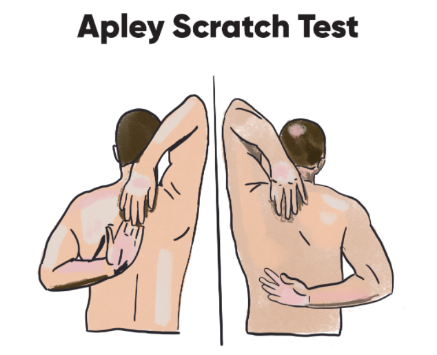

# C4

+ Accountability

  Being held responsible to an organization or another individual to achieve a desired outcome.

+ Cycle of accountability: 

  + accountability
  + Data collection
    + physical data
    + performance data
    + lifestyle data: how much fatigue or stress they feel on a scale of 1-10
    + Comments
  + outcome goals
  + process goals

Examples of Accountability Data to Collect

| **Physical**                                 | **Performance**                                              | **Lifestyle**                           | **Comments**                                               |
| -------------------------------------------- | ------------------------------------------------------------ | --------------------------------------- | ---------------------------------------------------------- |
| Age                                          | Heart Rate                                                   | Sleep Hygiene (Quality and/or Quantity) | (Provide a space for clients to provide general comments.) |
| Height                                       | HRV                                                          | Hydration                               |                                                            |
| Weight                                       | Strength Increases                                           | Fatigue Score                           |                                                            |
| Circumference Measurements                   | Volume (Reps/Sets) Increases                                 | Mediation                               |                                                            |
| Body Fat %                                   | ROM/Mobility Improvement                                     | Supplement Tracking                     |                                                            |
| Progress Pictures                            | Jump Measures (Height, Distance, Repetitions, etc.) Increase | Alcohol/Drug Use                        |                                                            |
| Balance Measures Improvements                | Stress Score                                                 |                                         |                                                            |
| Running Metrics (Distance, Time, Pace, etc.) |                                                              |                                         |                                                            |
| Compliance Ratings                           |                                                              |                                         |                                                            |

Analyzing Fitness Professional Feedback

| **Quotes**                                                   | **Comments**                                                 |
| ------------------------------------------------------------ | ------------------------------------------------------------ |
| *Based on your comments, I could sense you were not very happy with your check-in this week. To me, the most encouraging part was you writing “I’ll try better next week.”* | One should always strive to find the most positive attributes in the client's comments. In this instance, the client expressed desire to want to do better. Fitness professionals should always start an email on a clear and positive note. |
| *It’s always hard to say exactly what helps or hinders achieving a goal, but we do know from research a lack of sleep can change hunger levels—leading to overeating of high-calorie, low-nutrient foods. By the way, if you’d like to see some of that research, feel free to ask.* | Fitness professionals should do the best they can to stay up-to-date on current research to be better able to answer clients’ questions. Clients do not always want to read the research themselves and that is okay. However, fitness professionals should be willing and able to back up their programs, strategies, feedback, and suggestions with research that supports them. |
| *Again, it’s typical and normal, but if you know or are aware you do it, you can practice more mindfulness to avoid it if the situation comes up again.* | Clients can often feel alone and nervous when trying to achieve their goals. Discourage feelings of failure and inadequacy. |
| *Keep up the effort and don’t let this week discourage you!* | Fitness professionals should strive to keep an energetic and upbeat disposition and always end their communication on an encouraging, positive note. |

+ Affirmations

  A positive statement highlighting traits, characteristics, actions, behaviors, etc.

+ Empathy
  The ability to imagine oneself in the position of another and to relate to a person from this frame of reference while trying to understand why they think and feel the way they do when viewed from their standpoint and experiences.

## Motivational interviewing

An empathetic, collaborative, and client-centered approach to communication designed to help counsel clients through ambivalence and support positive change.

+ State of change model

  + **Precontemplation** – At this stage, an individual is not yet aware or is unwilling to accept that a change is needed. They are likely hanging on to their current behaviors and have not yet found intrinsic motivation to change but may have pressure from other sources to make change.
  + **Contemplation** – The client has started to become aware that a change is needed, but they are struggling with the pros and cons of doing so, the amount of effort that may be required of them, or what they may have to sacrifice to see change.
  + **Preparation** – This is the stage where serious consideration starts to take place and even a desire to begin taking steps to make change. At this point, they are starting to think about what they can do to bring about change but may still be struggling with knowing where to begin. The desire for change is there.
  + **Action** – Here they start taking physical action, moving beyond the stages of mental effort to actually taking steps to implement the changes that, until this point, have only been considerations. For many, this will be the most difficult stage as it is the “first step,” so to speak, and where they will have to put forth the greatest commitment to keep momentum.
  + **Maintenance** – At this point, the client has been consistent with their new behaviors for at least 6 months (Rubak et al., 2005) and it is becoming an integrated part of their lifestyle. Getting here does not mean they will stay here, though, and, if they have not been focused on a sustainable approach, they are still at risk of relapse to old behaviors.

+ Ambivalence

  A state of mind in which an individual may have conflict, disinterest, or resistance regarding an outcome or individual.

+ Change talk

  Language that supports behavior change.

+ Change Talk Versus Sustain Talk

  | **Change Talk**                                              | **Sustain Talk**                                             |
  | ------------------------------------------------------------ | ------------------------------------------------------------ |
  | I’m struggling with finding the perfect balance, but I know it’s something I’ll do. | Maybe this isn’t for me?                                     |
  | I get tired and this is hard, but I think this is worth doing. | I’ve accepted I’m not young anymore and I have to let go of a lot of dreams. |
  | I guess learning new things is part of this process, right?  | I just want to live a normal life again!                     |
  | There are moments of sacrifice, but I know the results are worth it. | I’m not sure why I’m even doing this.                        |

+ Discord

  A breach in the fitness professional–client relationship that can pull attention away from the original relationship intention.

## C5

+ Virtual Assessments

  | **Assessment Type**             | **Description**                                              | **Examples**                                                 |
  | ------------------------------- | ------------------------------------------------------------ | ------------------------------------------------------------ |
  | Questionnaire/Survey            | A specific set of questions to assess an individual’s goals, health status, or lifestyle habits | PAR-Q+Health History QuestionnaireDietary Assessment Forms   |
  | Physiological                   | An evaluation of certain physical and physiological characteristics | Heart rateBlood pressureCardiorespiratory FitnessAnthropometric |
  | Posture, Movement, and Mobility | An evaluation of an individual’s movement pattern quality, neuromuscular control, and/or range of motion | Static PostureApley scratch testOverhead squatSingle-leg squatPushing/pulling |
  | Muscular Endurance              | An evaluation of muscular strength with respect to time or repetitions until fatigue or compensation | Push-upPlank testWall sit test                               |

### Physiological assessment 

+ Caution
  + First thing in the morning, ideally at the same time each day, in the same outfit
  + In the same position each time – Results can be significantly different in a seated versus standing position.
  + No earlier than 2 hours following exercise or a stressful event
  + No earlier than 1 hour after consuming caffeine
  + Using the same data collection method, instructions, and equipment
+ Anthropometric Assessments
  + Scale weight
  + Body Mass Index
    + Metric Formula: BMI = weight (kg) ÷ [height (m)]2
    + Imperial Formula: BMI = 703 x weight (lbs.) ÷ [height (in)]2
  + Waist-to-hip ratio
    +  obesity as a WHR above 0.90 in males and above 0.85 in
    + Waist
      + Identify the narrowest point of the torso below the rib cage and above the iliac crest (top portion of the hip bone) at the hips.
      + Take this measurement as close to the skin as possible.
      + Be sure the tape runs horizontally around the entire body circumference.
      + Keep the tape flat and avoid any twisting.
      + The tape should be pulled snugly but not to the point of causing an indentation in the skin.
      + Take the waist measurement at end-tidal volume, following normal expiration.
      + Record scores to nearest millimeter or 1/16”.
    + hip
      + Stand straight with feet together and locate the widest portion of the hips, often at the level of the mid-buttocks.
      + Wrap the measuring tape snugly around this area, ensuring that the measuring tape is level and not angled. The measuring tape should not be pulled so tight as to compress the skin.
      + Record the hip measurement.
      + Take the measurement at least twice to ensure accuracy. If the values do not match, perform until repeatable measurements are obtained.

Circumference Measurement Sites

| **Site**   | **Description of Location**                                  | **Placement of Measuring Tape**                       |
| ---------- | ------------------------------------------------------------ | ----------------------------------------------------- |
| **Neck**   | Measure just below the larynx (across the Adam’s apple for men). |  |
| **Chest**  | Measure across the fullest part of chest.                    |  |
| **Waist**  | Measure at the narrowest point of the waist, below the rib cage and just above the top of the hipbones. If there is no apparent narrowing of the waist, measure at the navel. |  |
| **Hips**   | With feet together, measure circumference at the widest portion of the buttocks. |  |
| **Thigh**  | While standing, legs 10 cm (4”) apart, measure the largest circumference immediately below the gluteal fold. |  |
| **Calves** | Measure the calf at its fullest part, taken between the ankle and the knee. |  |
| **Arm**    | Measure the upper arm at its fullest part, taken at midpoint between the shoulder and elbow. |  |

### Movement and mobility assessments

#### Apley Scratch Test

+  upper extremity mobility limitations 

### Muscular endurance assessmsnts

