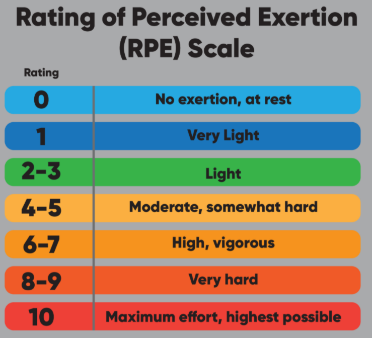

# Implementing Coaching Sessions

+ Accountability structures
  A framework outlining the terms or conditions of an agreement between two parties.
+ camera angles positioned at eye-level (Figure: Camera Angles) were shown to have positive effects on viewer perceptions of trustworthiness
+ Pre-session instruction is best suited for the following activities: 
  - Pre-recorded workouts
  - Group fitness settings 
  - Circuits
  - HIIT training
  - Time-based intervals
+ 

+ The following are examples of exercise cues for primary movements:

  Bodyweight Squat:

  ●       “Drive your butt back like you are sitting into a chair.”

  ●       “Lift your chest up tall and proud.”

  ●       “Drive your knees away from each other.”

  ●       “Screw your feet into the floor.”

  ●       “Press the floor away from you.”

  Push-Up:

  ●       “Pull your belly button back to your spine.”

  ●       “Imagine you are a stiff board from head to heel.”

  ●       “Push the floor away from you.”

  Bent Over Row:

  ●       “Unlock your knees and hinge at the waist.”

  ●       “Imagine a string is pulling your elbows straight up toward the ceiling.”

  ●       “Keep your back flat; imagine your spine is a stiff pole.”